# AI 引擎管理

<cite>
**本文引用的文件**
- [engineStore.ts](file://src/stores/engineStore.ts)
- [ipc.ts](file://src/lib/ipc.ts)
- [types.ts](file://src/types.ts)
- [chatEngineIds.ts](file://src/lib/chatEngineIds.ts)
- [engineCapabilities.ts](file://src/components/chat/engineCapabilities.ts)
- [mod.rs](file://src-tauri/src/engines/mod.rs)
- [claurst_native.rs](file://src-tauri/src/engines/claurst_native.rs)
- [claude_sidecar.rs](file://src-tauri/src/engines/claude_sidecar.rs)
- [codex.rs](file://src-tauri/src/engines/codex.rs)
- [opencode.rs](file://src-tauri/src/engines/opencode.rs)
- [engines.rs](file://src-tauri/src/commands/engines.rs)
- [claurst-vendor-integration.md](file://claurst-vendor-integration.md)
- [README.md](file://vendor/claurst/README.md)
- [OpenCodeAgentPicker.tsx](file://src/components/chat/OpenCodeAgentPicker.tsx)
</cite>

## 更新摘要
**所做更改**
- 移除旧的 Claude Code Native 引擎实现，新增 Claurst 原生引擎架构说明
- 更新代理运行时系统章节，反映从 claude-code-native 到 claurst-native 的架构迁移
- 新增 panes-agent 通用代理运行时框架，替代 claude-code-rust 专用实现
- 更新引擎管理器对新 claurst_native 模块的集成方式
- 新增 CueLight 影视模式与本地工具链的完整集成说明
- 更新前端引擎选择器组件分析，包含新的 claurst-native 引擎

## 目录
1. [引言](#引言)
2. [项目结构](#项目结构)
3. [核心组件](#核心组件)
4. [架构总览](#架构总览)
5. [详细组件分析](#详细组件分析)
6. [代理运行时系统](#代理运行时系统)
7. [依赖关系分析](#依赖关系分析)
8. [性能考量](#性能考量)
9. [故障排查指南](#故障排查指南)
10. [结论](#结论)
11. [附录](#附录)

## 引言
本文件系统化阐述 Panes 的 AI 引擎管理系统，覆盖多引擎架构设计、引擎抽象层、生命周期管理与健康检查机制，并详解 Claude、Codex、OpenCode 等引擎的集成方式、配置选项与使用限制。文档还包含引擎选择策略、负载均衡与故障转移思路、性能监控建议、扩展指南、自定义引擎集成方法与调试技巧，以及引擎间数据格式转换、消息路由与状态同步的实现要点。

**更新重点**：本次更新重点关注从 claude-code-native 到 claurst-native 的架构迁移，全新的 panes-agent 通用代理运行时框架，以及基于 clean-room 重构的全新引擎实现。

## 项目结构
- 前端（React + TypeScript）
  - 引擎状态与健康检查：src/stores/engineStore.ts
  - IPC 通道封装与事件监听：src/lib/ipc.ts
  - 类型定义与引擎能力：src/types.ts、src/components/chat/engineCapabilities.ts、src/lib/chatEngineIds.ts
  - OpenCode Agent 选择器：src/components/chat/OpenCodeAgentPicker.tsx
- 后端（Rust Tauri）
  - 引擎抽象与统一管理：src-tauri/src/engines/mod.rs
  - 新的代理运行时系统：src-tauri/src/engines/claurst_native.rs
  - 传统引擎实现：claude_sidecar.rs、codex.rs、opencode.rs
  - 命令层（IPC 映射）：src-tauri/src/commands/engines.rs

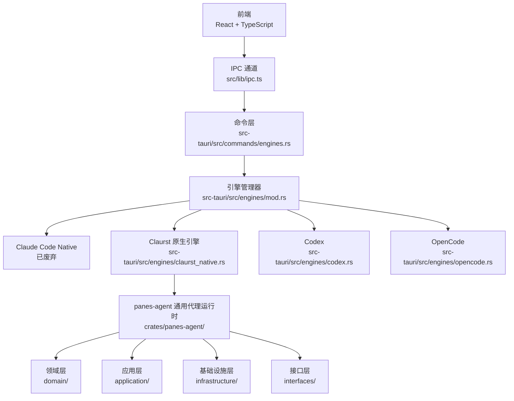

**图表来源**
- [ipc.ts:336-340](file://src/lib/ipc.ts#L336-L340)
- [engines.rs:96-136](file://src-tauri/src/commands/engines.rs#L96-L136)
- [mod.rs:463-478](file://src-tauri/src/engines/mod.rs#L463-L478)
- [claurst_native.rs:118-195](file://src-tauri/src/engines/claurst_native.rs#L118-L195)
- [claude_sidecar.rs:1-120](file://src-tauri/src/engines/claude_sidecar.rs#L1-L120)
- [codex.rs:1-120](file://src-tauri/src/engines/codex.rs#L1-L120)
- [opencode.rs:1-120](file://src-tauri/src/engines/opencode.rs#L1-L120)

**章节来源**
- [engineStore.ts:1-164](file://src/stores/engineStore.ts#L1-L164)
- [ipc.ts:336-340](file://src/lib/ipc.ts#L336-L340)
- [types.ts:153-169](file://src/types.ts#L153-L169)
- [engineCapabilities.ts:1-69](file://src/components/chat/engineCapabilities.ts#L1-L69)
- [chatEngineIds.ts:1-8](file://src/lib/chatEngineIds.ts#L1-L8)
- [mod.rs:463-478](file://src-tauri/src/engines/mod.rs#L463-L478)
- [claurst_native.rs:118-195](file://src-tauri/src/engines/claurst_native.rs#L118-L195)
- [claude_sidecar.rs:1-120](file://src-tauri/src/engines/claude_sidecar.rs#L1-L120)
- [codex.rs:1-120](file://src-tauri/src/engines/codex.rs#L1-L120)
- [opencode.rs:1-120](file://src-tauri/src/engines/opencode.rs#L1-L120)

## 核心组件
- 引擎抽象与统一接口
  - 抽象 trait 定义：引擎标识、名称、模型列表、可用性、线程生命周期、消息发送/中断、审批响应、归档/恢复等。
  - 统一管理器：EngineManager 聚合各引擎实例，提供 list_engines、health、prewarm、线程启动与消息转发等入口。
- 健康检查与状态
  - 前端 store：加载引擎清单、触发健康检查、合并诊断、应用运行时更新事件。
  - 后端命令：执行外部命令检查、收集输出与耗时，返回标准化结果。
- 数据模型与能力
  - 引擎信息、模型信息、健康报告、协议诊断、权限模式、沙箱模式、审批决策集合等类型定义。
  - 引擎能力映射：不同引擎支持的权限模式、沙箱模式、审批决策集合。

**章节来源**
- [mod.rs:419-461](file://src-tauri/src/engines/mod.rs#L419-L461)
- [mod.rs:463-605](file://src-tauri/src/engines/mod.rs#L463-L605)
- [engineStore.ts:23-163](file://src/stores/engineStore.ts#L23-L163)
- [engines.rs:96-136](file://src-tauri/src/commands/engines.rs#L96-L136)
- [types.ts:448-509](file://src/types.ts#L448-L509)
- [engineCapabilities.ts:1-69](file://src/components/chat/engineCapabilities.ts#L1-L69)

## 架构总览
Panes 采用"前端状态 + IPC + 后端引擎"的分层架构：
- 前端通过 IPC 调用后端命令，后端命令层将请求转交至 EngineManager，由具体引擎实现执行。
- 引擎内部维护线程状态、会话与事件流，通过 mpsc 通道向前端回传事件。
- 健康检查贯穿前后端：前端发起检查，后端执行外部命令并返回结果，前端据此渲染 UI 与修复建议。

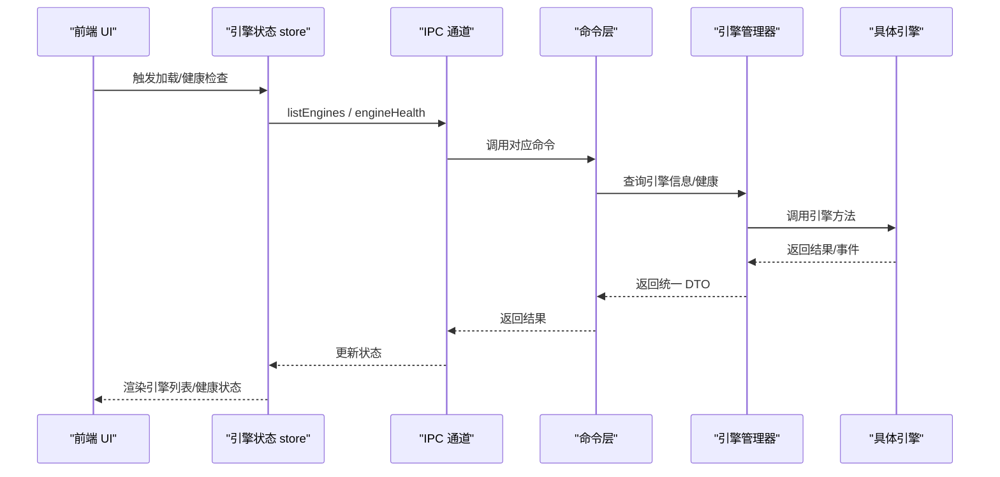

**图表来源**
- [engineStore.ts:29-57](file://src/stores/engineStore.ts#L29-L57)
- [ipc.ts:336-340](file://src/lib/ipc.ts#L336-L340)
- [engines.rs:96-136](file://src-tauri/src/commands/engines.rs#L96-L136)
- [mod.rs:484-605](file://src-tauri/src/engines/mod.rs#L484-L605)

## 详细组件分析

### 引擎抽象层与统一管理
- 抽象接口
  - Engine trait 定义了引擎的核心能力：id、name、models、is_available、start_thread、send_message、steer_message、respond_to_approval、interrupt、archive/unarchive。
- EngineManager
  - 聚合四个引擎实例：Codex、Claude 侧车、Claurst 原生、OpenCode。
  - 提供 list_engines、health、prewarm、线程启动与消息转发、远程线程管理、运行时目录查询等统一入口。
  - 支持超时降级与运行时模型缓存，提升稳定性。

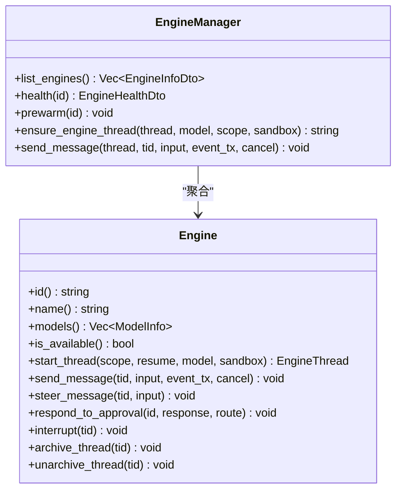

**图表来源**
- [mod.rs:419-461](file://src-tauri/src/engines/mod.rs#L419-L461)
- [mod.rs:463-783](file://src-tauri/src/engines/mod.rs#L463-L783)

**章节来源**
- [mod.rs:419-461](file://src-tauri/src/engines/mod.rs#L419-L461)
- [mod.rs:463-783](file://src-tauri/src/engines/mod.rs#L463-L783)

### Claurst 原生引擎（Claurst Native）
**更新**：Claude Code Native 引擎已废弃，新的 Claurst 原生引擎采用全新的 panes-agent 通用代理运行时框架。

- **引擎标识与名称**
  - 引擎 ID："claurst-native"
  - 显示名称："CueLight Agent"
  - 支持的模型：Anthropic Messages API、OpenAI 兼容 API、OpenRouter、Ollama

- **代理运行时架构**
  - 基于 panes-agent 通用代理运行时框架，采用 DDD 分层设计
  - 支持多提供商适配（Anthropic、OpenAI 兼容）
  - 集成 CueLight 影视工作流工具链

- **线程状态管理**
  - ThreadState 结构体维护对话历史、工作目录、模型选择、沙箱模式、CueLight 上下文
  - 支持会话级别的自动命令审批（accept_for_session）
  - 集成数据库用于 CueLight 项目绑定加载

- **工具系统**
  - 原生工具执行器：文件读取、写入、编辑、命令执行、任务管理
  - CueLight 影视工具：剧本、角色、场景管理
  - 插件与技能系统集成

- **权限模型**
  - 异步 oneshot 审批机制，替代旧的同步阻塞模式
  - 支持会话级自动放行
  - Agent 访问级别控制

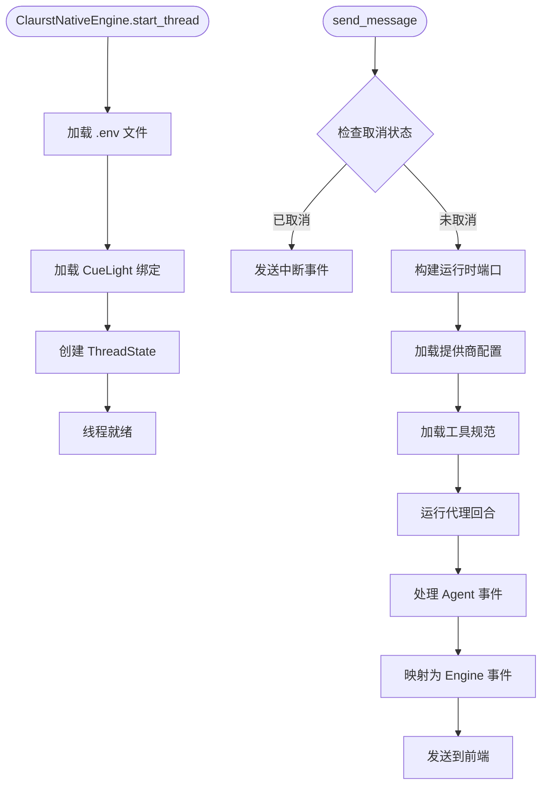

**图表来源**
- [claurst_native.rs:167-345](file://src-tauri/src/engines/claurst_native.rs#L167-L345)
- [claurst_native.rs:421-520](file://src-tauri/src/engines/claurst_native.rs#L421-L520)

**章节来源**
- [claurst_native.rs:89-195](file://src-tauri/src/engines/claurst_native.rs#L89-L195)
- [claurst_native.rs:197-345](file://src-tauri/src/engines/claurst_native.rs#L197-L345)
- [claurst_native.rs:421-520](file://src-tauri/src/engines/claurst_native.rs#L421-L520)

### Claude 侧车引擎（Claude Sidecar）
- 进程与传输
  - 通过 Node.js 启动侧车脚本，标准输入输出进行 JSON 行协议通信；广播通道订阅事件。
  - 启动阶段等待"Ready"事件，超时或错误时清理进程并返回错误。
- 事件映射
  - 将 SidecarEvent 映射为 EngineEvent（文本增量、思考增量、动作开始/完成、审批请求、完成、通知、用量限制等）。
- 健康检查
  - 检测 Node.js 可用性、侧车脚本存在性、API Key 设置情况，生成 checks/warnings/fixes。
- 认证与错误
  - 识别认证错误并给出修复建议；支持平台差异的 Node.js 查找策略。

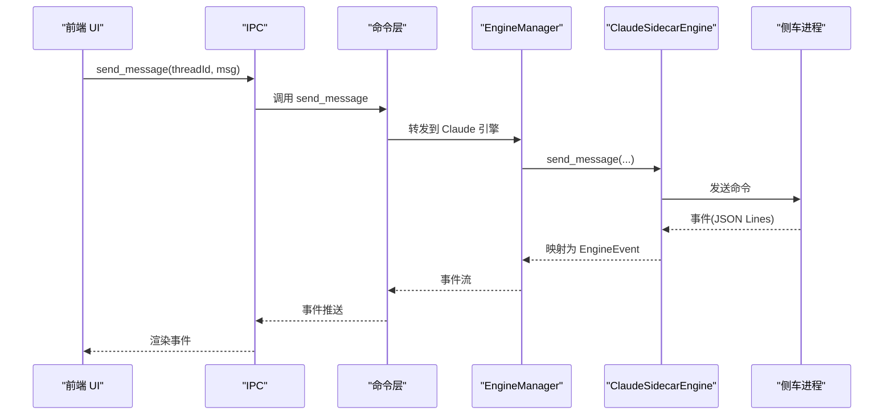

**图表来源**
- [claude_sidecar.rs:1227-1250](file://src-tauri/src/engines/claude_sidecar.rs#L1227-L1250)
- [claude_sidecar.rs:632-701](file://src-tauri/src/engines/claude_sidecar.rs#L632-L701)
- [ipc.ts:357-376](file://src/lib/ipc.ts#L357-L376)

**章节来源**
- [claude_sidecar.rs:179-475](file://src-tauri/src/engines/claude_sidecar.rs#L179-L475)
- [claude_sidecar.rs:632-701](file://src-tauri/src/engines/claude_sidecar.rs#L632-L701)
- [claude_sidecar.rs:1227-1250](file://src-tauri/src/engines/claude_sidecar.rs#L1227-L1250)

### Codex 引擎
- 传输与协议
  - 使用自研协议与方法集（initialize、thread/start、thread/resume、turn/start 等），支持超时与重试。
  - 事件映射器将通知/请求映射为 EngineEvent，处理审批、动作、速率限制等。
- 线程与沙箱
  - 支持工作区写入沙箱探测与外部沙箱强制切换；记录线程运行时配置。
- 审批与认证
  - 记录审批请求并等待前端响应；检测认证失败并重置传输。
- 运行时模型缓存
  - 列表加载失败时回退到静态/缓存模型目录，保证可用性。

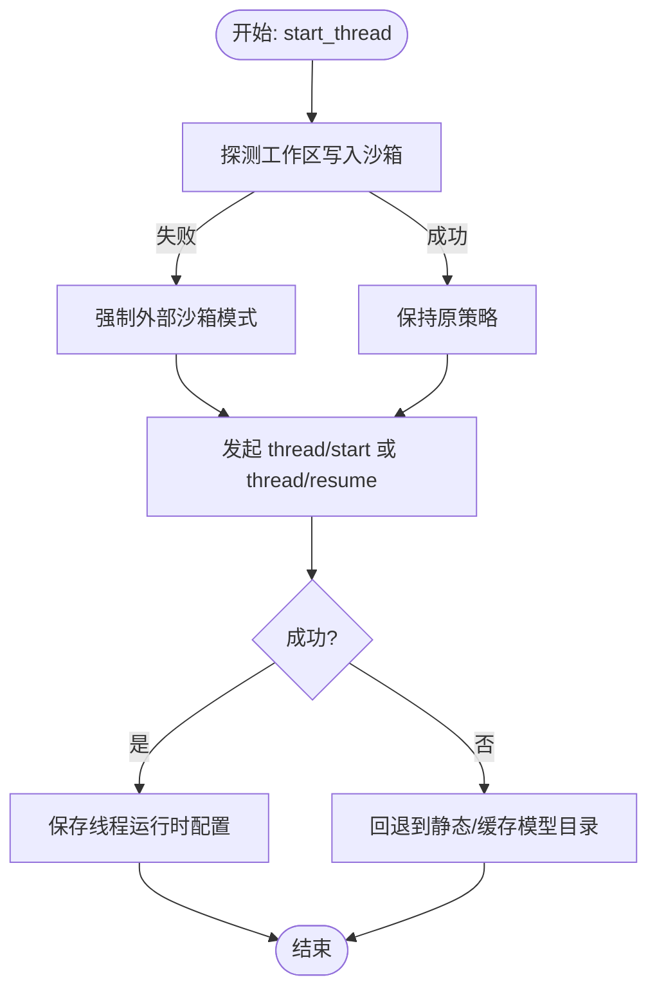

**图表来源**
- [codex.rs:384-521](file://src-tauri/src/engines/codex.rs#L384-L521)
- [codex.rs:2834-2843](file://src-tauri/src/engines/codex.rs#L2834-L2843)

**章节来源**
- [codex.rs:85-147](file://src-tauri/src/engines/codex.rs#L85-L147)
- [codex.rs:384-521](file://src-tauri/src/engines/codex.rs#L384-L521)
- [codex.rs:2834-2843](file://src-tauri/src/engines/codex.rs#L2834-L2843)

### OpenCode 引擎
- 服务与会话
  - 为每个工作目录启动/复用本地 HTTP 服务器，基于会话（session）管理线程状态。
  - 通过 SSE 事件总线持续推送消息与动作状态，支持长时间空闲超时。
- 模型与能力
  - 提供默认模型与推理努力等级；支持 agent、命令、MCP 服务器等运行时目录查询。
- 事件映射
  - 将消息片段映射为文本增量、思考增量、动作、完成等事件；处理令牌用量与完成状态。

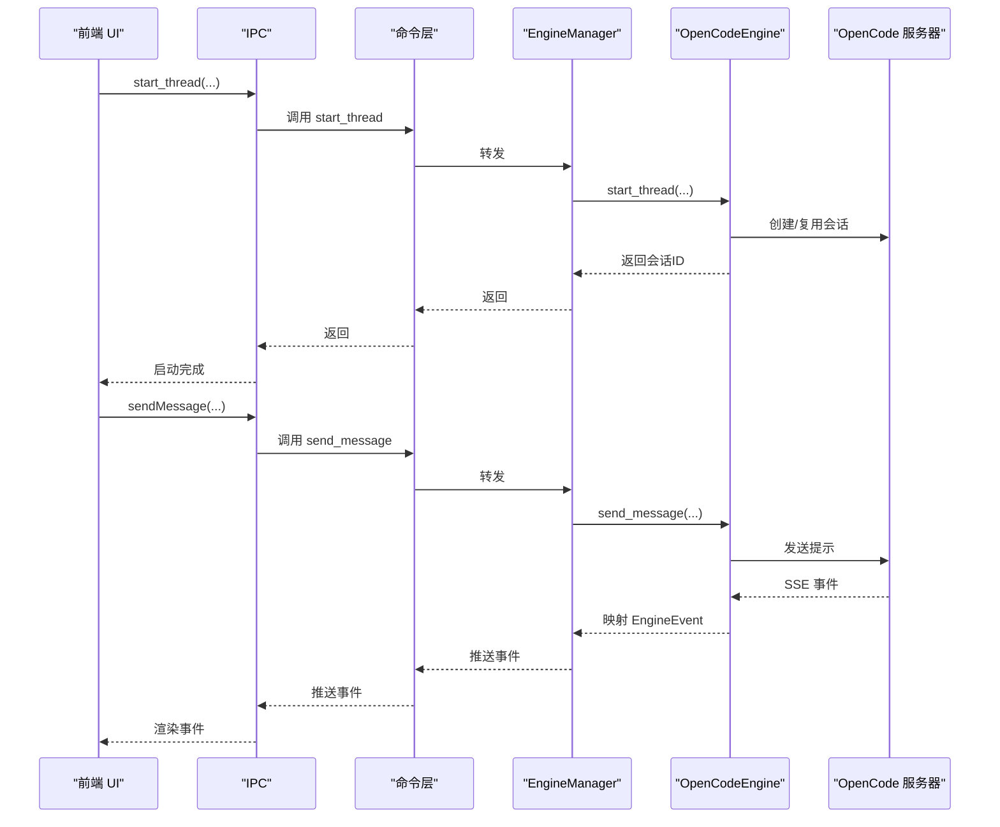

**图表来源**
- [opencode.rs:586-685](file://src-tauri/src/engines/opencode.rs#L586-L685)
- [opencode.rs:687-800](file://src-tauri/src/engines/opencode.rs#L687-L800)
- [ipc.ts:357-376](file://src/lib/ipc.ts#L357-L376)

**章节来源**
- [opencode.rs:54-125](file://src-tauri/src/engines/opencode.rs#L54-L125)
- [opencode.rs:586-685](file://src-tauri/src/engines/opencode.rs#L586-L685)
- [opencode.rs:687-800](file://src-tauri/src/engines/opencode.rs#L687-L800)

### 健康检查与运行时更新
- 健康检查
  - 前端：useEngineStore.load/ensureHealth 并发去重、loading 状态管理、错误合并。
  - 后端：执行外部命令检查（跨平台 shell 构造），返回命令、退出码、stdout/stderr、耗时。
- 运行时更新
  - 前端：applyRuntimeUpdate 合并协议诊断与可用性标记，用于 UI 展示与功能开关。

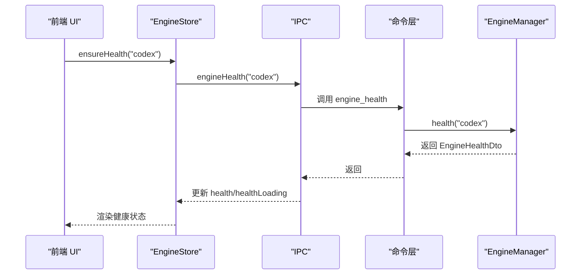

**图表来源**
- [engineStore.ts:58-115](file://src/stores/engineStore.ts#L58-L115)
- [ipc.ts:337-340](file://src/lib/ipc.ts#L337-L340)
- [engines.rs:96-136](file://src-tauri/src/commands/engines.rs#L96-L136)
- [mod.rs:545-605](file://src-tauri/src/engines/mod.rs#L545-L605)

**章节来源**
- [engineStore.ts:23-163](file://src/stores/engineStore.ts#L23-L163)
- [engines.rs:96-136](file://src-tauri/src/commands/engines.rs#L96-L136)
- [mod.rs:545-605](file://src-tauri/src/engines/mod.rs#L545-L605)

### 引擎能力与配置
- 能力矩阵
  - 不同引擎支持的权限模式、沙箱模式、审批决策集合不同，前端通过 resolveEngineCapabilities 合并回退策略。
- 引擎 ID 识别
  - isClaudeFamilyEngine 用于区分 Claude 系列引擎（claude、claude-code-native、claurst-native）。

**章节来源**
- [engineCapabilities.ts:1-69](file://src/components/chat/engineCapabilities.ts#L1-L69)
- [chatEngineIds.ts:1-8](file://src/lib/chatEngineIds.ts#L1-L8)
- [types.ts:448-509](file://src/types.ts#L448-L509)

## 代理运行时系统

### panes-agent 通用代理运行时框架
**新增**：全新的 panes-agent 通用代理运行时框架，替代 claude-code-rust 专用实现。

- **DDD 分层架构**
  - **领域层（domain）**：纯领域模型与规则，包括 AgentMessage、ToolCall、PermissionDecision、TokenUsage 等
  - **应用层（application）**：用例编排，包括 RunAgentTurn、ExecuteToolLoop、CompactConversation 等
  - **基础设施层（infrastructure）**：外部技术适配，包括 Anthropic Messages SSE 客户端、原生工具执行器、令牌估算器
  - **接口层（interfaces）**：对外 API/DTO/事件转换边界

- **核心组件**
  - AgentRuntime：公共运行时门面，提供 run_turn 方法
  - Application Ports：抽象接口，包括 ModelClient、ToolExecutor、PermissionGateway、EventSink
  - 事件映射：AgentEvent → EngineEvent 的双向转换

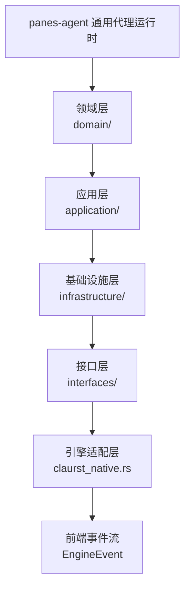

**图表来源**
- [claurst-vendor-integration.md:200-260](file://claurst-vendor-integration.md#L200-L260)
- [claurst-vendor-integration.md:262-294](file://claurst-vendor-integration.md#L262-L294)

**章节来源**
- [claurst-vendor-integration.md:200-260](file://claurst-vendor-integration.md#L200-L260)
- [claurst-vendor-integration.md:262-294](file://claurst-vendor-integration.md#L262-L294)

### Claurst 原生代理运行时架构
Claurst 原生引擎采用全新的代理运行时系统，直接嵌入 panes-agent 通用框架：

- **线程状态管理**
  - ThreadState 结构体维护对话历史、工作目录、模型选择、沙箱模式、CueLight 上下文
  - 支持 CueLight 影视模式上下文绑定，实现专业影视制作工具链集成
  - 历史记录压缩机制，防止上下文膨胀影响性能

- **工具系统**
  - 动态构建系统提示与工具定义，根据沙箱模式调整可用工具集
  - 支持本地文件操作、命令执行、任务管理等原生工具
  - CueLight 影视工具链集成，提供专业的剧本、角色、场景管理功能

- **代理循环机制**
  - 最大轮次限制（32轮）防止无限循环
  - 流式事件处理，支持文本增量与工具调用分片
  - 命令审批机制，支持自动放行与用户交互审批

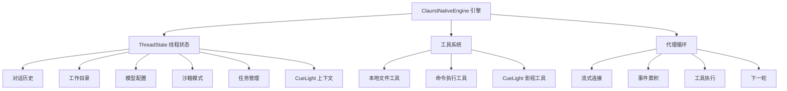

**图表来源**
- [claurst_native.rs:57-69](file://src-tauri/src/engines/claurst_native.rs#L57-L69)
- [claurst_native.rs:236-262](file://src-tauri/src/engines/claurst_native.rs#L236-L262)
- [claurst_native.rs:522-532](file://src-tauri/src/engines/claurst_native.rs#L522-L532)

**章节来源**
- [claurst_native.rs:57-69](file://src-tauri/src/engines/claurst_native.rs#L57-L69)
- [claurst_native.rs:236-262](file://src-tauri/src/engines/claurst_native.rs#L236-L262)
- [claurst_native.rs:522-532](file://src-tauri/src/engines/claurst_native.rs#L522-L532)

### Codex 代理运行时系统
Codex 引擎采用复杂的代理运行时架构，支持多线程协作与事件映射：

- **传输层管理**
  - CodexTransport 负责与 Codex 服务的通信
  - 支持传输重启与重连机制，提高稳定性
  - 事件订阅与通知处理，支持实时状态更新

- **线程运行时管理**
  - ThreadRuntime 结构体维护每个线程的运行时配置
  - 支持沙箱模式、权限策略、推理努力等级等配置
  - 线程状态跟踪与生命周期管理

- **事件映射器**
  - TurnEventMapper 将 Codex 事件转换为统一的 EngineEvent
  - 支持审批请求、动作执行、文件变更、命令输出等事件类型
  - 实时转录与推理摘要处理

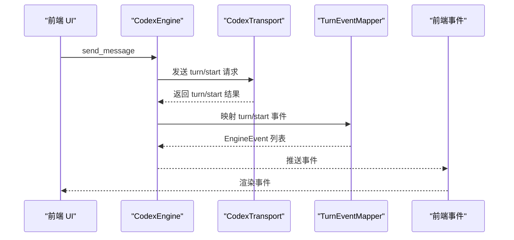

**图表来源**
- [codex.rs:524-744](file://src-tauri/src/engines/codex.rs#L524-L744)
- [codex.rs:2834-2843](file://src-tauri/src/engines/codex.rs#L2834-L2843)

**章节来源**
- [codex.rs:86-137](file://src-tauri/src/engines/codex.rs#L86-L137)
- [codex.rs:385-522](file://src-tauri/src/engines/codex.rs#L385-L522)
- [codex.rs:2834-2843](file://src-tauri/src/engines/codex.rs#L2834-L2843)

### OpenCode 代理运行时系统
OpenCode 引擎采用 HTTP 服务器架构，支持会话管理和事件总线：

- **服务器管理**
  - OpenCodeServer 结构体管理每个工作目录的服务器实例
  - 支持密码认证与事件总线广播
  - 进程生命周期管理与资源清理

- **会话管理**
  - OpenCodeSession 维护会话状态与运行时配置
  - 支持权限模式、推理努力等级、Agent 配置
  - 会话复用与状态迁移

- **事件映射**
  - OpenCodeTurnMapper 将服务器事件转换为统一事件格式
  - 支持文本增量、思考增量、动作执行、令牌用量等事件
  - SSE 事件流处理与超时管理

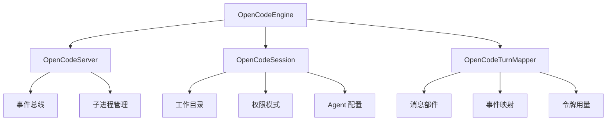

**图表来源**
- [opencode.rs:54-90](file://src-tauri/src/engines/opencode.rs#L54-L90)
- [opencode.rs:68-103](file://src-tauri/src/engines/opencode.rs#L68-L103)
- [opencode.rs:355-434](file://src-tauri/src/engines/opencode.rs#L355-L434)

**章节来源**
- [opencode.rs:54-125](file://src-tauri/src/engines/opencode.rs#L54-L125)
- [opencode.rs:586-685](file://src-tauri/src/engines/opencode.rs#L586-L685)
- [opencode.rs:687-800](file://src-tauri/src/engines/opencode.rs#L687-L800)

## 依赖关系分析
- 前端依赖
  - engineStore.ts 依赖 ipc.ts 的 listEngines/engineHealth，依赖 types.ts 的 EngineInfo/EngineHealth。
  - 组件层依赖 engineCapabilities.ts 与 chatEngineIds.ts 进行能力与引擎族识别。
  - OpenCodeAgentPicker 依赖 OpenCodeAgent 类型定义。
- 后端依赖
  - commands/engines.rs 依赖 engines/mod.rs 的 EngineManager 实现。
  - 各引擎模块相互独立，通过 Engine trait 解耦。
  - Claurst 原生引擎依赖 panes-agent 通用代理运行时框架。

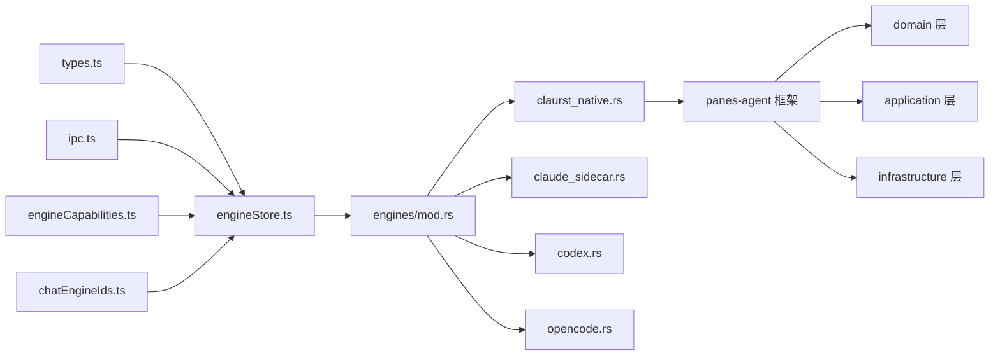

**图表来源**
- [types.ts:448-509](file://src/types.ts#L448-L509)
- [engineStore.ts:1-164](file://src/stores/engineStore.ts#L1-L164)
- [ipc.ts:336-340](file://src/lib/ipc.ts#L336-L340)
- [engineCapabilities.ts:1-69](file://src/components/chat/engineCapabilities.ts#L1-L69)
- [chatEngineIds.ts:1-8](file://src/lib/chatEngineIds.ts#L1-L8)
- [mod.rs:463-478](file://src-tauri/src/engines/mod.rs#L463-L478)
- [claurst_native.rs:118-195](file://src-tauri/src/engines/claurst_native.rs#L118-L195)

**章节来源**
- [types.ts:448-509](file://src/types.ts#L448-L509)
- [engineStore.ts:1-164](file://src/stores/engineStore.ts#L1-L164)
- [ipc.ts:336-340](file://src/lib/ipc.ts#L336-L340)
- [engineCapabilities.ts:1-69](file://src/components/chat/engineCapabilities.ts#L1-L69)
- [chatEngineIds.ts:1-8](file://src/lib/chatEngineIds.ts#L1-L8)
- [mod.rs:463-478](file://src-tauri/src/engines/mod.rs#L463-L478)
- [claurst_native.rs:118-195](file://src-tauri/src/engines/claurst_native.rs#L118-L195)

## 性能考量
- 超时与降级
  - 引擎管理器对运行时模型加载与健康检查设置超时，失败时回退到缓存/静态目录，保障可用性。
- 事件流与背压
  - 各引擎使用 mpsc 通道推送事件，前端按需消费；注意避免事件风暴导致 UI 卡顿。
- 进程生命周期
  - Claude 侧车引擎在并发启动时进行竞态控制与冗余进程清理，降低资源浪费。
- 令牌用量与限流
  - 引擎可上报令牌用量与速率限制快照，前端用于展示与告警。
- 代理运行时优化
  - Claurst 原生引擎支持历史记录压缩，防止上下文膨胀。
  - panes-agent 采用异步 oneshot 审批机制，避免同步阻塞死锁。

**章节来源**
- [mod.rs:484-543](file://src-tauri/src/engines/mod.rs#L484-L543)
- [claude_sidecar.rs:528-595](file://src-tauri/src/engines/claude_sidecar.rs#L528-L595)
- [codex.rs:546-554](file://src-tauri/src/engines/codex.rs#L546-L554)
- [claurst_native.rs:499-526](file://src-tauri/src/engines/claurst_native.rs#L499-L526)

## 故障排查指南
- 健康检查失败
  - 前端：查看 engineStore 的 health/warnings/checks/fixes 字段，按建议修复。
  - 后端：run_engine_check 执行外部命令，返回 stdout/stderr/耗时，定位问题根因。
- 认证与网络
  - Claude 侧车：检查 ANTHROPIC_API_KEY、登录状态；识别认证错误并提示修复。
  - Codex：检测认证失败并重置传输；必要时切换外部沙箱。
  - OpenCode：确认本地服务器启动与 SSE 连接；关注空闲超时。
  - Claurst 原生：检查 ANTHROPIC_API_KEY 环境变量；验证 panes-agent 依赖正确加载。
- 审批与工具
  - Claurst 原生：execute_command 需审批；accept_for_session 可自动放行后续命令。
  - Codex/OpenCode：审批请求路由与响应规范化，确保决策键一致。
- 代理运行时问题
  - Claurst 原生：检查工作目录访问权限与工具执行权限；验证 panes-agent 事件映射。
  - Codex：验证传输连接与事件映射器配置。
  - OpenCode：监控服务器进程状态与事件总线连接。

**章节来源**
- [engineStore.ts:58-115](file://src/stores/engineStore.ts#L58-L115)
- [engines.rs:96-136](file://src-tauri/src/commands/engines.rs#L96-L136)
- [claude_sidecar.rs:632-701](file://src-tauri/src/engines/claude_sidecar.rs#L632-L701)
- [codex.rs:744-796](file://src-tauri/src/engines/codex.rs#L744-L796)
- [opencode.rs:770-796](file://src-tauri/src/engines/opencode.rs#L770-L796)
- [claurst_native.rs:369-419](file://src-tauri/src/engines/claurst_native.rs#L369-L419)

## 结论
Panes 的引擎管理体系以统一抽象与管理器为核心，结合前端状态与 IPC 通道，实现了多引擎的统一接入、健康检查与运行时治理。通过能力矩阵与配置策略，系统在安全性（沙箱、审批）、可用性（超时降级、缓存回退）与可观测性（事件流、诊断）之间取得平衡。

**新的代理运行时系统**进一步增强了系统的灵活性与可扩展性：
- Claurst 原生引擎提供高性能的 panes-agent 通用代理运行时
- Codex 提供企业级的多线程协作与事件映射能力
- OpenCode 实现了基于 HTTP 的分布式代理运行时架构

**架构迁移成果**：
- 从 claude-code-rust 到 claurst-native 的 clean-room 重构
- panes-agent 通用框架替代专用实现
- 异步审批机制避免同步阻塞死锁
- CueLight 影视工作流深度集成

未来可在引擎选择策略、负载均衡与故障转移方面进一步增强，以满足更高并发与复杂场景需求。

## 附录

### 引擎选择策略与最佳实践
- 选择依据
  - 功能需求：是否需要本地工具链（Claurst 原生）、侧车生态（Claude 侧车）、工作区写入（Codex/OpenCode）。
  - 安全策略：只读沙箱 vs 写入沙箱 vs 外部沙箱；审批策略与权限模式。
  - 可靠性：健康检查与超时降级；认证与网络要求。
- 最佳实践
  - 首选 Claurst 原生（panes-agent 通用框架、可控性强）；需要侧车生态时选用 Claude 侧车；需要工作区协作与外部工具时选用 Codex/OpenCode。
  - 在只读场景禁用写入工具与命令执行；启用审批策略并明确审批决策集合。

**章节来源**
- [engineCapabilities.ts:1-69](file://src/components/chat/engineCapabilities.ts#L1-L69)
- [types.ts:448-509](file://src/types.ts#L448-L509)

### 负载均衡与故障转移（概念性）
- 负载均衡
  - 基于引擎健康状态与模型可用性进行路由；对高延迟引擎进行降权或隔离。
- 故障转移
  - 单引擎失败时自动切换到备选引擎；在前端进行快速重试与降级回退。

（本节为概念性内容，未直接分析具体源码）

### 引擎扩展指南与自定义集成
- 新增引擎步骤
  - 实现 Engine trait；在 EngineManager 中注册实例；在 list_engines/health/prewarm 中暴露能力。
  - 定义模型与能力矩阵；实现事件映射与健康检查。
- 自定义引擎集成
  - 通过 IPC 暴露命令；在前端通过 ipc.ts 增加调用；在 store 中维护健康状态与事件订阅。
- 代理运行时扩展
  - 基于 panes-agent 通用框架实现新的代理运行时系统。
  - 集成事件映射器与状态管理机制。
- 调试技巧
  - 启用后端日志；利用 run_engine_check 获取命令执行详情；在前端监听 engine-runtime-updated 事件观察运行时变化。

**章节来源**
- [mod.rs:463-605](file://src-tauri/src/engines/mod.rs#L463-L605)
- [ipc.ts:336-340](file://src/lib/ipc.ts#L336-L340)
- [engineStore.ts:134-162](file://src/stores/engineStore.ts#L134-L162)

### 数据格式转换、消息路由与状态同步
- 数据格式转换
  - 各引擎事件到 EngineEvent 的映射；审批响应规范化；模型信息与能力矩阵的 DTO 转换。
- 消息路由
  - 前端通过 listenThreadEvents 等事件通道接收引擎事件；命令层将事件推送到前端命名通道。
- 状态同步
  - 引擎内部维护线程运行时配置；前端 store 合并健康与运行时更新事件，驱动 UI 同步。
- 代理运行时状态管理
  - Claurst 原生：线程状态与历史记录管理
  - Codex：传输状态与事件映射器状态
  - OpenCode：服务器状态与会话状态

**章节来源**
- [claude_sidecar.rs:1227-1250](file://src-tauri/src/engines/claude_sidecar.rs#L1227-L1250)
- [codex.rs:744-796](file://src-tauri/src/engines/codex.rs#L744-L796)
- [opencode.rs:770-796](file://src-tauri/src/engines/opencode.rs#L770-L796)
- [ipc.ts:629-680](file://src/lib/ipc.ts#L629-L680)
- [engineStore.ts:116-133](file://src/stores/engineStore.ts#L116-L133)

### 前端组件集成
- OpenCode Agent 选择器
  - 支持多种 Agent 模式的可视化选择界面
  - 集成翻译与无障碍访问支持
  - 动态选项生成与状态管理

**章节来源**
- [OpenCodeAgentPicker.tsx:1-169](file://src/components/chat/OpenCodeAgentPicker.tsx#L1-L169)

### Claurst 原生引擎架构迁移详情
**新增**：详细的架构迁移背景与实现细节。

- **迁移背景**
  - claude-code-rust（MIT）与 claurst（GPL-3.0）的许可证冲突
  - wreq/BoringSSL 与 git2/openssl-sys 的符号冲突
  - 需要统一 reqwest 版本与 TLS 栈
  - 避免同步阻塞死锁问题

- **clean-room 重构原则**
  - 两阶段隔离：规格→独立实现
  - 不复制 claurst 源码、注释、测试文本
  - panes-agent 头部添加 clean-room 声明
  - 新增合规审计脚本

- **技术实现**
  - panes-agent 作为独立 workspace 成员 crate
  - DDD 分层：domain/application/infrastructure/interfaces
  - 异步 oneshot 审批机制
  - Anthropic Messages SSE 客户端重写
  - 原生工具执行器重构

**章节来源**
- [claurst-vendor-integration.md:1-634](file://claurst-vendor-integration.md#L1-L634)
- [README.md:1-220](file://vendor/claurst/README.md#L1-L220)