# Claude 引擎集成

<cite>
**本文档引用的文件**
- [claude_sidecar.rs](file://src-tauri/src/engines/claude_sidecar.rs)
- [claude_code_native.rs](file://src-tauri/src/engines/claude_code_native.rs)
- [mod.rs](file://src-tauri/src/engines/mod.rs)
- [events.rs](file://src-tauri/src/engines/events.rs)
- [toolInputApproval.ts](file://src/components/chat/toolInputApproval.ts)
- [engineCapabilities.ts](file://src/components/chat/engineCapabilities.ts)
- [chatEngineIds.ts](file://src/lib/chatEngineIds.ts)
- [types.ts](file://src/types.ts)
- [claude-agent-sdk-server.mjs](file://src-tauri/sidecar/claude-agent-sdk-server.mjs)
- [package.json](file://src-tauri/sidecars/claude_agent/package.json)
- [README.md](file://README.md)
</cite>

## 目录
1. [简介](#简介)
2. [项目结构](#项目结构)
3. [核心组件](#核心组件)
4. [架构概览](#架构概览)
5. [详细组件分析](#详细组件分析)
6. [依赖关系分析](#依赖关系分析)
7. [性能考虑](#性能考虑)
8. [故障排除指南](#故障排除指南)
9. [结论](#结论)
10. [附录](#附录)

## 简介

本文档详细阐述了 Panes 应用中的 Claude 引擎集成方案，涵盖两种主要集成方式：Claude Sidecar 和 Claude Code Native。这两种方式提供了不同的架构设计和使用场景，满足从桌面应用到本地代理的不同需求。

Claude Sidecar 采用外部 Node.js 侧车进程模式，通过 Claude Agent SDK 与 Claude 服务进行通信。而 Claude Code Native 则是内置的 Rust 实现，直接嵌入到 Panes 后端中，提供更紧密的集成体验。

## 项目结构

Panes 项目采用模块化架构，Claude 引擎集成分布在多个层次中：

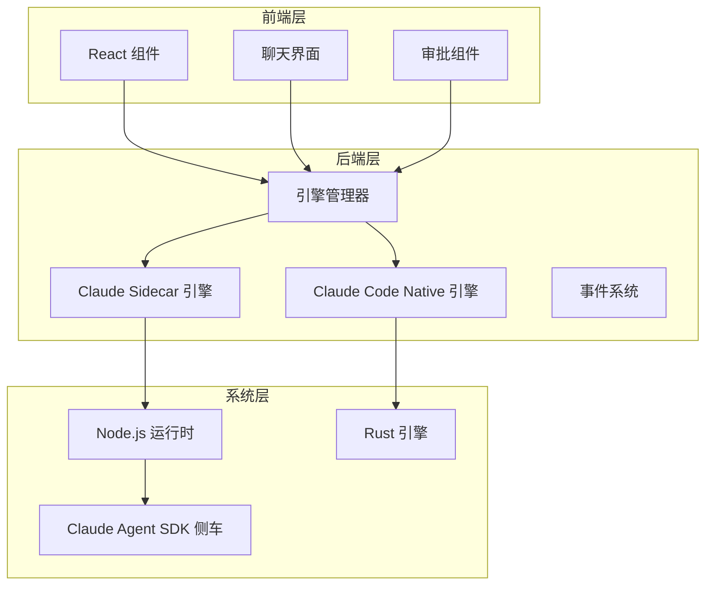

**图表来源**
- [mod.rs:463-478](file://src-tauri/src/engines/mod.rs#L463-L478)
- [claude_sidecar.rs:499-501](file://src-tauri/src/engines/claude_sidecar.rs#L499-L501)
- [claude_code_native.rs:64-68](file://src-tauri/src/engines/claude_code_native.rs#L64-L68)

**章节来源**
- [README.md:240-241](file://README.md#L240-L241)
- [mod.rs:463-478](file://src-tauri/src/engines/mod.rs#L463-L478)

## 核心组件

### 引擎接口抽象

所有 Claude 引擎都实现了统一的 Engine 接口，确保一致的行为和生命周期管理：

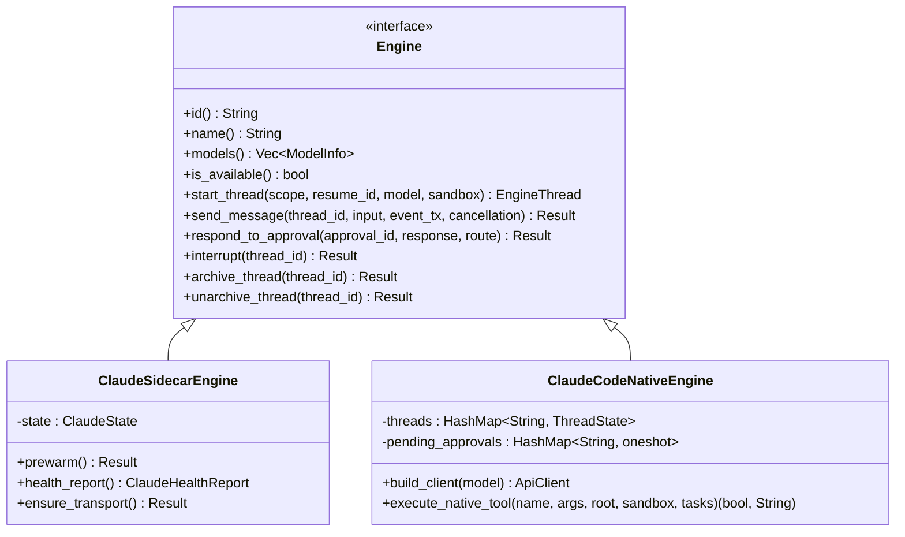

**图表来源**
- [mod.rs:419-461](file://src-tauri/src/engines/mod.rs#L419-L461)
- [claude_sidecar.rs:499-501](file://src-tauri/src/engines/claude_sidecar.rs#L499-L501)
- [claude_code_native.rs:64-68](file://src-tauri/src/engines/claude_code_native.rs#L64-L68)

### 线程作用域和沙箱策略

Claude 引擎支持灵活的线程作用域配置，包括仓库级和工作区级访问控制：

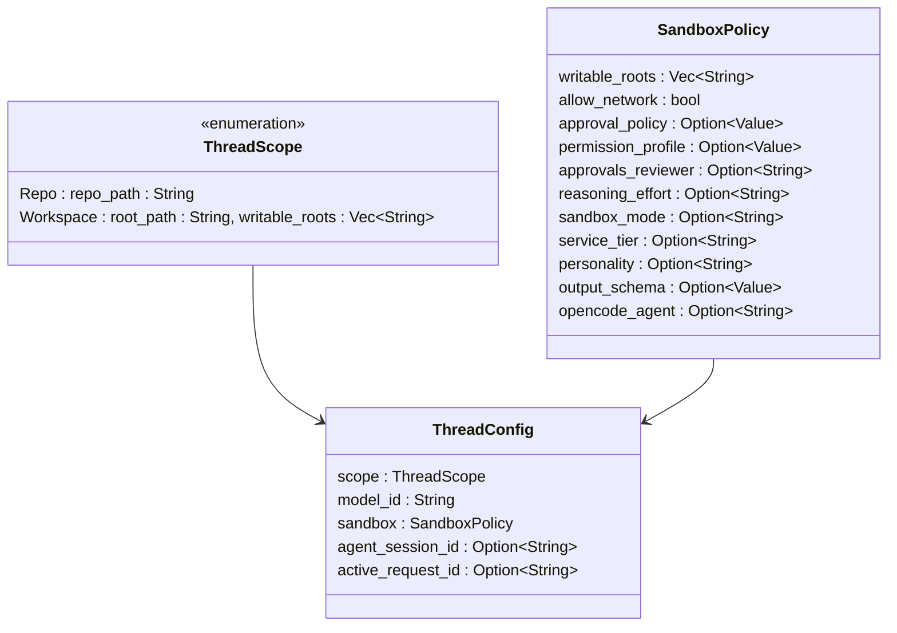

**图表来源**
- [mod.rs:45-53](file://src-tauri/src/engines/mod.rs#L45-L53)
- [mod.rs:56-68](file://src-tauri/src/engines/mod.rs#L56-L68)
- [claude_sidecar.rs:480-487](file://src-tauri/src/engines/claude_sidecar.rs#L480-L487)

**章节来源**
- [mod.rs:45-68](file://src-tauri/src/engines/mod.rs#L45-L68)
- [claude_sidecar.rs:480-487](file://src-tauri/src/engines/claude_sidecar.rs#L480-L487)

## 架构概览

### 两种集成方式对比

Claude 引擎提供了两种完全不同的集成架构：

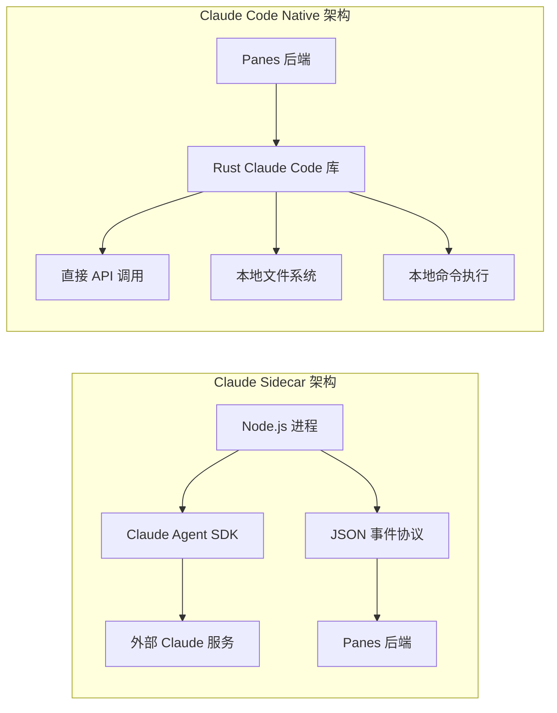

**图表来源**
- [claude_sidecar.rs:180-184](file://src-tauri/src/engines/claude_sidecar.rs#L180-L184)
- [claude_code_native.rs:11-17](file://src-tauri/src/engines/claude_code_native.rs#L11-L17)

### 事件驱动的消息处理

两种引擎都采用了事件驱动的异步消息处理模式：

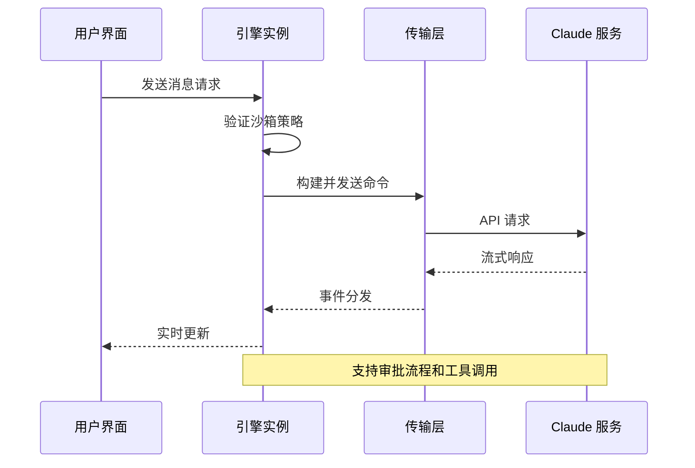

**图表来源**
- [claude_sidecar.rs:1120-1200](file://src-tauri/src/engines/claude_sidecar.rs#L1120-L1200)
- [claude_code_native.rs:600-800](file://src-tauri/src/engines/claude_code_native.rs#L600-L800)

**章节来源**
- [claude_sidecar.rs:1120-1200](file://src-tauri/src/engines/claude_sidecar.rs#L1120-L1200)
- [claude_code_native.rs:600-800](file://src-tauri/src/engines/claude_code_native.rs#L600-L800)

## 详细组件分析

### Claude Sidecar 引擎

Claude Sidecar 引擎通过 Node.js 侧车进程实现与 Claude 服务的通信。

#### 传输层实现

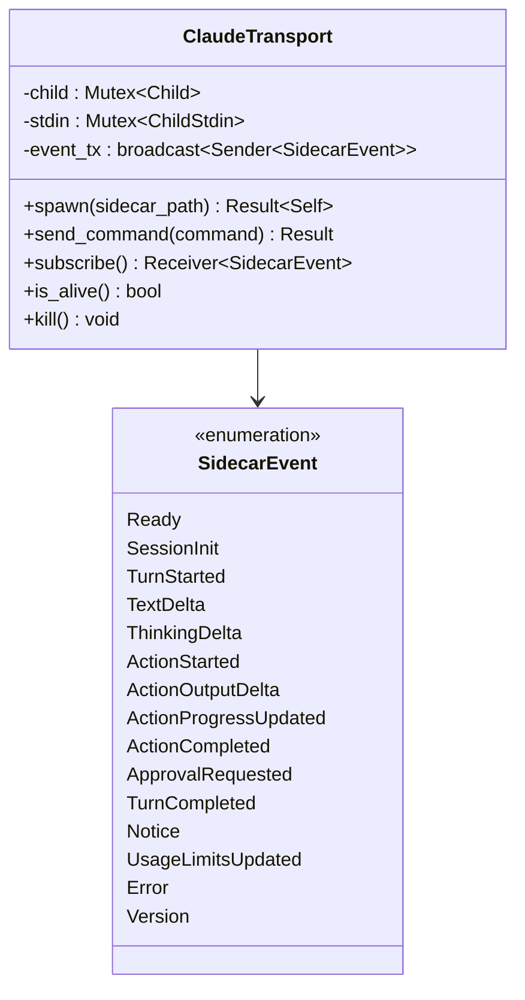

**图表来源**
- [claude_sidecar.rs:180-184](file://src-tauri/src/engines/claude_sidecar.rs#L180-L184)
- [claude_sidecar.rs:39-135](file://src-tauri/src/engines/claude_sidecar.rs#L39-L135)

#### 健康检查机制

Claude Sidecar 引擎提供了全面的健康检查功能：

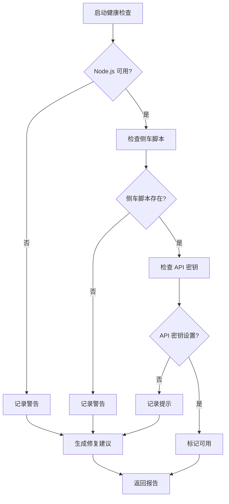

**图表来源**
- [claude_sidecar.rs:633-702](file://src-tauri/src/engines/claude_sidecar.rs#L633-L702)

**章节来源**
- [claude_sidecar.rs:180-290](file://src-tauri/src/engines/claude_sidecar.rs#L180-L290)
- [claude_sidecar.rs:633-702](file://src-tauri/src/engines/claude_sidecar.rs#L633-L702)

### Claude Code Native 引擎

Claude Code Native 引擎是完全内置的 Rust 实现，提供更紧密的系统集成。

#### 本地工具执行

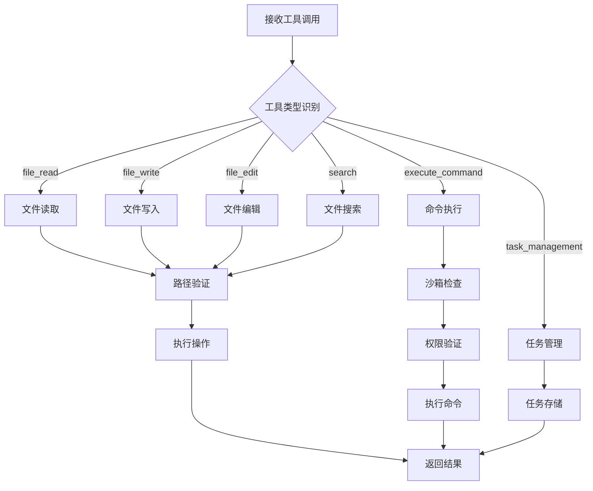

**图表来源**
- [claude_code_native.rs:211-352](file://src-tauri/src/engines/claude_code_native.rs#L211-L352)

#### 审批决策机制

Claude Code Native 引擎实现了完整的审批流程：

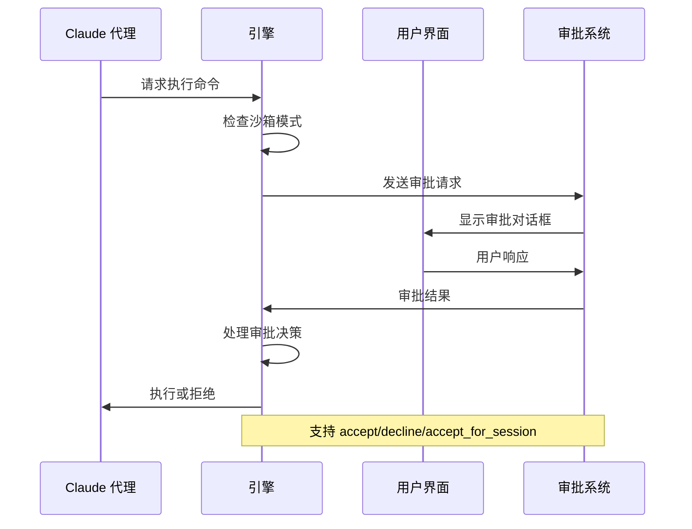

**图表来源**
- [claude_code_native.rs:369-420](file://src-tauri/src/engines/claude_code_native.rs#L369-L420)

**章节来源**
- [claude_code_native.rs:211-352](file://src-tauri/src/engines/claude_code_native.rs#L211-L352)
- [claude_code_native.rs:369-420](file://src-tauri/src/engines/claude_code_native.rs#L369-L420)

### 审批系统集成

前端审批系统提供了统一的审批处理接口：

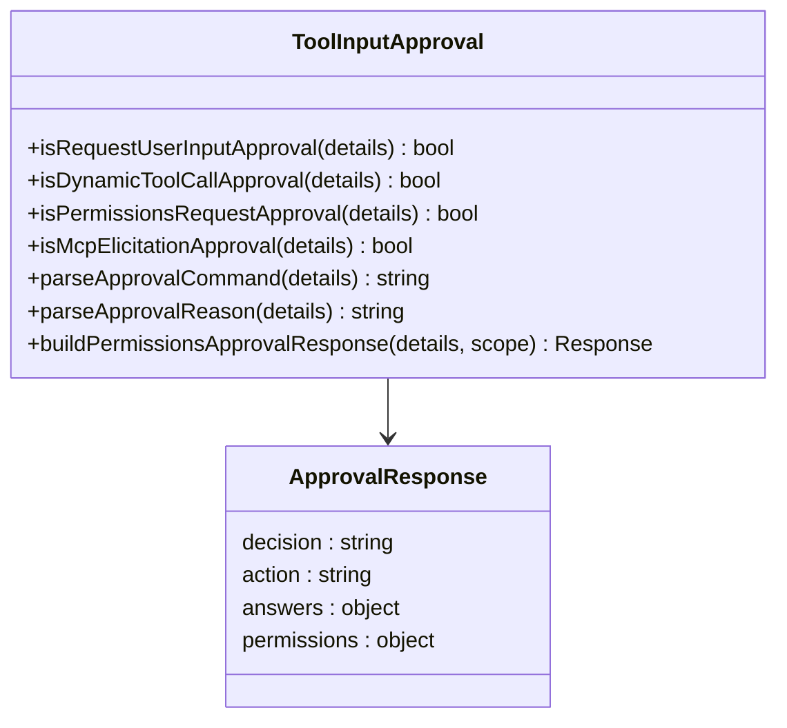

**图表来源**
- [toolInputApproval.ts:1-529](file://src/components/chat/toolInputApproval.ts#L1-L529)

**章节来源**
- [toolInputApproval.ts:1-529](file://src/components/chat/toolInputApproval.ts#L1-L529)

## 依赖关系分析

### 引擎能力矩阵

不同 Claude 引擎支持的能力有所不同：

| 引擎类型 | 权限模式 | 沙箱模式 | 审批决策 |
|---------|---------|---------|---------|
| Claude Sidecar | restricted, standard, trusted | read-only, workspace-write | accept, decline, accept_for_session |
| Claude Code Native | restricted, standard, trusted | read-only, workspace-write | accept, decline, accept_for_session |
| Codex | untrusted, on-failure, on-request, never | read-only, workspace-write, danger-full-access | accept, decline, cancel, accept_for_session |
| OpenCode | ask, allow, deny | none | accept, decline, cancel, accept_for_session |

**章节来源**
- [engineCapabilities.ts:9-19](file://src/components/chat/engineCapabilities.ts#L9-L19)
- [mod.rs:127-137](file://src-tauri/src/engines/mod.rs#L127-L137)

### 模型选择和配置

Claude 引擎支持多种模型配置：

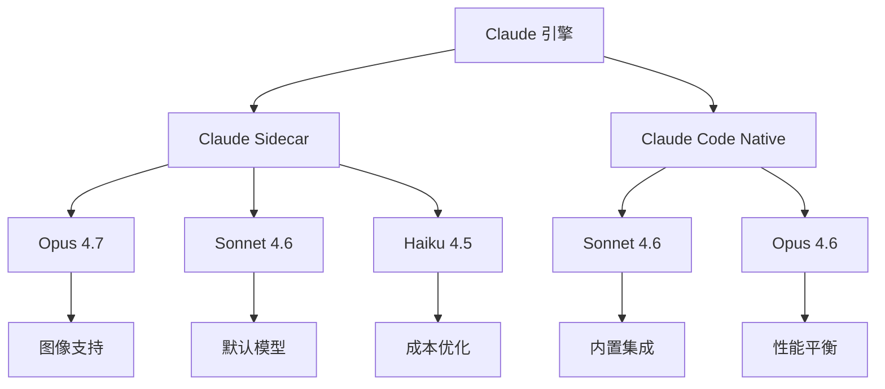

**图表来源**
- [claude_sidecar.rs:942-1069](file://src-tauri/src/engines/claude_sidecar.rs#L942-L1069)
- [claude_code_native.rs:525-560](file://src-tauri/src/engines/claude_code_native.rs#L525-L560)

**章节来源**
- [claude_sidecar.rs:942-1069](file://src-tauri/src/engines/claude_sidecar.rs#L942-L1069)
- [claude_code_native.rs:525-560](file://src-tauri/src/engines/claude_code_native.rs#L525-L560)

## 性能考虑

### 内存管理和资源限制

Claude Code Native 引擎实施了严格的资源限制：

- **工具输出截断**：最大 64KB 工具输出，防止内存溢出
- **代理循环限制**：每轮最多 12 次 agent 循环，防止无限循环
- **命令执行超时**：默认 60 秒超时，可配置

### 流式处理优化

两种引擎都支持流式处理以提升用户体验：

- **实时文本增量**：即时显示生成内容
- **工具输出流**：渐进式显示工具执行结果
- **事件缓冲**：1024 事件容量的广播通道

## 故障排除指南

### 常见问题诊断

#### Claude Sidecar 问题

1. **Node.js 未找到**
   - 检查 PATH 环境变量
   - 验证登录 shell 中的 Node.js 可用性
   - 在 macOS 上使用 `launchctl setenv` 修复

2. **侧车脚本缺失**
   - 确认 `claude-agent-sdk-server.mjs` 存在
   - 检查资源目录配置

3. **认证失败**
   - 设置 `ANTHROPIC_API_KEY` 环境变量
   - 验证 Claude Code 登录状态

#### Claude Code Native 问题

1. **API 密钥配置**
   - 检查 `~/.agent-workspace/settings.json`
   - 确保 API 密钥有效且有足够权限

2. **沙箱模式限制**
   - 验证工作目录访问权限
   - 检查写入根目录配置

**章节来源**
- [claude_sidecar.rs:807-826](file://src-tauri/src/engines/claude_sidecar.rs#L807-L826)
- [claude_sidecar.rs:633-702](file://src-tauri/src/engines/claude_sidecar.rs#L633-L702)

### 日志和调试

- **详细日志**：使用 `RUST_LOG=claude_code=debug` 启用调试日志
- **事件监控**：监听引擎事件以跟踪执行状态
- **性能分析**：监控 token 使用和响应时间

## 结论

Panes 的 Claude 引擎集成为开发者提供了灵活的选择：

- **Claude Sidecar** 适合需要外部服务集成和灵活配置的场景
- **Claude Code Native** 适合需要本地集成和更好性能的场景

两种引擎都提供了完整的审批系统、沙箱控制和工具执行能力，确保在安全性的同时提供强大的开发体验。

## 附录

### 配置选项参考

| 配置项 | Claude Sidecar | Claude Code Native | 描述 |
|-------|---------------|-------------------|------|
| API 密钥 | 环境变量 | 配置文件 | 认证凭据 |
| 模型选择 | 运行时参数 | 配置文件 | AI 模型标识 |
| 沙箱模式 | 运行时参数 | 运行时参数 | 文件系统访问控制 |
| 审批策略 | 运行时参数 | 运行时参数 | 工具执行授权 |
| 网络访问 | 运行时参数 | 配置文件 | 网络连接权限 |

### 最佳实践

1. **安全优先**：始终使用适当的沙箱模式
2. **资源管理**：合理设置超时和内存限制
3. **监控告警**：启用详细的日志和性能监控
4. **备份策略**：定期备份重要数据和配置
5. **测试验证**：在生产环境部署前充分测试