# Claude 引擎集成

<cite>
**本文档引用的文件**
- [claurst_native.rs](file://src-tauri/src/engines/claurst_native.rs)
- [mod.rs](file://src-tauri/src/engines/mod.rs)
- [events.rs](file://src-tauri/src/engines/events.rs)
- [toolInputApproval.ts](file://src/components/chat/toolInputApproval.ts)
- [engineCapabilities.ts](file://src/components/chat/engineCapabilities.ts)
- [chatEngineIds.ts](file://src/contexts/chat/domain/chatEngineIds.ts)
- [types.ts](file://src/types.ts)
- [claude-agent-sdk-server.mjs](file://src-tauri/sidecar/claude-agent-sdk-server.mjs)
- [package.json](file://src-tauri/sidecars/claude_agent/package.json)
- [README.md](file://README.md)
</cite>

## 更新摘要
**变更内容**
- 移除了 Claude Code Native 引擎的实现细节
- 新增 Claurst 原生引擎的完整实现说明
- 更新引擎别名处理机制，`claude-code-native` 路由到 `claurst-native`
- 新增 CueLight 项目集成支持
- 更新引擎能力矩阵和兼容性处理

## 目录
1. [简介](#简介)
2. [项目结构](#项目结构)
3. [核心组件](#核心组件)
4. [架构概览](#架构概览)
5. [详细组件分析](#详细组件分析)
6. [依赖关系分析](#依赖关系分析)
7. [性能考虑](#性能考虑)
8. [故障排除指南](#故障排除指南)
9. [结论](#结论)
10. [附录](#附录)

## 简介

本文档详细阐述了 Panes 应用中的 Claude 引擎集成方案，涵盖两种主要集成方式：Claude Sidecar 和 Claurst 原生引擎。Claude Sidecar 采用外部 Node.js 侧车进程模式，通过 Claude Agent SDK 与 Claude 服务进行通信。Claurst 原生引擎是全新的内置 Rust 实现，提供更紧密的系统集成和 CueLight 项目支持。

**更新** 移除了旧的 Claude Code Native 引擎实现，新增 Claurst 原生引擎作为主要的 Claude 集成方式。

## 项目结构

Panes 项目采用模块化架构，Claude 引擎集成分布在多个层次中：

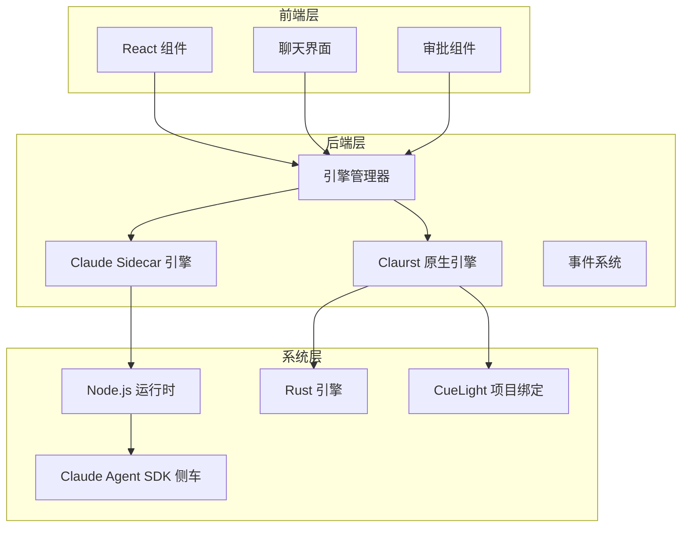

**图表来源**
- [mod.rs:472-500](file://src-tauri/src/engines/mod.rs#L472-L500)
- [claurst_native.rs:50-97](file://src-tauri/src/engines/claurst_native.rs#L50-L97)

**章节来源**
- [README.md:240-241](file://README.md#L240-L241)
- [mod.rs:472-500](file://src-tauri/src/engines/mod.rs#L472-L500)

## 核心组件

### 引擎接口抽象

所有 Claude 引擎都实现了统一的 Engine 接口，确保一致的行为和生命周期管理：

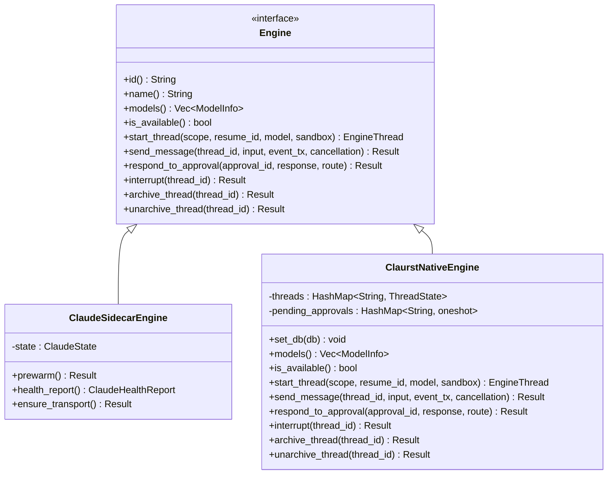

**图表来源**
- [mod.rs:428-470](file://src-tauri/src/engines/mod.rs#L428-L470)
- [claurst_native.rs:118-382](file://src-tauri/src/engines/claurst_native.rs#L118-L382)

### 线程作用域和沙箱策略

Claude 引擎支持灵活的线程作用域配置，包括仓库级和工作区级访问控制：

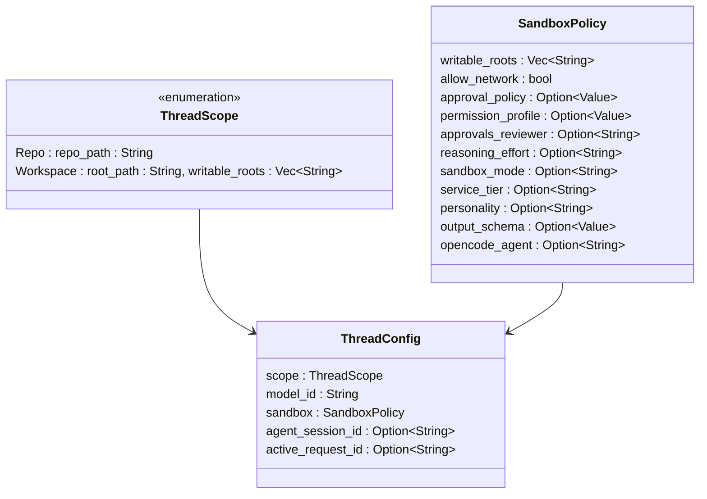

**图表来源**
- [mod.rs:49-73](file://src-tauri/src/engines/mod.rs#L49-L73)
- [mod.rs:168-196](file://src-tauri/src/engines/mod.rs#L168-L196)

**章节来源**
- [mod.rs:49-73](file://src-tauri/src/engines/mod.rs#L49-L73)
- [mod.rs:168-196](file://src-tauri/src/engines/mod.rs#L168-L196)

## 架构概览

### 两种集成方式对比

Claude 引擎提供了两种不同的集成架构：

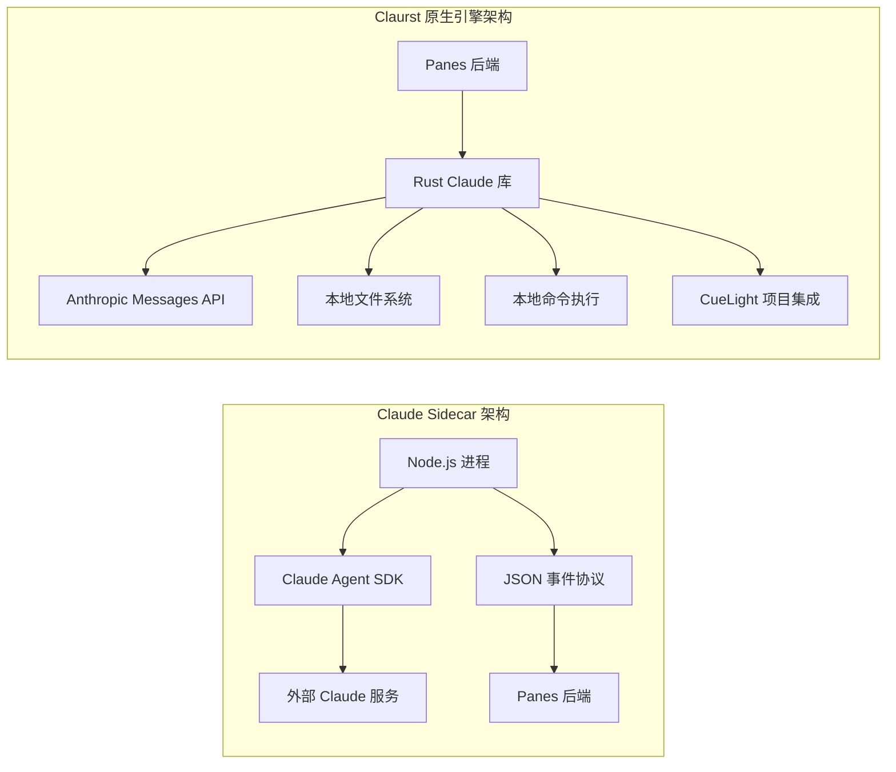

**图表来源**
- [claurst_native.rs:71-87](file://src-tauri/src/engines/claurst_native.rs#L71-L87)
- [claude-agent-sdk-server.mjs:1-25](file://src-tauri/sidecar/claude-agent-sdk-server.mjs#L1-L25)

### 事件驱动的消息处理

两种引擎都采用了事件驱动的异步消息处理模式：

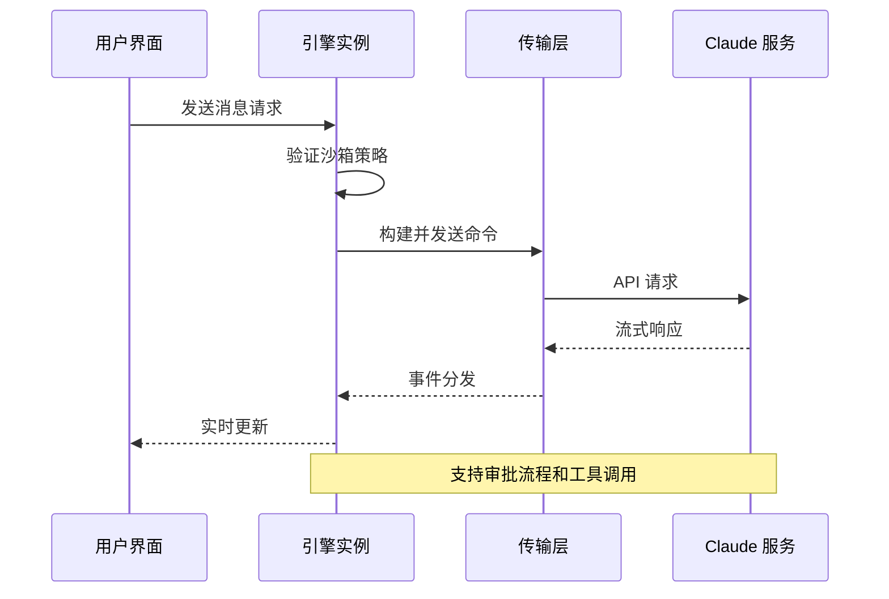

**图表来源**
- [claurst_native.rs:197-345](file://src-tauri/src/engines/claurst_native.rs#L197-L345)
- [claude-agent-sdk-server.mjs:498-532](file://src-tauri/sidecar/claude-agent-sdk-server.mjs#L498-L532)

**章节来源**
- [claurst_native.rs:197-345](file://src-tauri/src/engines/claurst_native.rs#L197-L345)
- [claude-agent-sdk-server.mjs:498-532](file://src-tauri/sidecar/claude-agent-sdk-server.mjs#L498-L532)

## 详细组件分析

### Claurst 原生引擎

Claurst 原生引擎是全新的内置 Rust 实现，提供更紧密的系统集成和 CueLight 项目支持。

#### 核心架构设计

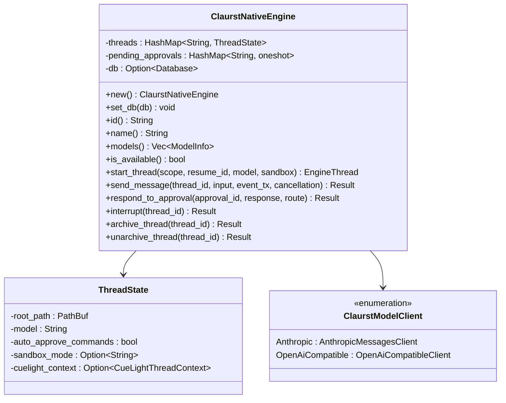

**图表来源**
- [claurst_native.rs:50-97](file://src-tauri/src/engines/claurst_native.rs#L50-L97)
- [claurst_native.rs:57-69](file://src-tauri/src/engines/claurst_native.rs#L57-L69)
- [claurst_native.rs:71-74](file://src-tauri/src/engines/claurst_native.rs#L71-L74)

#### 模型客户端适配器

Claurst 引擎支持多种模型提供商的统一适配：

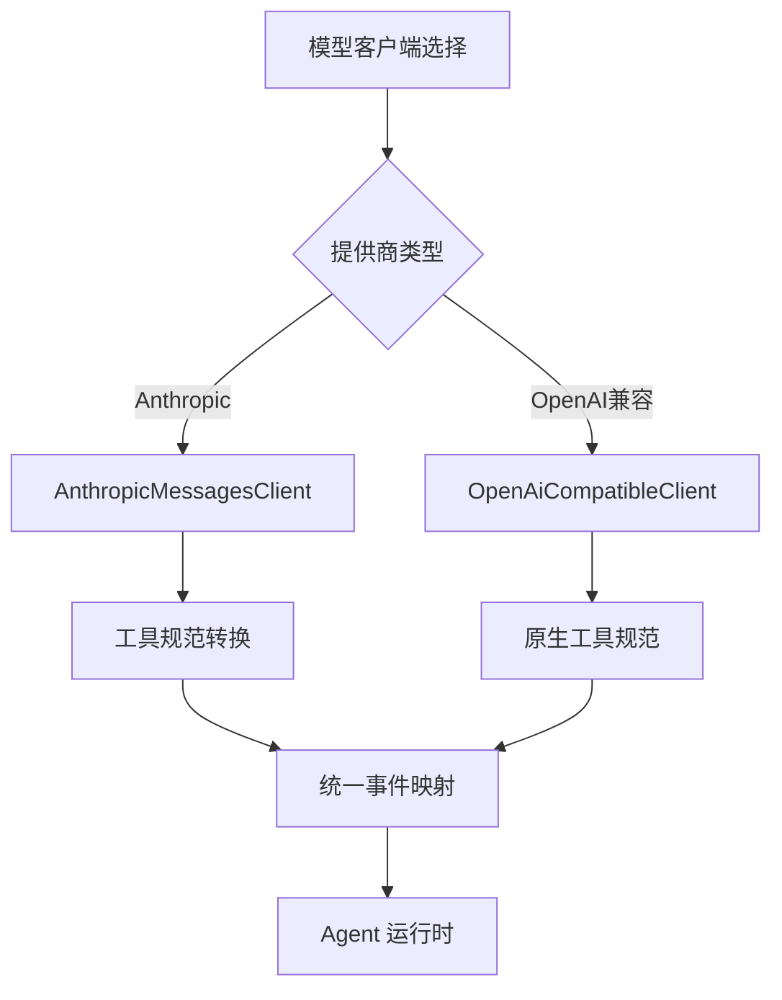

**图表来源**
- [claurst_native.rs:807-831](file://src-tauri/src/engines/claurst_native.rs#L807-L831)
- [claurst_native.rs:833-839](file://src-tauri/src/engines/claurst_native.rs#L833-L839)

#### CueLight 项目集成

Claurst 引擎深度集成了 CueLight 项目管理系统：

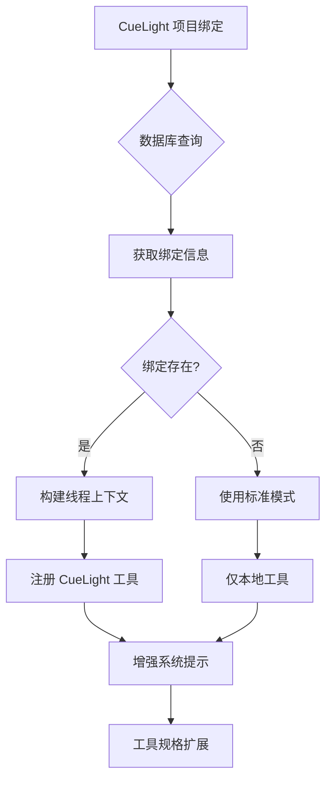

**图表来源**
- [claurst_native.rs:755-769](file://src-tauri/src/engines/claurst_native.rs#L755-L769)
- [claurst_native.rs:771-778](file://src-tauri/src/engines/claurst_native.rs#L771-L778)

**章节来源**
- [claurst_native.rs:50-97](file://src-tauri/src/engines/claurst_native.rs#L50-L97)
- [claurst_native.rs:807-831](file://src-tauri/src/engines/claurst_native.rs#L807-L831)
- [claurst_native.rs:755-769](file://src-tauri/src/engines/claurst_native.rs#L755-L769)

### Claude Sidecar 引擎

Claude Sidecar 引擎通过 Node.js 侧车进程实现与 Claude 服务的通信。

#### 传输层实现

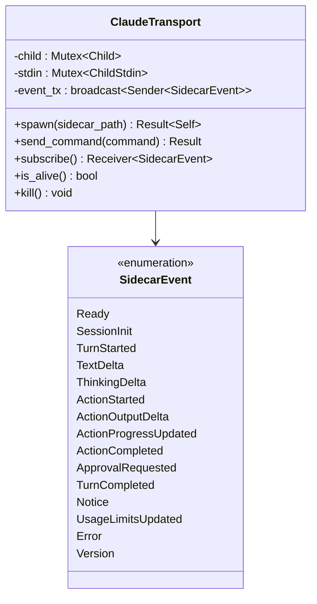

**图表来源**
- [claude-agent-sdk-server.mjs:353-368](file://src-tauri/sidecar/claude-agent-sdk-server.mjs#L353-L368)
- [claude-agent-sdk-server.mjs:39-135](file://src-tauri/sidecar/claude-agent-sdk-server.mjs#L39-L135)

#### 健康检查机制

Claude Sidecar 引擎提供了全面的健康检查功能：

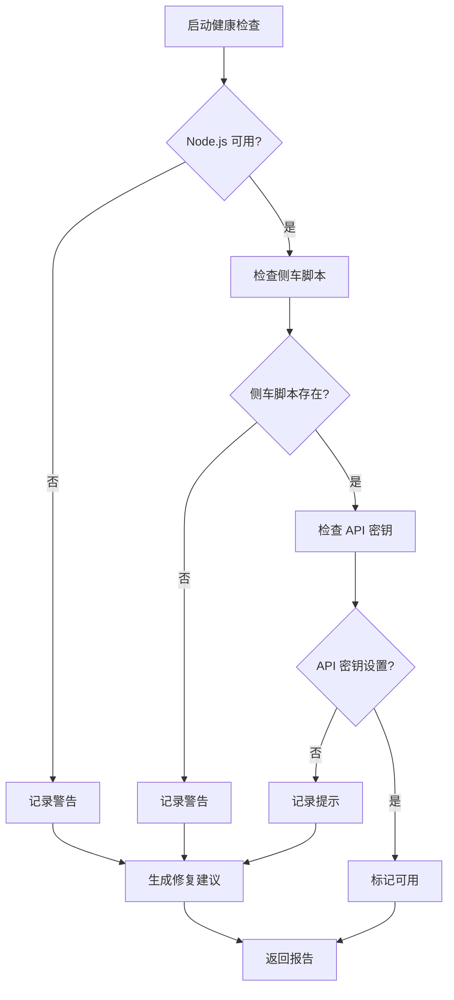

**图表来源**
- [claude-agent-sdk-server.mjs:662-748](file://src-tauri/sidecar/claude-agent-sdk-server.mjs#L662-L748)

**章节来源**
- [claude-agent-sdk-server.mjs:353-368](file://src-tauri/sidecar/claude-agent-sdk-server.mjs#L353-L368)
- [claude-agent-sdk-server.mjs:662-748](file://src-tauri/sidecar/claude-agent-sdk-server.mjs#L662-L748)

### 审批系统集成

前端审批系统提供了统一的审批处理接口：

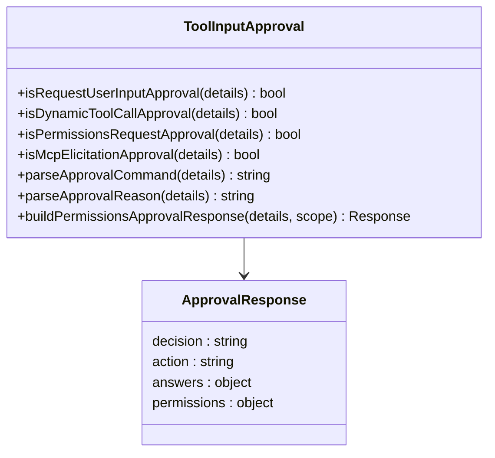

**图表来源**
- [toolInputApproval.ts:1-529](file://src/components/chat/toolInputApproval.ts#L1-L529)

**章节来源**
- [toolInputApproval.ts:1-529](file://src/components/chat/toolInputApproval.ts#L1-L529)

## 依赖关系分析

### 引擎能力矩阵

不同 Claude 引擎支持的能力有所不同：

| 引擎类型 | 权限模式 | 沙箱模式 | 审批决策 |
|---------|---------|---------|---------|
| Claude Sidecar | restricted, standard, trusted | read-only, workspace-write | accept, decline, accept_for_session |
| Claurst 原生引擎 | restricted, standard, trusted | read-only, workspace-write | accept, decline, accept_for_session |
| Codex | untrusted, on-failure, on-request, never | read-only, workspace-write, danger-full-access | accept, decline, cancel, accept_for_session |
| OpenCode | ask, allow, deny | none | accept, decline, cancel, accept_for_session |

**更新** 新增 Claurst 原生引擎的能力支持，移除了 Claude Code Native 的能力描述。

**章节来源**
- [engineCapabilities.ts:9-19](file://src/components/chat/engineCapabilities.ts#L9-L19)
- [mod.rs:132-142](file://src-tauri/src/engines/mod.rs#L132-L142)

### 模型选择和配置

Claude 引擎支持多种模型配置：

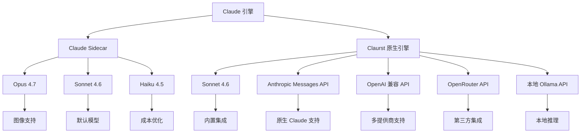

**图表来源**
- [claurst_native.rs:128-155](file://src-tauri/src/engines/claurst_native.rs#L128-L155)
- [claude-agent-sdk-server.mjs:942-1069](file://src-tauri/sidecar/claude-agent-sdk-server.mjs#L942-L1069)

**章节来源**
- [claurst_native.rs:128-155](file://src-tauri/src/engines/claurst_native.rs#L128-L155)
- [claude-agent-sdk-server.mjs:942-1069](file://src-tauri/sidecar/claude-agent-sdk-server.mjs#L942-L1069)

### 引擎别名和迁移

**更新** 新增了引擎别名处理机制，`claude-code-native` 现在被路由到 `claurst-native`：

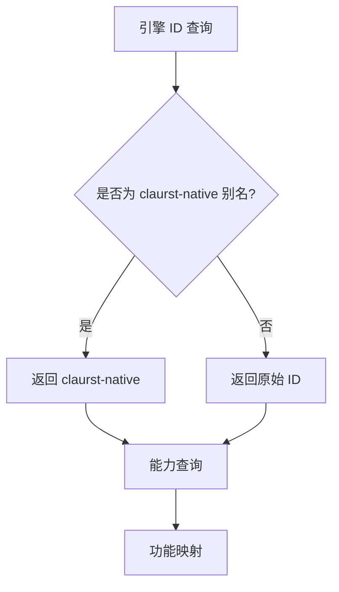

**图表来源**
- [mod.rs:164-166](file://src-tauri/src/engines/mod.rs#L164-L166)
- [mod.rs:150-162](file://src-tauri/src/engines/mod.rs#L150-L162)

**章节来源**
- [mod.rs:164-166](file://src-tauri/src/engines/mod.rs#L164-L166)
- [mod.rs:150-162](file://src-tauri/src/engines/mod.rs#L150-L162)

## 性能考虑

### 内存管理和资源限制

Claurst 原生引擎实施了严格的资源限制：

- **工具输出截断**：最大 64KB 工具输出，防止内存溢出
- **代理循环限制**：每轮最多 12 次 agent 循环，防止无限循环
- **命令执行超时**：默认 60 秒超时，可配置

### 流式处理优化

两种引擎都支持流式处理以提升用户体验：

- **实时文本增量**：即时显示生成内容
- **工具输出流**：渐进式显示工具执行结果
- **事件缓冲**：1024 事件容量的广播通道

**更新** Claurst 引擎增加了对 CueLight 项目的内存文件支持和本地工具执行优化。

## 故障排除指南

### 常见问题诊断

#### Claurst 原生引擎问题

1. **API 密钥配置**
   - 检查 `~/.agent-workspace/settings.json`
   - 确保 API 密钥有效且有足够权限
   - 支持 Anthropic、OpenAI、OpenRouter、Ollama 多提供商

2. **CueLight 项目绑定**
   - 验证数据库连接正常
   - 检查项目绑定是否存在
   - 确认工作区路径正确

3. **沙箱模式限制**
   - 验证工作目录访问权限
   - 检查写入根目录配置
   - 确认 CueLight 工具权限

#### Claude Sidecar 问题

1. **Node.js 未找到**
   - 检查 PATH 环境变量
   - 验证登录 shell 中的 Node.js 可用性
   - 在 macOS 上使用 `launchctl setenv` 修复

2. **侧车脚本缺失**
   - 确认 `claude-agent-sdk-server.mjs` 存在
   - 检查资源目录配置

3. **认证失败**
   - 设置 `ANTHROPIC_API_KEY` 环境变量
   - 验证 Claude Code 登录状态

**章节来源**
- [claurst_native.rs:157-165](file://src-tauri/src/engines/claurst_native.rs#L157-L165)
- [claude-agent-sdk-server.mjs:807-826](file://src-tauri/sidecar/claude-agent-sdk-server.mjs#L807-L826)
- [claude-agent-sdk-server.mjs:662-748](file://src-tauri/sidecar/claude-agent-sdk-server.mjs#L662-L748)

### 日志和调试

- **Claurst 引擎调试**：使用 `RUST_LOG=claurst_native=debug` 启用调试日志
- **Sidecar 调试**：使用 `RUST_LOG=claude_sidecar=debug` 启用调试日志
- **事件监控**：监听引擎事件以跟踪执行状态
- **性能分析**：监控 token 使用和响应时间

## 结论

Panes 的 Claude 引擎集成为开发者提供了灵活的选择：

- **Claude Sidecar** 适合需要外部服务集成和灵活配置的场景
- **Claurst 原生引擎** 是新的首选选择，提供更好的性能、CueLight 集成和多提供商支持

两种引擎都提供了完整的审批系统、沙箱控制和工具执行能力，确保在安全性的同时提供强大的开发体验。

**更新** Claurst 原生引擎作为主要的 Claude 集成方式，提供了更好的系统集成、CueLight 项目支持和多提供商兼容性。

## 附录

### 配置选项参考

| 配置项 | Claude Sidecar | Claurst 原生引擎 | 描述 |
|-------|---------------|-------------------|------|
| API 密钥 | 环境变量 | 配置文件 | 认证凭据 |
| 模型选择 | 运行时参数 | 配置文件 | AI 模型标识 |
| 沙箱模式 | 运行时参数 | 运行时参数 | 文件系统访问控制 |
| 审批策略 | 运行时参数 | 运行时参数 | 工具执行授权 |
| 网络访问 | 运行时参数 | 配置文件 | 网络连接权限 |
| CueLight 集成 | 不支持 | 支持 | 项目管理集成 |

### 最佳实践

1. **安全优先**：始终使用适当的沙箱模式
2. **资源管理**：合理设置超时和内存限制
3. **监控告警**：启用详细的日志和性能监控
4. **备份策略**：定期备份重要数据和配置
5. **测试验证**：在生产环境部署前充分测试
6. **CueLight 集成**：充分利用项目绑定和工具扩展
7. **多提供商支持**：根据需求选择合适的模型提供商

### 引擎迁移指南

**从 Claude Code Native 迁移到 Claurst 原生引擎**：

1. 更新配置文件中的引擎 ID：`claude-code-native` → `claurst-native`
2. 配置新的 API 密钥设置
3. 验证 CueLight 项目绑定
4. 测试工具执行和审批流程
5. 监控性能和资源使用情况