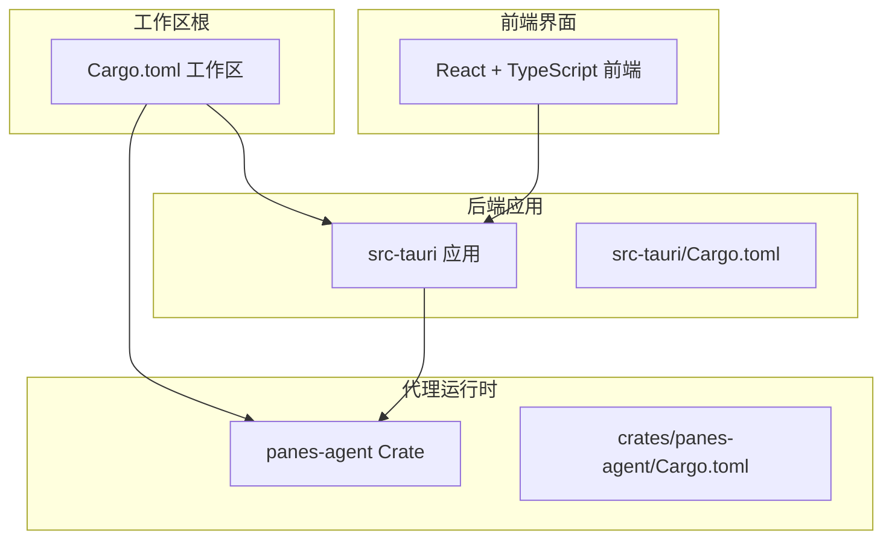
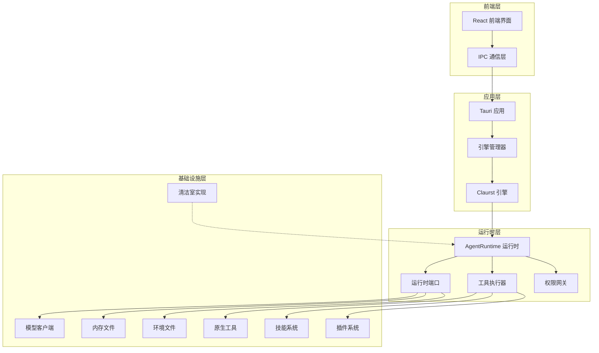
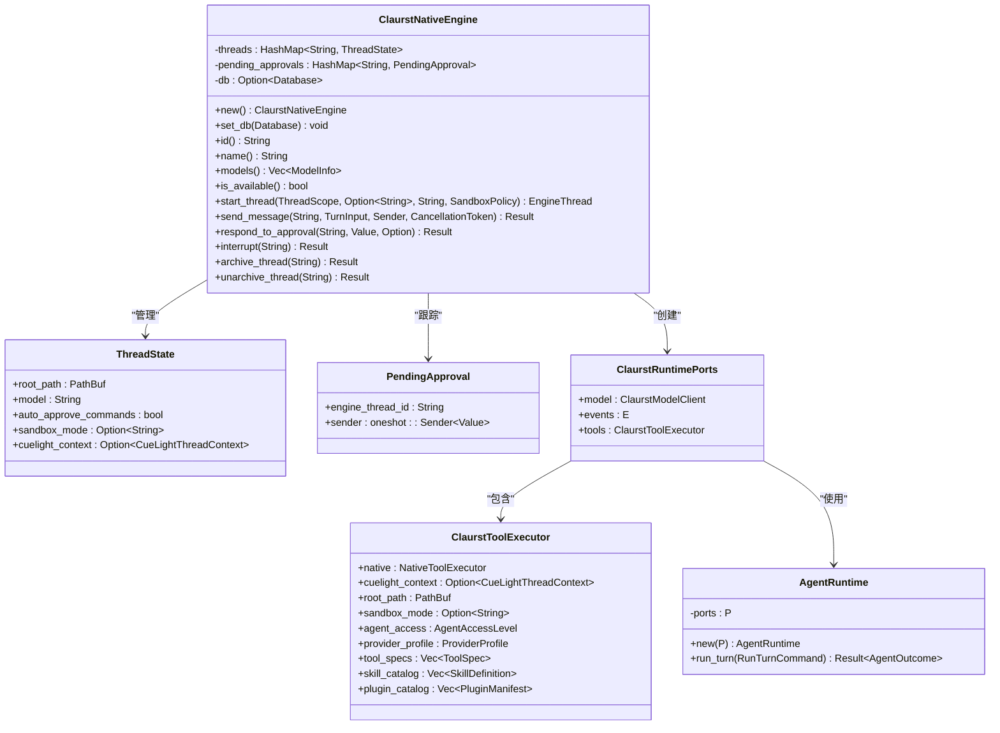
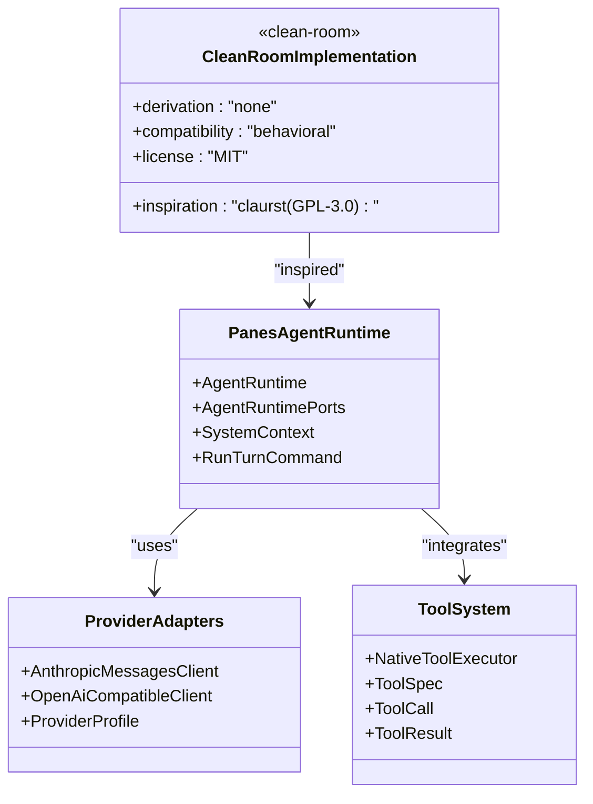
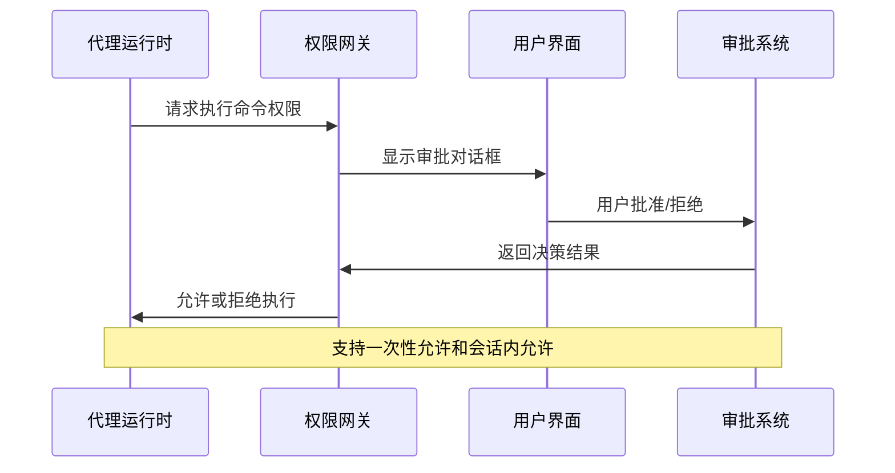
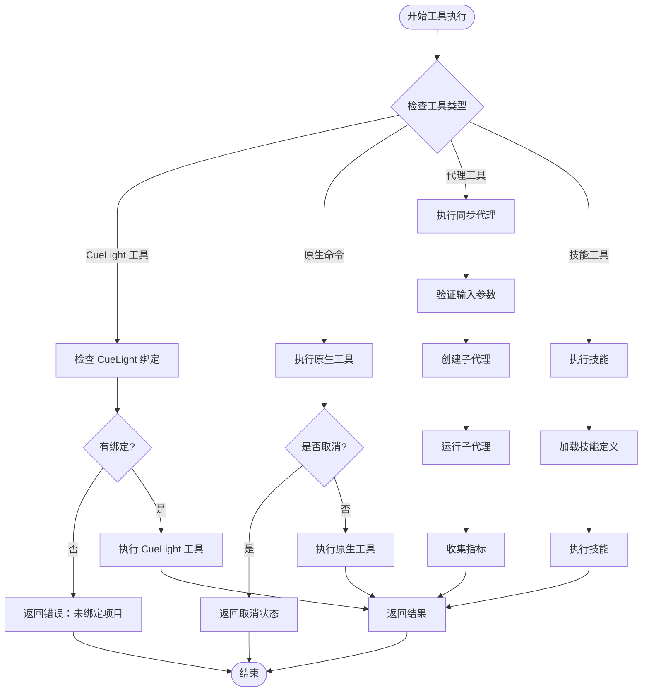

# Claurst 原生引擎

<cite>
**本文档引用的文件**
- [Cargo.toml](file://Cargo.toml)
- [src-tauri/Cargo.toml](file://src-tauri/Cargo.toml)
- [crates/panes-agent/Cargo.toml](file://crates/panes-agent/Cargo.toml)
- [README.md](file://README.md)
- [src-tauri/src/main.rs](file://src-tauri/src/main.rs)
- [src-tauri/src/lib.rs](file://src-tauri/src/lib.rs)
- [src-tauri/src/engines/claurst_native.rs](file://src-tauri/src/engines/claurst_native.rs)
- [src-tauri/src/engines/mod.rs](file://src-tauri/src/engines/mod.rs)
- [crates/panes-agent/src/lib.rs](file://crates/panes-agent/src/lib.rs)
- [crates/panes-agent/src/interfaces/agent_runtime.rs](file://crates/panes-agent/src/interfaces/agent_runtime.rs)
- [crates/panes-agent/src/infrastructure/native_tools/mod.rs](file://crates/panes-agent/src/infrastructure/native_tools/mod.rs)
- [crates/panes-agent/tests/runtime_text_turn.rs](file://crates/panes-agent/tests/runtime_text_turn.rs)
</cite>

## 更新摘要
**所做更改**
- 更新了引擎别名处理逻辑，反映了 claude-code-native 被完全替换为 claurst-native
- 新增了 panes-agent 通用代理运行时框架的详细说明
- 更新了多提供商适配和增强工具系统的架构描述
- 添加了新的架构图和组件分析，展示清洁室实现的设计理念

## 目录
1. [简介](#简介)
2. [项目结构](#项目结构)
3. [核心组件](#核心组件)
4. [架构概览](#架构概览)
5. [详细组件分析](#详细组件分析)
6. [依赖关系分析](#依赖关系分析)
7. [性能考虑](#性能考虑)
8. [故障排除指南](#故障排除指南)
9. [结论](#结论)

## 简介

Claurst 原生引擎是 Panes 应用程序中的关键组件，它提供了一个本地运行的 AI 助手代理运行时环境。该引擎基于 Rust 实现，采用清洁室设计原则，完全独立于原始的 claurst 代码，提供了相似的功能集。

Panes 是一个本地优先的 AI 辅助编码控制台，为开发者提供了一个统一的界面来与 AI 助手交互、检查差异、批准操作、管理多仓库工作以及保持审计跟踪。Claurst 原生引擎作为其中的一个聊天引擎，支持多种模型提供商和工具执行功能，现已完全替代了 claude-code-native 引擎。

**更新** 引擎现在使用全新的 panes-agent 通用代理运行时框架，支持多提供商适配和增强的工具系统

## 项目结构

该项目采用多 Crate 的工作区结构，主要包含以下核心组件：



**图表来源**
- [Cargo.toml:1-25](file://Cargo.toml#L1-L25)
- [src-tauri/Cargo.toml:1-66](file://src-tauri/Cargo.toml#L1-L66)
- [crates/panes-agent/Cargo.toml:1-24](file://crates/panes-agent/Cargo.toml#L1-L24)

**章节来源**
- [Cargo.toml:1-25](file://Cargo.toml#L1-L25)
- [README.md:242-262](file://README.md#L242-L262)

## 核心组件

### 引擎管理器
引擎管理器负责协调和管理不同的聊天引擎，包括 Claurst 原生引擎、Codex 引擎、Claude 引擎等。它提供了统一的接口来启动线程、发送消息和处理引擎事件。

**更新** 引擎管理器现在将 claude-code-native 和 claurst-native 视为同一引擎的不同别名，实现了无缝迁移

### Claurst 原生引擎
这是本次文档的重点，实现了完整的代理运行时功能，包括：
- 多模型提供商支持（Anthropic、OpenAI、OpenRouter、Ollama）
- 本地工具执行能力
- 权限控制系统
- 会话状态管理
- 令牌预算控制
- 增强的技能系统和插件支持

### 代理运行时
代理运行时是引擎的核心，负责：
- 处理对话流程
- 管理工具调用
- 处理权限请求
- 发送事件到前端
- 支持嵌套代理和子代理执行

**章节来源**
- [src-tauri/src/engines/claurst_native.rs:50-97](file://src-tauri/src/engines/claurst_native.rs#L50-L97)
- [crates/panes-agent/src/lib.rs:12-18](file://crates/panes-agent/src/lib.rs#L12-L18)

## 架构概览

Claurst 原生引擎采用了分层架构设计，确保了良好的模块化和可维护性：



**图表来源**
- [src-tauri/src/lib.rs:89-100](file://src-tauri/src/lib.rs#L89-L100)
- [src-tauri/src/engines/claurst_native.rs:22-31](file://src-tauri/src/engines/claurst_native.rs#L22-L31)
- [crates/panes-agent/src/interfaces/agent_runtime.rs:149-167](file://crates/panes-agent/src/interfaces/agent_runtime.rs#L149-L167)

## 详细组件分析

### Claurst 原生引擎类图



**图表来源**
- [src-tauri/src/engines/claurst_native.rs:50-69](file://src-tauri/src/engines/claurst_native.rs#L50-L69)
- [src-tauri/src/engines/claurst_native.rs:394-419](file://src-tauri/src/engines/claurst_native.rs#L394-L419)
- [src-tauri/src/engines/claurst_native.rs:522-532](file://src-tauri/src/engines/claurst_native.rs#L522-L532)
- [crates/panes-agent/src/interfaces/agent_runtime.rs:149-167](file://crates/panes-agent/src/interfaces/agent_runtime.rs#L149-L167)

### 清洁室实现架构



**图表来源**
- [crates/panes-agent/src/lib.rs:1-6](file://crates/panes-agent/src/lib.rs#L1-L6)
- [src-tauri/src/engines/claurst_native.rs:71-87](file://src-tauri/src/engines/claurst_native.rs#L71-L87)
- [crates/panes-agent/src/infrastructure/native_tools/mod.rs:41-103](file://crates/panes-agent/src/infrastructure/native_tools/mod.rs#L41-L103)

### 权限控制系统



**图表来源**
- [src-tauri/src/engines/claurst_native.rs:468-520](file://src-tauri/src/engines/claurst_native.rs#L468-L520)

**章节来源**
- [src-tauri/src/engines/claurst_native.rs:118-382](file://src-tauri/src/engines/claurst_native.rs#L118-L382)

### 工具执行流程



**图表来源**
- [src-tauri/src/engines/claurst_native.rs:534-702](file://src-tauri/src/engines/claurst_native.rs#L534-L702)

**章节来源**
- [src-tauri/src/engines/claurst_native.rs:522-702](file://src-tauri/src/engines/claurst_native.rs#L522-L702)

## 依赖关系分析

### Rust 工作区依赖

```mermaid
graph TB
subgraph "工作区依赖"
TOKIO[tokio 1.37]
SERDE[serde 1.0]
REQWEST[reqwest 0.12]
SQLITE[rusqlite 0.31]
UUID[uuid 1.8]
END
subgraph "应用依赖"
TAURI[tauri 2]
FS[tauri-plugin-fs 2]
NOTIF[tauri-plugin-notification 2]
PROC[tauri-plugin-process 2]
END
subgraph "代理依赖"
ANYHOW[anyhow 1.0]
FUTURES[futures 0.3]
REGEX[regex 1]
TOML[toml 0.8]
END
TOKIO --> TAURI
SERDE --> TAURI
REQWEST --> TAURI
SQLITE --> TAURI
UUID --> TAURI
ANYHOW --> FS
FUTURES --> FS
REGEX --> FS
TOML --> FS
```

**图表来源**
- [Cargo.toml:8-24](file://Cargo.toml#L8-L24)
- [src-tauri/Cargo.toml:15-48](file://src-tauri/Cargo.toml#L15-L48)
- [crates/panes-agent/Cargo.toml:8-22](file://crates/panes-agent/Cargo.toml#L8-L22)

### 模块间依赖关系

```mermaid
graph LR
subgraph "代理域层"
AG[agents]
BK[budget]
CV[conversation]
PM[permission]
PR[provider]
SK[skills]
SO[structured_output]
SY[system_prompt]
TL[telemetry]
TS[tools]
END
subgraph "应用层"
PORTS[ports]
RUN[run_agent_turn]
END
subgraph "基础设施层"
ANTH[anthropic]
ENV[env_files]
MEM[memory_files]
NAT[native_tools]
OPEN[openai_compatible]
SKILL[skills]
END
AG --> PORTS
BK --> PORTS
PM --> PORTS
PR --> PORTS
SK --> PORTS
TL --> PORTS
TS --> PORTS
RUN --> PORTS
RUN --> ANTH
RUN --> NAT
RUN --> SKILL
ANTH --> ENV
ANTH --> MEM
NAT --> ENV
NAT --> MEM
```

**图表来源**
- [crates/panes-agent/src/domain/mod.rs:1-12](file://crates/panes-agent/src/domain/mod.rs#L1-L12)
- [crates/panes-agent/src/application/mod.rs:1-2](file://crates/panes-agent/src/application/mod.rs#L1-L2)
- [crates/panes-agent/src/infrastructure/mod.rs:1-8](file://crates/panes-agent/src/infrastructure/mod.rs#L1-L8)

**章节来源**
- [Cargo.toml:8-24](file://Cargo.toml#L8-L24)
- [crates/panes-agent/src/domain/mod.rs:1-12](file://crates/panes-agent/src/domain/mod.rs#L1-L12)

## 性能考虑

### 并发处理
- 使用 Tokio 异步运行时处理并发操作
- 采用多生产者单消费者通道进行事件传递
- 支持取消令牌机制避免资源泄漏

### 内存管理
- 使用智能指针和共享所有权模式
- 实现了适当的生命周期管理和资源清理
- 支持大文件和长对话的流式处理

### 缓存策略
- 文件树缓存减少重复扫描
- 会话状态缓存避免频繁数据库查询
- 工具执行结果缓存

### 清洁室实现优势
- 完全独立的代码库，避免法律风险
- 可扩展的架构设计
- 增强的工具系统和技能支持

## 故障排除指南

### 常见问题诊断

1. **引擎不可用**
   - 检查环境变量配置
   - 验证模型提供商凭据
   - 确认网络连接状态

2. **权限拒绝**
   - 检查用户审批状态
   - 验证代理访问级别
   - 确认工具执行限制

3. **工具执行失败**
   - 查看工作目录权限
   - 验证工具参数格式
   - 检查沙箱模式设置

4. **引擎别名问题**
   - 确认使用 claurst-native 而非 claude-code-native
   - 验证引擎管理器的别名处理逻辑

**章节来源**
- [src-tauri/src/engines/claurst_native.rs:157-165](file://src-tauri/src/engines/claurst_native.rs#L157-L165)
- [src-tauri/src/engines/claurst_native.rs:468-520](file://src-tauri/src/engines/claurst_native.rs#L468-L520)

## 结论

Claurst 原生引擎是一个设计精良的本地 AI 助手代理运行时系统，具有以下特点：

1. **模块化设计**：清晰的分层架构和职责分离
2. **安全性**：完善的权限控制系统和沙箱机制
3. **可扩展性**：支持多种模型提供商和工具类型
4. **可靠性**：健壮的错误处理和恢复机制
5. **性能优化**：异步处理和缓存策略
6. **清洁室实现**：完全独立的代码库，避免法律风险
7. **增强工具系统**：支持技能、插件和嵌套代理执行

**更新** 该引擎现已完全替代 claude-code-native 引擎，采用全新的 panes-agent 通用代理运行时框架，支持多提供商适配和增强的工具系统。通过清洁室设计原则，它避免了法律风险，同时保持了功能的完整性和兼容性。

该引擎为 Panes 应用提供了强大的本地 AI 助手能力，支持从简单的文本查询到复杂的文件操作和系统管理任务。其清洁室实现确保了长期的可持续发展和法律合规性。