# Codex 引擎集成

<cite>
**本文档引用的文件**
- [src\types.ts](file://src\types.ts)
- [src\lib\chatEngineIds.ts](file://src\lib\chatEngineIds.ts)
- [src\stores\engineStore.ts](file://src\stores\engineStore.ts)
- [src\components\chat\CodexConfigPicker.tsx](file://src\components\chat\CodexConfigPicker.tsx)
- [src\components\chat\CodexReviewPicker.tsx](file://src\components\chat\CodexReviewPicker.tsx)
- [src\components\chat\CodexRuntimePicker.tsx](file://src\components\chat\CodexRuntimePicker.tsx)
- [src\components\chat\CodexThreadPicker.tsx](file://src\components\chat\CodexThreadPicker.tsx)
- [src\components\chat\codexInputItems.ts](file://src\components\chat\codexInputItems.ts)
- [src\components\chat\reasoningEffort.ts](file://src\components\chat\reasoningEffort.ts)
- [src-tauri\src\engines\codex.rs](file://src-tauri\src\engines\codex.rs)
- [src-tauri\src\engines\codex_transport.rs](file://src-tauri\src\engines\codex_transport.rs)
- [src-tauri\src\engines\codex_protocol.rs](file://src-tauri\src\engines\codex_protocol.rs)
- [src-tauri\src\engines\codex_event_mapper.rs](file://src-tauri\src\engines\codex_event_mapper.rs)
</cite>

## 目录
1. [简介](#简介)
2. [项目结构](#项目结构)
3. [核心组件](#核心组件)
4. [架构总览](#架构总览)
5. [详细组件分析](#详细组件分析)
6. [依赖关系分析](#依赖关系分析)
7. [性能考虑](#性能考虑)
8. [故障排除指南](#故障排除指南)
9. [结论](#结论)
10. [附录](#附录)

## 简介
本文件面向希望在应用中集成 Codex 引擎的开发者，系统性阐述 Codex 的独特能力与工程化集成方式。内容覆盖引擎健康检查与运行时诊断、技能系统与应用集成、线程管理与远程线程同步、审查流程、Codex 协议栈与传输层实现、事件映射系统，以及输入项处理、附件管理与推理努力配置等实用指南。

## 项目结构
Codex 集成横跨前端与后端两部分：
- 前端负责用户交互与 UI 组件（配置选择器、运行时信息展示、线程与审查操作面板），并通过 IPC 调用后端能力。
- 后端以 Rust 实现，包含 Codex 引擎适配器、协议解析、传输层、事件映射与状态管理。

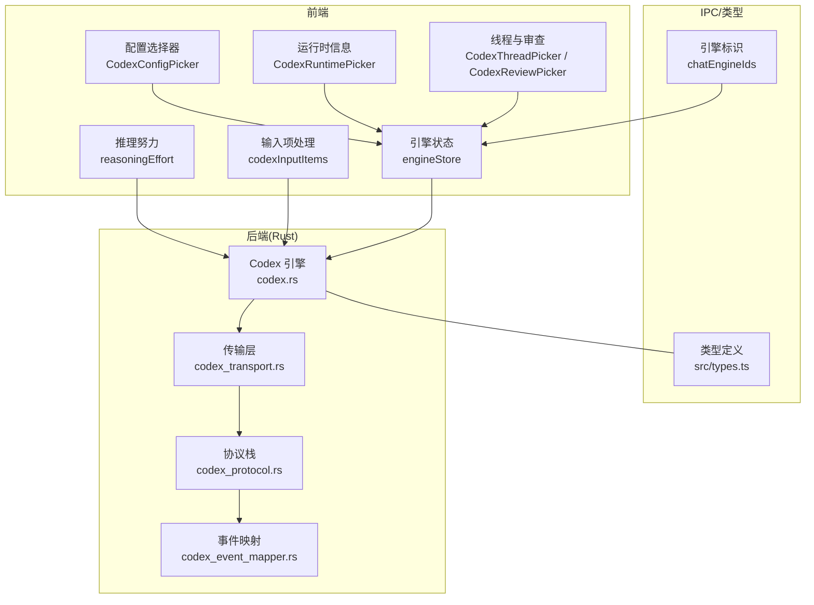

**图表来源**
- [src\components\chat\CodexConfigPicker.tsx:1-430](file://src\components\chat\CodexConfigPicker.tsx#L1-L430)
- [src\components\chat\CodexRuntimePicker.tsx:1-794](file://src\components\chat\CodexRuntimePicker.tsx#L1-L794)
- [src\components\chat\CodexThreadPicker.tsx:1-577](file://src\components\chat\CodexThreadPicker.tsx#L1-L577)
- [src\components\chat\CodexReviewPicker.tsx:1-302](file://src\components\chat\CodexReviewPicker.tsx#L1-L302)
- [src\components\chat\codexInputItems.ts:1-93](file://src\components\chat\codexInputItems.ts#L1-L93)
- [src\components\chat\reasoningEffort.ts:1-53](file://src\components\chat\reasoningEffort.ts#L1-L53)
- [src\stores\engineStore.ts:1-164](file://src\stores\engineStore.ts#L1-L164)
- [src\types.ts:1-800](file://src\types.ts#L1-L800)
- [src\lib\chatEngineIds.ts:1-8](file://src\lib\chatEngineIds.ts#L1-L8)
- [src-tauri\src\engines\codex.rs:1-200](file://src-tauri\src\engines\codex.rs#L1-L200)
- [src-tauri\src\engines\codex_transport.rs:1-200](file://src-tauri\src\engines\codex_transport.rs#L1-L200)
- [src-tauri\src\engines\codex_protocol.rs:1-200](file://src-tauri\src\engines\codex_protocol.rs#L1-L200)
- [src-tauri\src\engines\codex_event_mapper.rs:1-200](file://src-tauri\src\engines\codex_event_mapper.rs#L1-L200)

**章节来源**
- [src\types.ts:153-184](file://src\types.ts#L153-L184)
- [src\stores\engineStore.ts:1-164](file://src\stores\engineStore.ts#L1-L164)
- [src-tauri\src\engines\codex.rs:1-200](file://src-tauri\src\engines\codex.rs#L1-L200)

## 核心组件
- 引擎健康与运行时诊断：前端通过 store 管理引擎发现、健康检查与运行时诊断合并更新；后端提供健康报告与协议诊断。
- 配置选择器：支持个性化人格、服务等级、输出模式与审批策略的配置变更。
- 运行时信息展示：集中呈现账户、配置、技能、插件市场、MCP 服务器、方法可用性与事件历史等。
- 线程与远程同步：支持 fork、回滚、压缩、附加远程线程与分页浏览。
- 审查流程：支持基于未提交变更、基线分支、提交或自定义指令的审查启动。
- 输入项与推理努力：解析消息中的技能/应用标记，按模型能力解析推理努力级别。
- 协议栈与传输层：基于 JSON-RPC 的消息封装、解析与错误处理，配合广播通道订阅事件。
- 事件映射：将底层通知转换为统一的引擎事件，驱动 UI 更新与状态流转。

**章节来源**
- [src\stores\engineStore.ts:23-163](file://src\stores\engineStore.ts#L23-L163)
- [src\types.ts:500-693](file://src\types.ts#L500-L693)
- [src-tauri\src\engines\codex.rs:150-200](file://src-tauri\src\engines\codex.rs#L150-L200)

## 架构总览
下图展示了从前端到后端的调用链路与数据流：

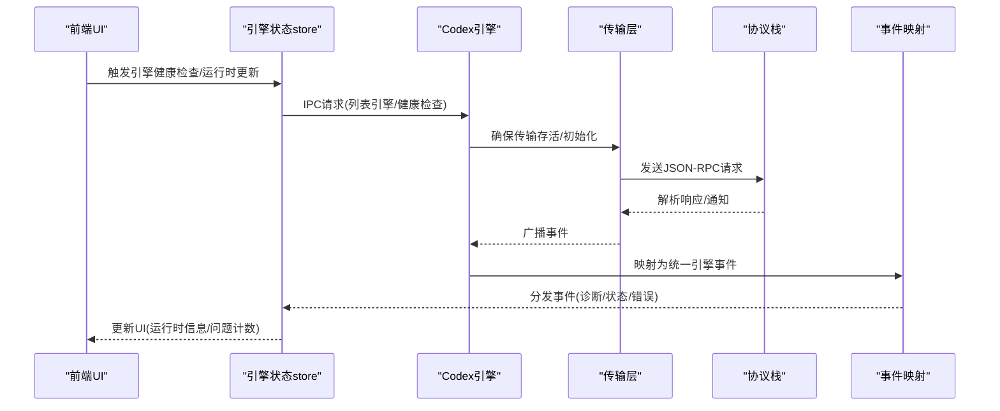

**图表来源**
- [src\stores\engineStore.ts:29-115](file://src\stores\engineStore.ts#L29-L115)
- [src-tauri\src\engines\codex.rs:2101-2170](file://src-tauri\src\engines\codex.rs#L2101-L2170)
- [src-tauri\src\engines\codex_transport.rs:169-200](file://src-tauri\src\engines\codex_transport.rs#L169-L200)
- [src-tauri\src\engines\codex_protocol.rs:61-104](file://src-tauri\src\engines\codex_protocol.rs#L61-L104)
- [src-tauri\src\engines\codex_event_mapper.rs:32-74](file://src-tauri\src\engines\codex_event_mapper.rs#L32-L74)

## 详细组件分析

### 配置选择器（CodexConfigPicker）
- 支持的人格选项：继承、无、友好、务实。
- 服务等级：fast、flex；继承策略与空值处理。
- 输出模式：布尔或 JSON Schema；Approval Policy：JSON 对象校验。
- 变更检测与保存：对比草稿与初始值，进行 JSON 校验后发起保存。

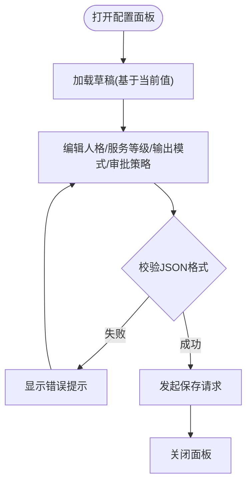

**图表来源**
- [src\components\chat\CodexConfigPicker.tsx:179-243](file://src\components\chat\CodexConfigPicker.tsx#L179-L243)

**章节来源**
- [src\components\chat\CodexConfigPicker.tsx:1-430](file://src\components\chat\CodexConfigPicker.tsx#L1-L430)

### 运行时信息展示（CodexRuntimePicker）
- 账户信息：提供商、认证模式、邮箱、套餐类型、是否需要特定认证。
- 配置信息：模型、模型提供商、服务等级、审批策略、权限配置、沙箱模式、网络搜索、profile、layers。
- 功能与模式：协作模式、实验特性、技能列表、应用列表、插件市场、MCP 服务器。
- 事件历史：配置警告、账号登录、MCP OAuth、Windows 沙箱设置、世界可写警告、线程实时事件。
- 方法可用性与问题计数：聚合方法状态、配置警告、登录失败、OAuth 失败、沙箱设置失败、世界可写警告、外部认证令牌不支持等。

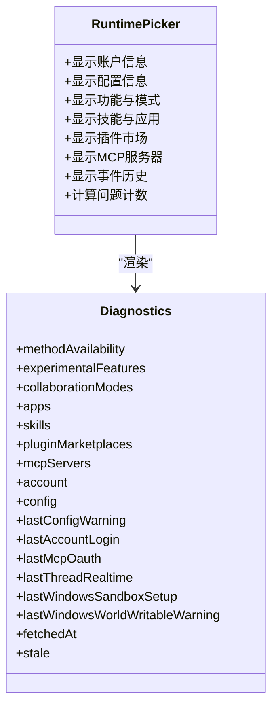

**图表来源**
- [src\components\chat\CodexRuntimePicker.tsx:217-794](file://src\components\chat\CodexRuntimePicker.tsx#L217-L794)
- [src\types.ts:675-693](file://src\types.ts#L675-L693)

**章节来源**
- [src\components\chat\CodexRuntimePicker.tsx:1-794](file://src\components\chat\CodexRuntimePicker.tsx#L1-L794)
- [src\types.ts:675-693](file://src\types.ts#L675-L693)

### 线程与远程同步（CodexThreadPicker）
- 远程线程浏览：支持按活动/归档过滤、关键词搜索、分页加载。
- 本地线程管理：fork 当前线程、回滚指定轮次、压缩上下文。
- 附加远程线程：将远端线程绑定到本地会话，便于继续工作。
- 依赖条件：需要工作区与模型 ID 才能浏览远程线程。

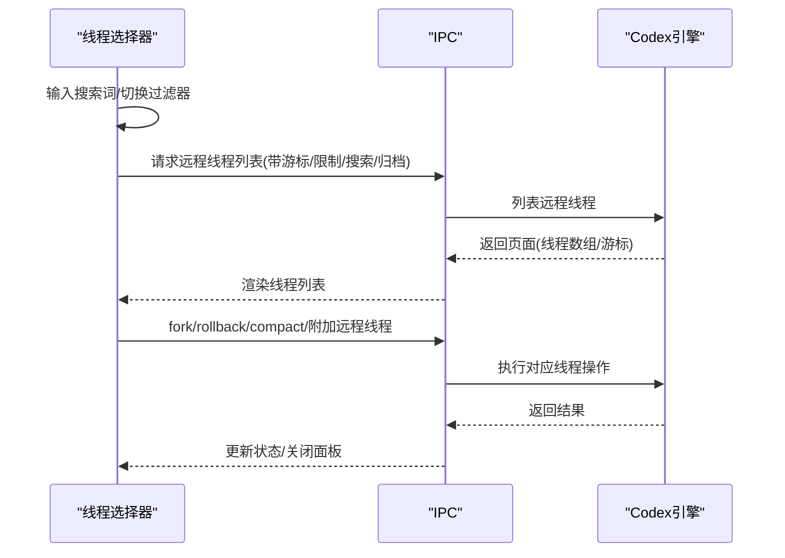

**图表来源**
- [src\components\chat\CodexThreadPicker.tsx:124-237](file://src\components\chat\CodexThreadPicker.tsx#L124-L237)
- [src-tauri\src\engines\codex.rs:52-66](file://src-tauri\src\engines\codex.rs#L52-L66)

**章节来源**
- [src\components\chat\CodexThreadPicker.tsx:1-577](file://src\components\chat\CodexThreadPicker.tsx#L1-L577)
- [src\types.ts:171-189](file://src\types.ts#L171-L189)

### 审查流程（CodexReviewPicker）
- 审查目标：未提交变更、基线分支、指定提交、自定义指令。
- 投递方式：内联/分离式。
- 参数校验：分支/提交/指令必填校验，错误提示。
- 启动审查：构造目标与投递方式，调用后端 review/start。

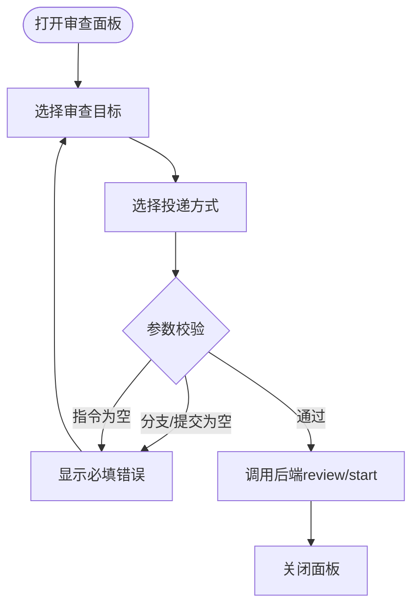

**图表来源**
- [src\components\chat\CodexReviewPicker.tsx:89-127](file://src\components\chat\CodexReviewPicker.tsx#L89-L127)

**章节来源**
- [src\components\chat\CodexReviewPicker.tsx:1-302](file://src\components\chat\CodexReviewPicker.tsx#L1-L302)
- [src\types.ts:206-213](file://src\types.ts#L206-L213)

### 输入项处理与附件管理
- 输入项构建：解析消息中的 $token，优先匹配技能，其次匹配应用，其余作为纯文本。
- 附件管理：限制每轮最多附件数量与大小，文本附件字符上限控制，避免过载。

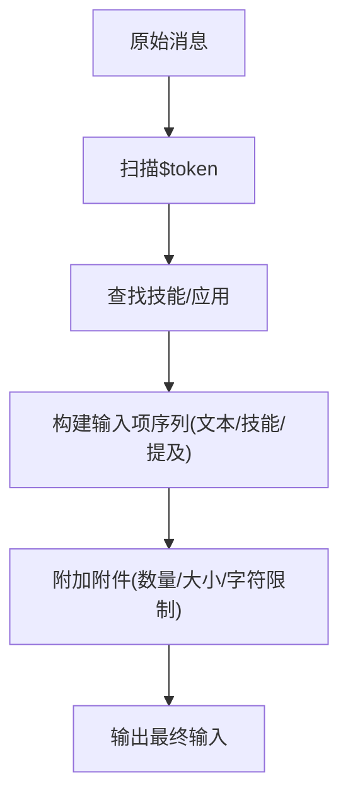

**图表来源**
- [src\components\chat\codexInputItems.ts:48-92](file://src\components\chat\codexInputItems.ts#L48-L92)
- [src-tauri\src\engines\codex.rs:82-84](file://src-tauri\src\engines\codex.rs#L82-L84)

**章节来源**
- [src\components\chat\codexInputItems.ts:1-93](file://src\components\chat\codexInputItems.ts#L1-L93)
- [src-tauri\src\engines\codex.rs:82-84](file://src-tauri\src\engines\codex.rs#L82-L84)

### 推理努力配置
- 解析优先级：首选用户偏好，若模型支持则采用；否则回退到模型默认；若仍不可用则返回空。
- 用途：在消息发送前确定推理努力级别，确保与模型能力匹配。

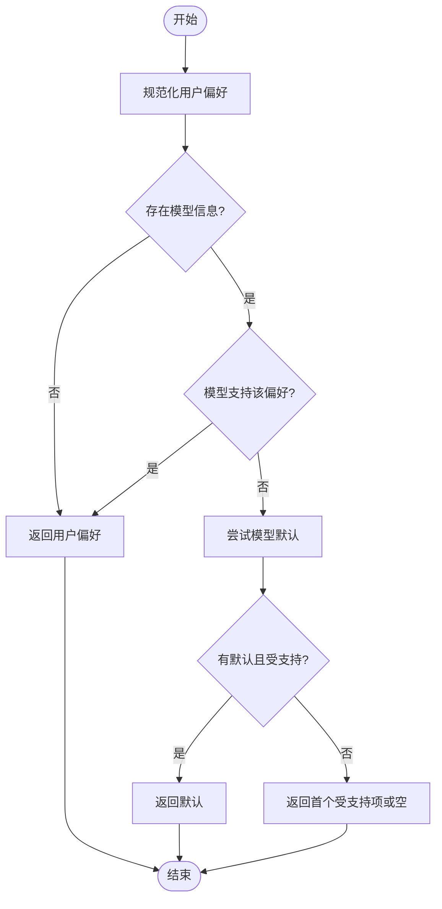

**图表来源**
- [src\components\chat\reasoningEffort.ts:12-52](file://src\components\chat\reasoningEffort.ts#L12-L52)

**章节来源**
- [src\components\chat\reasoningEffort.ts:1-53](file://src\components\chat\reasoningEffort.ts#L1-L53)

### Codex 协议栈与传输层
- 协议封装：JSON-RPC 消息封装与解析，区分请求、通知与响应。
- 错误处理：解析错误与读取错误通知，防止缓冲区膨胀。
- 传输生命周期：spawn 子进程，建立 stdin/stdout/stderr 通道，订阅广播事件，超时与重试策略。

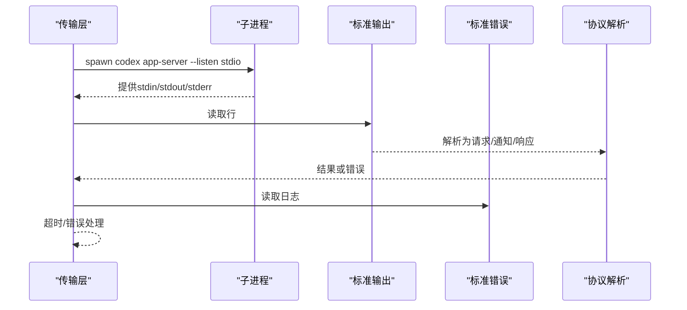

**图表来源**
- [src-tauri\src\engines\codex_transport.rs:44-163](file://src-tauri\src\engines\codex_transport.rs#L44-L163)
- [src-tauri\src\engines\codex_protocol.rs:61-104](file://src-tauri\src\engines\codex_protocol.rs#L61-L104)

**章节来源**
- [src-tauri\src\engines\codex_transport.rs:1-200](file://src-tauri\src\engines\codex_transport.rs#L1-L200)
- [src-tauri\src\engines\codex_protocol.rs:1-200](file://src-tauri\src\engines\codex_protocol.rs#L1-L200)

### 事件映射系统
- 将底层通知映射为统一的引擎事件，如转写增量、计划更新、差异更新、令牌用量、模型重路由、速率限制更新、上下文压缩、警告与守护者审查等。
- 维护状态：动作映射、MCP 进度、推理摘要片段、最新令牌用量与用量限制快照、实时转录状态等。

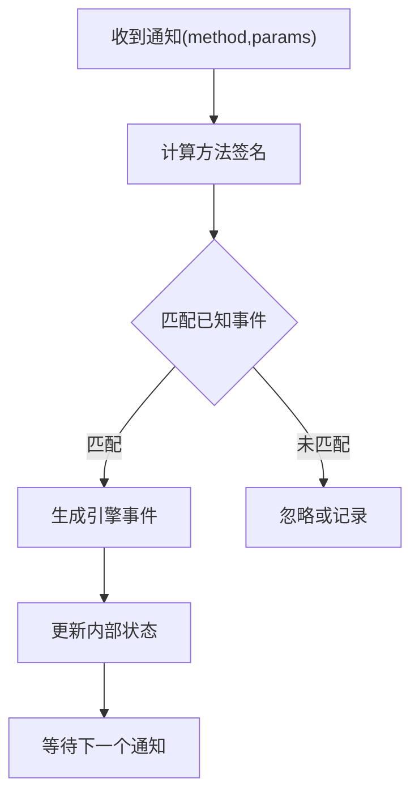

**图表来源**
- [src-tauri\src\engines\codex_event_mapper.rs:32-200](file://src-tauri\src\engines\codex_event_mapper.rs#L32-L200)

**章节来源**
- [src-tauri\src\engines\codex_event_mapper.rs:1-200](file://src-tauri\src\engines\codex_event_mapper.rs#L1-L200)

## 依赖关系分析
- 类型与能力：前端类型定义涵盖引擎、线程、消息、内容块、模型、推理努力、运行时诊断等；后端通过 DTO 与前端类型一一对应。
- 引擎标识：支持 codex、claude、claude-code-native、opencode；Claude 家族引擎识别工具函数。
- 健康与诊断：前端 store 负责健康检查与诊断合并；后端提供健康报告与协议诊断。
- IPC 与命令：后端暴露线程、模型、技能、应用、插件、MCP 服务器、配置、账户等方法；前端通过 IPC 调用。

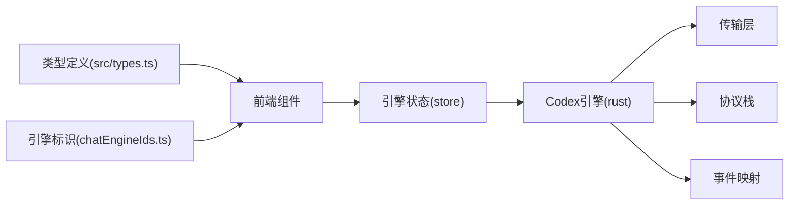

**图表来源**
- [src\types.ts:153-184](file://src\types.ts#L153-L184)
- [src\lib\chatEngineIds.ts:1-8](file://src\lib\chatEngineIds.ts#L1-L8)
- [src\stores\engineStore.ts:1-164](file://src\stores\engineStore.ts#L1-L164)
- [src-tauri\src\engines\codex.rs:43-70](file://src-tauri\src\engines\codex.rs#L43-L70)

**章节来源**
- [src\types.ts:153-184](file://src\types.ts#L153-L184)
- [src\lib\chatEngineIds.ts:1-8](file://src\lib\chatEngineIds.ts#L1-L8)
- [src\stores\engineStore.ts:1-164](file://src\stores\engineStore.ts#L1-L164)
- [src-tauri\src\engines\codex.rs:43-70](file://src-tauri\src\engines\codex.rs#L43-L70)

## 性能考虑
- 传输重启退避：最大重试次数与指数退避，降低瞬时失败对用户体验的影响。
- 大输出裁剪：对终端交互、差异与通用大字段进行字符串裁剪，避免内存与带宽压力。
- 广播缓冲容量：限制事件缓冲大小，避免空闲时占用过多内存。
- 附件限制：单轮附件数量与大小、文本附件长度限制，保障稳定性与响应速度。

**章节来源**
- [src-tauri\src\engines\codex.rs:77-84](file://src-tauri\src\engines\codex.rs#L77-L84)
- [src-tauri\src\engines\codex_protocol.rs:171-185](file://src-tauri\src\engines\codex_protocol.rs#L171-L185)
- [src-tauri\src\engines\codex_transport.rs:20-26](file://src-tauri\src\engines\codex_transport.rs#L20-L26)

## 故障排除指南
- 引擎不可用：健康检查失败时，store 内置兜底健康报告，包含检查命令与修复建议。
- 传输异常：解析错误与 EOF 通知会触发传输失效与重建；查看 stderr 日志定位问题。
- 方法不可用：运行时信息中列出方法可用性与问题详情，结合最近事件排查。
- 认证与沙箱：账号登录、MCP OAuth、Windows 沙箱设置与世界可写警告均有事件记录，便于定位。

**章节来源**
- [src\stores\engineStore.ts:46-55](file://src\stores\engineStore.ts#L46-L55)
- [src-tauri\src\engines\codex_transport.rs:100-131](file://src-tauri\src\engines\codex_transport.rs#L100-L131)
- [src-tauri\src\engines\codex_runtime.rs:675-693](file://src-tauri\src\engines\codex_runtime.rs#L675-L693)

## 结论
Codex 引擎通过清晰的协议栈与传输层、完善的事件映射与运行时诊断，提供了强大的线程管理、审查流程与技能/应用集成能力。前端组件围绕配置、运行时信息、线程与审查提供直观交互，后端以 Rust 实现高可靠与高性能。遵循本文档的输入项处理、附件管理与推理努力配置实践，可有效提升集成质量与用户体验。

## 附录
- 引擎能力与模型信息：前端类型定义包含引擎能力、模型能力与推理努力选项，用于 UI 展示与策略选择。
- 命令与方法清单：后端维护大量方法常量，覆盖初始化、线程、模型、技能、应用、插件、MCP 服务器、配置与账户等。

**章节来源**
- [src\types.ts:448-498](file://src\types.ts#L448-L498)
- [src-tauri\src\engines\codex.rs:43-70](file://src-tauri\src\engines\codex.rs#L43-L70)