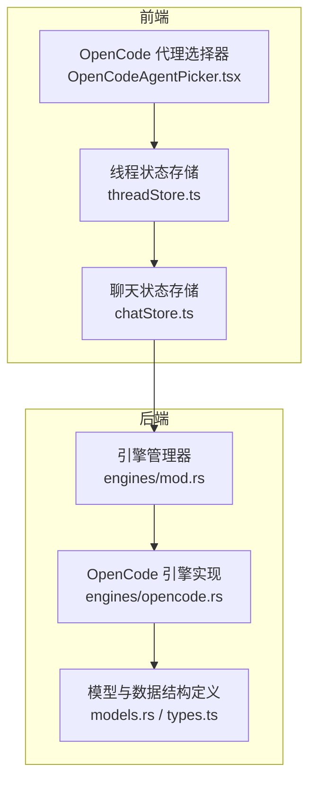
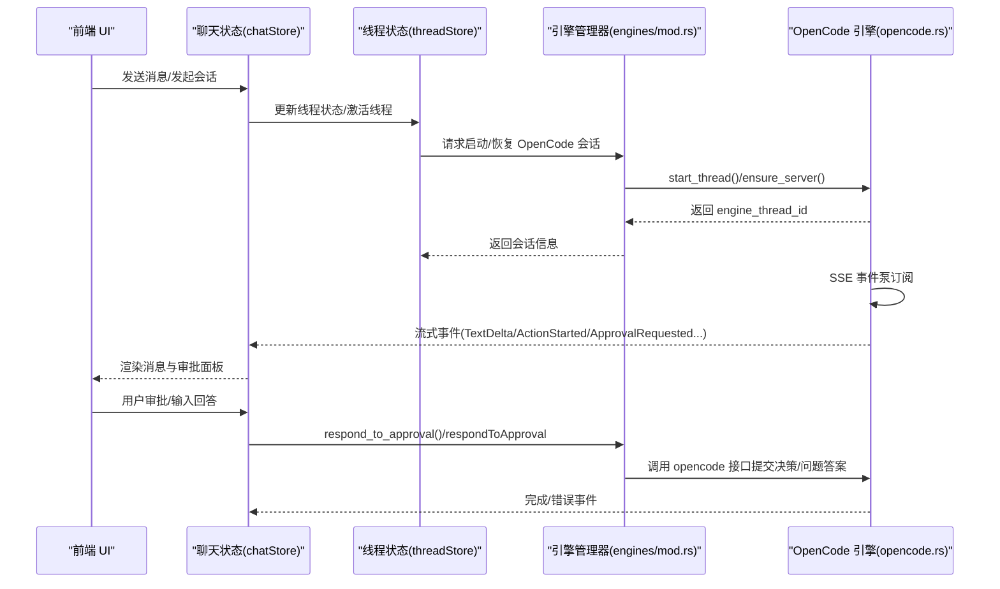
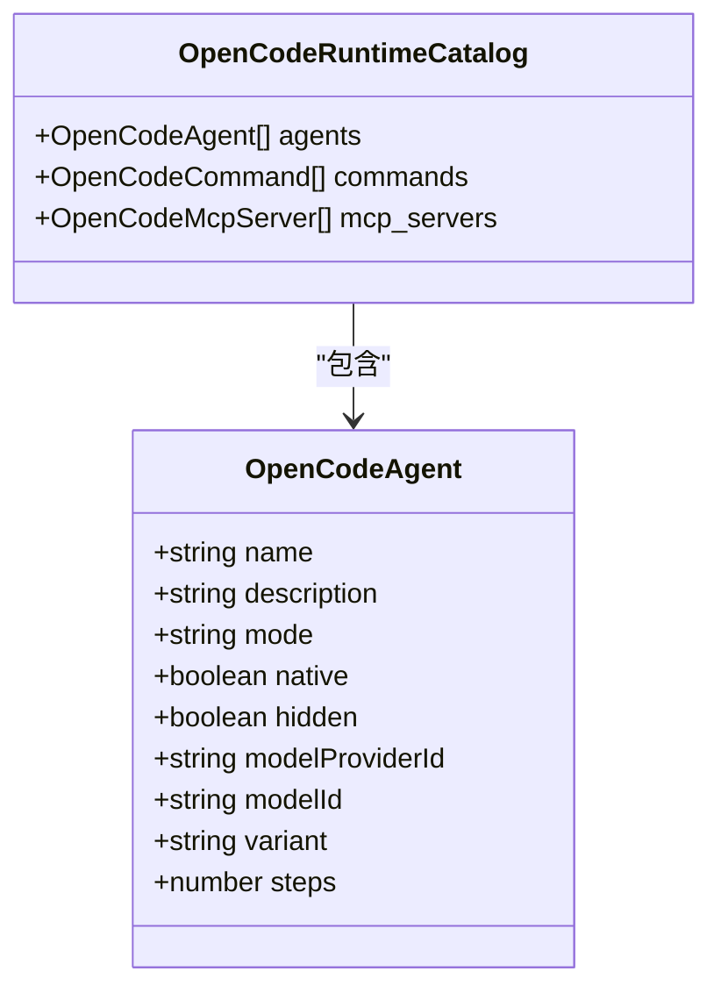
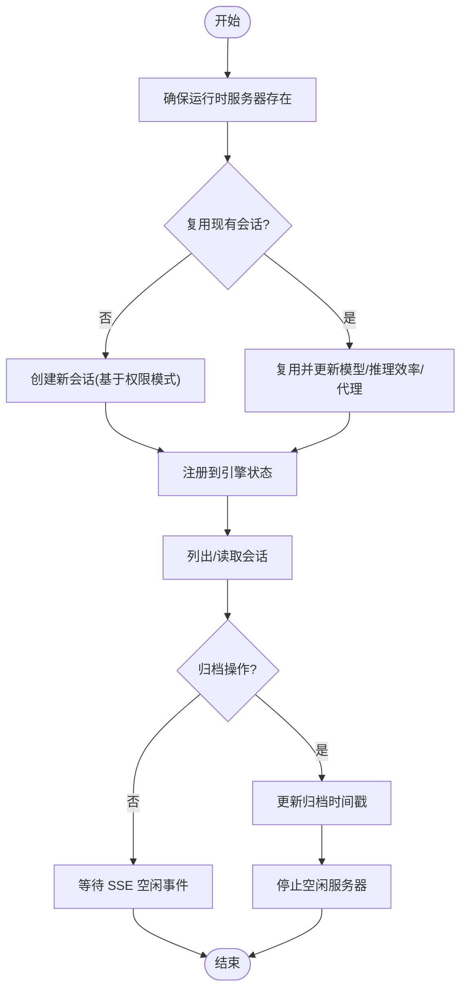
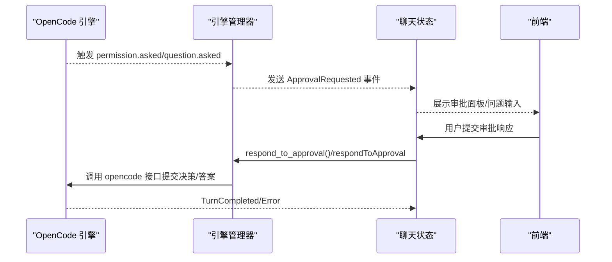
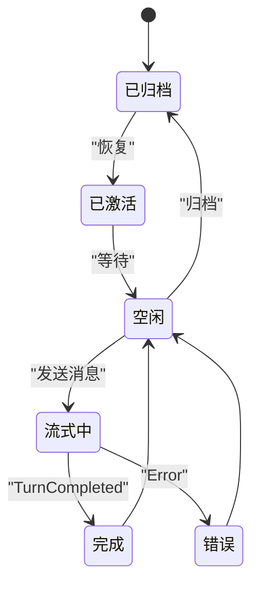
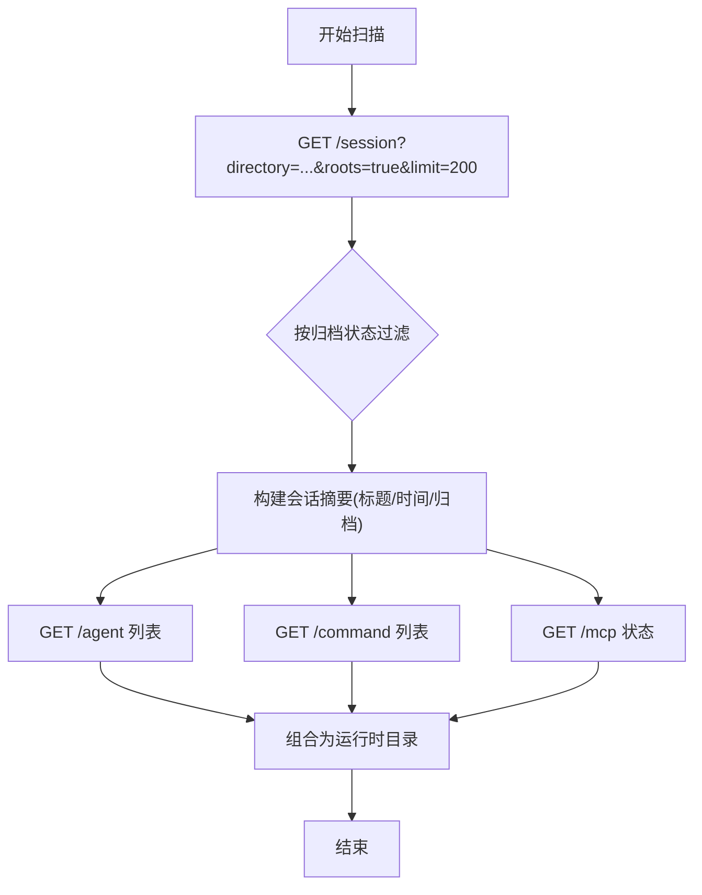
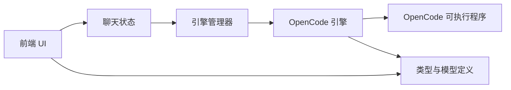

# OpenCode 引擎集成

<cite>
**本文引用的文件**
- [opencode.rs](file://src-tauri/src/engines/opencode.rs)
- [mod.rs](file://src-tauri/src/engines/mod.rs)
- [types.ts](file://src/types.ts)
- [OpenCodeAgentPicker.tsx](file://src/components/chat/OpenCodeAgentPicker.tsx)
- [threadStore.ts](file://src/stores/threadStore.ts)
- [chatStore.ts](file://src/stores/chatStore.ts)
- [models.rs](file://src-tauri/src/models.rs)
</cite>

## 目录
1. [简介](#简介)
2. [项目结构](#项目结构)
3. [核心组件](#核心组件)
4. [架构总览](#架构总览)
5. [详细组件分析](#详细组件分析)
6. [依赖关系分析](#依赖关系分析)
7. [性能考虑](#性能考虑)
8. [故障排查指南](#故障排查指南)
9. [结论](#结论)

## 简介
本文件面向需要在 Panes 中集成与使用 OpenCode 引擎的开发者，系统性阐述 OpenCode 引擎的代理系统、运行时目录与会话管理机制，以及其特有的审批流程、问题回答机制与会话归档能力。文档同时覆盖前端代理选择器、后端引擎实现、状态存储与事件映射、以及调试与性能监控方法，帮助读者快速理解并高效集成 OpenCode。

## 项目结构
OpenCode 集成横跨前端与后端两大层面：
- 前端：负责用户交互（如 OpenCode 代理选择）、线程与消息状态管理、事件流处理与审批响应。
- 后端：负责 OpenCode 引擎进程生命周期、运行时目录扫描、会话创建与归档、事件泵（SSE）订阅与事件分发、模型与命令目录获取等。

图示来源
- [OpenCodeAgentPicker.tsx:49-169](file://src/components/chat/OpenCodeAgentPicker.tsx#L49-L169)
- [threadStore.ts:164-713](file://src/stores/threadStore.ts#L164-L713)
- [chatStore.ts:1-800](file://src/stores/chatStore.ts#L1-L800)
- [mod.rs:1-1180](file://src-tauri/src/engines/mod.rs#L1-L1180)
- [opencode.rs:1-3697](file://src-tauri/src/engines/opencode.rs#L1-L3697)
- [models.rs:417-466](file://src-tauri/src/models.rs#L417-L466)
- [types.ts:542-576](file://src/types.ts#L542-L576)

章节来源
- [OpenCodeAgentPicker.tsx:49-169](file://src/components/chat/OpenCodeAgentPicker.tsx#L49-L169)
- [threadStore.ts:164-713](file://src/stores/threadStore.ts#L164-L713)
- [chatStore.ts:1-800](file://src/stores/chatStore.ts#L1-L800)
- [mod.rs:1-1180](file://src-tauri/src/engines/mod.rs#L1-L1180)
- [opencode.rs:1-3697](file://src-tauri/src/engines/opencode.rs#L1-L3697)
- [models.rs:417-466](file://src-tauri/src/models.rs#L417-L466)
- [types.ts:542-576](file://src/types.ts#L542-L576)

## 核心组件
- OpenCode 引擎实现：负责进程启动、SSE 事件泵、会话管理、权限与问题请求、消息发送与事件映射。
- 引擎管理器：统一暴露引擎能力、健康检查、预热、远程会话列表与读取、归档与取消归档等。
- 前端代理选择器：提供 OpenCode 代理列表与切换，支持“build”等内置代理。
- 线程与聊天状态存储：维护线程生命周期、消息窗口、审批状态、会话归档与恢复。
- 类型与模型：定义 OpenCode 运行时目录、代理、命令、MCP 服务器等数据结构。

章节来源
- [opencode.rs:54-110](file://src-tauri/src/engines/opencode.rs#L54-L110)
- [mod.rs:463-736](file://src-tauri/src/engines/mod.rs#L463-L736)
- [OpenCodeAgentPicker.tsx:49-169](file://src/components/chat/OpenCodeAgentPicker.tsx#L49-L169)
- [threadStore.ts:164-713](file://src/stores/threadStore.ts#L164-L713)
- [chatStore.ts:114-156](file://src/stores/chatStore.ts#L114-L156)
- [types.ts:542-576](file://src/types.ts#L542-L576)

## 架构总览
OpenCode 引擎通过本地可执行程序提供服务，后端以“运行时目录”为单位管理多个 OpenCode 服务器实例，并为每个会话分配独立的会话 ID。前端通过引擎管理器与后端交互，完成会话列表、读取、归档与恢复，以及代理选择与审批流程。

图示来源
- [chatStore.ts:114-156](file://src/stores/chatStore.ts#L114-L156)
- [threadStore.ts:586-626](file://src/stores/threadStore.ts#L586-L626)
- [mod.rs:758-793](file://src-tauri/src/engines/mod.rs#L758-L793)
- [opencode.rs:686-784](file://src-tauri/src/engines/opencode.rs#L686-L784)

## 详细组件分析

### OpenCode 代理系统
- 代理来源：通过运行时目录查询 OpenCode 提供的代理清单，包含名称、描述、模式、是否原生、关联模型等。
- 代理选择：前端提供代理选择器，支持内置“build”代理与外部代理；选择后作为会话参数传入引擎。
- 代理参数：会话启动时可指定代理名（忽略默认“build”），并结合模型与推理效率变体。

图示来源
- [types.ts:542-576](file://src/types.ts#L542-L576)
- [models.rs:428-466](file://src-tauri/src/models.rs#L428-L466)

章节来源
- [OpenCodeAgentPicker.tsx:49-169](file://src/components/chat/OpenCodeAgentPicker.tsx#L49-L169)
- [opencode.rs:1103-1145](file://src-tauri/src/engines/opencode.rs#L1103-L1145)
- [opencode.rs:2069-2074](file://src-tauri/src/engines/opencode.rs#L2069-L2074)

### 运行时目录与会话管理
- 运行时目录：以工作区根路径或仓库路径为单位，每个目录对应一个 OpenCode 服务器实例。
- 会话创建：根据权限模式（ask/allow/deny）创建会话；若已有会话且权限匹配则复用。
- 会话归档：支持按目录列出会话、读取会话详情、归档/取消归档；归档会移除内存中的会话记录并停止空闲服务器。

图示来源
- [opencode.rs:639-684](file://src-tauri/src/engines/opencode.rs#L639-L684)
- [opencode.rs:1147-1248](file://src-tauri/src/engines/opencode.rs#L1147-L1248)
- [opencode.rs:1368-1430](file://src-tauri/src/engines/opencode.rs#L1368-L1430)

章节来源
- [opencode.rs:639-684](file://src-tauri/src/engines/opencode.rs#L639-L684)
- [opencode.rs:1147-1248](file://src-tauri/src/engines/opencode.rs#L1147-L1248)
- [opencode.rs:1368-1430](file://src-tauri/src/engines/opencode.rs#L1368-L1430)

### 审批流程与问题回答机制
- 权限请求：当工具/操作需要权限时，OpenCode 通过事件泵发出“permission.asked”，后端将其转换为审批请求事件并携带请求路由。
- 问题请求：当需要用户输入时，OpenCode 通过“question.asked”事件触发，后端封装为审批请求并附带问题详情。
- 审批响应：前端收到审批事件后，用户可在 UI 中选择接受/拒绝/会话级接受/取消等；后端将响应标准化并调用 OpenCode 对应接口提交结果。

图示来源
- [opencode.rs:1883-1983](file://src-tauri/src/engines/opencode.rs#L1883-L1983)
- [mod.rs:244-293](file://src-tauri/src/engines/mod.rs#L244-L293)
- [chatStore.ts:293-351](file://src/stores/chatStore.ts#L293-L351)

章节来源
- [opencode.rs:1883-1983](file://src-tauri/src/engines/opencode.rs#L1883-L1983)
- [mod.rs:244-293](file://src-tauri/src/engines/mod.rs#L244-L293)
- [chatStore.ts:293-351](file://src/stores/chatStore.ts#L293-L351)

### 会话生命周期管理
- 生命周期：从“创建/复用会话”到“消息发送/事件接收/动作执行/完成/错误”，再到“归档/恢复/忘记”。
- 状态映射：后端将 OpenCode 事件映射为统一的引擎事件（文本增量、思考内容、动作开始/进度/完成、差异更新、错误等），前端据此渲染。
- 恢复与回滚：通过引擎管理器提供的接口进行线程同步快照与回滚，配合前端线程存储进行状态更新。

图示来源
- [opencode.rs:1624-1643](file://src-tauri/src/engines/opencode.rs#L1624-L1643)
- [threadStore.ts:384-459](file://src/stores/threadStore.ts#L384-L459)

章节来源
- [opencode.rs:1624-1643](file://src-tauri/src/engines/opencode.rs#L1624-L1643)
- [threadStore.ts:384-459](file://src/stores/threadStore.ts#L384-L459)

### 运行时目录扫描与代理发现
- 目录扫描：以工作区根路径为单位，通过 HTTP 查询当前目录下的会话列表，并支持搜索与归档过滤。
- 代理与命令发现：通过 GET /agent、/command、/mcp 获取运行时代理、命令与 MCP 服务器状态，映射为前端可用的数据结构。

图示来源
- [opencode.rs:1147-1191](file://src-tauri/src/engines/opencode.rs#L1147-L1191)
- [opencode.rs:1103-1145](file://src-tauri/src/engines/opencode.rs#L1103-L1145)

章节来源
- [opencode.rs:1147-1191](file://src-tauri/src/engines/opencode.rs#L1147-L1191)
- [opencode.rs:1103-1145](file://src-tauri/src/engines/opencode.rs#L1103-L1145)

## 依赖关系分析
- 前端依赖后端引擎管理器提供的统一接口，包括引擎能力、健康检查、预热、远程会话管理与线程生命周期控制。
- 后端 OpenCode 引擎依赖运行时环境解析、进程启动、SSE 事件泵、HTTP 请求与 JSON 解析。
- 数据结构在 TypeScript 与 Rust 之间保持一致映射，确保前后端交互稳定。

图示来源
- [mod.rs:463-736](file://src-tauri/src/engines/mod.rs#L463-L736)
- [opencode.rs:1-3697](file://src-tauri/src/engines/opencode.rs#L1-L3697)
- [models.rs:417-466](file://src-tauri/src/models.rs#L417-L466)
- [types.ts:542-576](file://src/types.ts#L542-L576)

章节来源
- [mod.rs:463-736](file://src-tauri/src/engines/mod.rs#L463-L736)
- [opencode.rs:1-3697](file://src-tauri/src/engines/opencode.rs#L1-L3697)
- [models.rs:417-466](file://src-tauri/src/models.rs#L417-L466)
- [types.ts:542-576](file://src/types.ts#L542-L576)

## 性能考虑
- 事件聚合与节流：前端对流式事件进行合并与批量刷新，减少渲染压力。
- SSE 连接与重连：后端事件泵具备指数退避与取消令牌，避免连接抖动与资源泄漏。
- 模型目录缓存：运行时模型目录在满足条件时进行缓存，降低重复查询成本。
- 会话复用：同一目录下优先复用已存在且权限匹配的会话，减少服务器启动开销。

章节来源
- [chatStore.ts:231-291](file://src/stores/chatStore.ts#L231-L291)
- [opencode.rs:2495-2578](file://src-tauri/src/engines/opencode.rs#L2495-L2578)
- [opencode.rs:1093-1101](file://src-tauri/src/engines/opencode.rs#L1093-L1101)
- [opencode.rs:639-684](file://src-tauri/src/engines/opencode.rs#L639-L684)

## 故障排查指南
- 可执行程序缺失：健康报告会提示未找到 OpenCode 可执行程序，并给出安装建议。
- 启动超时/不健康：后端在限定时间内等待服务器就绪与健康检查，失败时返回错误。
- 事件泵异常：SSE 连接失败时自动重试并记录日志，必要时检查网络与认证头。
- 审批响应格式：后端对 OpenCode 审批响应进行标准化，确保字段合法与决策值正确。

章节来源
- [opencode.rs:1032-1042](file://src-tauri/src/engines/opencode.rs#L1032-L1042)
- [opencode.rs:2580-2605](file://src-tauri/src/engines/opencode.rs#L2580-L2605)
- [opencode.rs:2495-2578](file://src-tauri/src/engines/opencode.rs#L2495-L2578)
- [mod.rs:244-293](file://src-tauri/src/engines/mod.rs#L244-L293)

## 结论
OpenCode 引擎集成通过清晰的前后端职责划分与统一的事件模型，实现了从运行时目录扫描、代理发现、会话生命周期管理到审批与问题回答的完整闭环。借助会话复用、事件泵与状态映射，系统在保证用户体验的同时兼顾了性能与稳定性。建议在生产环境中关注可执行程序可用性、SSE 连接稳定性与审批响应标准化，以获得最佳集成效果。