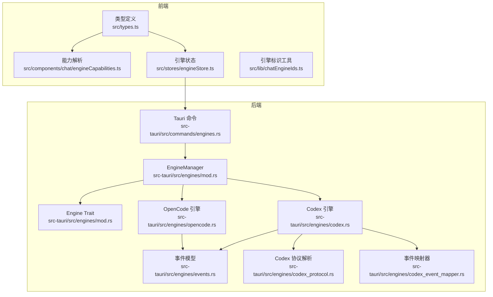
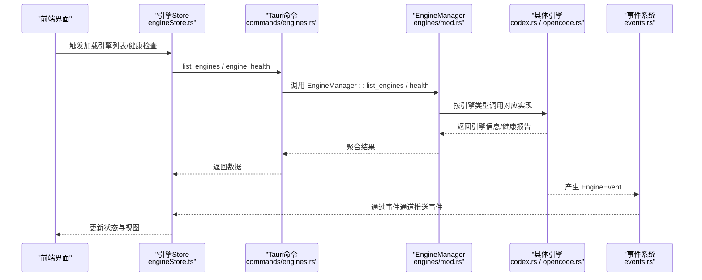
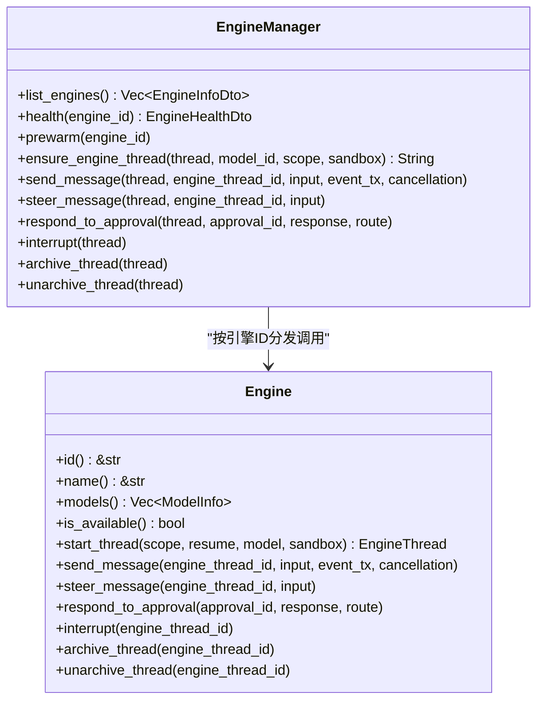
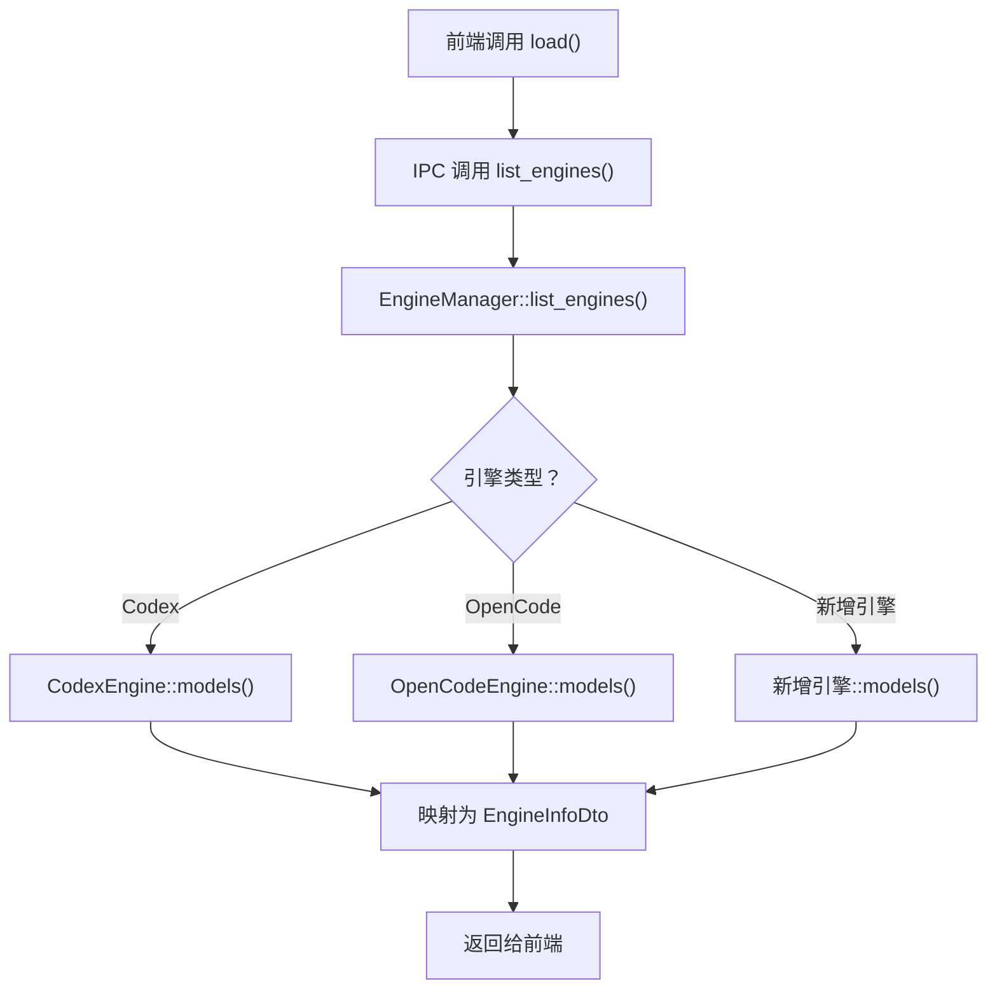
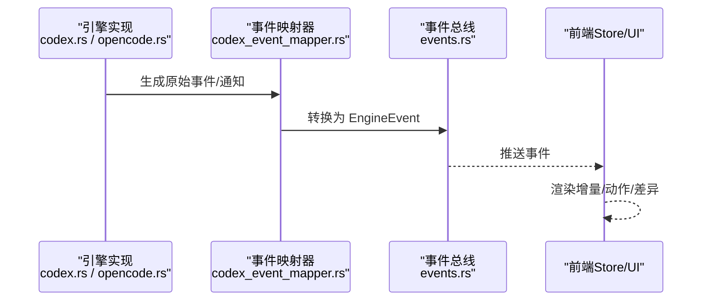
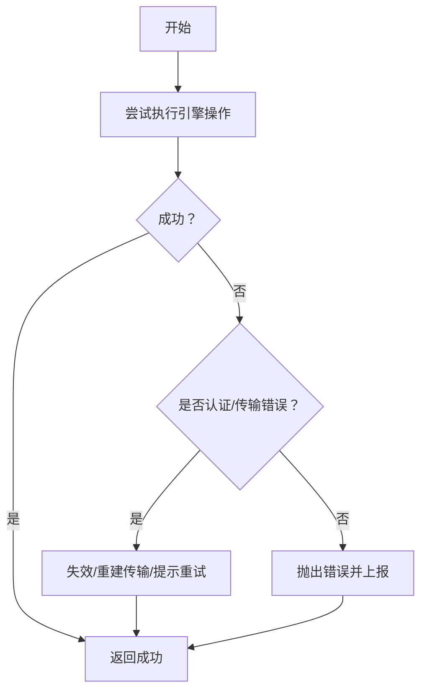
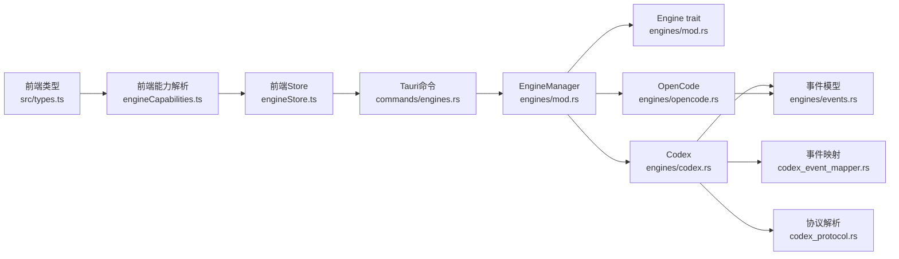

# 引擎扩展开发

<cite>
**本文档引用的文件**
- [src/types.ts](file://src/types.ts)
- [src/lib/chatEngineIds.ts](file://src/lib/chatEngineIds.ts)
- [src/stores/engineStore.ts](file://src/stores/engineStore.ts)
- [src/components/chat/engineCapabilities.ts](file://src/components/chat/engineCapabilities.ts)
- [src-tauri/src/engines/mod.rs](file://src-tauri/src/engines/mod.rs)
- [src-tauri/src/engines/events.rs](file://src-tauri/src/engines/events.rs)
- [src-tauri/src/engines/codex.rs](file://src-tauri/src/engines/codex.rs)
- [src-tauri/src/engines/opencode.rs](file://src-tauri/src/engines/opencode.rs)
- [src-tauri/src/engines/codex_event_mapper.rs](file://src-tauri/src/engines/codex_event_mapper.rs)
- [src-tauri/src/engines/codex_protocol.rs](file://src-tauri/src/engines/codex_protocol.rs)
- [src-tauri/src/commands/engines.rs](file://src-tauri/src/commands/engines.rs)
</cite>

## 目录
1. [简介](#简介)
2. [项目结构](#项目结构)
3. [核心组件](#核心组件)
4. [架构总览](#架构总览)
5. [详细组件分析](#详细组件分析)
6. [依赖关系分析](#依赖关系分析)
7. [性能考虑](#性能考虑)
8. [故障排查指南](#故障排查指南)
9. [结论](#结论)
10. [附录](#附录)

## 简介
本指南面向希望为 Panes 添加新 AI 引擎的开发者，系统阐述引擎扩展的实现路径、Engine trait 要求与最佳实践、引擎注册流程、事件处理机制、错误处理策略、配置管理、健康检查与性能监控集成，并提供开发模板、调试技巧与测试策略。

## 项目结构
- 前端类型与状态
  - 类型定义：包含引擎信息、模型、能力、健康状态等核心类型
  - 引擎能力解析：根据引擎 ID 解析权限模式、沙箱模式与审批决策
  - 引擎列表与健康：前端 Store 负责拉取引擎列表、触发健康检查、合并诊断
- 后端引擎框架（Rust）
  - Engine trait：统一的引擎抽象接口
  - EngineManager：集中管理多引擎实例与路由调用
  - 具体引擎实现：Codex、OpenCode 等
  - 事件系统：标准化的引擎事件模型
  - 协议与传输：Codex 协议解析、消息边界与大输出裁剪
  - Tauri 命令：对外暴露 list_engines、engine_health 等命令

图表来源
- [src/types.ts:448-509](file://src/types.ts#L448-L509)
- [src-tauri/src/engines/mod.rs:419-461](file://src-tauri/src/engines/mod.rs#L419-L461)
- [src-tauri/src/engines/mod.rs:463-980](file://src-tauri/src/engines/mod.rs#L463-L980)
- [src-tauri/src/engines/codex.rs:229-379](file://src-tauri/src/engines/codex.rs#L229-L379)
- [src-tauri/src/engines/opencode.rs:561-580](file://src-tauri/src/engines/opencode.rs#L561-L580)
- [src-tauri/src/engines/events.rs:113-177](file://src-tauri/src/engines/events.rs#L113-L177)
- [src-tauri/src/engines/codex_protocol.rs:61-104](file://src-tauri/src/engines/codex_protocol.rs#L61-L104)
- [src-tauri/src/engines/codex_event_mapper.rs:32-394](file://src-tauri/src/engines/codex_event_mapper.rs#L32-L394)
- [src-tauri/src/commands/engines.rs:18-42](file://src-tauri/src/commands/engines.rs#L18-L42)

章节来源
- [src/types.ts:448-509](file://src/types.ts#L448-L509)
- [src-tauri/src/engines/mod.rs:419-461](file://src-tauri/src/engines/mod.rs#L419-L461)
- [src-tauri/src/engines/mod.rs:463-980](file://src-tauri/src/engines/mod.rs#L463-L980)
- [src-tauri/src/commands/engines.rs:18-42](file://src-tauri/src/commands/engines.rs#L18-L42)

## 核心组件
- Engine trait（后端）
  - 统一接口：引擎标识、名称、模型列表、可用性检测、线程生命周期、消息发送、审批响应、中断、归档/取消归档等
  - 设计要点：异步、可并发、支持取消令牌；线程作用域与沙箱策略作为输入参数
- EngineManager（后端）
  - 集中管理多个具体引擎实例，按 engine_id 分发调用
  - 提供 list_engines、health、prewarm 等聚合能力
- 事件系统（后端）
  - EngineEvent 枚举：文本增量、思考增量、动作开始/进度/完成、差异更新、审批请求、用量限制更新、模型重路由、通知、错误等
  - 事件映射：Codex 将远端协议事件映射为统一 EngineEvent
- 前端引擎 Store
  - 列表加载、健康检查、健康状态合并、运行时更新应用
  - 支持并发健康检查去重与加载状态管理
- 健康检查与诊断
  - 后端 health 返回 EngineHealth，包含可用性、版本、诊断、检查项与修复建议
  - 前端 run_engine_check 命令执行允许的检查命令并返回结果

章节来源
- [src-tauri/src/engines/mod.rs:419-461](file://src-tauri/src/engines/mod.rs#L419-L461)
- [src-tauri/src/engines/mod.rs:463-980](file://src-tauri/src/engines/mod.rs#L463-L980)
- [src-tauri/src/engines/events.rs:113-177](file://src-tauri/src/engines/events.rs#L113-L177)
- [src-tauri/src/engines/codex_event_mapper.rs:32-394](file://src-tauri/src/engines/codex_event_mapper.rs#L32-L394)
- [src/stores/engineStore.ts:23-164](file://src/stores/engineStore.ts#L23-L164)
- [src-tauri/src/commands/engines.rs:24-101](file://src-tauri/src/commands/engines.rs#L24-L101)

## 架构总览
下图展示从前端到后端的引擎扩展调用链路，包括引擎注册、事件分发与健康检查。

图表来源
- [src-tauri/src/commands/engines.rs:18-42](file://src-tauri/src/commands/engines.rs#L18-L42)
- [src-tauri/src/engines/mod.rs:484-553](file://src-tauri/src/engines/mod.rs#L484-L553)
- [src-tauri/src/engines/mod.rs:555-615](file://src-tauri/src/engines/mod.rs#L555-L615)
- [src-tauri/src/engines/codex.rs:229-379](file://src-tauri/src/engines/codex.rs#L229-L379)
- [src-tauri/src/engines/opencode.rs:561-580](file://src-tauri/src/engines/opencode.rs#L561-L580)
- [src-tauri/src/engines/events.rs:113-177](file://src-tauri/src/engines/events.rs#L113-L177)

## 详细组件分析

### Engine trait 实现要求与最佳实践
- 必备方法
  - id/name/models/is_available：用于注册与发现
  - start_thread/send_message/steer_message/respond_to_approval/interrupt/archive_thread/unarchive_thread：完整对话生命周期
- 参数与返回
  - 线程作用域 ThreadScope、沙箱策略 SandboxPolicy 作为输入，确保安全可控
  - 使用 CancellationToken 支持取消；返回 Result<anyhow::Error> 统一错误传播
- 最佳实践
  - 明确模型能力与推理努力选项，避免不支持的组合
  - 对外暴露能力清单（权限模式、沙箱模式、审批决策），并与前端能力解析配合
  - 严格区分“会话级”与“回合级”能力，避免越权操作

图表来源
- [src-tauri/src/engines/mod.rs:419-461](file://src-tauri/src/engines/mod.rs#L419-L461)
- [src-tauri/src/engines/mod.rs:463-980](file://src-tauri/src/engines/mod.rs#L463-L980)

章节来源
- [src-tauri/src/engines/mod.rs:419-461](file://src-tauri/src/engines/mod.rs#L419-L461)
- [src-tauri/src/engines/mod.rs:463-980](file://src-tauri/src/engines/mod.rs#L463-L980)

### 引擎注册流程
- 前端
  - 使用 useEngineStore.load() 获取引擎列表；失败时自动注入默认 Codex 健康报告以保证 UI 可用
  - 通过 useEngineStore.ensureHealth() 并发去重地发起健康检查
- 后端
  - EngineManager::list_engines 动态探测各引擎可用模型，映射为 EngineInfoDto
  - 通过 EngineManager::health 返回 EngineHealthDto，包含版本、诊断、检查与修复建议
- 扩展新引擎
  - 在 EngineManager 中新增引擎实例字段与构造逻辑
  - 在 EngineManager::list_engines 中加入新引擎的模型枚举
  - 在 EngineManager::health 中实现健康检查分支
  - 在 EngineManager::ensure_engine_thread/send_message 等路由中添加匹配分支

图表来源
- [src-tauri/src/commands/engines.rs:18-21](file://src-tauri/src/commands/engines.rs#L18-L21)
- [src-tauri/src/engines/mod.rs:484-553](file://src-tauri/src/engines/mod.rs#L484-L553)

章节来源
- [src-tauri/src/commands/engines.rs:18-21](file://src-tauri/src/commands/engines.rs#L18-L21)
- [src-tauri/src/engines/mod.rs:484-553](file://src-tauri/src/engines/mod.rs#L484-L553)

### 事件处理机制
- 事件模型
  - EngineEvent 统一承载文本增量、思考增量、动作流、差异、审批请求、用量限制、模型重路由、通知与错误
- Codex 事件映射
  - TurnEventMapper 将远端通知/请求映射为 EngineEvent，处理动作开始/完成、输出增量、终端交互、实时转录等
  - 大输出裁剪：对长输出进行截断，避免内存与 UI 压力
- OpenCode 事件映射
  - 基于 SSE 事件总线，将服务端事件转换为 EngineEvent，处理内容增量、动作状态、令牌用量等

图表来源
- [src-tauri/src/engines/codex_event_mapper.rs:32-394](file://src-tauri/src/engines/codex_event_mapper.rs#L32-L394)
- [src-tauri/src/engines/events.rs:113-177](file://src-tauri/src/engines/events.rs#L113-L177)
- [src-tauri/src/engines/codex.rs:524-744](file://src-tauri/src/engines/codex.rs#L524-L744)
- [src-tauri/src/engines/opencode.rs:687-806](file://src-tauri/src/engines/opencode.rs#L687-L806)

章节来源
- [src-tauri/src/engines/events.rs:113-177](file://src-tauri/src/engines/events.rs#L113-L177)
- [src-tauri/src/engines/codex_event_mapper.rs:32-394](file://src-tauri/src/engines/codex_event_mapper.rs#L32-L394)
- [src-tauri/src/engines/codex.rs:524-744](file://src-tauri/src/engines/codex.rs#L524-L744)
- [src-tauri/src/engines/opencode.rs:687-806](file://src-tauri/src/engines/opencode.rs#L687-L806)

### 错误处理策略
- 统一错误传播
  - 后端使用 anyhow::Result，前端通过 IPC 命令捕获并转换为字符串错误
- 健康检查与恢复
  - 前端 ensureHealth 支持强制刷新与并发去重；失败时记录错误并返回空健康报告
  - 引擎内部在认证失败或传输异常时主动失效/重建连接
- 可恢复与不可恢复错误
  - EngineEvent::Error 包含 recoverable 字段，前端据此决定是否提示用户干预

图表来源
- [src-tauri/src/engines/codex.rs:530-625](file://src-tauri/src/engines/codex.rs#L530-L625)
- [src-tauri/src/engines/opencode.rs:687-767](file://src-tauri/src/engines/opencode.rs#L687-L767)
- [src/stores/engineStore.ts:58-115](file://src/stores/engineStore.ts#L58-L115)

章节来源
- [src-tauri/src/engines/codex.rs:530-625](file://src-tauri/src/engines/codex.rs#L530-L625)
- [src-tauri/src/engines/opencode.rs:687-767](file://src-tauri/src/engines/opencode.rs#L687-L767)
- [src/stores/engineStore.ts:58-115](file://src/stores/engineStore.ts#L58-L115)

### 自定义引擎的配置管理
- 模型与能力
  - 在 Engine::models 中声明模型清单、输入模态、附件模态、限额与推理努力选项
  - 在 EngineManager::list_engines 中映射为前端可显示的模型信息
- 沙箱与权限
  - 通过 SandboxPolicy 传递权限策略、沙箱模式、审批策略等
  - validate_engine_sandbox_mode 校验引擎支持的沙箱模式
- 前端能力解析
  - resolveEngineCapabilities 根据引擎 ID 与传入能力，回退到内置默认能力

章节来源
- [src-tauri/src/engines/mod.rs:121-187](file://src-tauri/src/engines/mod.rs#L121-L187)
- [src/components/chat/engineCapabilities.ts:48-69](file://src/components/chat/engineCapabilities.ts#L48-L69)
- [src-tauri/src/engines/mod.rs:484-553](file://src-tauri/src/engines/mod.rs#L484-L553)

### 健康检查实现
- 后端
  - EngineManager::health 针对不同引擎返回 EngineHealthDto，包含可用性、版本、诊断、检查与修复建议
- 前端
  - useEngineStore.ensureHealth 并发去重健康检查，支持强制刷新
  - run_engine_check 命令执行被允许的检查命令，返回执行结果

章节来源
- [src-tauri/src/engines/mod.rs:555-615](file://src-tauri/src/engines/mod.rs#L555-L615)
- [src/stores/engineStore.ts:58-115](file://src/stores/engineStore.ts#L58-L115)
- [src-tauri/src/commands/engines.rs:24-101](file://src-tauri/src/commands/engines.rs#L24-L101)

### 性能监控集成
- 令牌用量与上下文窗口
  - EngineEvent::UsageLimitsUpdated 与 TokenUsage 提供输入/输出/推理/缓存用量
- 大输出裁剪
  - Codex 协议解析对长输出进行截断，避免内存压力
- 超时与取消
  - 发送消息与轮询事件使用超时与取消令牌，防止阻塞

章节来源
- [src-tauri/src/engines/events.rs:242-262](file://src-tauri/src/engines/events.rs#L242-L262)
- [src-tauri/src/engines/codex_protocol.rs:171-185](file://src-tauri/src/engines/codex_protocol.rs#L171-L185)
- [src-tauri/src/engines/codex.rs:524-625](file://src-tauri/src/engines/codex.rs#L524-L625)

### 开发模板与最佳实践
- 新增引擎步骤
  - 实现 Engine trait（至少 id/name/models/is_available/start_thread/send_message）
  - 在 EngineManager 中注册实例并在 list_engines/health/send_message 等分支中接入
  - 定义并导出模型清单与能力
  - 如需审批/权限，实现 normalize_approval_response_for_engine 与 validate_engine_sandbox_mode
- 事件映射
  - 若使用远端协议，参考 CodexEventMapper 的映射模式，确保动作、输出、差异、错误等事件正确映射
- 健康检查
  - 在 EngineManager::health 中实现健康检查，返回 EngineHealthDto
- 前端对接
  - 在 useEngineStore 中确保健康检查与错误处理逻辑完善
  - 在 resolveEngineCapabilities 中补充默认能力

章节来源
- [src-tauri/src/engines/mod.rs:121-187](file://src-tauri/src/engines/mod.rs#L121-L187)
- [src-tauri/src/engines/mod.rs:484-553](file://src-tauri/src/engines/mod.rs#L484-L553)
- [src-tauri/src/engines/codex_event_mapper.rs:32-394](file://src-tauri/src/engines/codex_event_mapper.rs#L32-L394)

### 调试技巧
- 日志与诊断
  - 后端日志记录认证失败、传输失效、事件映射异常等关键路径
  - 健康检查返回的 protocol_diagnostics 与 warnings 有助于定位问题
- 大输出与截断
  - 关注 ACTION_OUTPUT_DELTA_MAX_CHARS 与 STREAMED_DIFF_MAX_CHARS 的截断行为
- 取消与超时
  - 使用 CancellationToken 确保长时间操作可中断；合理设置超时时间

章节来源
- [src-tauri/src/engines/codex.rs:530-625](file://src-tauri/src/engines/codex.rs#L530-L625)
- [src-tauri/src/engines/codex_protocol.rs:171-185](file://src-tauri/src/engines/codex_protocol.rs#L171-L185)

### 测试策略
- 单元测试
  - EngineManager 能力校验：验证 validate_engine_sandbox_mode、normalize_approval_response_for_engine
  - 事件映射测试：验证不同方法签名与参数结构映射为正确的 EngineEvent
- 集成测试
  - IPC 命令层：list_engines、engine_health、run_engine_check 的端到端调用
  - 前端 Store：并发健康检查、错误合并、运行时更新应用

章节来源
- [src-tauri/src/engines/mod.rs:1023-1180](file://src-tauri/src/engines/mod.rs#L1023-L1180)
- [src-tauri/src/commands/engines.rs:77-101](file://src-tauri/src/commands/engines.rs#L77-L101)

## 依赖关系分析
- 前端依赖
  - 类型系统（EngineInfo、EngineHealth、EngineCapabilities）驱动 UI 行为
  - 能力解析与引擎 Store 决定 UI 展示与交互
- 后端依赖
  - Engine trait 抽象引擎能力；EngineManager 聚合多引擎
  - 事件系统与协议解析为引擎实现提供统一事件与消息格式
  - Tauri 命令桥接前后端

图表来源
- [src/types.ts:448-509](file://src/types.ts#L448-L509)
- [src/components/chat/engineCapabilities.ts:48-69](file://src/components/chat/engineCapabilities.ts#L48-L69)
- [src/stores/engineStore.ts:23-164](file://src/stores/engineStore.ts#L23-L164)
- [src-tauri/src/commands/engines.rs:18-42](file://src-tauri/src/commands/engines.rs#L18-L42)
- [src-tauri/src/engines/mod.rs:419-461](file://src-tauri/src/engines/mod.rs#L419-L461)
- [src-tauri/src/engines/codex.rs:229-379](file://src-tauri/src/engines/codex.rs#L229-L379)
- [src-tauri/src/engines/opencode.rs:561-580](file://src-tauri/src/engines/opencode.rs#L561-L580)
- [src-tauri/src/engines/events.rs:113-177](file://src-tauri/src/engines/events.rs#L113-L177)
- [src-tauri/src/engines/codex_event_mapper.rs:32-394](file://src-tauri/src/engines/codex_event_mapper.rs#L32-L394)
- [src-tauri/src/engines/codex_protocol.rs:61-104](file://src-tauri/src/engines/codex_protocol.rs#L61-L104)

章节来源
- [src/types.ts:448-509](file://src/types.ts#L448-L509)
- [src-tauri/src/engines/mod.rs:419-461](file://src-tauri/src/engines/mod.rs#L419-L461)
- [src-tauri/src/engines/codex.rs:229-379](file://src-tauri/src/engines/codex.rs#L229-L379)
- [src-tauri/src/engines/opencode.rs:561-580](file://src-tauri/src/engines/opencode.rs#L561-L580)
- [src-tauri/src/engines/events.rs:113-177](file://src-tauri/src/engines/events.rs#L113-L177)
- [src-tauri/src/engines/codex_event_mapper.rs:32-394](file://src-tauri/src/engines/codex_event_mapper.rs#L32-L394)
- [src-tauri/src/engines/codex_protocol.rs:61-104](file://src-tauri/src/engines/codex_protocol.rs#L61-L104)
- [src-tauri/src/commands/engines.rs:18-42](file://src-tauri/src/commands/engines.rs#L18-L42)

## 性能考虑
- 大输出裁剪：避免一次性渲染过大数据，降低 UI 卡顿
- 并发健康检查：去重与加载状态管理减少重复 IO
- 超时与取消：防止长时间阻塞，提升交互响应
- 事件增量化：仅推送变化，减少全量刷新

## 故障排查指南
- 健康检查失败
  - 查看 EngineHealth.warnings/checks/fixes，确认环境变量、可执行文件、网络连通性
- 认证失败
  - 后端会主动失效/重建传输；前端收到 recoverable 错误时提示重试
- 事件丢失或延迟
  - 检查事件总线订阅时机与 SSE 超时；Codex 有流丢失恢复逻辑
- 沙箱模式不生效
  - 使用 validate_engine_sandbox_mode 校验引擎支持的模式

章节来源
- [src-tauri/src/engines/codex.rs:530-625](file://src-tauri/src/engines/codex.rs#L530-L625)
- [src-tauri/src/engines/mod.rs:165-187](file://src-tauri/src/engines/mod.rs#L165-L187)
- [src-tauri/src/engines/codex.rs:670-690](file://src-tauri/src/engines/codex.rs#L670-L690)

## 结论
通过 Engine trait 的统一抽象与 EngineManager 的集中调度，Panse 的引擎扩展具备良好的可插拔性与一致性。遵循本文档的实现要求、事件处理与错误策略、配置与健康检查实践，即可快速、稳定地集成新的 AI 引擎。

## 附录
- 前端类型参考
  - 引擎信息、健康状态、能力与模型定义
- 后端接口参考
  - Engine trait 方法、EngineManager 聚合方法、事件模型与协议解析

章节来源
- [src/types.ts:448-509](file://src/types.ts#L448-L509)
- [src-tauri/src/engines/mod.rs:419-461](file://src-tauri/src/engines/mod.rs#L419-L461)
- [src-tauri/src/engines/events.rs:113-177](file://src-tauri/src/engines/events.rs#L113-L177)
- [src-tauri/src/engines/codex_protocol.rs:61-104](file://src-tauri/src/engines/codex_protocol.rs#L61-L104)