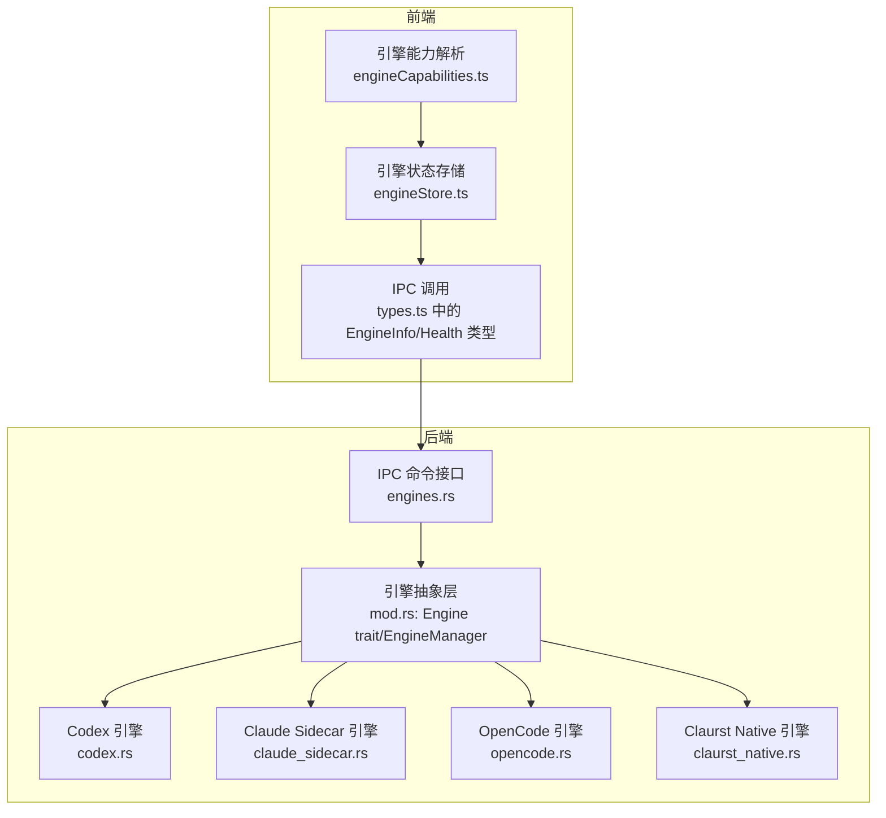
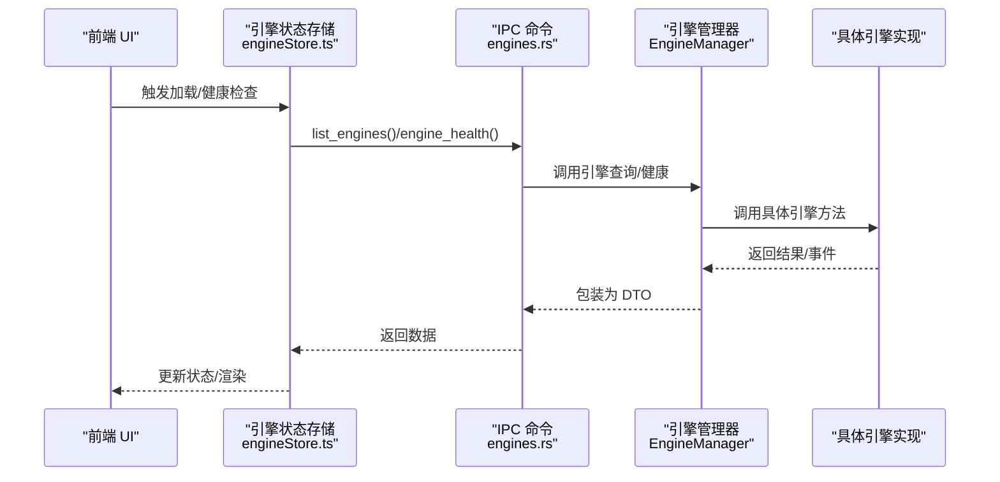
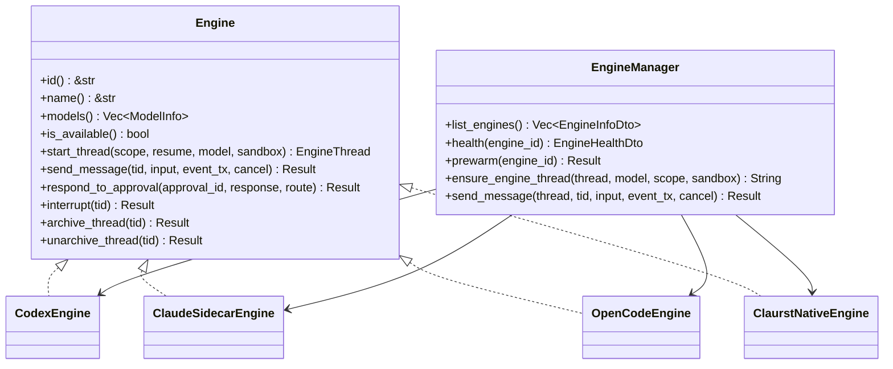
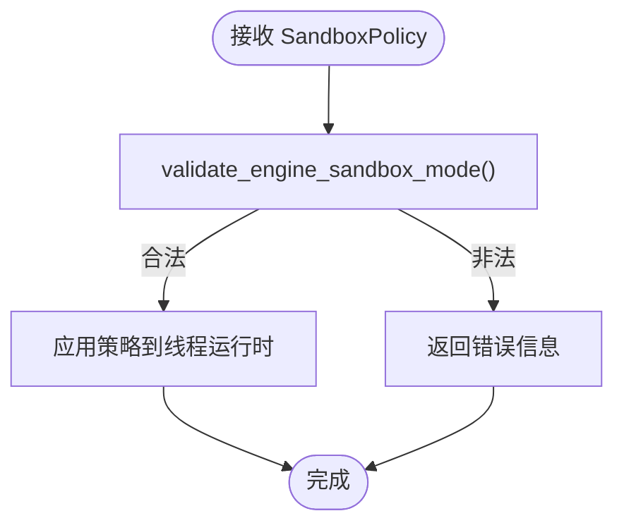
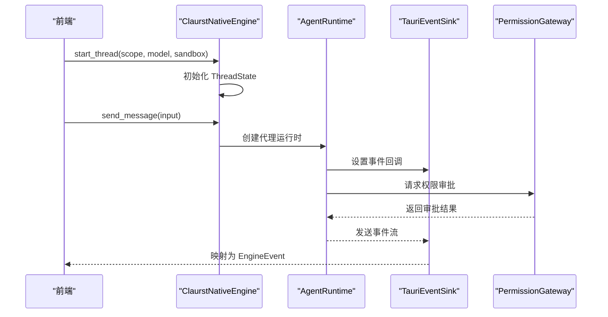
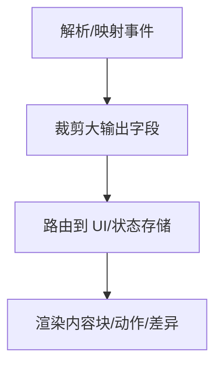
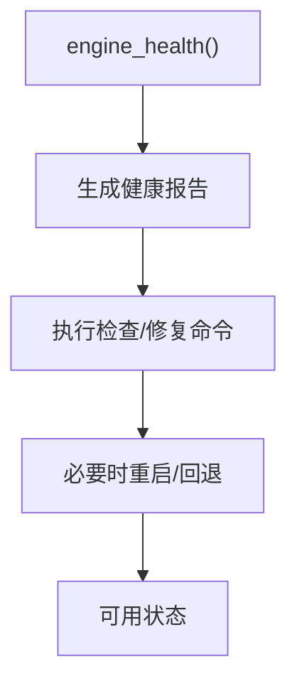
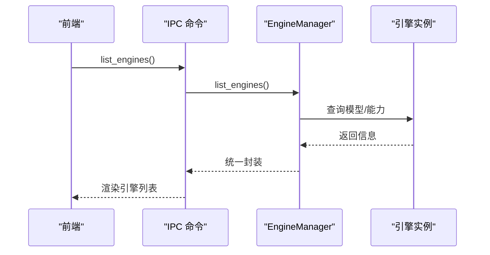
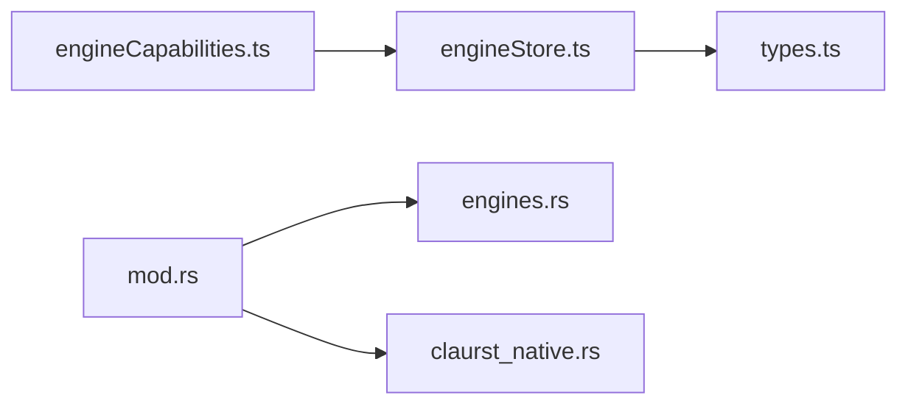

# 引擎架构设计

<cite>
**本文档引用的文件**
- [engineStore.ts](file://src/stores/engineStore.ts)
- [engineCapabilities.ts](file://src/components/chat/engineCapabilities.ts)
- [mod.rs](file://src-tauri/src/engines/mod.rs)
- [claurst_native.rs](file://src-tauri/src/engines/claurst_native.rs)
- [engines.rs](file://src-tauri/src/commands/engines.rs)
- [types.ts](file://src/types.ts)
</cite>

## 目录
1. [简介](#简介)
2. [项目结构](#项目结构)
3. [核心组件](#核心组件)
4. [架构总览](#架构总览)
5. [详细组件分析](#详细组件分析)
6. [依赖关系分析](#依赖关系分析)
7. [性能考虑](#性能考虑)
8. [故障排查指南](#故障排查指南)
9. [结论](#结论)

## 简介
本文件系统性阐述 Panes 引擎架构设计，围绕 Engine trait 抽象层、引擎生命周期管理、事件系统、错误处理机制展开，并深入解析引擎能力模型（EngineCapabilities）、沙箱策略（SandboxPolicy）与权限模式设计。文档还覆盖引擎注册机制、动态加载、健康检查与故障恢复策略，以及引擎间通信协议、消息路由与状态同步的技术实现。

**更新** 本版本更新了引擎架构设计，移除了 Claude Code Native 引擎的具体实现细节，新增 Claurst 原生引擎的架构说明，反映了新的 Rust 引擎架构和代理运行时系统的整体设计。

## 项目结构
Panes 的引擎体系采用前后端分层：
- 前端（React + TypeScript）：负责 UI 展示、用户交互、引擎能力解析与健康状态展示。
- 后端（Rust）：实现 Engine trait 抽象层与具体引擎（Codex、Claude Sidecar、OpenCode、Claurst Native），提供 IPC 命令接口、协议编解码、传输层与事件映射。

**图表来源**
- [engineStore.ts:1-130](file://src/stores/engineStore.ts#L1-L130)
- [engineCapabilities.ts:1-70](file://src/components/chat/engineCapabilities.ts#L1-L70)
- [mod.rs:472-500](file://src-tauri/src/engines/mod.rs#L472-L500)
- [engines.rs:18-42](file://src-tauri/src/commands/engines.rs#L18-L42)

**章节来源**
- [engineStore.ts:1-130](file://src/stores/engineStore.ts#L1-L130)
- [engineCapabilities.ts:1-70](file://src/components/chat/engineCapabilities.ts#L1-L70)
- [mod.rs:472-500](file://src-tauri/src/engines/mod.rs#L472-L500)
- [engines.rs:18-42](file://src-tauri/src/commands/engines.rs#L18-L42)

## 核心组件
- Engine trait 抽象层：统一定义引擎生命周期、线程管理、消息发送、审批响应、中断与归档等接口。
- EngineManager：集中管理多引擎实例，提供统一查询、健康检查、预热与线程启动入口。
- 具体引擎实现：Codex（进程 + RPC）、Claude Sidecar（Node 进程 + SSE）、OpenCode（HTTP + SSE）、Claurst Native（Rust 代理运行时 + 流式事件）。
- 事件系统：标准化 EngineEvent 枚举，统一文本增量、动作执行、差异更新、审批请求、用量限制等事件类型。
- 协议与传输：Codex 使用自定义 JSON-RPC 协议，通过 STDIO 传输；OpenCode 使用 HTTP + SSE；Claude Sidecar 使用 Node 进程事件；Native 引擎通过 HTTP SSE。
- 能力与沙箱：EngineCapabilities 描述权限模式、沙箱模式与审批决策；SandboxPolicy 描述运行期策略（可写根目录、网络访问、审批策略、推理努力等）。

**更新** Claurst Native 引擎替代了原有的 Claude Code Native 引擎，采用全新的代理运行时系统，提供更强大的工具执行能力和权限管理模式。

**章节来源**
- [mod.rs:428-470](file://src-tauri/src/engines/mod.rs#L428-L470)
- [engineCapabilities.ts:15-19](file://src/components/chat/engineCapabilities.ts#L15-L19)

## 架构总览
Panes 引擎架构以 Engine trait 为核心抽象，后端通过 EngineManager 统一调度各引擎实例。前端通过 IPC 命令获取引擎信息、健康状态与执行检查，状态存储负责缓存与去重健康检查请求，事件系统贯穿所有引擎的消息流转与状态同步。

**图表来源**
- [engineStore.ts:18-97](file://src/stores/engineStore.ts#L18-L97)
- [engines.rs:18-42](file://src-tauri/src/commands/engines.rs#L18-L42)
- [mod.rs:479-500](file://src-tauri/src/engines/mod.rs#L479-L500)

**章节来源**
- [engineStore.ts:18-97](file://src/stores/engineStore.ts#L18-L97)
- [engines.rs:18-42](file://src-tauri/src/commands/engines.rs#L18-L42)
- [mod.rs:479-500](file://src-tauri/src/engines/mod.rs#L479-L500)

## 详细组件分析

### Engine 抽象层与 EngineManager
- Engine trait 定义了引擎标识、名称、模型列表、可用性检测、线程启动、消息发送、审批响应、中断与归档等方法，确保不同引擎对外行为一致。
- EngineManager 聚合 Codex、Claude、Claurst Native、OpenCode 引擎，提供统一的 list_engines、health、prewarm、线程启动与消息发送入口，并对超时与回退逻辑进行封装。

**图表来源**
- [mod.rs:428-470](file://src-tauri/src/engines/mod.rs#L428-L470)
- [mod.rs:472-500](file://src-tauri/src/engines/mod.rs#L472-L500)

**章节来源**
- [mod.rs:428-470](file://src-tauri/src/engines/mod.rs#L428-L470)
- [mod.rs:472-500](file://src-tauri/src/engines/mod.rs#L472-L500)

### 引擎能力模型（EngineCapabilities）
- 每个引擎维护一组能力：permissionModes（权限模式）、sandboxModes（沙箱模式）、approvalDecisions（审批决策）。前端根据能力渲染 UI 选项与校验输入。
- 支持回退策略：若传入能力为空或不完整，则回退到引擎默认能力集。

**图表来源**
- [engineCapabilities.ts:33-69](file://src/components/chat/engineCapabilities.ts#L33-L69)

**章节来源**
- [engineCapabilities.ts:1-70](file://src/components/chat/engineCapabilities.ts#L1-L70)

### 沙箱策略（SandboxPolicy）与权限模式
- SandboxPolicy 描述运行期策略：可写根目录、网络访问、审批策略、权限配置、推理努力、服务等级、个性、输出模式、OpenCode Agent 等。
- 权限模式与沙箱模式由 EngineCapabilities 定义，不同引擎支持不同组合。运行时通过 validate_engine_sandbox_mode 校验模式合法性。

**图表来源**
- [mod.rs:174-196](file://src-tauri/src/engines/mod.rs#L174-L196)

**章节来源**
- [mod.rs:61-73](file://src-tauri/src/engines/mod.rs#L61-L73)
- [mod.rs:174-196](file://src-tauri/src/engines/mod.rs#L174-L196)

### Claurst Native 引擎：Rust 代理运行时 + 流式事件
- 代理运行时架构：基于 panes-agent crate 的 AgentRuntime，提供统一的代理执行环境，支持多模型提供商（Anthropic、OpenAI 兼容）。
- 线程状态管理：ThreadState 记录工作目录、模型、沙箱模式、CueLight 上下文等信息。
- 工具执行系统：NativeToolExecutor 提供文件读写、编辑、搜索、命令执行等原生命令工具，支持权限网关和审批流程。
- 事件映射：将 AgentEvent 转换为 EngineEvent，支持文本增量、思考过程、动作执行、工具调用等事件类型。
- CueLight 集成：支持 CueLight 项目的工具规范和系统提示词扩展。

**图表来源**
- [claurst_native.rs:167-345](file://src-tauri/src/engines/claurst_native.rs#L167-L345)
- [claurst_native.rs:236-262](file://src-tauri/src/engines/claurst_native.rs#L236-L262)
- [claurst_native.rs:421-459](file://src-tauri/src/engines/claurst_native.rs#L421-L459)

**章节来源**
- [claurst_native.rs:1-1411](file://src-tauri/src/engines/claurst_native.rs#L1-L1411)

### 事件系统与消息路由
- EngineEvent 统一事件类型：TurnStarted/Completed、TextDelta/ThinkingDelta、Action*、DiffUpdated、ApprovalRequested、UsageLimitsUpdated、ModelRerouted、Notice、Error。
- 大输出裁剪：针对长输出（delta、stdout/stderr、diff）进行字符级截断，避免内存与 UI 压力。
- 审批标准化：normalize_approval_response_for_engine 对不同引擎的审批响应进行归一化处理。

**图表来源**
- [mod.rs:198-251](file://src-tauri/src/engines/mod.rs#L198-L251)

**章节来源**
- [mod.rs:198-251](file://src-tauri/src/engines/mod.rs#L198-L251)

### 健康检查与故障恢复
- 健康检查：EngineManager.health 对各引擎生成 EngineHealthDto；Codex/Claude/OpenCode 有专门的健康报告；Claurst Native 通过环境变量检测可用性。
- 故障恢复：Codex 在认证失败、传输异常、流中断时进行重试与回退；Claude Sidecar 在进程死亡时重启；OpenCode 在 SSE 超时或事件丢失时进行重连与消息对齐。

**图表来源**
- [mod.rs:577-656](file://src-tauri/src/engines/mod.rs#L577-L656)

**章节来源**
- [mod.rs:577-656](file://src-tauri/src/engines/mod.rs#L577-L656)

### 引擎注册机制与动态加载
- 注册机制：EngineManager 在构造时聚合各引擎实例，list_engines 动态查询各引擎模型与能力。
- 动态加载：Codex 与 OpenCode 通过进程/HTTP 动态启动；Claude Sidecar 通过 Node 脚本启动；Claurst Native 通过 Rust 代理运行时直接集成。
- IPC 接口：tauri::command 暴露 list_engines、engine_health、prewarm 等命令，前端通过 IPC 获取与控制引擎。

**图表来源**
- [engines.rs:18-21](file://src-tauri/src/commands/engines.rs#L18-L21)
- [mod.rs:506-575](file://src-tauri/src/engines/mod.rs#L506-L575)

**章节来源**
- [engines.rs:18-42](file://src-tauri/src/commands/engines.rs#L18-L42)
- [mod.rs:506-575](file://src-tauri/src/engines/mod.rs#L506-L575)

## 依赖关系分析
- 前端依赖：engineStore.ts 负责引擎发现与健康检查；engineCapabilities.ts 提供能力回退；types.ts 定义 EngineInfo/EngineHealth 等类型。
- 后端依赖：Engine trait 作为统一契约；EngineManager 作为编排中心；各引擎实现依赖事件与协议模块；IPC 命令层依赖 EngineManager。

**图表来源**
- [engineStore.ts:1-130](file://src/stores/engineStore.ts#L1-L130)
- [engineCapabilities.ts:1-70](file://src/components/chat/engineCapabilities.ts#L1-L70)
- [types.ts:448-509](file://src/types.ts#L448-L509)
- [mod.rs:472-500](file://src-tauri/src/engines/mod.rs#L472-L500)
- [engines.rs:18-42](file://src-tauri/src/commands/engines.rs#L18-L42)

**章节来源**
- [engineStore.ts:1-130](file://src/stores/engineStore.ts#L1-L130)
- [engineCapabilities.ts:1-70](file://src/components/chat/engineCapabilities.ts#L1-L70)
- [types.ts:448-509](file://src/types.ts#L448-L509)
- [mod.rs:472-500](file://src-tauri/src/engines/mod.rs#L472-L500)
- [engines.rs:18-42](file://src-tauri/src/commands/engines.rs#L18-L42)

## 性能考虑
- 大输出裁剪：针对 action 输出、diff、stderr 等字段进行字符级截断，避免 UI 与内存压力。
- 事件缓冲容量：Codex 事件广播缓冲较小，避免空闲时保留过大数据；Claude Sidecar 与 OpenCode 使用 SSE，注意超时与重连策略。
- 超时与回退：EngineManager 对模型查询与健康检查设置超时并回退到静态/缓存模型；Codex 在认证失败时重置传输。
- 并发与取消：send_message 使用 CancellationToken 实现取消；多任务并发场景下限制最大轮次与输出大小。

## 故障排查指南
- 健康检查失败：查看 EngineHealth 中的 checks/warnings/fixes 字段，按建议修复（如安装 Node、设置 API Key、修复 PATH 等）。
- 认证失败：Codex 与 Claude Sidecar 在认证失败时会重置传输或提示；确认凭据与登录状态。
- 传输异常：Codex 传输层记录 parse_error/eof/read_error；检查日志与进程存活。
- SSE 超时：OpenCode 在 SSE 空闲超时或事件丢失时进行重连与消息对齐；检查网络与服务器状态。
- 审批问题：不同引擎的审批响应需归一化；确认审批决策与路由信息正确传递。

**章节来源**
- [mod.rs:577-656](file://src-tauri/src/engines/mod.rs#L577-L656)

## 结论
Panes 引擎架构通过 Engine trait 抽象统一多引擎行为，结合 EngineManager 实现集中编排与动态加载。前端通过 IPC 获取引擎信息与健康状态，事件系统实现跨引擎的消息路由与状态同步。能力模型、沙箱策略与权限模式确保安全可控的运行环境；健康检查与故障恢复机制保障系统稳定性。Claurst Native 引擎的引入代表了新的 Rust 引擎架构，采用代理运行时系统提供更强大、更灵活的工具执行能力，为多引擎协同提供了清晰的框架。