# 引擎架构设计

<cite>
**本文档引用的文件**
- [engineStore.ts](file://src/stores/engineStore.ts)
- [engineCapabilities.ts](file://src/components/chat/engineCapabilities.ts)
- [mod.rs](file://src-tauri/src/engines/mod.rs)
- [codex.rs](file://src-tauri/src/engines/codex.rs)
- [claude_sidecar.rs](file://src-tauri/src/engines/claude_sidecar.rs)
- [opencode.rs](file://src-tauri/src/engines/opencode.rs)
- [events.rs](file://src-tauri/src/engines/events.rs)
- [codex_protocol.rs](file://src-tauri/src/engines/codex_protocol.rs)
- [codex_transport.rs](file://src-tauri/src/engines/codex_transport.rs)
- [claude_code_native.rs](file://src-tauri/src/engines/claude_code_native.rs)
- [engines.rs](file://src-tauri/src/commands/engines.rs)
- [types.ts](file://src/types.ts)
</cite>

## 目录
1. [简介](#简介)
2. [项目结构](#项目结构)
3. [核心组件](#核心组件)
4. [架构总览](#架构总览)
5. [详细组件分析](#详细组件分析)
6. [依赖关系分析](#依赖关系分析)
7. [性能考虑](#性能考虑)
8. [故障排查指南](#故障排查指南)
9. [结论](#结论)

## 简介
本文件系统性阐述 Panes 引擎架构设计，围绕 Engine trait 抽象层、引擎生命周期管理、事件系统、错误处理机制展开，并深入解析引擎能力模型（EngineCapabilities）、沙箱策略（SandboxPolicy）与权限模式设计。文档还覆盖引擎注册机制、动态加载、健康检查与故障恢复策略，以及引擎间通信协议、消息路由与状态同步的技术实现。

## 项目结构
Panes 的引擎体系采用前后端分层：
- 前端（React + TypeScript）：负责 UI 展示、用户交互、引擎能力解析与健康状态展示。
- 后端（Rust）：实现 Engine trait 抽象层与具体引擎（Codex、Claude Sidecar、OpenCode、Claude Code Native），提供 IPC 命令接口、协议编解码、传输层与事件映射。

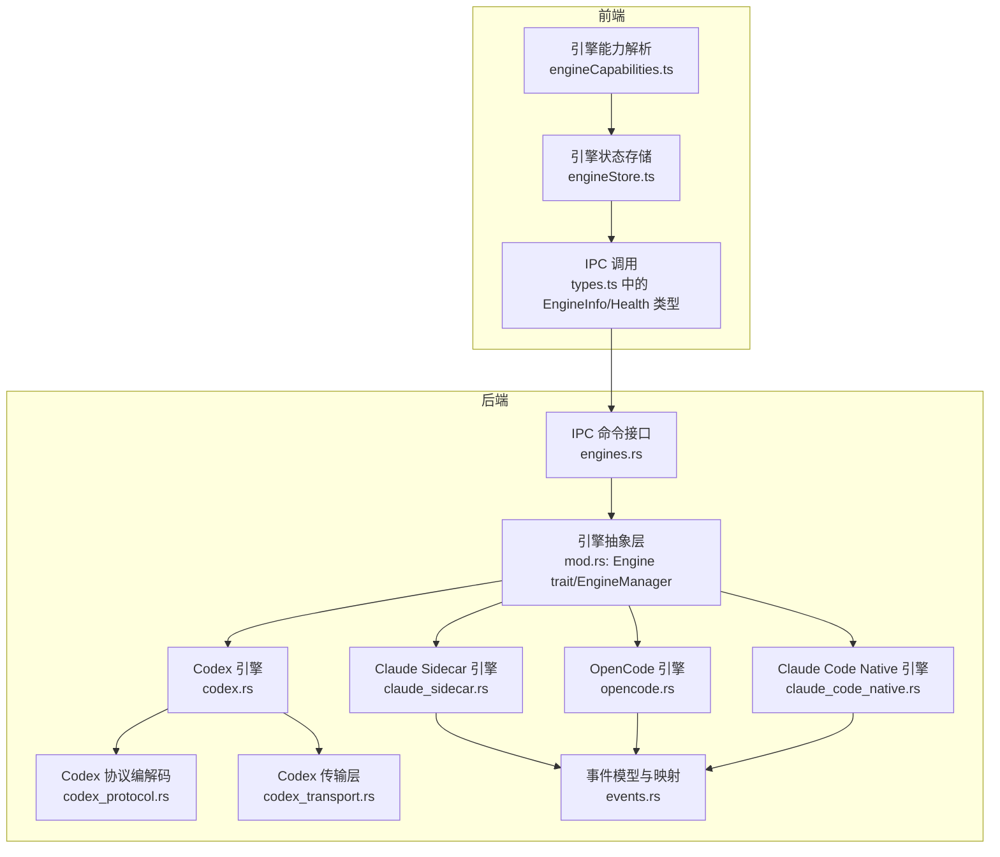

**图表来源**
- [engineStore.ts:1-164](file://src/stores/engineStore.ts#L1-L164)
- [engineCapabilities.ts:1-69](file://src/components/chat/engineCapabilities.ts#L1-L69)
- [mod.rs:419-461](file://src-tauri/src/engines/mod.rs#L419-L461)
- [codex.rs:229-238](file://src-tauri/src/engines/codex.rs#L229-L238)
- [claude_sidecar.rs:490-500](file://src-tauri/src/engines/claude_sidecar.rs#L490-L500)
- [opencode.rs:562-569](file://src-tauri/src/engines/opencode.rs#L562-L569)
- [claude_code_native.rs:516-523](file://src-tauri/src/engines/claude_code_native.rs#L516-L523)
- [codex_protocol.rs:1-611](file://src-tauri/src/engines/codex_protocol.rs#L1-L611)
- [codex_transport.rs:1-414](file://src-tauri/src/engines/codex_transport.rs#L1-L414)
- [events.rs:113-177](file://src-tauri/src/engines/events.rs#L113-L177)
- [engines.rs:1-162](file://src-tauri/src/commands/engines.rs#L1-L162)
- [types.ts:448-509](file://src/types.ts#L448-L509)

**章节来源**
- [engineStore.ts:1-164](file://src/stores/engineStore.ts#L1-L164)
- [engineCapabilities.ts:1-69](file://src/components/chat/engineCapabilities.ts#L1-L69)
- [mod.rs:419-461](file://src-tauri/src/engines/mod.rs#L419-L461)
- [engines.rs:1-162](file://src-tauri/src/commands/engines.rs#L1-L162)

## 核心组件
- Engine trait 抽象层：统一定义引擎生命周期、线程管理、消息发送、审批响应、中断与归档等接口。
- EngineManager：集中管理多引擎实例，提供统一查询、健康检查、预热与线程启动入口。
- 具体引擎实现：Codex（进程 + RPC）、Claude Sidecar（Node 进程 + SSE）、OpenCode（HTTP + SSE）、Claude Code Native（Rust 库 + 流式 SSE）。
- 事件系统：标准化 EngineEvent 枚举，统一文本增量、动作执行、差异更新、审批请求、用量限制等事件类型。
- 协议与传输：Codex 使用自定义 JSON-RPC 协议，通过 STDIO 传输；OpenCode 使用 HTTP + SSE；Claude Sidecar 使用 Node 进程事件；Native 引擎通过 HTTP SSE。
- 能力与沙箱：EngineCapabilities 描述权限模式、沙箱模式与审批决策；SandboxPolicy 描述运行期策略（可写根目录、网络访问、审批策略、推理努力等）。

**章节来源**
- [mod.rs:419-461](file://src-tauri/src/engines/mod.rs#L419-L461)
- [events.rs:113-177](file://src-tauri/src/engines/events.rs#L113-L177)
- [codex_protocol.rs:1-611](file://src-tauri/src/engines/codex_protocol.rs#L1-L611)
- [codex_transport.rs:1-414](file://src-tauri/src/engines/codex_transport.rs#L1-L414)
- [engineCapabilities.ts:1-69](file://src/components/chat/engineCapabilities.ts#L1-L69)

## 架构总览
Panes 引擎架构以 Engine trait 为核心抽象，后端通过 EngineManager 统一调度各引擎实例。前端通过 IPC 命令获取引擎信息、健康状态与执行检查，状态存储负责缓存与去重健康检查请求，事件系统贯穿所有引擎的消息流转与状态同步。

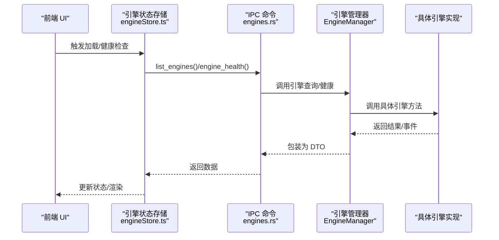

**图表来源**
- [engineStore.ts:23-115](file://src/stores/engineStore.ts#L23-L115)
- [engines.rs:18-42](file://src-tauri/src/commands/engines.rs#L18-L42)
- [mod.rs:484-553](file://src-tauri/src/engines/mod.rs#L484-L553)

**章节来源**
- [engineStore.ts:23-115](file://src/stores/engineStore.ts#L23-L115)
- [engines.rs:18-42](file://src-tauri/src/commands/engines.rs#L18-L42)
- [mod.rs:484-553](file://src-tauri/src/engines/mod.rs#L484-L553)

## 详细组件分析

### Engine 抽象层与 EngineManager
- Engine trait 定义了引擎标识、名称、模型列表、可用性检测、线程启动、消息发送、审批响应、中断与归档等方法，确保不同引擎对外行为一致。
- EngineManager 聚合 Codex、Claude、Claude Code Native、OpenCode 引擎，提供统一的 list_engines、health、prewarm、线程启动与消息发送入口，并对超时与回退逻辑进行封装。

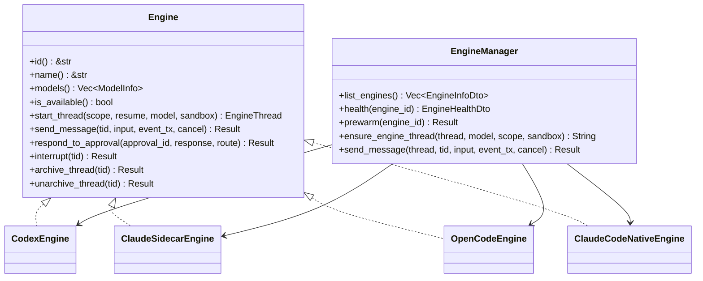

**图表来源**
- [mod.rs:419-461](file://src-tauri/src/engines/mod.rs#L419-L461)
- [mod.rs:463-483](file://src-tauri/src/engines/mod.rs#L463-L483)

**章节来源**
- [mod.rs:419-461](file://src-tauri/src/engines/mod.rs#L419-L461)
- [mod.rs:463-483](file://src-tauri/src/engines/mod.rs#L463-L483)

### 引擎能力模型（EngineCapabilities）
- 每个引擎维护一组能力：permissionModes（权限模式）、sandboxModes（沙箱模式）、approvalDecisions（审批决策）。前端根据能力渲染 UI 选项与校验输入。
- 支持回退策略：若传入能力为空或不完整，则回退到引擎默认能力集。

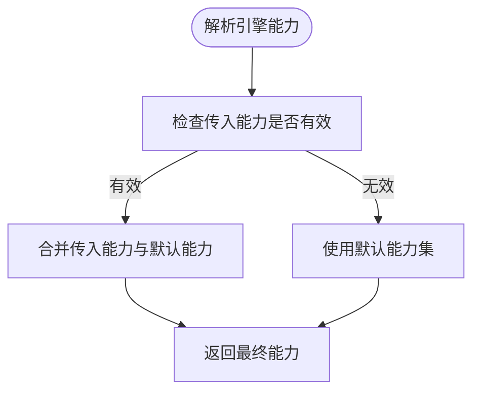

**图表来源**
- [engineCapabilities.ts:48-69](file://src/components/chat/engineCapabilities.ts#L48-L69)

**章节来源**
- [engineCapabilities.ts:1-69](file://src/components/chat/engineCapabilities.ts#L1-L69)

### 沙箱策略（SandboxPolicy）与权限模式
- SandboxPolicy 描述运行期策略：可写根目录、网络访问、审批策略、权限配置、推理努力、服务等级、个性、输出模式、OpenCode Agent 等。
- 权限模式与沙箱模式由 EngineCapabilities 定义，不同引擎支持不同组合。运行时通过 validate_engine_sandbox_mode 校验模式合法性。

**图表来源**
- [mod.rs:159-187](file://src-tauri/src/engines/mod.rs#L159-L187)

**章节来源**
- [mod.rs:56-68](file://src-tauri/src/engines/mod.rs#L56-L68)
- [mod.rs:159-187](file://src-tauri/src/engines/mod.rs#L159-L187)

### Codex 引擎：进程 + RPC
- 进程管理：通过 spawn 启动 codex app-server，STDIO 读写，广播订阅事件。
- 协议编解码：CodexProtocol 提供 JSON-RPC 解析与大字段裁剪，CodexTransport 负责请求/通知/响应的发送与等待。
- 事件映射：TurnEventMapper 将服务器事件映射为 EngineEvent，支持审批请求、增量输出、差异更新、用量限制等。
- 线程管理：支持 thread/start、thread/resume、thread/rollback、thread/archive 等方法；支持外部沙箱探测与强制切换。

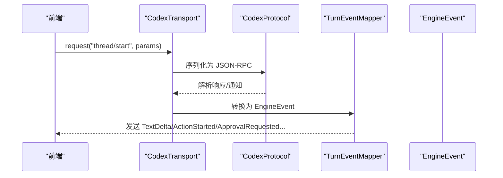

**图表来源**
- [codex_transport.rs:169-208](file://src-tauri/src/engines/codex_transport.rs#L169-L208)
- [codex_protocol.rs:61-104](file://src-tauri/src/engines/codex_protocol.rs#L61-L104)
- [codex.rs:523-742](file://src-tauri/src/engines/codex.rs#L523-L742)

**章节来源**
- [codex_transport.rs:1-414](file://src-tauri/src/engines/codex_transport.rs#L1-L414)
- [codex_protocol.rs:1-611](file://src-tauri/src/engines/codex_protocol.rs#L1-L611)
- [codex.rs:229-521](file://src-tauri/src/engines/codex.rs#L229-L521)

### Claude Sidecar 引擎：Node 进程 + SSE
- 进程管理：解析 Node 可执行路径，准备 SDK 模块，启动 sidecar 脚本，等待 Ready 事件。
- 事件模型：SidecarEvent 定义 Ready、TurnStarted、TextDelta、Action*、ApprovalRequested、TurnCompleted、Notice、UsageLimitsUpdated、Error 等。
- 健康检查：收集 Node、SDK、API Key 等检查项，生成健康报告。

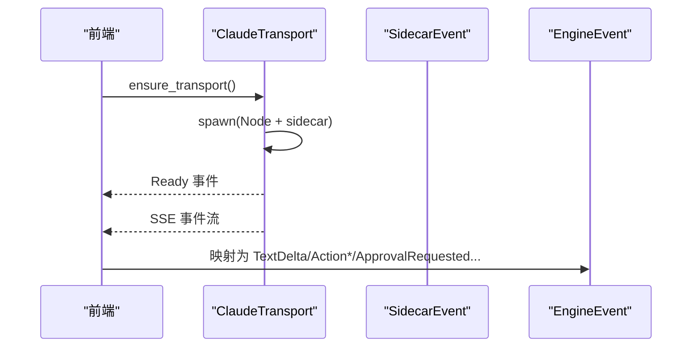

**图表来源**
- [claude_sidecar.rs:179-475](file://src-tauri/src/engines/claude_sidecar.rs#L179-L475)
- [claude_sidecar.rs:516-595](file://src-tauri/src/engines/claude_sidecar.rs#L516-L595)

**章节来源**
- [claude_sidecar.rs:1-800](file://src-tauri/src/engines/claude_sidecar.rs#L1-L800)

### OpenCode 引擎：HTTP + SSE
- 服务器管理：每个工作目录启动独立 HTTP 服务，基于 TCP 端口监听，事件通过 SSE 推送。
- 会话管理：OpenCodeSession 记录 cwd、模型、推理努力、Agent、权限模式与服务器引用。
- 事件映射：OpenCodeTurnMapper 将 SSE 事件映射为 TextDelta、ThinkingDelta、Action*、TurnCompleted 等。

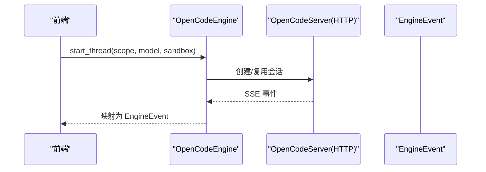

**图表来源**
- [opencode.rs:54-90](file://src-tauri/src/engines/opencode.rs#L54-L90)
- [opencode.rs:586-685](file://src-tauri/src/engines/opencode.rs#L586-L685)
- [opencode.rs:687-800](file://src-tauri/src/engines/opencode.rs#L687-L800)

**章节来源**
- [opencode.rs:1-800](file://src-tauri/src/engines/opencode.rs#L1-L800)

### Claude Code Native 引擎：Rust 库 + 流式 SSE
- 客户端构建：基于 claude-code-rs 的 ApiClient，优先使用本地配置，支持工具定义与系统提示注入。
- 线程状态：ThreadState 记录历史、工作目录、模型、沙箱模式、任务列表与命令自动审批标记。
- 工具执行：路径解析严格限制在工作目录内，写工具与命令执行受沙箱模式控制；命令执行带超时与输出截断。

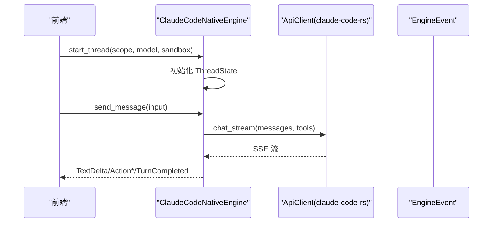

**图表来源**
- [claude_code_native.rs:64-82](file://src-tauri/src/engines/claude_code_native.rs#L64-L82)
- [claude_code_native.rs:570-598](file://src-tauri/src/engines/claude_code_native.rs#L570-L598)
- [claude_code_native.rs:600-800](file://src-tauri/src/engines/claude_code_native.rs#L600-L800)

**章节来源**
- [claude_code_native.rs:1-800](file://src-tauri/src/engines/claude_code_native.rs#L1-L800)

### 事件系统与消息路由
- EngineEvent 统一事件类型：TurnStarted/Completed、TextDelta/ThinkingDelta、Action*、DiffUpdated、ApprovalRequested、UsageLimitsUpdated、ModelRerouted、Notice、Error。
- 大输出裁剪：针对长输出（delta、stdout/stderr、diff）进行字符级截断，避免内存与 UI 压力。
- 审批标准化：normalize_approval_response_for_engine 对不同引擎的审批响应进行归一化处理。

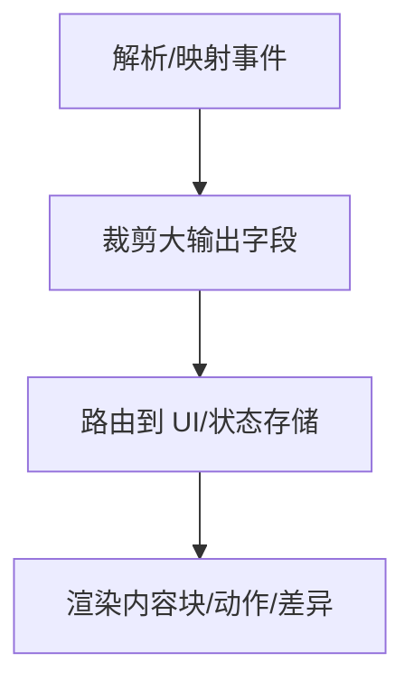

**图表来源**
- [events.rs:113-177](file://src-tauri/src/engines/events.rs#L113-L177)
- [codex_protocol.rs:120-283](file://src-tauri/src/engines/codex_protocol.rs#L120-L283)

**章节来源**
- [events.rs:1-262](file://src-tauri/src/engines/events.rs#L1-L262)
- [codex_protocol.rs:1-611](file://src-tauri/src/engines/codex_protocol.rs#L1-L611)

### 健康检查与故障恢复
- 健康检查：EngineManager.health 对各引擎生成 EngineHealthDto；Codex/Claude/OpenCode 有专门的健康报告；Claude Code Native 通过配置可用性判断。
- 故障恢复：Codex 在认证失败、传输异常、流中断时进行重试与回退；Claude Sidecar 在进程死亡时重启；OpenCode 在 SSE 超时或事件丢失时进行重连与消息对齐。

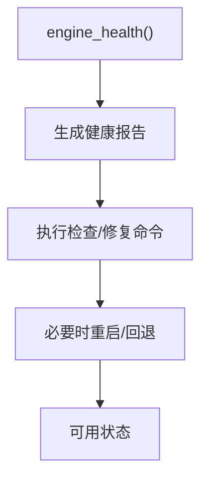

**图表来源**
- [mod.rs:555-615](file://src-tauri/src/engines/mod.rs#L555-L615)
- [codex.rs:523-742](file://src-tauri/src/engines/codex.rs#L523-L742)
- [claude_sidecar.rs:516-595](file://src-tauri/src/engines/claude_sidecar.rs#L516-L595)
- [opencode.rs:687-800](file://src-tauri/src/engines/opencode.rs#L687-L800)

**章节来源**
- [mod.rs:555-615](file://src-tauri/src/engines/mod.rs#L555-L615)
- [codex.rs:523-742](file://src-tauri/src/engines/codex.rs#L523-L742)
- [claude_sidecar.rs:516-595](file://src-tauri/src/engines/claude_sidecar.rs#L516-L595)
- [opencode.rs:687-800](file://src-tauri/src/engines/opencode.rs#L687-L800)

### 引擎注册机制与动态加载
- 注册机制：EngineManager 在构造时聚合各引擎实例，list_engines 动态查询各引擎模型与能力。
- 动态加载：Codex 与 OpenCode 通过进程/HTTP 动态启动；Claude Sidecar 通过 Node 脚本启动；Claude Code Native 通过 Rust 库直接集成。
- IPC 接口：tauri::command 暴露 list_engines、engine_health、prewarm 等命令，前端通过 IPC 获取与控制引擎。

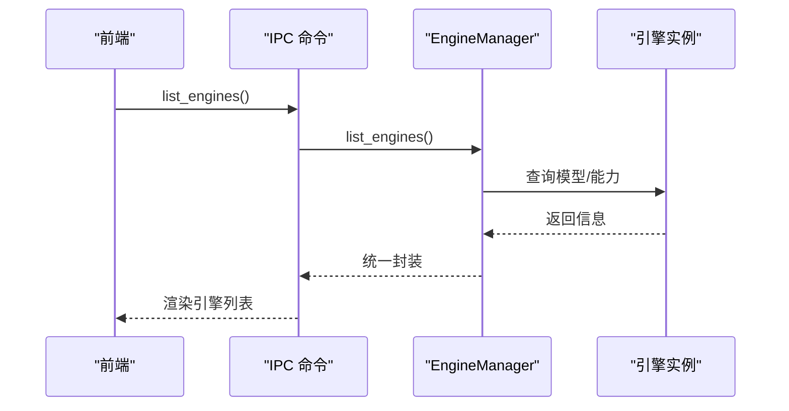

**图表来源**
- [engines.rs:18-21](file://src-tauri/src/commands/engines.rs#L18-L21)
- [mod.rs:484-553](file://src-tauri/src/engines/mod.rs#L484-L553)

**章节来源**
- [engines.rs:1-162](file://src-tauri/src/commands/engines.rs#L1-L162)
- [mod.rs:484-553](file://src-tauri/src/engines/mod.rs#L484-L553)

## 依赖关系分析
- 前端依赖：engineStore.ts 负责引擎发现与健康检查；engineCapabilities.ts 提供能力回退；types.ts 定义 EngineInfo/EngineHealth 等类型。
- 后端依赖：Engine trait 作为统一契约；EngineManager 作为编排中心；各引擎实现依赖事件与协议模块；IPC 命令层依赖 EngineManager。

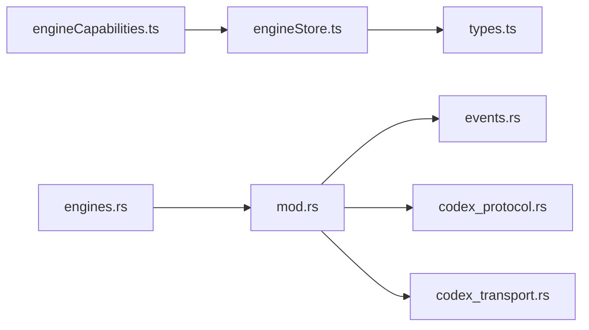

**图表来源**
- [engineStore.ts:1-164](file://src/stores/engineStore.ts#L1-L164)
- [engineCapabilities.ts:1-69](file://src/components/chat/engineCapabilities.ts#L1-L69)
- [types.ts:448-509](file://src/types.ts#L448-L509)
- [mod.rs:1-36](file://src-tauri/src/engines/mod.rs#L1-L36)
- [events.rs:1-262](file://src-tauri/src/engines/events.rs#L1-L262)
- [codex_protocol.rs:1-611](file://src-tauri/src/engines/codex_protocol.rs#L1-L611)
- [codex_transport.rs:1-414](file://src-tauri/src/engines/codex_transport.rs#L1-L414)
- [engines.rs:1-162](file://src-tauri/src/commands/engines.rs#L1-L162)

**章节来源**
- [engineStore.ts:1-164](file://src/stores/engineStore.ts#L1-L164)
- [engineCapabilities.ts:1-69](file://src/components/chat/engineCapabilities.ts#L1-L69)
- [types.ts:448-509](file://src/types.ts#L448-L509)
- [mod.rs:1-36](file://src-tauri/src/engines/mod.rs#L1-L36)
- [events.rs:1-262](file://src-tauri/src/engines/events.rs#L1-L262)
- [codex_protocol.rs:1-611](file://src-tauri/src/engines/codex_protocol.rs#L1-L611)
- [codex_transport.rs:1-414](file://src-tauri/src/engines/codex_transport.rs#L1-L414)
- [engines.rs:1-162](file://src-tauri/src/commands/engines.rs#L1-L162)

## 性能考虑
- 大输出裁剪：针对 action 输出、diff、stderr 等字段进行字符级截断，避免 UI 与内存压力。
- 事件缓冲容量：Codex 事件广播缓冲较小，避免空闲时保留过大数据；Claude Sidecar 与 OpenCode 使用 SSE，注意超时与重连策略。
- 超时与回退：EngineManager 对模型查询与健康检查设置超时并回退到静态/缓存模型；Codex 在认证失败时重置传输。
- 并发与取消：send_message 使用 CancellationToken 实现取消；多任务并发场景下限制最大轮次与输出大小。

[本节为通用指导，无需特定文件分析]

## 故障排查指南
- 健康检查失败：查看 EngineHealth 中的 checks/warnings/fixes 字段，按建议修复（如安装 Node、设置 API Key、修复 PATH 等）。
- 认证失败：Codex 与 Claude Sidecar 在认证失败时会重置传输或提示；确认凭据与登录状态。
- 传输异常：Codex 传输层记录 parse_error/eof/read_error；检查日志与进程存活。
- SSE 超时：OpenCode 在 SSE 空闲超时或事件丢失时进行重连与消息对齐；检查网络与服务器状态。
- 审批问题：不同引擎的审批响应需归一化；确认审批决策与路由信息正确传递。

**章节来源**
- [mod.rs:555-615](file://src-tauri/src/engines/mod.rs#L555-L615)
- [codex_transport.rs:83-133](file://src-tauri/src/engines/codex_transport.rs#L83-L133)
- [codex.rs:665-742](file://src-tauri/src/engines/codex.rs#L665-L742)
- [claude_sidecar.rs:516-595](file://src-tauri/src/engines/claude_sidecar.rs#L516-L595)
- [opencode.rs:725-795](file://src-tauri/src/engines/opencode.rs#L725-L795)

## 结论
Panes 引擎架构通过 Engine trait 抽象统一多引擎行为，结合 EngineManager 实现集中编排与动态加载。前端通过 IPC 获取引擎信息与健康状态，事件系统实现跨引擎的消息路由与状态同步。能力模型、沙箱策略与权限模式确保安全可控的运行环境；健康检查与故障恢复机制保障系统稳定性。整体设计兼顾扩展性与安全性，为多引擎协同提供了清晰的框架。