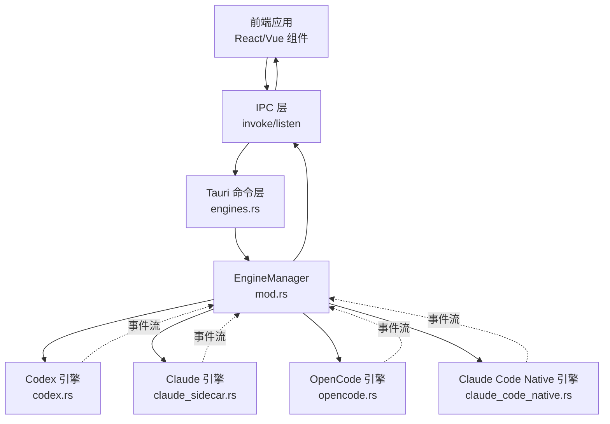
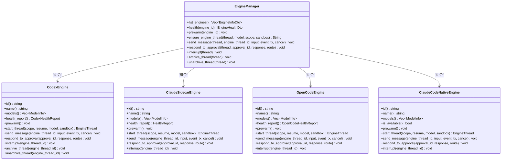
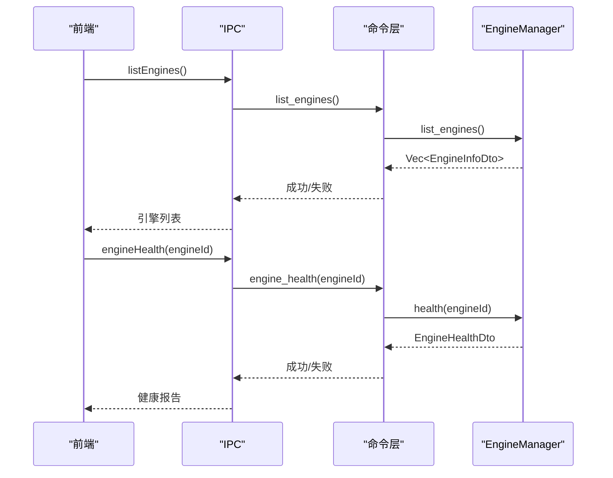
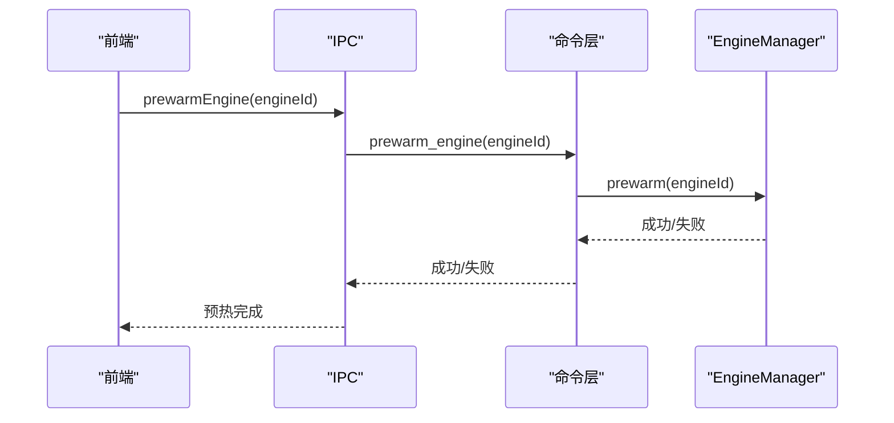
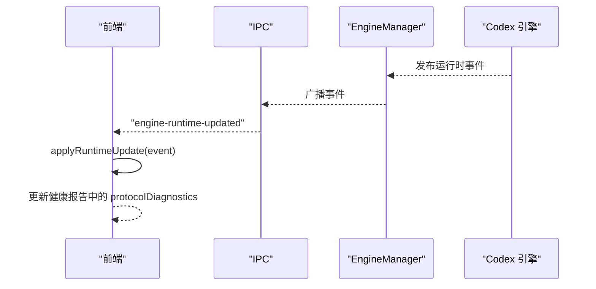
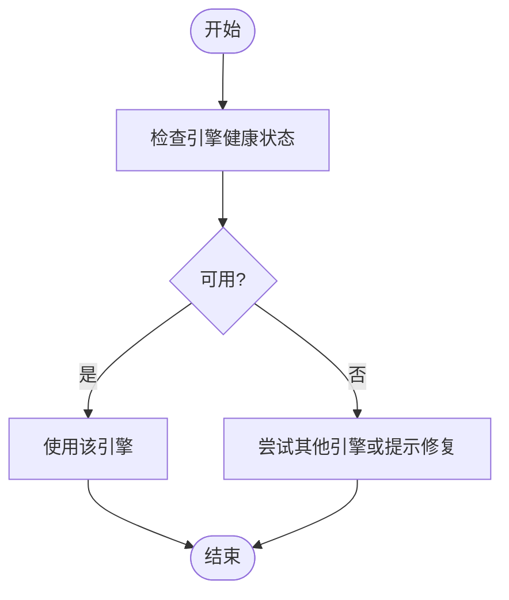
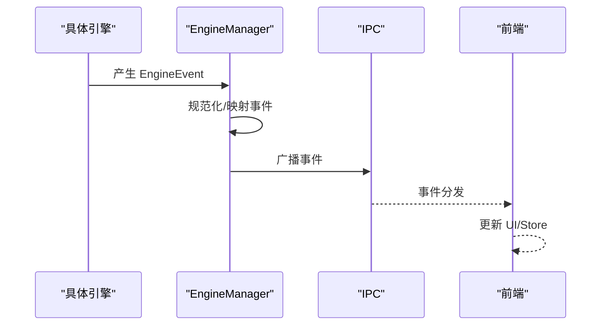
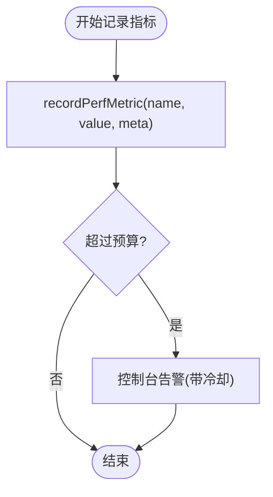
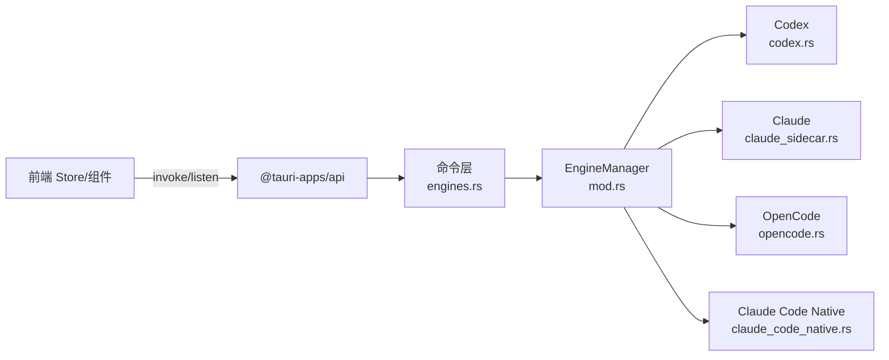

# 引擎管理服务

<cite>
**本文档引用的文件**
- [engineStore.ts](file://src/stores/engineStore.ts)
- [ipc.ts](file://src/lib/ipc.ts)
- [engines.rs](file://src-tauri/src/commands/engines.rs)
- [mod.rs](file://src-tauri/src/engines/mod.rs)
- [codex.rs](file://src-tauri/src/engines/codex.rs)
- [claude_sidecar.rs](file://src-tauri/src/engines/claude_sidecar.rs)
- [opencode.rs](file://src-tauri/src/engines/opencode.rs)
- [claude_code_native.rs](file://src-tauri/src/engines/claude_code_native.rs)
- [events.rs](file://src-tauri/src/engines/events.rs)
- [types.ts](file://src/types.ts)
- [perfTelemetry.ts](file://src/lib/perfTelemetry.ts)
</cite>

## 目录
1. [简介](#简介)
2. [项目结构](#项目结构)
3. [核心组件](#核心组件)
4. [架构总览](#架构总览)
5. [详细组件分析](#详细组件分析)
6. [依赖关系分析](#依赖关系分析)
7. [性能考虑](#性能考虑)
8. [故障排查指南](#故障排查指南)
9. [结论](#结论)

## 简介
本文件系统性阐述 Panes 引擎管理服务的设计与实现，重点覆盖以下方面：
- EngineManager 的职责边界与实例管理
- 引擎列表获取、健康检查、预热机制与动态配置更新
- 引擎选择策略、负载均衡与故障转移
- 引擎状态监控、性能指标采集与调试工具使用

目标是帮助开发者与运维人员快速理解引擎生命周期、运行时行为与可观测性方案。

## 项目结构
前端通过 IPC 调用后端命令，后端命令委派给 EngineManager，后者统一编排多个具体引擎实例（Codex、Claude、OpenCode、Claude Code Native）。引擎事件通过广播通道回传前端，前端 Store 负责缓存与展示。

**图表来源**
- [engines.rs:18-42](file://src-tauri/src/commands/engines.rs#L18-L42)
- [mod.rs:463-468](file://src-tauri/src/engines/mod.rs#L463-L468)
- [ipc.ts:336-345](file://src/lib/ipc.ts#L336-L345)

**章节来源**
- [engines.rs:18-42](file://src-tauri/src/commands/engines.rs#L18-L42)
- [mod.rs:463-553](file://src-tauri/src/engines/mod.rs#L463-L553)
- [ipc.ts:336-345](file://src/lib/ipc.ts#L336-L345)

## 核心组件
- EngineManager：统一管理多引擎实例，提供引擎列表、健康检查、预热、线程启动与消息发送等能力。
- 引擎实例：各引擎实现统一的 Engine trait，负责具体协议交互、事件映射与资源管理。
- 前端 Store：维护引擎列表、健康状态、加载状态与错误信息，支持健康检查去重与批量合并。
- IPC 层：封装 Tauri 命令调用与事件监听，桥接前后端。

关键职责与数据结构参考：
- 引擎信息与健康报告：EngineInfo、EngineHealth、EngineCapabilities
- 引擎事件：EngineEvent、TurnCompletionStatus、TokenUsage
- 运行时更新事件：EngineRuntimeUpdatedEvent、CodexProtocolDiagnostics

**章节来源**
- [mod.rs:420-468](file://src-tauri/src/engines/mod.rs#L420-L468)
- [types.ts:448-509](file://src/types.ts#L448-L509)
- [events.rs:113-177](file://src-tauri/src/engines/events.rs#L113-L177)
- [engineStore.ts:5-19](file://src/stores/engineStore.ts#L5-L19)

## 架构总览
EngineManager 作为编排中心，按需初始化各引擎实例，并在运行期提供统一接口。前端通过 IPC 访问后端命令，后端命令再委托 EngineManager 执行具体操作。引擎内部通过各自传输层或 SDK 与外部系统交互，事件经 EngineManager 广播回前端。

**图表来源**
- [mod.rs:463-468](file://src-tauri/src/engines/mod.rs#L463-L468)
- [codex.rs:86-148](file://src-tauri/src/engines/codex.rs#L86-L148)
- [claude_sidecar.rs:180-200](file://src-tauri/src/engines/claude_sidecar.rs#L180-L200)
- [opencode.rs:54-90](file://src-tauri/src/engines/opencode.rs#L54-L90)
- [claude_code_native.rs:64-82](file://src-tauri/src/engines/claude_code_native.rs#L64-L82)

## 详细组件分析

### 引擎列表获取与健康检查
- 列表获取：EngineManager.list_engines() 汇总各引擎模型与能力，带超时保护与回退策略，确保在引擎不可用时仍可返回静态或缓存模型。
- 健康检查：EngineManager.health() 返回各引擎可用性、版本、诊断与检查项，前端 Store 支持强制刷新与并发请求去重。

**图表来源**
- [engines.rs:18-33](file://src-tauri/src/commands/engines.rs#L18-L33)
- [mod.rs:484-615](file://src-tauri/src/engines/mod.rs#L484-L615)
- [engineStore.ts:29-56](file://src/stores/engineStore.ts#L29-L56)

**章节来源**
- [engines.rs:18-33](file://src-tauri/src/commands/engines.rs#L18-L33)
- [mod.rs:484-615](file://src-tauri/src/engines/mod.rs#L484-L615)
- [engineStore.ts:29-115](file://src/stores/engineStore.ts#L29-L115)

### 预热机制
- 预热目标：提前启动或加载引擎运行时，降低首次调用延迟。
- 实现方式：EngineManager.prewarm() 对各引擎执行预热逻辑；Codex/Claude/OpenCode 通过各自传输层或进程启动，Claude Code Native 无需外部预热。

**图表来源**
- [engines.rs:35-42](file://src-tauri/src/commands/engines.rs#L35-L42)
- [mod.rs:617-625](file://src-tauri/src/engines/mod.rs#L617-L625)

**章节来源**
- [engines.rs:35-42](file://src-tauri/src/commands/engines.rs#L35-L42)
- [mod.rs:617-625](file://src-tauri/src/engines/mod.rs#L617-L625)

### 动态配置更新与运行时事件
- 运行时更新：前端监听 "engine-runtime-updated" 事件，Store.applyRuntimeUpdate() 将协议诊断合并进健康报告。
- 协议诊断：Codex 引擎支持运行时协议诊断（CodexProtocolDiagnostics），用于追踪实验特性、插件、MCP 服务器等状态。

**图表来源**
- [ipc.ts:673-680](file://src/lib/ipc.ts#L673-L680)
- [engineStore.ts:134-162](file://src/stores/engineStore.ts#L134-L162)
- [codex.rs:170-200](file://src-tauri/src/engines/codex.rs#L170-L200)

**章节来源**
- [ipc.ts:673-680](file://src/lib/ipc.ts#L673-L680)
- [engineStore.ts:134-162](file://src/stores/engineStore.ts#L134-L162)
- [codex.rs:170-200](file://src-tauri/src/engines/codex.rs#L170-L200)

### 引擎选择策略、负载均衡与故障转移
- 选择策略：当前实现未内置跨引擎负载均衡或自动故障转移逻辑。前端通常基于引擎能力与模型可用性进行显式选择。
- 故障转移：可通过健康检查结果（EngineHealth.available）与错误恢复策略实现手动切换；建议结合前端 Store 的错误聚合与重试控制。

[此图为概念流程图，不对应具体源码文件]

### 引擎事件与状态监控
- 事件类型：文本增量、思考增量、动作开始/输出/进度/完成、差异更新、审批请求、用量限制更新、模型重路由、通知与错误等。
- 事件传播：各引擎内部事件经 EngineManager 映射与转发，最终通过 IPC 广播至前端。

**图表来源**
- [events.rs:113-177](file://src-tauri/src/engines/events.rs#L113-L177)
- [mod.rs:800-826](file://src-tauri/src/engines/mod.rs#L800-L826)
- [ipc.ts:629-634](file://src/lib/ipc.ts#L629-L634)

**章节来源**
- [events.rs:113-177](file://src-tauri/src/engines/events.rs#L113-L177)
- [mod.rs:800-826](file://src-tauri/src/engines/mod.rs#L800-L826)
- [ipc.ts:629-634](file://src/lib/ipc.ts#L629-L634)

### 性能指标与调试工具
- 前端性能遥测：perfTelemetry 提供指标记录、预算告警与时间窗口快照，便于定位性能瓶颈。
- 健康检查命令：run_engine_check 允许在受控范围内执行检查命令，返回执行耗时与输出截断后的结果。

**图表来源**
- [perfTelemetry.ts:55-87](file://src/lib/perfTelemetry.ts#L55-L87)
- [engines.rs:77-101](file://src-tauri/src/commands/engines.rs#L77-L101)

**章节来源**
- [perfTelemetry.ts:55-87](file://src/lib/perfTelemetry.ts#L55-L87)
- [engines.rs:77-101](file://src-tauri/src/commands/engines.rs#L77-L101)

## 依赖关系分析
- 前端依赖：Zustand 状态管理、@tauri-apps/api 事件监听、自定义类型定义。
- 后端依赖：async_trait、tokio 广播/通道、CancellationToken、引擎特定 SDK 或传输层。
- 命令层：Tauri 命令注解，参数校验与错误转换。

**图表来源**
- [engineStore.ts:1-19](file://src/stores/engineStore.ts#L1-L19)
- [ipc.ts:336-345](file://src/lib/ipc.ts#L336-L345)
- [engines.rs:18-42](file://src-tauri/src/commands/engines.rs#L18-L42)
- [mod.rs:463-468](file://src-tauri/src/engines/mod.rs#L463-L468)

**章节来源**
- [engineStore.ts:1-19](file://src/stores/engineStore.ts#L1-L19)
- [ipc.ts:336-345](file://src/lib/ipc.ts#L336-L345)
- [engines.rs:18-42](file://src-tauri/src/commands/engines.rs#L18-L42)
- [mod.rs:463-468](file://src-tauri/src/engines/mod.rs#L463-L468)

## 性能考虑
- 列表与健康检查超时：EngineManager 在模型查询与健康检查中采用超时与回退策略，避免阻塞 UI。
- 并发去重：前端 Store 对健康检查请求进行去重，减少重复网络开销。
- 事件截断：动作输出与 JSON 字符串在传输前进行截断，防止大块数据影响性能。
- 预热策略：在空闲时段或应用启动时触发预热，降低首包延迟。

[本节为通用指导，不直接分析具体文件]

## 故障排查指南
- 健康检查失败：检查命令权限与环境变量，确认 checks/fixes 列表中包含允许的命令。
- 引擎不可用：查看 EngineHealth.available 与 details/warnings，按提示修复依赖或配置。
- 审批流程异常：核对 approval_id 与响应格式，确保符合引擎规范（Claude/OpenCode 的响应归一化）。
- 事件丢失：确认 IPC 事件监听是否正确注册，广播通道容量是否足够。

**章节来源**
- [engines.rs:77-101](file://src-tauri/src/commands/engines.rs#L77-L101)
- [mod.rs:189-242](file://src-tauri/src/engines/mod.rs#L189-L242)
- [ipc.ts:629-634](file://src/lib/ipc.ts#L629-L634)

## 结论
引擎管理服务以 EngineManager 为核心，统一编排多引擎实例，提供一致的生命周期与事件接口。前端通过 Store 与 IPC 实现健康状态可视化与运行时事件订阅。建议在生产环境中结合健康检查、预热与性能遥测，构建完善的可观测性体系，并根据业务需求扩展负载均衡与故障转移策略。