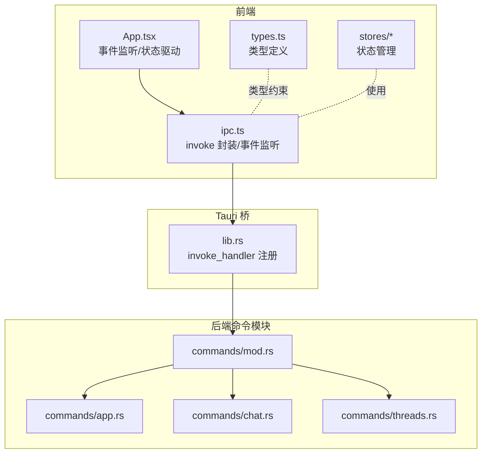
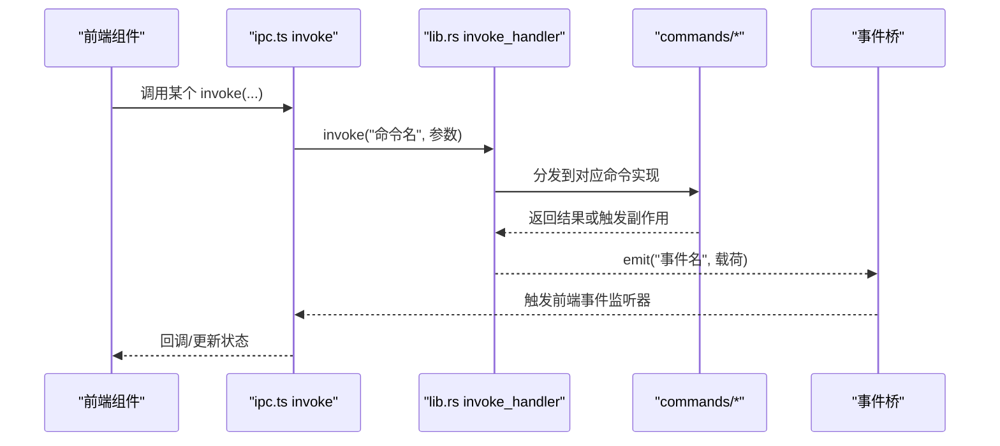
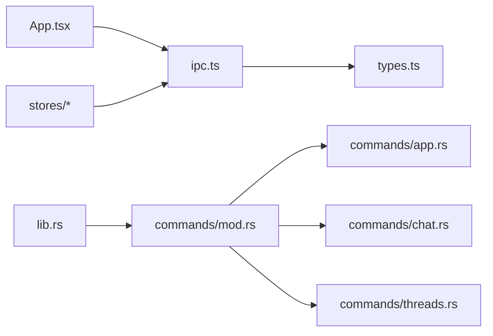

# API 参考

<cite>
**本文引用的文件**
- [src/main.tsx](file://src/main.tsx)
- [src/App.tsx](file://src/App.tsx)
- [src/lib/ipc.ts](file://src/lib/ipc.ts)
- [src/types.ts](file://src/types.ts)
- [src-tauri/src/lib.rs](file://src-tauri/src/lib.rs)
- [src-tauri/src/commands/mod.rs](file://src-tauri/src/commands/mod.rs)
- [src-tauri/src/commands/app.rs](file://src-tauri/src/commands/app.rs)
- [src-tauri/src/commands/chat.rs](file://src-tauri/src/commands/chat.rs)
- [src-tauri/src/commands/threads.rs](file://src-tauri/src/commands/threads.rs)
- [src/stores/workspacePaneStore.ts](file://src/stores/workspacePaneStore.ts)
- [src/stores/threadStore.ts](file://src/stores/threadStore.ts)
</cite>

## 目录
1. [简介](#简介)
2. [项目结构](#项目结构)
3. [核心组件](#核心组件)
4. [架构总览](#架构总览)
5. [详细组件分析](#详细组件分析)
6. [依赖关系分析](#依赖关系分析)
7. [性能考量](#性能考量)
8. [故障排查指南](#故障排查指南)
9. [结论](#结论)
10. [附录](#附录)

## 简介
本文件为 Panes 的完整 API 参考，覆盖前端 IPC API、后端命令接口、事件通信协议与配置项。内容面向第三方集成与扩展开发者，提供接口用途、参数、返回值、类型定义、错误处理与最佳实践，并解释版本管理、向后兼容性与废弃策略。

## 项目结构
Panes 前后端采用 Tauri 架构：前端使用 React + TypeScript，通过 @tauri-apps/api 的 invoke 直接调用后端命令；后端 Rust 模块化组织命令层，统一在 lib.rs 中注册到 Tauri invoke 桥。

图示来源
- [src/App.tsx:119-577](file://src/App.tsx#L119-L577)
- [src/lib/ipc.ts:72-627](file://src/lib/ipc.ts#L72-L627)
- [src-tauri/src/lib.rs:179-320](file://src-tauri/src/lib.rs#L179-L320)
- [src-tauri/src/commands/mod.rs:1-12](file://src-tauri/src/commands/mod.rs#L1-L12)

章节来源
- [src/main.tsx:11-32](file://src/main.tsx#L11-L32)
- [src/App.tsx:119-577](file://src/App.tsx#L119-L577)
- [src/lib/ipc.ts:72-627](file://src/lib/ipc.ts#L72-L627)
- [src-tauri/src/lib.rs:179-320](file://src-tauri/src/lib.rs#L179-L320)
- [src-tauri/src/commands/mod.rs:1-12](file://src-tauri/src/commands/mod.rs#L1-L12)

## 核心组件
- 前端 IPC 封装：集中于 ipc.ts，提供 invoke 调用与事件监听函数，统一参数与返回类型。
- 后端命令注册：lib.rs 在 invoke_handler 中注册所有命令，按功能分模块（app、chat、threads、files、git、engines、terminal、setup、harness）。
- 类型系统：types.ts 定义线程、消息、引擎、Git、终端通知等核心数据结构，前后端共享契约。
- 应用入口：main.tsx 初始化国际化与渲染应用，App.tsx 统一处理菜单动作、通知、运行时更新等事件。

章节来源
- [src/lib/ipc.ts:72-627](file://src/lib/ipc.ts#L72-L627)
- [src-tauri/src/lib.rs:179-320](file://src-tauri/src/lib.rs#L179-L320)
- [src/types.ts:158-172](file://src/types.ts#L158-L172)
- [src/main.tsx:11-32](file://src/main.tsx#L11-L32)
- [src/App.tsx:119-577](file://src/App.tsx#L119-L577)

## 架构总览
前端通过 invoke 调用后端命令，后端执行业务逻辑并通过 emit 发送事件；前端通过 listen* 函数订阅事件，实现无阻塞异步通信。

图示来源
- [src/lib/ipc.ts:72-627](file://src/lib/ipc.ts#L72-L627)
- [src-tauri/src/lib.rs:179-320](file://src-tauri/src/lib.rs#L179-L320)

## 详细组件分析

### 前端 IPC API（ipc.ts）
- 功能概览
  - 应用与系统：本地化、保持清醒、通知设置、终端加速渲染、通知预览与展示。
  - 工作区与文件树：打开/归档/恢复/删除工作区，列出目录、文件树分页、搜索文件。
  - 线程与聊天：创建/重命名/归档/恢复/删除线程，同步线程、复刻/回滚/压缩线程，附加远程会话，发送消息、转向消息、取消回合、审批响应，查询消息窗口与内容块。
  - Git 集成：状态、diff、分支/提交/stash/远程仓库、工作树、文件操作。
  - 终端：创建/写入/调整大小/关闭/列出会话、渲染诊断、恢复输出、通知列表与清理。
  - 引擎与模型：列举引擎、健康检查、预热、技能/应用/运行时目录查询、检查依赖与安装、检查/安装 harness。
  - 附件与预览：粘贴图片保存、附件预览。
- 事件监听
  - 线程事件、聊天回合完成、引擎运行时更新、菜单动作、终端输出/退出/前台变更、通知事件、安装进度等。
- 典型调用链
  - 创建线程：前端调用 ipc.createThread → 后端 threads 命令 → 数据库插入/更新 → 发出 thread-updated 事件 → 前端刷新状态。

章节来源
- [src/lib/ipc.ts:72-627](file://src/lib/ipc.ts#L72-L627)
- [src/lib/ipc.ts:629-792](file://src/lib/ipc.ts#L629-L792)

### 后端命令接口（commands/*）
- app.rs
  - 本地化：get_app_locale、set_app_locale
  - 通知：get_agent_notification_settings、set_chat_notifications_enabled、set_terminal_notifications_enabled、install_terminal_notification_integration_command、set_notification_sound、preview_notification_sound、show_agent_notification
  - 终端渲染：get_terminal_accelerated_rendering、set_terminal_accelerated_rendering
- chat.rs
  - 附件：save_pasted_image_attachment、read_attachment_preview
  - 发送消息：send_message（含输入项、计划模式、附件、权限策略、沙箱模式、网络许可、推理努力、服务等级等）
  - 审批与内容：steer_message、cancel_turn、respond_to_approval、get_message_blocks、get_action_output
  - 搜索与消息：search_messages、get_thread_messages、get_thread_messages_window
  - 评审：start_codex_review
- threads.rs
  - 列表与生命周期：list_threads、list_archived_threads、create_thread、rename_thread、archive_thread、restore_thread、delete_thread
  - 远程线程：list_codex_remote_threads、attach_codex_remote_thread、list_opencode_remote_sessions、attach_opencode_remote_session
  - 同步与演进：sync_thread_from_engine、fork_codex_thread、rollback_codex_thread、compact_codex_thread
  - 确认工作区线程：confirm_workspace_thread
- 文件与 Git、终端、引擎、设置、harness 等命令同理，均在对应模块中以 #[tauri::command] 实现。

章节来源
- [src-tauri/src/commands/app.rs:128-292](file://src-tauri/src/commands/app.rs#L128-L292)
- [src-tauri/src/commands/chat.rs:383-762](file://src-tauri/src/commands/chat.rs#L383-L762)
- [src-tauri/src/commands/threads.rs:32-800](file://src-tauri/src/commands/threads.rs#L32-L800)

### 类型定义（types.ts）
- 核心类型
  - 线程：Thread、ThreadStatus、ChatEngineId
  - 消息：Message、ContentBlock（文本/代码/diff/notice/action/approval/thinking/error/attachment/skill/mention/steer）
  - 引擎：EngineInfo、EngineModel、EngineHealth、EngineRuntimeUpdatedEvent
  - Git：GitStatus、GitDiffPreview、GitBranch/GitCommit/GitStash/GitRemote/GitWorktree、GitCompareSource
  - 终端：TerminalSession、TerminalNotification、TerminalNotificationSettings、TerminalRendererDiagnostics
  - 工作区：Workspace、WorkspaceStartupPreset、WorkspacePaneLayout 等
- 作用：前后端契约，确保 invoke 参数与返回值一致，避免类型不匹配导致的运行时错误。

章节来源
- [src/types.ts:158-172](file://src/types.ts#L158-L172)
- [src/types.ts:219-235](file://src/types.ts#L219-L235)
- [src/types.ts:437-449](file://src/types.ts#L437-L449)
- [src/types.ts:451-512](file://src/types.ts#L451-L512)
- [src/types.ts:733-745](file://src/types.ts#L733-L745)
- [src/types.ts:56-73](file://src/types.ts#L56-L73)

### 应用入口与事件处理（main.tsx、App.tsx）
- main.tsx：初始化本地化（优先从后端获取），渲染根组件。
- App.tsx：注册菜单动作、线程更新、聊天回合完成、引擎运行时更新等事件监听；处理快捷键、窗口行为、通知显示、KeepAwake 状态轮询等。

章节来源
- [src/main.tsx:11-32](file://src/main.tsx#L11-L32)
- [src/App.tsx:119-577](file://src/App.tsx#L119-L577)

### 工作区面板布局（workspacePaneStore.ts）
- 提供工作区内聊天/终端/编辑器三面板的布局与切换能力，支持分割、聚焦、标签页激活、广播等。
- 与前端 IPC 的交互体现在终端布局切换、会话创建与广播控制等场景。

章节来源
- [src/stores/workspacePaneStore.ts:1-693](file://src/stores/workspacePaneStore.ts#L1-L693)

### 线程状态管理（threadStore.ts）
- 负责线程的创建、刷新、归档/恢复、删除、复制/回滚/压缩、附加远程会话、设置推理努力与模型等。
- 与 IPC 的交互集中在 create/rename/archive/restore/delete/fork/rollback/compact/attach 等命令上。

章节来源
- [src/stores/threadStore.ts:164-713](file://src/stores/threadStore.ts#L164-L713)

## 依赖关系分析
- 前端依赖
  - ipc.ts 依赖 @tauri-apps/api 的 invoke/listen，依赖 types.ts 的类型定义。
  - App.tsx 依赖 ipc.ts 的事件监听与 invoke 方法，依赖 stores/* 管理状态。
- 后端依赖
  - lib.rs 依赖各命令模块，统一注册到 invoke_handler。
  - 各命令模块依赖 state、db、engines、git、terminal 等子系统。

图示来源
- [src/lib/ipc.ts:72-627](file://src/lib/ipc.ts#L72-L627)
- [src-tauri/src/lib.rs:179-320](file://src-tauri/src/lib.rs#L179-L320)
- [src-tauri/src/commands/mod.rs:1-12](file://src-tauri/src/commands/mod.rs#L1-L12)

章节来源
- [src/lib/ipc.ts:72-627](file://src/lib/ipc.ts#L72-L627)
- [src-tauri/src/lib.rs:179-320](file://src-tauri/src/lib.rs#L179-L320)
- [src-tauri/src/commands/mod.rs:1-12](file://src-tauri/src/commands/mod.rs#L1-L12)

## 性能考量
- 流式事件合并：后端在消息流式传输中进行事件合并与数据库批量落盘，减少频繁 IO。
- 事件队列容量与空闲刷新：限制事件队列长度与空闲刷新间隔，平衡实时性与吞吐。
- 终端输出延迟与超时：新会话写入前等待输出事件或超时回退，避免过早写入导致的命令丢失。
- 本地化与通知：优先从后端获取本地化信息，减少前端计算；通知预览跨平台适配。

章节来源
- [src-tauri/src/commands/chat.rs:33-41](file://src-tauri/src/commands/chat.rs#L33-L41)
- [src-tauri/src/lib.rs:348-509](file://src-tauri/src/lib.rs#L348-L509)
- [src/lib/ipc.ts:744-792](file://src/lib/ipc.ts#L744-L792)

## 故障排查指南
- 无法连接后端 invoke
  - 现象：前端调用 invoke 抛错或无响应。
  - 排查：确认 Tauri 环境已启动，lib.rs 的 invoke_handler 是否正确注册；检查命令是否在对应模块中实现。
- 事件未到达前端
  - 现象：前端监听不到 thread-updated 或 chat-turn-finished。
  - 排查：确认后端 emit 的事件名与前端 listen* 的订阅一致；检查事件载荷字段是否符合预期。
- 附件上传失败
  - 现象：粘贴图片过大或格式不支持。
  - 排查：检查 MIME 类型与大小限制；确认存储目录可写。
- 终端会话异常
  - 现象：会话无法创建或输出不显示。
  - 排查：确认终端加速渲染设置、会话尺寸参数、输出事件监听是否正常。

章节来源
- [src-tauri/src/commands/app.rs:128-292](file://src-tauri/src/commands/app.rs#L128-L292)
- [src-tauri/src/commands/chat.rs:213-258](file://src-tauri/src/commands/chat.rs#L213-L258)
- [src-tauri/src/lib.rs:348-509](file://src-tauri/src/lib.rs#L348-L509)

## 结论
本文提供了 Panes 前后端 API 的完整参考，涵盖 IPC 调用、事件通信、类型定义与关键流程。建议在集成时严格遵循 types.ts 的类型契约，合理使用事件监听与 invoke 调用，并关注性能与错误处理细节，以获得稳定可靠的第三方扩展体验。

## 附录

### API 一览与使用示例（路径指引）
- 应用与系统
  - 获取/设置本地化：[src/lib/ipc.ts:73-74](file://src/lib/ipc.ts#L73-L74)、[src-tauri/src/commands/app.rs:128-154](file://src-tauri/src/commands/app.rs#L128-L154)
  - 通知开关与预览：[src/lib/ipc.ts:87-100](file://src/lib/ipc.ts#L87-L100)、[src-tauri/src/commands/app.rs:184-292](file://src-tauri/src/commands/app.rs#L184-L292)
- 工作区与文件树
  - 打开/归档/恢复/删除工作区：[src/lib/ipc.ts:101-110](file://src/lib/ipc.ts#L101-L110)
  - 文件树分页与搜索：[src/lib/ipc.ts:164-189](file://src/lib/ipc.ts#L164-L189)
- 线程与聊天
  - 创建/重命名/归档/恢复/删除线程：[src/lib/ipc.ts:243-335](file://src/lib/ipc.ts#L243-L335)
  - 发送消息与审批：[src/lib/ipc.ts:357-403](file://src/lib/ipc.ts#L357-L403)
  - 远程线程附加：[src/lib/ipc.ts:193-242](file://src/lib/ipc.ts#L193-L242)
- Git 集成
  - 状态与 diff：[src/lib/ipc.ts:425-427](file://src/lib/ipc.ts#L425-L427)
  - 分支/提交/stash/远程仓库/工作树：[src/lib/ipc.ts:465-533](file://src/lib/ipc.ts#L465-L533)
- 终端
  - 会话管理与输出：[src/lib/ipc.ts:547-601](file://src/lib/ipc.ts#L547-L601)
  - 通知与焦点：[src/lib/ipc.ts:602-615](file://src/lib/ipc.ts#L602-L615)
- 引擎与模型
  - 引擎列表与健康检查：[src/lib/ipc.ts:336-340](file://src/lib/ipc.ts#L336-L340)
  - 技能/应用/运行时目录：[src/lib/ipc.ts:341-345](file://src/lib/ipc.ts#L341-L345)
- 附件与预览
  - 粘贴图片保存与预览：[src/lib/ipc.ts:346-356](file://src/lib/ipc.ts#L346-L356)

### 类型定义要点
- 线程与消息：[src/types.ts:158-172](file://src/types.ts#L158-L172)、[src/types.ts:219-235](file://src/types.ts#L219-L235)
- 内容块与动作输出：[src/types.ts:437-449](file://src/types.ts#L437-L449)、[src/types.ts:306-310](file://src/types.ts#L306-L310)
- Git 与终端：[src/types.ts:733-745](file://src/types.ts#L733-L745)、[src/types.ts:56-73](file://src/types.ts#L56-L73)

### 版本管理、向后兼容与废弃策略
- 版本管理
  - WorkspaceStartupPreset.version 字段用于标识预设版本，便于后续迁移与兼容处理。
- 向后兼容
  - 新增字段时保留旧字段读取，避免破坏既有配置；事件与命令名称保持稳定，仅在必要时引入新事件。
- 废弃策略
  - 对于不再推荐使用的命令或字段，建议在命令实现中返回明确的弃用提示或错误信息，并在下一主版本移除。

章节来源
- [src/types.ts:96-101](file://src/types.ts#L96-L101)