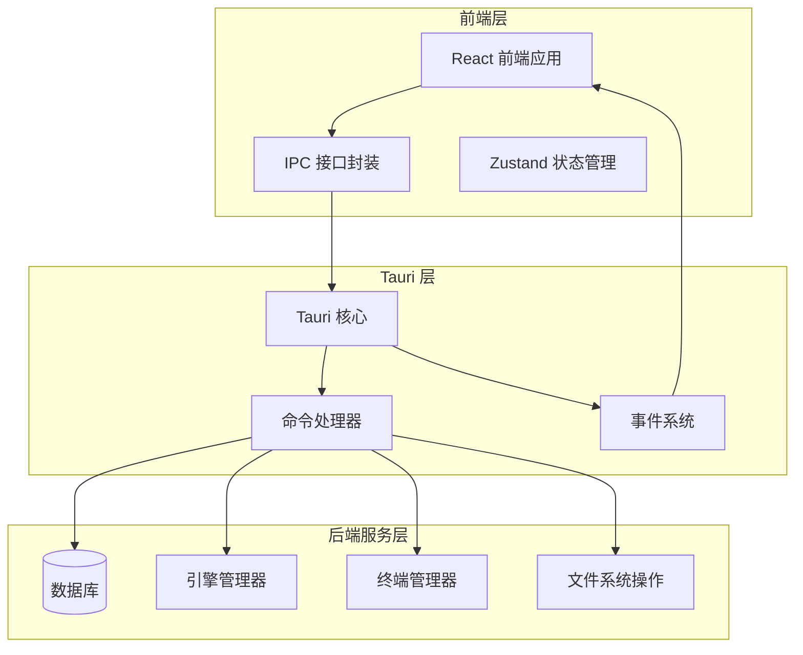
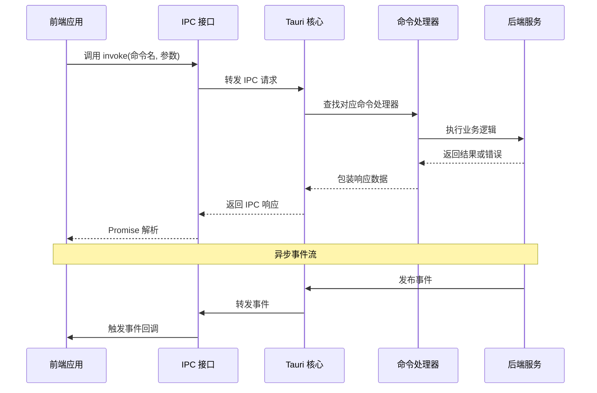
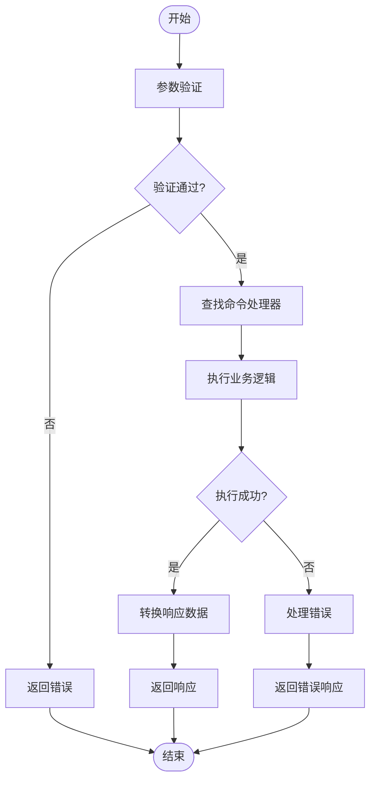
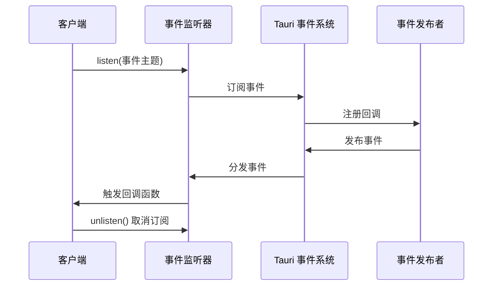
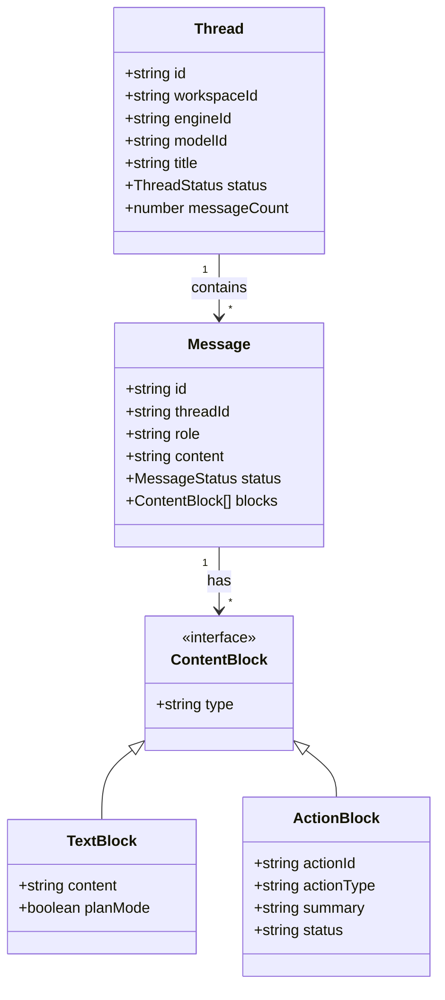
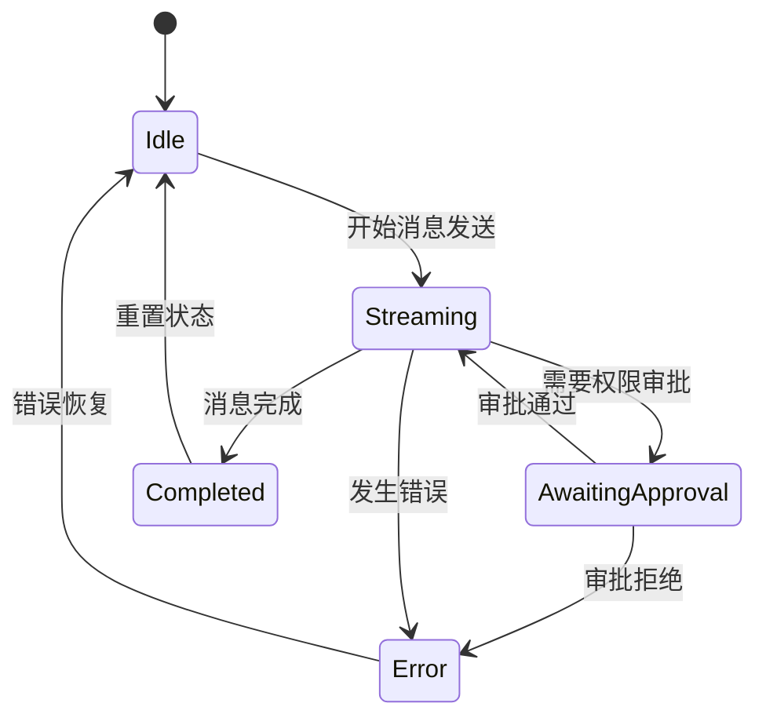
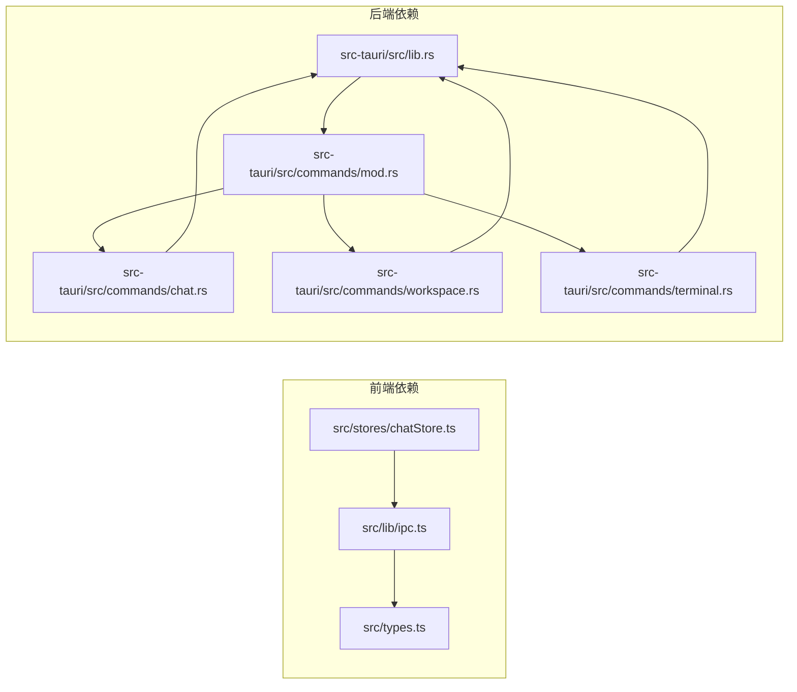
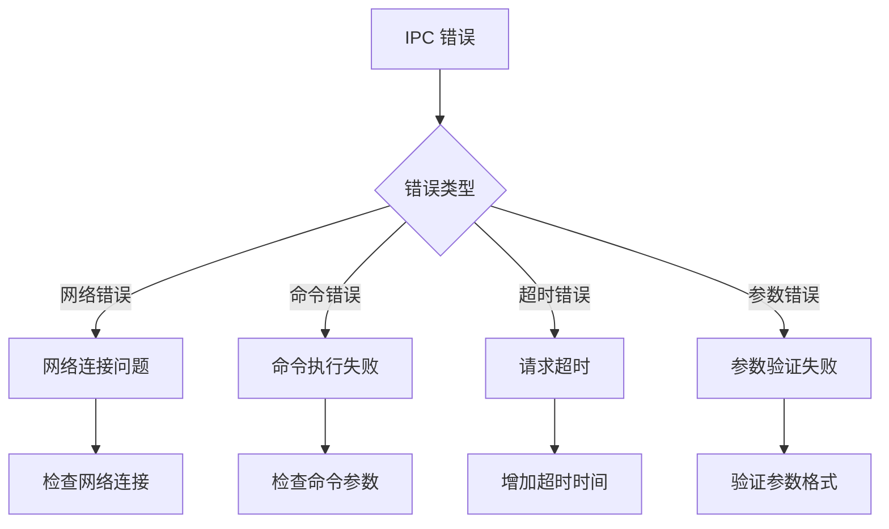

# IPC 通信接口

<cite>
**本文档引用的文件**
- [src/lib/ipc.ts](file://src/lib/ipc.ts)
- [src-tauri/src/lib.rs](file://src-tauri/src/lib.rs)
- [src-tauri/src/commands/mod.rs](file://src-tauri/src/commands/mod.rs)
- [src-tauri/src/commands/chat.rs](file://src-tauri/src/commands/chat.rs)
- [src-tauri/src/commands/workspace.rs](file://src-tauri/src/commands/workspace.rs)
- [src-tauri/src/commands/terminal.rs](file://src-tauri/src/commands/terminal.rs)
- [src-tauri/src/commands/harness.rs](file://src-tauri/src/commands/harness.rs)
- [src/types.ts](file://src/types.ts)
- [src/stores/chatStore.ts](file://src/stores/chatStore.ts)
</cite>

## 目录
1. [简介](#简介)
2. [项目结构](#项目结构)
3. [核心组件](#核心组件)
4. [架构概览](#架构概览)
5. [详细组件分析](#详细组件分析)
6. [依赖关系分析](#依赖关系分析)
7. [性能考量](#性能考量)
8. [故障排除指南](#故障排除指南)
9. [结论](#结论)

## 简介

Panels 项目采用 Tauri 框架实现跨平台桌面应用，其中 IPC（进程间通信）作为前端 React 应用与 Rust 后端服务之间的核心通信机制。该系统实现了完整的异步通信协议，支持请求/响应模式、事件订阅、错误传播和超时处理。

IPC 系统主要分为两个层面：
- **命令层**：基于 Tauri 的 invoke 机制，实现同步的请求/响应通信
- **事件层**：基于 Tauri 的事件系统，实现异步的事件推送和订阅

## 项目结构

**图表来源**
- [src/lib/ipc.ts:1-792](file://src/lib/ipc.ts#L1-L792)
- [src-tauri/src/lib.rs:48-339](file://src-tauri/src/lib.rs#L48-L339)

**章节来源**
- [src/lib/ipc.ts:1-792](file://src/lib/ipc.ts#L1-L792)
- [src-tauri/src/lib.rs:48-339](file://src-tauri/src/lib.rs#L48-L339)

## 核心组件

### IPC 接口封装

前端通过 `src/lib/ipc.ts` 提供统一的 IPC 接口封装，包含以下主要功能：

#### 命令接口
- **应用配置管理**：语言设置、电源管理、通知配置
- **工作空间管理**：工作空间列表、仓库管理、文件树浏览
- **聊天引擎接口**：消息发送、线程管理、附件处理
- **Git 操作**：状态查询、差异比较、分支管理
- **终端控制**：会话创建、输入输出、通知管理
- **系统工具**：依赖检测、Harness 管理

#### 事件监听接口
- **线程事件**：流式事件、状态更新
- **Git 变更**：仓库状态变更通知
- **引擎事件**：运行时诊断、权限审批
- **终端事件**：输出变化、会话状态

**章节来源**
- [src/lib/ipc.ts:72-627](file://src/lib/ipc.ts#L72-L627)
- [src/lib/ipc.ts:629-791](file://src/lib/ipc.ts#L629-L791)

### 后端命令处理器

Rust 后端通过 `src-tauri/src/lib.rs` 注册所有 IPC 命令，采用模块化设计：

#### 命令注册机制
- 使用 `generate_handler!` 宏批量注册命令
- 支持异步命令处理和错误传播
- 集成数据库事务和状态管理

#### 事件发布机制
- 通过 `Emitter` trait 发布系统事件
- 实现跨线程安全的事件传递
- 支持命名空间隔离的事件主题

**章节来源**
- [src-tauri/src/lib.rs:181-322](file://src-tauri/src/lib.rs#L181-L322)
- [src-tauri/src/lib.rs:340-511](file://src-tauri/src/lib.rs#L340-L511)

## 架构概览

**图表来源**
- [src/lib/ipc.ts:1-792](file://src/lib/ipc.ts#L1-L792)
- [src-tauri/src/lib.rs:181-322](file://src-tauri/src/lib.rs#L181-L322)

## 详细组件分析

### 命令执行流程

#### 请求/响应模式

**图表来源**
- [src-tauri/src/commands/chat.rs:384-762](file://src-tauri/src/commands/chat.rs#L384-L762)

#### 事件订阅机制

**图表来源**
- [src/lib/ipc.ts:629-742](file://src/lib/ipc.ts#L629-L742)

**章节来源**
- [src/lib/ipc.ts:72-627](file://src/lib/ipc.ts#L72-L627)
- [src-tauri/src/commands/chat.rs:384-762](file://src-tauri/src/commands/chat.rs#L384-L762)

### 数据模型与类型系统

#### 类型定义结构
系统采用 TypeScript 和 Rust 的双向类型约束：

**图表来源**
- [src/types.ts:155-446](file://src/types.ts#L155-L446)

**章节来源**
- [src/types.ts:1-800](file://src/types.ts#L1-L800)

### 状态管理集成

#### ChatStore 与 IPC 的集成

**图表来源**
- [src/stores/chatStore.ts:114-155](file://src/stores/chatStore.ts#L114-L155)

**章节来源**
- [src/stores/chatStore.ts:1-200](file://src/stores/chatStore.ts#L1-L200)
- [src/stores/chatStore.ts:1615-1684](file://src/stores/chatStore.ts#L1615-L1684)

## 依赖关系分析

**图表来源**
- [src/lib/ipc.ts:1-792](file://src/lib/ipc.ts#L1-L792)
- [src-tauri/src/commands/mod.rs:1-12](file://src-tauri/src/commands/mod.rs#L1-L12)

**章节来源**
- [src-tauri/src/commands/mod.rs:1-12](file://src-tauri/src/commands/mod.rs#L1-L12)
- [src-tauri/src/lib.rs:1-46](file://src-tauri/src/lib.rs#L1-L46)

## 性能考量

### 事件流处理优化

系统实现了智能的事件流处理机制：

#### 批量处理策略
- **事件队列**：默认 16ms 窗口批量处理
- **队列刷新阈值**：500ms 最长延迟
- **内存管理**：自动清理空闲队列

#### 流式传输优化
- **内容块缓存**：避免重复序列化
- **增量更新**：只更新变化的内容块
- **字符限制**：单个块 8KB 字符限制

### 超时和重试机制

#### 命令超时
- **默认超时**：30 秒
- **可配置超时**：根据操作类型调整
- **优雅降级**：超时后返回错误而非崩溃

#### 连接重试
- **指数退避**：500ms → 1s → 2s
- **最大重试次数**：3 次
- **连接状态监控**：自动检测连接丢失

**章节来源**
- [src/stores/chatStore.ts:65-88](file://src/stores/chatStore.ts#L65-L88)
- [src-tauri/src/power/macos_helper.rs:246-259](file://src-tauri/src/power/macos_helper.rs#L246-L259)

## 故障排除指南

### 常见错误类型

#### IPC 调用错误

**图表来源**
- [src-tauri/src/power/macos_helper.rs:220-243](file://src-tauri/src/power/macos_helper.rs#L220-L243)

#### 事件订阅问题
- **重复订阅**：确保每次订阅都有对应的取消函数
- **内存泄漏**：及时调用 unlisten() 清理订阅
- **主题匹配**：确认事件主题格式正确

### 调试技巧

#### 开发环境调试
- **启用日志**：设置 `RUST_LOG=debug` 环境变量
- **浏览器调试**：使用 Chrome DevTools 调试 IPC 通信
- **事件追踪**：监控事件流中的数据变化

#### 生产环境监控
- **性能指标**：记录事件处理延迟和吞吐量
- **错误统计**：收集各类错误的发生频率
- **资源使用**：监控内存和 CPU 使用情况

**章节来源**
- [src-tauri/src/power/macos_helper.rs:219-259](file://src-tauri/src/power/macos_helper.rs#L219-L259)
- [src/stores/chatStore.ts:2063-2091](file://src/stores/chatStore.ts#L2063-L2091)

## 结论

Panels 项目的 IPC 通信系统展现了现代桌面应用架构的最佳实践：

### 设计优势
- **类型安全**：前端和后端的类型系统保证了数据一致性
- **异步处理**：非阻塞的事件驱动架构提升了用户体验
- **模块化设计**：清晰的职责分离便于维护和扩展
- **错误处理**：完善的错误传播和恢复机制

### 技术特色
- **事件流优化**：智能的批量处理和内存管理
- **超时控制**：合理的超时策略和重试机制
- **状态管理**：与前端状态管理框架的无缝集成
- **性能监控**：内置的性能指标收集和分析

### 发展建议
- **协议版本化**：为 IPC 协议引入版本控制
- **安全增强**：添加访问控制和数据加密
- **监控完善**：扩展更详细的性能和错误监控
- **文档改进**：完善 API 文档和使用示例

该 IPC 系统为 Panes 项目提供了稳定可靠的数据交换基础，支持复杂的多线程和异步操作场景，是构建高质量桌面应用的重要基础设施。