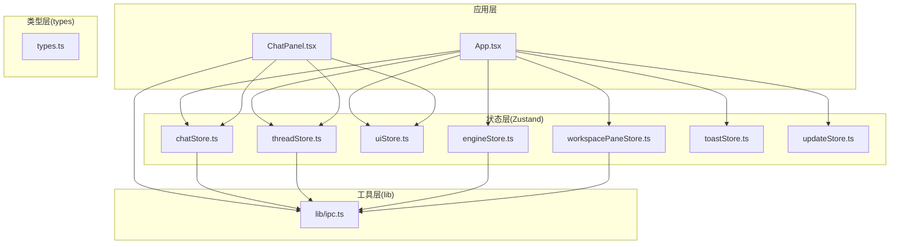
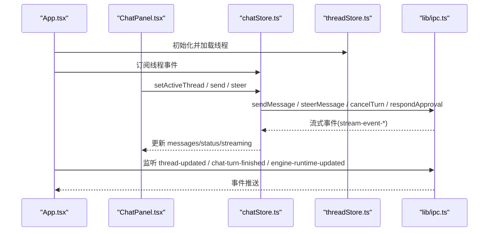
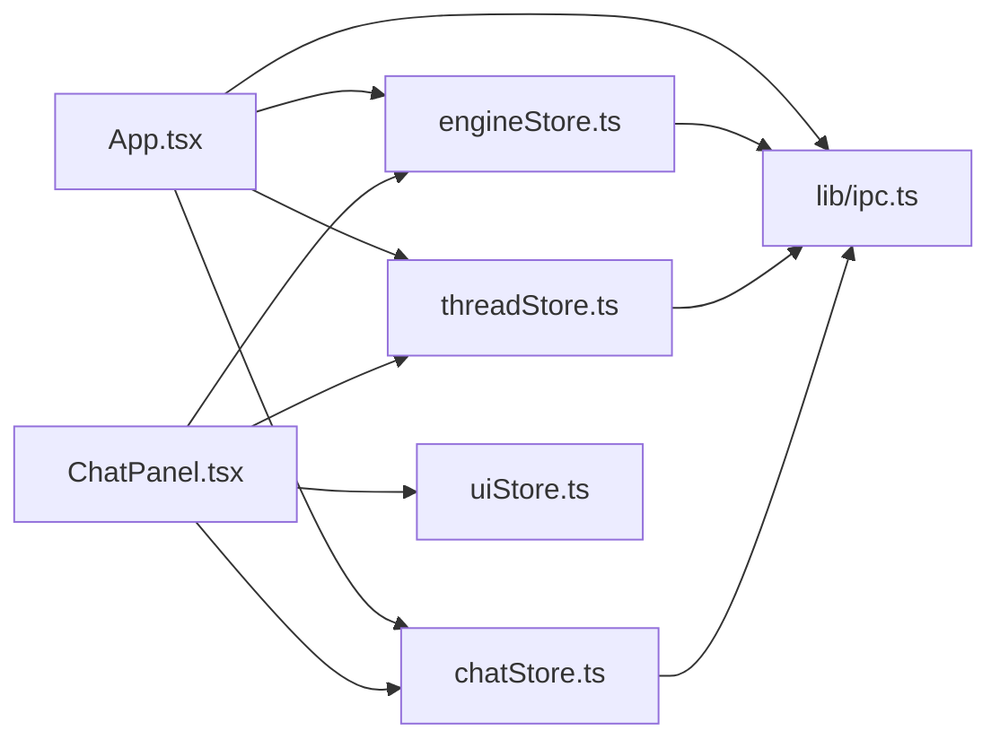

# 前端 API

<cite>
**本文引用的文件**
- [src/App.tsx](file://src/App.tsx)
- [src/stores/chatStore.ts](file://src/stores/chatStore.ts)
- [src/stores/threadStore.ts](file://src/stores/threadStore.ts)
- [src/stores/uiStore.ts](file://src/stores/uiStore.ts)
- [src/stores/workspacePaneStore.ts](file://src/stores/workspacePaneStore.ts)
- [src/stores/engineStore.ts](file://src/stores/engineStore.ts)
- [src/lib/ipc.ts](file://src/lib/ipc.ts)
- [src/components/chat/ChatPanel.tsx](file://src/components/chat/ChatPanel.tsx)
- [src/stores/toastStore.ts](file://src/stores/toastStore.ts)
- [src/stores/updateStore.ts](file://src/stores/updateStore.ts)
- [src/types.ts](file://src/types.ts)
</cite>

## 目录
1. [简介](#简介)
2. [项目结构](#项目结构)
3. [核心组件](#核心组件)
4. [架构总览](#架构总览)
5. [详细组件分析](#详细组件分析)
6. [依赖关系分析](#依赖关系分析)
7. [性能考量](#性能考量)
8. [故障排查指南](#故障排查指南)
9. [结论](#结论)
10. [附录](#附录)

## 简介
本文件系统性梳理 Panes 前端的公开 API，覆盖以下方面：
- Zustand 状态存储：聊天、线程、UI、工作区面板布局、引擎、更新与通知等
- React 组件接口：Props 类型、事件回调、内部工具函数
- 工具函数与类型定义：IPC 调用、消息流处理、权限与策略解析、附件与模型选择等
- 生命周期、错误处理与性能优化建议
- 使用示例路径（以源码路径标注代替具体代码）

目标是帮助前端开发者快速理解并正确使用 Panes 的前端 API。

## 项目结构
前端采用“模块化 + 层次化”组织：
- stores：集中管理全局状态（Zustand）
- components：按功能域拆分（chat、editor、git、layout、onboarding、shared、sidebar、terminal、workspace）
- lib：跨域工具（IPC、窗口操作、编辑菜单、命令面板等）
- types：共享类型定义
- App.tsx：应用入口与全局事件监听

图示来源
- [src/App.tsx](file://src/App.tsx)
- [src/components/chat/ChatPanel.tsx](file://src/components/chat/ChatPanel.tsx)
- [src/stores/chatStore.ts](file://src/stores/chatStore.ts)
- [src/stores/threadStore.ts](file://src/stores/threadStore.ts)
- [src/stores/uiStore.ts](file://src/stores/uiStore.ts)
- [src/stores/workspacePaneStore.ts](file://src/stores/workspacePaneStore.ts)
- [src/stores/engineStore.ts](file://src/stores/engineStore.ts)
- [src/stores/toastStore.ts](file://src/stores/toastStore.ts)
- [src/stores/updateStore.ts](file://src/stores/updateStore.ts)
- [src/lib/ipc.ts](file://src/lib/ipc.ts)
- [src/types.ts](file://src/types.ts)

章节来源
- [src/App.tsx](file://src/App.tsx)
- [src/components/chat/ChatPanel.tsx](file://src/components/chat/ChatPanel.tsx)

## 核心组件
本节聚焦各 Zustand Store 的公共 API、React 组件 Props 以及工具函数的使用方式与约束。

- chatStore（聊天状态）
  - 公共方法与属性
    - 线程绑定与消息流：setActiveThread(threadId)
    - 消息加载：loadOlderMessages()
    - 发送消息：send(message, options)
    - 调整运行参数：steer(message, options)
    - 取消当前轮次：cancel()
    - 审批响应：respondApproval(approvalId, response)
    - 行为输出水合：hydrateActionOutput(messageId, actionId)
  - 关键状态
    - threadId、messages、olderCursor、hasOlderMessages、loadingOlderMessages、olderLoadBlockedUntil、status、streaming、usageLimits、error
  - 使用要点
    - 流式事件批量合并与节流刷新，避免频繁重渲染
    - 后台监听用于切换标签页时保持事件流不丢失
    - 乐观消息插入与回退错误处理
  - 示例路径
    - [setActiveThread 实现](file://src/stores/chatStore.ts)
    - [send 实现](file://src/stores/chatStore.ts)
    - [loadOlderMessages 实现](file://src/stores/chatStore.ts)

- threadStore（线程管理）
  - 公共方法与属性
    - 创建线程：createThread(input)
    - 确保作用域内线程：ensureThreadForScope(input)
    - 刷新线程列表：refreshThreads(workspaceId) / refreshArchivedThreads / refreshAllThreads
    - 删除/恢复线程：removeThread / restoreThread
    - 远端线程关联：attachCodexRemoteThread / attachOpenCodeRemoteSession
    - 设置活动线程：setActiveThread(threadId)
    - 本地应用线程更新：applyThreadUpdateLocal(thread)
    - 设置推理努力与最后模型：setThreadReasoningEffortLocal / setThreadLastModelLocal
  - 使用要点
    - 通过 workspaceId 维度聚合线程，支持归档线程分离
    - 本地状态与远端同步，必要时回退
  - 示例路径
    - [createThread 实现](file://src/stores/threadStore.ts)
    - [ensureThreadForScope 实现](file://src/stores/threadStore.ts)
    - [refreshAllThreads 实现](file://src/stores/threadStore.ts)

- uiStore（界面状态）
  - 公共方法与属性
    - 侧边栏与 Git 面板控制：toggleSidebar / toggleSidebarPin / setSidebarPinned / toggleGitPanel / toggleGitPanelPin / setGitPanelPinned
    - 资源管理器开关：toggleExplorer / setExplorerOpen
    - 专注模式：setFocusMode / toggleFocusMode（带快照）
    - 活动视图与工作区设置：setActiveView / openWorkspaceSettings
    - 命令面板：openCommandPalette / closeCommandPalette
    - 消息焦点定位：setMessageFocusTarget / clearMessageFocusTarget
  - 使用要点
    - 状态持久化到 localStorage（侧边栏、Git 面板、资源管理器）
    - 切换到 harnesses 视图时懒加载 harnessStore 扫描
  - 示例路径
    - [uiStore 定义与实现](file://src/stores/uiStore.ts)

- workspacePaneStore（工作区面板布局）
  - 公共方法与属性
    - 确保工作区布局：ensureWorkspace(workspaceId, legacyMode?)
    - 应用旧版布局模式：applyLegacyLayoutMode
    - 焦点叶节点：focusLeaf
    - 激活/关闭标签与表面：setActiveTab / activateSurfaceInLeaf / activateFocusedSurface / showSurface / showSingleSurface / closeLeaf / closeTab
    - 分割叶节点：splitLeaf / splitFocusedLeaf
    - 更新比例：updateRatio
  - 数据结构
    - WorkspacePaneLeaf / WorkspacePaneSplit / WorkspacePaneNode / WorkspacePaneLayout
  - 使用要点
    - 布局树的增删改查与空叶裁剪
    - 比例值安全化与持久化
  - 示例路径
    - [workspacePaneStore 定义与实现](file://src/stores/workspacePaneStore.ts)

- engineStore（引擎状态）
  - 公共方法与属性
    - 加载引擎列表：load()
    - 获取/刷新引擎健康：ensureHealth(engineId, options?) / mergeHealth(reports)
    - 应用运行时更新：applyRuntimeUpdate(event)
  - 使用要点
    - 引擎发现失败时提供默认健康报告
    - 并发健康检查去重
  - 示例路径
    - [engineStore 定义与实现](file://src/stores/engineStore.ts)

- toastStore（通知）
  - 公共方法
    - 添加与关闭：addToast(opts) -> id / dismissToast(id)
    - 快捷方法：toast.success / toast.error / toast.warning / toast.info
  - 使用要点
    - 最大数量限制与默认时长
  - 示例路径
    - [toastStore 定义与实现](file://src/stores/toastStore.ts)

- updateStore（更新）
  - 公共方法
    - 检查更新并安装：checkForUpdate()
    - 重置状态：resetToIdle()
    - 暂缓：snooze()
  - 使用要点
    - 错误捕获与状态标记
  - 示例路径
    - [updateStore 定义与实现](file://src/stores/updateStore.ts)

- lib/ipc（跨进程通信）
  - 公共方法（封装 Tauri invoke 与事件监听）
    - 应用与电源：getAppLocale / setAppLocale / get/setKeepAwakeState / get/setPowerSettings / getHelperStatus / registerKeepAwakeHelper
    - 通知：getAgentNotificationSettings / setChatNotificationsEnabled / setTerminalNotificationsEnabled / installTerminalNotificationIntegration / setNotificationSound / previewNotificationSound / showAgentNotification
    - 工作区与仓库：listWorkspaces / openWorkspace / archive/restore/deleteWorkspace / getRepos / setRepoTrustLevel / setRepoGitActive / setWorkspaceGitActiveRepos / hasWorkspaceGitSelection / 工作区启动预设相关
    - 文件树与搜索：listWorkspaceDirs / getWorkspaceFileTreePage / searchWorkspaceFiles
    - 线程：list/listArchivedThreads / listCodexRemoteThreads / attachCodexRemoteThread / listOpenCodeRemoteSessions / attachOpenCodeRemoteSession / create/rename/archive/restore/deleteThread / setThreadReasoningEffort / setThreadExecutionPolicy / setThreadCodexConfig / setThreadOpenCodeConfig / syncThreadFromEngine / fork/rollback/compactCodexThread
    - 消息：sendMessage / steerMessage / cancelTurn / respondApproval / getThreadMessages / getThreadMessagesWindow / getMessageBlocks / getActionOutput / searchMessages
    - Git：getGitStatus / getFileDiff / getGitFileCompare / getFileTree / getFileTreePage / listDir / create/rename/deletePath / stage/unstage/discard/commit / fetch/pull/push / list branches / checkout/create/rename/deleteBranch / listCommits / getCommitDiff / listStashes / push/apply/popStash / init/add/remove remote / list/worktree / add/remove/pruneWorktree
    - 文件：readFile / resolveEditorFileReference / writeFile / watchGitRepo
    - 终端：terminalCreateSession / terminalWrite / terminalWriteBytes / terminalResize / terminalCloseSession / terminalCloseWorkspaceSessions / terminalListSessions / terminalGetRendererDiagnostics / terminalResumeSession / terminalDrainOutput / terminalListNotifications / terminalClearNotification / terminalSetNotificationFocus
    - 依赖与 Harness：checkDependencies / installDependency / checkHarnesses / install/lanchHarness
    - 事件监听：listenThreadEvents / listenGitRepoChanged / listenThreadUpdated / listenChatTurnFinished / listenEngineRuntimeUpdated / listenMenuAction / listenTerminalOutput / listenInstallProgress / listenTerminalExit / listenTerminalForegroundChanged / listenTerminalNotification / listenTerminalNotificationCleared
    - 新会话写入命令：writeCommandToNewSession
  - 使用要点
    - 事件监听统一命名空间，注意解绑
    - 大量异步调用需错误兜底
  - 示例路径
    - [ipc 封装与事件监听](file://src/lib/ipc.ts)

- 组件 Props（示例：ChatPanel）
  - 关键 Props
    - embedded?: boolean
  - 内部状态与行为
    - 输入框、附件、计划模式、斜杠菜单、命令面板、引擎/模型/推理努力选择、Codex/OpenCode 参考目录加载、执行策略配置、输出模式与审批策略文本编辑、消息复制、时间戳格式化、附件 MIME 推断、粘贴图片处理、用量百分比与宽度计算等
  - 使用要点
    - 通过 useChatStore/useThreadStore/useEngineStore/useUiStore 等读取与修改状态
    - 附件扩展名与 MIME 映射，支持多模态附件
  - 示例路径
    - [ChatPanel 主体与工具函数](file://src/components/chat/ChatPanel.tsx)

章节来源
- [src/stores/chatStore.ts](file://src/stores/chatStore.ts)
- [src/stores/threadStore.ts](file://src/stores/threadStore.ts)
- [src/stores/uiStore.ts](file://src/stores/uiStore.ts)
- [src/stores/workspacePaneStore.ts](file://src/stores/workspacePaneStore.ts)
- [src/stores/engineStore.ts](file://src/stores/engineStore.ts)
- [src/stores/toastStore.ts](file://src/stores/toastStore.ts)
- [src/stores/updateStore.ts](file://src/stores/updateStore.ts)
- [src/lib/ipc.ts](file://src/lib/ipc.ts)
- [src/components/chat/ChatPanel.tsx](file://src/components/chat/ChatPanel.tsx)

## 架构总览
下图展示应用入口、组件与状态层之间的交互，以及 IPC 在其中的作用。

图示来源
- [src/App.tsx](file://src/App.tsx)
- [src/components/chat/ChatPanel.tsx](file://src/components/chat/ChatPanel.tsx)
- [src/stores/chatStore.ts](file://src/stores/chatStore.ts)
- [src/stores/threadStore.ts](file://src/stores/threadStore.ts)
- [src/lib/ipc.ts](file://src/lib/ipc.ts)

## 详细组件分析

### Zustand 状态存储 API

#### chatStore
- 状态字段
  - threadId: 当前线程 ID 或 null
  - messages: Message[]
  - olderCursor / hasOlderMessages / loadingOlderMessages / olderLoadBlockedUntil
  - status / streaming / usageLimits / error
- 方法
  - setActiveThread(threadId): 绑定线程，建立事件监听，拉取初始消息窗口，批量刷新流事件
  - loadOlderMessages(): 分页加载更早消息，合并并压缩内存占用
  - send(message, options?): 乐观插入用户与助手消息，调用 sendMessage 并记录延迟指标
  - steer(message, options?): 在流中调整运行参数（如模型、推理努力）
  - cancel(): 取消当前轮次
  - respondApproval(approvalId, response): 回应审批请求
  - hydrateActionOutput(messageId, actionId): 水合行为输出
- 关键流程
  - 流事件队列化与批量刷新，避免高频渲染
  - 后台监听：当用户切换到其他线程时仍保留监听，等待 TurnCompleted 清理
  - 用量限制映射与剩余预算计算
- 示例路径
  - [setActiveThread/send/loadOlderMessages](file://src/stores/chatStore.ts)

章节来源
- [src/stores/chatStore.ts](file://src/stores/chatStore.ts)

#### threadStore
- 方法
  - createThread(input): 解析隐式运行时，调用 IPC 创建线程并更新本地状态
  - ensureThreadForScope(input): 在指定作用域内确保存在匹配线程
  - refreshThreads / refreshArchivedThreads / refreshAllThreads: 列表刷新与活动线程恢复
  - removeThread / restoreThread: 归档/恢复线程并同步归档列表
  - attachCodexRemoteThread / attachOpenCodeRemoteSession: 关联远端会话
  - setActiveThread / applyThreadUpdateLocal / setThreadReasoningEffortLocal / setThreadLastModelLocal
- 示例路径
  - [createThread/ensureThreadForScope](file://src/stores/threadStore.ts)
  - [refreshAllThreads](file://src/stores/threadStore.ts)

章节来源
- [src/stores/threadStore.ts](file://src/stores/threadStore.ts)

#### uiStore
- 方法
  - 侧边栏/Git 面板：toggle*/set*Pinned
  - 资源管理器：toggle*/set*
  - 专注模式：setFocusMode/toggleFocusMode（含快照）
  - 活动视图：setActiveView（进入 harnesses 时懒加载扫描）
  - 命令面板：open/close
  - 消息焦点：setMessageFocusTarget/clear
- 示例路径
  - [uiStore](file://src/stores/uiStore.ts)

章节来源
- [src/stores/uiStore.ts](file://src/stores/uiStore.ts)

#### workspacePaneStore
- 数据结构
  - WorkspacePaneLeaf / WorkspacePaneSplit / WorkspacePaneNode / WorkspacePaneLayout
- 方法
  - ensureWorkspace / applyLegacyLayoutMode / focusLeaf / setActiveTab
  - activateSurfaceInLeaf / activateFocusedSurface / showSurface / showSingleSurface / closeLeaf / closeTab
  - splitLeaf / splitFocusedLeaf / updateRatio
- 示例路径
  - [workspacePaneStore](file://src/stores/workspacePaneStore.ts)

章节来源
- [src/stores/workspacePaneStore.ts](file://src/stores/workspacePaneStore.ts)

#### engineStore
- 方法
  - load(): 列举引擎
  - ensureHealth(engineId, options?): 健康检查（并发去重）
  - mergeHealth(reports): 合并健康报告
  - applyRuntimeUpdate(event): 应用运行时更新
- 示例路径
  - [engineStore](file://src/stores/engineStore.ts)

章节来源
- [src/stores/engineStore.ts](file://src/stores/engineStore.ts)

#### toastStore
- 方法
  - addToast(opts): 添加通知，返回 id
  - dismissToast(id): 关闭通知
  - toast.success/error/warning/info: 快捷方法
- 示例路径
  - [toastStore](file://src/stores/toastStore.ts)

章节来源
- [src/stores/toastStore.ts](file://src/stores/toastStore.ts)

#### updateStore
- 方法
  - checkForUpdate(): 检查并下载安装更新
  - resetToIdle(): 重置状态为空闲
  - snooze(): 暂缓
- 示例路径
  - [updateStore](file://src/stores/updateStore.ts)

章节来源
- [src/stores/updateStore.ts](file://src/stores/updateStore.ts)

### React 组件 Props 与使用示例

#### ChatPanel
- Props
  - embedded?: boolean
- 常用内部状态与行为
  - 输入框、附件、计划模式、斜杠菜单、命令面板、引擎/模型/推理努力选择
  - 执行策略配置（Codex/Claude/OpenCode）、输出模式与审批策略文本编辑
  - 附件 MIME 推断、粘贴图片处理、消息复制、时间戳格式化
- 使用示例路径
  - [ChatPanel 主体与工具函数](file://src/components/chat/ChatPanel.tsx)

章节来源
- [src/components/chat/ChatPanel.tsx](file://src/components/chat/ChatPanel.tsx)

### 工具函数与类型定义

#### 类型定义（摘选）
- Thread、Message、ContentBlock、ActionBlock、ApprovalBlock、EngineInfo、EngineHealth、Workspace、TerminalNotificationSettings 等
- 线程状态：idle/streaming/awaiting_approval/error/completed
- 附件与输入项：ChatAttachment、ChatInputItem
- 事件：StreamEvent、ThreadUpdatedEvent、ChatTurnFinishedEvent、EngineRuntimeUpdatedEvent
- 示例路径
  - [types.ts](file://src/types.ts)

章节来源
- [src/types.ts](file://src/types.ts)

#### IPC 工具函数
- 能力范围
  - 应用与电源、通知、工作区与仓库、文件树与搜索、线程与消息、Git、终端、依赖与 Harness、事件监听等
- 使用建议
  - 对于需要长期监听的事件，务必在组件卸载或状态变更时解绑
  - 大量异步调用需 try/catch 并设置 error 状态
- 示例路径
  - [lib/ipc.ts](file://src/lib/ipc.ts)

章节来源
- [src/lib/ipc.ts](file://src/lib/ipc.ts)

## 依赖关系分析
- 组件对 Store 的依赖
  - ChatPanel 依赖 chatStore、threadStore、engineStore、uiStore、workspaceStore、gitStore、terminalStore、toastStore
- Store 对 IPC 的依赖
  - chatStore/threadStore/engineStore 通过 ipc.ts 封装的 invoke 与事件监听进行数据同步
- App.tsx 作为全局协调者
  - 订阅线程更新、聊天轮次完成、引擎运行时更新等事件，并触发 toast 提示

图示来源
- [src/components/chat/ChatPanel.tsx](file://src/components/chat/ChatPanel.tsx)
- [src/stores/chatStore.ts](file://src/stores/chatStore.ts)
- [src/stores/threadStore.ts](file://src/stores/threadStore.ts)
- [src/stores/engineStore.ts](file://src/stores/engineStore.ts)
- [src/App.tsx](file://src/App.tsx)
- [src/lib/ipc.ts](file://src/lib/ipc.ts)

章节来源
- [src/components/chat/ChatPanel.tsx](file://src/components/chat/ChatPanel.tsx)
- [src/stores/chatStore.ts](file://src/stores/chatStore.ts)
- [src/stores/threadStore.ts](file://src/stores/threadStore.ts)
- [src/stores/engineStore.ts](file://src/stores/engineStore.ts)
- [src/App.tsx](file://src/App.tsx)
- [src/lib/ipc.ts](file://src/lib/ipc.ts)

## 性能考量
- 流事件批处理
  - chatStore 中对流事件进行队列化与批量刷新，减少渲染次数；达到阈值或超时后刷新
- 消息水合策略
  - 对较老消息进行摘要化，仅最近若干条完整水合，降低内存与渲染压力
- 乐观 UI
  - 发送消息时立即插入用户与助手消息，提升感知速度；失败时回滚
- 并发健康检查去重
  - engineStore 对同一引擎的健康检查进行去重，避免重复请求
- 事件监听清理
  - 切换线程或卸载组件时及时解绑事件监听，防止内存泄漏与重复处理

## 故障排查指南
- 常见问题与处理
  - 线程未显示或状态异常
    - 检查 threadStore.applyThreadUpdateLocal 是否被调用
    - 确认 chatStore.setActiveThread 是否正确绑定并建立事件监听
  - 流事件不刷新
    - 查看 flushQueuedStreamEvents 是否被调用，确认事件队列是否超过阈值
  - 附件无法上传/粘贴图片无效
    - 校验附件扩展名集合与 MIME 推断逻辑
    - 粘贴图片需满足扩展名白名单
  - 通知未弹出
    - 检查 get/setAgentNotificationSettings 与 showAgentNotification 调用链
- 错误状态设置
  - chatStore/threadStore/engineStore 在失败时设置 error 字段，组件可通过状态读取并提示
- 日志与诊断
  - 使用 recordPerfMetric 输出性能指标，辅助定位卡顿与高延迟场景

章节来源
- [src/stores/chatStore.ts](file://src/stores/chatStore.ts)
- [src/stores/threadStore.ts](file://src/stores/threadStore.ts)
- [src/stores/engineStore.ts](file://src/stores/engineStore.ts)
- [src/lib/ipc.ts](file://src/lib/ipc.ts)

## 结论
本文从状态存储、组件接口、工具函数与类型定义四个维度梳理了 Panes 前端 API。通过合理使用 Zustand Store 与 IPC 封装，结合流事件批处理与消息水合策略，可在保证性能的同时提供流畅的用户体验。建议在组件中遵循错误兜底与事件解绑的最佳实践，并利用 toast 与日志工具进行可观测性建设。

## 附录
- 使用示例路径汇总
  - chatStore
    - [setActiveThread](file://src/stores/chatStore.ts)
    - [send](file://src/stores/chatStore.ts)
    - [loadOlderMessages](file://src/stores/chatStore.ts)
  - threadStore
    - [createThread](file://src/stores/threadStore.ts)
    - [ensureThreadForScope](file://src/stores/threadStore.ts)
    - [refreshAllThreads](file://src/stores/threadStore.ts)
  - uiStore
    - [uiStore](file://src/stores/uiStore.ts)
  - workspacePaneStore
    - [workspacePaneStore](file://src/stores/workspacePaneStore.ts)
  - engineStore
    - [engineStore](file://src/stores/engineStore.ts)
  - toastStore
    - [toastStore](file://src/stores/toastStore.ts)
  - updateStore
    - [updateStore](file://src/stores/updateStore.ts)
  - lib/ipc
    - [ipc](file://src/lib/ipc.ts)
  - 组件
    - [ChatPanel](file://src/components/chat/ChatPanel.tsx)
  - 类型
    - [types](file://src/types.ts)