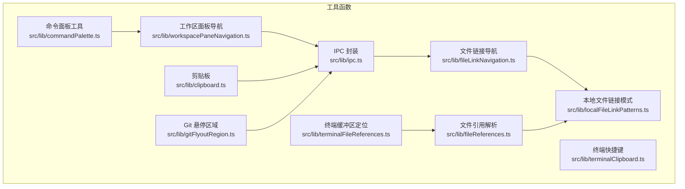
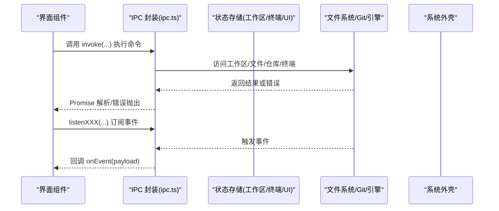
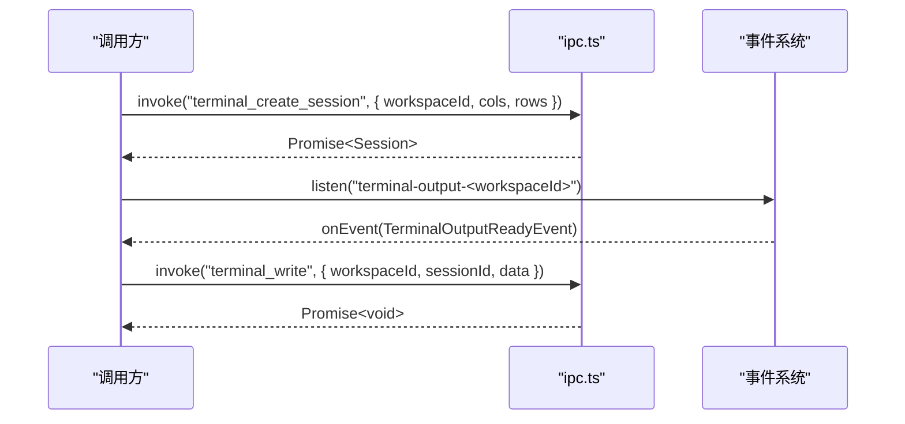
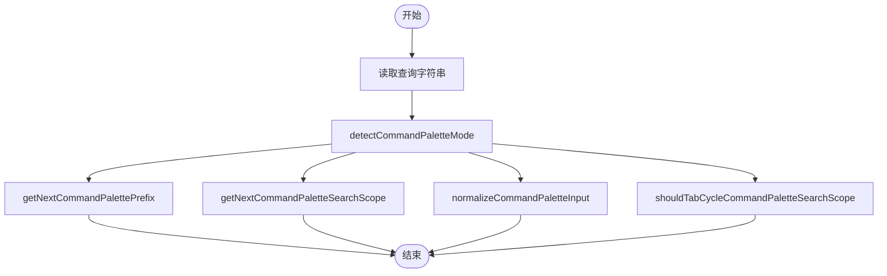
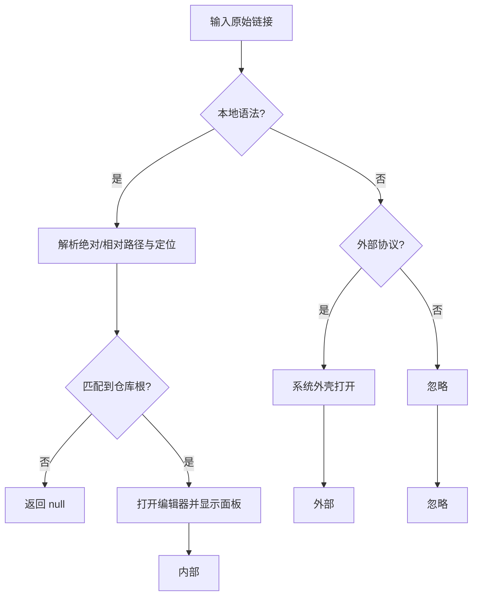
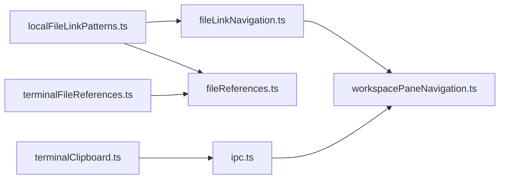

# 工具函数

<cite>
**本文档引用的文件**
- [ipc.ts](file://src/lib/ipc.ts)
- [commandPalette.ts](file://src/lib/commandPalette.ts)
- [clipboard.ts](file://src/lib/clipboard.ts)
- [fileLinkNavigation.ts](file://src/lib/fileLinkNavigation.ts)
- [fileReferences.ts](file://src/lib/fileReferences.ts)
- [gitFlyoutRegion.ts](file://src/lib/gitFlyoutRegion.ts)
- [localFileLinkPatterns.ts](file://src/lib/localFileLinkPatterns.ts)
- [terminalClipboard.ts](file://src/lib/terminalClipboard.ts)
- [terminalFileReferences.ts](file://src/lib/terminalFileReferences.ts)
- [workspacePaneNavigation.ts](file://src/lib/workspacePaneNavigation.ts)
- [commandPalette.test.ts](file://src/lib/commandPalette.test.ts)
- [fileReferences.test.ts](file://src/lib/fileReferences.test.ts)
- [terminalClipboard.test.ts](file://src/lib/terminalClipboard.test.ts)
- [terminalFileReferences.test.ts](file://src/lib/terminalFileReferences.test.ts)
</cite>

## 目录
1. [简介](#简介)
2. [项目结构](#项目结构)
3. [核心组件](#核心组件)
4. [架构总览](#架构总览)
5. [详细组件分析](#详细组件分析)
6. [依赖关系分析](#依赖关系分析)
7. [性能考量](#性能考量)
8. [故障排查指南](#故障排查指南)
9. [结论](#结论)
10. [附录](#附录)

## 简介
本文件系统性梳理 Panes 前端工具函数，覆盖 IPC 通信、命令面板工具、剪贴板操作、文件引用解析、Git 悬停区域等模块。文档逐项说明函数功能、参数、返回值、实现原理、错误处理与边界条件，并给出典型使用场景与组合用法建议，帮助开发者在不深入源码的情况下高效使用与扩展。

## 项目结构
工具函数主要位于 src/lib 下，按职责分层组织：
- 通信与事件：ipc.ts（Tauri IPC 调用封装与事件监听）
- 命令面板：commandPalette.ts（模式检测、前缀循环、搜索范围切换）
- 剪贴板：clipboard.ts（文本复制/粘贴的兼容路径）
- 文件链接导航：fileLinkNavigation.ts（本地/外部链接识别与跳转）
- 文件引用解析：fileReferences.ts（Markdown/纯文本中的文件引用解析与转链）
- 本地文件链接模式：localFileLinkPatterns.ts（本地绝对/相对路径与定位后缀解析）
- 终端快捷键：terminalClipboard.ts（终端复制/粘贴快捷键判定）
- 终端缓冲区定位：terminalFileReferences.ts（偏移到终端坐标映射）
- Git 悬停区域：gitFlyoutRegion.ts（Git 飘窗上下文与焦点管理）
- 工作区面板导航：workspacePaneNavigation.ts（编辑器/聊天/终端布局切换）

**图表来源**
- [ipc.ts:73-648](file://src/lib/ipc.ts#L73-L648)
- [commandPalette.ts:1-99](file://src/lib/commandPalette.ts#L1-L99)
- [clipboard.ts:1-57](file://src/lib/clipboard.ts#L1-L57)
- [fileLinkNavigation.ts:1-242](file://src/lib/fileLinkNavigation.ts#L1-L242)
- [fileReferences.ts:1-508](file://src/lib/fileReferences.ts#L1-L508)
- [localFileLinkPatterns.ts:1-297](file://src/lib/localFileLinkPatterns.ts#L1-L297)
- [terminalClipboard.ts:1-40](file://src/lib/terminalClipboard.ts#L1-L40)
- [terminalFileReferences.ts:1-48](file://src/lib/terminalFileReferences.ts#L1-L48)
- [gitFlyoutRegion.ts:1-42](file://src/lib/gitFlyoutRegion.ts#L1-L42)
- [workspacePaneNavigation.ts:1-139](file://src/lib/workspacePaneNavigation.ts#L1-L139)

**章节来源**
- [ipc.ts:73-648](file://src/lib/ipc.ts#L73-L648)
- [commandPalette.ts:1-99](file://src/lib/commandPalette.ts#L1-L99)
- [clipboard.ts:1-57](file://src/lib/clipboard.ts#L1-L57)
- [fileLinkNavigation.ts:1-242](file://src/lib/fileLinkNavigation.ts#L1-L242)
- [fileReferences.ts:1-508](file://src/lib/fileReferences.ts#L1-L508)
- [localFileLinkPatterns.ts:1-297](file://src/lib/localFileLinkPatterns.ts#L1-L297)
- [terminalClipboard.ts:1-40](file://src/lib/terminalClipboard.ts#L1-L40)
- [terminalFileReferences.ts:1-48](file://src/lib/terminalFileReferences.ts#L1-L48)
- [gitFlyoutRegion.ts:1-42](file://src/lib/gitFlyoutRegion.ts#L1-L42)
- [workspacePaneNavigation.ts:1-139](file://src/lib/workspacePaneNavigation.ts#L1-L139)

## 核心组件
- IPC 通信封装：统一暴露 Tauri invoke 与 listen，涵盖工作区、线程、引擎、Git、终端、依赖安装等能力；提供事件监听器工厂与会话写入辅助。
- 命令面板工具：解析查询前缀与模式，支持搜索范围循环与输入规范化。
- 剪贴板：优先同步 execCommand 复制，回退至 Clipboard API，提供读写异常处理。
- 文件链接导航：识别本地/外部/其他目标，解析定位信息，触发编辑器打开与面板展示。
- 文件引用解析：从 Markdown/纯文本中提取文件引用，生成可点击链接，忽略代码块与现有链接。
- 本地文件链接模式：解析 file://、绝对/相对路径与行/列定位后缀。
- 终端快捷键：严格匹配终端复制/粘贴组合键。
- 终端缓冲区定位：将文本偏移映射为 xterm 坐标范围。
- Git 悬停区域：提供上下文与焦点离开时关闭逻辑。
- 工作区面板导航：控制编辑器/聊天/终端布局切换与聚焦。

**章节来源**
- [ipc.ts:73-648](file://src/lib/ipc.ts#L73-L648)
- [commandPalette.ts:31-99](file://src/lib/commandPalette.ts#L31-L99)
- [clipboard.ts:1-57](file://src/lib/clipboard.ts#L1-L57)
- [fileLinkNavigation.ts:49-242](file://src/lib/fileLinkNavigation.ts#L49-L242)
- [fileReferences.ts:58-508](file://src/lib/fileReferences.ts#L58-L508)
- [localFileLinkPatterns.ts:90-297](file://src/lib/localFileLinkPatterns.ts#L90-L297)
- [terminalClipboard.ts:9-40](file://src/lib/terminalClipboard.ts#L9-L40)
- [terminalFileReferences.ts:11-48](file://src/lib/terminalFileReferences.ts#L11-L48)
- [gitFlyoutRegion.ts:6-42](file://src/lib/gitFlyoutRegion.ts#L6-L42)
- [workspacePaneNavigation.ts:24-139](file://src/lib/workspacePaneNavigation.ts#L24-L139)

## 架构总览
下图展示 IPC 与各工具模块的交互关系，以及事件驱动的数据流。

**图表来源**
- [ipc.ts:73-648](file://src/lib/ipc.ts#L73-L648)
- [workspacePaneNavigation.ts:24-139](file://src/lib/workspacePaneNavigation.ts#L24-L139)

## 详细组件分析

### IPC 通信与事件监听
- 功能概览
  - 应用与系统设置：获取/设置语言、保持唤醒、电源设置、通知与渲染加速开关。
  - 工作区与文件树：列出/打开/归档/删除工作区，目录枚举与分页，文件树检索与搜索。
  - 线程与消息：创建/归档/恢复/删除线程，远程线程挂载，消息发送/推进/取消，消息窗口与块级内容获取。
  - 引擎与技能：列举引擎、健康检查、预热、Codex 技能与应用、OpenCode 运行时目录。
  - Git 操作：状态、diff、分支/提交/stash/remote/worktree 管理，文件增删改、暂存/反暂存、提交、拉取推送等。
  - 终端：会话创建/写入/调整大小/关闭/列表，输出/退出/前台变化/通知事件监听。
  - 依赖与 Harness：依赖检查/安装、Harness 安装与启动。
  - CueLight 集成：代理请求、项目绑定/解绑、查询绑定。
  - 事件监听：线程事件、Git 变化、线程更新、聊天回合完成、引擎运行时更新、菜单动作、终端输出/退出/通知等。
  - 写入辅助：新会话写入命令（等待输出或超时回退）。
- 参数与返回
  - 大多数函数以命名参数对象传入，返回 Promise 包裹的类型化结果；部分事件监听返回取消函数。
- 错误处理与边界
  - invoke 失败时由调用方捕获；事件监听需在不再需要时调用取消函数避免内存泄漏。
- 使用示例
  - 打开工作区：调用 openWorkspace 并处理返回的 Workspace 对象。
  - 监听线程事件：使用 listenThreadEvents 并在回调中更新 UI。
  - 新建终端会话并写入命令：先 terminalCreateSession 获取会话 ID，再 writeCommandToNewSession。
- 性能与限制
  - 分页接口（offset/limit）用于大文件树与日志检索，避免一次性加载过多数据。
  - 事件监听高频触发，注意节流与去抖策略。
  - 终端输出/通知事件可能密集，建议批量处理。

**图表来源**
- [ipc.ts:548-617](file://src/lib/ipc.ts#L548-L617)
- [ipc.ts:709-753](file://src/lib/ipc.ts#L709-L753)

**章节来源**
- [ipc.ts:73-648](file://src/lib/ipc.ts#L73-L648)
- [ipc.ts:770-807](file://src/lib/ipc.ts#L770-L807)

### 命令面板工具
- 功能概览
  - 模式检测：根据前缀判断默认/命令/线程/工作区/文件/搜索/自动模式。
  - 前缀循环：在通用前缀集合间循环切换（包含搜索模式）。
  - 搜索范围循环：在 all/messages/files/threads 之间循环。
  - 输入规范化：确保搜索模式下的输入保留前缀且去除多余空格。
  - Tab 切换：仅当搜索模式且有非空真实词时允许通过 Tab 切换范围。
- 参数与返回
  - detectCommandPaletteMode(query) -> { mode, term }
  - getNextCommandPalettePrefix(prefix) -> nextPrefix
  - getNextCommandPaletteSearchScope(scope) -> nextScope
  - normalizeCommandPaletteInput(rawValue, mode) -> normalized
  - shouldTabCycleCommandPaletteSearchScope(mode, term) -> boolean
- 错误处理与边界
  - 空查询返回默认模式；前缀不在集合内时视为无前缀。
- 使用示例
  - 在输入框变更时调用 detectCommandPaletteMode 更新 UI 模式。
  - 按 Tab 时根据 shouldTabCycle 判断是否切换搜索范围。
- 性能与限制
  - 字符串前缀匹配与数组索引查找，时间复杂度 O(1)。

**图表来源**
- [commandPalette.ts:31-99](file://src/lib/commandPalette.ts#L31-L99)

**章节来源**
- [commandPalette.ts:1-99](file://src/lib/commandPalette.ts#L1-L99)
- [commandPalette.test.ts:10-48](file://src/lib/commandPalette.test.ts#L10-L48)

### 剪贴板操作
- 功能概览
  - 复制：优先尝试同步 execCommand，失败则使用 Clipboard API；均不可用抛出错误。
  - 读取：优先 Clipboard API，否则抛错。
- 参数与返回
  - copyTextToClipboard(text: string): Promise<void>
  - readTextFromClipboard(): Promise<string>
- 错误处理与边界
  - 浏览器/WebView 权限限制导致 API 不可用时抛出错误；需在用户手势期间调用以提升成功率。
- 使用示例
  - 在按钮点击回调中调用 copyTextToClipboard。
- 性能与限制
  - 同步路径避免异步延迟，提高权限成功率；API 不可用时立即失败。

**章节来源**
- [clipboard.ts:1-57](file://src/lib/clipboard.ts#L1-L57)

### 文件链接导航
- 功能概览
  - 目标分类：本地/外部/其他。
  - 文本匹配：基于正则提取潜在链接，过滤非法前缀字符。
  - 本地解析：支持绝对/相对路径与行/列定位，结合仓库根与工作区根排序选择候选根。
  - 导航行为：本地目标打开编辑器并显示工作区面板；外部目标交由系统外壳打开。
- 参数与返回
  - classifyLinkTarget(rawTarget: string): LinkTargetKind
  - extractTextLinkMatches(text: string): TextLinkMatch[]
  - resolveLocalFileLinkTarget(rawTarget, context): ResolvedLocalFileLink | null
  - navigateLinkTarget(rawTarget, options): Promise<"internal"|"external"|"ignored">
- 错误处理与边界
  - 未满足 Shift 键触发条件时忽略；本地目标不在任何仓库根内时返回 null。
- 使用示例
  - 在 Markdown/文本渲染后调用 extractTextLinkMatches 与 navigateLinkTarget。
- 性能与限制
  - 正则匹配与多轮路径规范化，复杂度与文本长度线性相关；候选根排序避免重复计算。

**图表来源**
- [fileLinkNavigation.ts:49-242](file://src/lib/fileLinkNavigation.ts#L49-L242)
- [localFileLinkPatterns.ts:90-297](file://src/lib/localFileLinkPatterns.ts#L90-L297)

**章节来源**
- [fileLinkNavigation.ts:1-242](file://src/lib/fileLinkNavigation.ts#L1-L242)
- [localFileLinkPatterns.ts:1-297](file://src/lib/localFileLinkPatterns.ts#L1-L297)

### 文件引用解析（Markdown/纯文本）
- 功能概览
  - 路径判定：基于特殊文件名集合、扩展名与点号规则判断是否为文件引用。
  - 解析：支持冒号与哈希两种定位后缀（行/列），并处理“行:列”形式。
  - 提取：按词块扫描，剔除标点与非法字符，生成匹配列表。
  - 链接化：在 Markdown 中为纯文本段落生成文件引用链接，跳过代码块与已有链接。
- 参数与返回
  - isLikelyFileReferencePath(rawValue: string): boolean
  - parseFileReference(rawValue: string): ParsedFileReference | null
  - findFileReferenceMatches(text: string): FileReferenceMatch[]
  - linkifyMarkdownFileReferences(markdown: string): string
  - isEditorFileReferenceHref(href: string): boolean
- 错误处理与边界
  - 无效路径或超出范围的行列数被拒绝；代码块与现有链接被保护不被二次转链。
- 使用示例
  - 在消息渲染前对 Markdown 调用 linkifyMarkdownFileReferences。
- 性能与限制
  - 正则与多次扫描，复杂度与文本长度线性相关；代码块与链接保护减少不必要的替换。

**章节来源**
- [fileReferences.ts:1-508](file://src/lib/fileReferences.ts#L1-L508)
- [fileReferences.test.ts:10-85](file://src/lib/fileReferences.test.ts#L10-L85)

### 本地文件链接模式
- 功能概览
  - 支持 file://、绝对路径、Windows 盘符路径与 UNC 路径。
  - 解析行/列定位后缀（:L/C 或 #L/C），并剥离尾随标点。
  - 归一化相对路径，校验文件名与扩展名合法性。
- 参数与返回
  - isLocalFileLinkSyntax(rawTarget: string): boolean
  - parseLocalAbsolutePathTarget(rawTarget): ParsedLocalPathTarget | null
  - parseLocalUrlTarget(rawTarget): ParsedLocalPathTarget | null
  - parseLocalRelativePathTarget(rawTarget): ParsedLocalPathTarget | null
- 错误处理与边界
  - 非本地路径或非法相对路径返回 null；URL 解码失败直接返回 null。
- 使用示例
  - 作为 fileLinkNavigation 的底层解析器，配合仓库根进行最终定位。
- 性能与限制
  - 正则与字符串处理，常量级开销；路径合法性检查避免后续错误。

**章节来源**
- [localFileLinkPatterns.ts:1-297](file://src/lib/localFileLinkPatterns.ts#L1-L297)

### 终端快捷键
- 功能概览
  - 复制：Ctrl+Shift+C（Linux/X11 常用）。
  - 粘贴：Ctrl+Shift+V 或 Shift+Insert。
- 参数与返回
  - isTerminalCopyShortcut(event): boolean
  - isTerminalPasteShortcut(event): boolean
- 错误处理与边界
  - 严格匹配按键组合，其他修饰键组合一律忽略。
- 使用示例
  - 在终端键盘事件处理器中调用判定函数决定是否拦截默认行为。
- 性能与限制
  - 布尔表达式短路求值，O(1) 时间。

**章节来源**
- [terminalClipboard.ts:1-40](file://src/lib/terminalClipboard.ts#L1-L40)
- [terminalClipboard.test.ts:4-64](file://src/lib/terminalClipboard.test.ts#L4-L64)

### 终端缓冲区定位
- 功能概览
  - 将文本偏移映射为 xterm 坐标（含换行包裹），支持闭区间结束偏移。
- 参数与返回
  - offsetToTerminalBufferPosition(startLine, lineLengths, offset): TerminalBufferPosition
  - terminalMatchOffsetsToRange(startLine, lineLengths, startOffset, endOffsetExclusive): TerminalBufferRange
- 错误处理与边界
  - 当偏移超出范围时，定位到末行末列；保证 end 为包含范围。
- 使用示例
  - 结合文件引用解析结果在终端中高亮匹配位置。
- 性能与限制
  - 单次遍历线性扫描，O(n)；适合小到中等行长度数组。

**章节来源**
- [terminalFileReferences.ts:1-48](file://src/lib/terminalFileReferences.ts#L1-L48)
- [terminalFileReferences.test.ts:4-22](file://src/lib/terminalFileReferences.test.ts#L4-L22)

### Git 悬停区域
- 功能概览
  - 提供 Git 飘窗上下文，判断目标是否在指定区域，以及焦点离开时关闭。
- 参数与返回
  - isTargetWithinGitFlyoutRegion(target, roots): boolean
  - closeGitFlyoutIfFocusLeft(context, nextTarget): void
- 错误处理与边界
  - 非 Node/Element 返回 false；closest 查询失败返回 false。
- 使用示例
  - 在鼠标移出/失焦时调用 closeGitFlyoutIfFocusLeft。
- 性能与限制
  - DOM 查询与 contains 检查，O(k)（k 为 roots 数量）。

**章节来源**
- [gitFlyoutRegion.ts:1-42](file://src/lib/gitFlyoutRegion.ts#L1-L42)

### 工作区面板导航
- 功能概览
  - 显示特定表面（编辑器/聊天/终端），在必要时拆分当前标签页。
  - 同步终端布局模式与面板布局模式一致。
  - 循环切换终端布局，或在编辑器与其他模式间切换。
- 参数与返回
  - showWorkspaceSurface(workspaceId, kind, leafId?)
  - showWorkspaceEditorForDirectFileOpen / showWorkspaceEditorForFileLink
  - applyWorkspaceLayoutMode / getWorkspacePaneLayoutMode
  - cycleWorkspaceTerminalLayout / toggleWorkspaceEditorLayout
- 错误处理与边界
  - 若工作区不存在，先确保创建工作区并设定初始模式。
- 使用示例
  - 在文件链接导航成功后调用 showWorkspaceEditorForFileLink。
- 性能与限制
  - 状态树读取与少量 DOM/布局操作，O(1)。

**章节来源**
- [workspacePaneNavigation.ts:1-139](file://src/lib/workspacePaneNavigation.ts#L1-L139)

## 依赖关系分析
- 模块耦合
  - fileLinkNavigation 依赖 localFileLinkPatterns 与 workspacePaneNavigation。
  - fileReferences 依赖 localFileLinkPatterns 与 fileLinkNavigation 的解析结果。
  - workspacePaneNavigation 依赖状态存储与 UI 控件，间接与 IPC 交互。
  - 终端相关工具独立，但与 IPC 的事件监听紧密配合。
- 外部依赖
  - @tauri-apps/api（invoke/listen）、系统外壳插件、浏览器 Clipboard API。
- 循环依赖
  - 未发现直接循环；事件监听通过字符串通道解耦。

**图表来源**
- [fileLinkNavigation.ts:1-242](file://src/lib/fileLinkNavigation.ts#L1-L242)
- [fileReferences.ts:1-508](file://src/lib/fileReferences.ts#L1-L508)
- [localFileLinkPatterns.ts:1-297](file://src/lib/localFileLinkPatterns.ts#L1-L297)
- [workspacePaneNavigation.ts:1-139](file://src/lib/workspacePaneNavigation.ts#L1-L139)
- [ipc.ts:73-648](file://src/lib/ipc.ts#L73-L648)
- [terminalClipboard.ts:1-40](file://src/lib/terminalClipboard.ts#L1-L40)
- [terminalFileReferences.ts:1-48](file://src/lib/terminalFileReferences.ts#L1-L48)

## 性能考量
- 分页与增量：大量数据接口（文件树、消息窗口、Git 列表）采用 offset/limit，避免一次性加载。
- 事件节流：终端输出/通知事件频繁，建议在消费侧做节流/去抖。
- 字符串处理：文件引用解析与链接化涉及正则与多次扫描，建议对长文本分段处理。
- DOM 查询：Git 飘窗区域判断与工作区面板定位为 O(k)，k 较小时可接受。
- 同步复制：优先同步 execCommand，降低权限失败概率与延迟。

## 故障排查指南
- 剪贴板不可用
  - 现象：复制/读取抛出错误。
  - 排查：确认浏览器/WebView 权限；在用户手势期间调用；检查平台差异。
  - 参考
    - [clipboard.ts:1-57](file://src/lib/clipboard.ts#L1-L57)
- 无法解析本地文件链接
  - 现象：navigateLinkTarget 返回 ignored。
  - 排查：确认 Shift 键触发；检查链接是否符合本地语法；核对仓库根与工作区根配置。
  - 参考
    - [fileLinkNavigation.ts:193-242](file://src/lib/fileLinkNavigation.ts#L193-L242)
    - [localFileLinkPatterns.ts:290-297](file://src/lib/localFileLinkPatterns.ts#L290-L297)
- 终端复制/粘贴无效
  - 现象：Ctrl+Shift+C/V 或 Shift+Insert 未生效。
  - 排查：确认按键组合完全匹配；检查事件是否被上层组件拦截。
  - 参考
    - [terminalClipboard.ts:9-40](file://src/lib/terminalClipboard.ts#L9-L40)
- 终端坐标映射异常
  - 现象：高亮范围与文本不一致。
  - 排查：确认行长度数组与起始行一致；结束偏移应为排他，内部已转换为包含。
  - 参考
    - [terminalFileReferences.ts:36-48](file://src/lib/terminalFileReferences.ts#L36-L48)
- 命令面板搜索范围不循环
  - 现象：按 Tab 无响应。
  - 排查：确认当前模式为 search 且存在非空真实词。
  - 参考
    - [commandPalette.ts:93-99](file://src/lib/commandPalette.ts#L93-L99)

**章节来源**
- [clipboard.ts:1-57](file://src/lib/clipboard.ts#L1-L57)
- [fileLinkNavigation.ts:193-242](file://src/lib/fileLinkNavigation.ts#L193-L242)
- [localFileLinkPatterns.ts:290-297](file://src/lib/localFileLinkPatterns.ts#L290-L297)
- [terminalClipboard.ts:9-40](file://src/lib/terminalClipboard.ts#L9-L40)
- [terminalFileReferences.ts:36-48](file://src/lib/terminalFileReferences.ts#L36-L48)
- [commandPalette.ts:93-99](file://src/lib/commandPalette.ts#L93-L99)

## 结论
上述工具函数围绕 IPC、命令面板、剪贴板、文件链接与引用、终端交互、Git 飘窗与工作区面板导航构建了完整的前端工具链。它们在易用性、健壮性与性能之间取得平衡：通过分页与事件节流控制资源消耗，通过严格的输入判定与错误处理保障稳定性，通过清晰的模块边界便于组合与扩展。

## 附录
- 组合使用建议
  - 文本渲染：先用 linkifyMarkdownFileReferences，再用 fileLinkNavigation 的导航逻辑。
  - 终端高亮：结合 fileReferences 的匹配结果与 terminalFileReferences 的坐标映射。
  - 快捷键：在终端组件中使用 terminalClipboard 的判定函数拦截默认行为。
  - 布局联动：在导航后调用 workspacePaneNavigation 同步面板与终端布局。
- 最佳实践
  - 在用户手势期间执行剪贴板操作。
  - 对高频事件进行节流/去抖。
  - 对长文本分段处理文件引用解析。
  - 事件监听完成后及时取消，防止内存泄漏。