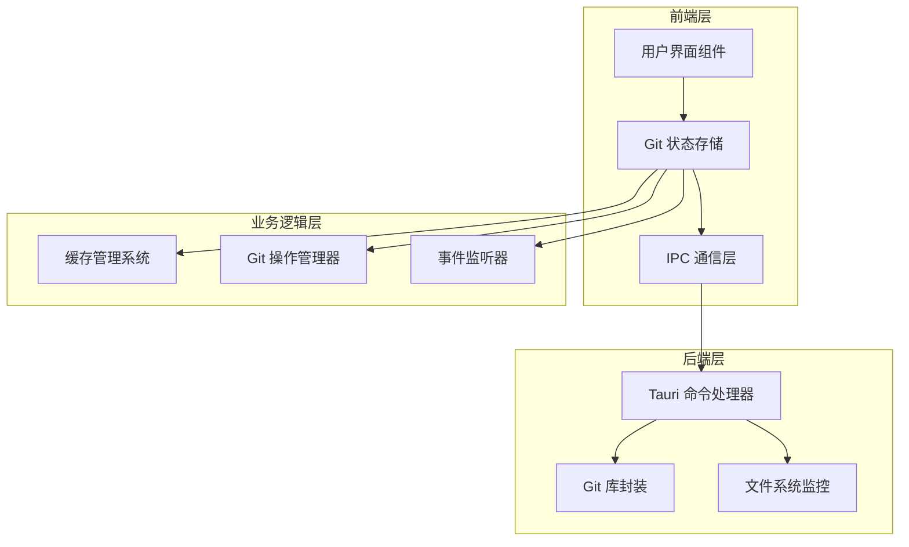
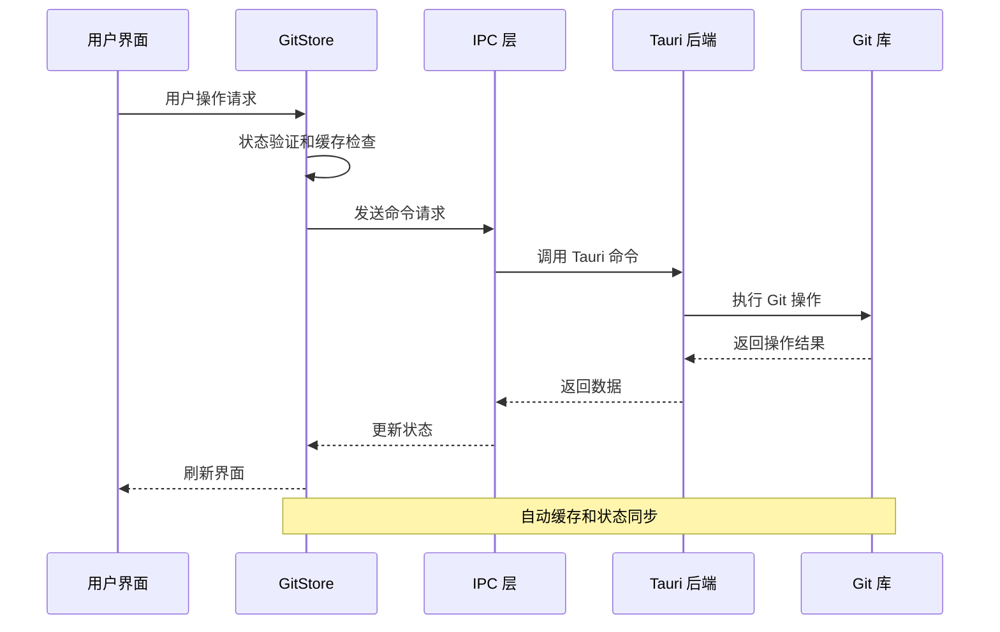
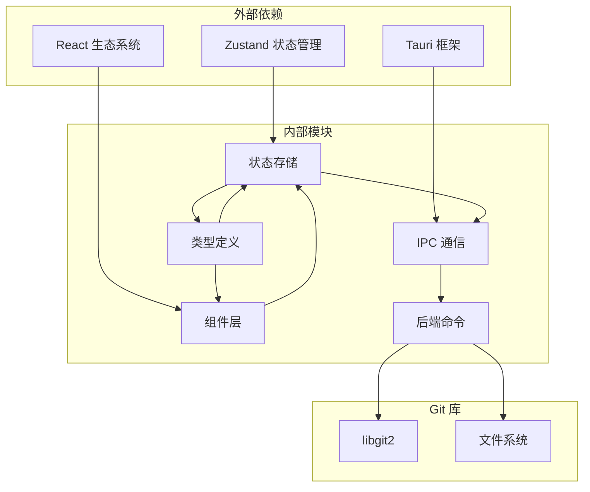

# Git 状态存储 API

<cite>
**本文档引用的文件**
- [gitStore.ts](file://src/stores/gitStore.ts)
- [gitStore.test.ts](file://src/stores/gitStore.test.ts)
- [types.ts](file://src/types.ts)
- [git.rs](file://src-tauri/src/commands/git.rs)
- [mod.rs](file://src-tauri/src/git/mod.rs)
- [GitPanel.tsx](file://src/components/git/GitPanel.tsx)
- [GitChangesView.tsx](file://src/components/git/GitChangesView.tsx)
- [GitBranchesView.tsx](file://src/components/git/GitBranchesView.tsx)
- [ipc.ts](file://src/lib/ipc.ts)
</cite>

## 目录
1. [简介](#简介)
2. [项目结构](#项目结构)
3. [核心组件](#核心组件)
4. [架构概览](#架构概览)
5. [详细组件分析](#详细组件分析)
6. [依赖关系分析](#依赖关系分析)
7. [性能考虑](#性能考虑)
8. [故障排除指南](#故障排除指南)
9. [结论](#结论)

## 简介

Git 状态存储 API 是 Panes 应用程序中用于管理 Git 仓库状态的核心模块。该 API 提供了完整的 Git 操作接口，包括仓库初始化、分支管理、提交历史查看、差异比较和状态跟踪等功能。通过使用 Zustand 状态管理库和 Tauri IPC 通信机制，该系统实现了高性能的 Git 操作体验。

该 API 的设计重点在于：
- 实时状态同步和缓存管理
- 异步 Git 操作的并发控制
- 用户界面与 Git 操作的无缝集成
- 大型仓库的性能优化策略
- 错误处理和网络异常恢复

## 项目结构

Git 状态存储 API 的整体架构采用分层设计，主要包含以下层次：

**图表来源**
- [gitStore.ts:1-1132](file://src/stores/gitStore.ts#L1-L1132)
- [git.rs:1-559](file://src-tauri/src/commands/git.rs#L1-L559)

**章节来源**
- [gitStore.ts:1-1132](file://src/stores/gitStore.ts#L1-L1132)
- [types.ts:1-1304](file://src/types.ts#L1-L1304)

## 核心组件

### Git 状态存储 (GitStore)

GitStore 是整个 Git 状态管理的核心，基于 Zustand 构建，提供了完整的 Git 操作接口。其主要特性包括：

#### 状态结构
- **基础状态**: 仓库路径、分支信息、文件状态等
- **UI 状态**: 当前视图、加载状态、错误信息等
- **操作状态**: 远程同步状态、批量操作状态等
- **缓存状态**: Git 状态缓存、差异缓存等

#### 缓存机制
系统实现了多级缓存策略：
- **内存缓存**: LRU 缓存算法，支持按大小和时间的双重限制
- **持久化缓存**: 使用 localStorage 存储草稿和历史记录
- **请求去重**: 避免重复的 Git 操作请求

#### 并发控制
- **操作序列化**: 确保 Git 操作按照正确的顺序执行
- **请求去重**: 防止同一操作的重复执行
- **状态一致性**: 维护 Git 状态在异步操作中的完整性

**章节来源**
- [gitStore.ts:351-430](file://src/stores/gitStore.ts#L351-L430)
- [gitStore.ts:183-195](file://src/stores/gitStore.ts#L183-L195)

### 类型定义系统

系统使用 TypeScript 定义了完整的 Git 数据模型：

#### 核心数据类型
- **GitStatus**: 表示仓库的当前状态，包括分支信息和文件变更
- **GitDiffPreview**: 差异预览数据结构
- **GitBranch**: 分支信息模型
- **GitCommit**: 提交记录模型
- **GitWorktree**: 工作树配置

#### 接口契约
每个 Git 操作都定义了明确的输入输出接口，确保前后端数据传输的一致性。

**章节来源**
- [types.ts:737-832](file://src/types.ts#L737-L832)

## 架构概览

Git 状态存储 API 采用客户端-服务器架构，结合前端状态管理和后端 Git 操作：

**图表来源**
- [gitStore.ts:522-620](file://src/stores/gitStore.ts#L522-L620)
- [git.rs:15-23](file://src-tauri/src/commands/git.rs#L15-L23)

## 详细组件分析

### Git 面板组件 (GitPanel)

GitPanel 是用户交互的主要入口，提供了完整的 Git 操作界面：

#### 功能特性
- **多视图支持**: 支持 Changes、Branches、Commits、Stash、Worktrees 视图
- **实时监控**: 通过文件系统监控自动刷新 Git 状态
- **批量操作**: 支持多仓库同步和批量 Git 操作
- **工作树管理**: 完整的工作树创建、删除和切换功能

#### 状态管理
面板组件与 GitStore 深度集成，实现了：
- 自动状态同步和刷新
- 错误状态的统一处理
- 用户操作的反馈机制

**章节来源**
- [GitPanel.tsx:48-522](file://src/components/git/GitPanel.tsx#L48-L522)

### 变更视图组件 (GitChangesView)

GitChangesView 专门负责显示和管理文件变更：

#### 核心功能
- **文件树展示**: 展示工作区和暂存区的文件变更
- **差异查看**: 支持文件级别的差异比较
- **批量操作**: 支持文件的暂存、取消暂存和丢弃操作
- **提交管理**: 提交消息的编辑和历史记录

#### 性能优化
- **虚拟化渲染**: 大文件列表的虚拟化处理
- **增量更新**: 只更新发生变化的部分
- **缓存策略**: 差异内容的智能缓存

**章节来源**
- [GitChangesView.tsx:104-752](file://src/components/git/GitChangesView.tsx#L104-L752)

### 分支视图组件 (GitBranchesView)

GitBranchesView 提供了完整的分支管理功能：

#### 主要特性
- **分支列表**: 显示本地和远程分支
- **分支操作**: 创建、切换、重命名、删除分支
- **搜索过滤**: 支持分支名称的搜索和过滤
- **历史记录**: 记住最近使用的分支名称

#### 用户体验
- **快捷操作**: 右键菜单提供快速分支操作
- **确认机制**: 危险操作的二次确认
- **状态指示**: 显示分支的同步状态和统计信息

**章节来源**
- [GitBranchesView.tsx:29-635](file://src/components/git/GitBranchesView.tsx#L29-L635)

### IPC 通信层

IPC 层是前端与后端通信的桥梁，提供了完整的 Git 操作接口：

#### 命令分类
- **状态查询**: 获取 Git 状态、分支列表、提交历史等
- **文件操作**: 暂存、取消暂存、丢弃文件等
- **版本控制**: 提交、重置、远程同步等
- **工作树管理**: 创建、删除、切换工作树

#### 错误处理
- **统一错误格式**: 所有操作返回一致的错误格式
- **网络异常处理**: 自动重试和降级策略
- **超时管理**: 长时间操作的超时处理

**章节来源**
- [ipc.ts:426-547](file://src/lib/ipc.ts#L426-L547)

### 后端命令处理器

后端使用 Tauri 命令系统处理所有 Git 操作：

#### 命令实现
- **线程安全**: 所有 Git 操作在独立线程中执行
- **错误隔离**: 防止单个操作影响其他操作
- **资源管理**: 正确的资源分配和释放

#### 性能优化
- **任务调度**: 智能的任务调度和优先级管理
- **并发控制**: 合理的并发数量限制
- **内存管理**: 避免内存泄漏和过度占用

**章节来源**
- [git.rs:15-559](file://src-tauri/src/commands/git.rs#L15-L559)

## 依赖关系分析

Git 状态存储 API 的依赖关系呈现清晰的分层结构：

**图表来源**
- [gitStore.ts:1-14](file://src/stores/gitStore.ts#L1-L14)
- [git.rs:1-13](file://src-tauri/src/commands/git.rs#L1-L13)

### 关键依赖关系

#### 前端依赖
- **Zustand**: 提供轻量级的状态管理
- **React**: 组件化用户界面
- **Tauri**: 跨平台桌面应用框架

#### 后端依赖
- **libgit2**: 高性能的 Git 库
- **Tokio**: 异步运行时环境
- **Rust 标准库**: 系统级编程支持

**章节来源**
- [gitStore.ts:1-14](file://src/stores/gitStore.ts#L1-L14)
- [git.rs:1-13](file://src-tauri/src/commands/git.rs#L1-L13)

## 性能考虑

### 缓存策略

系统实现了多层次的缓存机制来优化性能：

#### 内存缓存
- **Git 状态缓存**: 默认缓存 1 秒，支持最多 32 个条目
- **差异缓存**: 默认缓存 1.2 秒，支持最多 320 个条目
- **字节计数**: 严格控制缓存大小不超过 3MB（状态）和 24MB（差异）

#### 缓存淘汰
- **LRU 算法**: 基于最后使用时间的淘汰策略
- **大小限制**: 当缓存超过大小限制时自动清理
- **时间限制**: 超过 TTL 的缓存自动失效

#### 请求去重
- **并发控制**: 防止同一操作的重复执行
- **序列号管理**: 确保操作的正确顺序
- **状态同步**: 维护 Git 状态在异步操作中的完整性

### 性能监控

系统内置了性能指标收集机制：

#### 监控指标
- **刷新时间**: Git 状态刷新的耗时统计
- **文件差异**: 差异计算的性能指标
- **操作成功率**: 各类 Git 操作的成功率统计

#### 优化建议
- **批量操作**: 对于大量文件的操作，使用批量处理
- **懒加载**: 对于大型仓库，采用分页加载策略
- **智能缓存**: 根据使用模式调整缓存策略

**章节来源**
- [gitStore.ts:15-24](file://src/stores/gitStore.ts#L15-L24)
- [gitStore.ts:139-181](file://src/stores/gitStore.ts#L139-L181)

### 大型仓库处理

针对大型仓库的特殊优化：

#### 分页加载
- **分支列表**: 默认每页 200 个分支
- **提交历史**: 默认每页 100 条提交记录
- **文件树**: 默认每页 2000 个项目

#### 智能刷新
- **视图感知**: 不同视图采用不同的刷新策略
- **增量更新**: 只更新发生变化的部分
- **后台刷新**: 在后台自动刷新不干扰用户操作

**章节来源**
- [gitStore.ts:15-16](file://src/stores/gitStore.ts#L15-L16)
- [gitStore.ts:432-474](file://src/stores/gitStore.ts#L432-L474)

## 故障排除指南

### 常见问题及解决方案

#### Git 操作失败
**症状**: Git 操作返回错误或界面无响应
**解决方案**:
1. 检查网络连接和远程仓库可达性
2. 验证 Git 配置和权限设置
3. 查看错误日志获取详细信息

#### 状态不同步
**症状**: 界面显示的 Git 状态与实际不符
**解决方案**:
1. 手动触发刷新操作
2. 检查文件系统监控是否正常工作
3. 清除缓存后重新加载

#### 性能问题
**症状**: 操作响应缓慢或界面卡顿
**解决方案**:
1. 检查缓存配置和大小限制
2. 优化 Git 配置和索引
3. 考虑使用更高效的 Git 操作

### 错误处理机制

系统提供了完善的错误处理机制：

#### 错误分类
- **网络错误**: 网络连接失败或超时
- **权限错误**: 文件访问权限不足
- **Git 错误**: Git 操作失败或冲突
- **系统错误**: 操作系统层面的问题

#### 恢复策略
- **自动重试**: 对于临时性错误进行自动重试
- **降级处理**: 在错误情况下提供基本功能
- **用户提示**: 清晰的错误信息和解决建议

**章节来源**
- [gitStore.ts:611-620](file://src/stores/gitStore.ts#L611-L620)
- [gitStore.test.ts:138-156](file://src/stores/gitStore.test.ts#L138-L156)

### 调试工具

#### 开发者工具
- **状态检查**: 查看当前 Git 状态和缓存信息
- **操作日志**: 记录所有 Git 操作的详细信息
- **性能分析**: 监控操作性能和资源使用情况

#### 用户诊断
- **健康检查**: 自动检测常见问题
- **修复建议**: 提供针对性的解决方案
- **日志导出**: 支持问题报告和调试

**章节来源**
- [gitStore.ts:1095-1130](file://src/stores/gitStore.ts#L1095-L1130)

## 结论

Git 状态存储 API 提供了一个完整、高效且用户友好的 Git 操作解决方案。通过精心设计的架构和优化策略，该系统能够处理各种规模的 Git 仓库，同时保持良好的性能和用户体验。

### 主要优势
- **高性能**: 多级缓存和智能刷新机制
- **可靠性**: 完善的错误处理和恢复策略
- **可扩展性**: 模块化的架构设计
- **易用性**: 直观的用户界面和操作流程

### 技术特色
- **实时同步**: 基于文件系统监控的实时状态更新
- **智能缓存**: 基于使用模式的自适应缓存策略
- **并发控制**: 完善的并发操作管理和状态一致性保证
- **性能监控**: 内置的性能指标收集和分析能力

该 API 为开发者和用户提供了一个强大而可靠的 Git 操作平台，适用于从个人开发到团队协作的各种场景。