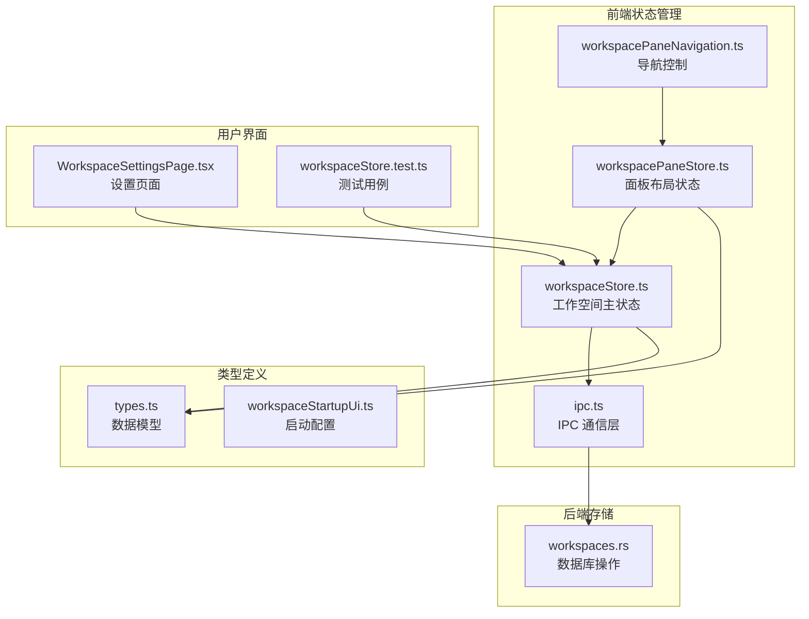
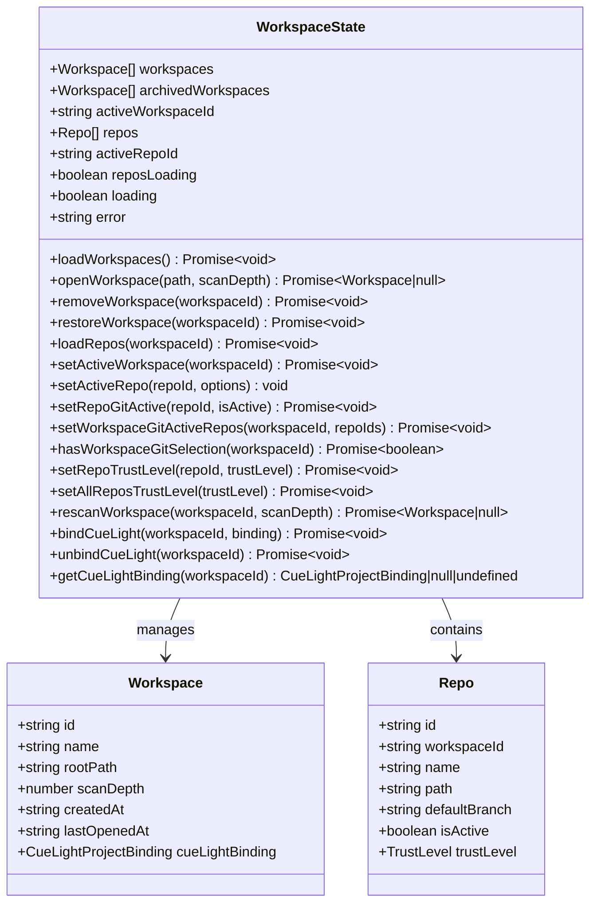
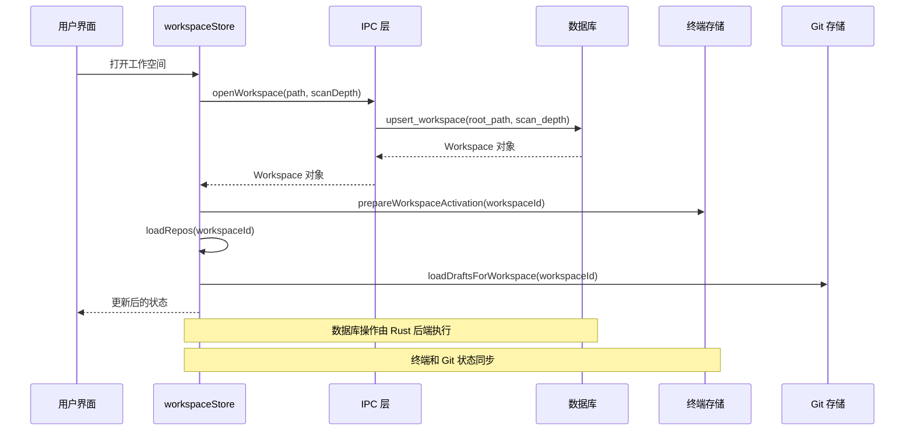
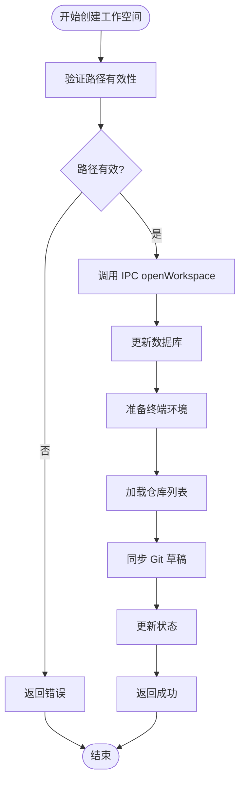
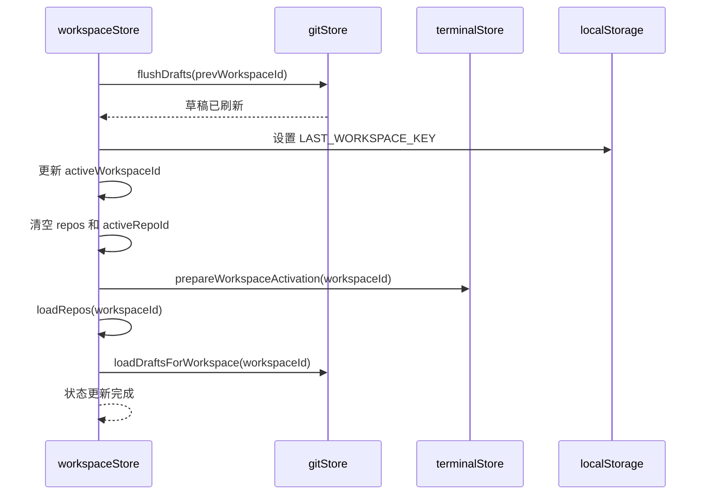
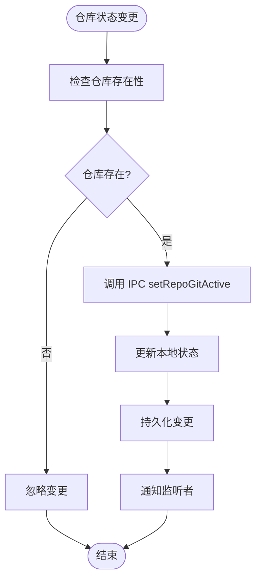
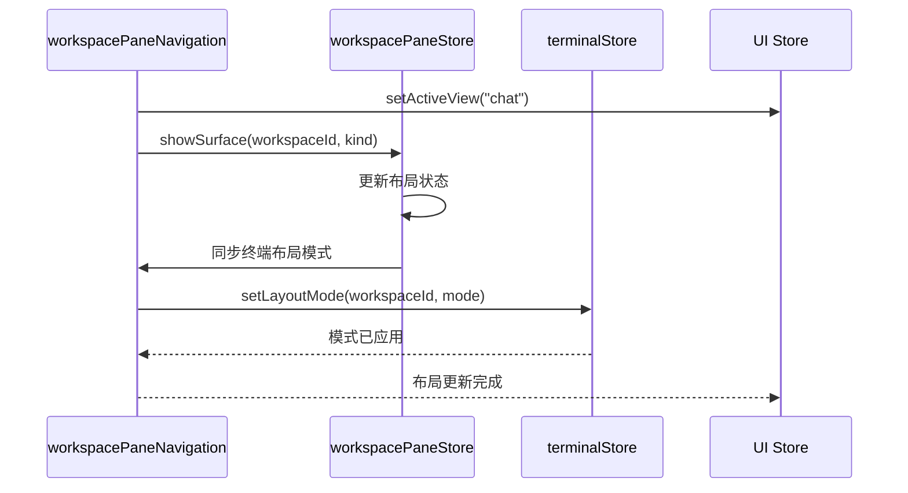
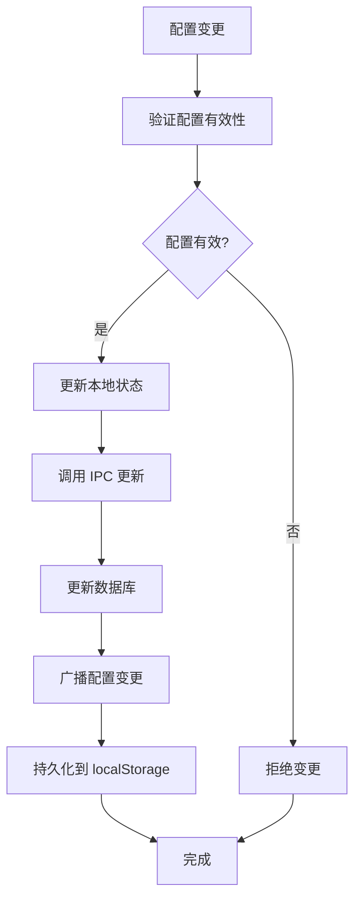
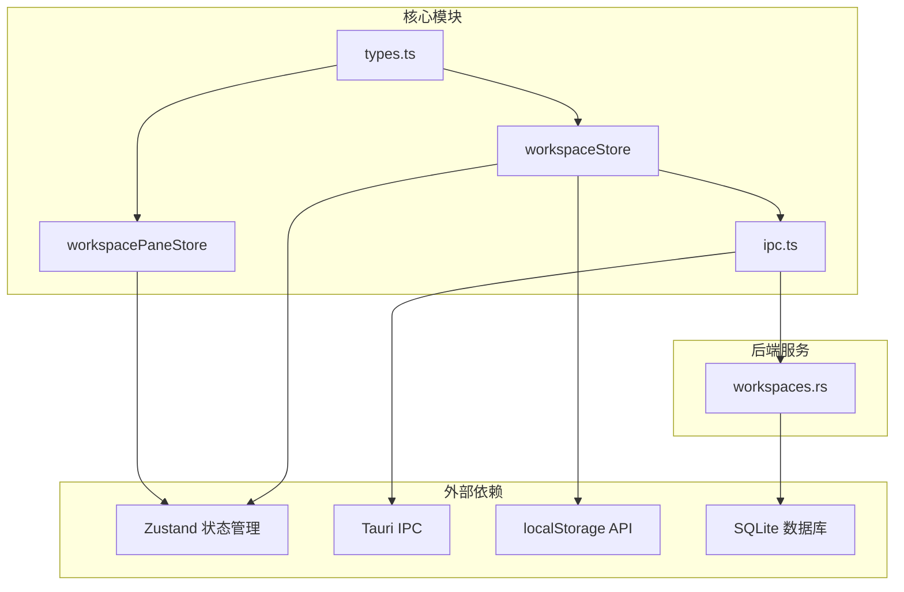
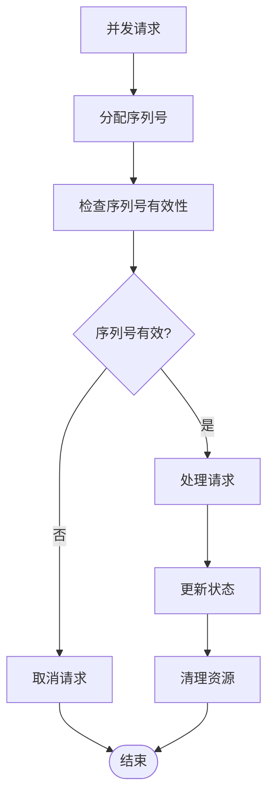

# 工作空间状态存储 API

<cite>
**本文档引用的文件**
- [workspaceStore.ts](file://src/stores/workspaceStore.ts)
- [workspaceStore.test.ts](file://src/stores/workspaceStore.test.ts)
- [workspacePaneStore.ts](file://src/stores/workspacePaneStore.ts)
- [workspacePaneNavigation.ts](file://src/lib/workspacePaneNavigation.ts)
- [workspaceStartupUi.ts](file://src/lib/workspaceStartupUi.ts)
- [types.ts](file://src/types.ts)
- [ipc.ts](file://src/lib/ipc.ts)
- [workspaces.rs](file://src-tauri/src/db/workspaces.rs)
- [WorkspaceSettingsPage.tsx](file://src/components/workspace/WorkspaceSettingsPage.tsx)
</cite>

## 目录
1. [简介](#简介)
2. [项目结构](#项目结构)
3. [核心组件](#核心组件)
4. [架构概览](#架构概览)
5. [详细组件分析](#详细组件分析)
6. [依赖关系分析](#依赖关系分析)
7. [性能考虑](#性能考虑)
8. [故障排除指南](#故障排除指南)
9. [结论](#结论)
10. [附录](#附录)

## 简介

工作空间状态存储 API 是 Panes 应用程序中用于管理多工作空间状态的核心系统。该 API 提供了完整的工作空间生命周期管理，包括创建、切换、配置和设置管理功能。系统支持多工作空间并发管理，具备状态持久化和配置同步机制，能够处理复杂的 Git 仓库选择和信任级别管理。

该系统采用 Zustand 状态管理库构建，结合 Tauri IPC 通信机制，实现了前后端分离的状态管理模式。通过本地存储（localStorage）和数据库（SQLite）的双重持久化策略，确保用户工作空间数据的安全性和可靠性。

## 项目结构

工作空间状态存储系统在项目中的组织结构如下：



**图表来源**
- [workspaceStore.ts:1-455](file://src/stores/workspaceStore.ts#L1-L455)
- [workspacePaneStore.ts:1-696](file://src/stores/workspacePaneStore.ts#L1-L696)
- [ipc.ts:1-813](file://src/lib/ipc.ts#L1-L813)

**章节来源**
- [workspaceStore.ts:1-455](file://src/stores/workspaceStore.ts#L1-L455)
- [workspacePaneStore.ts:1-696](file://src/stores/workspacePaneStore.ts#L1-L696)
- [types.ts:1-200](file://src/types.ts#L1-L200)

## 核心组件

### 工作空间状态模型

工作空间状态存储 API 定义了完整的状态结构，包括以下关键属性：



**图表来源**
- [workspaceStore.ts:11-40](file://src/stores/workspaceStore.ts#L11-L40)
- [types.ts:3-87](file://src/types.ts#L3-L87)

### 数据持久化机制

系统采用多层次的数据持久化策略：

1. **工作空间持久化**：使用 localStorage 存储最后激活的工作空间 ID
2. **仓库选择持久化**：记录每个工作空间最后激活的仓库
3. **面板布局持久化**：独立的 workspacePaneStore 负责面板布局状态
4. **数据库持久化**：Tauri 后端使用 SQLite 存储工作空间元数据

**章节来源**
- [workspaceStore.ts:42-108](file://src/stores/workspaceStore.ts#L42-L108)
- [workspacePaneStore.ts:70-410](file://src/stores/workspacePaneStore.ts#L70-L410)

## 架构概览

工作空间状态存储 API 采用了分层架构设计，确保各组件职责清晰且松耦合：



**图表来源**
- [workspaceStore.ts:173-192](file://src/stores/workspaceStore.ts#L173-L192)
- [ipc.ts:104-108](file://src/lib/ipc.ts#L104-L108)
- [workspaces.rs:16-59](file://src-tauri/src/db/workspaces.rs#L16-L59)

## 详细组件分析

### 工作空间生命周期管理

工作空间生命周期管理是整个系统的核心功能，涵盖了从创建到删除的完整流程：

#### 工作空间创建流程



**图表来源**
- [workspaceStore.ts:173-192](file://src/stores/workspaceStore.ts#L173-L192)
- [ipc.ts:104-108](file://src/lib/ipc.ts#L104-L108)

#### 工作空间切换机制

工作空间切换涉及多个状态的同步更新：



**图表来源**
- [workspaceStore.ts:293-303](file://src/stores/workspaceStore.ts#L293-L303)

**章节来源**
- [workspaceStore.ts:148-164](file://src/stores/workspaceStore.ts#L148-L164)
- [workspaceStore.ts:293-303](file://src/stores/workspaceStore.ts#L293-L303)

### Git 仓库管理

系统提供了完整的 Git 仓库管理功能，包括仓库激活状态控制和信任级别管理：

#### 仓库激活状态管理



**图表来源**
- [workspaceStore.ts:325-342](file://src/stores/workspaceStore.ts#L325-L342)

#### 信任级别管理

系统支持三种信任级别：trusted、standard、restricted，用于控制对不同仓库的操作权限：

**章节来源**
- [workspaceStore.ts:368-384](file://src/stores/workspaceStore.ts#L368-L384)
- [types.ts:1-1](file://src/types.ts#L1-L1)

### 面板布局管理

工作空间面板布局管理通过独立的 store 实现，支持复杂的多面板布局：

#### 布局模式同步



**图表来源**
- [workspacePaneNavigation.ts:24-36](file://src/lib/workspacePaneNavigation.ts#L24-L36)
- [workspacePaneStore.ts:568-586](file://src/stores/workspacePaneStore.ts#L568-L586)

**章节来源**
- [workspacePaneStore.ts:488-696](file://src/stores/workspacePaneStore.ts#L488-L696)
- [workspacePaneNavigation.ts:12-22](file://src/lib/workspacePaneNavigation.ts#L12-L22)

### 配置同步机制

系统实现了工作空间配置的双向同步机制：

#### 配置持久化流程



**图表来源**
- [workspaceStore.ts:434-453](file://src/stores/workspaceStore.ts#L434-L453)

**章节来源**
- [workspaceStore.ts:434-453](file://src/stores/workspaceStore.ts#L434-L453)
- [ipc.ts:638-645](file://src/lib/ipc.ts#L638-L645)

## 依赖关系分析

工作空间状态存储 API 的依赖关系呈现清晰的分层结构：



**图表来源**
- [workspaceStore.ts:1-6](file://src/stores/workspaceStore.ts#L1-L6)
- [ipc.ts:1-71](file://src/lib/ipc.ts#L1-L71)

**章节来源**
- [workspaceStore.ts:1-6](file://src/stores/workspaceStore.ts#L1-L6)
- [ipc.ts:1-71](file://src/lib/ipc.ts#L1-L71)

## 性能考虑

### 内存管理优化

系统采用了多项内存管理优化策略：

1. **状态分片**：将工作空间状态与面板布局状态分离，避免不必要的状态更新
2. **请求序列号**：使用 `reposLoadSeq` 防止竞态条件和重复请求
3. **懒加载机制**：仅在需要时加载仓库信息和面板布局
4. **缓存策略**：利用 localStorage 缓存常用配置和用户偏好

### 并发处理

系统通过以下机制处理并发操作：



**图表来源**
- [workspaceStore.ts:257-292](file://src/stores/workspaceStore.ts#L257-L292)

### 状态恢复机制

系统实现了完善的状态恢复机制：

1. **启动时自动恢复**：应用启动时自动加载上次激活的工作空间
2. **异常恢复**：在网络或数据库异常时提供降级状态
3. **版本兼容**：支持跨版本的状态迁移和兼容性处理

**章节来源**
- [workspaceStore.ts:148-164](file://src/stores/workspaceStore.ts#L148-L164)
- [workspaceStore.ts:257-292](file://src/stores/workspaceStore.ts#L257-L292)

## 故障排除指南

### 常见问题诊断

#### 工作空间无法加载

可能的原因和解决方案：

1. **数据库连接失败**
   - 检查 SQLite 数据库文件权限
   - 验证数据库文件完整性
   
2. **路径解析错误**
   - 确认工作空间根路径的有效性
   - 检查路径规范化处理

#### 仓库加载超时

1. **网络延迟**：增加超时时间配置
2. **磁盘 I/O 瓶颈**：优化扫描深度设置
3. **权限问题**：检查文件系统访问权限

### 调试工具

系统提供了多种调试工具：

1. **状态监控**：实时查看工作空间状态变化
2. **IPC 日志**：跟踪前后端通信过程
3. **错误追踪**：定位具体的错误发生位置

**章节来源**
- [workspaceStore.test.ts:1-310](file://src/stores/workspaceStore.test.ts#L1-L310)

## 结论

工作空间状态存储 API 是一个设计精良、功能完整的多工作空间管理系统。通过合理的架构设计和优化策略，该系统能够：

1. **提供完整的生命周期管理**：从创建到删除的全链路支持
2. **支持多工作空间并发**：高效的内存管理和状态隔离
3. **实现可靠的持久化**：多层次的数据持久化策略
4. **具备良好的扩展性**：清晰的接口设计便于功能扩展

该系统的成功在于其分层架构设计、完善的错误处理机制以及优化的性能策略。通过 IPC 通信和数据库持久化的结合，为用户提供了稳定可靠的工作空间管理体验。

## 附录

### API 使用示例

#### 创建新工作空间
```typescript
// 基本工作空间创建
const workspace = await workspaceStore.getState().openWorkspace('/path/to/workspace');

// 带扫描深度的工作空间创建
const workspace = await workspaceStore.getState().openWorkspace('/path/to/workspace', 5);
```

#### 切换工作空间
```typescript
// 切换到指定工作空间
await workspaceStore.getState().setActiveWorkspace('workspace-id');
```

#### 管理仓库
```typescript
// 设置仓库信任级别
await workspaceStore.getState().setRepoTrustLevel('repo-id', 'trusted');

// 批量设置信任级别
await workspaceStore.getState().setAllReposTrustLevel('standard');
```

### 配置选项

#### 工作空间扫描深度
- 最小值：0（禁用扫描）
- 默认值：3
- 最大值：12（完全扫描）

#### 信任级别
- `trusted`：完全信任，无限制访问
- `standard`：标准信任，有限制访问
- `restricted`：受限信任，严格限制访问