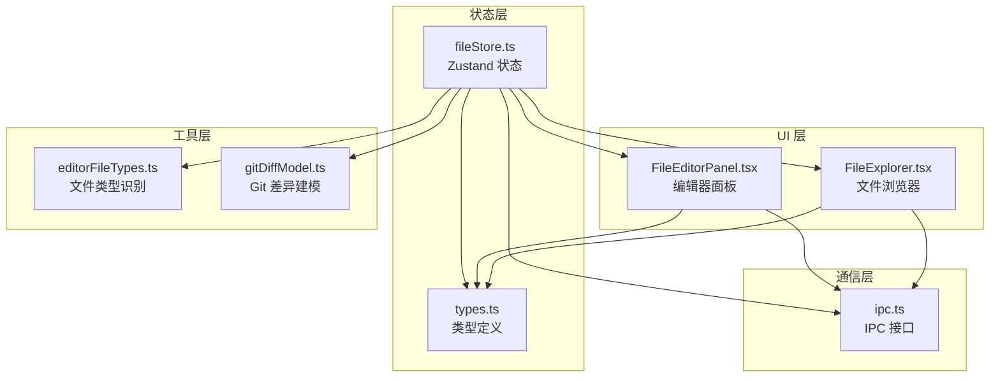
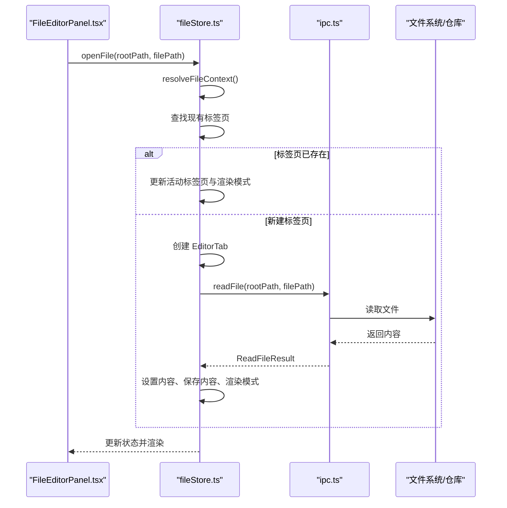
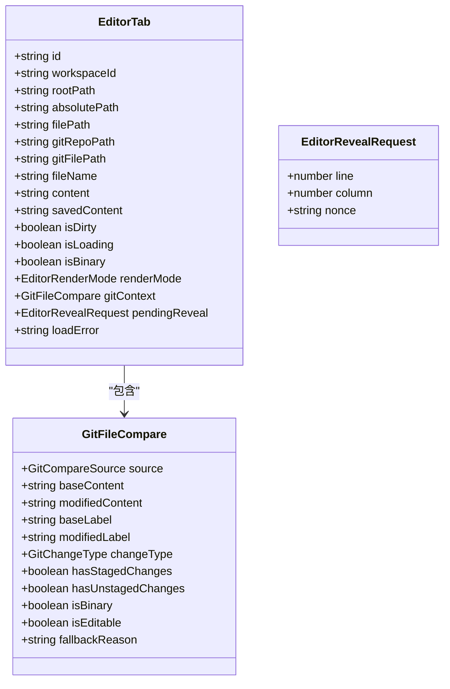
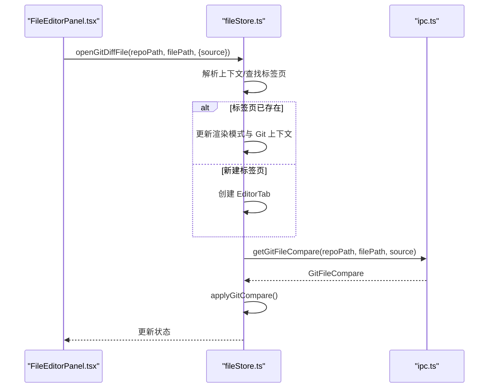
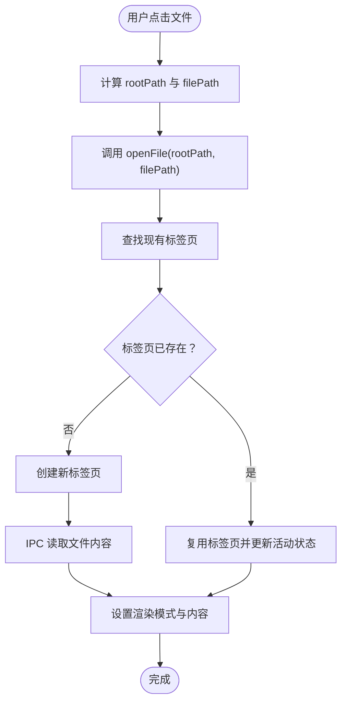
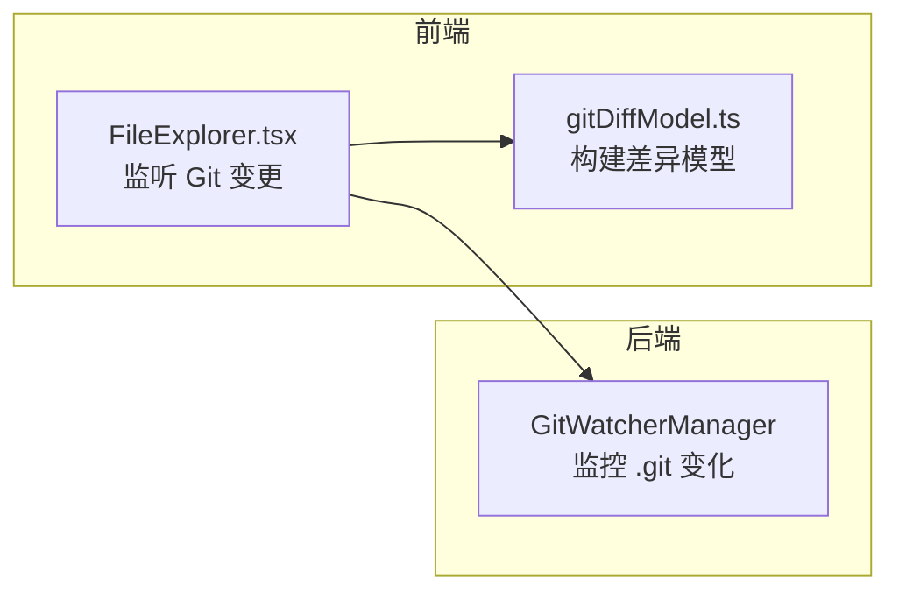
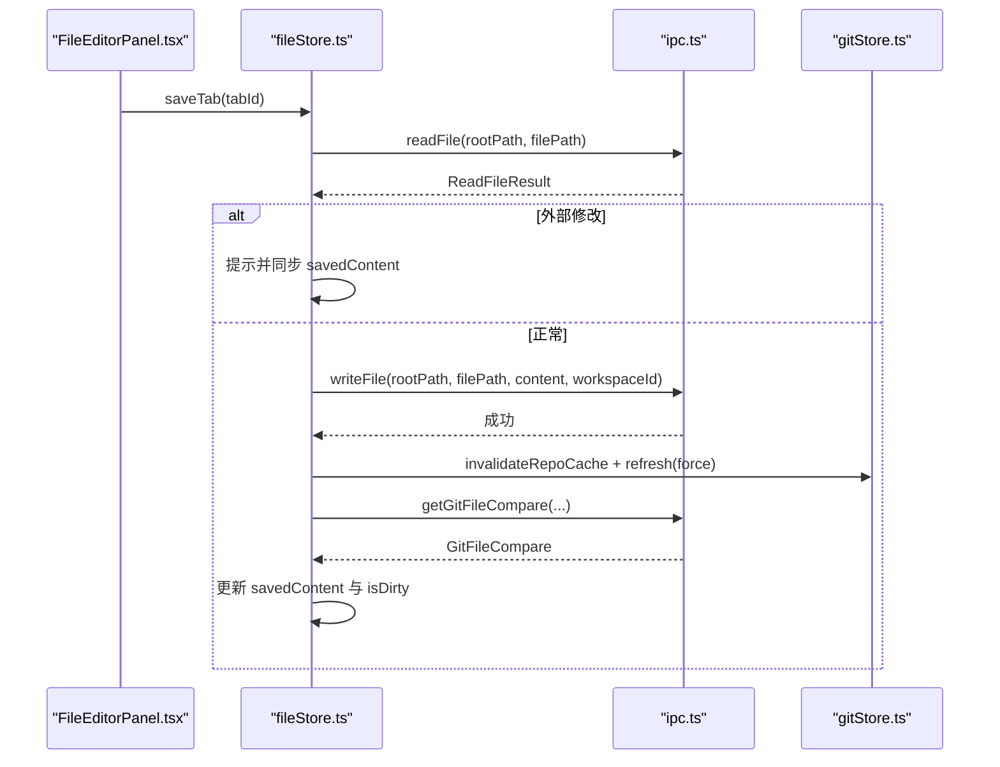
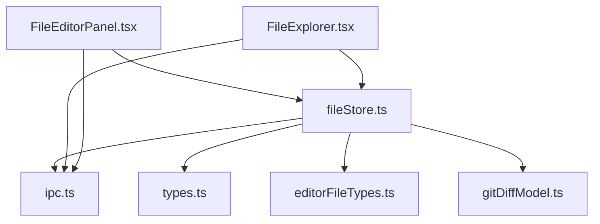

# 文件状态存储 API

<cite>
**本文档引用的文件**
- [fileStore.ts](file://src/stores/fileStore.ts)
- [fileStore.test.ts](file://src/stores/fileStore.test.ts)
- [editorFileTypes.ts](file://src/lib/editorFileTypes.ts)
- [FileEditorPanel.tsx](file://src/components/editor/FileEditorPanel.tsx)
- [FileExplorer.tsx](file://src/components/editor/FileExplorer.tsx)
- [gitDiffModel.ts](file://src/components/editor/gitDiffModel.ts)
- [ipc.ts](file://src/lib/ipc.ts)
- [types.ts](file://src/types.ts)
</cite>

## 目录
1. [简介](#简介)
2. [项目结构](#项目结构)
3. [核心组件](#核心组件)
4. [架构概览](#架构概览)
5. [详细组件分析](#详细组件分析)
6. [依赖关系分析](#依赖关系分析)
7. [性能考虑](#性能考虑)
8. [故障排除指南](#故障排除指南)
9. [结论](#结论)
10. [附录](#附录)

## 简介
本文档详细说明了 Panes 应用中的文件状态存储 API，重点涵盖以下方面：
- fileStore 的状态结构与数据模型
- 文件操作接口（浏览、打开、编辑、保存）
- 编辑器状态管理（标签页、渲染模式、悬停定位）
- 文件类型识别与 Markdown 预览
- Git 差异显示与文件监控机制
- 错误处理与性能优化策略
- 文件缓存策略与内存管理最佳实践

该 API 基于 Zustand 状态管理库构建，通过 IPC 与后端进行文件系统与 Git 操作交互，并在前端提供统一的文件编辑体验。

## 项目结构
围绕文件状态存储 API 的关键模块与职责如下：
- 状态存储：fileStore.ts 提供文件标签页、活动标签、渲染模式等状态管理
- 类型定义：types.ts 定义 EditorTab、GitFileCompare、EditorRenderMode 等核心类型
- 文件类型识别：editorFileTypes.ts 提供 Markdown 预览文件扩展名判断
- 编辑器面板：FileEditorPanel.tsx 将状态映射到 UI，支持切换渲染模式与保存
- 文件浏览器：FileExplorer.tsx 负责目录浏览、搜索与文件打开
- Git 差异建模：gitDiffModel.ts 提供差异高亮与块级结构
- IPC 接口：ipc.ts 封装与后端通信的 API（读写文件、Git 比较、仓库监听）

**图表来源**
- [fileStore.ts:1-551](file://src/stores/fileStore.ts#L1-L551)
- [types.ts:1-200](file://src/types.ts#L1-L200)
- [FileEditorPanel.tsx:1-358](file://src/components/editor/FileEditorPanel.tsx#L1-L358)
- [FileExplorer.tsx:1-800](file://src/components/editor/FileExplorer.tsx#L1-L800)
- [editorFileTypes.ts:1-7](file://src/lib/editorFileTypes.ts#L1-L7)
- [gitDiffModel.ts:1-298](file://src/components/editor/gitDiffModel.ts#L1-L298)
- [ipc.ts:1-200](file://src/lib/ipc.ts#L1-L200)

**章节来源**
- [fileStore.ts:1-551](file://src/stores/fileStore.ts#L1-L551)
- [types.ts:1-200](file://src/types.ts#L1-L200)
- [FileEditorPanel.tsx:1-358](file://src/components/editor/FileEditorPanel.tsx#L1-L358)
- [FileExplorer.tsx:1-800](file://src/components/editor/FileExplorer.tsx#L1-L800)
- [editorFileTypes.ts:1-7](file://src/lib/editorFileTypes.ts#L1-L7)
- [gitDiffModel.ts:1-298](file://src/components/editor/gitDiffModel.ts#L1-L298)
- [ipc.ts:1-200](file://src/lib/ipc.ts#L1-L200)

## 核心组件
本节深入解析 fileStore 的状态结构、接口与行为。

- 状态字段
  - tabs: EditorTab[] 当前打开的文件标签页列表
  - activeTabId: string | null 当前激活的标签页 ID
  - pendingCloseTabId: string | null 待确认关闭的标签页 ID（脏文件时触发确认对话框）

- 关键接口
  - 打开文件
    - openFile(rootPath, filePath): Promise<void> 从工作区根路径打开文件
    - openFileAtLocation(rootPath, filePath, reveal?): Promise<void> 打开文件并请求定位到指定行列
  - Git 差异
    - openGitDiffFile(repoPath, filePath, options): Promise<void> 打开 Git 差异视图
    - refreshGitContext(tabId, source?): Promise<void> 刷新当前标签页的 Git 比较上下文
  - 标签页管理
    - closeTab(tabId): void 关闭指定标签页
    - requestCloseTab(tabId): void 请求关闭标签页（脏文件时弹出确认）
    - confirmCloseTab(): void 确认关闭
    - cancelCloseTab(): void 取消关闭
    - setActiveTab(tabId): void 设置活动标签页
    - setTabRenderMode(tabId, renderMode): void 切换渲染模式（纯文本/Markdown 预览/Git 差异）
    - setTabContent(tabId, content): void 更新标签页内容并标记脏状态
    - clearPendingReveal(tabId, nonce): void 清除悬停定位请求
  - 重命名与路径重定向
    - retargetTabsAfterRename(rootPath, oldPath, newPath): void 在目录重命名后重定向所有相关标签页路径
  - 保存
    - saveTab(tabId): Promise<void> 保存当前标签页内容，必要时刷新 Git 上下文

- 数据模型
  - EditorTab：包含绝对路径、相对路径、Git 仓库路径、文件名、内容、保存内容、脏状态、加载状态、二进制标志、渲染模式、Git 上下文、待定位请求等
  - EditorRenderMode：渲染模式枚举（plain-editor/markdown-preview/git-diff-editor）
  - GitFileCompare：Git 差异比较结果（基础/修改内容、标签、变更类型、二进制标志等）

- 文件类型识别
  - isMarkdownPreviewFile(filePath): 基于扩展名判断是否为 Markdown 文件，决定默认渲染模式

- Git 差异建模
  - buildGitDiffModel(baseContent, modifiedContent): 生成差异高亮范围与块级结构，用于差异面板渲染

**章节来源**
- [fileStore.ts:168-551](file://src/stores/fileStore.ts#L168-L551)
- [types.ts:751-772](file://src/types.ts#L751-L772)
- [editorFileTypes.ts:1-7](file://src/lib/editorFileTypes.ts#L1-L7)
- [gitDiffModel.ts:134-199](file://src/components/editor/gitDiffModel.ts#L134-L199)

## 架构概览
fileStore 作为中心状态源，协调 UI 组件与后端 IPC 的交互流程。其核心控制流如下：

**图表来源**
- [fileStore.ts:205-273](file://src/stores/fileStore.ts#L205-L273)
- [ipc.ts:165-190](file://src/lib/ipc.ts#L165-L190)

**章节来源**
- [fileStore.ts:205-273](file://src/stores/fileStore.ts#L205-L273)
- [ipc.ts:165-190](file://src/lib/ipc.ts#L165-L190)

## 详细组件分析

### 状态结构与数据模型
- EditorTab 字段详解
  - id: 标签页唯一标识
  - workspaceId: 工作区 ID
  - rootPath/absolutePath/filePath/gitRepoPath/gitFilePath: 路径与 Git 仓库上下文
  - fileName/content/savedContent/isDirty/isLoading/isBinary/renderMode/gitContext/pendingReveal/loadError: 渲染与编辑状态
- EditorRenderMode
  - plain-editor: 纯文本编辑器
  - markdown-preview: Markdown 预览
  - git-diff-editor: Git 差异对比
- GitFileCompare
  - source/baseContent/modifiedContent/baseLabel/modifiedLabel/changeType/hasStagedChanges/hasUnstagedChanges/isBinary/isEditable/fallbackReason

**图表来源**
- [types.ts:751-772](file://src/types.ts#L751-L772)
- [fileStore.ts:63-107](file://src/stores/fileStore.ts#L63-L107)

**章节来源**
- [types.ts:751-772](file://src/types.ts#L751-L772)
- [fileStore.ts:63-107](file://src/stores/fileStore.ts#L63-L107)

### 文件操作接口与编辑器状态管理
- 打开文件与定位
  - openFileAtLocation 支持传入 EditorRevealLocation，在打开后生成 EditorRevealRequest 并传递给编辑器
  - defaultOpenRenderMode 根据文件扩展名与定位需求选择渲染模式
- 渲染模式切换
  - setTabRenderMode 支持在 plain-editor、markdown-preview、git-diff-editor 之间切换
  - toPlainEditorTab/toMarkdownPreviewTab/toOpenedFileTab 辅助函数确保状态一致性
- 内容编辑与脏状态
  - setTabContent 更新内容并根据与 savedContent 的差异设置 isDirty
- Git 差异视图
  - openGitDiffFile 与 refreshGitContext 通过 IPC 获取 GitFileCompare 并应用到标签页
  - applyGitCompare 保留或更新本地未保存内容，同时设置 isDirty 状态

**图表来源**
- [fileStore.ts:275-350](file://src/stores/fileStore.ts#L275-L350)
- [ipc.ts:165-190](file://src/lib/ipc.ts#L165-L190)

**章节来源**
- [fileStore.ts:275-350](file://src/stores/fileStore.ts#L275-L350)
- [ipc.ts:165-190](file://src/lib/ipc.ts#L165-L190)

### 文件浏览与打开流程
- FileExplorer 负责目录扫描、过滤、搜索与文件打开
- handleFileClick 调用 openFile(rootPath, filePath) 打开文件
- 监听 Git 仓库变化以刷新可见目录树
- 支持工作区搜索与虚拟化渲染，提升大目录性能

**图表来源**
- [FileExplorer.tsx:568-577](file://src/components/editor/FileExplorer.tsx#L568-L577)
- [fileStore.ts:205-273](file://src/stores/fileStore.ts#L205-L273)

**章节来源**
- [FileExplorer.tsx:568-577](file://src/components/editor/FileExplorer.tsx#L568-L577)
- [fileStore.ts:205-273](file://src/stores/fileStore.ts#L205-L273)

### Git 差异显示与文件监控
- Git 差异建模
  - buildGitDiffModel 基于 diffLines 计算高亮范围与差异块，支持添加/删除/修改类型的块级导航
- 文件监控
  - FileExplorer 监听 Git 仓库变更事件，触发目录树刷新
  - src-tauri 层的 GitWatcherManager 使用 notify 或轮询机制监控 .git 目录与索引变化，带去抖动窗口避免频繁刷新

**图表来源**
- [FileExplorer.tsx:414-446](file://src/components/editor/FileExplorer.tsx#L414-L446)
- [gitDiffModel.ts:134-199](file://src/components/editor/gitDiffModel.ts#L134-L199)

**章节来源**
- [FileExplorer.tsx:414-446](file://src/components/editor/FileExplorer.tsx#L414-L446)
- [gitDiffModel.ts:134-199](file://src/components/editor/gitDiffModel.ts#L134-L199)

### 保存操作与外部修改检测
- saveTab 流程
  - 检查磁盘上内容是否被外部修改（非二进制文件），若不同则提示并同步 savedContent
  - 调用 IPC 写入文件，成功后更新 savedContent 与 isDirty
  - 若标签页处于 Git 上下文，调用 gitStore 刷新缓存并重新获取差异

**图表来源**
- [fileStore.ts:501-549](file://src/stores/fileStore.ts#L501-L549)
- [ipc.ts:165-190](file://src/lib/ipc.ts#L165-L190)

**章节来源**
- [fileStore.ts:501-549](file://src/stores/fileStore.ts#L501-L549)
- [ipc.ts:165-190](file://src/lib/ipc.ts#L165-L190)

### 文件类型识别与 Markdown 预览
- isMarkdownPreviewFile(filePath) 基于扩展名集合判断是否为 Markdown 文件
- defaultOpenRenderMode 在无定位请求时自动选择 markdown-preview 模式

**章节来源**
- [editorFileTypes.ts:1-7](file://src/lib/editorFileTypes.ts#L1-L7)
- [fileStore.ts:134-142](file://src/stores/fileStore.ts#L134-L142)

## 依赖关系分析
- 组件耦合
  - fileStore 依赖 ipc.ts 进行文件系统与 Git 操作
  - FileEditorPanel 与 FileExplorer 通过 useFileStore 订阅状态并触发动作
  - gitDiffModel 为差异面板提供数据结构
- 外部依赖
  - diff 库用于构建差异模型
  - notify/PollWatcher 用于 Git 变更监控

**图表来源**
- [fileStore.ts:1-551](file://src/stores/fileStore.ts#L1-L551)
- [ipc.ts:1-200](file://src/lib/ipc.ts#L1-L200)
- [FileEditorPanel.tsx:1-358](file://src/components/editor/FileEditorPanel.tsx#L1-L358)
- [FileExplorer.tsx:1-800](file://src/components/editor/FileExplorer.tsx#L1-L800)
- [editorFileTypes.ts:1-7](file://src/lib/editorFileTypes.ts#L1-L7)
- [gitDiffModel.ts:1-298](file://src/components/editor/gitDiffModel.ts#L1-L298)

**章节来源**
- [fileStore.ts:1-551](file://src/stores/fileStore.ts#L1-L551)
- [ipc.ts:1-200](file://src/lib/ipc.ts#L1-L200)
- [FileEditorPanel.tsx:1-358](file://src/components/editor/FileEditorPanel.tsx#L1-L358)
- [FileExplorer.tsx:1-800](file://src/components/editor/FileExplorer.tsx#L1-L800)
- [editorFileTypes.ts:1-7](file://src/lib/editorFileTypes.ts#L1-L7)
- [gitDiffModel.ts:1-298](file://src/components/editor/gitDiffModel.ts#L1-L298)

## 性能考虑
- 目录浏览与搜索
  - FileExplorer 使用虚拟化渲染（TREE_VIRTUALIZATION_THRESHOLD）与可视窗口计算，减少 DOM 节点数量
  - 工作区搜索采用防抖与分页，避免高频请求
- Git 监控
  - 去抖动窗口（650ms）降低频繁变更导致的刷新压力
  - Linux 下遇到 inotify 限制时回退到轮询模式，保证稳定性
- 缓存策略
  - fileStore 对编辑器缓存进行显式销毁（destroyCachedEditor），避免内存泄漏
  - gitStore 对 Git 状态与差异缓存设置上限（条目数与字节数），超出时按最旧优先淘汰
- 大文件处理
  - 二进制文件强制使用纯文本编辑模式，避免解析开销
  - 保存前检查外部修改，避免覆盖冲突

[本节提供通用指导，无需特定文件引用]

## 故障排除指南
- 打开文件失败
  - 现象：标签页显示 loadError
  - 排查：检查 IPC readFile 返回值与权限；确认路径是否在工作区根内
- Git 差异无法刷新
  - 现象：差异面板空白或报错
  - 排查：确认 Git 仓库监听是否正常；检查 getGitFileCompare 返回值；必要时手动刷新
- 保存失败
  - 现象：保存失败提示
  - 排查：确认文件可写；检查外部修改检测逻辑；查看 IPC writeFile 返回
- 重命名后路径失效
  - 现象：保存路径错误或找不到文件
  - 排查：调用 retargetTabsAfterRename；确认旧路径与新路径映射正确

**章节来源**
- [fileStore.ts:264-272](file://src/stores/fileStore.ts#L264-L272)
- [fileStore.ts:336-349](file://src/stores/fileStore.ts#L336-L349)
- [fileStore.ts:546-548](file://src/stores/fileStore.ts#L546-L548)
- [fileStore.ts:441-499](file://src/stores/fileStore.ts#L441-L499)

## 结论
fileStore 提供了完整的文件状态管理能力，结合 IPC 与 UI 组件实现了流畅的文件浏览、打开、编辑与保存体验。通过 Git 差异建模与文件监控机制，系统能够及时反映仓库变更并提供差异对比。配合虚拟化渲染、缓存清理与去抖动策略，系统在大目录与频繁变更场景下仍保持良好性能。建议在实际使用中关注外部修改检测与路径重定向逻辑，确保数据一致性与用户体验。

[本节为总结性内容，无需特定文件引用]

## 附录
- 常用操作示例（路径引用）
  - 打开文件并定位：[openFileAtLocation:209-273](file://src/stores/fileStore.ts#L209-L273)
  - 切换渲染模式：[setTabRenderMode:401-419](file://src/stores/fileStore.ts#L401-L419)
  - 保存标签页：[saveTab:501-549](file://src/stores/fileStore.ts#L501-L549)
  - 打开 Git 差异：[openGitDiffFile:275-316](file://src/stores/fileStore.ts#L275-L316)
  - 刷新 Git 上下文：[refreshGitContext:318-350](file://src/stores/fileStore.ts#L318-L350)
  - 关闭标签页：[closeTab:352-374](file://src/stores/fileStore.ts#L352-L374)
  - 重命名后重定向：[retargetTabsAfterRename:441-499](file://src/stores/fileStore.ts#L441-L499)
  - Markdown 预览判断：[isMarkdownPreviewFile:1-7](file://src/lib/editorFileTypes.ts#L1-L7)
  - 差异建模：[buildGitDiffModel:134-199](file://src/components/editor/gitDiffModel.ts#L134-L199)
  - 目录浏览与搜索：[FileExplorer:255-524](file://src/components/editor/FileExplorer.tsx#L255-L524)