# 状态管理 API

<cite>
**本文档引用的文件**
- [chatStore.ts](file://src/stores/chatStore.ts)
- [fileStore.ts](file://src/stores/fileStore.ts)
- [terminalStore.ts](file://src/stores/terminalStore.ts)
- [gitStore.ts](file://src/stores/gitStore.ts)
- [workspaceStore.ts](file://src/stores/workspaceStore.ts)
- [threadStore.ts](file://src/stores/threadStore.ts)
- [uiStore.ts](file://src/stores/uiStore.ts)
- [toastStore.ts](file://src/stores/toastStore.ts)
- [engineStore.ts](file://src/stores/engineStore.ts)
- [harnessStore.ts](file://src/stores/harnessStore.ts)
- [chatComposerStore.ts](file://src/stores/chatComposerStore.ts)
- [onboardingStore.ts](file://src/stores/onboardingStore.ts)
- [keepAwakeStore.ts](file://src/stores/keepAwakeStore.ts)
- [updateStore.ts](file://src/stores/updateStore.ts)
- [workspacePaneStore.ts](file://src/stores/workspacePaneStore.ts)
</cite>

## 目录
1. [简介](#简介)
2. [项目结构](#项目结构)
3. [核心组件](#核心组件)
4. [架构概览](#架构概览)
5. [详细组件分析](#详细组件分析)
6. [依赖分析](#依赖分析)
7. [性能考虑](#性能考虑)
8. [故障排除指南](#故障排除指南)
9. [结论](#结论)
10. [附录](#附录)

## 简介

本文档详细介绍了 Panes 前端基于 Zustand 的状态管理系统。Zustand 是一个轻量级的状态管理库，提供了简单直观的状态管理模式。在 Panes 中，我们使用 Zustand 来管理应用的各种状态，包括聊天、文件编辑、终端、Git 操作、工作区等。

每个状态存储都是一个独立的模块，使用 `create` 函数创建，并导出一个全局可访问的 store 实例。这些 store 通过 TypeScript 接口定义了明确的类型结构，确保类型安全性和开发体验。

## 项目结构

状态管理相关的核心文件位于 `src/stores/` 目录下，包含以下主要的 store：

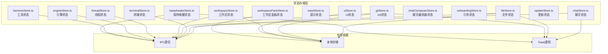

**图表来源**
- [chatStore.ts:1-800](file://src/stores/chatStore.ts#L1-L800)
- [fileStore.ts:1-551](file://src/stores/fileStore.ts#L1-L551)
- [terminalStore.ts:1-800](file://src/stores/terminalStore.ts#L1-L800)
- [gitStore.ts:1-800](file://src/stores/gitStore.ts#L1-L800)
- [workspaceStore.ts:1-429](file://src/stores/workspaceStore.ts#L1-L429)

**章节来源**
- [chatStore.ts:1-800](file://src/stores/chatStore.ts#L1-L800)
- [fileStore.ts:1-551](file://src/stores/fileStore.ts#L1-L551)
- [terminalStore.ts:1-800](file://src/stores/terminalStore.ts#L1-L800)
- [gitStore.ts:1-800](file://src/stores/gitStore.ts#L1-L800)
- [workspaceStore.ts:1-429](file://src/stores/workspaceStore.ts#L1-L429)

## 核心组件

### Zustand Store 基础架构

所有 store 都遵循相同的模式：

```typescript
import { create } from "zustand";

interface StateInterface {
  // 状态属性
}

export const useStoreName = create<StateInterface>((set, get) => ({
  // 初始状态
  // 动作函数
  
  // 异步操作
}));
```

每个 store 返回一个包含：
- **状态属性**：描述应用状态的数据
- **动作函数**：用于修改状态的方法
- **异步操作**：与后端通信或执行复杂逻辑

### 主要状态存储概览

| Store 名称 | 职责 | 关键功能 |
|------------|------|----------|
| chatStore | 聊天消息和线程管理 | 消息流处理、审批管理、内容块处理 |
| fileStore | 文件编辑器状态 | 多标签页管理、Git 差异显示、内容同步 |
| terminalStore | 终端会话和布局 | 分屏布局、会话管理、通知处理 |
| gitStore | Git 操作状态 | 缓存系统、分支管理、提交操作 |
| workspaceStore | 工作区和仓库管理 | 工作区切换、仓库激活、信任级别 |

**章节来源**
- [chatStore.ts:24-62](file://src/stores/chatStore.ts#L24-L62)
- [fileStore.ts:168-198](file://src/stores/fileStore.ts#L168-L198)
- [terminalStore.ts:437-501](file://src/stores/terminalStore.ts#L437-L501)
- [gitStore.ts:351-430](file://src/stores/gitStore.ts#L351-L430)
- [workspaceStore.ts:11-34](file://src/stores/workspaceStore.ts#L11-L34)

## 架构概览

### 状态分层架构

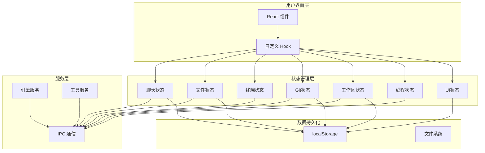

**图表来源**
- [chatStore.ts:1-800](file://src/stores/chatStore.ts#L1-L800)
- [fileStore.ts:1-551](file://src/stores/fileStore.ts#L1-L551)
- [terminalStore.ts:1-800](file://src/stores/terminalStore.ts#L1-L800)
- [gitStore.ts:1-800](file://src/stores/gitStore.ts#L1-L800)
- [workspaceStore.ts:1-429](file://src/stores/workspaceStore.ts#L1-L429)

### 状态同步机制

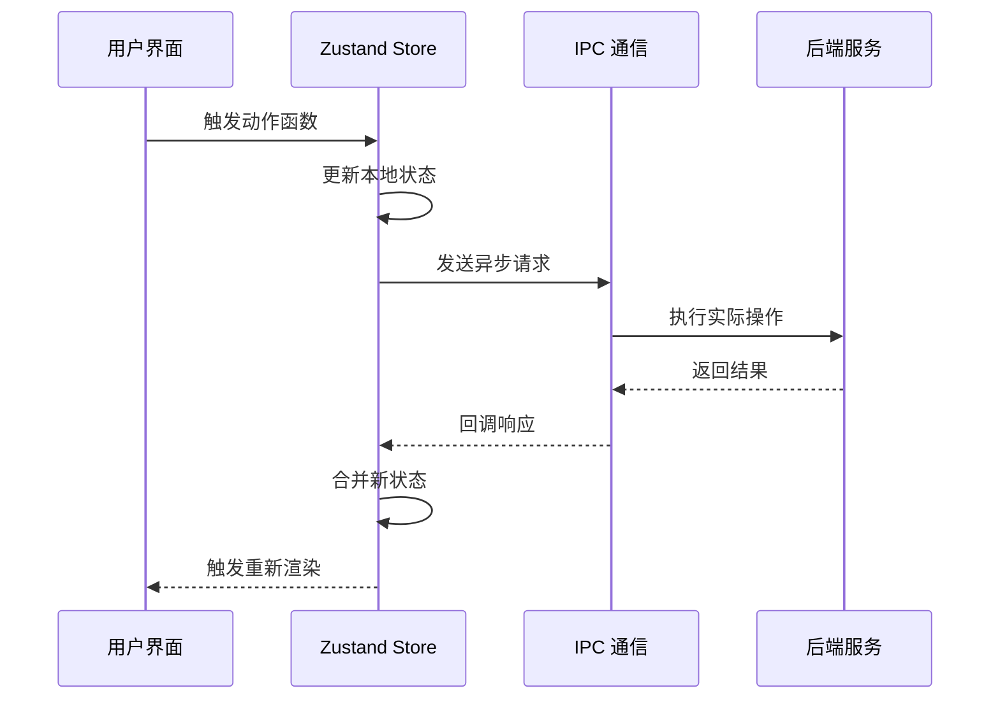

**图表来源**
- [chatStore.ts:38-59](file://src/stores/chatStore.ts#L38-L59)
- [fileStore.ts:209-273](file://src/stores/fileStore.ts#L209-L273)
- [terminalStore.ts:751-797](file://src/stores/terminalStore.ts#L751-L797)

## 详细组件分析

### 聊天状态管理 (chatStore)

#### 状态结构

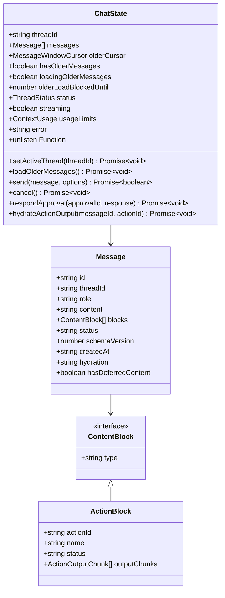

**图表来源**
- [chatStore.ts:24-62](file://src/stores/chatStore.ts#L24-L62)
- [chatStore.ts:24-62](file://src/stores/chatStore.ts#L24-L62)

#### 异步操作流程

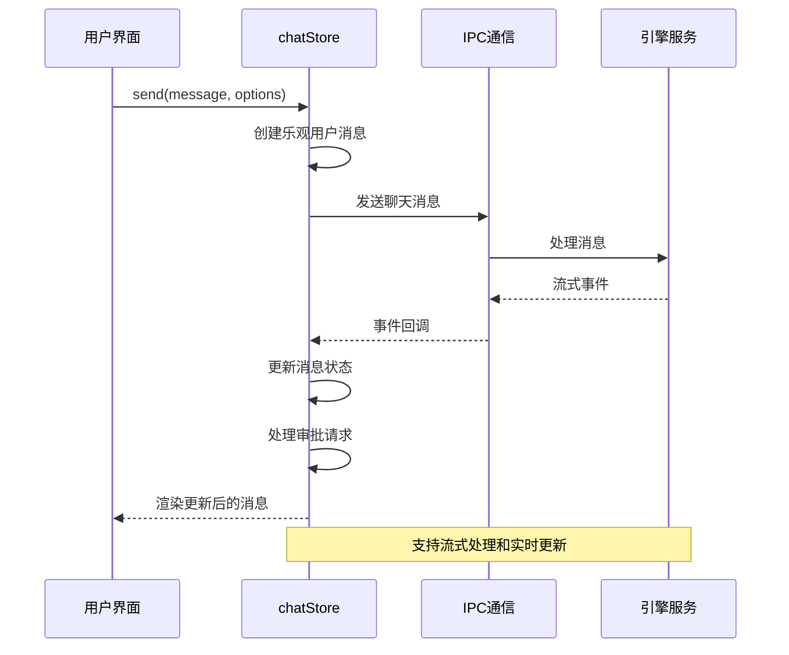

**图表来源**
- [chatStore.ts:38-59](file://src/stores/chatStore.ts#L38-L59)
- [chatStore.ts:118-155](file://src/stores/chatStore.ts#L118-L155)

#### 关键特性

1. **流式消息处理**：支持实时消息流和增量更新
2. **审批管理**：处理需要用户批准的操作
3. **内容块系统**：支持多种内容类型的组合
4. **性能监控**：记录关键性能指标

**章节来源**
- [chatStore.ts:1-800](file://src/stores/chatStore.ts#L1-L800)

### 文件状态管理 (fileStore)

#### 状态结构

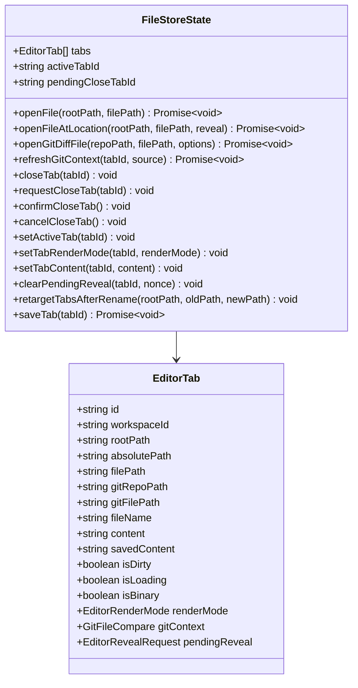

**图表来源**
- [fileStore.ts:168-198](file://src/stores/fileStore.ts#L168-L198)
- [fileStore.ts:168-198](file://src/stores/fileStore.ts#L168-L198)

#### Git 差异处理流程

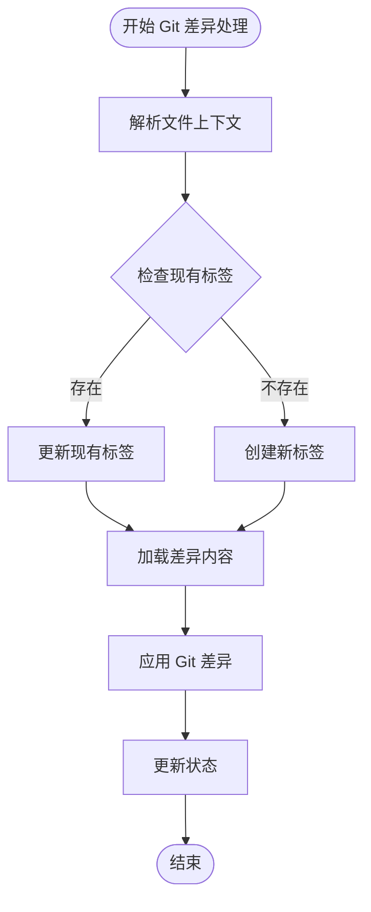

**图表来源**
- [fileStore.ts:275-316](file://src/stores/fileStore.ts#L275-L316)
- [fileStore.ts:90-107](file://src/stores/fileStore.ts#L90-L107)

**章节来源**
- [fileStore.ts:1-551](file://src/stores/fileStore.ts#L1-L551)

### 终端状态管理 (terminalStore)

#### 状态结构

```mermaid
classDiagram
class TerminalState {
+Record~string,WorkspaceTerminalState~ workspaces
+prepareWorkspaceActivation(workspaceId) Promise~void~
+setWorkspaceStartupPresetState(workspaceId, preset) void
+setWorkspaceStatus(workspaceId, loading, error) void
+openTerminal(workspaceId) Promise~void~
+closeTerminal(workspaceId) Promise~void~
+toggleTerminal(workspaceId) Promise~void~
+setLayoutMode(workspaceId, mode) Promise~void~
+cycleLayoutMode(workspaceId) Promise~void~
+runCommandInTerminal(workspaceId, command) Promise~boolean~
+createSession(workspaceId, cols, rows, harnessId) Promise~string|null~
+materializeWorkspaceStartupPreset(workspaceId, preset, cols, rows) Promise~boolean~
+serializeWorkspaceRuntimeAsStartupPreset(workspaceId) WorkspaceStartupPreset|null
+applyWorkspaceStartupPresetNow(workspaceId, preset, options) Promise~boolean~
+closeSession(workspaceId, sessionId) Promise~void~
+setActiveSession(workspaceId, sessionId) void
+setPanelSize(workspaceId, size) void
+syncSessions(workspaceId) Promise~void~
+hydrateNotifications(workspaceId) Promise~void~
+applyNotification(workspaceId, notification) void
+clearNotificationLocal(workspaceId, sessionId) void
+clearNotification(workspaceId, sessionId) Promise~void~
+syncNotificationFocus(workspaceId, sessionId, windowFocused) Promise~void~
+handleSessionExit(workspaceId, sessionId) void
+splitSession(workspaceId, sessionId, direction, cols, rows) Promise~void~
+setFocusedSession(workspaceId, sessionId) void
+setActiveGroup(workspaceId, groupId) void
+updateGroupRatio(workspaceId, groupId, containerId, ratio) void
+renameGroup(workspaceId, groupId, name) void
+reorderGroups(workspaceId, fromIndex, toIndex) void
+updateSessionHarness(workspaceId, sessionId, harnessId, harnessName, autoDetected) void
+toggleBroadcast(workspaceId, groupId) void
+createMultiSessionGroup(workspaceId, harnesses, worktreeConfig, cols, rows) Promise~{groupId, sessionIds}|null~
+getGroupWorktrees(workspaceId, groupId) WorktreeSessionInfo[]
+removeGroupWorktrees(workspaceId, worktrees) Promise~void~
}
class WorkspaceTerminalState {
+boolean isOpen
+LayoutMode layoutMode
+LayoutMode preEditorLayoutMode
+number panelSize
+TerminalSession[] sessions
+Record~string,TerminalNotification~ notificationsBySessionId
+boolean notificationHydrating
+number notificationHydrationRequestId
+boolean notificationTouchedAll
+Record~string,boolean~ notificationTouchedSessionIds
+string activeSessionId
+TerminalGroup[] groups
+string activeGroupId
+string focusedSessionId
+string broadcastGroupId
+WorkspaceStartupPreset startupPreset
+WorkspaceStartupPreset pendingStartupPreset
+boolean loading
+string error
}
TerminalState --> WorkspaceTerminalState
```

**图表来源**
- [terminalStore.ts:437-501](file://src/stores/terminalStore.ts#L437-L501)
- [terminalStore.ts:415-435](file://src/stores/terminalStore.ts#L415-L435)

#### 分屏布局算法

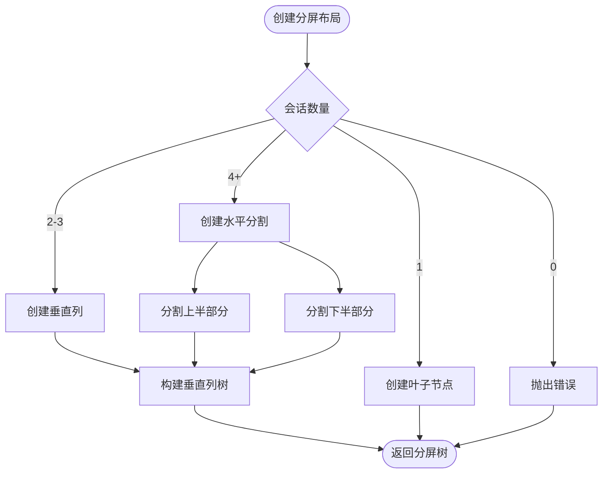

**图表来源**
- [terminalStore.ts:49-79](file://src/stores/terminalStore.ts#L49-L79)
- [terminalStore.ts:81-102](file://src/stores/terminalStore.ts#L81-L102)

**章节来源**
- [terminalStore.ts:1-800](file://src/stores/terminalStore.ts#L1-L800)

### Git 状态管理 (gitStore)

#### 状态结构

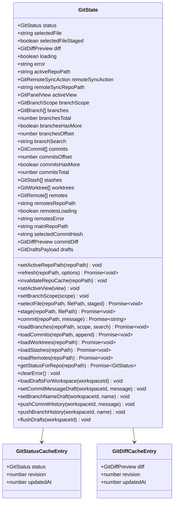

**图表来源**
- [gitStore.ts:351-430](file://src/stores/gitStore.ts#L351-L430)
- [gitStore.ts:82-98](file://src/stores/gitStore.ts#L82-L98)

#### 缓存系统设计

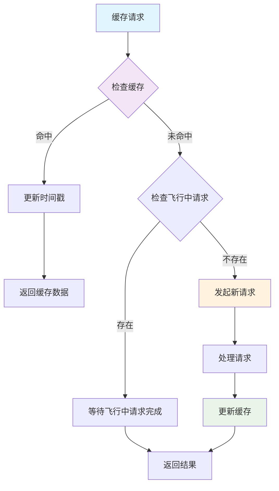

**图表来源**
- [gitStore.ts:259-300](file://src/stores/gitStore.ts#L259-L300)
- [gitStore.ts:302-349](file://src/stores/gitStore.ts#L302-L349)

**章节来源**
- [gitStore.ts:1-800](file://src/stores/gitStore.ts#L1-L800)

### 工作区状态管理 (workspaceStore)

#### 状态结构

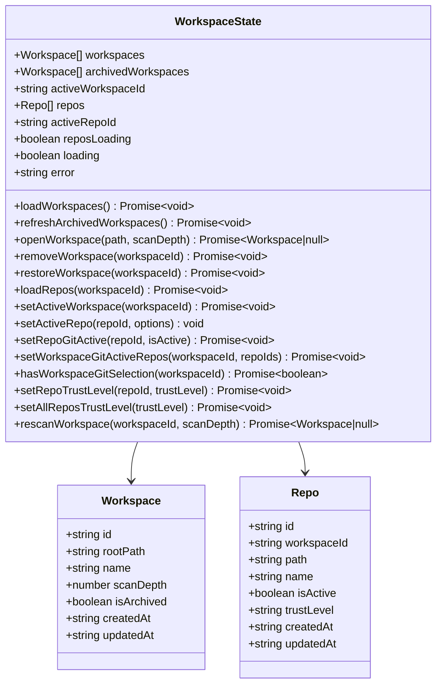

**图表来源**
- [workspaceStore.ts:11-34](file://src/stores/workspaceStore.ts#L11-L34)
- [workspaceStore.ts:11-34](file://src/stores/workspaceStore.ts#L11-L34)

#### 工作区激活流程

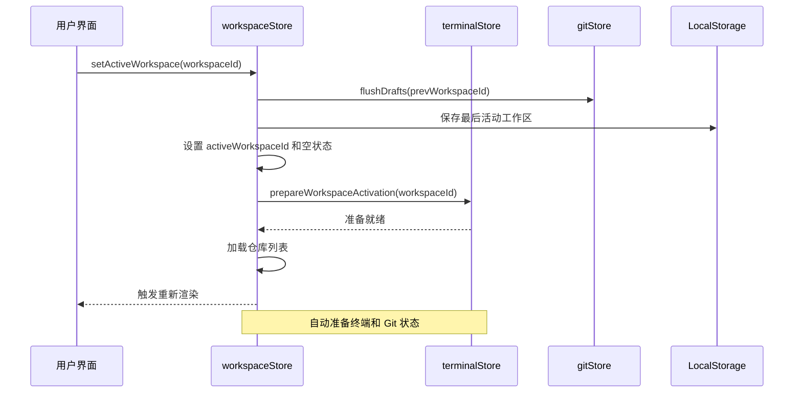

**图表来源**
- [workspaceStore.ts:287-296](file://src/stores/workspaceStore.ts#L287-L296)
- [workspaceStore.ts:149-152](file://src/stores/workspaceStore.ts#L149-L152)

**章节来源**
- [workspaceStore.ts:1-429](file://src/stores/workspaceStore.ts#L1-L429)

### 线程状态管理 (threadStore)

#### 状态结构

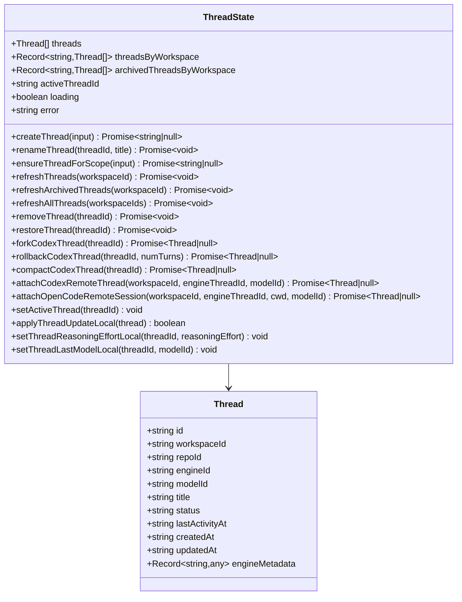

**图表来源**
- [threadStore.ts:34-67](file://src/stores/threadStore.ts#L34-L67)
- [threadStore.ts:34-67](file://src/stores/threadStore.ts#L34-L67)

#### 新线程创建流程

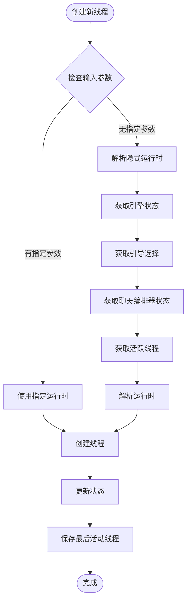

**图表来源**
- [threadStore.ts:170-220](file://src/stores/threadStore.ts#L170-L220)
- [threadStore.ts:138-162](file://src/stores/threadStore.ts#L138-L162)

**章节来源**
- [threadStore.ts:1-713](file://src/stores/threadStore.ts#L1-L713)

### UI 状态管理 (uiStore)

#### 状态结构

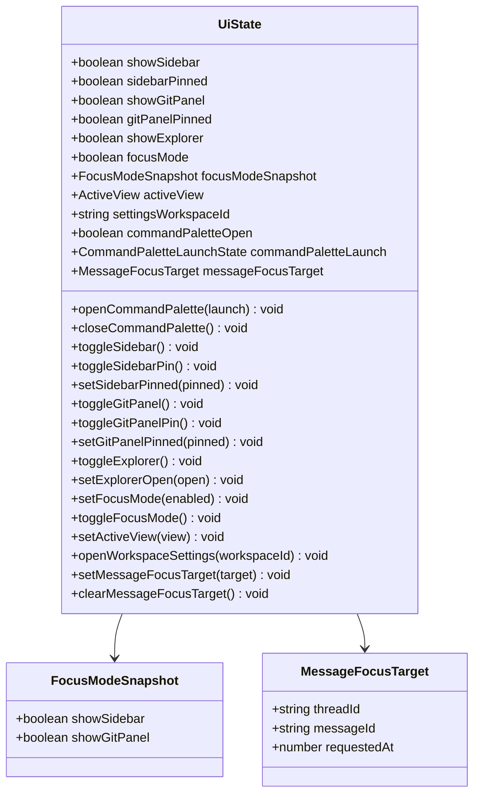

**图表来源**
- [uiStore.ts:24-53](file://src/stores/uiStore.ts#L24-L53)
- [uiStore.ts:11-15](file://src/stores/uiStore.ts#L11-L15)

#### 焦点模式机制

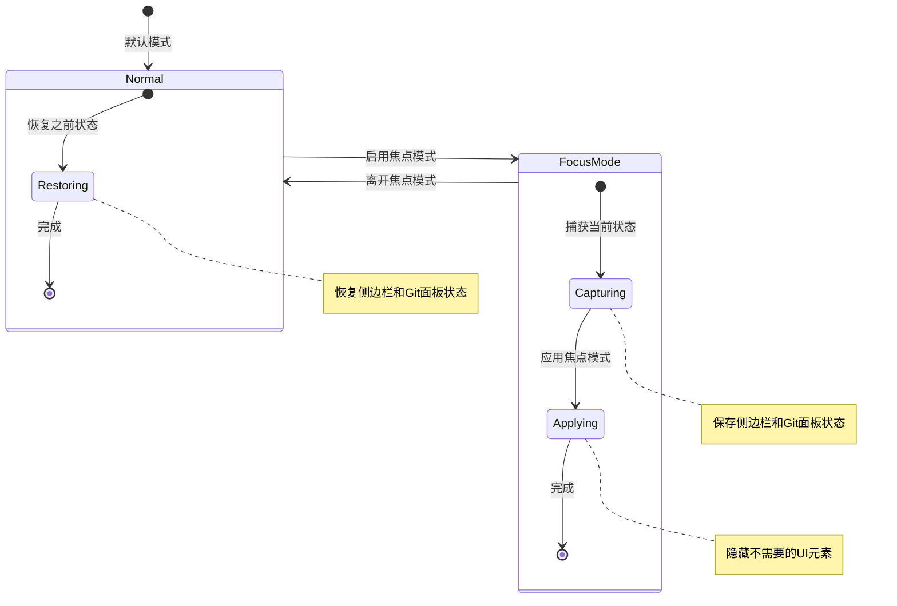

**图表来源**
- [uiStore.ts:161-209](file://src/stores/uiStore.ts#L161-L209)

**章节来源**
- [uiStore.ts:1-231](file://src/stores/uiStore.ts#L1-L231)

## 依赖分析

### 组件间依赖关系

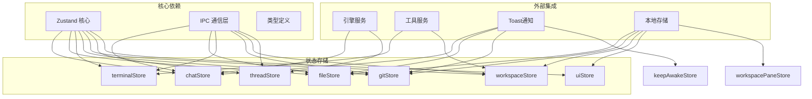

**图表来源**
- [chatStore.ts:1-5](file://src/stores/chatStore.ts#L1-L5)
- [fileStore.ts:1-14](file://src/stores/fileStore.ts#L1-L14)
- [terminalStore.ts:1-7](file://src/stores/terminalStore.ts#L1-L7)
- [gitStore.ts:1-13](file://src/stores/gitStore.ts#L1-L13)
- [workspaceStore.ts:1-6](file://src/stores/workspaceStore.ts#L1-L6)

### 状态同步机制

多个 store 之间存在必要的状态同步：

1. **workspaceStore ↔ terminalStore**：工作区激活时自动准备终端状态
2. **workspaceStore ↔ gitStore**：加载工作区时预加载 Git 草稿
3. **chatStore ↔ threadStore**：聊天线程状态与消息流同步
4. **fileStore ↔ gitStore**：文件编辑器与 Git 状态同步

**章节来源**
- [workspaceStore.ts:149-152](file://src/stores/workspaceStore.ts#L149-L152)
- [workspaceStore.ts:287-296](file://src/stores/workspaceStore.ts#L287-L296)

## 性能考虑

### 缓存策略

所有 store 都实现了智能缓存机制来优化性能：

1. **Git 状态缓存**：LRU 缓存 + TTL 限制
2. **文件内容缓存**：内存缓存 + 磁盘缓存结合
3. **会话状态缓存**：终端会话状态持久化
4. **UI 状态缓存**：本地存储快速恢复

### 异步操作优化

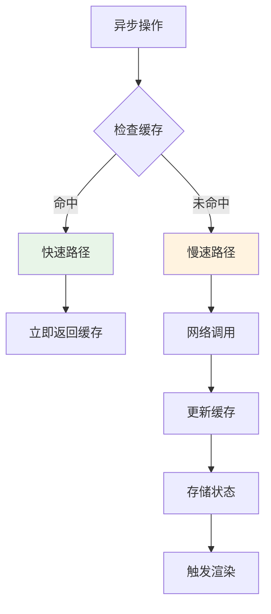

### 内存管理

1. **状态清理**：自动清理过期状态和监听器
2. **垃圾回收**：及时释放不再使用的资源
3. **批量更新**：合并多个状态变更减少重渲染

## 故障排除指南

### 常见问题诊断

#### 状态不一致问题

**症状**：UI 显示与实际状态不符
**解决方案**：
1. 检查异步操作的错误处理
2. 验证状态更新的原子性
3. 确认缓存一致性

#### 性能问题

**症状**：应用响应缓慢或内存泄漏
**解决方案**：
1. 检查不必要的状态订阅
2. 优化大型对象的序列化
3. 实施适当的缓存策略

#### 数据持久化问题

**症状**：刷新后状态丢失
**解决方案**：
1. 验证本地存储权限
2. 检查序列化/反序列化逻辑
3. 实现降级策略

**章节来源**
- [keepAwakeStore.ts:74-184](file://src/stores/keepAwakeStore.ts#L74-L184)
- [gitStore.ts:139-181](file://src/stores/gitStore.ts#L139-L181)

## 结论

Panes 的 Zustand 状态管理系统展现了现代前端状态管理的最佳实践：

1. **模块化设计**：每个 store 职责单一，易于维护和测试
2. **类型安全**：完整的 TypeScript 类型定义确保开发体验
3. **性能优化**：智能缓存和异步操作优化
4. **扩展性**：清晰的接口设计支持功能扩展
5. **可靠性**：完善的错误处理和状态恢复机制

该系统为复杂的桌面应用提供了稳定可靠的状态管理基础，支持多窗口、多标签页、实时通信等多种高级功能。

## 附录

### API 使用示例

#### 基本状态访问
```typescript
// 获取全局状态
const { activeWorkspaceId, workspaces } = useWorkspaceStore.getState();
```

#### 触发状态更新
```typescript
// 更新状态
useWorkspaceStore.setState({ loading: true });

// 或使用动作函数
await useWorkspaceStore.getState().setActiveWorkspace(newId);
```

#### 订阅状态变化
```typescript
// 订阅特定状态
const unsubscribe = useWorkspaceStore.subscribe(
  (state) => state.activeWorkspaceId,
  (activeId) => console.log('Active workspace changed:', activeId)
);

// 取消订阅
unsubscribe();
```

### 最佳实践

1. **避免直接修改状态**：始终使用动作函数更新状态
2. **处理异步操作**：正确处理网络请求和错误情况
3. **优化渲染**：使用选择器函数避免不必要的重渲染
4. **清理资源**：及时清理监听器和定时器
5. **测试状态逻辑**：编写单元测试验证状态行为