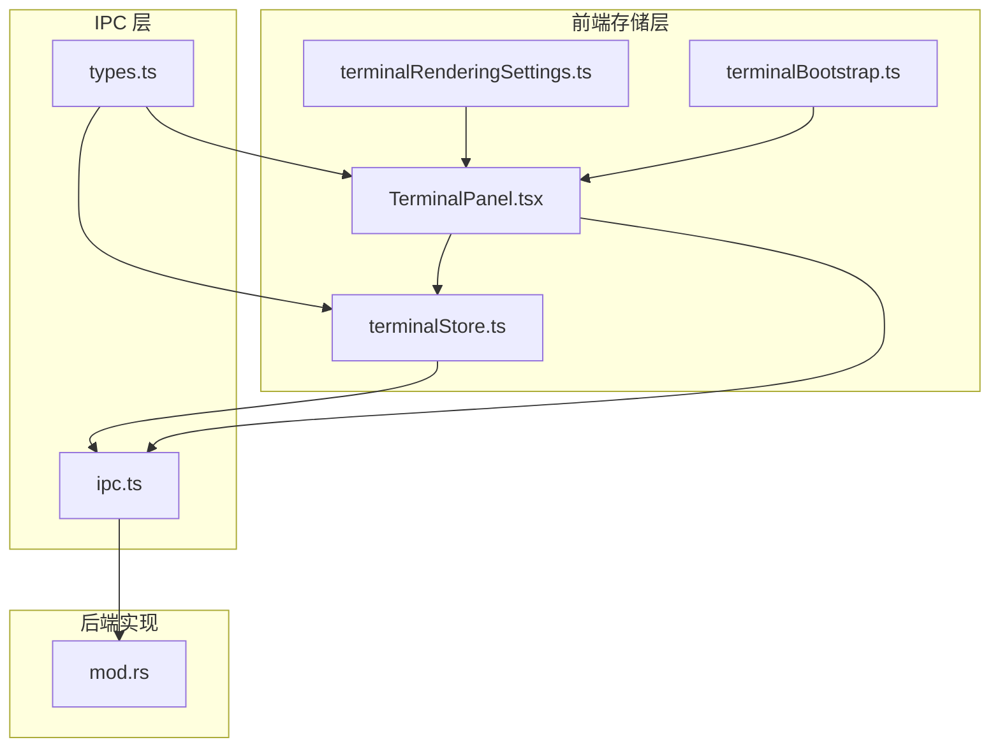
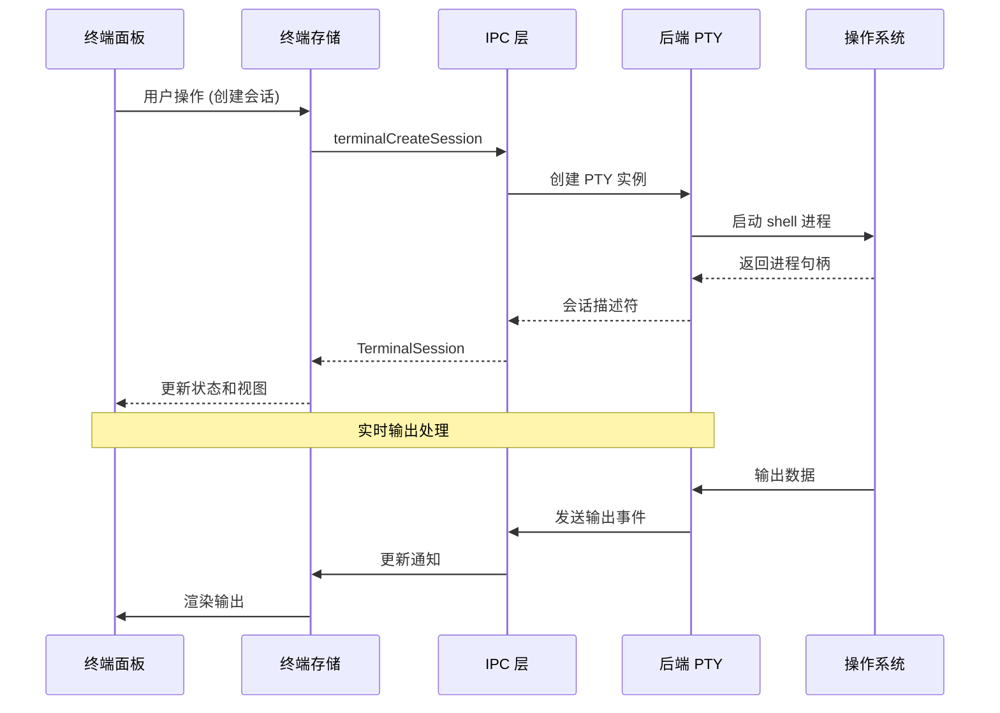
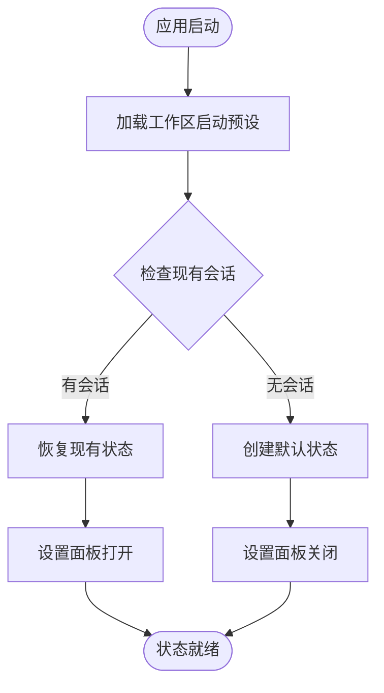
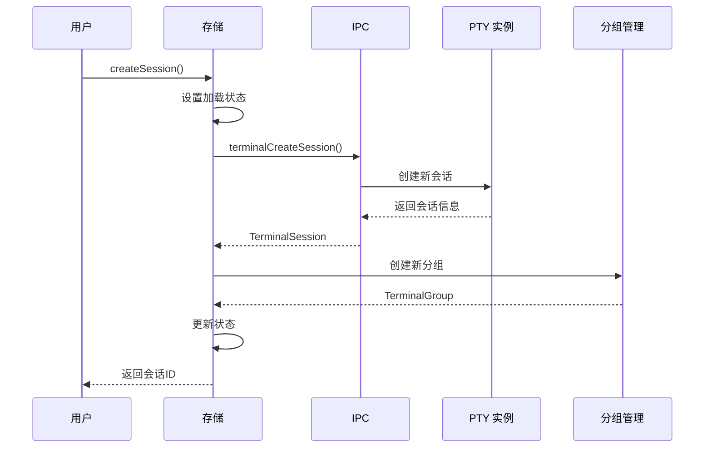
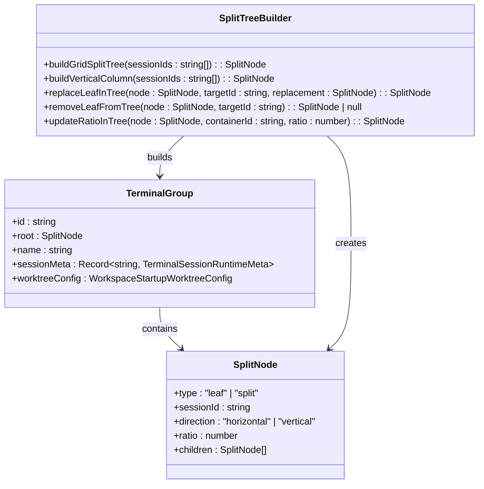
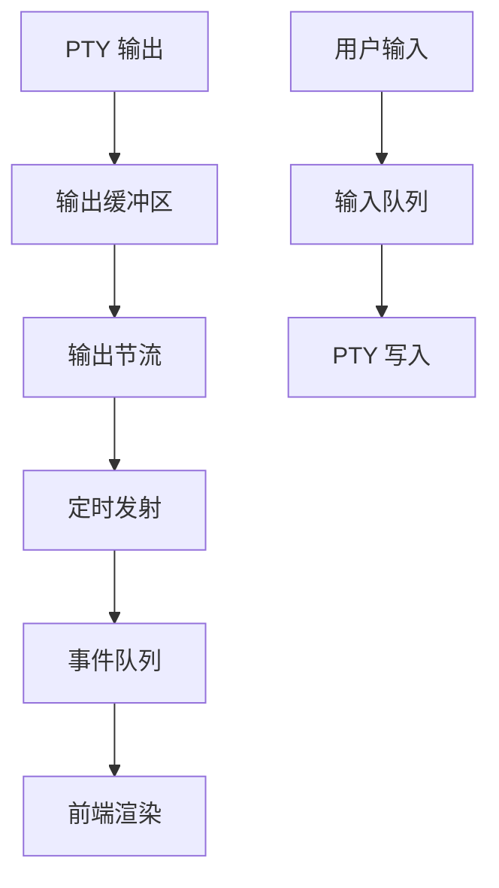
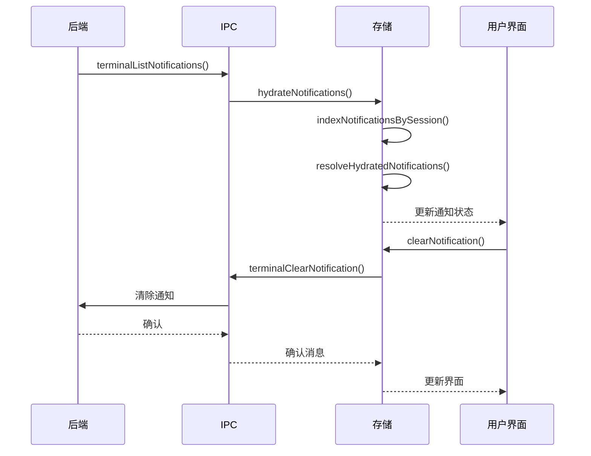
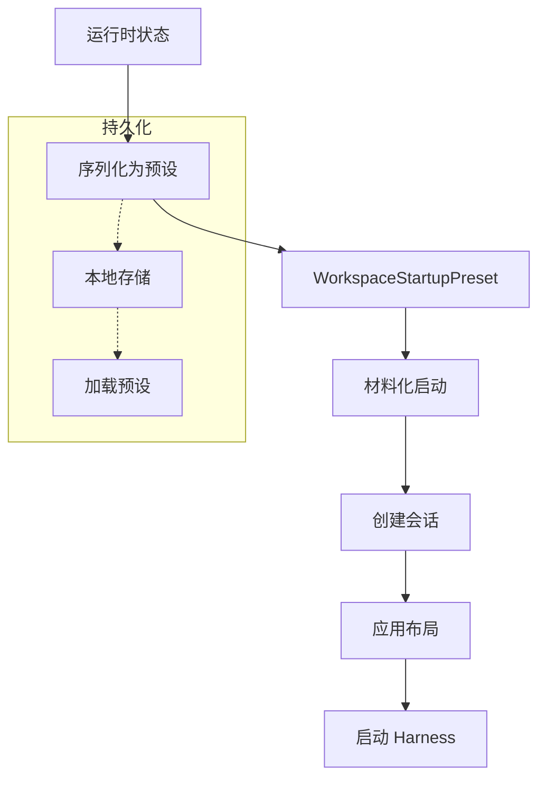
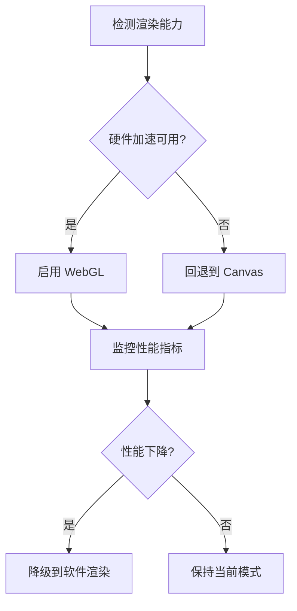
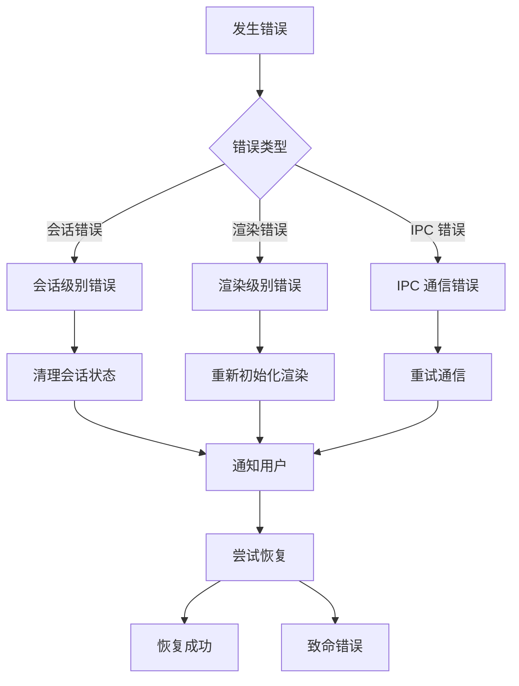

# 终端状态存储 API

<cite>
**本文档引用的文件**
- [terminalStore.ts](file://src/stores/terminalStore.ts)
- [terminalStore.multiSession.test.ts](file://src/stores/terminalStore.multiSession.test.ts)
- [terminalStore.test.ts](file://src/stores/terminalStore.test.ts)
- [TerminalPanel.tsx](file://src/components/terminal/TerminalPanel.tsx)
- [terminalBootstrap.ts](file://src/lib/terminalBootstrap.ts)
- [terminalRenderingSettings.ts](file://src/lib/terminalRenderingSettings.ts)
- [ipc.ts](file://src/lib/ipc.ts)
- [types.ts](file://src/types.ts)
- [mod.rs](file://src-tauri/src/terminal/mod.rs)
</cite>

## 目录
1. [简介](#简介)
2. [项目结构](#项目结构)
3. [核心组件](#核心组件)
4. [架构概览](#架构概览)
5. [详细组件分析](#详细组件分析)
6. [依赖关系分析](#依赖关系分析)
7. [性能考虑](#性能考虑)
8. [故障排除指南](#故障排除指南)
9. [结论](#结论)

## 简介

终端状态存储 API 是 Panes 应用程序中负责管理终端会话和状态的核心模块。该 API 提供了完整的终端生命周期管理，包括会话创建、分组管理、布局控制、通知系统和持久化功能。

本 API 支持多终端会话管理，通过树形分割布局系统实现复杂的终端组织方式。它集成了 PTY（伪终端）控制接口，提供了从底层系统调用到前端渲染的完整终端解决方案。

## 项目结构

终端状态存储 API 的核心结构围绕以下关键组件构建：



**图表来源**
- [terminalStore.ts:1-50](file://src/stores/terminalStore.ts#L1-L50)
- [TerminalPanel.tsx:1-50](file://src/components/terminal/TerminalPanel.tsx#L1-L50)
- [ipc.ts:1-50](file://src/lib/ipc.ts#L1-L50)

**章节来源**
- [terminalStore.ts:1-200](file://src/stores/terminalStore.ts#L1-L200)
- [TerminalPanel.tsx:1-100](file://src/components/terminal/TerminalPanel.tsx#L1-L100)

## 核心组件

### 状态结构设计

终端状态存储 API 采用分层状态管理模式，主要包含以下核心状态结构：

#### 工作空间终端状态
```typescript
interface WorkspaceTerminalState {
  isOpen: boolean;           // 终端面板是否打开
  layoutMode: LayoutMode;    // 布局模式 (chat/split/terminal/editor)
  panelSize: number;         // 分割面板大小
  sessions: TerminalSession[]; // 活动会话列表
  notificationsBySessionId: Record<string, TerminalNotification>; // 通知映射
  activeSessionId: string | null; // 当前活动会话
  groups: TerminalGroup[];   // 终端分组
  activeGroupId: string | null; // 当前活动分组
  focusedSessionId: string | null; // 当前焦点会话
  broadcastGroupId: string | null; // 广播分组
  startupPreset: WorkspaceStartupPreset | null; // 启动预设
  loading: boolean;          // 加载状态
  error?: string;            // 错误信息
}
```

#### 终端会话管理
终端会话是 PTY 实例的抽象表示，包含会话的基本元数据和运行时信息：

```typescript
interface TerminalSession {
  id: string;               // 会话唯一标识
  workspaceId: string;      // 工作空间标识
  shell: string;            // 使用的 shell 类型
  cwd: string;              // 当前工作目录
  createdAt: string;        // 创建时间
  updatedAt: string;        // 更新时间
}

interface TerminalGroup {
  id: string;               // 分组唯一标识
  root: SplitNode;          // 分割树根节点
  name: string;             // 分组名称
  sessionMeta?: Record<string, TerminalSessionRuntimeMeta>; // 会话元数据
  worktreeConfig?: WorkspaceStartupWorktreeConfig | null; // 工作树配置
}
```

**章节来源**
- [terminalStore.ts:415-435](file://src/stores/terminalStore.ts#L415-L435)
- [types.ts:1048-1062](file://src/types.ts#L1048-L1062)

### PTY 控制接口

API 提供了完整的 PTY 控制能力，包括会话创建、销毁和状态同步：

#### 会话生命周期管理
- `createSession`: 创建新的终端会话
- `closeSession`: 关闭指定会话
- `syncSessions`: 同步后端会话状态
- `handleSessionExit`: 处理会话退出事件

#### 布局和分组管理
- `splitSession`: 在现有会话基础上创建分割布局
- `createMultiSessionGroup`: 批量创建多会话分组
- `updateGroupRatio`: 调整分组内分割比例
- `renameGroup`: 重命名终端分组

**章节来源**
- [terminalStore.ts:1385-1443](file://src/stores/terminalStore.ts#L1385-L1443)
- [terminalStore.ts:1710-1764](file://src/stores/terminalStore.ts#L1710-L1764)

## 架构概览

终端状态存储 API 采用分层架构设计，确保前后端分离和状态一致性：



**图表来源**
- [terminalStore.ts:1385-1443](file://src/stores/terminalStore.ts#L1385-L1443)
- [ipc.ts:73-120](file://src/lib/ipc.ts#L73-L120)
- [mod.rs:457-497](file://src-tauri/src/terminal/mod.rs#L457-L497)

## 详细组件分析

### 终端状态管理器

终端状态管理器是整个 API 的核心控制器，负责协调所有终端相关操作：

#### 状态初始化和恢复


**图表来源**
- [terminalStore.ts:754-797](file://src/stores/terminalStore.ts#L754-L797)
- [terminalStore.ts:1482-1540](file://src/stores/terminalStore.ts#L1482-L1540)

#### 会话创建流程
会话创建过程涉及多个步骤，确保正确的资源分配和状态更新：



**图表来源**
- [terminalStore.ts:1385-1443](file://src/stores/terminalStore.ts#L1385-L1443)
- [terminalStore.ts:1885-2026](file://src/stores/terminalStore.ts#L1885-L2026)

**章节来源**
- [terminalStore.ts:751-800](file://src/stores/terminalStore.ts#L751-L800)
- [terminalStore.ts:1385-1443](file://src/stores/terminalStore.ts#L1385-L1443)

### 多终端支持和分组管理

API 提供了强大的多终端支持能力，通过树形分割布局实现复杂的终端组织：

#### 分割树算法


**图表来源**
- [terminalStore.ts:41-121](file://src/stores/terminalStore.ts#L41-L121)
- [types.ts:1033-1062](file://src/types.ts#L1033-L1062)

#### 分组操作接口
- `createMultiSessionGroup`: 批量创建多会话分组
- `splitSession`: 在现有会话上创建分割
- `updateGroupRatio`: 调整分割比例
- `renameGroup`: 重命名分组

**章节来源**
- [terminalStore.ts:1710-1764](file://src/stores/terminalStore.ts#L1710-L1764)
- [terminalStore.ts:1797-1809](file://src/stores/terminalStore.ts#L1797-L1809)

### 输入输出处理和通知系统

API 提供了完整的输入输出处理机制和通知系统：

#### 实时输出处理


**图表来源**
- [TerminalPanel.tsx:160-200](file://src/components/terminal/TerminalPanel.tsx#L160-L200)
- [mod.rs:639-664](file://src-tauri/src/terminal/mod.rs#L639-L664)

#### 通知系统架构
通知系统支持跨会话的通知管理和状态同步：



**图表来源**
- [terminalStore.ts:1542-1586](file://src/stores/terminalStore.ts#L1542-L1586)
- [terminalStore.ts:1629-1651](file://src/stores/terminalStore.ts#L1629-L1651)

**章节来源**
- [terminalStore.ts:1542-1651](file://src/stores/terminalStore.ts#L1542-L1651)
- [TerminalPanel.tsx:109-153](file://src/components/terminal/TerminalPanel.tsx#L109-L153)

### 启动预设和会话持久化

API 提供了完整的启动预设功能，支持会话的持久化和恢复：

#### 启动预设序列化


**图表来源**
- [terminalStore.ts:1235-1321](file://src/stores/terminalStore.ts#L1235-L1321)
- [terminalStore.ts:960-1233](file://src/stores/terminalStore.ts#L960-L1233)

#### 工作树集成
API 支持与 Git 工作树的深度集成，为每个会话提供独立的工作环境：

**章节来源**
- [terminalStore.ts:1235-1321](file://src/stores/terminalStore.ts#L1235-L1321)
- [terminalStore.multiSession.test.ts:154-189](file://src/stores/terminalStore.multiSession.test.ts#L154-L189)

## 依赖关系分析

终端状态存储 API 的依赖关系体现了清晰的分层架构：

```mermaid
graph TB
subgraph "外部依赖"
ZUSTAND[zustand 状态管理]
XTERM[@xterm 终端渲染]
Tauri[tauri 应用框架]
end
subgraph "内部模块"
Store[terminalStore.ts]
Panel[TerminalPanel.tsx]
IPC[ipc.ts]
Types[types.ts]
Boot[terminalBootstrap.ts]
Render[terminalRenderingSettings.ts]
end
ZUSTAND --> Store
XTERM --> Panel
Tauri --> IPC
Store --> IPC
Store --> Types
Panel --> Store
Panel --> IPC
Panel --> Types
Boot --> Panel
Render --> Panel
```

**图表来源**
- [terminalStore.ts:1-10](file://src/stores/terminalStore.ts#L1-L10)
- [TerminalPanel.tsx:32-50](file://src/components/terminal/TerminalPanel.tsx#L32-L50)

### 核心依赖关系

#### 状态管理依赖
- **Zustand**: 提供轻量级状态管理，避免不必要的重渲染
- **类型安全**: 通过 TypeScript 定义确保状态结构的完整性

#### 渲染层依赖
- **@xterm**: 提供高性能的终端渲染能力
- **WebGL/CSS 渲染**: 支持硬件加速和软件渲染的自动切换

#### IPC 通信依赖
- **Tauri IPC**: 实现前端与后端的安全通信
- **事件驱动**: 基于事件的异步通信模型

**章节来源**
- [terminalStore.ts:1-20](file://src/stores/terminalStore.ts#L1-L20)
- [TerminalPanel.tsx:32-50](file://src/components/terminal/TerminalPanel.tsx#L32-L50)

## 性能考虑

### 内存管理优化

API 采用了多项内存管理策略来确保长期运行的稳定性：

#### 输出缓冲区管理
- **动态缓冲区**: 根据输出速率调整缓冲区大小
- **内存回收**: 及时清理不再使用的输出数据
- **背压控制**: 防止输出过载导致内存溢出

#### 状态压缩
- **增量更新**: 仅更新变化的状态部分
- **对象池**: 复用频繁创建的对象实例
- **弱引用**: 对大型数据结构使用弱引用避免循环引用

### 渲染性能优化

#### 自适应渲染


**图表来源**
- [terminalRenderingSettings.ts:14-36](file://src/lib/terminalRenderingSettings.ts#L14-L36)
- [TerminalPanel.tsx:109-153](file://src/components/terminal/TerminalPanel.tsx#L109-L153)

#### 输出节流机制
- **最小发射间隔**: 控制输出事件的频率
- **批量处理**: 将多个输出合并为单个事件
- **优先级队列**: 确保重要输出的及时处理

### 长时间运行稳定性

#### 连接健康检查
- **心跳机制**: 定期检查 PTY 连接状态
- **自动重连**: 在连接中断时自动恢复
- **错误隔离**: 防止单个会话故障影响其他会话

#### 资源清理
- **超时清理**: 自动清理长时间未使用的会话
- **内存监控**: 监控内存使用情况并触发垃圾回收
- **文件描述符管理**: 确保 PTY 资源正确释放

**章节来源**
- [terminalRenderingSettings.ts:14-36](file://src/lib/terminalRenderingSettings.ts#L14-L36)
- [TerminalPanel.tsx:109-153](file://src/components/terminal/TerminalPanel.tsx#L109-L153)

## 故障排除指南

### 常见问题诊断

#### 会话创建失败
当遇到会话创建失败时，可以按照以下步骤进行诊断：

1. **检查工作区路径**: 确保工作区根路径有效
2. **验证权限**: 确认应用程序具有必要的文件系统权限
3. **查看日志**: 检查后端日志中的具体错误信息
4. **网络连接**: 如果使用远程会话，检查网络连接状态

#### 输出显示异常
如果出现输出显示问题：

1. **检查渲染模式**: 确认当前使用的渲染模式
2. **内存使用**: 监控内存使用情况，必要时重启应用
3. **字体配置**: 验证字体设置是否兼容当前平台
4. **分辨率适配**: 检查终端尺寸设置

### 错误处理机制

API 提供了完善的错误处理机制：



**图表来源**
- [terminalStore.ts:817-824](file://src/stores/terminalStore.ts#L817-L824)
- [terminalStore.ts:1434-1442](file://src/stores/terminalStore.ts#L1434-L1442)

### 性能监控

#### 关键性能指标
- **渲染延迟**: 终端响应时间
- **内存使用**: 应用程序内存占用
- **CPU 使用率**: 终端处理的 CPU 负载
- **输出吞吐量**: 每秒输出字符数

#### 监控工具
- **内置诊断**: 终端面板提供详细的性能诊断信息
- **系统监控**: 操作系统级别的性能监控
- **日志分析**: 结构化日志记录和分析

**章节来源**
- [terminalStore.ts:817-824](file://src/stores/terminalStore.ts#L817-L824)
- [TerminalPanel.tsx:144-153](file://src/components/terminal/TerminalPanel.tsx#L144-L153)

## 结论

终端状态存储 API 提供了一个完整、高效且可扩展的终端管理系统。通过精心设计的分层架构和状态管理模式，该 API 能够满足复杂终端应用的需求。

### 主要优势

1. **模块化设计**: 清晰的分层架构便于维护和扩展
2. **性能优化**: 多层次的性能优化确保长时间稳定运行
3. **类型安全**: 完整的 TypeScript 类型定义提供编译时安全保障
4. **用户体验**: 流畅的交互和即时反馈提升用户满意度

### 技术特色

- **智能布局**: 自适应的分割布局算法
- **会话持久化**: 完整的启动预设和状态恢复机制
- **通知系统**: 实时、可靠的跨会话通知管理
- **渲染优化**: 自适应的硬件加速和软件渲染切换

该 API 为构建专业级终端应用奠定了坚实的基础，支持从简单命令行工具到复杂开发环境的各种场景需求。