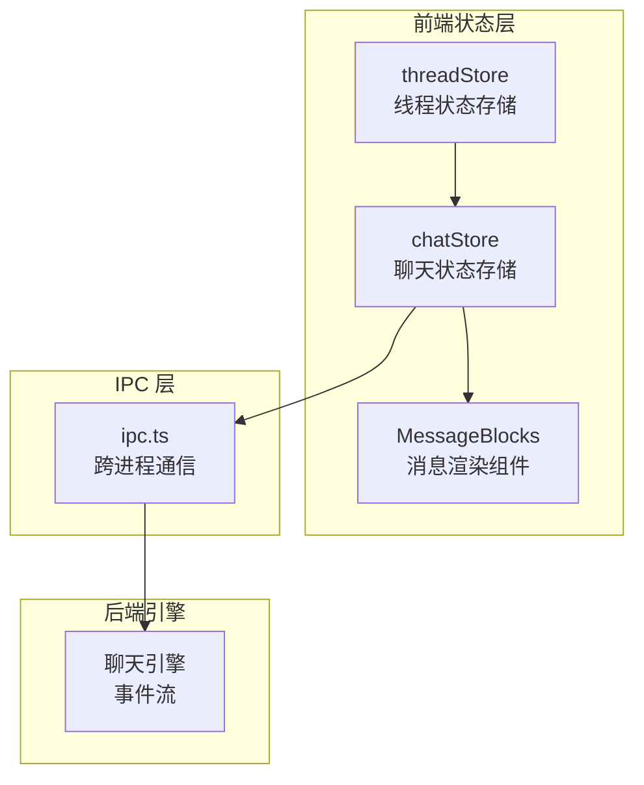
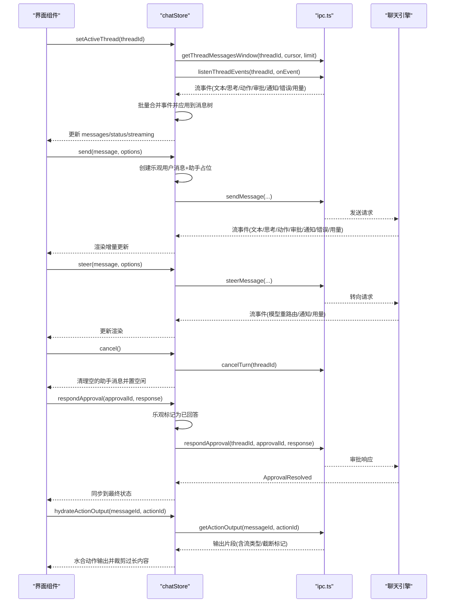
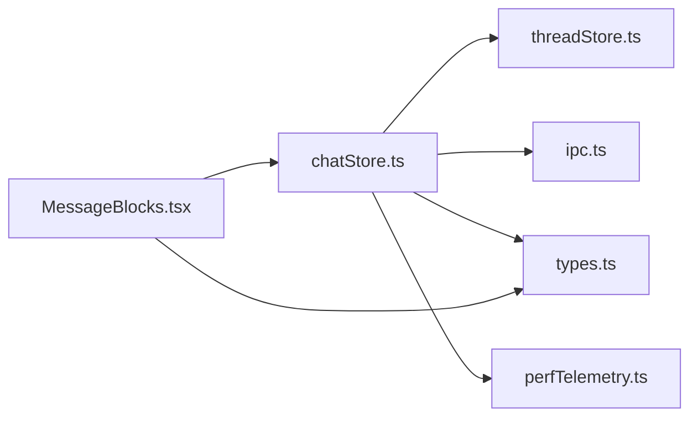

# 聊天状态存储 API

<cite>
**本文档引用的文件**
- [chatStore.ts](file://src/stores/chatStore.ts)
- [chatStore.test.ts](file://src/stores/chatStore.test.ts)
- [threadStore.ts](file://src/stores/threadStore.ts)
- [types.ts](file://src/types.ts)
- [ipc.ts](file://src/lib/ipc.ts)
- [perfTelemetry.ts](file://src/lib/perfTelemetry.ts)
- [MessageBlocks.tsx](file://src/components/chat/MessageBlocks.tsx)
</cite>

## 目录
1. [简介](#简介)
2. [项目结构](#项目结构)
3. [核心组件](#核心组件)
4. [架构总览](#架构总览)
5. [详细组件分析](#详细组件分析)
6. [依赖关系分析](#依赖关系分析)
7. [性能考量](#性能考量)
8. [故障排除指南](#故障排除指南)
9. [结论](#结论)
10. [附录](#附录)

## 简介
本文件系统性地阐述聊天状态存储 API（chatStore）的设计与实现，覆盖状态结构、动作函数、异步操作接口、消息状态管理、流式传输处理、审批请求处理、性能指标记录机制，并提供聊天会话管理、消息窗口滚动、AI 引擎集成的使用示例。同时说明状态持久化、错误处理与并发控制的实现细节，帮助开发者在前端与后端之间建立稳定可靠的聊天交互。

## 项目结构
chatStore 位于前端状态层，通过 IPC 与后端引擎通信，负责：
- 维护当前线程 ID、消息列表、游标与加载状态
- 接收并批处理流事件，更新消息块与状态
- 提供发送消息、转向、取消、审批响应、动作输出水合等 API
- 记录性能指标并进行节流与去重优化

图表来源
- [chatStore.ts:1532-1841](file://src/stores/chatStore.ts#L1532-L1841)
- [threadStore.ts:164-712](file://src/stores/threadStore.ts#L164-L712)
- [ipc.ts:374-417](file://src/lib/ipc.ts#L374-L417)

章节来源
- [chatStore.ts:1-120](file://src/stores/chatStore.ts#L1-L120)
- [threadStore.ts:1-713](file://src/stores/threadStore.ts#L1-L713)
- [ipc.ts:374-417](file://src/lib/ipc.ts#L374-L417)

## 核心组件
- chatStore：基于 zustand 的聊天状态容器，暴露状态字段与动作方法
- threadStore：线程生命周期与元数据管理
- 类型系统：Message、ContentBlock、StreamEvent、ThreadStatus 等
- IPC：封装 sendMessage、steerMessage、cancelTurn、respondApproval、getActionOutput 等调用
- 性能遥测：recordPerfMetric、getPerfSnapshot 等

章节来源
- [chatStore.ts:24-62](file://src/stores/chatStore.ts#L24-L62)
- [types.ts:223-453](file://src/types.ts#L223-L453)
- [ipc.ts:374-417](file://src/lib/ipc.ts#L374-L417)
- [perfTelemetry.ts:55-145](file://src/lib/perfTelemetry.ts#L55-L145)

## 架构总览
chatStore 通过 setActiveThread 订阅线程事件流，使用批处理队列合并连续事件，按需触发 UI 更新；send/steer/cancel/respondApproval/hydrateActionOutput 等动作通过 IPC 与后端交互，同时维护乐观更新与回滚策略。

图表来源
- [chatStore.ts:1542-1841](file://src/stores/chatStore.ts#L1542-L1841)
- [chatStore.ts:1913-2183](file://src/stores/chatStore.ts#L1913-L2183)
- [ipc.ts:374-417](file://src/lib/ipc.ts#L374-L417)

## 详细组件分析

### 状态结构与类型
- 线程级状态
  - threadId: 当前线程 ID 或 null
  - messages: Message[]，包含用户与助手消息
  - olderCursor/hasOlderMessages/loadingOlderMessages/olderLoadBlockedUntil: 分页与加载控制
  - status/streaming: 线程状态与是否正在流式传输
  - usageLimits: 上下文用量限制
  - error/unlisten: 错误信息与事件监听句柄
- 消息结构
  - Message: 包含 role/content/blocks/clientTurnId/turnEngineId/turnModelId/turnReasoningEffort/status/schemaVersion/tokenUsage/createdAt/hydration/hasDeferredContent
  - ContentBlock: 文本、代码、差异、通知、动作、审批、思考、错误、附件、技能、提及、转向等
- 流事件
  - StreamEvent: TurnStarted/TurnCompleted/TextDelta/ThinkingDelta/ActionStarted/ActionOutputDelta/ActionProgressUpdated/ActionCompleted/DiffUpdated/ApprovalRequested/ApprovalResolved/ModelRerouted/Notice/Error/UsageLimitsUpdated

章节来源
- [chatStore.ts:24-62](file://src/stores/chatStore.ts#L24-L62)
- [types.ts:223-453](file://src/types.ts#L223-L453)
- [types.ts:1245-1260](file://src/types.ts#L1245-L1260)

### 动作函数与异步操作接口

#### setActiveThread(threadId)
- 功能：切换活动线程，拉取初始消息窗口，订阅事件流，处理后台监听与状态恢复
- 关键点：
  - 若从仍在流式的线程切出，安装轻量后台监听以保持事件不丢失
  - 首次进入时拉取最近消息窗口并应用“摘要/完整”水合策略
  - 事件批处理：16ms 窗口或达到阈值后批量刷新，避免频繁重渲染
  - 记录事件速率指标 chat.stream.events_per_sec 与批处理耗时 chat.stream.flush.ms
- 并发控制：使用 bindSeq 序列号确保切换过程中的竞态安全

章节来源
- [chatStore.ts:1542-1841](file://src/stores/chatStore.ts#L1542-L1841)
- [perfTelemetry.ts:55-145](file://src/lib/perfTelemetry.ts#L55-L145)

#### loadOlderMessages()
- 功能：分页加载更早的消息，合并并应用摘要水合策略
- 关键点：
  - 受 olderLoadBlockedUntil 与 loadingOlderMessages 控制，避免重复请求
  - 加载失败时设置重试时间戳，防止抖动
  - 合并时折叠尾部转向消息，避免重复

章节来源
- [chatStore.ts:1842-1912](file://src/stores/chatStore.ts#L1842-L1912)

#### send(message, options?)
- 功能：发送新消息，创建乐观用户消息与助手占位，等待引擎返回流事件
- 支持选项：threadIdOverride/modelId/engineId/reasoningEffort/attachments/inputItems/planMode
- 乐观更新：立即插入用户消息与占位助手消息，标记 streaming=true
- 审批与模型重路由：在流中动态插入审批块与通知块
- 失败回滚：若 IPC 调用失败，移除乐观消息并置 error

章节来源
- [chatStore.ts:1913-1989](file://src/stores/chatStore.ts#L1913-L1989)
- [chatStore.test.ts:38-131](file://src/stores/chatStore.test.ts#L38-L131)

#### steer(message, options?)
- 功能：在当前流中提交转向指令，追加 steer 块到当前活跃助手消息
- 限制：仅当线程处于流式状态且 threadIdOverride 与当前线程一致时允许
- 成功后立即更新 UI；失败则移除刚添加的 steer 块并保留 error

章节来源
- [chatStore.ts:1990-2040](file://src/stores/chatStore.ts#L1990-L2040)

#### cancel()
- 功能：取消当前轮次，清理空的助手消息（无有意义内容），置空闲状态
- 与后端交互：调用 cancelTurn

章节来源
- [chatStore.ts:2041-2066](file://src/stores/chatStore.ts#L2041-L2066)

#### respondApproval(approvalId, response)
- 功能：对审批请求进行响应，支持多种响应格式（权限、MCP、动态工具调用等）
- 乐观更新：先在本地标记为已回答，再发起 IPC；失败时回滚
- 决策推导：根据响应对象自动推导 accept/accept_for_session/decline/custom 等决策

章节来源
- [chatStore.ts:2067-2094](file://src/stores/chatStore.ts#L2067-L2094)
- [chatStore.test.ts:481-735](file://src/stores/chatStore.test.ts#L481-L735)

#### hydrateActionOutput(messageId, actionId)
- 功能：水合动作输出，从后端获取输出片段并裁剪过长内容
- 并发控制：同一 messageId+actionId 的请求去重，避免重复水合
- 输出规范化：将 stderr/stdin 正规化为 stdout/stderr/stdin，按最大字符数与块数裁剪
- 截断标记：在 details 中标注 outputTruncated，避免重复提示

章节来源
- [chatStore.ts:2095-2181](file://src/stores/chatStore.ts#L2095-L2181)
- [chatStore.test.ts:540-611](file://src/stores/chatStore.test.ts#L540-L611)

### 消息状态管理与流式传输处理
- 事件批处理：enqueueStreamEvent 合并相邻的文本/思考/动作输出/进度/差异/用量更新，减少渲染次数
- 助手消息定位：resolveAssistantMessageIndex/ensureAssistantMessage 确保每轮流对应正确的助手消息
- 内容块更新：upsertBlock/upsertNoticeBlock/patchActionBlock 等函数保证幂等与一致性
- 思考块时长：非思考事件到达时，为最后一个思考块补全 durationMs
- 差异块去重：同一作用域的 diff 块只保留最新一次更新
- 用量限制：UsageLimitsUpdated 映射为 UI 友好的剩余百分比与重置时间

章节来源
- [chatStore.ts:1211-1530](file://src/stores/chatStore.ts#L1211-L1530)
- [chatStore.ts:872-946](file://src/stores/chatStore.ts#L872-L946)

### 审批请求处理
- 审批块插入：ApprovalRequested 时在助手消息中插入审批块
- 外部解决：ApprovalResolved 时将对应审批标记为已回答
- 乐观响应：respondApproval 先本地标记，再与后端同步，失败回滚
- 决策解析：resolveApprovalDecision 将多种响应格式统一为标准决策

章节来源
- [chatStore.ts:1401-1411](file://src/stores/chatStore.ts#L1401-L1411)
- [chatStore.ts:1216-1218](file://src/stores/chatStore.ts#L1216-L1218)
- [chatStore.ts:293-351](file://src/stores/chatStore.ts#L293-L351)

### 性能指标记录机制
- 轮次首帧延迟：首次 shell/内容/文本出现时记录 chat.turn.first_shell.ms、chat.turn.first_content.ms、chat.turn.first_text.ms
- 事件速率：chat.stream.events_per_sec，窗口 1 秒
- 批处理耗时：chat.stream.flush.ms，记录每次批量刷新耗时
- 指标上限：超过预算时进行冷却告警，避免噪声

章节来源
- [chatStore.ts:157-198](file://src/stores/chatStore.ts#L157-L198)
- [chatStore.ts:1634-1730](file://src/stores/chatStore.ts#L1634-L1730)
- [perfTelemetry.ts:55-145](file://src/lib/perfTelemetry.ts#L55-L145)

### 聊天会话管理与消息窗口滚动
- 会话管理：threadStore 提供 createThread/ensureThreadForScope/setActiveThread 等，chatStore 在 setActiveThread 中拉取消息窗口并订阅事件
- 滚动与分页：olderCursor/hasOlderMessages/loadingOlderMessages 控制“加载更多”按钮与滚动行为；loadOlderMessages 采用摘要水合策略降低内存占用
- 转向消息折叠：collapseTrailingSteerMessages 将用户标记的转向合并到最近的助手消息中，避免消息碎片

章节来源
- [threadStore.ts:164-712](file://src/stores/threadStore.ts#L164-L712)
- [chatStore.ts:1842-1912](file://src/stores/chatStore.ts#L1842-L1912)
- [chatStore.ts:720-748](file://src/stores/chatStore.ts#L720-L748)

### AI 引擎集成与事件映射
- 引擎能力：EngineInfo/EngineModel/EngineCapabilities 描述模型与权限模式
- 事件映射：chatStore 将后端事件映射为 UI 友好块（文本、思考、动作、审批、通知、错误、差异）
- 模型重路由：ModelRerouted 时更新助手消息的模型标签并插入通知块
- 用量限制：UsageLimitsUpdated 映射为上下文剩余百分比与重置时间

章节来源
- [types.ts:455-483](file://src/types.ts#L455-L483)
- [types.ts:1230-1260](file://src/types.ts#L1230-L1260)
- [chatStore.ts:1459-1473](file://src/stores/chatStore.ts#L1459-L1473)
- [chatStore.ts:1138-1190](file://src/stores/chatStore.ts#L1138-L1190)

### 使用示例

- 切换线程并开始对话
  - 调用 setActiveThread(threadId)，随后 send("你好")，观察 messages 中出现用户与助手消息
  - 参考测试用例：[chatStore.test.ts:38-131](file://src/stores/chatStore.test.ts#L38-L131)

- 提交转向
  - 在流中调用 steer("聚焦到失败的测试")，助手消息中将出现 steer 块
  - 参考测试用例：[chatStore.test.ts:984-1001](file://src/stores/chatStore.test.ts#L984-L1001)

- 审批响应
  - respondApproval(approvalId, { permissions: {...}, scope: "session" })，本地乐观标记后与后端同步
  - 参考测试用例：[chatStore.test.ts:613-678](file://src/stores/chatStore.test.ts#L613-L678)

- 水合动作输出
  - hydrateActionOutput(messageId, actionId)，获取并裁剪输出片段
  - 参考测试用例：[chatStore.test.ts:540-611](file://src/stores/chatStore.test.ts#L540-L611)

- 加载历史
  - loadOlderMessages()，在滚动到顶部时触发，合并并应用摘要水合
  - 参考测试用例：[chatStore.test.ts:1003-1031](file://src/stores/chatStore.test.ts#L1003-L1031)

章节来源
- [chatStore.test.ts:38-131](file://src/stores/chatStore.test.ts#L38-L131)
- [chatStore.test.ts:984-1031](file://src/stores/chatStore.test.ts#L984-L1031)
- [chatStore.test.ts:540-611](file://src/stores/chatStore.test.ts#L540-L611)
- [chatStore.test.ts:613-678](file://src/stores/chatStore.test.ts#L613-L678)

## 依赖关系分析

图表来源
- [chatStore.ts:1-22](file://src/stores/chatStore.ts#L1-L22)
- [threadStore.ts:1-12](file://src/stores/threadStore.ts#L1-L12)
- [ipc.ts:374-417](file://src/lib/ipc.ts#L374-L417)
- [types.ts:223-453](file://src/types.ts#L223-L453)
- [perfTelemetry.ts:55-145](file://src/lib/perfTelemetry.ts#L55-L145)
- [MessageBlocks.tsx:1416-1695](file://src/components/chat/MessageBlocks.tsx#L1416-L1695)

章节来源
- [chatStore.ts:1-22](file://src/stores/chatStore.ts#L1-L22)
- [threadStore.ts:1-12](file://src/stores/threadStore.ts#L1-L12)
- [ipc.ts:374-417](file://src/lib/ipc.ts#L374-L417)
- [types.ts:223-453](file://src/types.ts#L223-L453)
- [perfTelemetry.ts:55-145](file://src/lib/perfTelemetry.ts#L55-L145)
- [MessageBlocks.tsx:1416-1695](file://src/components/chat/MessageBlocks.tsx#L1416-L1695)

## 性能考量
- 事件批处理：16ms 窗口与阈值控制，降低渲染压力
- 水合策略：MAX_FULLY_HYDRATED_MESSAGES 窗口外消息摘要化，减少内存与计算开销
- 输出裁剪：ACTION_OUTPUT_MAX_CHARS/ACTION_OUTPUT_MAX_CHUNKS 限制，避免 UI 卡顿
- 指标预算：PERF_BUDGETS 与冷却告警，及时发现异常

章节来源
- [chatStore.ts:65-88](file://src/stores/chatStore.ts#L65-L88)
- [chatStore.ts:1036-1060](file://src/stores/chatStore.ts#L1036-L1060)
- [chatStore.ts:406-457](file://src/stores/chatStore.ts#L406-L457)
- [perfTelemetry.ts:55-87](file://src/lib/perfTelemetry.ts#L55-L87)

## 故障排除指南
- “已有轮次在进行”：send 时若 streaming=true，会直接报错并返回 false
- “无活动线程”：send/steer/cancel/respondApproval 前需确保 threadId 存在
- “取消无效”：cancel 仅在有流式轮次时有效，且会清理空的助手消息
- “审批未找到”：respondApproval 乐观更新后若 IPC 失败会回滚
- “水合失败”：hydrateActionOutput 返回找不到时抛出错误，可在 UI 层捕获并提示

章节来源
- [chatStore.ts:1915-1918](file://src/stores/chatStore.ts#L1915-L1918)
- [chatStore.ts:1992-1994](file://src/stores/chatStore.ts#L1992-L1994)
- [chatStore.ts:2041-2066](file://src/stores/chatStore.ts#L2041-L2066)
- [chatStore.ts:2067-2094](file://src/stores/chatStore.ts#L2067-L2094)
- [chatStore.ts:2095-2101](file://src/stores/chatStore.ts#L2095-L2101)

## 结论
chatStore 通过严格的事件批处理、乐观更新与回滚、水合策略与性能指标监控，构建了高效稳定的聊天状态管理。其与 threadStore、IPC、类型系统及渲染组件形成清晰的分层协作，既满足复杂流式交互需求，又兼顾性能与可维护性。

## 附录

### API 方法一览
- setActiveThread(threadId)
- loadOlderMessages()
- send(message, options?)
- steer(message, options?)
- cancel()
- respondApproval(approvalId, response)
- hydrateActionOutput(messageId, actionId)

章节来源
- [chatStore.ts:36-61](file://src/stores/chatStore.ts#L36-L61)