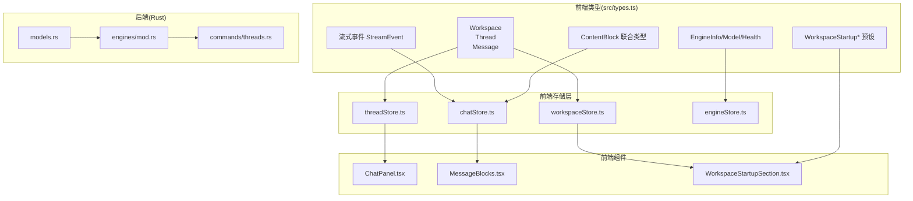
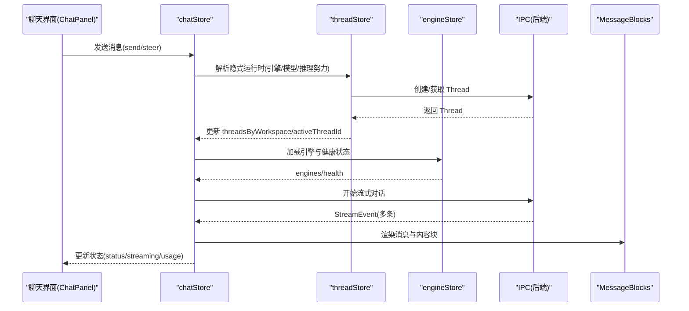
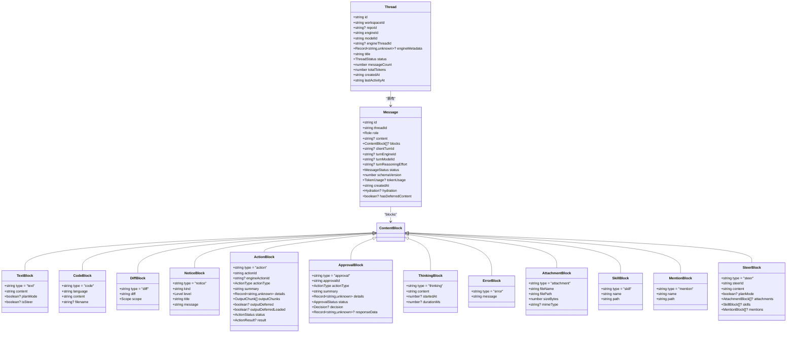
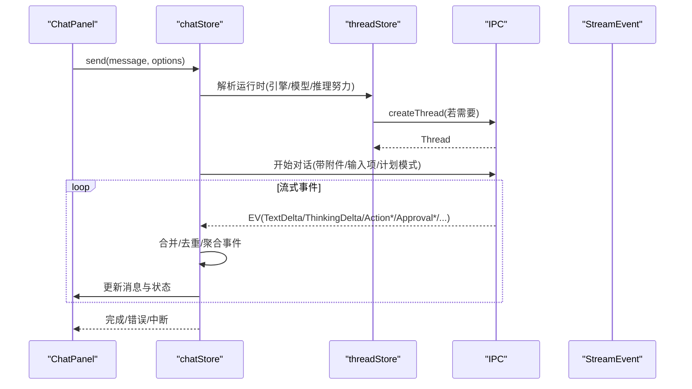
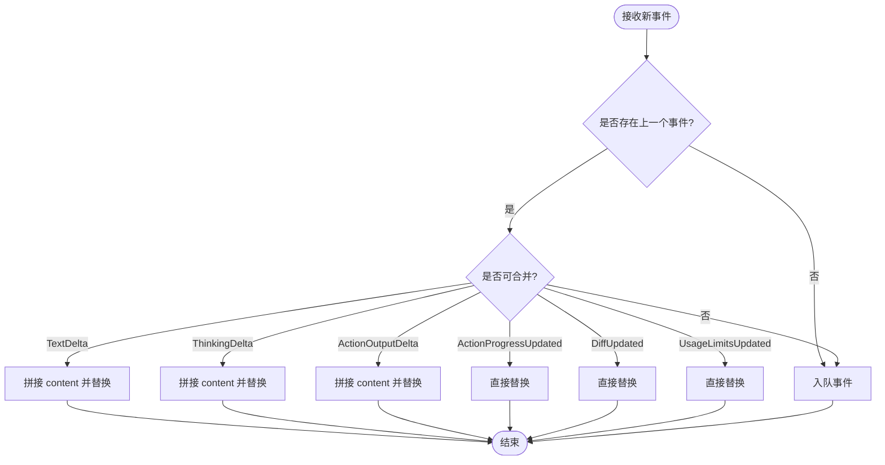
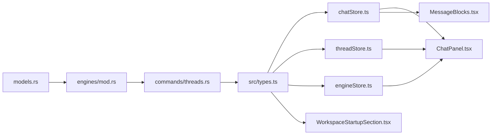

# 类型定义

<cite>
**本文档引用的文件**
- [src/types.ts](file://src/types.ts)
- [src/stores/threadStore.ts](file://src/stores/threadStore.ts)
- [src/stores/chatStore.ts](file://src/stores/chatStore.ts)
- [src/stores/workspaceStore.ts](file://src/stores/workspaceStore.ts)
- [src/stores/engineStore.ts](file://src/stores/engineStore.ts)
- [src/components/chat/ChatPanel.tsx](file://src/components/chat/ChatPanel.tsx)
- [src/components/chat/MessageBlocks.tsx](file://src/components/chat/MessageBlocks.tsx)
- [src/components/workspace/WorkspaceStartupSection.tsx](file://src/components/workspace/WorkspaceStartupSection.tsx)
- [src-tauri/src/models.rs](file://src-tauri/src/models.rs)
- [src-tauri/src/engines/mod.rs](file://src-tauri/src/engines/mod.rs)
- [src-tauri/src/commands/threads.rs](file://src-tauri/src/commands/threads.rs)
</cite>

## 目录
1. [简介](#简介)
2. [项目结构](#项目结构)
3. [核心组件](#核心组件)
4. [架构总览](#架构总览)
5. [详细组件分析](#详细组件分析)
6. [依赖分析](#依赖分析)
7. [性能考虑](#性能考虑)
8. [故障排除指南](#故障排除指南)
9. [结论](#结论)
10. [附录](#附录)

## 简介
本文件系统性梳理 Panes 前端的 TypeScript 类型定义，重点覆盖以下方面：
- 核心实体类型：Workspace、Thread、Message、ContentBlock 及其子类型（ActionBlock、ApprovalBlock、DiffBlock 等）
- 状态与枚举：ThreadStatus、MessageStatus、TrustLevel、ReasoningEffort 等
- 引擎与模型：EngineInfo、EngineModel、EngineCapabilities、EngineHealth 等
- 工作区与终端：WorkspaceStartup* 预设、SplitNode、TerminalSession 等
- 流式事件：StreamEvent 联合类型及各事件结构
- 实际使用与最佳实践：在 Store 与组件中的典型用法、字段语义与约束

## 项目结构
前端类型集中于 src/types.ts，配套的 Zustand Store 与 React 组件通过类型进行强约束。后端 Rust 层提供与前端类型对应的 DTO 映射，确保 IPC 数据一致性。

图表来源
- [src/types.ts](file://src/types.ts)
- [src/stores/threadStore.ts](file://src/stores/threadStore.ts)
- [src/stores/chatStore.ts](file://src/stores/chatStore.ts)
- [src/stores/workspaceStore.ts](file://src/stores/workspaceStore.ts)
- [src/stores/engineStore.ts](file://src/stores/engineStore.ts)
- [src/components/chat/ChatPanel.tsx](file://src/components/chat/ChatPanel.tsx)
- [src/components/chat/MessageBlocks.tsx](file://src/components/chat/MessageBlocks.tsx)
- [src/components/workspace/WorkspaceStartupSection.tsx](file://src/components/workspace/WorkspaceStartupSection.tsx)
- [src-tauri/src/models.rs](file://src-tauri/src/models.rs)
- [src-tauri/src/engines/mod.rs](file://src-tauri/src/engines/mod.rs)
- [src-tauri/src/commands/threads.rs](file://src-tauri/src/commands/threads.rs)

章节来源
- [src/types.ts](file://src/types.ts)
- [src/stores/threadStore.ts](file://src/stores/threadStore.ts)
- [src/stores/chatStore.ts](file://src/stores/chatStore.ts)
- [src/stores/workspaceStore.ts](file://src/stores/workspaceStore.ts)
- [src/stores/engineStore.ts](file://src/stores/engineStore.ts)
- [src/components/chat/ChatPanel.tsx](file://src/components/chat/ChatPanel.tsx)
- [src/components/chat/MessageBlocks.tsx](file://src/components/chat/MessageBlocks.tsx)
- [src/components/workspace/WorkspaceStartupSection.tsx](file://src/components/workspace/WorkspaceStartupSection.tsx)
- [src-tauri/src/models.rs](file://src-tauri/src/models.rs)
- [src-tauri/src/engines/mod.rs](file://src-tauri/src/engines/mod.rs)
- [src-tauri/src/commands/threads.rs](file://src-tauri/src/commands/threads.rs)

## 核心组件
本节按“实体类型 + 状态枚举 + 联合类型”的维度，逐项说明字段含义、数据类型、可选性与默认行为，并给出使用建议与常见陷阱。

- Workspace
  - 字段
    - id: string（唯一标识）
    - name: string（显示名称）
    - rootPath: string（工作区根路径）
    - scanDepth: number（扫描深度）
    - createdAt: string（ISO 时间戳）
    - lastOpenedAt: string（ISO 时间戳）
  - 语义与约束
    - rootPath 应指向有效目录；scanDepth 控制索引范围
    - createdAt/lastOpenedAt 由后端生成并持久化
  - 使用建议
    - 作为 Thread 的外键 workspaceId 的承载者
    - 与 Repo 关联时需注意信任级别对权限策略的影响
  - 章节来源
    - [src/types.ts](file://src/types.ts)

- Thread
  - 字段
    - id: string
    - workspaceId: string
    - repoId: string | null
    - engineId: "codex" | "claude" | "claude-code-native" | "opencode"
    - modelId: string
    - engineThreadId: string | null（后端线程 ID）
    - engineMetadata?: Record<string, unknown>（运行时元数据）
    - title: string
    - status: "idle" | "streaming" | "awaiting_approval" | "error" | "completed"
    - messageCount: number
    - totalTokens: number
    - createdAt: string
    - lastActivityAt: string
  - 语义与约束
    - status 表征对话轮次生命周期；engineMetadata 支持推理努力、上次模型等扩展
    - engineThreadId 为空表示未绑定到远端引擎线程
  - 使用建议
    - 通过 threadStore 管理创建、重命名、归档/恢复、迁移（fork/rollback/compact）
    - 与 Message 窗口联动，按时间倒序展示
  - 章节来源
    - [src/types.ts](file://src/types.ts)
    - [src/stores/threadStore.ts](file://src/stores/threadStore.ts)

- Message
  - 字段
    - id: string
    - threadId: string
    - role: "user" | "assistant"
    - content?: string（文本内容）
    - blocks?: ContentBlock[]（富内容块）
    - clientTurnId?: string | null（客户端轮次标识）
    - turnEngineId?: string | null（轮次引擎）
    - turnModelId?: string | null（轮次模型）
    - turnReasoningEffort?: string | null（推理努力）
    - status: "completed" | "streaming" | "interrupted" | "error"
    - schemaVersion: number（消息格式版本）
    - tokenUsage?: { input: number; output: number }
    - createdAt: string
    - hydration?: "full" | "summary"
    - hasDeferredContent?: boolean
  - 语义与约束
    - blocks 与 content 可并存；hydration 控制渲染粒度
    - tokenUsage 仅在完成时存在
  - 使用建议
    - 在 chatStore 中按流式事件增量更新 blocks 与 status
    - 对 Action 输出采用分片与截断策略，避免内存膨胀
  - 章节来源
    - [src/types.ts](file://src/types.ts)
    - [src/stores/chatStore.ts](file://src/stores/chatStore.ts)

- ContentBlock 联合类型
  - 子类型
    - TextBlock: type="text" + content + planMode/isSteer
    - CodeBlock: type="code" + language + content + filename?
    - DiffBlock: type="diff" + diff + scope ∈ {"turn","file","workspace"}
    - NoticeBlock: type="notice" + kind + level + title + message
    - ActionBlock: type="action" + actionId + actionType + summary + details + outputChunks...
    - ApprovalBlock: type="approval" + approvalId + actionType + summary + details + status + decision?
    - ThinkingBlock: type="thinking" + content + startedAt/durationMs?
    - ErrorBlock: type="error" + message
    - AttachmentBlock: type="attachment" + fileName + filePath + sizeBytes + mimeType?
    - SkillBlock: type="skill" + name + path
    - MentionBlock: type="mention" + name + path
    - SteerBlock: type="steer" + steerId + content + planMode + attachments/skills/mentions?
  - 语义与约束
    - 每个子类型包含稳定标识（type）与业务相关字段
    - ActionBlock 的 outputChunks 支持 stdout/stderr/stdin 分流
  - 使用建议
    - 通过 Message.blocks 渲染富内容；注意去重与合并（如 DiffBlock 按作用域最新保留）
    - ApprovalBlock 决策映射到统一决策枚举
  - 章节来源
    - [src/types.ts](file://src/types.ts)
    - [src/components/chat/MessageBlocks.tsx](file://src/components/chat/MessageBlocks.tsx)

- EngineInfo/EngineModel/EngineCapabilities/EngineHealth
  - EngineInfo
    - id/name + models: EngineModel[] + capabilities: EngineCapabilities
  - EngineModel
    - id/displayName/description + hidden/isDefault + limits/inputModalities/attachmentModalities
    - supportsPersonality + defaultReasoningEffort + supportedReasoningEfforts[]
  - EngineCapabilities
    - permissionModes/sandboxModes/approvalDecisions
  - EngineHealth
    - id + available + version/details/warnings/checks/fixes + protocolDiagnostics?
  - 语义与约束
    - models 与 capabilities 描述引擎能力边界；health 提供可用性诊断
  - 使用建议
    - 通过 engineStore.load/ensureHealth 获取并缓存健康状态
    - 推理努力值需在 supportedReasoningEfforts 中选择
  - 章节来源
    - [src/types.ts](file://src/types.ts)
    - [src/stores/engineStore.ts](file://src/stores/engineStore.ts)
    - [src-tauri/src/models.rs](file://src-tauri/src/models.rs)
    - [src-tauri/src/engines/mod.rs](file://src-tauri/src/engines/mod.rs)

- WorkspaceStartup* 预设与终端布局
  - WorkspaceStartupPreset
    - version=1 + defaultView ∈ {"chat","split","terminal","editor"} + splitPanelSize?
    - terminal?: WorkspaceTerminalStartupPreset
  - WorkspaceTerminalStartupPreset
    - applyWhen="no_live_sessions" + groups[] + activeGroupId? + focusedSessionId?
  - WorkspaceStartupGroup
    - id/name/broadcastOnStart + worktree? + sessions[] + root: WorkspaceStartupSplitNode
  - WorkspaceStartupSession
    - id/title? + cwd + cwdBase ∈ {"workspace","worktree","absolute"} + harnessId? + launchHarnessOnCreate?
  - WorkspaceStartupSplitNode
    - leaf: { type:"leaf", sessionId }
    - split: { type:"split", direction ∈ {"horizontal","vertical"}, ratio, children:[...] }
  - 语义与约束
    - root 构成二叉树，叶子节点绑定会话；支持水平/垂直分割
  - 使用建议
    - 通过 WorkspaceStartupSection.tsx 进行草稿标准化与组名推导
  - 章节来源
    - [src/types.ts](file://src/types.ts)
    - [src/components/workspace/WorkspaceStartupSection.tsx](file://src/components/workspace/WorkspaceStartupSection.tsx)

- 流式事件 StreamEvent
  - 联合类型包含：
    - TurnStarted/TurnCompleted + TokenUsage + TurnCompletionStatus
    - TextDelta/ThinkingDelta
    - ActionStarted/ActionOutputDelta/ActionProgressUpdated/ActionCompleted
    - DiffUpdated(scope)
    - ApprovalRequested/ApprovalResolved
    - ModelRerouted
    - Notice/Error
    - UsageLimitsUpdated
  - 语义与约束
    - 事件驱动 UI 状态切换（如从 streaming 到 completed/error）
    - TokenUsage 与 UsageLimitsUpdated 提供用量监控
  - 使用建议
    - chatStore 将事件批处理并去重（如连续 TextDelta 合并），降低渲染压力
  - 章节来源
    - [src/types.ts](file://src/types.ts)
    - [src/stores/chatStore.ts](file://src/stores/chatStore.ts)

- 状态枚举与工具
  - ThreadStatus: "idle"|"streaming"|"awaiting_approval"|"error"|"completed"
  - MessageStatus: "completed"|"streaming"|"interrupted"|"error"
  - TrustLevel: "trusted"|"standard"|"restricted"
  - ReasoningEffort: 由模型支持列表决定
  - 工具函数
    - chatStore.applyRuntimeStateFromEvent：根据事件转换 ThreadStatus/streaming
    - threadStore.threadMatchesRequestedModel：匹配模型或上次模型
  - 章节来源
    - [src/types.ts](file://src/types.ts)
    - [src/stores/chatStore.ts](file://src/stores/chatStore.ts)
    - [src/stores/threadStore.ts](file://src/stores/threadStore.ts)

## 架构总览
前端类型与存储层的交互关系如下：

图表来源
- [src/components/chat/ChatPanel.tsx](file://src/components/chat/ChatPanel.tsx)
- [src/stores/chatStore.ts](file://src/stores/chatStore.ts)
- [src/stores/threadStore.ts](file://src/stores/threadStore.ts)
- [src/stores/engineStore.ts](file://src/stores/engineStore.ts)
- [src/types.ts](file://src/types.ts)

## 详细组件分析

### 类型关系与继承结构
- ContentBlock 是联合类型，内部各子类型通过 type 字段区分
- Message.blocks 为 ContentBlock[]，支持多种内容组合
- EngineInfo 包含多个 EngineModel，每个模型声明输入/附件模态、推理努力选项等

图表来源
- [src/types.ts](file://src/types.ts)

章节来源
- [src/types.ts](file://src/types.ts)

### API/服务组件调用流程（发送消息）

图表来源
- [src/stores/chatStore.ts](file://src/stores/chatStore.ts)
- [src/stores/threadStore.ts](file://src/stores/threadStore.ts)
- [src/components/chat/ChatPanel.tsx](file://src/components/chat/ChatPanel.tsx)
- [src/types.ts](file://src/types.ts)

章节来源
- [src/stores/chatStore.ts](file://src/stores/chatStore.ts)
- [src/stores/threadStore.ts](file://src/stores/threadStore.ts)
- [src/components/chat/ChatPanel.tsx](file://src/components/chat/ChatPanel.tsx)
- [src/types.ts](file://src/types.ts)

### 复杂逻辑组件（事件批处理与去重）

图表来源
- [src/stores/chatStore.ts](file://src/stores/chatStore.ts)

章节来源
- [src/stores/chatStore.ts](file://src/stores/chatStore.ts)

## 依赖分析
- 类型依赖
  - Thread/Message/ContentBlock 为核心数据模型，被 chatStore 与 MessageBlocks 组件广泛使用
  - EngineInfo/EngineModel/EngineHealth 由 engineStore 管理，供 ChatPanel 与模型选择器使用
  - WorkspaceStartup* 由 WorkspaceStartupSection.tsx 标准化后写入配置
- 存储层耦合
  - threadStore 与 chatStore 通过 IPC 协同，前者负责线程生命周期，后者负责消息与流式事件
  - engineStore 仅负责引擎发现与健康检查，不直接参与消息渲染
- 后端映射
  - models.rs 与 engines/mod.rs 将 Rust 结构体映射为前端类型，保证 IPC 一致性
  - commands/threads.rs 中 TrustLevel 与审批策略的后端实现与前端枚举保持一致

图表来源
- [src/types.ts](file://src/types.ts)
- [src/stores/chatStore.ts](file://src/stores/chatStore.ts)
- [src/stores/threadStore.ts](file://src/stores/threadStore.ts)
- [src/stores/engineStore.ts](file://src/stores/engineStore.ts)
- [src/components/chat/ChatPanel.tsx](file://src/components/chat/ChatPanel.tsx)
- [src/components/chat/MessageBlocks.tsx](file://src/components/chat/MessageBlocks.tsx)
- [src/components/workspace/WorkspaceStartupSection.tsx](file://src/components/workspace/WorkspaceStartupSection.tsx)
- [src-tauri/src/models.rs](file://src-tauri/src/models.rs)
- [src-tauri/src/engines/mod.rs](file://src-tauri/src/engines/mod.rs)
- [src-tauri/src/commands/threads.rs](file://src-tauri/src/commands/threads.rs)

章节来源
- [src/types.ts](file://src/types.ts)
- [src/stores/chatStore.ts](file://src/stores/chatStore.ts)
- [src/stores/threadStore.ts](file://src/stores/threadStore.ts)
- [src/stores/engineStore.ts](file://src/stores/engineStore.ts)
- [src/components/chat/ChatPanel.tsx](file://src/components/chat/ChatPanel.tsx)
- [src/components/chat/MessageBlocks.tsx](file://src/components/chat/MessageBlocks.tsx)
- [src/components/workspace/WorkspaceStartupSection.tsx](file://src/components/workspace/WorkspaceStartupSection.tsx)
- [src-tauri/src/models.rs](file://src-tauri/src/models.rs)
- [src-tauri/src/engines/mod.rs](file://src-tauri/src/engines/mod.rs)
- [src-tauri/src/commands/threads.rs](file://src-tauri/src/commands/threads.rs)

## 性能考虑
- 事件批处理
  - chatStore 对连续的文本/思考/输出/进度/差异/用量事件进行合并，减少渲染抖动与内存占用
- Action 输出截断
  - 当输出片段过多或字符超限时，自动截断并标记 truncated，避免 UI 卡顿
- 虚拟化与分页
  - Message 列表超过阈值启用虚拟化；MessageWindow 采用游标分页加载旧消息
- 本地状态最小化
  - threadStore 仅在必要时更新 engineMetadata（如推理努力、上次模型），避免无意义的深拷贝

## 故障排除指南
- Thread 状态异常
  - 现象：status 长期为 streaming 或 error
  - 排查：检查 StreamEvent 是否到达 TurnCompleted/错误事件；确认 recoverable=false 时转为 error
  - 参考
    - [src/stores/chatStore.ts](file://src/stores/chatStore.ts)
- Approval 未触发 UI
  - 现象：出现 ApprovalRequested 但界面无弹窗
  - 排查：确认 isRequestUserInputApproval 与引擎支持情况；检查 activeToolInputApprovalId
  - 参考
    - [src/components/chat/ChatPanel.tsx](file://src/components/chat/ChatPanel.tsx)
- 信任级别与审批策略
  - 现象：受限信任级别下某些操作被拒绝
  - 排查：后端根据 TrustLevel 与引擎计算审批策略，前端 TrustLevel 枚举需与后端一致
  - 参考
    - [src-tauri/src/commands/threads.rs](file://src-tauri/src/commands/threads.rs)
- 终端预设无效
  - 现象：启动后未按预期打开终端分组
  - 排查：WorkspaceStartupSection.tsx 会对空组、焦点会话进行标准化；确认 groups/sessions/root 一致性
  - 参考
    - [src/components/workspace/WorkspaceStartupSection.tsx](file://src/components/workspace/WorkspaceStartupSection.tsx)

章节来源
- [src/stores/chatStore.ts](file://src/stores/chatStore.ts)
- [src/components/chat/ChatPanel.tsx](file://src/components/chat/ChatPanel.tsx)
- [src-tauri/src/commands/threads.rs](file://src-tauri/src/commands/threads.rs)
- [src/components/workspace/WorkspaceStartupSection.tsx](file://src/components/workspace/WorkspaceStartupSection.tsx)

## 结论
本文档系统梳理了 Panes 前端的核心类型定义及其在 Store 与组件中的使用方式。通过明确字段语义、状态流转与事件处理机制，开发者可以更安全地扩展聊天、工作区与引擎相关功能，同时遵循性能与可维护性的最佳实践。

## 附录
- 最佳实践清单
  - 使用 union 类型（如 ContentBlock、StreamEvent）表达多态结构，避免 any
  - 严格区分可选字段与必填字段，利用默认值与校验函数（如 WorkspaceStartupSection.tsx 的标准化）
  - 在 chatStore 中统一处理流式事件的批处理与去重，避免重复渲染
  - 通过 engineStore 缓存引擎与健康状态，减少频繁查询
  - 对 Action 输出进行截断与分片，控制内存与传输开销
- 常见问题速查
  - ThreadStatus 与事件映射：参考 chatStore.applyRuntimeStateFromEvent
  - 模型推理努力选择：参考 engines/mod.rs 与 chat.rs 的解析逻辑
  - TrustLevel 与审批策略：参考 commands/threads.rs 的策略映射