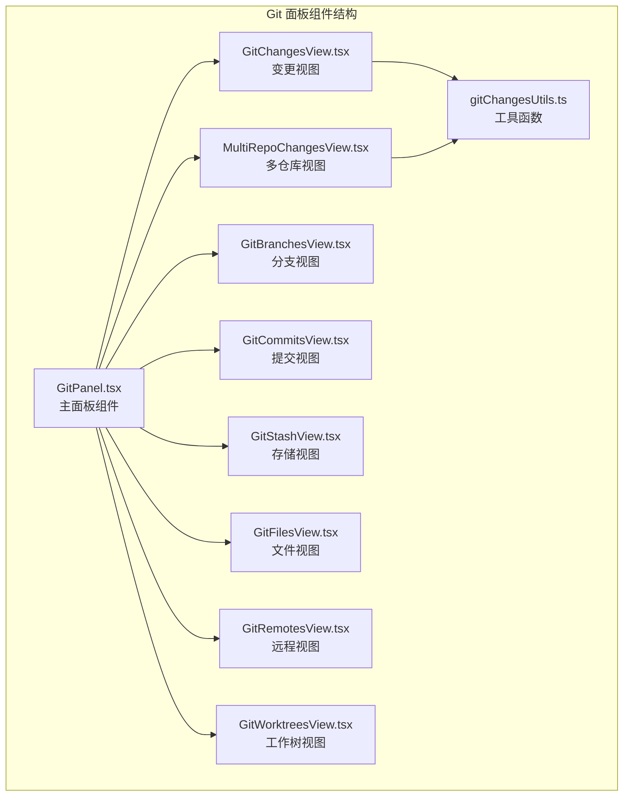
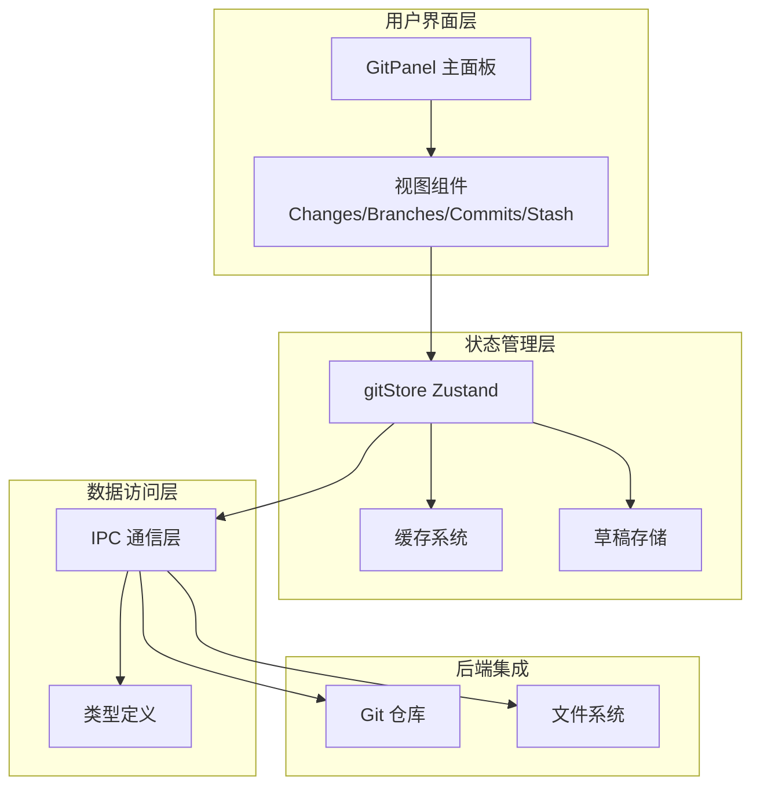
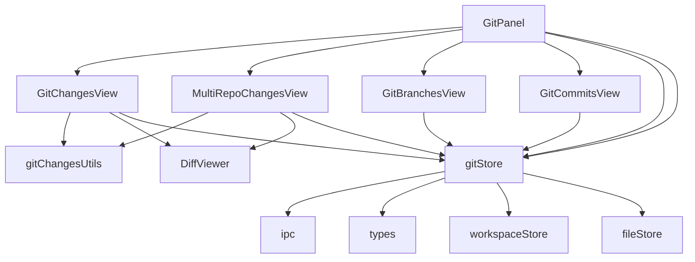

# Git 面板组件接口

<cite>
**本文档引用的文件**
- [GitPanel.tsx](file://src/components/git/GitPanel.tsx)
- [gitStore.ts](file://src/stores/gitStore.ts)
- [gitChangesUtils.ts](file://src/components/git/gitChangesUtils.ts)
- [GitChangesView.tsx](file://src/components/git/GitChangesView.tsx)
- [MultiRepoChangesView.tsx](file://src/components/git/MultiRepoChangesView.tsx)
- [GitBranchesView.tsx](file://src/components/git/GitBranchesView.tsx)
- [GitCommitsView.tsx](file://src/components/git/GitCommitsView.tsx)
- [GitStashView.tsx](file://src/components/git/GitStashView.tsx)
- [gitFlyoutRegion.ts](file://src/lib/gitFlyoutRegion.ts)
- [ipc.ts](file://src/lib/ipc.ts)
- [types.ts](file://src/types.ts)
</cite>

## 目录
1. [简介](#简介)
2. [项目结构](#项目结构)
3. [核心组件](#核心组件)
4. [架构概览](#架构概览)
5. [详细组件分析](#详细组件分析)
6. [依赖关系分析](#依赖关系分析)
7. [性能考虑](#性能考虑)
8. [故障排除指南](#故障排除指南)
9. [结论](#结论)

## 简介

Git 面板组件是 Panes 应用程序中的核心 Git 集成界面，提供了完整的版本控制功能。该组件实现了现代化的 Git 工作流程，包括仓库状态管理、分支操作、提交历史查看、文件变更处理等功能。

本组件采用 React 构建，结合 Zustand 状态管理库，通过 IPC 通信与后端 Git 操作进行交互。支持单仓库和多仓库模式，提供实时状态更新和差异比较功能。

## 项目结构

Git 面板组件位于 `src/components/git/` 目录下，包含以下关键文件：



**图表来源**
- [GitPanel.tsx:1-864](file://src/components/git/GitPanel.tsx#L1-L864)
- [gitChangesUtils.ts:1-144](file://src/components/git/gitChangesUtils.ts#L1-L144)

**章节来源**
- [GitPanel.tsx:1-864](file://src/components/git/GitPanel.tsx#L1-L864)
- [gitChangesUtils.ts:1-144](file://src/components/git/gitChangesUtils.ts#L1-L144)

## 核心组件

### Git 面板主组件

GitPanel 是整个 Git 功能的入口点，负责协调各个子组件的工作。

**主要功能特性：**
- 多视图切换（变更、分支、提交、存储、工作树）
- 实时仓库状态监控
- 多仓库支持
- 工作树管理
- Git 事件监听和响应

**核心属性接口：**
```typescript
interface Props {
  mode?: "docked" | "flyout";
  visible?: boolean;
  onPin?: () => void;
}
```

**状态管理接口：**
- `status`: Git 仓库状态
- `loading`: 加载状态
- `error`: 错误信息
- `activeView`: 当前激活的视图
- `activeRepoPath`: 当前活动仓库路径
- `remoteSyncAction`: 远程同步操作状态

**章节来源**
- [GitPanel.tsx:42-82](file://src/components/git/GitPanel.tsx#L42-L82)

### Git 状态存储

gitStore 提供了完整的 Git 状态管理和缓存机制：

**缓存策略：**
- Git 状态缓存（1秒 TTL）
- 差异内容缓存（1.2秒 TTL）
- 最大缓存条目限制（32个状态，320个差异）
- 缓存字节大小限制（状态3MB，差异24MB）

**核心方法接口：**
- `refresh(repoPath, options)`: 刷新仓库状态
- `selectFile(repoPath, filePath, staged)`: 选择文件查看差异
- `stage/unstage/discard`: 文件状态操作
- `commit(message)`: 提交更改
- `fetch/pull/push`: 远程操作

**章节来源**
- [gitStore.ts:15-25](file://src/stores/gitStore.ts#L15-L25)
- [gitStore.ts:351-430](file://src/stores/gitStore.ts#L351-L430)

## 架构概览

Git 面板采用分层架构设计，确保组件间的松耦合和高内聚：



**图表来源**
- [gitStore.ts:476-654](file://src/stores/gitStore.ts#L476-L654)
- [ipc.ts:73-648](file://src/lib/ipc.ts#L73-L648)

## 详细组件分析

### 变更视图组件

GitChangesView 负责显示和管理文件变更：

**核心功能：**
- 文件状态分类（已暂存、未暂存）
- 差异内容预览
- 批量操作支持
- 实时状态更新

**数据结构：**
```typescript
interface GitFileStatus {
  path: string;
  indexStatus?: string;
  worktreeStatus?: string;
}

interface GitStatus {
  branch: string;
  files: GitFileStatus[];
  ahead: number;
  behind: number;
}
```

**操作接口：**
- `stageMany(files)`: 批量暂存文件
- `unstageMany(files)`: 批量取消暂存
- `discardFiles(files)`: 放弃文件更改
- `commit(message)`: 提交更改

**章节来源**
- [GitChangesView.tsx:104-752](file://src/components/git/GitChangesView.tsx#L104-L752)
- [types.ts:731-742](file://src/types.ts#L731-L742)

### 多仓库视图组件

MultiRepoChangesView 支持同时监控多个仓库的状态：

**核心特性：**
- 并行仓库状态获取
- 自动刷新机制
- 仓库状态排序
- 事件驱动更新

**刷新策略：**
- 文件系统监听器触发（550ms 延迟）
- 定时轮询（8秒间隔）
- 手动强制刷新

**章节来源**
- [MultiRepoChangesView.tsx:56-341](file://src/components/git/MultiRepoChangesView.tsx#L56-L341)

### 分支管理视图

GitBranchesView 提供完整的分支管理功能：

**功能特性：**
- 分支列表显示
- 分支搜索过滤
- 分支操作菜单
- 远程分支支持

**操作接口：**
- `loadBranches(scope, search)`: 加载分支列表
- `checkoutBranch(name, isRemote)`: 切换分支
- `createBranch(name, fromRef)`: 创建新分支
- `renameBranch(oldName, newName)`: 重命名分支
- `deleteBranch(name, force)`: 删除分支

**章节来源**
- [GitBranchesView.tsx:29-635](file://src/components/git/GitBranchesView.tsx#L29-L635)

### 提交历史视图

GitCommitsView 展示提交历史和详情：

**核心功能：**
- 提交列表分页加载
- 提交详情查看
- 提交过滤搜索
- 差异内容展示

**数据模型：**
```typescript
interface GitCommit {
  hash: string;
  shortHash: string;
  authorName: string;
  authorEmail: string;
  subject: string;
  body: string;
  authoredAt: string;
}
```

**章节来源**
- [GitCommitsView.tsx:13-236](file://src/components/git/GitCommitsView.tsx#L13-L236)
- [types.ts:795-803](file://src/types.ts#L795-L803)

### 存储管理视图

GitStashView 管理 Git 存储功能：

**功能特性：**
- 存储消息输入
- 存储列表管理
- 存储应用和弹出
- 过滤搜索功能

**操作接口：**
- `pushStash(message)`: 推送存储
- `applyStash(index)`: 应用存储
- `popStash(index)`: 弹出存储

**章节来源**
- [GitStashView.tsx:14-266](file://src/components/git/GitStashView.tsx#L14-L266)

### 工具函数模块

gitChangesUtils 提供文件变更处理的辅助功能：

**核心功能：**
- 目录树构建
- 文件状态标签映射
- 行渲染优化
- 性能缓存

**数据结构：**
```typescript
interface TreeNode {
  name: string;
  path: string;
  dirs: Map<string, TreeNode>;
  files: GitFileStatus[];
}

type ChangeSection = "changes" | "staged";
```

**章节来源**
- [gitChangesUtils.ts:1-144](file://src/components/git/gitChangesUtils.ts#L1-L144)

## 依赖关系分析

Git 面板组件之间的依赖关系如下：



**图表来源**
- [GitPanel.tsx:31-36](file://src/components/git/GitPanel.tsx#L31-L36)
- [gitStore.ts:1-14](file://src/stores/gitStore.ts#L1-L14)

**章节来源**
- [GitPanel.tsx:1-864](file://src/components/git/GitPanel.tsx#L1-L864)
- [gitStore.ts:1-800](file://src/stores/gitStore.ts#L1-L800)

## 性能考虑

### 缓存策略

Git 面板实现了多层次的缓存机制以优化性能：

**内存缓存：**
- Git 状态缓存：1秒 TTL，最多32个条目
- 差异内容缓存：1.2秒 TTL，最多320个条目
- 字节大小限制：状态3MB，差异24MB

**网络优化：**
- 批量请求处理
- 请求去重机制
- 智能刷新调度

### 渲染优化

**虚拟化技术：**
- 大列表使用虚拟滚动
- 条件渲染减少 DOM 节点
- 状态最小化更新

**异步处理：**
- 操作流水线避免阻塞 UI
- 错误边界处理
- 加载状态指示

## 故障排除指南

### 常见问题诊断

**仓库无响应：**
1. 检查 IPC 连接状态
2. 验证仓库路径有效性
3. 查看 gitStore 错误状态

**状态不同步：**
1. 确认文件监听器正常工作
2. 检查刷新定时器设置
3. 验证缓存失效机制

**性能问题：**
1. 监控缓存命中率
2. 检查内存使用情况
3. 优化批量操作

### 错误处理机制

**错误传播：**
- 组件级错误捕获
- 全局错误状态管理
- 用户友好的错误提示

**恢复策略：**
- 自动重试机制
- 回退到基础状态
- 用户手动干预选项

**章节来源**
- [gitStore.ts:611-620](file://src/stores/gitStore.ts#L611-L620)
- [GitPanel.tsx:766-777](file://src/components/git/GitPanel.tsx#L766-L777)

## 结论

Git 面板组件提供了一个完整、高效且用户友好的 Git 管理界面。通过合理的架构设计和优化策略，该组件能够处理复杂的 Git 操作，同时保持良好的性能和用户体验。

**主要优势：**
- 模块化设计便于维护和扩展
- 智能缓存机制提升性能
- 实时状态更新增强用户体验
- 多仓库支持满足复杂需求
- 完整的错误处理和恢复机制

该组件为开发者提供了强大的 Git 功能集成解决方案，适用于各种规模的项目和团队协作场景。