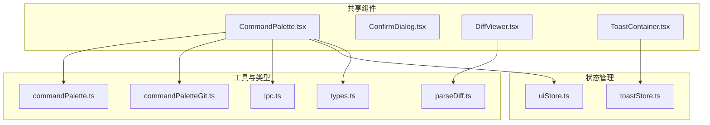
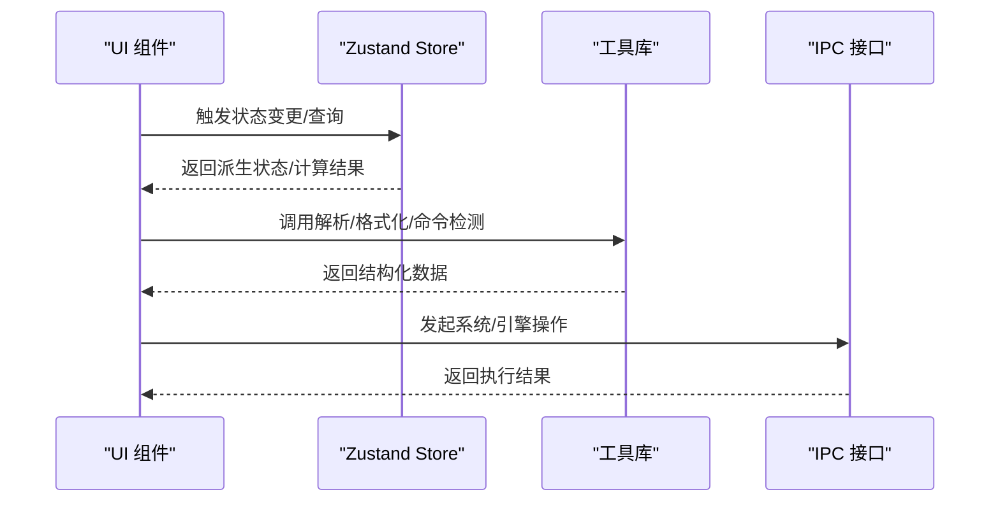
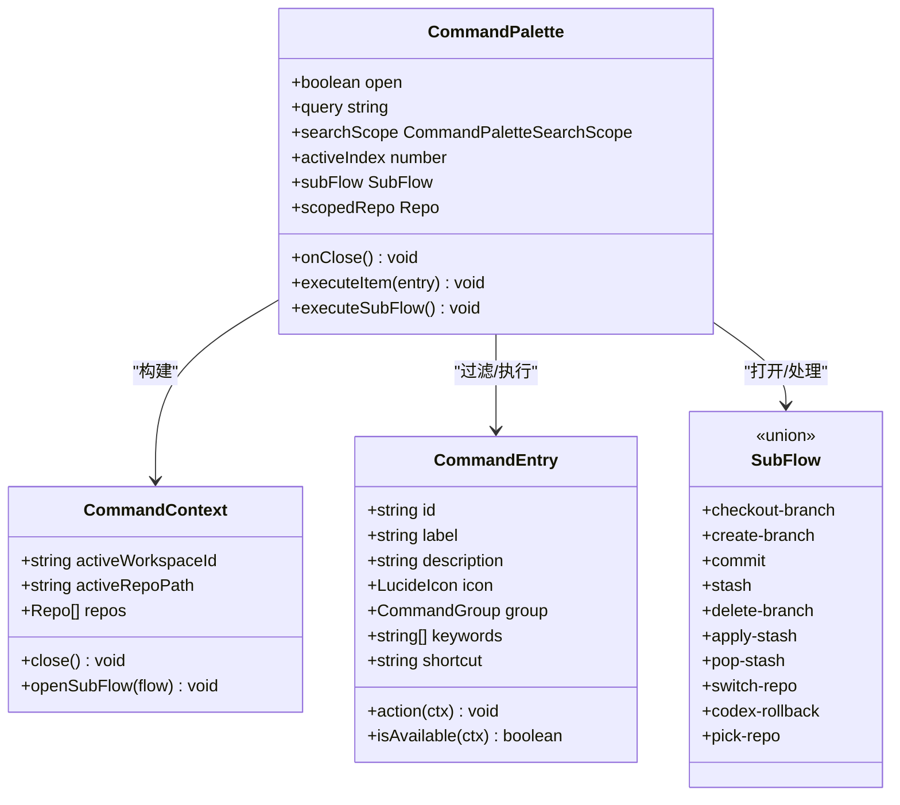
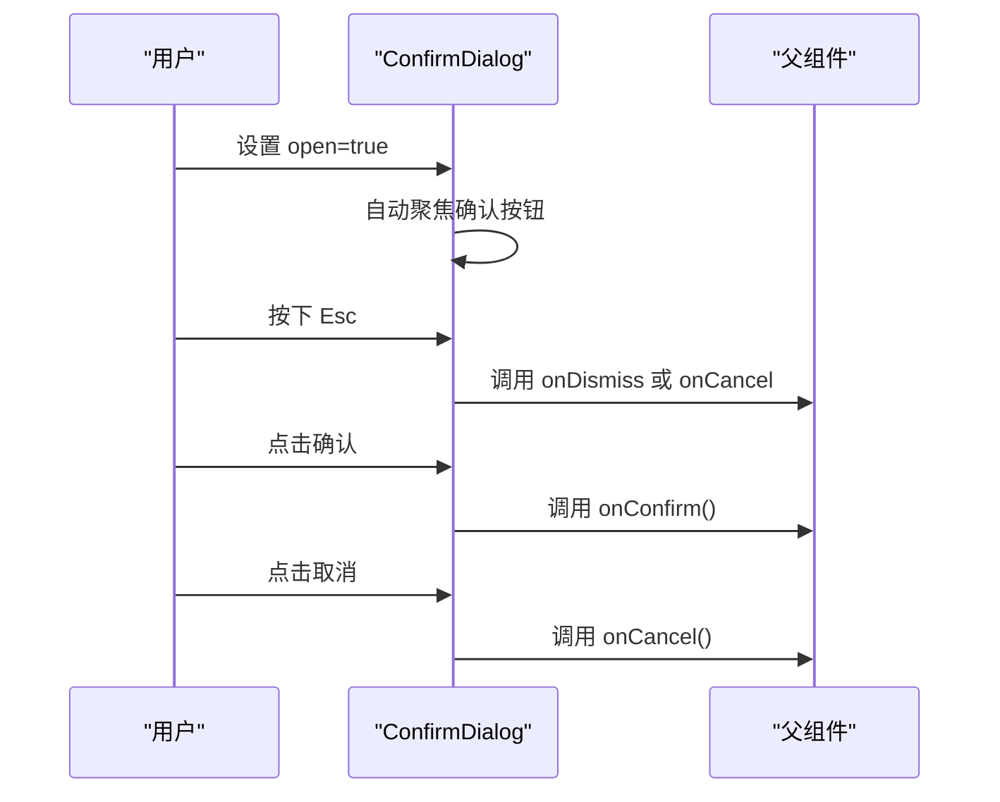
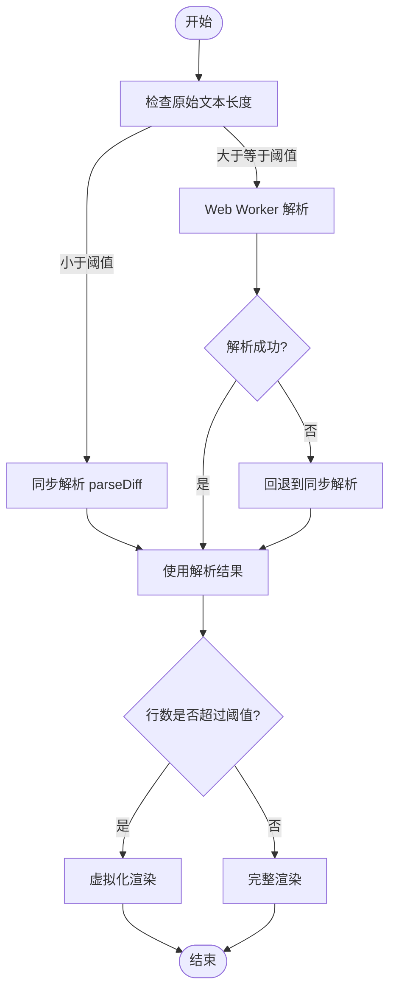
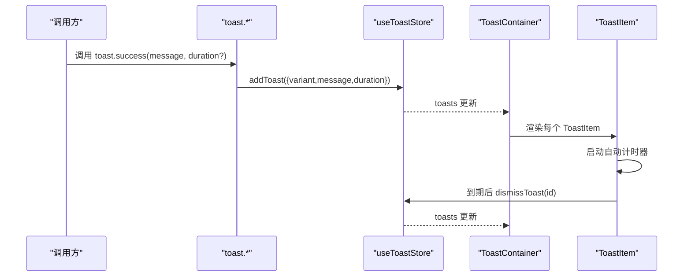
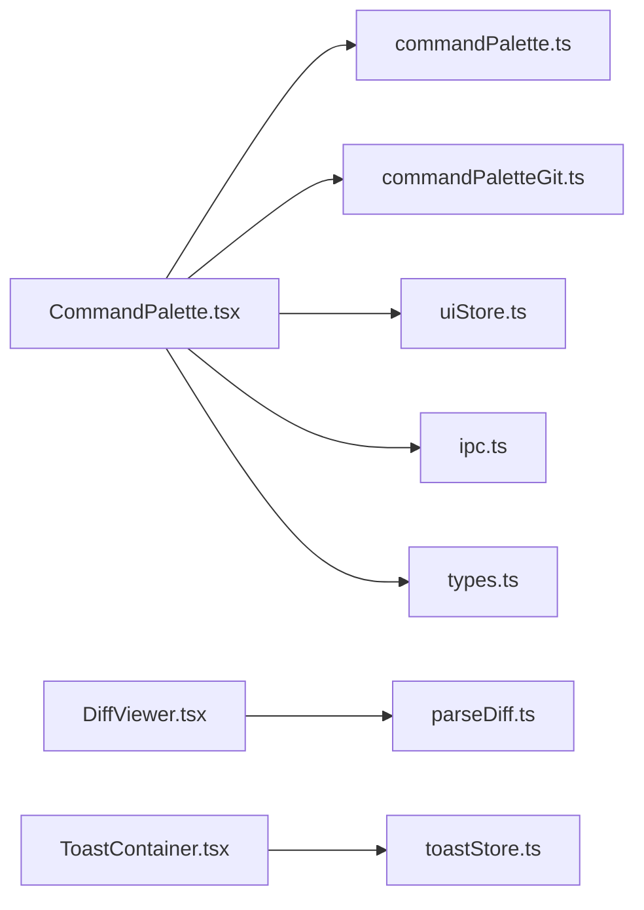

# 共享组件接口

<cite>
**本文档引用的文件**
- [CommandPalette.tsx](file://src/components/shared/CommandPalette.tsx)
- [ConfirmDialog.tsx](file://src/components/shared/ConfirmDialog.tsx)
- [DiffViewer.tsx](file://src/components/shared/DiffViewer.tsx)
- [ToastContainer.tsx](file://src/components/shared/ToastContainer.tsx)
- [toastStore.ts](file://src/stores/toastStore.ts)
- [commandPalette.ts](file://src/lib/commandPalette.ts)
- [commandPaletteGit.ts](file://src/lib/commandPaletteGit.ts)
- [parseDiff.ts](file://src/lib/parseDiff.ts)
- [ipc.ts](file://src/lib/ipc.ts)
- [uiStore.ts](file://src/stores/uiStore.ts)
- [types.ts](file://src/types.ts)
</cite>

## 目录
1. [简介](#简介)
2. [项目结构](#项目结构)
3. [核心组件](#核心组件)
4. [架构总览](#架构总览)
5. [详细组件分析](#详细组件分析)
6. [依赖关系分析](#依赖关系分析)
7. [性能考量](#性能考量)
8. [故障排查指南](#故障排查指南)
9. [结论](#结论)
10. [附录](#附录)

## 简介
本文件系统化梳理 Panes 应用中的共享组件接口，重点覆盖以下通用组件：
- CommandPalette：命令调色板，支持多前缀、搜索范围切换与子流程交互
- ConfirmDialog：确认对话框，提供可访问性的键盘与焦点控制
- DiffViewer：差异展示器，包含解析、虚拟化渲染与 Web Worker 解析策略
- ToastContainer：全局提示容器，基于 zustand 状态管理

文档从接口定义、通用属性与事件、样式定制、复用模式、状态管理与生命周期、组件间通信与数据传递、可扩展性与自定义配置等维度进行深入说明，并辅以可视化图示帮助理解。

## 项目结构
共享组件位于 src/components/shared 目录，配合 src/stores 与 src/lib 提供的状态与工具能力，形成统一的跨功能复用层。

图表来源
- [CommandPalette.tsx](file://src/components/shared/CommandPalette.tsx)
- [ConfirmDialog.tsx](file://src/components/shared/ConfirmDialog.tsx)
- [DiffViewer.tsx](file://src/components/shared/DiffViewer.tsx)
- [ToastContainer.tsx](file://src/components/shared/ToastContainer.tsx)
- [toastStore.ts](file://src/stores/toastStore.ts)
- [uiStore.ts](file://src/stores/uiStore.ts)
- [commandPalette.ts](file://src/lib/commandPalette.ts)
- [commandPaletteGit.ts](file://src/lib/commandPaletteGit.ts)
- [parseDiff.ts](file://src/lib/parseDiff.ts)
- [ipc.ts](file://src/lib/ipc.ts)
- [types.ts](file://src/types.ts)

章节来源
- [CommandPalette.tsx](file://src/components/shared/CommandPalette.tsx)
- [ConfirmDialog.tsx](file://src/components/shared/ConfirmDialog.tsx)
- [DiffViewer.tsx](file://src/components/shared/DiffViewer.tsx)
- [ToastContainer.tsx](file://src/components/shared/ToastContainer.tsx)
- [toastStore.ts](file://src/stores/toastStore.ts)
- [uiStore.ts](file://src/stores/uiStore.ts)
- [commandPalette.ts](file://src/lib/commandPalette.ts)
- [commandPaletteGit.ts](file://src/lib/commandPaletteGit.ts)
- [parseDiff.ts](file://src/lib/parseDiff.ts)
- [ipc.ts](file://src/lib/ipc.ts)
- [types.ts](file://src/types.ts)

## 核心组件
- CommandPalette：提供命令注册、上下文感知过滤、子流程（分支、stash、Codex 操作）与搜索范围切换
- ConfirmDialog：提供确认/取消回调与可选的关闭回调，支持 Esc 键盘关闭
- DiffViewer：提供差异解析与虚拟化渲染，自动选择同步或 Worker 解析路径
- ToastContainer：全局提示容器，基于 toastStore 的状态驱动渲染

章节来源
- [CommandPalette.tsx](file://src/components/shared/CommandPalette.tsx)
- [ConfirmDialog.tsx](file://src/components/shared/ConfirmDialog.tsx)
- [DiffViewer.tsx](file://src/components/shared/DiffViewer.tsx)
- [ToastContainer.tsx](file://src/components/shared/ToastContainer.tsx)
- [toastStore.ts](file://src/stores/toastStore.ts)

## 架构总览
组件间通过状态存储与工具库解耦，UI 组件仅负责视图与交互，业务逻辑由 store 与 lib 层承载。

图表来源
- [CommandPalette.tsx](file://src/components/shared/CommandPalette.tsx)
- [ToastContainer.tsx](file://src/components/shared/ToastContainer.tsx)
- [toastStore.ts](file://src/stores/toastStore.ts)
- [commandPalette.ts](file://src/lib/commandPalette.ts)
- [parseDiff.ts](file://src/lib/parseDiff.ts)
- [ipc.ts](file://src/lib/ipc.ts)

## 详细组件分析

### CommandPalette 组件接口
- 组件职责
  - 命令注册与过滤：静态命令集合，按上下文可用性筛选
  - 子流程：分支检出/创建、提交、stash、Codex 回滚等
  - 搜索范围：消息、文件、线程、全部
  - 输入模式：默认、命令、线程、工作区、文件、搜索、自动
- 关键接口
  - Props
    - open: 是否显示
    - onClose: 关闭回调
  - 内部状态
    - query: 查询字符串
    - searchScope: 当前搜索范围
    - activeIndex: 当前高亮项索引
    - subFlow: 子流程状态
    - scopedRepo: 作用域仓库
  - 命令上下文 CommandContext
    - activeWorkspaceId: 当前工作区
    - activeRepoPath: 当前仓库
    - repos: 活跃仓库列表
    - close(): 关闭调色板
    - openSubFlow(flow): 打开子流程
  - 命令条目 CommandEntry
    - id: 唯一标识
    - label: 显示名称
    - description?: 描述
    - icon: 图标组件
    - group: 分组（布局、Git、Harness、导航、视图、Codex）
    - keywords?: 关键词
    - shortcut?: 快捷键
    - action(ctx): 执行动作
    - isAvailable?(ctx): 可用性判断
- 事件与交互
  - 键盘：上下箭头、回车、Tab、Esc
  - 点击：选择命令或子流程项
- 生命周期
  - 打开时初始化查询与搜索范围；关闭时清理状态
- 复用模式
  - 通过 getStaticCommands 注册静态命令，结合 CommandContext 动态注入上下文
- 样式定制
  - 使用主题变量与类名组合，支持分组标题、快捷键样式、空状态样式
- 数据传递
  - 通过 stores(uiStore、workspaceStore、gitStore、threadStore 等) 与 ipc 进行数据/动作交互
- 可扩展性
  - 新增命令：在 getStaticCommands 中添加 CommandEntry
  - 新增子流程：定义 SubFlow 类型并在 action 中 openSubFlow
  - 自定义可用性：利用 isAvailable(ctx) 控制命令可见性

图表来源
- [CommandPalette.tsx](file://src/components/shared/CommandPalette.tsx)
- [commandPalette.ts](file://src/lib/commandPalette.ts)
- [commandPaletteGit.ts](file://src/lib/commandPaletteGit.ts)
- [types.ts](file://src/types.ts)

章节来源
- [CommandPalette.tsx](file://src/components/shared/CommandPalette.tsx)
- [commandPalette.ts](file://src/lib/commandPalette.ts)
- [commandPaletteGit.ts](file://src/lib/commandPaletteGit.ts)
- [types.ts](file://src/types.ts)

### ConfirmDialog 组件接口
- 组件职责
  - 提供确认/取消对话框，支持可选的关闭回调
- 关键接口
  - Props
    - open: 是否显示
    - title: 标题
    - message: 文本内容
    - confirmLabel?: 确认按钮文本
    - cancelLabel?: 取消按钮文本
    - onConfirm(): 确认回调
    - onCancel(): 取消回调
    - onDismiss?(): 关闭回调（未提供则回退到 onCancel）
- 事件与交互
  - Esc 键触发 onDismiss/onCancel
  - 点击背景或取消按钮触发 onCancel
  - 点击确认按钮触发 onConfirm
- 生命周期
  - 显示时自动聚焦确认按钮；隐藏时清理定时器
- 样式定制
  - 基于类名与主题变量实现卡片、图标、按钮样式
- 数据传递
  - 无外部状态依赖，纯 UI 交互组件

图表来源
- [ConfirmDialog.tsx](file://src/components/shared/ConfirmDialog.tsx)

章节来源
- [ConfirmDialog.tsx](file://src/components/shared/ConfirmDialog.tsx)

### DiffViewer 组件接口
- 组件职责
  - 解析并渲染 Git 差异，支持大文件的 Web Worker 解析与虚拟化渲染
- 关键接口
  - useParsedDiff(raw, options)
    - enabled?: 是否启用解析
    - 返回 parseResult、loading、parseAttempted
  - VirtualizedDiffBody(props)
    - parsed: 解析后的行数组
    - fillAvailableHeight?: 是否填充可用高度
    - maxHeight?: 最大高度
    - style?: 自定义样式
- 解析策略
  - 小于阈值：同步解析
  - 超过阈值：Web Worker 异步解析，失败回退到同步
  - 空闲回收：无任务时延迟终止 Worker
- 虚拟化
  - 行数超过阈值启用虚拟化，使用二分查找定位可视窗口
  - 支持滚动与 ResizeObserver 监听容器尺寸变化
- 性能参数
  - 阈值、行高、Hunk 高度、视口高度、overscan 等常量
- 样式定制
  - 基于行类型（新增/删除/上下文/Hunk/Meta）应用不同类名
- 数据传递
  - 通过 props 传入原始 diff 文本，内部维护解析状态

图表来源
- [DiffViewer.tsx](file://src/components/shared/DiffViewer.tsx)
- [parseDiff.ts](file://src/lib/parseDiff.ts)

章节来源
- [DiffViewer.tsx](file://src/components/shared/DiffViewer.tsx)
- [parseDiff.ts](file://src/lib/parseDiff.ts)

### ToastContainer 组件接口
- 组件职责
  - 渲染全局提示，支持多种类型（成功/错误/警告/信息），自动定时消失与手动关闭
- 关键接口
  - Props
    - 无（通过 store 订阅 toasts）
  - ToastItem
    - id: 提示唯一标识
    - variant: 类型
    - message: 文本
    - duration: 持续时间
- 状态管理
  - useToastStore：提供 addToast 与 dismissToast
  - toast：便捷方法（success/error/warning/info）
- 生命周期
  - 自动计时器到期后触发出场动画，结束后从 store 移除
- 样式定制
  - 基于 variant 应用不同样式与图标
- 数据传递
  - 通过 zustand store 单向流驱动渲染

图表来源
- [ToastContainer.tsx](file://src/components/shared/ToastContainer.tsx)
- [toastStore.ts](file://src/stores/toastStore.ts)

章节来源
- [ToastContainer.tsx](file://src/components/shared/ToastContainer.tsx)
- [toastStore.ts](file://src/stores/toastStore.ts)

## 依赖关系分析
- CommandPalette 依赖
  - 命令与搜索：commandPalette.ts
  - Git 上下文：commandPaletteGit.ts
  - 状态：uiStore.ts、workspaceStore.ts、gitStore.ts、threadStore.ts、chatStore.ts、fileStore.ts、harnessStore.ts、keepAwakeStore.ts
  - IPC：ipc.ts
  - 类型：types.ts
- DiffViewer 依赖
  - 解析：parseDiff.ts
  - Web Worker：diffParser.worker.ts（由 DiffViewer.tsx 动态加载）
- ToastContainer 依赖
  - 状态：toastStore.ts
- ConfirmDialog 为纯 UI 组件，依赖 i18n 与 Portal

图表来源
- [CommandPalette.tsx](file://src/components/shared/CommandPalette.tsx)
- [ConfirmDialog.tsx](file://src/components/shared/ConfirmDialog.tsx)
- [DiffViewer.tsx](file://src/components/shared/DiffViewer.tsx)
- [ToastContainer.tsx](file://src/components/shared/ToastContainer.tsx)
- [toastStore.ts](file://src/stores/toastStore.ts)
- [commandPalette.ts](file://src/lib/commandPalette.ts)
- [commandPaletteGit.ts](file://src/lib/commandPaletteGit.ts)
- [parseDiff.ts](file://src/lib/parseDiff.ts)
- [ipc.ts](file://src/lib/ipc.ts)
- [uiStore.ts](file://src/stores/uiStore.ts)
- [types.ts](file://src/types.ts)

章节来源
- [CommandPalette.tsx](file://src/components/shared/CommandPalette.tsx)
- [ConfirmDialog.tsx](file://src/components/shared/ConfirmDialog.tsx)
- [DiffViewer.tsx](file://src/components/shared/DiffViewer.tsx)
- [ToastContainer.tsx](file://src/components/shared/ToastContainer.tsx)
- [toastStore.ts](file://src/stores/toastStore.ts)
- [commandPalette.ts](file://src/lib/commandPalette.ts)
- [commandPaletteGit.ts](file://src/lib/commandPaletteGit.ts)
- [parseDiff.ts](file://src/lib/parseDiff.ts)
- [ipc.ts](file://src/lib/ipc.ts)
- [uiStore.ts](file://src/stores/uiStore.ts)
- [types.ts](file://src/types.ts)

## 性能考量
- DiffViewer
  - 大文本自动走 Web Worker，避免阻塞主线程
  - 虚拟化渲染仅渲染可视区域，降低 DOM 节点数量
  - 空闲回收 Worker，减少内存占用
- CommandPalette
  - 模糊匹配与缓存策略（文件搜索缓存限制）
  - 子流程懒加载与状态隔离
- ToastContainer
  - 限制最大提示数量，避免无限增长
  - 出场动画与计时器清理，防止内存泄漏

## 故障排查指南
- CommandPalette
  - 若命令不可见：检查 isAvailable(ctx) 条件与 activeRepoPath/repo 列表
  - 子流程异常：确认 openSubFlow 调用与状态重置逻辑
- ConfirmDialog
  - Esc 不生效：确认监听绑定与事件冒泡阻止
  - 焦点问题：确认自动聚焦逻辑与显示时机
- DiffViewer
  - Worker 报错：查看 onerror 回调与回退逻辑
  - 虚拟化滚动异常：检查容器尺寸监听与滚动事件
- ToastContainer
  - 提示不消失：检查 duration 与自动计时器清理
  - 重复提示：确认 id 生成与去重逻辑

章节来源
- [CommandPalette.tsx](file://src/components/shared/CommandPalette.tsx)
- [ConfirmDialog.tsx](file://src/components/shared/ConfirmDialog.tsx)
- [DiffViewer.tsx](file://src/components/shared/DiffViewer.tsx)
- [ToastContainer.tsx](file://src/components/shared/ToastContainer.tsx)
- [toastStore.ts](file://src/stores/toastStore.ts)

## 结论
上述共享组件通过清晰的接口定义、状态与工具解耦、以及可扩展的命令/子流程机制，实现了高复用与低耦合的 UI 能力层。建议在新增组件时遵循现有模式：明确 Props/事件/状态边界，优先使用 store 与 lib，保持 UI 组件的纯净与可测试性。

## 附录
- 常用类型参考
  - CommandPaletteSearchScope：all/messages/files/threads
  - CommandGroup：layout/git/harness/navigation/view/codex
  - Toast：success/error/warning/info
- 命令注册最佳实践
  - 为新命令提供 keywords 与 description，便于模糊匹配与可访问性
  - 使用 isAvailable(ctx) 控制上下文相关命令
  - 通过 CommandContext.close() 与 openSubFlow() 管理调色板行为