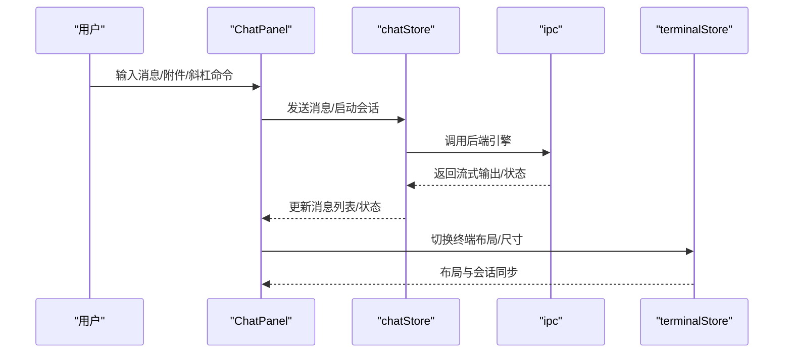
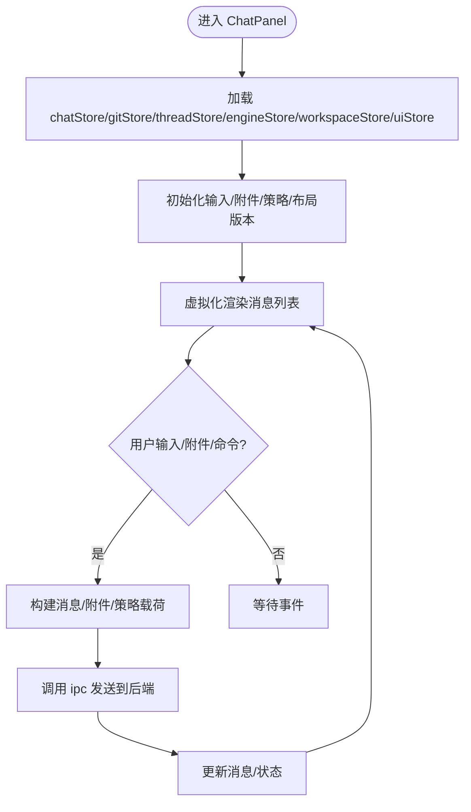
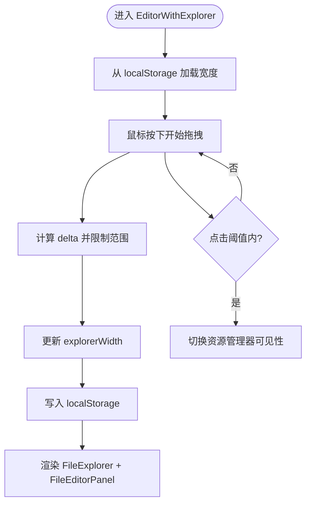
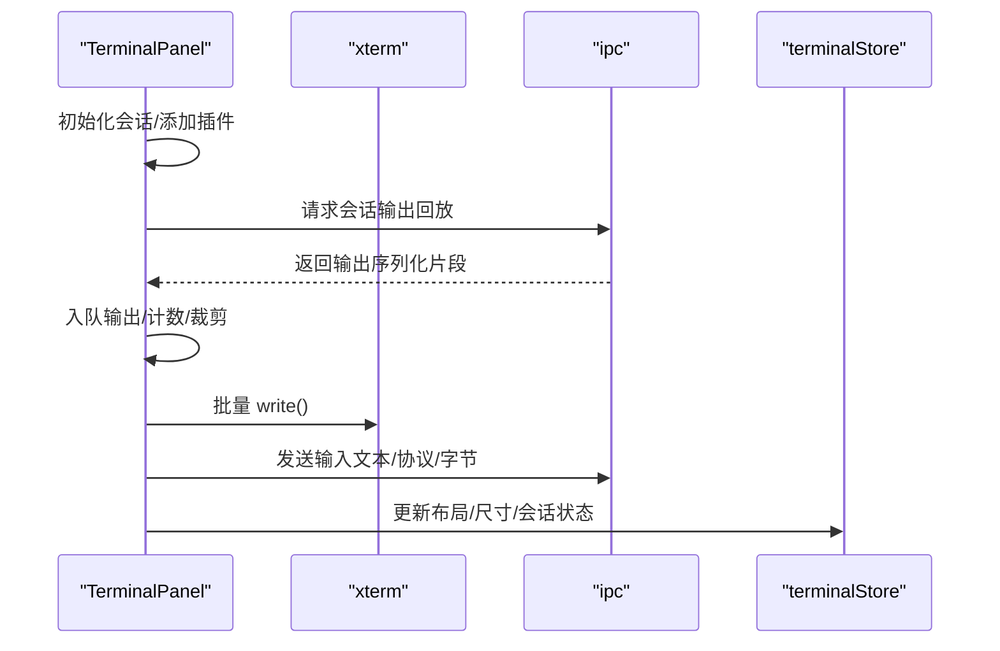
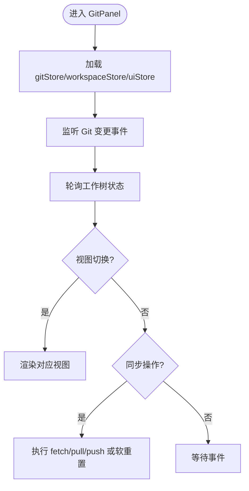
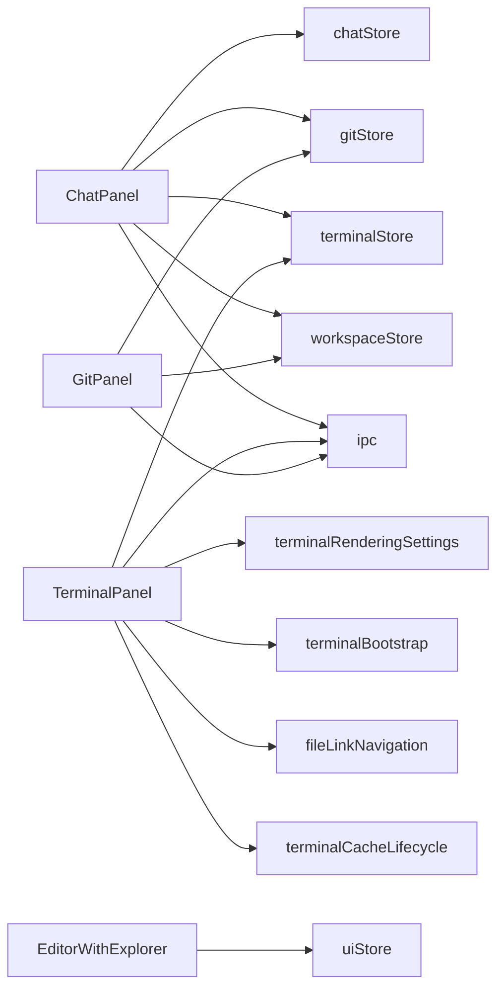

# 组件接口

<cite>
**本文引用的文件**
- [ChatPanel.tsx](file://src/components/chat/ChatPanel.tsx)
- [EditorWithExplorer.tsx](file://src/components/editor/EditorWithExplorer.tsx)
- [TerminalPanel.tsx](file://src/components/terminal/TerminalPanel.tsx)
- [GitPanel.tsx](file://src/components/git/GitPanel.tsx)
- [FileEditorPanel.tsx](file://src/components/editor/FileEditorPanel.tsx)
- [FileExplorer.tsx](file://src/components/editor/FileExplorer.tsx)
- [GitChangesView.tsx](file://src/components/git/GitChangesView.tsx)
- [GitBranchesView.tsx](file://src/components/git/GitBranchesView.tsx)
- [GitCommitsView.tsx](file://src/components/git/GitCommitsView.tsx)
- [GitStashView.tsx](file://src/components/git/GitStashView.tsx)
- [GitWorktreesView.tsx](file://src/components/git/GitWorktreesView.tsx)
- [MultiRepoChangesView.tsx](file://src/components/git/MultiRepoChangesView.tsx)
- [chatStore.ts](file://src/stores/chatStore.ts)
- [gitStore.ts](file://src/stores/gitStore.ts)
- [terminalStore.ts](file://src/stores/terminalStore.ts)
- [uiStore.ts](file://src/stores/uiStore.ts)
- [workspaceStore.ts](file://src/stores/workspaceStore.ts)
- [ipc.ts](file://src/lib/ipc.ts)
- [windowDrag.ts](file://src/lib/windowDrag.ts)
- [terminalBootstrap.ts](file://src/lib/terminalBootstrap.ts)
- [terminalRenderingSettings.ts](file://src/lib/terminalRenderingSettings.ts)
- [fileLinkNavigation.ts](file://src/lib/fileLinkNavigation.ts)
- [terminalCacheLifecycle.ts](file://src/components/terminal/terminalCacheLifecycle.ts)
</cite>

## 目录
1. [简介](#简介)
2. [项目结构](#项目结构)
3. [核心组件](#核心组件)
4. [架构总览](#架构总览)
5. [详细组件分析](#详细组件分析)
6. [依赖分析](#依赖分析)
7. [性能考量](#性能考量)
8. [故障排查指南](#故障排查指南)
9. [结论](#结论)
10. [附录](#附录)

## 简介
本文件系统性梳理 Panes 前端“面板”类核心组件的接口与行为，重点覆盖以下组件：
- ChatPanel：聊天对话面板，负责消息渲染、附件上传、模型选择、权限与审批策略等
- EditorWithExplorer：编辑器与文件资源管理器组合面板，支持拖拽调整宽度、懒加载子组件
- TerminalPanel：终端面板，集成 xterm.js，实现输入输出队列、渲染诊断、WebGL/CSS 渲染切换、会话缓存与回放
- GitPanel：Git 面板，提供多仓库扫描、视图切换（变更、分支、提交、暂存、工作树）、远程同步与操作菜单

文档从接口定义、事件处理、生命周期、内部状态、外部依赖、组件间通信与数据流等方面进行深入解析，并给出可视化图示与实践建议。

## 项目结构
这些组件位于 src/components 下的 chat、editor、terminal、git、shared 等目录中，配合 src/stores 中的状态管理与 src/lib 中的底层能力（IPC、窗口拖拽、终端引导与渲染设置、文件链接导航、终端缓存生命周期）共同构成完整功能面。

```mermaid
graph TB
subgraph "聊天"
CP["ChatPanel<br/>聊天面板"]
end
subgraph "编辑器"
EWE["EditorWithExplorer<br/>编辑器+资源管理器"]
FEP["FileEditorPanel<br/>文件编辑器"]
FE["FileExplorer<br/>文件资源管理器"]
end
subgraph "终端"
TP["TerminalPanel<br/>终端面板"]
end
subgraph "Git"
GP["GitPanel<br/>Git 面板"]
GCV["GitChangesView<br/>变更视图"]
GBV["GitBranchesView<br/>分支视图"]
GCMV["GitCommitsView<br/>提交视图"]
GSV["GitStashView<br/>暂存视图"]
GWTV["GitWorktreesView<br/>工作树视图"]
MR["MultiRepoChangesView<br/>多仓库变更视图"]
end
subgraph "状态与能力"
CS["chatStore"]
GS["gitStore"]
TS["terminalStore"]
US["uiStore"]
WS["workspaceStore"]
IPC["ipc"]
WD["windowDrag"]
TB["terminalBootstrap"]
TRS["terminalRenderingSettings"]
FLN["fileLinkNavigation"]
TCL["terminalCacheLifecycle"]
end
CP --> CS
CP --> US
CP --> WS
CP --> GS
CP --> TS
EWE --> FE
EWE --> FEP
EWE --> US
TP --> TS
TP --> US
TP --> IPC
TP --> WD
TP --> TB
TP --> TRS
TP --> FLN
TP --> TCL
GP --> GS
GP --> WS
GP --> IPC
GP --> US
GP --> GCV
GP --> GBV
GP --> GCMV
GP --> GSV
GP --> GWTV
GP --> MR
```

图表来源
- [ChatPanel.tsx:1555-1754](file://src/components/chat/ChatPanel.tsx#L1555-L1754)
- [EditorWithExplorer.tsx:32-124](file://src/components/editor/EditorWithExplorer.tsx#L32-L124)
- [TerminalPanel.tsx:60-259](file://src/components/terminal/TerminalPanel.tsx#L60-L259)
- [GitPanel.tsx:42-241](file://src/components/git/GitPanel.tsx#L42-L241)

章节来源
- [ChatPanel.tsx:1555-1754](file://src/components/chat/ChatPanel.tsx#L1555-L1754)
- [EditorWithExplorer.tsx:32-124](file://src/components/editor/EditorWithExplorer.tsx#L32-L124)
- [TerminalPanel.tsx:60-259](file://src/components/terminal/TerminalPanel.tsx#L60-L259)
- [GitPanel.tsx:42-241](file://src/components/git/GitPanel.tsx#L42-L241)

## 核心组件
本节对四个核心面板组件的 props、内部状态、事件处理与生命周期进行要点归纳。

- ChatPanel
  - props：embedded?: boolean
  - 内部状态：输入文本、附件列表、计划模式、斜杠命令菜单、选中的引擎/模型/推理强度、线程执行策略（审批策略、沙箱模式、网络策略、权限配置）、消息高度映射、滚动与布局版本等
  - 事件处理：拖拽标题栏、粘贴图片/文件、快捷键提交、附件过滤与校验、工具输入审批、消息复制、滚动到高亮消息
  - 生命周期：useEffect 监听消息变化、引擎健康预热、窗口拖拽、国际化、主题/布局适配
  - 外部依赖：chatStore、gitStore、threadStore、engineStore、workspaceStore、uiStore、ipc、windowDrag、chatEngineIds、onboarding、perfTelemetry、i18n
  - 数据流：消息列表、线程元数据、引擎能力、工作区仓库状态驱动 UI 更新与交互

- EditorWithExplorer
  - props：embedded?: boolean
  - 内部状态：资源管理器可见性、宽度、拖拽状态、本地持久化的宽度值
  - 事件处理：鼠标按下开始拖拽、移动更新宽度、松开结束拖拽；点击触发折叠/展开
  - 生命周期：useEffect 将宽度写入 localStorage；懒加载 FileExplorer 与 FileEditorPanel
  - 外部依赖：uiStore、localStorage、Suspense 懒加载
  - 数据流：UI 设置影响布局与可见性，编辑器内容由 FileEditorPanel 负责

- TerminalPanel
  - props：workspaceId: string, embedded?: boolean
  - 内部状态：xterm 实例、Fit/WebGL/Image 插件、输入/输出队列、渲染诊断、会话缓存、焦点锁定、尺寸快照
  - 事件处理：输入队列分批发送、输出批量刷新、WebGL 上下文丢失降级、图像插件初始化与错误记录、加速渲染偏好应用
  - 生命周期：模块级缓存保持滚动历史；监听窗口大小、焦点变化；定时器清理；退出/前台切换通知
  - 外部依赖：@xterm/*、ipc、terminalStore、uiStore、windowDrag、clipboard、terminalBootstrap、terminalRenderingSettings、fileLinkNavigation、terminalCacheLifecycle
  - 数据流：后端会话输出序列化增量写入前端队列，按批次刷新渲染；输入通过队列与限流策略发送

- GitPanel
  - props：mode?: "docked" | "flyout", visible?: boolean, onPin?: () => void
  - 内部状态：活动视图、错误信息、更多菜单、多仓库同步状态、仓库路径切换、软重置确认
  - 事件处理：视图切换、刷新/拉取/推送、更多菜单定位与关闭、仓库选择、工作树切换、初始化仓库
  - 生命周期：监听 Git 变更事件、轮询工作树状态、自动激活仓库、初始化仓库状态探测
  - 外部依赖：gitStore、workspaceStore、ipc、toast、Dropdown、ConfirmDialog、gitFlyoutRegion
  - 数据流：仓库状态、视图选择、远程同步动作驱动 UI 与交互

章节来源
- [ChatPanel.tsx:1555-1754](file://src/components/chat/ChatPanel.tsx#L1555-L1754)
- [EditorWithExplorer.tsx:32-124](file://src/components/editor/EditorWithExplorer.tsx#L32-L124)
- [TerminalPanel.tsx:60-259](file://src/components/terminal/TerminalPanel.tsx#L60-L259)
- [GitPanel.tsx:42-241](file://src/components/git/GitPanel.tsx#L42-L241)

## 架构总览
下面以时序图展示关键交互流程。

图表来源
- [ChatPanel.tsx:1605-1754](file://src/components/chat/ChatPanel.tsx#L1605-L1754)
- [chatStore.ts](file://src/stores/chatStore.ts)
- [terminalStore.ts](file://src/stores/terminalStore.ts)
- [ipc.ts](file://src/lib/ipc.ts)

## 详细组件分析

### ChatPanel 分析
- 接口与属性
  - props: embedded?: boolean
  - 内部状态：输入文本、附件、计划模式、斜杠菜单、命令面板、引擎/模型/推理强度、线程执行策略、消息高度映射、滚动控制、布局版本等
- 事件与生命周期
  - 消息虚拟化渲染、高度测量、滚动到高亮、复制消息、附件拖拽/粘贴、斜杠命令面板、工具输入审批、引擎健康预热
  - 国际化、窗口拖拽、自定义标题栏适配
- 外部依赖
  - chatStore、gitStore、threadStore、engineStore、workspaceStore、uiStore、ipc、windowDrag、chatEngineIds、onboarding、perfTelemetry、i18n
- 数据流
  - 消息列表与状态来自 chatStore；线程元数据与策略来自 threadStore；引擎能力与健康来自 engineStore；工作区仓库状态来自 workspaceStore

图表来源
- [ChatPanel.tsx:1555-1754](file://src/components/chat/ChatPanel.tsx#L1555-L1754)

章节来源
- [ChatPanel.tsx:1555-1754](file://src/components/chat/ChatPanel.tsx#L1555-L1754)

### EditorWithExplorer 分析
- 接口与属性
  - props: embedded?: boolean
  - 内部状态：资源管理器可见性、宽度、拖拽标志、本地存储键值
- 事件与生命周期
  - 鼠标按下开始拖拽，移动过程中限制最小/最大宽度，松开结束；点击阈值内触发折叠
  - 宽度变更写入 localStorage；懒加载 FileExplorer 与 FileEditorPanel
- 外部依赖
  - uiStore、localStorage、Suspense 懒加载
- 数据流
  - UI 设置决定布局与可见性；编辑器内容由 FileEditorPanel 负责

图表来源
- [EditorWithExplorer.tsx:32-124](file://src/components/editor/EditorWithExplorer.tsx#L32-L124)

章节来源
- [EditorWithExplorer.tsx:32-124](file://src/components/editor/EditorWithExplorer.tsx#L32-L124)

### TerminalPanel 分析
- 接口与属性
  - props: workspaceId: string, embedded?: boolean
  - 内部状态：xterm 实例、Fit/WebGL/Image 插件、输入/输出队列、渲染诊断、会话缓存、焦点锁定、尺寸快照
- 事件与生命周期
  - 输入队列分批发送（文本/协议/字节），输出批量刷新；WebGL 上下文丢失降级；图像插件初始化与错误记录；加速渲染偏好应用
  - 模块级缓存保持滚动历史；监听窗口大小、焦点变化；定时器清理；退出/前台切换通知
- 外部依赖
  - @xterm/*、ipc、terminalStore、uiStore、windowDrag、clipboard、terminalBootstrap、terminalRenderingSettings、fileLinkNavigation、terminalCacheLifecycle
- 数据流
  - 后端会话输出序列化增量写入前端队列，按批次刷新渲染；输入通过队列与限流策略发送

图表来源
- [TerminalPanel.tsx:60-259](file://src/components/terminal/TerminalPanel.tsx#L60-L259)

章节来源
- [TerminalPanel.tsx:60-259](file://src/components/terminal/TerminalPanel.tsx#L60-L259)

### GitPanel 分析
- 接口与属性
  - props: mode?: "docked" | "flyout", visible?: boolean, onPin?: () => void
  - 内部状态：活动视图、错误信息、更多菜单、多仓库同步状态、仓库路径切换、软重置确认
- 事件与生命周期
  - 视图切换、刷新/拉取/推送、更多菜单定位与关闭、仓库选择、工作树切换、初始化仓库
  - 监听 Git 变更事件、轮询工作树状态、自动激活仓库、初始化仓库状态探测
- 外部依赖
  - gitStore、workspaceStore、ipc、toast、Dropdown、ConfirmDialog、gitFlyoutRegion
- 数据流
  - 仓库状态、视图选择、远程同步动作驱动 UI 与交互

图表来源
- [GitPanel.tsx:42-241](file://src/components/git/GitPanel.tsx#L42-L241)

章节来源
- [GitPanel.tsx:42-241](file://src/components/git/GitPanel.tsx#L42-L241)

## 依赖分析
- 组件耦合
  - ChatPanel 与多个 store 强耦合，承担“中枢”角色，协调引擎、线程、工作区与 UI
  - TerminalPanel 与 @xterm 生态深度耦合，同时依赖 ipc 与 terminalStore
  - GitPanel 与 gitStore、workspaceStore、ipc 紧密协作
  - EditorWithExplorer 与 uiStore、localStorage 协作，懒加载子组件
- 外部依赖
  - IPC：跨进程通信，用于引擎、终端、Git 等后端能力调用
  - 窗口与拖拽：windowDrag 提供拖拽与双击标题栏最大化/还原
  - 终端引导与渲染：terminalBootstrap、terminalRenderingSettings 控制渲染加速与图像插件
  - 文件链接导航：fileLinkNavigation 支持在终端输出中点击跳转文件
  - 终端缓存生命周期：terminalCacheLifecycle 管理会话分离与回收

图表来源
- [ChatPanel.tsx:1555-1754](file://src/components/chat/ChatPanel.tsx#L1555-L1754)
- [TerminalPanel.tsx:60-259](file://src/components/terminal/TerminalPanel.tsx#L60-L259)
- [GitPanel.tsx:42-241](file://src/components/git/GitPanel.tsx#L42-L241)
- [EditorWithExplorer.tsx:32-124](file://src/components/editor/EditorWithExplorer.tsx#L32-L124)

章节来源
- [ChatPanel.tsx:1555-1754](file://src/components/chat/ChatPanel.tsx#L1555-L1754)
- [TerminalPanel.tsx:60-259](file://src/components/terminal/TerminalPanel.tsx#L60-L259)
- [GitPanel.tsx:42-241](file://src/components/git/GitPanel.tsx#L42-L241)
- [EditorWithExplorer.tsx:32-124](file://src/components/editor/EditorWithExplorer.tsx#L32-L124)

## 性能考量
- 虚拟化与批处理
  - ChatPanel 使用虚拟化渲染消息列表，结合高度测量与估算，减少重排与重绘
  - TerminalPanel 对输入/输出采用批处理与限流策略，避免阻塞主线程
- 渲染优化
  - TerminalPanel 支持 WebGL/CSS 渲染动态切换与上下文丢失降级，降低掉帧风险
  - 图像插件初始化失败时记录诊断并回退，保证稳定性
- 缓存与复用
  - TerminalPanel 采用模块级缓存保存 xterm 实例与滚动历史，跨面板切换保持体验连贯
- I/O 与网络
  - ChatPanel 在发送前进行附件与模态扩展过滤，减少无效传输
  - GitPanel 使用防抖与轮询策略，平衡实时性与性能

## 故障排查指南
- 终端渲染异常
  - 现象：终端卡顿、掉帧或图像显示异常
  - 排查：检查加速渲染偏好、WebGL 是否可用、图像插件初始化是否报错；查看渲染诊断快照与日志
  - 参考
    - [TerminalPanel.tsx:673-795](file://src/components/terminal/TerminalPanel.tsx#L673-L795)
    - [terminalRenderingSettings.ts](file://src/lib/terminalRenderingSettings.ts)
    - [terminalCacheLifecycle.ts](file://src/components/terminal/terminalCacheLifecycle.ts)
- 终端输出丢弃
  - 现象：输出被截断或提示丢弃
  - 排查：检查输出队列字符上限、附加/分离状态下的不同上限、最近丢弃时间点
  - 参考
    - [TerminalPanel.tsx:1318-1351](file://src/components/terminal/TerminalPanel.tsx#L1318-L1351)
- 终端输入丢弃
  - 现象：输入被截断
  - 排查：检查输入队列字符上限、立即发送条件（含特殊码）、丢弃冷却时间
  - 参考
    - [TerminalPanel.tsx:1179-1212](file://src/components/terminal/TerminalPanel.tsx#L1179-L1212)
- Git 面板无响应
  - 现象：视图不刷新、远程操作失败
  - 排查：确认仓库路径有效、监听事件是否生效、轮询间隔是否触发、多仓库同步状态
  - 参考
    - [GitPanel.tsx:316-513](file://src/components/git/GitPanel.tsx#L316-L513)
- 编辑器宽度异常
  - 现象：拖拽无效或宽度越界
  - 排查：检查最小/最大宽度常量、阈值判断、本地存储写入
  - 参考
    - [EditorWithExplorer.tsx:50-81](file://src/components/editor/EditorWithExplorer.tsx#L50-L81)

章节来源
- [TerminalPanel.tsx:673-795](file://src/components/terminal/TerminalPanel.tsx#L673-L795)
- [terminalRenderingSettings.ts](file://src/lib/terminalRenderingSettings.ts)
- [terminalCacheLifecycle.ts](file://src/components/terminal/terminalCacheLifecycle.ts)
- [GitPanel.tsx:316-513](file://src/components/git/GitPanel.tsx#L316-L513)
- [EditorWithExplorer.tsx:50-81](file://src/components/editor/EditorWithExplorer.tsx#L50-L81)

## 结论
上述四个面板组件构成了 Panes 的核心交互层：ChatPanel 作为中枢协调多源状态，EditorWithExplorer 提供可定制的编辑与资源管理布局，TerminalPanel 以高性能与稳健性支撑终端能力，GitPanel 则提供多仓库与多视图的 Git 工作流。它们通过统一的 store 与 lib 层能力实现解耦与扩展，具备良好的可复用性与定制化空间。

## 附录
- 组合与嵌套
  - ChatPanel 内部懒加载 TerminalPanel 与 EditorWithExplorer，形成“聊天+终端+编辑”的复合面板
  - GitPanel 内部根据视图切换渲染 GitChangesView、GitBranchesView、GitCommitsView、GitStashView、GitWorktreesView 或 MultiRepoChangesView
- 可复用性与扩展性
  - Props 设计简洁，如 embedded、mode、visible 等，便于在不同布局中复用
  - 懒加载与模块级缓存提升首屏与切换性能
  - 通过 store 与 ipc 抽象后端能力，便于替换与扩展
- 定制化选项
  - ChatPanel：引擎/模型/推理强度、线程执行策略（审批/沙箱/网络/权限）、附件过滤规则
  - TerminalPanel：加速渲染偏好、图像插件能力、WebGL 上下文丢失处理
  - GitPanel：视图切换、多仓库同步、更多菜单动作
  - EditorWithExplorer：资源管理器宽度、可见性、拖拽阈值