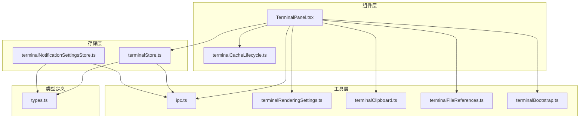
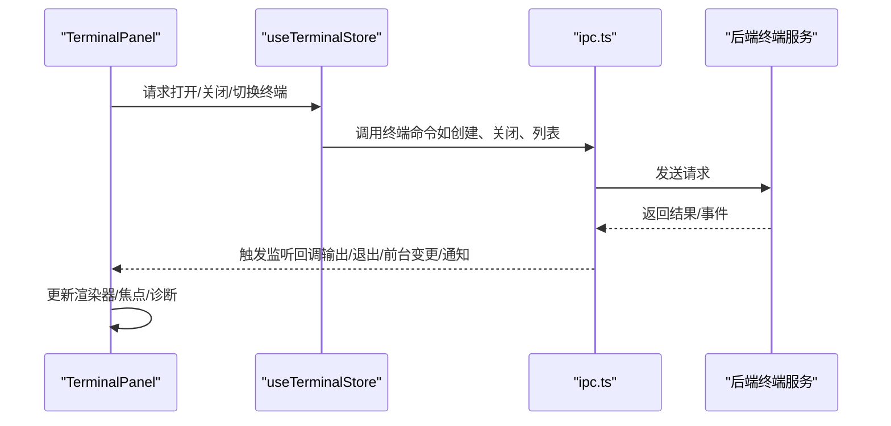
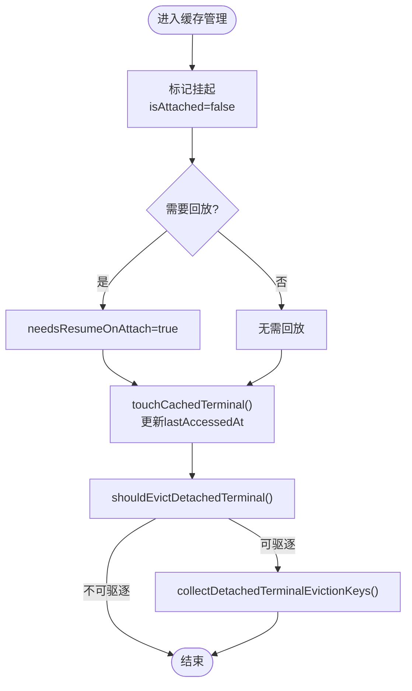
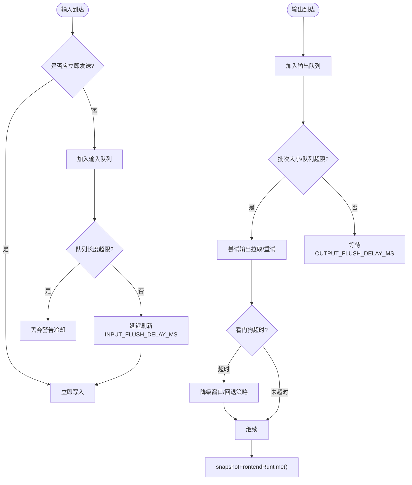
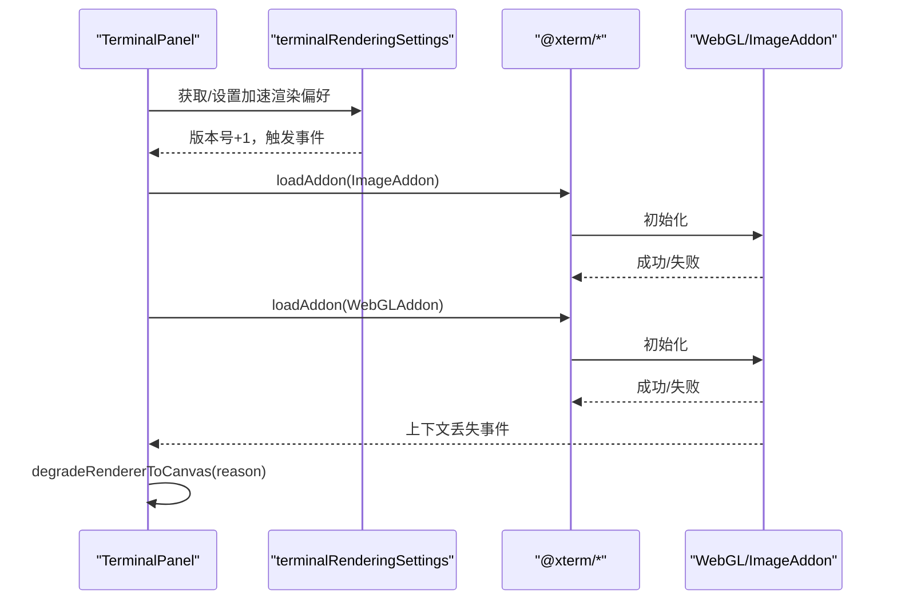
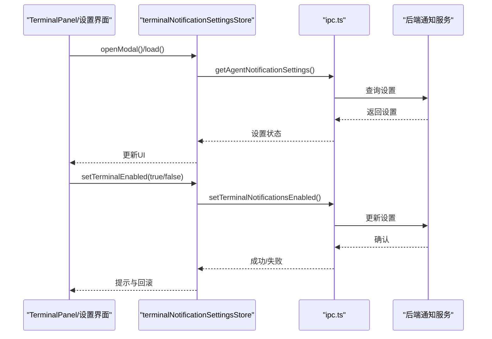
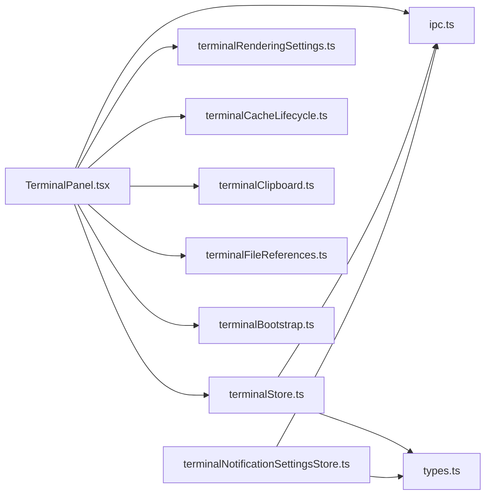

# 终端面板组件接口

<cite>
**本文档引用的文件**
- [TerminalPanel.tsx](file://src/components/terminal/TerminalPanel.tsx)
- [terminalStore.ts](file://src/stores/terminalStore.ts)
- [terminalCacheLifecycle.ts](file://src/components/terminal/terminalCacheLifecycle.ts)
- [terminalBootstrap.ts](file://src/lib/terminalBootstrap.ts)
- [terminalRenderingSettings.ts](file://src/lib/terminalRenderingSettings.ts)
- [terminalClipboard.ts](file://src/lib/terminalClipboard.ts)
- [terminalFileReferences.ts](file://src/lib/terminalFileReferences.ts)
- [terminalNotificationSettingsStore.ts](file://src/stores/terminalNotificationSettingsStore.ts)
- [ipc.ts](file://src/lib/ipc.ts)
- [types.ts](file://src/types.ts)
</cite>

## 目录
1. [简介](#简介)
2. [项目结构](#项目结构)
3. [核心组件](#核心组件)
4. [架构总览](#架构总览)
5. [详细组件分析](#详细组件分析)
6. [依赖关系分析](#依赖关系分析)
7. [性能考虑](#性能考虑)
8. [故障排查指南](#故障排查指南)
9. [结论](#结论)
10. [附录](#附录)

## 简介
本文件系统性梳理 TerminalPanel 组件的接口定义与实现边界，覆盖终端会话管理、输入输出处理、状态同步、与 terminalStore 的交互、会话生命周期与缓存机制、配置与主题、快捷键绑定、多终端支持、会话持久化与通知系统、渲染优化与性能监控等关键方面。目标是为开发者提供一份可操作、可扩展且面向生产的接口参考。

## 项目结构
TerminalPanel 所在目录位于 src/components/terminal，配合 stores 层的 terminalStore、lib 层的 IPC 与渲染设置、以及工具模块（剪贴板、文件引用、引导策略）共同构成终端子系统。

图表来源
- [TerminalPanel.tsx:1-4409](file://src/components/terminal/TerminalPanel.tsx#L1-L4409)
- [terminalStore.ts:1-2049](file://src/stores/terminalStore.ts#L1-L2049)
- [terminalCacheLifecycle.ts:1-74](file://src/components/terminal/terminalCacheLifecycle.ts#L1-L74)
- [terminalBootstrap.ts:1-45](file://src/lib/terminalBootstrap.ts#L1-L45)
- [terminalRenderingSettings.ts:1-37](file://src/lib/terminalRenderingSettings.ts#L1-L37)
- [terminalClipboard.ts:1-40](file://src/lib/terminalClipboard.ts#L1-L40)
- [terminalFileReferences.ts:1-48](file://src/lib/terminalFileReferences.ts#L1-L48)
- [terminalNotificationSettingsStore.ts:1-312](file://src/stores/terminalNotificationSettingsStore.ts#L1-L312)
- [ipc.ts:1-813](file://src/lib/ipc.ts#L1-L813)
- [types.ts:1-1304](file://src/types.ts#L1-L1304)

章节来源
- [TerminalPanel.tsx:1-4409](file://src/components/terminal/TerminalPanel.tsx#L1-L4409)
- [terminalStore.ts:1-2049](file://src/stores/terminalStore.ts#L1-L2049)

## 核心组件
- TerminalPanel：负责单个终端面板的渲染、输入输出流处理、焦点与光标控制、渲染器切换与降级、诊断数据采集与导出、事件监听与会话缓存。
- terminalStore：集中管理终端工作区状态、分组布局、会话生命周期、通知、启动预设与持久化。
- terminalCacheLifecycle：分离的缓存生命周期管理，负责挂起、回收与驱逐逻辑。
- terminalRenderingSettings：加速渲染偏好与事件广播。
- terminalClipboard：终端复制/粘贴快捷键判定。
- terminalFileReferences：终端缓冲区位置与范围计算。
- terminalNotificationSettingsStore：终端通知设置的加载、更新与集成安装。
- ipc：跨前端与后端的 IPC 接口封装，包含会话、输出、退出、前台变更、通知等事件监听与调用。
- types：终端相关类型定义，包括会话、通知、渲染诊断、通知设置等。

章节来源
- [TerminalPanel.tsx:60-218](file://src/components/terminal/TerminalPanel.tsx#L60-L218)
- [terminalStore.ts:414-501](file://src/stores/terminalStore.ts#L414-L501)
- [terminalCacheLifecycle.ts:1-74](file://src/components/terminal/terminalCacheLifecycle.ts#L1-L74)
- [terminalRenderingSettings.ts:1-37](file://src/lib/terminalRenderingSettings.ts#L1-L37)
- [terminalClipboard.ts:1-40](file://src/lib/terminalClipboard.ts#L1-L40)
- [terminalFileReferences.ts:1-48](file://src/lib/terminalFileReferences.ts#L1-L48)
- [terminalNotificationSettingsStore.ts:25-46](file://src/stores/terminalNotificationSettingsStore.ts#L25-L46)
- [ipc.ts:73-813](file://src/lib/ipc.ts#L73-L813)
- [types.ts:60-151](file://src/types.ts#L60-L151)

## 架构总览
TerminalPanel 通过 useTerminalStore 与 IPC 与后端协作，使用 @xterm/* 插件体系进行渲染与图像支持，并维护前端侧的会话缓存与诊断快照。通知系统由 terminalNotificationSettingsStore 管理，结合 IPC 的通知事件实现。

图表来源
- [TerminalPanel.tsx:1-4409](file://src/components/terminal/TerminalPanel.tsx#L1-L4409)
- [terminalStore.ts:751-800](file://src/stores/terminalStore.ts#L751-L800)
- [ipc.ts:570-780](file://src/lib/ipc.ts#L570-L780)

## 详细组件分析

### 终端面板接口定义
TerminalPanel 暴露以下关键接口与职责：
- 渲染与尺寸管理：FitAddon 自适应、像素尺寸快照、防抖调整。
- 输入输出队列与批处理：输入/输出队列长度限制、字符计数、丢弃警告冷却、刷新定时器与看门狗。
- 渲染器选择与降级：WebGL 可选启用、Canvas 回退、上下文丢失处理。
- 会话缓存与复用：模块级缓存 Map，带访问时间戳与回收策略。
- 诊断与导出：前后端渲染诊断、运行时快照、错误计数与最后错误记录。
- 焦点锁定与光标闪烁：绕过 DOM 焦点检测，强制保持光标闪烁。
- 快捷键与剪贴板：复制/粘贴快捷键判定、系统剪贴板读写。
- 文件链接与导航：从输出中提取链接、定位到工作区文件。

章节来源
- [TerminalPanel.tsx:60-218](file://src/components/terminal/TerminalPanel.tsx#L60-L218)
- [TerminalPanel.tsx:284-338](file://src/components/terminal/TerminalPanel.tsx#L284-L338)
- [TerminalPanel.tsx:350-424](file://src/components/terminal/TerminalPanel.tsx#L350-L424)
- [TerminalPanel.tsx:463-498](file://src/components/terminal/TerminalPanel.tsx#L463-L498)
- [TerminalPanel.tsx:500-550](file://src/components/terminal/TerminalPanel.tsx#L500-L550)
- [TerminalPanel.tsx:646-720](file://src/components/terminal/TerminalPanel.tsx#L646-L720)
- [TerminalPanel.tsx:722-795](file://src/components/terminal/TerminalPanel.tsx#L722-L795)

### 与 terminalStore 的接口交互
- 工作区激活准备：加载启动预设、布局模式、面板大小、打开状态。
- 会话创建与关闭：创建新会话、关闭指定会话或工作区所有会话、同步会话列表。
- 分组与布局：构建网格树、替换/移除叶子节点、更新比例、查找分组。
- 通知管理：加载通知、应用通知、清理本地/远端通知、同步通知焦点。
- 启动预设：序列化/反序列化、按预设材料化、移除工作树。
- 会话元数据：会话启动 CWD 推断、工作树配置推断、显示 Harness 名称。

章节来源
- [terminalStore.ts:751-800](file://src/stores/terminalStore.ts#L751-L800)
- [terminalStore.ts:437-501](file://src/stores/terminalStore.ts#L437-L501)
- [terminalStore.ts:414-436](file://src/stores/terminalStore.ts#L414-L436)
- [terminalStore.ts:688-729](file://src/stores/terminalStore.ts#L688-L729)
- [terminalStore.ts:640-668](file://src/stores/terminalStore.ts#L640-L668)

### 会话生命周期管理与缓存机制
- 缓存键与前缀：workspaceId::sessionId，支持遍历同一工作区下的所有缓存项。
- 访问时间戳：touchCachedTerminal 更新最近访问时间，用于回收。
- 光标刷新：refreshTerminalCursor 在挂起后恢复时刷新最后一行。
- 焦点锁定：lockTerminalFocus/unlockTerminalFocus 强制光标闪烁与 DOM 焦点解耦。
- 挂起与回收：markWorkspaceTerminalDetached/markPaneTerminalDetached 标记挂起并决定是否需要回放；shouldEvictDetachedTerminal/collectDetachedTerminalEvictionKeys 支持空闲驱逐。

图表来源
- [terminalCacheLifecycle.ts:15-74](file://src/components/terminal/terminalCacheLifecycle.ts#L15-L74)
- [TerminalPanel.tsx:335-348](file://src/components/terminal/TerminalPanel.tsx#L335-L348)

章节来源
- [terminalCacheLifecycle.ts:1-74](file://src/components/terminal/terminalCacheLifecycle.ts#L1-L74)
- [TerminalPanel.tsx:300-338](file://src/components/terminal/TerminalPanel.tsx#L300-L338)

### 输入输出处理与状态同步
- 输入处理：立即发送条件（包含 ESC 或控制码）、UTF-16 边界裁剪、批量字符限制、队列长度上限、丢弃警告冷却。
- 输出处理：输出队列字符计数、批次大小限制、拉取最大字节数、重试退避、看门狗超时与降级窗口、丢弃统计与警告。
- 状态同步：stdin/out 队列、flush 定时器、fit 定时器、resumeInFlight/retryAttempts、lastResizeSent、pendingOutput 指标。
- 前端运行时快照：snapshotFrontendRuntime 导出当前运行时状态，便于诊断。

图表来源
- [TerminalPanel.tsx:552-589](file://src/components/terminal/TerminalPanel.tsx#L552-L589)
- [TerminalPanel.tsx:591-627](file://src/components/terminal/TerminalPanel.tsx#L591-L627)
- [TerminalPanel.tsx:797-806](file://src/components/terminal/TerminalPanel.tsx#L797-L806)
- [TerminalPanel.tsx:500-550](file://src/components/terminal/TerminalPanel.tsx#L500-L550)

章节来源
- [TerminalPanel.tsx:242-266](file://src/components/terminal/TerminalPanel.tsx#L242-L266)
- [TerminalPanel.tsx:552-589](file://src/components/terminal/TerminalPanel.tsx#L552-L589)
- [TerminalPanel.tsx:591-627](file://src/components/terminal/TerminalPanel.tsx#L591-L627)
- [TerminalPanel.tsx:797-806](file://src/components/terminal/TerminalPanel.tsx#L797-L806)

### 渲染器选择与降级
- 加速渲染偏好：get/set 加速渲染开关，事件广播与版本号递增。
- WebGL 初始化：失败则记录错误、标记不支持、触发 Canvas 降级。
- 图像插件：ImageAddon 初始化与错误统计，运行时错误上报。
- 上下文丢失：WebGLAddon.onContextLoss 触发降级并更新诊断。

图表来源
- [terminalRenderingSettings.ts:10-36](file://src/lib/terminalRenderingSettings.ts#L10-L36)
- [TerminalPanel.tsx:646-720](file://src/components/terminal/TerminalPanel.tsx#L646-L720)
- [TerminalPanel.tsx:722-795](file://src/components/terminal/TerminalPanel.tsx#L722-L795)

章节来源
- [terminalRenderingSettings.ts:1-37](file://src/lib/terminalRenderingSettings.ts#L1-L37)
- [TerminalPanel.tsx:646-720](file://src/components/terminal/TerminalPanel.tsx#L646-L720)
- [TerminalPanel.tsx:722-795](file://src/components/terminal/TerminalPanel.tsx#L722-L795)

### 多终端支持与会话持久化
- 多会话分组：buildGridSplitTree、buildVerticalColumn 构建平衡二叉树布局，支持水平/垂直方向。
- 会话元数据：会话启动 Harness、工作树、自动检测标志。
- 启动预设：序列化/反序列化、按预设创建会话、工作树分支/路径生成。
- 会话关闭：顺序关闭多个会话，避免竞态。

章节来源
- [terminalStore.ts:49-80](file://src/stores/terminalStore.ts#L49-L80)
- [terminalStore.ts:133-145](file://src/stores/terminalStore.ts#L133-L145)
- [terminalStore.ts:696-729](file://src/stores/terminalStore.ts#L696-L729)
- [terminalStore.ts:688-690](file://src/stores/terminalStore.ts#L688-L690)

### 通知系统接口设计
- 设置加载与刷新：get/refresh，内部去重请求。
- 开关控制：toggle、setChatEnabled、setTerminalEnabled，失败时回滚并提示。
- 全部禁用：disableAll 并行关闭两个开关。
- 集成安装：installIntegration，成功后更新设置并提示。
- IPC 事件：getAgentNotificationSettings、setChatNotificationsEnabled、setTerminalNotificationsEnabled、installTerminalNotificationIntegration、setNotificationSound、previewNotificationSound。

图表来源
- [terminalNotificationSettingsStore.ts:105-312](file://src/stores/terminalNotificationSettingsStore.ts#L105-L312)
- [ipc.ts:88-101](file://src/lib/ipc.ts#L88-L101)

章节来源
- [terminalNotificationSettingsStore.ts:25-46](file://src/stores/terminalNotificationSettingsStore.ts#L25-L46)
- [terminalNotificationSettingsStore.ts:105-312](file://src/stores/terminalNotificationSettingsStore.ts#L105-L312)
- [ipc.ts:88-101](file://src/lib/ipc.ts#L88-L101)

### 终端配置选项、主题设置与快捷键绑定
- 配置选项
  - 布局模式：chat/terminal/split/editor，持久化于本地存储。
  - 面板大小：默认值与范围约束。
  - 启动预设：默认视图、面板大小、终端分组与会话、活动分组与焦点会话。
- 主题设置
  - 加速渲染偏好：get/set，事件广播，版本号递增。
  - 渲染诊断：前端/后端诊断聚合导出。
- 快捷键绑定
  - 复制：Ctrl+Shift+C（无 Alt/Meta）。
  - 粘贴：Ctrl+Shift+V 或 Shift+Insert（无 Alt/Meta）。

章节来源
- [terminalStore.ts:21-37](file://src/stores/terminalStore.ts#L21-L37)
- [terminalStore.ts:100-114](file://src/stores/terminalStore.ts#L100-L114)
- [terminalRenderingSettings.ts:10-36](file://src/lib/terminalRenderingSettings.ts#L10-L36)
- [terminalClipboard.ts:9-39](file://src/lib/terminalClipboard.ts#L9-L39)

### 终端渲染优化与性能监控
- 输入/输出批处理与限流：字符数与批次上限、队列长度、丢弃统计。
- 刷新与看门狗：延迟刷新、超时回退窗口、重试退避。
- 渲染器降级：WebGL 不可用或上下文丢失时自动降级至 Canvas。
- 诊断导出：前端运行时快照、后端渲染诊断、错误计数与最后错误。
- 性能指标：输出块/字符计数、丢弃计数、刷新耗时、上下文丢失次数、最后 resize 快照。

章节来源
- [TerminalPanel.tsx:242-266](file://src/components/terminal/TerminalPanel.tsx#L242-L266)
- [TerminalPanel.tsx:463-498](file://src/components/terminal/TerminalPanel.tsx#L463-L498)
- [TerminalPanel.tsx:591-627](file://src/components/terminal/TerminalPanel.tsx#L591-L627)
- [TerminalPanel.tsx:646-720](file://src/components/terminal/TerminalPanel.tsx#L646-L720)
- [TerminalPanel.tsx:722-795](file://src/components/terminal/TerminalPanel.tsx#L722-L795)

## 依赖关系分析

图表来源
- [TerminalPanel.tsx:1-4409](file://src/components/terminal/TerminalPanel.tsx#L1-L4409)
- [terminalStore.ts:1-2049](file://src/stores/terminalStore.ts#L1-L2049)
- [terminalCacheLifecycle.ts:1-74](file://src/components/terminal/terminalCacheLifecycle.ts#L1-L74)
- [terminalBootstrap.ts:1-45](file://src/lib/terminalBootstrap.ts#L1-L45)
- [terminalRenderingSettings.ts:1-37](file://src/lib/terminalRenderingSettings.ts#L1-L37)
- [terminalClipboard.ts:1-40](file://src/lib/terminalClipboard.ts#L1-L40)
- [terminalFileReferences.ts:1-48](file://src/lib/terminalFileReferences.ts#L1-L48)
- [terminalNotificationSettingsStore.ts:1-312](file://src/stores/terminalNotificationSettingsStore.ts#L1-L312)
- [ipc.ts:1-813](file://src/lib/ipc.ts#L1-L813)
- [types.ts:1-1304](file://src/types.ts#L1-L1304)

章节来源
- [TerminalPanel.tsx:1-50](file://src/components/terminal/TerminalPanel.tsx#L1-L50)
- [terminalStore.ts:1-20](file://src/stores/terminalStore.ts#L1-L20)
- [ipc.ts:1-71](file://src/lib/ipc.ts#L1-L71)

## 性能考虑
- 队列与批处理：合理设置输入/输出批大小与刷新延迟，避免频繁重排与丢帧。
- 渲染器选择：优先启用 WebGL，出现上下文丢失或不支持时自动降级 Canvas。
- 诊断与日志：仅在开发环境开启调试日志，生产环境关闭冗余输出。
- 缓存与回收：利用模块级缓存保留滚动历史，结合空闲驱逐策略释放内存。
- 事件监听：统一注册/注销监听器，避免重复订阅导致的内存泄漏。

## 故障排查指南
- 终端无输出/卡顿
  - 检查输出队列字符数与丢弃统计，确认是否存在刷新看门狗超时。
  - 查看渲染器状态与上下文丢失次数，必要时降级至 Canvas。
- 焦点异常
  - 确认 lockTerminalFocus/unlockTerminalFocus 是否正确调用，DOM 焦点与光标闪烁是否被覆盖。
- 图像显示问题
  - 检查 ImageAddon 初始化与运行时错误计数，查看错误模式匹配日志。
- 通知未生效
  - 使用 terminalNotificationSettingsStore 的 load/refresh 确认设置已加载，检查 setTerminalNotificationsEnabled 的返回状态。
- 启动预设无效
  - 使用 prepareWorkspaceActivation 与 setWorkspaceStartupPresetState 检查预设加载流程，确认 hasPendingStartupPreset 与 layoutMode 条件。

章节来源
- [TerminalPanel.tsx:426-456](file://src/components/terminal/TerminalPanel.tsx#L426-L456)
- [TerminalPanel.tsx:629-644](file://src/components/terminal/TerminalPanel.tsx#L629-L644)
- [terminalNotificationSettingsStore.ts:69-103](file://src/stores/terminalNotificationSettingsStore.ts#L69-L103)
- [terminalStore.ts:754-797](file://src/stores/terminalStore.ts#L754-L797)

## 结论
TerminalPanel 通过完善的输入输出批处理、渲染器自适应与降级、会话缓存与生命周期管理、通知系统与配置持久化，形成了一个高性能、可扩展且易于维护的终端面板接口体系。建议在实际接入时遵循本文档的接口边界与最佳实践，确保在复杂场景下的稳定性与用户体验。

## 附录

### 关键接口清单（摘要）
- 终端面板
  - 输入/输出队列与刷新：见“输入输出处理与状态同步”
  - 渲染器初始化与降级：见“渲染器选择与降级”
  - 焦点锁定与诊断导出：见“核心组件”与“渲染优化”
- terminalStore
  - 工作区激活与预设：prepareWorkspaceActivation、setWorkspaceStartupPresetState
  - 会话管理：createSession/closeSession/syncSessions
  - 通知管理：hydrateNotifications/applyNotification/clearNotification
  - 多会话分组：buildGridSplitTree、updateRatioInTree、removeLeafFromTree
- IPC
  - 会话与输出：terminalListSessions、terminalResumeSession、terminalDrainOutput、listenTerminalOutput
  - 事件监听：listenTerminalExit/listenTerminalForegroundChanged/listenTerminalNotification
  - 通知设置：getAgentNotificationSettings、setTerminalNotificationsEnabled、installTerminalNotificationIntegration
- 类型定义
  - 终端会话、通知、渲染诊断、通知设置等类型定义

章节来源
- [TerminalPanel.tsx:60-218](file://src/components/terminal/TerminalPanel.tsx#L60-L218)
- [terminalStore.ts:437-501](file://src/stores/terminalStore.ts#L437-L501)
- [ipc.ts:570-780](file://src/lib/ipc.ts#L570-L780)
- [types.ts:60-151](file://src/types.ts#L60-L151)