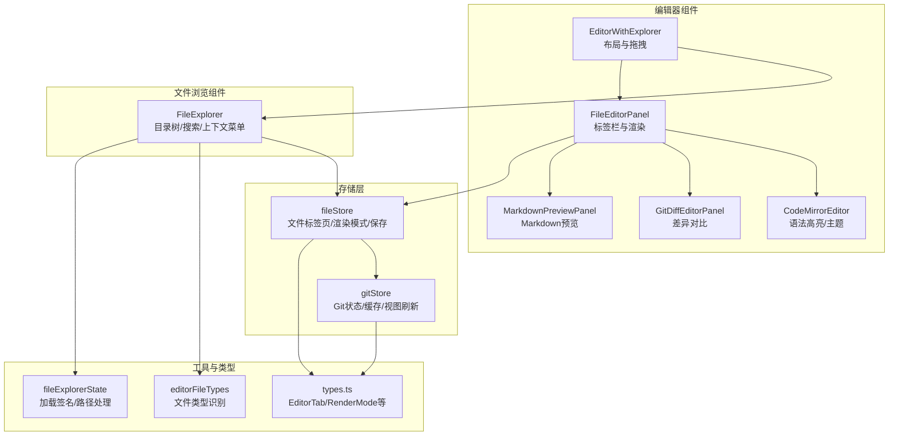
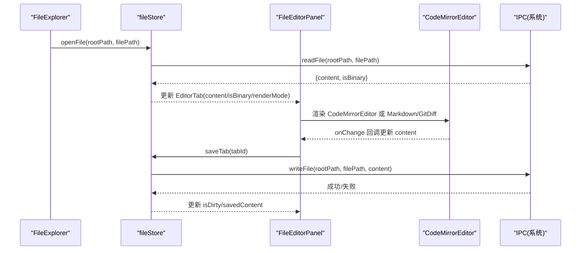
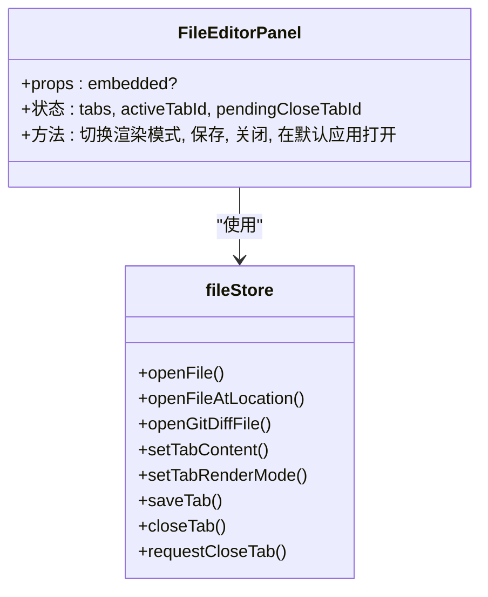
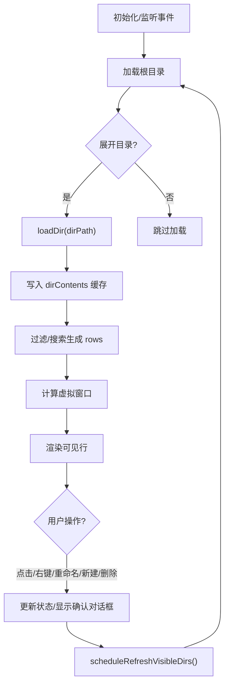
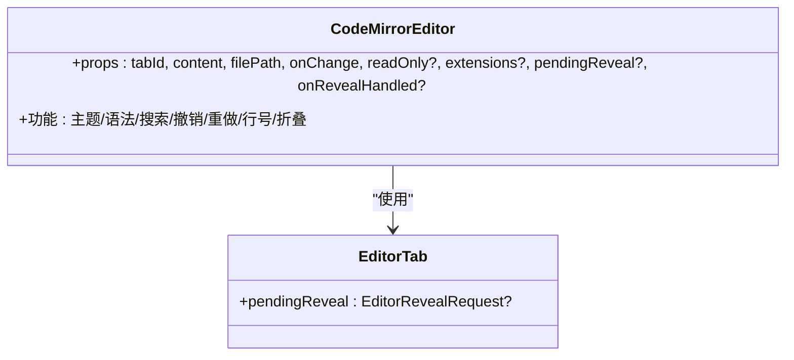
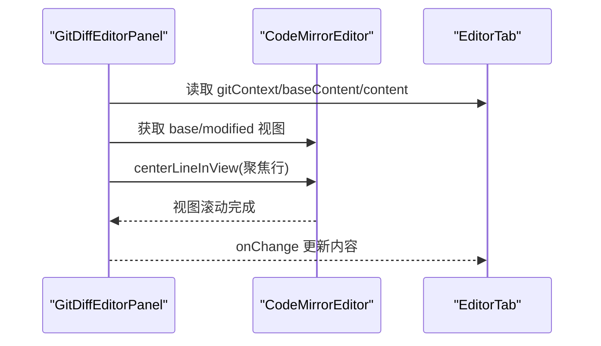
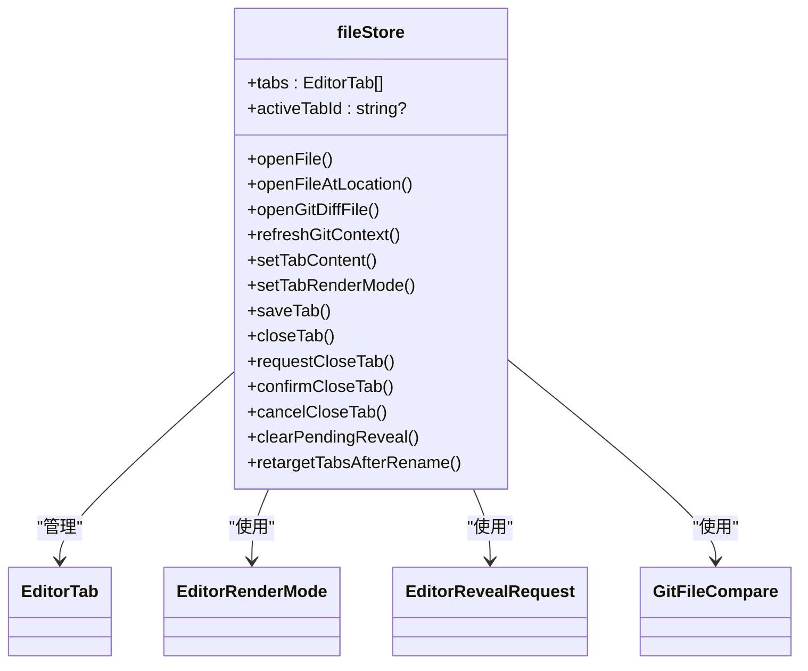
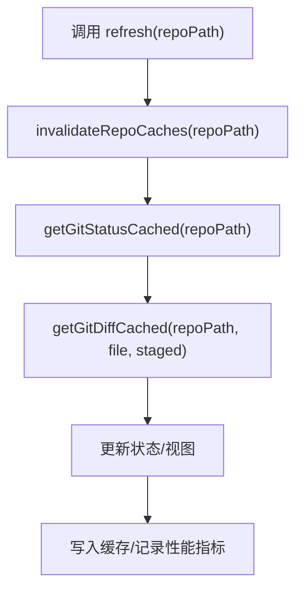
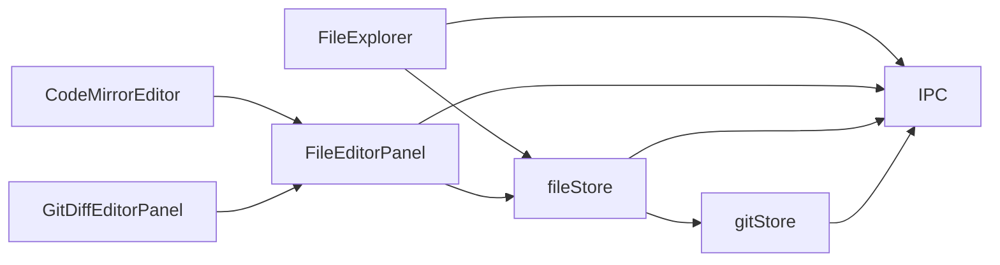

# 编辑器与文件浏览器接口

<cite>
**本文档引用的文件**
- [EditorWithExplorer.tsx](file://src/components/editor/EditorWithExplorer.tsx)
- [FileEditorPanel.tsx](file://src/components/editor/FileEditorPanel.tsx)
- [FileExplorer.tsx](file://src/components/editor/FileExplorer.tsx)
- [CodeMirrorEditor.tsx](file://src/components/editor/CodeMirrorEditor.tsx)
- [GitDiffEditorPanel.tsx](file://src/components/editor/GitDiffEditorPanel.tsx)
- [MarkdownPreviewPanel.tsx](file://src/components/editor/MarkdownPreviewPanel.tsx)
- [fileStore.ts](file://src/stores/fileStore.ts)
- [gitStore.ts](file://src/stores/gitStore.ts)
- [editorFileTypes.ts](file://src/lib/editorFileTypes.ts)
- [fileExplorerState.ts](file://src/components/editor/fileExplorerState.ts)
- [types.ts](file://src/types.ts)
</cite>

## 目录
1. [简介](#简介)
2. [项目结构](#项目结构)
3. [核心组件](#核心组件)
4. [架构总览](#架构总览)
5. [详细组件分析](#详细组件分析)
6. [依赖关系分析](#依赖关系分析)
7. [性能考量](#性能考量)
8. [故障排查指南](#故障排查指南)
9. [结论](#结论)

## 简介
本文件面向编辑器与文件浏览器组件的接口设计，重点覆盖以下方面：
- 组件接口：EditorWithExplorer、FileEditorPanel、FileExplorer 的属性、回调与状态管理
- 文件浏览：目录树加载、过滤、虚拟化、上下文菜单、重命名/新建等操作
- 代码编辑：基于 CodeMirror 的语法高亮、主题、搜索、撤销重做、行号与折叠
- 渲染模式：普通编辑器、Markdown 预览、Git 差异对比
- 文件操作：打开、保存、关闭、在默认应用中打开、工作区搜索
- 数据交互：与 fileStore、gitStore 的集成，文件类型识别与多文件标签页设计

## 项目结构
编辑器与文件浏览器相关代码主要位于 src/components/editor 与 src/stores 下，配合 src/lib 中的工具模块与 src/types.ts 定义的数据模型。

**图表来源**
- [EditorWithExplorer.tsx:1-124](file://src/components/editor/EditorWithExplorer.tsx#L1-L124)
- [FileEditorPanel.tsx:1-358](file://src/components/editor/FileEditorPanel.tsx#L1-L358)
- [FileExplorer.tsx:1-800](file://src/components/editor/FileExplorer.tsx#L1-L800)
- [CodeMirrorEditor.tsx:1-200](file://src/components/editor/CodeMirrorEditor.tsx#L1-L200)
- [GitDiffEditorPanel.tsx:1-200](file://src/components/editor/GitDiffEditorPanel.tsx#L1-L200)
- [MarkdownPreviewPanel.tsx:1-19](file://src/components/editor/MarkdownPreviewPanel.tsx#L1-L19)
- [fileStore.ts:1-551](file://src/stores/fileStore.ts#L1-L551)
- [gitStore.ts:1-800](file://src/stores/gitStore.ts#L1-L800)
- [editorFileTypes.ts:1-7](file://src/lib/editorFileTypes.ts#L1-L7)
- [fileExplorerState.ts:1-103](file://src/components/editor/fileExplorerState.ts#L1-L103)
- [types.ts:884-1083](file://src/types.ts#L884-L1083)

**章节来源**
- [EditorWithExplorer.tsx:1-124](file://src/components/editor/EditorWithExplorer.tsx#L1-L124)
- [FileEditorPanel.tsx:1-358](file://src/components/editor/FileEditorPanel.tsx#L1-L358)
- [FileExplorer.tsx:1-800](file://src/components/editor/FileExplorer.tsx#L1-L800)
- [fileStore.ts:1-551](file://src/stores/fileStore.ts#L1-L551)
- [gitStore.ts:1-800](file://src/stores/gitStore.ts#L1-L800)
- [types.ts:884-1083](file://src/types.ts#L884-L1083)

## 核心组件
- EditorWithExplorer：负责整体布局、可拖拽调整文件浏览器宽度、懒加载子组件
- FileEditorPanel：多标签页容器，根据渲染模式切换编辑器或预览面板
- FileExplorer：文件树浏览、过滤、搜索、上下文菜单、重命名/新建、删除确认
- CodeMirrorEditor：语法高亮、主题、搜索、撤销重做、行号与折叠
- GitDiffEditorPanel：双面板差异对比，支持聚焦到特定 hunk 并滚动定位
- MarkdownPreviewPanel：Markdown 内容渲染

**章节来源**
- [EditorWithExplorer.tsx:32-124](file://src/components/editor/EditorWithExplorer.tsx#L32-L124)
- [FileEditorPanel.tsx:21-358](file://src/components/editor/FileEditorPanel.tsx#L21-L358)
- [FileExplorer.tsx:173-800](file://src/components/editor/FileExplorer.tsx#L173-L800)
- [CodeMirrorEditor.tsx:26-200](file://src/components/editor/CodeMirrorEditor.tsx#L26-L200)
- [GitDiffEditorPanel.tsx:125-200](file://src/components/editor/GitDiffEditorPanel.tsx#L125-L200)
- [MarkdownPreviewPanel.tsx:3-19](file://src/components/editor/MarkdownPreviewPanel.tsx#L3-L19)

## 架构总览
编辑器与文件浏览器通过 Zustand 存储进行数据驱动，组件间通过 props 与回调传递状态；文件浏览与编辑器渲染通过统一的 EditorTab 模型与渲染模式控制。

**图表来源**
- [FileExplorer.tsx:568-577](file://src/components/editor/FileExplorer.tsx#L568-L577)
- [fileStore.ts:205-273](file://src/stores/fileStore.ts#L205-L273)
- [FileEditorPanel.tsx:299-310](file://src/components/editor/FileEditorPanel.tsx#L299-L310)
- [CodeMirrorEditor.tsx:26-35](file://src/components/editor/CodeMirrorEditor.tsx#L26-L35)
- [fileStore.ts:501-549](file://src/stores/fileStore.ts#L501-L549)

## 详细组件分析

### EditorWithExplorer 接口
- 属性
  - embedded?: boolean（是否嵌入式）
- 状态与行为
  - 记忆化浏览器宽度（localStorage 键 panes:explorerWidth），范围限制与默认值
  - 拖拽调整宽度，点击空白区域可收起浏览器
  - 懒加载 FileExplorer 与 FileEditorPanel
- 交互
  - resizeStart 开始拖拽，移动时计算 delta 并限制范围
  - 抬起时移除拖拽样式，若未拖拽且点击阈值内则收起浏览器

**图表来源**
- [EditorWithExplorer.tsx:50-81](file://src/components/editor/EditorWithExplorer.tsx#L50-L81)

**章节来源**
- [EditorWithExplorer.tsx:32-124](file://src/components/editor/EditorWithExplorer.tsx#L32-L124)

### FileEditorPanel 接口
- 属性
  - embedded?: boolean
- 状态绑定
  - tabs、activeTabId、pendingCloseTabId
  - 渲染模式：plain-editor/markdown-preview/git-diff-editor
  - 标签页内容变更、激活、关闭、保存
- 功能
  - 多标签页渲染与切换
  - Markdown 预览/隐藏切换
  - 在默认应用中打开文件
  - Git 差异视图切换（仅当非二进制且可切换）
  - 快捷键 Cmd+S 触发保存（受布局模式约束）
  - 打开文件时自动判断 Markdown 预览渲染模式
- 与存储交互
  - openFile/openFileAtLocation/openGitDiffFile
  - setTabContent/setTabRenderMode/saveTab/closeTab/requestCloseTab

**图表来源**
- [FileEditorPanel.tsx:21-46](file://src/components/editor/FileEditorPanel.tsx#L21-L46)
- [fileStore.ts:168-198](file://src/stores/fileStore.ts#L168-L198)

**章节来源**
- [FileEditorPanel.tsx:21-358](file://src/components/editor/FileEditorPanel.tsx#L21-L358)
- [fileStore.ts:168-198](file://src/stores/fileStore.ts#L168-L198)

### FileExplorer 接口
- 状态与数据
  - 目录内容缓存 Map<string, FileTreeEntry[]>
  - 展开集合 Set<string>、加载中集合 Set<string>
  - 过滤字符串、工作区搜索（最小长度、限制条数、防抖）
  - 视口高度、滚动位置、刷新中状态
  - 多选 Set<string>、最后点击索引
  - 上下文菜单状态、重命名/新建输入、删除确认
- 加载与刷新
  - loadDir：按目录加载文件列表，支持请求签名避免竞态
  - rootPath 变化时重置状态并重新加载
  - scheduleRefreshVisibleDirs：延迟刷新可见目录
  - 监听聊天完成、Git 仓库变化事件触发刷新
- 虚拟化与可见行
  - 基于行高与视口计算虚拟窗口 startIndex/endIndex
  - overscan 行数与阈值控制
- 渲染与交互
  - 目录展开/折叠、文件点击打开
  - 过滤与工作区搜索结果映射为行
  - 上下文菜单定位与挂载后二次定位
  - 重命名/新建/删除流程（含脏标签页检测）

**图表来源**
- [FileExplorer.tsx:255-289](file://src/components/editor/FileExplorer.tsx#L255-L289)
- [FileExplorer.tsx:295-324](file://src/components/editor/FileExplorer.tsx#L295-L324)
- [FileExplorer.tsx:326-361](file://src/components/editor/FileExplorer.tsx#L326-L361)
- [FileExplorer.tsx:583-653](file://src/components/editor/FileExplorer.tsx#L583-L653)
- [FileExplorer.tsx:702-731](file://src/components/editor/FileExplorer.tsx#L702-L731)

**章节来源**
- [FileExplorer.tsx:173-800](file://src/components/editor/FileExplorer.tsx#L173-L800)
- [fileExplorerState.ts:1-103](file://src/components/editor/fileExplorerState.ts#L1-L103)

### CodeMirrorEditor 接口
- 属性
  - tabId: string
  - content: string
  - filePath: string
  - onChange: (content: string) => void
  - readOnly?: boolean
  - extensions?: Extension[]
  - pendingReveal?: EditorRevealRequest | null
  - onRevealHandled?: (nonce: string) => void
- 主题与语法
  - Dark Void 主题与高亮样式
  - 支持多种语言扩展（JS/TS/Rust/Python/HTML/CSS/JSON/Markdown/SQL/YAML）
- 功能
  - 行号、活动行高亮、选择高亮、矩形选择、十字光标、特殊字符高亮
  - 折叠大纲、匹配括号、搜索面板、撤销/重做、缩进与Tab键映射
- 与 EditorTab 的关联
  - pendingReveal 用于首次打开时滚动定位，onRevealHandled 用于清除已处理的定位请求

**图表来源**
- [CodeMirrorEditor.tsx:26-35](file://src/components/editor/CodeMirrorEditor.tsx#L26-L35)
- [types.ts:884-903](file://src/types.ts#L884-L903)

**章节来源**
- [CodeMirrorEditor.tsx:1-200](file://src/components/editor/CodeMirrorEditor.tsx#L1-L200)
- [types.ts:884-903](file://src/types.ts#L884-L903)

### GitDiffEditorPanel 接口
- 属性
  - tab: EditorTab（包含 gitContext）
  - onChange: (content: string) => void
- 功能
  - 基于 gitContext 构建差异模型，支持 base 与 modified 两面板
  - 行装饰与高亮，聚焦到指定 hunk 并居中滚动
  - 自动选择焦点面板（优先 modified，只读时回退到 base）
- 与 CodeMirrorEditor 的协作
  - 通过全局视图查找与滚动 API 实现联动

**图表来源**
- [GitDiffEditorPanel.tsx:125-200](file://src/components/editor/GitDiffEditorPanel.tsx#L125-L200)
- [CodeMirrorEditor.tsx:1-200](file://src/components/editor/CodeMirrorEditor.tsx#L1-L200)

**章节来源**
- [GitDiffEditorPanel.tsx:1-200](file://src/components/editor/GitDiffEditorPanel.tsx#L1-L200)

### MarkdownPreviewPanel 接口
- 属性
  - content: string
- 功能
  - 使用 MarkdownContent 渲染 Markdown 内容，提供滚动容器与样式类名

**章节来源**
- [MarkdownPreviewPanel.tsx:1-19](file://src/components/editor/MarkdownPreviewPanel.tsx#L1-L19)

### fileStore 接口（文件与标签页）
- 状态
  - tabs: EditorTab[]
  - activeTabId: string | null
  - pendingCloseTabId: string | null
- 核心动作
  - openFile/openFileAtLocation：打开文件，解析上下文，设置渲染模式（Markdown 预览优先）
  - openGitDiffFile：打开 Git 差异文件，设置渲染模式为 git-diff-editor
  - refreshGitContext：刷新 Git 差异内容
  - setTabContent：更新标签页内容与脏状态
  - setTabRenderMode：切换渲染模式
  - saveTab：保存前检查外部修改，写入磁盘并通知 gitStore 刷新
  - closeTab/requestCloseTab/confirmCloseTab/cancelCloseTab：标签页生命周期管理
  - clearPendingReveal：清理已处理的定位请求
  - retargetTabsAfterRename：重命名后重定向所有相关标签页路径
- 类型依赖
  - EditorTab、EditorRenderMode、EditorRevealRequest、GitFileCompare

**图表来源**
- [fileStore.ts:168-551](file://src/stores/fileStore.ts#L168-L551)
- [types.ts:884-903](file://src/types.ts#L884-L903)
- [types.ts:871](file://src/types.ts#L871)
- [types.ts:880-883](file://src/types.ts#L880-L883)
- [types.ts:760-772](file://src/types.ts#L760-L772)

**章节来源**
- [fileStore.ts:168-551](file://src/stores/fileStore.ts#L168-L551)
- [types.ts:871](file://src/types.ts#L871)
- [types.ts:880-883](file://src/types.ts#L880-L883)
- [types.ts:884-903](file://src/types.ts#L884-L903)
- [types.ts:760-772](file://src/types.ts#L760-L772)

### gitStore 接口（Git 状态与缓存）
- 状态
  - status、selectedFile、diff、loading、error、activeRepoPath、activeView 等
- 核心动作
  - refresh/invalidateRepoCache：刷新仓库状态与缓存失效
  - selectFile：选择文件并获取差异预览（带缓存与 TTL）
  - stage/unstage/discardFiles：暂存/取消暂存/丢弃文件
  - commit/fetch/pull/push：提交与远程同步
  - loadBranches/loadCommits/loadStashes/loadWorktrees：加载分支/提交/stash/worktree
  - 缓存策略：基于仓库修订号、TTL、字节大小与条目数量的 LRU 式淘汰
- 性能指标
  - 记录刷新耗时与命中率等性能指标

**图表来源**
- [gitStore.ts:522-620](file://src/stores/gitStore.ts#L522-L620)
- [gitStore.ts:259-349](file://src/stores/gitStore.ts#L259-L349)

**章节来源**
- [gitStore.ts:351-800](file://src/stores/gitStore.ts#L351-L800)

### 文件类型识别与多文件标签页
- 文件类型识别
  - isMarkdownPreviewFile：根据扩展名判断是否启用 Markdown 预览
- 多文件标签页
  - EditorTab 包含路径、内容、脏状态、渲染模式、Git 上下文、待定位等字段
  - fileStore 提供标签页增删改查与内容同步

**章节来源**
- [editorFileTypes.ts:1-7](file://src/lib/editorFileTypes.ts#L1-L7)
- [types.ts:884-903](file://src/types.ts#L884-L903)
- [fileStore.ts:168-551](file://src/stores/fileStore.ts#L168-L551)

## 依赖关系分析
- 组件耦合
  - FileEditorPanel 依赖 fileStore 的标签页状态与渲染模式切换
  - FileExplorer 依赖 fileStore 的 openFile 与工作区搜索
  - CodeMirrorEditor 依赖 EditorTab 的 pendingReveal 以实现首次打开定位
  - GitDiffEditorPanel 依赖 fileStore 的 gitContext 与 EditorTab 的内容
- 外部依赖
  - IPC：文件读写、工作区搜索、Git 操作
  - Zustand：fileStore/gitStore 状态管理
  - CodeMirror：编辑器生态扩展

**图表来源**
- [FileExplorer.tsx:568-577](file://src/components/editor/FileExplorer.tsx#L568-L577)
- [fileStore.ts:205-273](file://src/stores/fileStore.ts#L205-L273)
- [gitStore.ts:522-620](file://src/stores/gitStore.ts#L522-L620)

**章节来源**
- [FileExplorer.tsx:1-800](file://src/components/editor/FileExplorer.tsx#L1-L800)
- [fileStore.ts:1-551](file://src/stores/fileStore.ts#L1-L551)
- [gitStore.ts:1-800](file://src/stores/gitStore.ts#L1-L800)

## 性能考量
- 虚拟化：FileExplorer 对大目录采用虚拟化渲染，减少 DOM 节点数量
- 缓存：gitStore 对 Git 状态与差异结果进行缓存，基于 TTL 与字节上限控制内存占用
- 请求去重：FileExplorer 使用请求签名避免并发加载导致的竞态
- 懒加载：EditorWithExplorer 对文件浏览器与编辑器面板进行懒加载，降低首屏压力

[本节为通用指导，无需具体文件分析]

## 故障排查指南
- 无法打开文件
  - 检查 fileStore.openFileAtLocation 是否抛出异常并设置 loadError
  - 确认路径解析与工作区根路径一致
- 保存失败
  - 查看 fileStore.saveTab 的错误提示与 toast 提示
  - 若文件被外部修改，会提示“外部修改”
- Git 差异不更新
  - 调用 fileStore.refreshGitContext 或 gitStore.refresh
  - 确认仓库缓存已失效（invalidateRepoCache）
- 编辑器无语法高亮
  - 检查 CodeMirrorEditor 的语言扩展是否正确匹配文件扩展名
- 文件树不刷新
  - 确认监听事件（聊天完成、Git 仓库变化）是否生效
  - 使用 scheduleRefreshVisibleDirs 触发刷新

**章节来源**
- [fileStore.ts:264-272](file://src/stores/fileStore.ts#L264-L272)
- [fileStore.ts:501-549](file://src/stores/fileStore.ts#L501-L549)
- [gitStore.ts:711-715](file://src/stores/gitStore.ts#L711-L715)
- [FileExplorer.tsx:369-397](file://src/components/editor/FileExplorer.tsx#L369-L397)

## 结论
编辑器与文件浏览器组件通过清晰的接口与状态管理实现了文件浏览、编辑、预览与 Git 差异对比的完整能力。借助虚拟化、缓存与懒加载等优化手段，在大型项目中仍能保持良好性能。fileStore 与 gitStore 提供了稳定的数据交互层，使组件职责明确、易于维护与扩展。