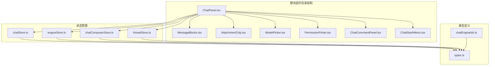
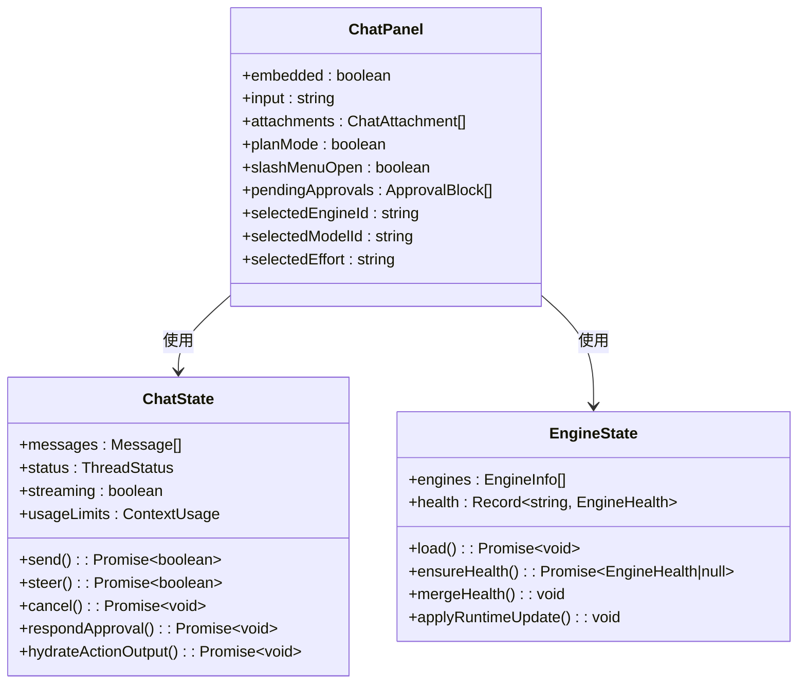
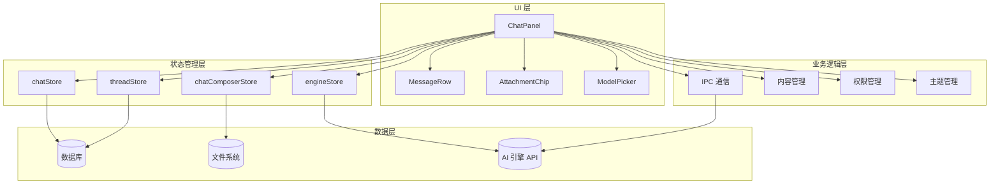
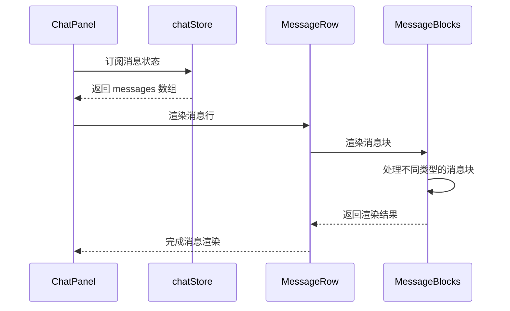
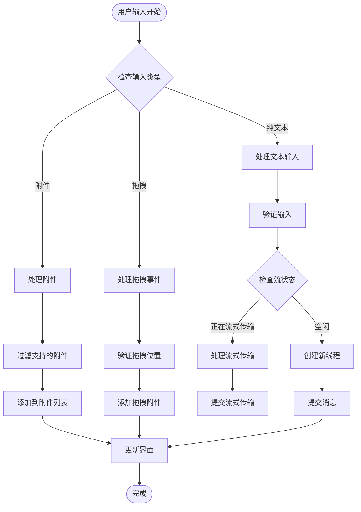
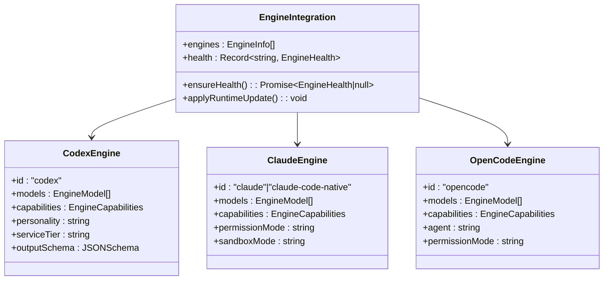
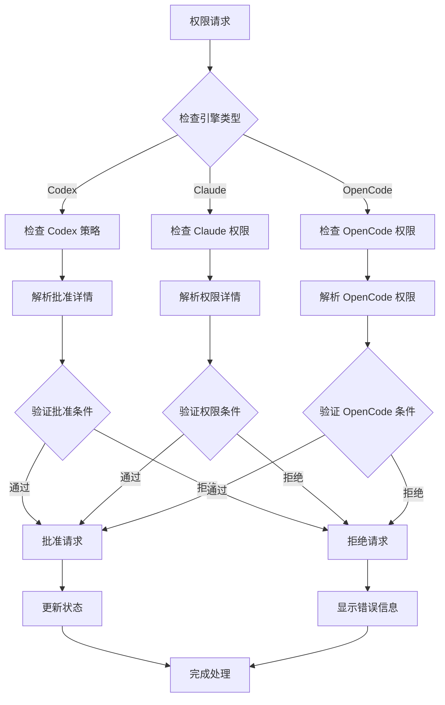
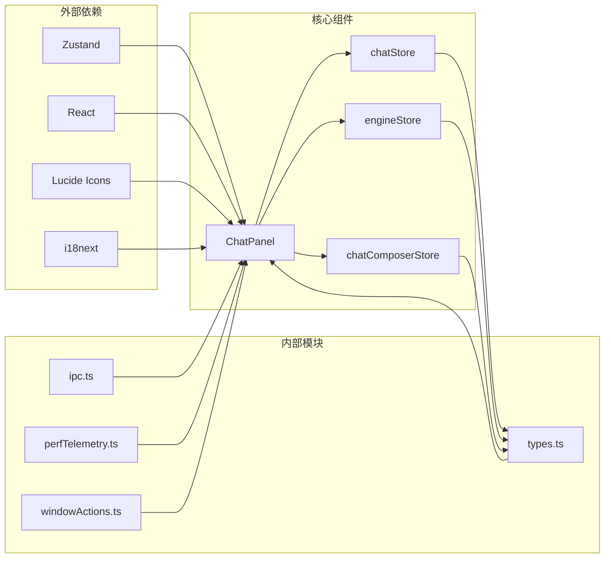
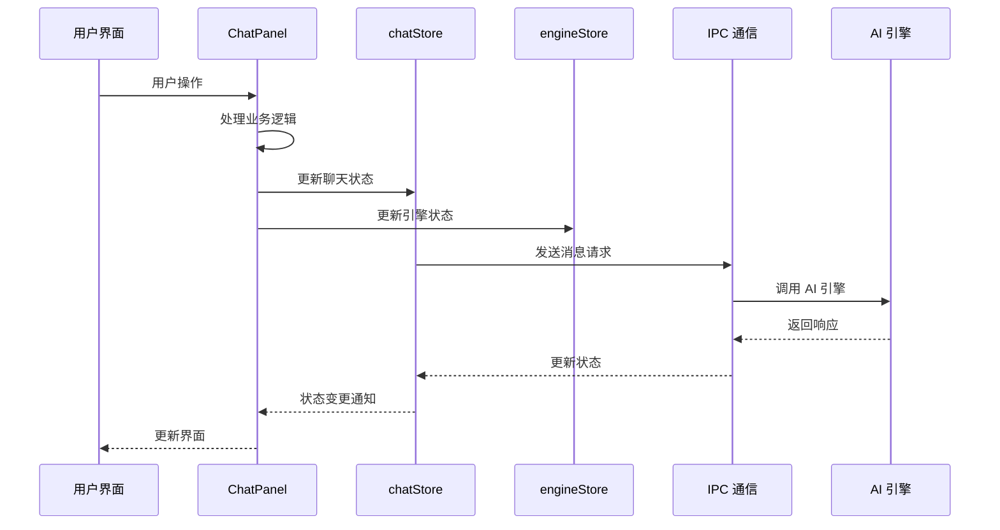
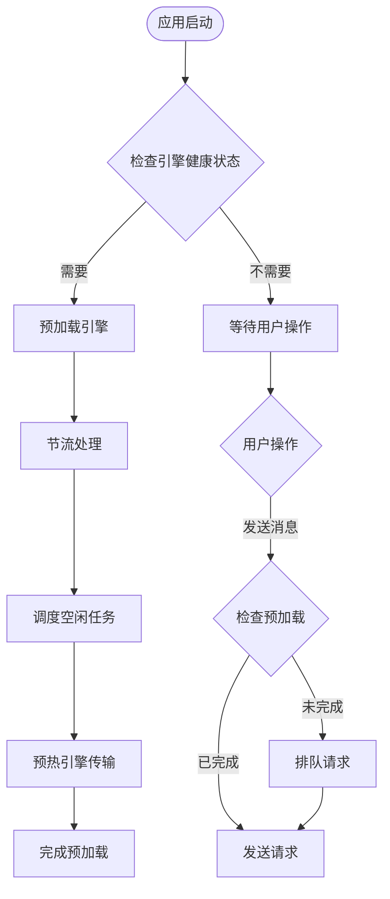

# 聊天面板组件接口

<cite>
**本文档引用的文件**
- [ChatPanel.tsx](file://src/components/chat/ChatPanel.tsx)
- [chatStore.ts](file://src/stores/chatStore.ts)
- [engineStore.ts](file://src/stores/engineStore.ts)
- [chatComposerStore.ts](file://src/stores/chatComposerStore.ts)
- [types.ts](file://src/types.ts)
- [chatEngineIds.ts](file://src/lib/chatEngineIds.ts)
</cite>

## 目录
1. [简介](#简介)
2. [项目结构](#项目结构)
3. [核心组件](#核心组件)
4. [架构概览](#架构概览)
5. [详细组件分析](#详细组件分析)
6. [依赖关系分析](#依赖关系分析)
7. [性能考虑](#性能考虑)
8. [故障排除指南](#故障排除指南)
9. [结论](#结论)

## 简介

ChatPanel 是 Panes 应用中的核心聊天界面组件，负责提供完整的聊天体验，包括消息显示、输入处理、AI 引擎集成和权限管理。该组件集成了多个状态管理系统，支持多种 AI 引擎（Codex、Claude、OpenCode），并提供了丰富的功能特性如附件处理、计划模式、权限控制等。

## 项目结构

ChatPanel 组件位于 `src/components/chat/` 目录下，是聊天功能的核心实现：



**图表来源**
- [ChatPanel.tsx:1-100](file://src/components/chat/ChatPanel.tsx#L1-100)
- [chatStore.ts:1-50](file://src/stores/chatStore.ts#L1-50)
- [engineStore.ts:1-50](file://src/stores/engineStore.ts#L1-50)

**章节来源**
- [ChatPanel.tsx:1-100](file://src/components/chat/ChatPanel.tsx#L1-100)
- [chatStore.ts:1-50](file://src/stores/chatStore.ts#L1-50)
- [engineStore.ts:1-50](file://src/stores/engineStore.ts#L1-50)

## 核心组件

### Props 接口定义

ChatPanel 组件接受以下 props 参数：

```typescript
interface ChatPanelProps {
  embedded?: boolean;
}
```

- `embedded`: 布尔值，指示组件是否以嵌入模式运行，默认为 `false`

### 主要状态管理

组件通过多个 Zustand 状态存储进行状态管理：



**图表来源**
- [ChatPanel.tsx:1556-1580](file://src/components/chat/ChatPanel.tsx#L1556-L1580)
- [chatStore.ts:24-62](file://src/stores/chatStore.ts#L24-L62)
- [engineStore.ts:5-19](file://src/stores/engineStore.ts#L5-L19)

**章节来源**
- [ChatPanel.tsx:1556-1580](file://src/components/chat/ChatPanel.tsx#L1556-L1580)
- [chatStore.ts:24-62](file://src/stores/chatStore.ts#L24-L62)
- [engineStore.ts:5-19](file://src/stores/engineStore.ts#L5-L19)

## 架构概览

ChatPanel 采用分层架构设计，实现了清晰的关注点分离：



**图表来源**
- [ChatPanel.tsx:1600-1650](file://src/components/chat/ChatPanel.tsx#L1600-L1650)
- [chatStore.ts:1-50](file://src/stores/chatStore.ts#L1-L50)
- [engineStore.ts:1-50](file://src/stores/engineStore.ts#L1-L50)

## 详细组件分析

### 消息显示系统

ChatPanel 实现了高效的消息渲染系统，支持虚拟化以处理大量消息：



**图表来源**
- [ChatPanel.tsx:1159-1421](file://src/components/chat/ChatPanel.tsx#L1159-L1421)
- [chatStore.ts:1621-1639](file://src/stores/chatStore.ts#L1621-L1639)

### 输入处理系统

组件提供了完整的输入处理机制，包括文本输入、附件处理和快捷键支持：



**图表来源**
- [ChatPanel.tsx:2499-2510](file://src/components/chat/ChatPanel.tsx#L2499-L2510)
- [ChatPanel.tsx:3855-4034](file://src/components/chat/ChatPanel.tsx#L3855-L4034)

### AI 引擎集成

ChatPanel 支持多种 AI 引擎，每种引擎都有特定的功能和限制：



**图表来源**
- [engineStore.ts:5-19](file://src/stores/engineStore.ts#L5-L19)
- [types.ts:455-483](file://src/types.ts#L455-L483)
- [chatEngineIds.ts:3-7](file://src/lib/chatEngineIds.ts#L3-L7)

### 权限管理系统

组件实现了多层次的权限控制机制：



**图表来源**
- [ChatPanel.tsx:140-224](file://src/components/chat/ChatPanel.tsx#L140-L224)
- [ChatPanel.tsx:2196-2224](file://src/components/chat/ChatPanel.tsx#L2196-L2224)

**章节来源**
- [ChatPanel.tsx:1159-1421](file://src/components/chat/ChatPanel.tsx#L1159-L1421)
- [engineStore.ts:5-19](file://src/stores/engineStore.ts#L5-L19)
- [chatEngineIds.ts:3-7](file://src/lib/chatEngineIds.ts#L3-L7)

## 依赖关系分析

### 组件间依赖



**图表来源**
- [ChatPanel.tsx:1-62](file://src/components/chat/ChatPanel.tsx#L1-L62)
- [chatStore.ts:1-22](file://src/stores/chatStore.ts#L1-L22)
- [engineStore.ts:1-3](file://src/stores/engineStore.ts#L1-L3)

### 状态管理交互



**图表来源**
- [ChatPanel.tsx:1600-1650](file://src/components/chat/ChatPanel.tsx#L1600-L1650)
- [chatStore.ts:38-59](file://src/stores/chatStore.ts#L38-L59)

**章节来源**
- [ChatPanel.tsx:1-62](file://src/components/chat/ChatPanel.tsx#L1-L62)
- [chatStore.ts:1-22](file://src/stores/chatStore.ts#L1-L22)

## 性能考虑

### 虚拟化优化

ChatPanel 实现了智能虚拟化来处理大量消息：

- **虚拟化阈值**: 当消息数量超过 40 条时启用虚拟化
- **估算高度**: 默认消息高度为 220px，行间距为 12px
- **缓冲区**: 上下各 700px 的缓冲区确保平滑滚动
- **高度测量**: 使用 ResizeObserver 动态测量实际高度

### 预加载策略



**图表来源**
- [ChatPanel.tsx:538-570](file://src/components/chat/ChatPanel.tsx#L538-L570)

**章节来源**
- [ChatPanel.tsx:114-127](file://src/components/chat/ChatPanel.tsx#L114-L127)
- [ChatPanel.tsx:538-570](file://src/components/chat/ChatPanel.tsx#L538-L570)

## 故障排除指南

### 常见问题诊断

| 问题类型 | 症状 | 可能原因 | 解决方案 |
|---------|------|----------|----------|
| 引擎连接失败 | 引擎不可用 | 网络问题或引擎未安装 | 检查引擎健康状态，重新加载引擎 |
| 消息不显示 | 聊天界面空白 | 状态同步问题 | 刷新页面，检查网络连接 |
| 附件上传失败 | 附件无法添加 | 文件类型不支持 | 检查文件扩展名，确认引擎支持的类型 |
| 权限被拒绝 | 操作被阻止 | 权限配置不当 | 检查线程执行策略，调整权限设置 |

### 调试工具

组件提供了多种调试和监控功能：

- **性能指标记录**: 记录聊天渲染性能指标
- **状态日志**: 输出关键状态变更信息
- **错误边界**: 捕获和显示组件错误
- **开发工具**: 提供详细的错误堆栈信息

**章节来源**
- [chatStore.ts:157-180](file://src/stores/chatStore.ts#L157-L180)
- [ChatPanel.tsx:4447-4454](file://src/components/chat/ChatPanel.tsx#L4447-L4454)

## 结论

ChatPanel 组件是一个功能完整、架构清晰的聊天界面实现。它成功地整合了多种 AI 引擎、权限管理和状态管理功能，为用户提供了流畅的聊天体验。组件的设计充分考虑了性能优化和用户体验，在处理大量消息和复杂交互场景时表现优异。

主要优势包括：
- **模块化设计**: 清晰的职责分离和依赖管理
- **性能优化**: 智能虚拟化和预加载策略
- **扩展性**: 支持多种 AI 引擎和自定义配置
- **用户体验**: 丰富的交互功能和直观的界面设计

未来可以考虑的改进方向：
- 进一步优化虚拟化算法
- 增强离线支持能力
- 扩展更多 AI 引擎集成
- 改进错误处理和恢复机制