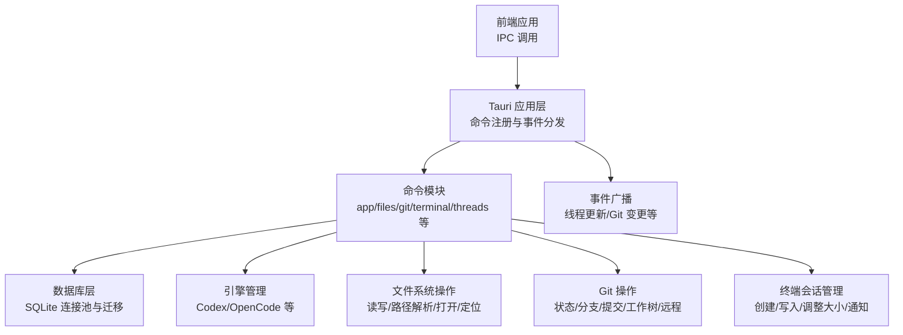
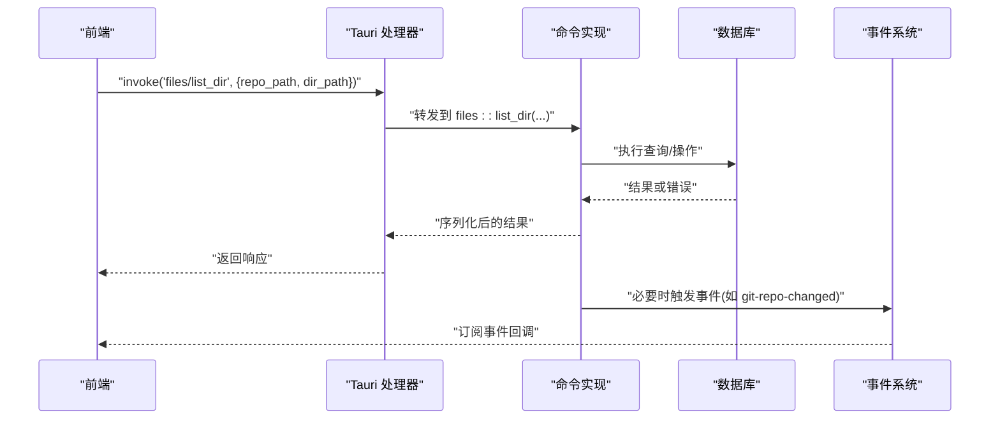
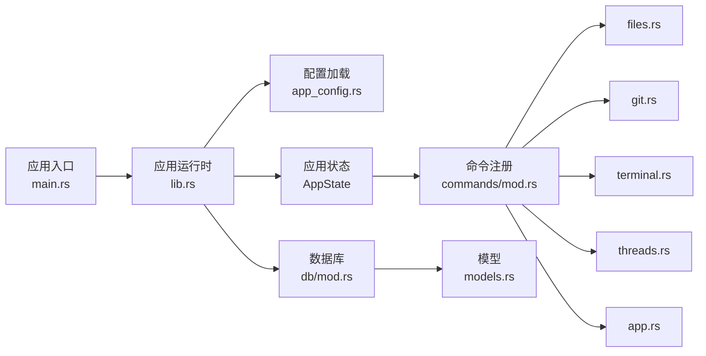

# 后端 API

<cite>
**本文引用的文件**
- [src-tauri/src/main.rs](file://src-tauri/src/main.rs)
- [src-tauri/Cargo.toml](file://src-tauri/Cargo.toml)
- [src-tauri/tauri.conf.json](file://src-tauri/tauri.conf.json)
- [src-tauri/src/lib.rs](file://src-tauri/src/lib.rs)
- [src-tauri/src/commands/mod.rs](file://src-tauri/src/commands/mod.rs)
- [src-tauri/src/commands/app.rs](file://src-tauri/src/commands/app.rs)
- [src-tauri/src/commands/files.rs](file://src-tauri/src/commands/files.rs)
- [src-tauri/src/commands/git.rs](file://src-tauri/src/commands/git.rs)
- [src-tauri/src/commands/terminal.rs](file://src-tauri/src/commands/terminal.rs)
- [src-tauri/src/commands/threads.rs](file://src-tauri/src/commands/threads.rs)
- [src-tauri/src/db/mod.rs](file://src-tauri/src/db/mod.rs)
- [src-tauri/src/models.rs](file://src-tauri/src/models.rs)
</cite>

## 目录
1. [简介](#简介)
2. [项目结构](#项目结构)
3. [核心组件](#核心组件)
4. [架构总览](#架构总览)
5. [详细组件分析](#详细组件分析)
6. [依赖关系分析](#依赖关系分析)
7. [性能考量](#性能考量)
8. [故障排查指南](#故障排查指南)
9. [结论](#结论)
10. [附录](#附录)

## 简介
本文件为 Panes 后端 API 的权威技术文档，覆盖 Tauri 命令接口、数据库操作 API 与系统服务接口。内容面向后端开发者，提供命令用途、参数结构、返回值格式、错误码、调用示例、参数校验规则与异常处理机制，并解释后端服务的架构设计、性能优化与安全考虑。读者可据此进行集成与扩展。

## 项目结构
Panes 后端基于 Tauri v2 构建，Rust 提供命令与业务逻辑，SQLite 负责数据持久化，前端通过 IPC 调用后端命令。命令注册集中在应用启动阶段统一注入，数据库连接采用连接池与迁移策略保障一致性。

图示来源
- [src-tauri/src/lib.rs:181-322](file://src-tauri/src/lib.rs#L181-L322)
- [src-tauri/src/db/mod.rs:24-135](file://src-tauri/src/db/mod.rs#L24-L135)
- [src-tauri/src/commands/mod.rs:1-12](file://src-tauri/src/commands/mod.rs#L1-L12)

章节来源
- [src-tauri/src/main.rs:1-14](file://src-tauri/src/main.rs#L1-L14)
- [src-tauri/src/lib.rs:48-322](file://src-tauri/src/lib.rs#L48-L322)
- [src-tauri/Cargo.toml:15-54](file://src-tauri/Cargo.toml#L15-L54)
- [src-tauri/tauri.conf.json:1-58](file://src-tauri/tauri.conf.json#L1-L58)

## 核心组件
- 应用入口与运行时
  - 入口函数负责 CLI 子命令处理与主程序启动。
  - 启动流程初始化数据库、配置、电源与终端管理器，构建 Tauri 应用并注册全部命令。
- 数据库层
  - SQLite 连接池、WAL 模式、外键启用、超时设置；运行迁移脚本；提供表级列兼容性修复。
- 命令系统
  - 统一在应用启动时通过 generate_handler 注册，包含应用、文件系统、Git、终端、线程、引擎、工作区等模块。
- 模型与 DTO
  - 定义线程、消息、仓库、信任级别、Git 状态、终端会话等数据结构，统一 JSON 驼峰命名。

章节来源
- [src-tauri/src/main.rs:3-13](file://src-tauri/src/main.rs#L3-L13)
- [src-tauri/src/lib.rs:48-106](file://src-tauri/src/lib.rs#L48-L106)
- [src-tauri/src/db/mod.rs:24-149](file://src-tauri/src/db/mod.rs#L24-L149)
- [src-tauri/src/models.rs:1-151](file://src-tauri/src/models.rs#L1-L151)

## 架构总览
后端采用“命令驱动 + 事件广播”的模式：前端通过 IPC 发送命令，后端在独立线程中执行阻塞操作（如文件系统、Git、数据库），完成后通过事件向前端推送状态变更。

图示来源
- [src-tauri/src/lib.rs:181-322](file://src-tauri/src/lib.rs#L181-L322)
- [src-tauri/src/commands/files.rs:18-28](file://src-tauri/src/commands/files.rs#L18-L28)
- [src-tauri/src/commands/git.rs:330-350](file://src-tauri/src/commands/git.rs#L330-L350)

## 详细组件分析

### 应用命令（app）
- 命令清单
  - 获取/设置应用语言环境
  - 获取/设置终端加速渲染开关
  - 获取代理通知设置状态
  - 设置聊天/终端通知开关
  - 安装终端通知集成
  - 设置/预览通知声音
  - 显示桌面通知
- 参数与返回
  - 大多数命令使用异步任务在后台线程执行，返回字符串或布尔值；部分命令需要写入配置锁保护。
- 错误处理
  - 使用 err_to_string 将错误转换为字符串；不支持的语言会报错；预览声音在 macOS 上通过 afplay 执行，其他平台通过系统通知插件。

章节来源
- [src-tauri/src/commands/app.rs:128-292](file://src-tauri/src/commands/app.rs#L128-L292)

### 文件系统命令（files）
- 命令清单
  - 列举目录
  - 读取文件
  - 解析编辑器文件引用
  - 写入/创建/创建目录/重命名/删除文件
  - 定位/以默认应用打开路径
- 参数与返回
  - 大多为阻塞操作封装，返回 DTO 或空结果；写入/修改操作会失效文件树缓存。
- 安全与校验
  - 写入前检查仓库信任级别（受限仓库禁止直接写入）；路径解析防止越权访问（canonicalize + 前缀校验）。
- 错误处理
  - 路径不存在、权限不足、越权访问均返回错误字符串；Linux 平台下定位/打开可能因缺少 xdg-open/gio 报错。

章节来源
- [src-tauri/src/commands/files.rs:18-266](file://src-tauri/src/commands/files.rs#L18-L266)

### Git 命令（git）
- 命令清单
  - 获取仓库状态、文件差异、对比
  - 暂存/取消暂存/丢弃文件
  - 提交、软重置、拉取/推送/抓取
  - 分支列表/检出/创建/重命名/删除
  - 提交历史、stash 列表/推入/应用/弹出
  - 文件树获取与分页
  - 监听仓库变更并广播事件
  - 工作树：新增/列出/移除/修剪
  - 初始化仓库、远程管理（增删改名）
- 参数与返回
  - 多数命令返回 DTO 或空结果；watch 命令通过回调触发 git-repo-changed 事件。
- 错误处理
  - 分支名/远程名校验；工作树创建前确保父目录存在；.gitignore 自动维护；路径合法性校验。

章节来源
- [src-tauri/src/commands/git.rs:15-559](file://src-tauri/src/commands/git.rs#L15-L559)

### 终端命令（terminal）
- 命令清单
  - 创建会话（含 cwd 校验）
  - 写入文本/字节
  - 调整会话尺寸（字符数与像素）
  - 关闭单个/工作区会话
  - 列出会话、渲染诊断
  - 恢复会话输出、抽干输出
  - 列举/清理/聚焦通知
- 参数与返回
  - 会话创建要求 cwd 必须位于工作区根内；尺寸最小为 1；抽干输出字节数限制在 1~1MB。
- 错误处理
  - 目录不存在、路径解析失败、会话不存在等均返回错误字符串；关闭会话时同步清理通知。

章节来源
- [src-tauri/src/commands/terminal.rs:25-275](file://src-tauri/src/commands/terminal.rs#L25-L275)

### 线程命令（threads）
- 命令清单
  - 列出/归档线程
  - 同步远端线程（Codex/OpenCode）
  - 本地线程创建/重命名/确认工作区写入授权
  - 设置推理努力度、执行策略、模型配置
  - 归档/恢复/删除线程
  - 从引擎同步快照、派生/回滚/压缩线程
- 参数与返回
  - 多数命令通过 run_db 在后台线程执行数据库操作；远端线程同步需校验工作区根与仓库范围。
- 错误处理
  - 模型有效性校验、服务等级仅支持 Codex、工作区确认根路径规范化、远端线程 cwd 范围校验。

章节来源
- [src-tauri/src/commands/threads.rs:32-798](file://src-tauri/src/commands/threads.rs#L32-L798)

### 数据库 API（db）
- 连接与池化
  - 连接池最大空闲数为 8；首次连接配置外键、WAL、同步模式、临时存储与忙等待超时。
- 迁移与兼容
  - 应用启动时执行初始迁移与列兼容性修复（归档字段、Git 字段、运行时字段、审计字段）。
- 查询与事务
  - 提供线程、消息、仓库、工作区等模块化查询；事务用于审批解决与元数据更新等场景。
- 性能与可靠性
  - WAL 模式提升并发读写；busy_timeout 避免锁竞争导致的立即失败；连接池减少频繁打开/关闭成本。

章节来源
- [src-tauri/src/db/mod.rs:24-149](file://src-tauri/src/db/mod.rs#L24-L149)

### 模型与数据传输对象（models）
- 线程与消息
  - ThreadDto、MessageDto、MessageStatusDto、ThreadStatusDto 等，统一驼峰命名。
- Git
  - GitStatusDto、GitFileCompareDto、GitBranchDto、GitCommitDto、GitStashDto、GitWorktreeDto 等。
- 引擎与运行时
  - EngineInfoDto、EngineModelDto、EngineHealthDto、EngineRuntimeUpdatedDto、Codex 协议诊断等。
- 通知与终端
  - TerminalSessionDto、TerminalNotificationDto、TerminalRendererDiagnosticsDto 等。

章节来源
- [src-tauri/src/models.rs:1-800](file://src-tauri/src/models.rs#L1-L800)

## 依赖关系分析
- 外部依赖
  - Tauri v2 及其插件（shell/fs/dialog/notification/process/updater）
  - SQLite（rusqlite，内置编译）
  - Git（git2， vendored-openssl）
  - 终端仿真（portable-pty）
  - 异步运行时（tokio/futures）
- 内部模块耦合
  - 命令层依赖 AppState（数据库、引擎、Git 监视器、终端管理器、通知管理器、文件树缓存）
  - 数据库层提供统一连接与迁移能力
  - 模型层为各命令与数据库交互提供类型安全的数据契约

图示来源
- [src-tauri/src/main.rs:3-13](file://src-tauri/src/main.rs#L3-L13)
- [src-tauri/src/lib.rs:85-96](file://src-tauri/src/lib.rs#L85-L96)
- [src-tauri/src/commands/mod.rs:1-12](file://src-tauri/src/commands/mod.rs#L1-L12)

章节来源
- [src-tauri/Cargo.toml:15-54](file://src-tauri/Cargo.toml#L15-L54)

## 性能考量
- 数据库
  - WAL 模式与外键开启提升并发与一致性；连接池限制空闲连接数量；busy_timeout 减少锁争用失败。
- 命令执行
  - 大多数命令在后台线程执行（tokio::task::spawn_blocking），避免阻塞主线程。
- 缓存
  - 文件树缓存与 Git 监视器减少重复扫描与 IO。
- 终端
  - 输出抽干限制目标字节数，避免一次性传输过大造成卡顿。

章节来源
- [src-tauri/src/db/mod.rs:137-149](file://src-tauri/src/db/mod.rs#L137-L149)
- [src-tauri/src/lib.rs:96-96](file://src-tauri/src/lib.rs#L96-L96)
- [src-tauri/src/commands/terminal.rs:199-216](file://src-tauri/src/commands/terminal.rs#L199-L216)

## 故障排查指南
- 常见错误与定位
  - 路径相关：路径不存在、无法解析、越权访问（路径遍历检测）。检查 canonicalize 与 starts_with 校验。
  - 权限相关：受限仓库禁止直接写入/修改；工作区线程确认写入授权需在允许根范围内。
  - Git 相关：分支名/远程名非法、工作树父目录不存在、.gitignore 写入失败。
  - 终端相关：cwd 不在工作区根内、会话不存在、尺寸小于 1。
  - 引擎相关：模型 ID 无效、服务等级仅支持 Codex。
- 排查建议
  - 查看日志（env_logger 初始化）与事件广播（git-repo-changed、thread-updated）。
  - 对大查询/IO 操作增加超时与降级策略。
  - 对外部进程（afplay/xpg-open/gio）缺失场景提供替代方案或提示。

章节来源
- [src-tauri/src/commands/files.rs:482-530](file://src-tauri/src/commands/files.rs#L482-L530)
- [src-tauri/src/commands/git.rs:352-467](file://src-tauri/src/commands/git.rs#L352-L467)
- [src-tauri/src/commands/terminal.rs:64-72](file://src-tauri/src/commands/terminal.rs#L64-L72)
- [src-tauri/src/commands/threads.rs:372-405](file://src-tauri/src/commands/threads.rs#L372-L405)

## 结论
Panes 后端以 Tauri 为核心，围绕命令、数据库与系统服务构建了清晰的分层架构。通过严格的参数校验、路径安全与事件驱动，实现了文件系统、Git、终端与线程管理的稳定 API。结合连接池、WAL 与缓存策略，满足桌面端高性能与高可靠性的需求。建议在扩展新命令时遵循现有模式：后台线程执行、DTO 统一、错误字符串化、必要时广播事件。

## 附录

### 命令调用规范与示例（示例路径）
- 文件系统
  - 列举目录：[src-tauri/src/commands/files.rs:18-28](file://src-tauri/src/commands/files.rs#L18-L28)
  - 读取文件：[src-tauri/src/commands/files.rs:30-37](file://src-tauri/src/commands/files.rs#L30-L37)
  - 写入文件：[src-tauri/src/commands/files.rs:67-107](file://src-tauri/src/commands/files.rs#L67-L107)
- Git
  - 获取状态：[src-tauri/src/commands/git.rs:15-23](file://src-tauri/src/commands/git.rs#L15-L23)
  - 拉取/推送：[src-tauri/src/commands/git.rs:123-135](file://src-tauri/src/commands/git.rs#L123-L135)
  - 工作树新增：[src-tauri/src/commands/git.rs:354-399](file://src-tauri/src/commands/git.rs#L354-L399)
- 终端
  - 创建会话：[src-tauri/src/commands/terminal.rs:25-62](file://src-tauri/src/commands/terminal.rs#L25-L62)
  - 写入数据：[src-tauri/src/commands/terminal.rs:74-100](file://src-tauri/src/commands/terminal.rs#L74-L100)
- 线程
  - 创建线程：[src-tauri/src/commands/threads.rs:652-674](file://src-tauri/src/commands/threads.rs#L652-L674)
  - 同步远端线程：[src-tauri/src/commands/threads.rs:54-118](file://src-tauri/src/commands/threads.rs#L54-L118)

### 参数校验与错误码（摘要）
- 路径与权限
  - 路径不存在/不可解析：返回错误字符串
  - 越权访问（路径遍历）：返回错误字符串
  - 受限仓库写入：返回错误字符串
- Git
  - 分支名/远程名非法：返回错误字符串
  - 工作树父目录不存在：返回错误字符串
- 终端
  - cwd 不在工作区根内：返回错误字符串
  - 会话不存在/尺寸非法：返回错误字符串
- 线程
  - 模型无效：返回错误字符串
  - 服务等级仅支持 Codex：返回错误字符串
  - 远端线程 cwd 超出范围：返回错误字符串

章节来源
- [src-tauri/src/commands/files.rs:482-530](file://src-tauri/src/commands/files.rs#L482-L530)
- [src-tauri/src/commands/git.rs:352-467](file://src-tauri/src/commands/git.rs#L352-L467)
- [src-tauri/src/commands/terminal.rs:64-72](file://src-tauri/src/commands/terminal.rs#L64-L72)
- [src-tauri/src/commands/threads.rs:372-405](file://src-tauri/src/commands/threads.rs#L372-L405)