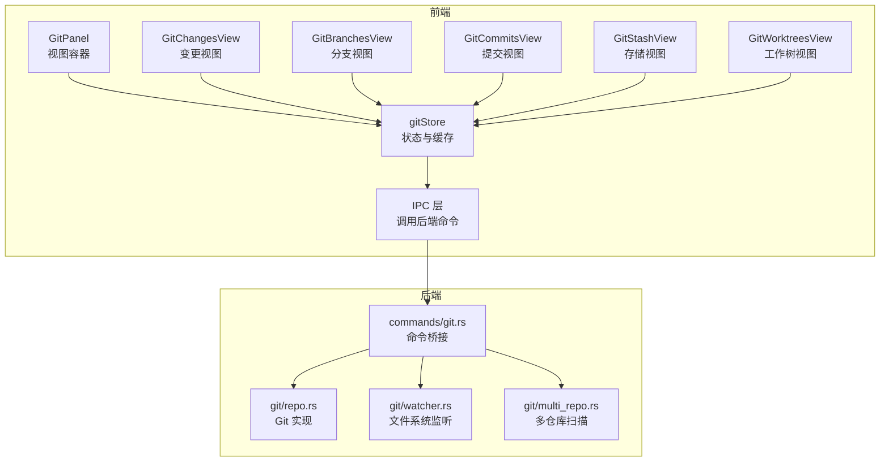
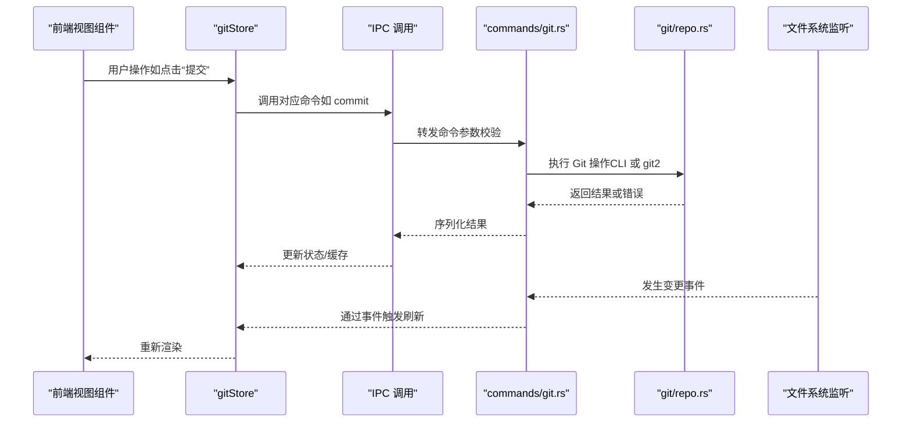
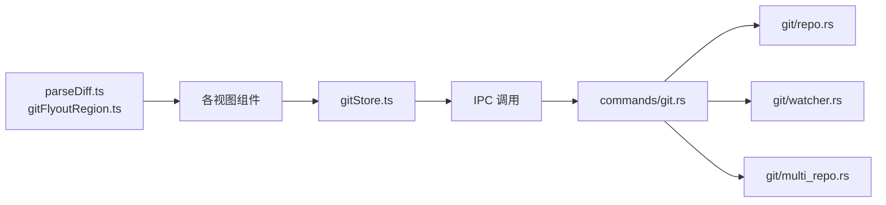

# Git 命令

<cite>
**本文引用的文件**
- [src/lib/commandPaletteGit.ts](file://src/lib/commandPaletteGit.ts)
- [src/stores/gitStore.ts](file://src/stores/gitStore.ts)
- [src/components/git/GitPanel.tsx](file://src/components/git/GitPanel.tsx)
- [src/components/git/GitChangesView.tsx](file://src/components/git/GitChangesView.tsx)
- [src/components/git/GitBranchesView.tsx](file://src/components/git/GitBranchesView.tsx)
- [src/components/git/GitCommitsView.tsx](file://src/components/git/GitCommitsView.tsx)
- [src/components/git/GitStashView.tsx](file://src/components/git/GitStashView.tsx)
- [src/components/git/GitWorktreesView.tsx](file://src/components/git/GitWorktreesView.tsx)
- [src/lib/gitFlyoutRegion.ts](file://src/lib/gitFlyoutRegion.ts)
- [src/lib/parseDiff.ts](file://src/lib/parseDiff.ts)
- [src-tauri/src/commands/git.rs](file://src-tauri/src/commands/git.rs)
- [src-tauri/src/git/mod.rs](file://src-tauri/src/git/mod.rs)
- [src-tauri/src/git/repo.rs](file://src-tauri/src/git/repo.rs)
- [src-tauri/src/git/multi_repo.rs](file://src-tauri/src/git/multi_repo.rs)
- [src-tauri/src/git/watcher.rs](file://src-tauri/src/git/watcher.rs)
</cite>

## 目录
1. [简介](#简介)
2. [项目结构](#项目结构)
3. [核心组件](#核心组件)
4. [架构总览](#架构总览)
5. [详细组件分析](#详细组件分析)
6. [依赖关系分析](#依赖关系分析)
7. [性能考量](#性能考量)
8. [故障排查指南](#故障排查指南)
9. [结论](#结论)
10. [附录](#附录)

## 简介
本文件系统性梳理 Panes 应用中 Git 命令模块的设计与实现，覆盖前端状态管理、视图交互、后端命令桥接以及文件系统监听与缓存策略。重点说明以下方面：
- 版本控制相关命令：仓库初始化、状态查询、差异预览、暂存/取消暂存、丢弃、提交、软回退、远程同步（拉取/推送/获取）、分支管理、提交历史、工作树、存储（stash）等。
- 执行流程：从前端 UI 触发到 IPC 调用，再到后端命令执行与事件通知。
- 参数传递与结果处理：命令参数校验、错误传播、结果序列化与反序列化。
- 分支管理、标签操作、冲突解决等高级功能。
- 并发控制与状态同步：请求去重、并发加载、缓存与失效、文件系统变更监听与防抖。

## 项目结构
该模块采用前后端分层设计：
- 前端（React + Zustand）
  - 视图组件：GitPanel、GitChangesView、GitBranchesView、GitCommitsView、GitStashView、GitWorktreesView。
  - 状态管理：gitStore 统一管理仓库状态、视图切换、缓存、并发控制与错误处理。
  - 工具与辅助：parseDiff 解析 diff 文本；gitFlyoutRegion 提供飞出菜单上下文。
- 后端（Tauri + Rust）
  - 命令桥接：commands/git.rs 将前端 IPC 映射为后端命令。
  - Git 实现：git/repo.rs 提供状态、差异、分支、提交、远程、工作树、stash 等具体实现；git/watcher.rs 提供文件系统监听与事件去噪；git/multi_repo.rs 提供多仓库扫描能力。

图表来源
- [src/components/git/GitPanel.tsx:1-864](file://src/components/git/GitPanel.tsx#L1-864)
- [src/stores/gitStore.ts:1-1132](file://src/stores/gitStore.ts#L1-1132)
- [src-tauri/src/commands/git.rs:1-559](file://src-tauri/src/commands/git.rs#L1-559)
- [src-tauri/src/git/repo.rs:1-2178](file://src-tauri/src/git/repo.rs#L1-2178)
- [src-tauri/src/git/watcher.rs:1-519](file://src-tauri/src/git/watcher.rs#L1-519)
- [src-tauri/src/git/multi_repo.rs:1-236](file://src-tauri/src/git/multi_repo.rs#L1-236)

章节来源
- [src/components/git/GitPanel.tsx:1-864](file://src/components/git/GitPanel.tsx#L1-L864)
- [src/stores/gitStore.ts:1-1132](file://src/stores/gitStore.ts#L1-L1132)
- [src-tauri/src/commands/git.rs:1-559](file://src-tauri/src/commands/git.rs#L1-L559)
- [src-tauri/src/git/repo.rs:1-2178](file://src-tauri/src/git/repo.rs#L1-L2178)
- [src-tauri/src/git/watcher.rs:1-519](file://src-tauri/src/git/watcher.rs#L1-L519)
- [src-tauri/src/git/multi_repo.rs:1-236](file://src-tauri/src/git/multi_repo.rs#L1-L236)

## 核心组件
- 前端状态与缓存
  - gitStore：集中管理 Git 面板状态、视图切换、分支/提交/stash/工作树列表、文件差异预览、缓存与并发控制、错误处理与刷新策略。
  - 关键特性：状态/差异缓存（带 TTL 与字节上限）、请求去重（in-flight）、视图刷新节流、工作树上下文切换。
- 视图组件
  - GitPanel：统一入口，负责仓库选择、视图切换、远程同步、错误展示、多仓库批量同步。
  - GitChangesView：变更与暂存、丢弃、提交、差异解析与展示。
  - GitBranchesView：分支列表、搜索、切换、新建、重命名、删除。
  - GitCommitsView：提交历史列表、筛选、选中查看差异。
  - GitStashView：存储（stash）列表、保存、应用、弹出。
  - GitWorktreesView：工作树列表、创建、移除、修剪、在面板中打开。
- 后端命令桥接
  - commands/git.rs：将前端 IPC 映射为后端命令，统一错误转换与异步执行。
  - git/repo.rs：实现具体 Git 操作（状态、差异、分支、提交、远程、工作树、stash），包含 CLI 与 git2 双通道回退。
  - git/watcher.rs：文件系统监听与事件去噪，支持原生与轮询回退。
  - git/multi_repo.rs：扫描工作区内的 Git 仓库并推断默认分支。

章节来源
- [src/stores/gitStore.ts:1-1132](file://src/stores/gitStore.ts#L1-L1132)
- [src/components/git/GitPanel.tsx:1-864](file://src/components/git/GitPanel.tsx#L1-L864)
- [src/components/git/GitChangesView.tsx:1-752](file://src/components/git/GitChangesView.tsx#L1-L752)
- [src/components/git/GitBranchesView.tsx:1-635](file://src/components/git/GitBranchesView.tsx#L1-L635)
- [src/components/git/GitCommitsView.tsx:1-236](file://src/components/git/GitCommitsView.tsx#L1-L236)
- [src/components/git/GitStashView.tsx:1-266](file://src/components/git/GitStashView.tsx#L1-L266)
- [src/components/git/GitWorktreesView.tsx:1-565](file://src/components/git/GitWorktreesView.tsx#L1-L565)
- [src-tauri/src/commands/git.rs:1-559](file://src-tauri/src/commands/git.rs#L1-L559)
- [src-tauri/src/git/repo.rs:1-2178](file://src-tauri/src/git/repo.rs#L1-L2178)
- [src-tauri/src/git/watcher.rs:1-519](file://src-tauri/src/git/watcher.rs#L1-L519)
- [src-tauri/src/git/multi_repo.rs:1-236](file://src-tauri/src/git/multi_repo.rs#L1-L236)

## 架构总览
Git 命令模块遵循“前端 UI → 状态管理 → IPC → 后端命令”的清晰分层。前端通过 gitStore 统一调度，后端命令桥接至 git/repo.rs 的具体实现，并通过 git/watcher.rs 进行文件系统变更监听与事件去噪，最终通过 Tauri 事件向前端推送变更。

图表来源
- [src/stores/gitStore.ts:1-1132](file://src/stores/gitStore.ts#L1-L1132)
- [src-tauri/src/commands/git.rs:1-559](file://src-tauri/src/commands/git.rs#L1-L559)
- [src-tauri/src/git/repo.rs:1-2178](file://src-tauri/src/git/repo.rs#L1-L2178)
- [src-tauri/src/git/watcher.rs:1-519](file://src-tauri/src/git/watcher.rs#L1-L519)

## 详细组件分析

### Git 面板与状态管理（gitStore）
- 缓存策略
  - 状态缓存：按仓库路径缓存 GitStatus，带 TTL 与条目/字节上限，支持按仓库版本号失效。
  - 差异缓存：按“仓库::是否暂存::文件路径”键缓存 GitDiffPreview，同样带 TTL 与裁剪策略。
  - 请求去重：同一仓库同时仅允许一个 in-flight 请求，避免重复并发。
- 刷新与节流
  - 活跃视图最小刷新间隔限制，避免频繁刷新导致性能问题。
  - 文件选择时按需刷新差异，支持暂存/非暂存状态翻转自动刷新。
- 并发与错误
  - 使用 beginLoading/endLoading 计数器统一管理加载态。
  - 远程同步动作（fetch/pull/push）期间设置 remoteSyncAction/remoteSyncRepoPath，UI 展示同步中状态。
- 多仓库与工作树
  - 支持主仓库与工作树上下文切换，刷新时自动将工作树路径映射回主仓库以保持一致性。
  - 支持多仓库批量同步（fetch/pull），使用 Promise.allSettled 聚合结果并展示部分失败提示。

章节来源
- [src/stores/gitStore.ts:1-1132](file://src/stores/gitStore.ts#L1-L1132)

### Git 面板入口（GitPanel）
- 仓库选择与多仓库模式
  - 支持单仓库与多仓库“变更”视图模式，多仓库时提供批量 fetch/pull。
  - 工作树模式下可从主仓库切换到工作树路径，并提供返回主仓库按钮。
- 远程同步与错误处理
  - 提供“刷新并获取”、“获取全部”等操作，结合本地与全局错误状态显示。
  - 同步过程中禁用交互，避免并发操作。
- 文件系统监听与轮询
  - 针对“变更”视图使用监听器，其他视图使用定时轮询，均带防抖与去噪。
  - 监听器在 Linux 下遇到 inotify 限额时自动回退到轮询模式。

章节来源
- [src/components/git/GitPanel.tsx:1-864](file://src/components/git/GitPanel.tsx#L1-L864)
- [src-tauri/src/git/watcher.rs:1-519](file://src-tauri/src/git/watcher.rs#L1-L519)

### 变更视图（GitChangesView）
- 文件操作
  - 支持单文件/目录级暂存/取消暂存/丢弃，批量操作与确认对话框。
  - 提交消息草稿与历史记录，支持 Ctrl/Cmd+Enter 快速提交。
- 差异解析与展示
  - 通过 parseDiff 将 raw diff 解析为结构化行，支持截断提示与虚拟化渲染。
  - 支持未跟踪文件的特殊提示与空状态展示。

章节来源
- [src/components/git/GitChangesView.tsx:1-752](file://src/components/git/GitChangesView.tsx#L1-L752)
- [src/lib/parseDiff.ts:1-175](file://src/lib/parseDiff.ts#L1-L175)

### 分支视图（GitBranchesView）
- 分支管理
  - 支持本地/远程分支切换、新建、重命名、删除（含强制删除）。
  - 分支搜索与分页加载，支持键盘上下方向键浏览历史草稿。
- 行为菜单与上下文
  - 飞出菜单支持切换、重命名、删除等操作，结合 gitFlyoutRegion 管理焦点与关闭时机。

章节来源
- [src/components/git/GitBranchesView.tsx:1-635](file://src/components/git/GitBranchesView.tsx#L1-L635)
- [src/lib/gitFlyoutRegion.ts:1-42](file://src/lib/gitFlyoutRegion.ts#L1-L42)

### 提交视图（GitCommitsView）
- 提交历史
  - 支持筛选（作者/标题/哈希），分页加载，点击提交查看差异。
  - 加载差异时显示加载状态，无差异时提示“无更改”。

章节来源
- [src/components/git/GitCommitsView.tsx:1-236](file://src/components/git/GitCommitsView.tsx#L1-L236)

### 存储视图（GitStashView）
- Stash 管理
  - 保存、应用、弹出，支持过滤与消息草稿。
  - 当工作区无变更时禁用保存按钮。

章节来源
- [src/components/git/GitStashView.tsx:1-266](file://src/components/git/GitStashView.tsx#L1-L266)

### 工作树视图（GitWorktreesView）
- 工作树管理
  - 创建、移除、修剪，支持在面板中打开工作树。
  - 自动推断分支名与默认工作树路径，支持删除时选择是否同时删除分支。

章节来源
- [src/components/git/GitWorktreesView.tsx:1-565](file://src/components/git/GitWorktreesView.tsx#L1-L565)

### 命令桥接与后端实现
- 命令桥接（commands/git.rs）
  - 将前端 IPC 映射为后端命令，统一使用 spawn_blocking 在线程池中执行阻塞操作。
  - 对于 watch_git_repo，注册回调并在变更发生时通过 Tauri 事件向前端推送。
- Git 实现（git/repo.rs）
  - 状态与差异：优先使用 CLI 输出解析，失败时回退到 git2。
  - 分支与提交：使用 for-each-ref 与 log 获取列表，支持搜索与分页。
  - 远程与工作树：封装 fetch/pull/push、add/list/remove/prune 等操作。
  - 内容比较：支持 HEAD/Index 与工作树之间的内容读取与二进制检测。
- 文件系统监听（git/watcher.rs）
  - 仅对高信号 Git 元数据路径（如 refs、index、FETCH_HEAD、packed-refs）发出事件，避免工作树大目录带来的噪声。
  - Linux 下遇到 inotify 限额自动回退到轮询模式。
- 多仓库扫描（git/multi_repo.rs）
  - 深度优先扫描工作区，发现 .git 目录即视为仓库，推断默认分支。

章节来源
- [src-tauri/src/commands/git.rs:1-559](file://src-tauri/src/commands/git.rs#L1-L559)
- [src-tauri/src/git/repo.rs:1-2178](file://src-tauri/src/git/repo.rs#L1-L2178)
- [src-tauri/src/git/watcher.rs:1-519](file://src-tauri/src/git/watcher.rs#L1-L519)
- [src-tauri/src/git/multi_repo.rs:1-236](file://src-tauri/src/git/multi_repo.rs#L1-L236)

## 依赖关系分析
- 前端依赖
  - gitStore 依赖 IPC 与本地缓存；各视图组件依赖 gitStore 的状态与方法。
  - parseDiff 与 gitFlyoutRegion 作为通用工具被视图组件复用。
- 后端依赖
  - commands/git.rs 依赖 git/repo.rs 与 git/watcher.rs；git/repo.rs 依赖 git2 与 CLI；git/watcher.rs 依赖 notify 与轮询。
- 外部集成
  - Tauri 事件用于文件系统变更通知；git2 与 Git CLI 作为底层实现。

图表来源
- [src/stores/gitStore.ts:1-1132](file://src/stores/gitStore.ts#L1-L1132)
- [src-tauri/src/commands/git.rs:1-559](file://src-tauri/src/commands/git.rs#L1-L559)
- [src-tauri/src/git/repo.rs:1-2178](file://src-tauri/src/git/repo.rs#L1-L2178)
- [src-tauri/src/git/watcher.rs:1-519](file://src-tauri/src/git/watcher.rs#L1-L519)
- [src-tauri/src/git/multi_repo.rs:1-236](file://src-tauri/src/git/multi_repo.rs#L1-L236)
- [src/lib/parseDiff.ts:1-175](file://src/lib/parseDiff.ts#L1-L175)
- [src/lib/gitFlyoutRegion.ts:1-42](file://src/lib/gitFlyoutRegion.ts#L1-L42)

章节来源
- [src/stores/gitStore.ts:1-1132](file://src/stores/gitStore.ts#L1-L1132)
- [src-tauri/src/commands/git.rs:1-559](file://src-tauri/src/commands/git.rs#L1-L559)

## 性能考量
- 缓存与裁剪
  - 状态缓存与差异缓存均设置 TTL 与条目/字节上限，超出后自动裁剪最旧项。
  - 通过估计对象大小进行精确计数，避免内存膨胀。
- 请求去重与并发控制
  - in-flight 请求队列确保同一仓库同时仅有一个活跃请求。
  - beginLoading/endLoading 计数器避免 UI 状态错乱。
- 刷新节流与监听优化
  - 活跃视图最小刷新间隔，减少不必要的网络与 IO。
  - 文件系统监听仅针对高信号路径，Linux 下自动回退轮询，兼顾稳定性与性能。
- 渲染优化
  - 差异解析与虚拟化渲染，支持截断提示与懒加载。

章节来源
- [src/stores/gitStore.ts:1-1132](file://src/stores/gitStore.ts#L1-L1132)
- [src-tauri/src/git/watcher.rs:1-519](file://src-tauri/src/git/watcher.rs#L1-L519)

## 故障排查指南
- 常见错误类型
  - 无上游分支导致的 pull/push 失败：pull 会提示无上游；push 会在无上游时自动设置并推送。
  - 仓库未初始化：提供初始化检查与引导按钮。
  - 文件系统监听失败：Linux 下 inotify 限额会自动回退到轮询。
- 前端错误处理
  - gitStore 统一设置 error 字段，GitPanel 提供错误栏与清除按钮。
  - 远程同步期间禁用交互，避免并发冲突。
- 后端错误处理
  - commands/git.rs 将底层错误转换为字符串返回；git/repo.rs 使用 anyhow 上下文增强错误信息。
- 建议排查步骤
  - 检查当前分支是否有上游配置（push 无上游时会自动设置）。
  - 查看 GitPanel 错误栏与浏览器控制台日志。
  - 在 Linux 下观察日志中关于轮询回退的信息。
  - 确认仓库路径有效且存在 .git 目录。

章节来源
- [src-tauri/src/commands/git.rs:1-559](file://src-tauri/src/commands/git.rs#L1-L559)
- [src-tauri/src/git/repo.rs:1-2178](file://src-tauri/src/git/repo.rs#L1-L2178)
- [src/components/git/GitPanel.tsx:1-864](file://src/components/git/GitPanel.tsx#L1-L864)

## 结论
该 Git 命令模块通过清晰的前后端分层、完善的缓存与并发控制、稳健的文件系统监听与错误处理，提供了稳定高效的版本控制体验。其设计兼顾易用性与性能，适合在大型项目与多仓库场景中使用。建议后续持续关注缓存命中率与监听稳定性，并在必要时引入更细粒度的增量更新策略。

## 附录
- 命令一览（前端调用到后端实现）
  - 状态与差异：get_git_status、get_file_diff、get_git_file_compare
  - 文件操作：stage_files、unstage_files、discard_files
  - 提交与重置：commit、soft_reset_last_commit
  - 远程同步：fetch_git、pull_git、push_git
  - 分支管理：list_git_branches、checkout_git_branch、create_git_branch、rename_git_branch、delete_git_branch
  - 提交历史：list_git_commits、get_commit_diff
  - 工作树：add_git_worktree、list_git_worktrees、remove_git_worktree、prune_git_worktrees
  - 远程管理：list_git_remotes、add_git_remote、remove_git_remote、rename_git_remote
  - 初始化：init_git_repo
  - 监听：watch_git_repo

章节来源
- [src-tauri/src/commands/git.rs:1-559](file://src-tauri/src/commands/git.rs#L1-L559)