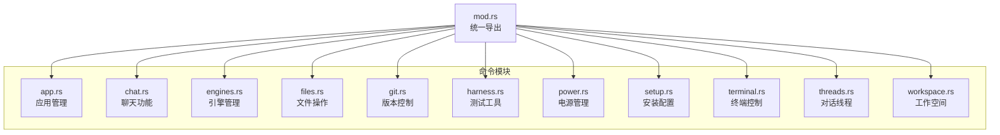
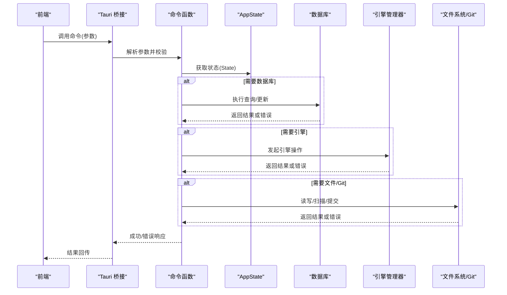
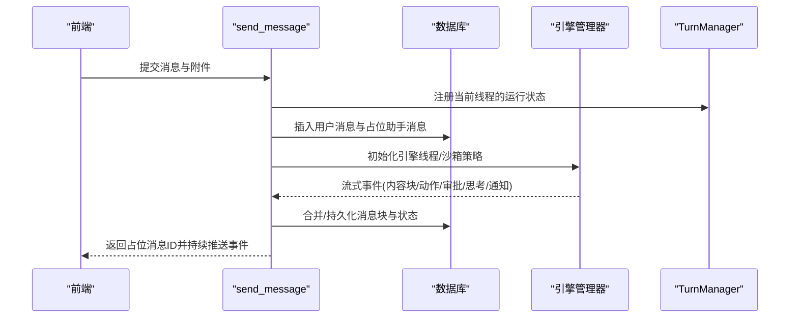
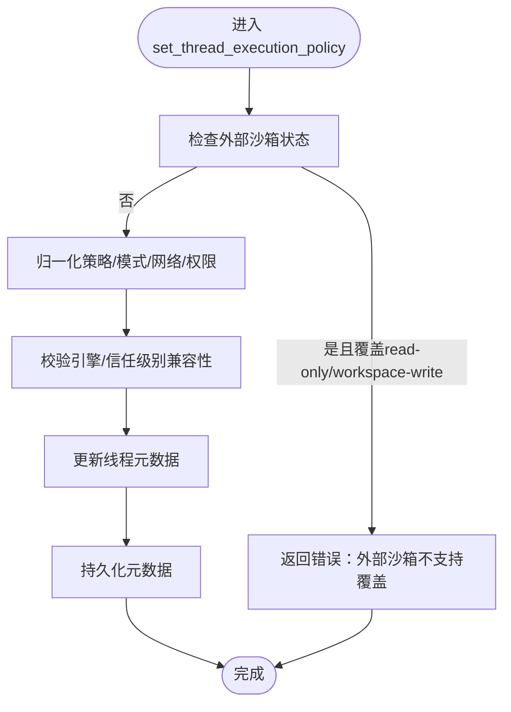
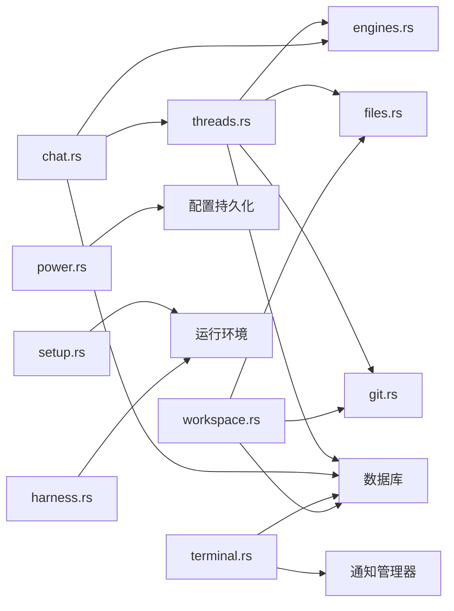

# 命令接口

<cite>
**本文档引用的文件**
- [src-tauri/src/commands/mod.rs](file://src-tauri/src/commands/mod.rs)
- [src-tauri/src/commands/app.rs](file://src-tauri/src/commands/app.rs)
- [src-tauri/src/commands/chat.rs](file://src-tauri/src/commands/chat.rs)
- [src-tauri/src/commands/engines.rs](file://src-tauri/src/commands/engines.rs)
- [src-tauri/src/commands/files.rs](file://src-tauri/src/commands/files.rs)
- [src-tauri/src/commands/git.rs](file://src-tauri/src/commands/git.rs)
- [src-tauri/src/commands/harness.rs](file://src-tauri/src/commands/harness.rs)
- [src-tauri/src/commands/power.rs](file://src-tauri/src/commands/power.rs)
- [src-tauri/src/commands/setup.rs](file://src-tauri/src/commands/setup.rs)
- [src-tauri/src/commands/terminal.rs](file://src-tauri/src/commands/terminal.rs)
- [src-tauri/src/commands/threads.rs](file://src-tauri/src/commands/threads.rs)
- [src-tauri/src/commands/workspace.rs](file://src-tauri/src/commands/workspace.rs)
</cite>

## 目录
1. [简介](#简介)
2. [项目结构](#项目结构)
3. [核心组件](#核心组件)
4. [架构总览](#架构总览)
5. [详细组件分析](#详细组件分析)
6. [依赖关系分析](#依赖关系分析)
7. [性能考量](#性能考量)
8. [故障排除指南](#故障排除指南)
9. [结论](#结论)

## 简介
本文件系统性梳理 Panes 后端的 Tauri 命令接口，覆盖 app、chat、engines、files、git、harness、power、setup、terminal、threads、workspace 十一个模块。内容包括各命令的功能职责、参数与返回值、调用方式、参数校验、错误处理策略以及性能注意事项，并提供使用示例与最佳实践建议。

## 项目结构
后端命令集中在 src-tauri/src/commands 目录下，通过 mod.rs 统一导出；每个模块对应一个 Rust 文件，实现一组相关命令。命令均使用 #[tauri::command] 宏声明，支持异步执行并通过 State 获取全局状态。

**图表来源**
- [src-tauri/src/commands/mod.rs](file://src-tauri/src/commands/mod.rs)
- [src-tauri/src/commands/app.rs](file://src-tauri/src/commands/app.rs)
- [src-tauri/src/commands/chat.rs](file://src-tauri/src/commands/chat.rs)
- [src-tauri/src/commands/engines.rs](file://src-tauri/src/commands/engines.rs)
- [src-tauri/src/commands/files.rs](file://src-tauri/src/commands/files.rs)
- [src-tauri/src/commands/git.rs](file://src-tauri/src/commands/git.rs)
- [src-tauri/src/commands/harness.rs](file://src-tauri/src/commands/harness.rs)
- [src-tauri/src/commands/power.rs](file://src-tauri/src/commands/power.rs)
- [src-tauri/src/commands/setup.rs](file://src-tauri/src/commands/setup.rs)
- [src-tauri/src/commands/terminal.rs](file://src-tauri/src/commands/terminal.rs)
- [src-tauri/src/commands/threads.rs](file://src-tauri/src/commands/threads.rs)
- [src-tauri/src/commands/workspace.rs](file://src-tauri/src/commands/workspace.rs)

**章节来源**
- [src-tauri/src/commands/mod.rs](file://src-tauri/src/commands/mod.rs)

## 核心组件
- 模块化设计：每个命令模块聚焦单一领域，职责清晰，便于维护与扩展。
- 异步执行：命令普遍采用 tokio::task::spawn_blocking 或直接异步实现，避免阻塞主线程。
- 状态注入：通过 tauri::State 访问 AppState，统一管理数据库、引擎、终端、通知等资源。
- 参数校验：对输入进行严格校验（类型、范围、格式），并在失败时返回明确错误信息。
- 错误处理：统一转换为字符串错误消息，便于前端展示与日志追踪。
- 平台适配：针对 macOS/Windows/Linux 的差异（如通知、路径解析）进行条件编译与分支处理。

**章节来源**
- [src-tauri/src/commands/app.rs](file://src-tauri/src/commands/app.rs)
- [src-tauri/src/commands/engines.rs](file://src-tauri/src/commands/engines.rs)
- [src-tauri/src/commands/files.rs](file://src-tauri/src/commands/files.rs)
- [src-tauri/src/commands/git.rs](file://src-tauri/src/commands/git.rs)
- [src-tauri/src/commands/harness.rs](file://src-tauri/src/commands/harness.rs)
- [src-tauri/src/commands/power.rs](file://src-tauri/src/commands/power.rs)
- [src-tauri/src/commands/setup.rs](file://src-tauri/src/commands/setup.rs)
- [src-tauri/src/commands/terminal.rs](file://src-tauri/src/commands/terminal.rs)
- [src-tauri/src/commands/threads.rs](file://src-tauri/src/commands/threads.rs)
- [src-tauri/src/commands/workspace.rs](file://src-tauri/src/commands/workspace.rs)

## 架构总览
命令层通过 Tauri 桥接到前端，后端根据命令参数访问数据库、引擎、文件系统、Git 仓库、终端会话等资源，必要时触发事件广播或持久化变更。

**图表来源**
- [src-tauri/src/commands/threads.rs](file://src-tauri/src/commands/threads.rs)
- [src-tauri/src/commands/chat.rs](file://src-tauri/src/commands/chat.rs)
- [src-tauri/src/commands/files.rs](file://src-tauri/src/commands/files.rs)
- [src-tauri/src/commands/git.rs](file://src-tauri/src/commands/git.rs)
- [src-tauri/src/commands/engines.rs](file://src-tauri/src/commands/engines.rs)

## 详细组件分析

### 应用管理（app）
- 功能概述
  - 本地化设置与查询（语言、渲染加速开关）
  - 通知与桌面通知集成（聊天/终端）
  - 通知音效预览与设置
  - 桌面通知代理安装与状态查询
- 关键命令
  - get_app_locale / set_app_locale
  - get_terminal_accelerated_rendering / set_terminal_accelerated_rendering
  - get_agent_notification_settings / set_chat_notifications_enabled / set_terminal_notifications_enabled
  - install_terminal_notification_integration_command
  - set_notification_sound / preview_notification_sound / show_agent_notification
- 参数与返回
  - 多数命令返回字符串或布尔值；部分返回 DTO 结构体（如通知状态）
- 错误处理
  - 不支持的语言/平台特性会返回明确错误
  - 预览通知音效在不同平台有差异化实现
- 性能与最佳实践
  - 使用 tokio::task::spawn_blocking 进行磁盘/系统调用
  - 仅在需要时启用加速渲染，避免不必要的 GPU 开销

**章节来源**
- [src-tauri/src/commands/app.rs](file://src-tauri/src/commands/app.rs)

### 聊天（chat）
- 功能概述
  - 发送消息到引擎，流式输出与事件合并
  - 附件粘贴与预览（图片）
  - 输入项构建（文本/技能/提及）
  - 引擎健康检查与预热
- 关键命令
  - save_pasted_image_attachment / read_attachment_preview
  - send_message（核心流程：参数校验 → 附件/输入项归一化 → 引擎线程初始化 → 数据库存储占位消息 → 异步运行回合 → 事件推送）
- 参数与返回
  - send_message：thread_id、message、可选模型/推理强度/附件/输入项/计划模式/client_turn_id → 返回新占位消息 ID
  - 附件：ChatAttachmentPayload
- 错误处理
  - 已存在运行中的回合则拒绝重复发送
  - 附件大小/类型限制、路径合法性校验
- 性能与最佳实践
  - 流事件合并与数据库批量刷新，降低 I/O 压力
  - 合理设置流事件合并阈值与刷新间隔

**图表来源**
- [src-tauri/src/commands/chat.rs](file://src-tauri/src/commands/chat.rs)
- [src-tauri/src/commands/threads.rs](file://src-tauri/src/commands/threads.rs)

**章节来源**
- [src-tauri/src/commands/chat.rs](file://src-tauri/src/commands/chat.rs)

### 引擎管理（engines）
- 功能概述
  - 列举可用引擎与健康状态
  - 引擎预热
  - Codex 技能/应用列表
  - OpenCode 运行时目录扫描
  - 执行引擎检查命令（安全校验）
- 关键命令
  - list_engines / engine_health / prewarm_engine
  - list_codex_skills / list_codex_apps
  - get_opencode_runtime_catalog
  - run_engine_check
- 参数与返回
  - run_engine_check：engine_id、command → EngineCheckResultDto
- 错误处理
  - 命令合法性校验（仅允许健康检查中列出的命令）
  - 跨平台命令构建（Windows/cmd vs 类Unix shell）
- 性能与最佳实践
  - 预热常用引擎，减少首次调用延迟
  - 输出截断避免超长日志影响 UI

**章节来源**
- [src-tauri/src/commands/engines.rs](file://src-tauri/src/commands/engines.rs)

### 文件操作（files）
- 功能概述
  - 目录/文件列举与读取
  - 编辑器文件引用解析
  - 写入/创建/新建/重命名/删除
  - 路径暴露与默认应用打开
- 关键命令
  - list_dir / read_file
  - resolve_editor_file_reference
  - write_file / create_file / create_dir / rename_path / delete_path
  - reveal_path / open_path_with_default_app
- 参数与返回
  - 多数命令接收 repo_path 与相对/绝对路径
  - 返回文件树条目或空结果
- 错误处理
  - 受信任级别限制：受限仓库禁止修改
  - 路径遍历保护：规范化与根路径校验
- 性能与最佳实践
  - 文件树缓存失效策略
  - 跨平台路径解析与命令构建

**章节来源**
- [src-tauri/src/commands/files.rs](file://src-tauri/src/commands/files.rs)

### 版本控制（git）
- 功能概述
  - Git 状态、差异、比较
  - 文件/提交级差异
  - 分支/标签/远程管理
  - 提交/拉取/推送/暂存/丢弃
  - 工作树管理（新增/移除/修剪）
  - 仓库初始化与远程管理
  - 文件树缓存与变更事件
- 关键命令
  - get_git_status / get_file_diff / get_git_file_compare
  - stage_files / unstage_files / discard_files / commit / soft_reset_last_commit
  - fetch_git / pull_git / push_git
  - list_git_branches / checkout_git_branch / create_git_branch / rename_git_branch / delete_git_branch
  - list_git_commits / list_git_stashes / push_git_stash / apply_git_stash / pop_git_stash
  - get_commit_diff
  - get_file_tree / get_file_tree_page
  - watch_git_repo（触发 git-repo-changed 事件）
  - add_git_worktree / list_git_worktrees / remove_git_worktree / prune_git_worktrees
  - init_git_repo / list_git_remotes / add_git_remote / remove_git_remote / rename_git_remote
- 参数与返回
  - 大多以 repo_path 作为上下文
  - 分页查询支持 offset/limit
- 错误处理
  - 分支名/远程名格式校验
  - 工作树父目录确保存在
- 性能与最佳实践
  - 文件树分页与缓存
  - 变更监听与事件去抖

**章节来源**
- [src-tauri/src/commands/git.rs](file://src-tauri/src/commands/git.rs)

### 测试工具（harness）
- 功能概述
  - 检测与安装外部 CLI harness（如 Claude Code、Gemini CLI、OpenCode 等）
  - 自动安装脚本与进度事件
  - 启动 harness（返回命令名供终端使用）
- 关键命令
  - check_harnesses（检测可用性与版本）
  - install_harness（优先脚本安装，否则 npm）
  - launch_harness（返回命令名）
- 参数与返回
  - install_harness：harness_id → InstallResult
  - launch_harness：harness_id → 命令字符串
- 错误处理
  - Windows 上缺少 Unix shell 时降级处理
  - 未知 harness 返回错误
- 性能与最佳实践
  - 安装过程异步读取 stdout/stderr 并实时上报进度
  - 登录 shell 探测带超时

**章节来源**
- [src-tauri/src/commands/harness.rs](file://src-tauri/src/commands/harness.rs)

### 电源管理（power）
- 功能概述
  - 保持唤醒状态查询与启用/禁用
  - 电源设置读取/保存（是否阻止显示器休眠/屏保/仅 AC 供电/电池阈值/会话时长/关闭屏幕睡眠）
  - macOS 辅助工具注册与状态查询
- 关键命令
  - get_keep_awake_state / set_keep_awake_enabled
  - get_power_settings / set_power_settings
  - get_helper_status / register_keep_awake_helper
- 参数与返回
  - set_power_settings：PowerSettingsInput → KeepAwakeStateDto
  - 电池阈值范围校验（1~99）
- 错误处理
  - 禁用时回滚运行时状态并报告错误
  - macOS 专用能力检测
- 性能与最佳实践
  - 先应用运行时设置再持久化，失败时回滚
  - 保持唤醒状态 DTO 映射完整字段

**章节来源**
- [src-tauri/src/commands/power.rs](file://src-tauri/src/commands/power.rs)

### 安装配置（setup）
- 功能概述
  - 依赖检测（Node/Git/Codex）
  - 依赖安装（Homebrew/npm 等）
  - 安装进度事件广播
- 关键命令
  - check_dependencies（返回依赖报告）
  - install_dependency（按依赖/方法组合安装）
- 参数与返回
  - install_dependency：dependency/method → InstallResult
- 错误处理
  - 不支持的组合返回错误
  - 登录 shell 探测超时与失败处理
- 性能与最佳实践
  - 安装过程异步流式输出
  - PATH 增强与可执行文件定位

**章节来源**
- [src-tauri/src/commands/setup.rs](file://src-tauri/src/commands/setup.rs)

### 终端控制（terminal）
- 功能概述
  - 会话创建/写入/调整大小/关闭
  - 会话列表与诊断信息
  - 输出恢复与排空
  - 通知管理（列出/清除/焦点切换）
- 关键命令
  - terminal_create_session / terminal_write / terminal_write_bytes / terminal_resize
  - terminal_close_session / terminal_close_workspace_sessions
  - terminal_list_sessions / terminal_get_renderer_diagnostics
  - terminal_resume_session / terminal_drain_output
  - terminal_list_notifications / terminal_clear_notification / terminal_set_notification_focus
- 参数与返回
  - 创建会话：workspace_id、cols、rows、cwd → TerminalSessionDto
  - 诊断：TerminalRendererDiagnosticsDto
- 错误处理
  - cwd 必须位于工作空间根内
  - 会话不存在时返回错误
- 性能与最佳实践
  - 输出排空目标字节限制（1~1MB）
  - 通知焦点切换时清理对应会话通知

**章节来源**
- [src-tauri/src/commands/terminal.rs](file://src-tauri/src/commands/terminal.rs)

### 对话线程（threads）
- 功能概述
  - 线程生命周期管理（创建/归档/恢复/删除）
  - 线程属性与元数据（标题、推理强度、服务等级、权限策略、沙箱模式、网络许可、个人性、输出模式、OpenCode 代理等）
  - 远程线程同步（Codex/OpenCode）
  - Fork/Rollback/Compact（Codex）
  - 工作区写入选项确认
- 关键命令
  - list_threads / list_archived_threads
  - list_codex_remote_threads / attach_codex_remote_thread
  - list_opencode_remote_sessions / attach_opencode_remote_session
  - create_thread / rename_thread / delete_thread / archive_thread / restore_thread
  - sync_thread_from_engine
  - set_thread_reasoning_effort
  - set_thread_execution_policy（批准策略/沙箱/网络/权限配置/审批审查者）
  - set_thread_codex_config（个性/服务等级/输出模式）
  - set_thread_opencode_config（代理）
  - fork_codex_thread / rollback_codex_thread / compact_codex_thread
  - confirm_workspace_thread（工作区写入确认）
- 参数与返回
  - attach_*：返回 ThreadDto
  - set_*_config：返回更新后的 ThreadDto
  - confirm_workspace_thread：无返回（副作用为更新元数据）
- 错误处理
  - 活跃回合中禁止 fork/rollback/compact
  - 仅 Codex/OpenCode 支持特定配置
  - 外部沙箱模式下不支持 read-only/workspace-write 覆盖
- 性能与最佳实践
  - 合理的推理强度与服务等级选择
  - 权限配置与沙箱模式联动，避免冗余字段

**图表来源**
- [src-tauri/src/commands/threads.rs](file://src-tauri/src/commands/threads.rs)

**章节来源**
- [src-tauri/src/commands/threads.rs](file://src-tauri/src/commands/threads.rs)

### 工作空间（workspace）
- 功能概述
  - 打开/列出/归档/恢复工作空间
  - 仓库管理（信任级别、活动状态）
  - 工作空间启动预设（序列化/反序列化/规范化）
  - 工作空间文件树与搜索
- 关键命令
  - open_workspace / list_workspaces / list_archived_workspaces
  - get_repos / set_repo_trust_level / set_repo_git_active / set_workspace_git_active_repos
  - has_workspace_git_selection
  - delete_workspace / archive_workspace / restore_workspace
  - get/set/clear/clear_workspace_startup_preset
  - normalize_workspace_startup_preset / serialize_workspace_startup_preset / normalize_workspace_startup_preset_raw / set_workspace_startup_preset_raw / export_workspace_startup_preset
  - list_workspace_dirs
  - get_workspace_file_tree_page / search_workspace_files
- 参数与返回
  - open_workspace：path、scan_depth → WorkspaceDto
  - 预设相关：WorkspaceStartupPreset（含格式枚举）
- 错误处理
  - 无效路径/目录检查
  - 预设 JSON 序列化/反序列化错误
- 性能与最佳实践
  - 文件树分页与缓存
  - 搜索结果限制与刷新策略

**章节来源**
- [src-tauri/src/commands/workspace.rs](file://src-tauri/src/commands/workspace.rs)

## 依赖关系分析
- 模块间耦合
  - threads 与 engines/files/git/db 紧密协作，负责对话生命周期与数据一致性
  - chat 依赖 threads 与 engines，同时与数据库交互
  - terminal 依赖通知与终端管理器
  - power 依赖系统能力探测与配置持久化
  - setup/harness 依赖运行环境与进程执行
- 外部依赖
  - 引擎侧：Codex/OpenCode/第三方 CLI
  - 系统侧：macOS 辅助工具、Windows PowerShell、类 Unix shell
  - 文件系统/Git：跨平台路径解析与命令

**图表来源**
- [src-tauri/src/commands/threads.rs](file://src-tauri/src/commands/threads.rs)
- [src-tauri/src/commands/chat.rs](file://src-tauri/src/commands/chat.rs)
- [src-tauri/src/commands/terminal.rs](file://src-tauri/src/commands/terminal.rs)
- [src-tauri/src/commands/power.rs](file://src-tauri/src/commands/power.rs)
- [src-tauri/src/commands/setup.rs](file://src-tauri/src/commands/setup.rs)
- [src-tauri/src/commands/harness.rs](file://src-tauri/src/commands/harness.rs)
- [src-tauri/src/commands/workspace.rs](file://src-tauri/src/commands/workspace.rs)

## 性能考量
- I/O 优化
  - 文件/仓库扫描与分页，避免一次性加载过多数据
  - 数据库批量刷新与事件合并，减少写放大
- 异步与并发
  - 大量命令使用 spawn_blocking 或 tokio 并发，避免阻塞事件循环
  - 安装/检查/引擎操作采用流式输出与进度事件
- 资源管理
  - 会话关闭时清理通知与缓存
  - 保持唤醒设置先应用运行时再持久化，失败回滚
- 平台差异
  - macOS/Windows/Linux 在命令构建、路径解析、通知代理上分别处理

## 故障排除指南
- 常见错误与排查
  - 附件过大/非图像：检查大小限制与 MIME 类型
  - 会话创建 cwd 非工作空间根内：确认路径归属
  - 依赖未找到：使用 check_dependencies 获取可用安装方法
  - 外部沙箱模式下覆盖被拒：清理覆盖或切换本地沙箱
  - 未知 harness：确认 ID 是否在支持列表
  - 电池阈值非法：确保 1~99
- 日志与事件
  - 安装/检查命令输出截断，关注 stderr
  - git-repo-changed 事件用于监听仓库变更
- 回滚与恢复
  - 设置失败时自动回滚运行时状态
  - 删除/归档前中断引擎线程，防止资源泄漏

**章节来源**
- [src-tauri/src/commands/chat.rs](file://src-tauri/src/commands/chat.rs)
- [src-tauri/src/commands/terminal.rs](file://src-tauri/src/commands/terminal.rs)
- [src-tauri/src/commands/setup.rs](file://src-tauri/src/commands/setup.rs)
- [src-tauri/src/commands/threads.rs](file://src-tauri/src/commands/threads.rs)
- [src-tauri/src/commands/harness.rs](file://src-tauri/src/commands/harness.rs)
- [src-tauri/src/commands/power.rs](file://src-tauri/src/commands/power.rs)
- [src-tauri/src/commands/git.rs](file://src-tauri/src/commands/git.rs)

## 结论
本文档全面梳理了 Panes 后端命令接口的设计与实现要点，涵盖从应用管理、聊天、引擎、文件、Git、测试工具、电源、安装配置、终端到线程与工作空间的全部命令模块。通过参数校验、错误处理、平台适配与性能优化策略，这些命令为前端提供了稳定可靠的后端能力。建议在实际使用中遵循参数规范、合理设置推理强度与服务等级、谨慎配置沙箱与权限，并利用事件与缓存机制提升用户体验。