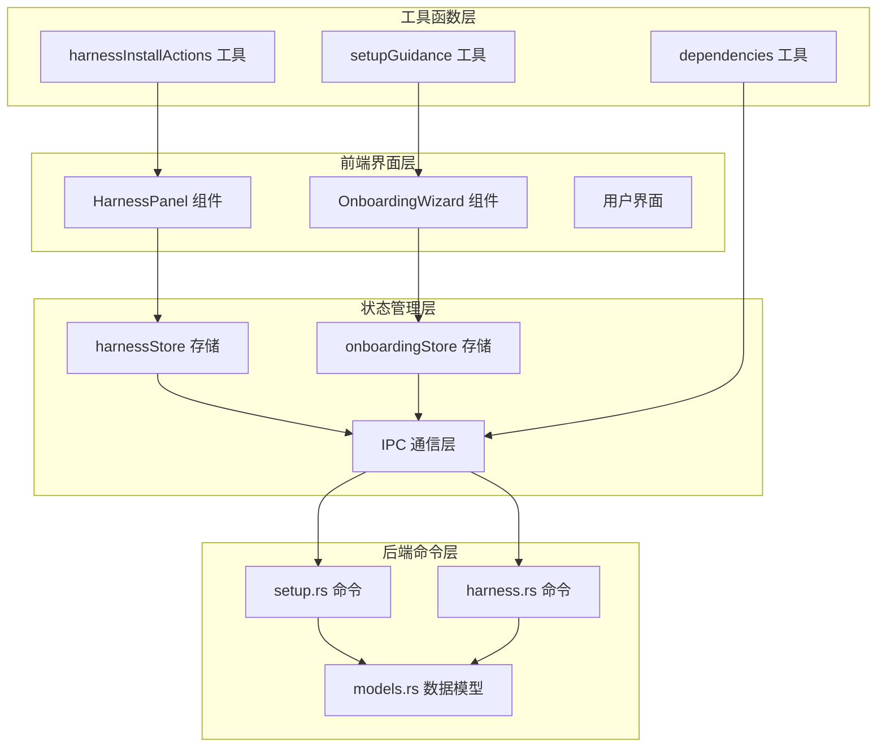
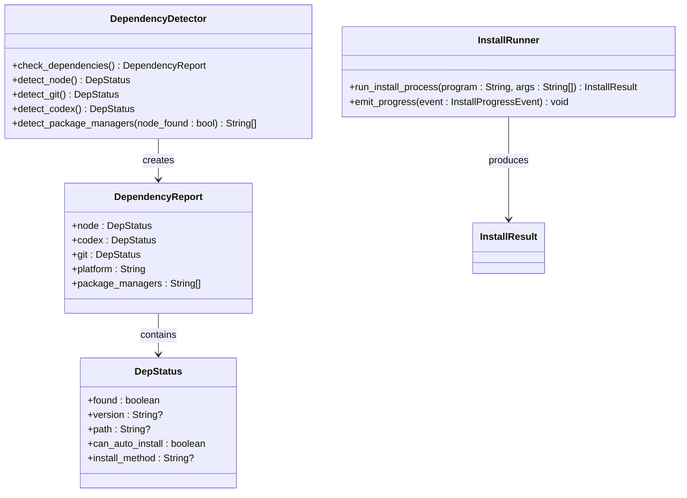
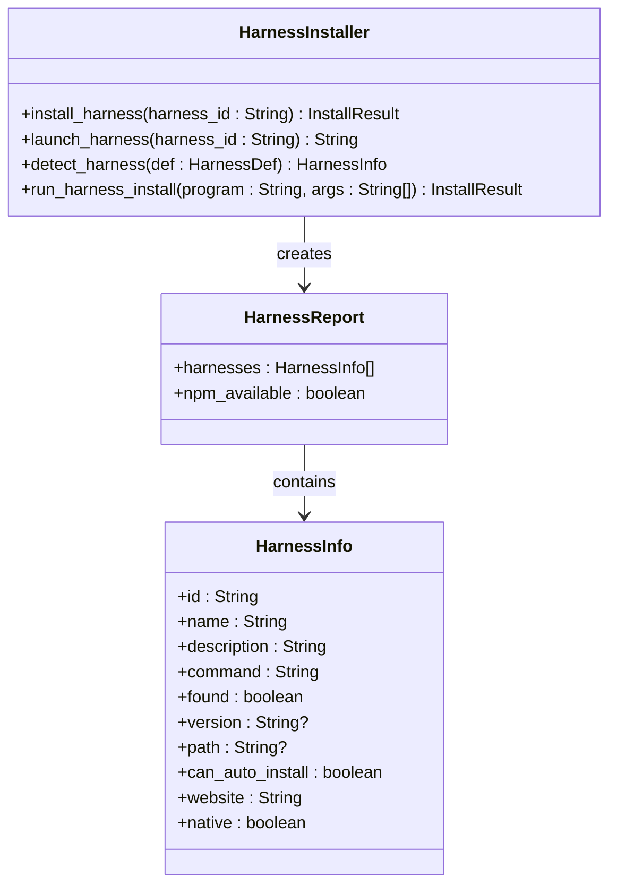
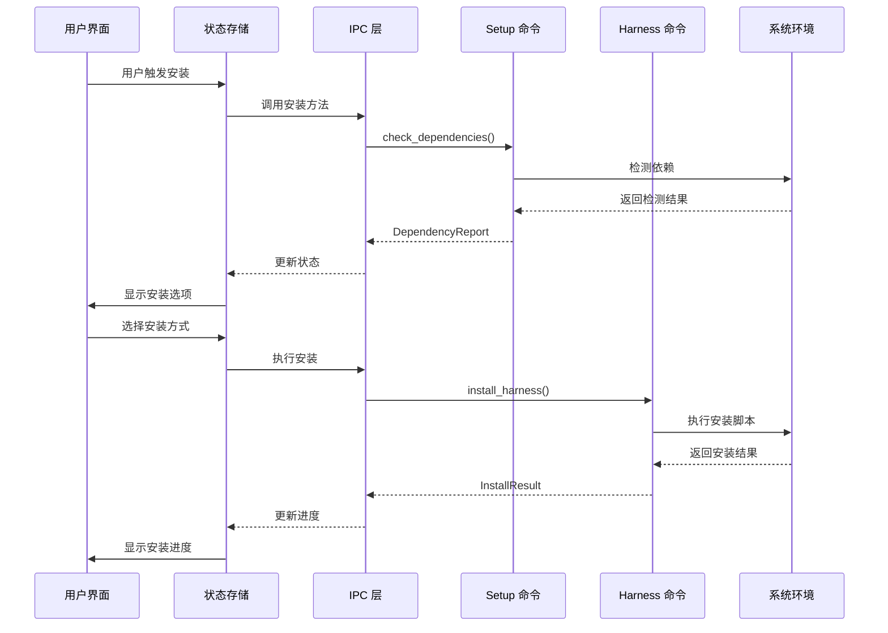
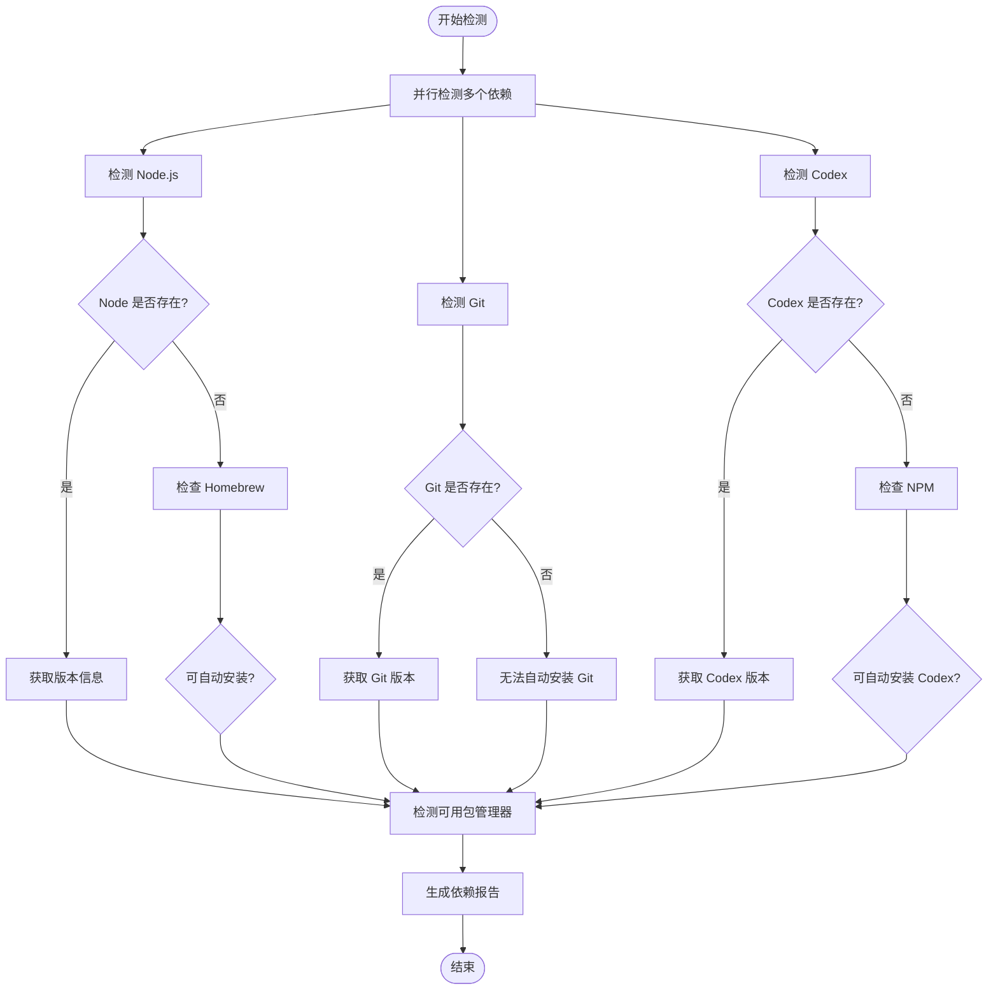
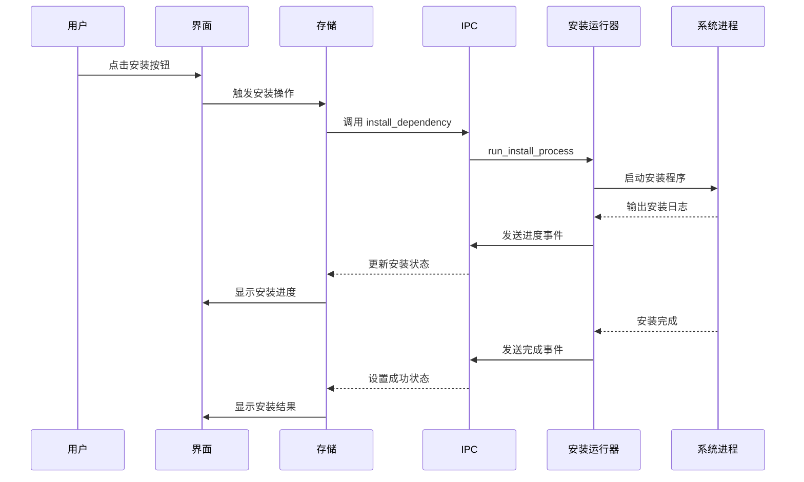
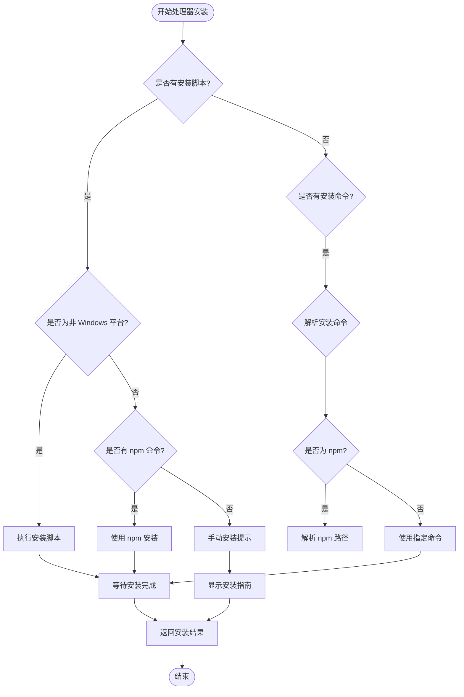
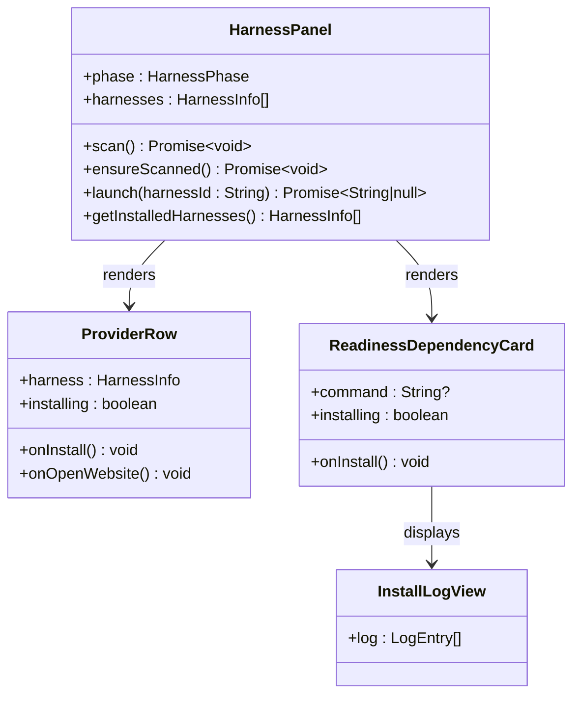
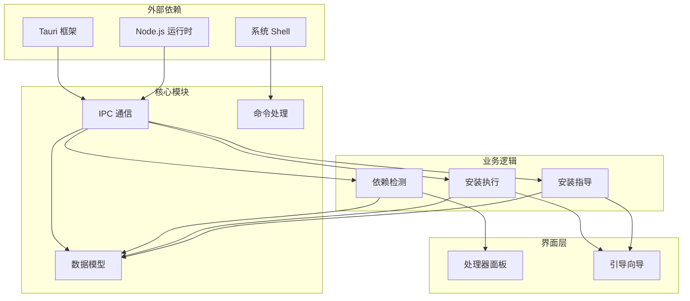

# 安装配置命令

<cite>
**本文档引用的文件**
- [harnessInstallActions.ts](file://src/lib/harnessInstallActions.ts)
- [setupGuidance.ts](file://src/lib/setupGuidance.ts)
- [HarnessPanel.tsx](file://src/components/onboarding/HarnessPanel.tsx)
- [OnboardingWizard.tsx](file://src/components/onboarding/OnboardingWizard.tsx)
- [setup.rs](file://src-tauri/src/commands/setup.rs)
- [harness.rs](file://src-tauri/src/commands/harness.rs)
- [models.rs](file://src-tauri/src/models.rs)
- [ipc.ts](file://src/lib/ipc.ts)
- [harnessStore.ts](file://src/stores/harnessStore.ts)
- [onboardingStore.ts](file://src/stores/onboardingStore.ts)
- [dependencies.ts](file://src/lib/dependencies.ts)
</cite>

## 目录
1. [简介](#简介)
2. [项目结构](#项目结构)
3. [核心组件](#核心组件)
4. [架构概览](#架构概览)
5. [详细组件分析](#详细组件分析)
6. [依赖关系分析](#依赖关系分析)
7. [性能考虑](#性能考虑)
8. [故障排除指南](#故障排除指南)
9. [结论](#结论)

## 简介

安装配置命令模块是 Panes 应用中负责处理应用安装和配置相关功能的核心模块。该模块提供了完整的安装流程管理，包括依赖检测、环境验证、自动安装和手动指导等功能。模块支持多种操作系统（Windows、macOS、Linux）和多种包管理器，为用户提供无缝的安装体验。

该模块主要包含以下功能：
- 自动检测系统依赖（Node.js、Git、Codex等）
- 智能包管理器识别和选择
- 多种安装方式支持（npm、homebrew、包管理器等）
- 用户友好的安装进度跟踪
- 错误诊断和故障排除指导

## 项目结构

安装配置命令模块采用分层架构设计，主要分为前端界面层、状态管理层和后端命令层：

**图表来源**
- [HarnessPanel.tsx:116-285](file://src/components/onboarding/HarnessPanel.tsx#L116-L285)
- [OnboardingWizard.tsx:731-800](file://src/components/onboarding/OnboardingWizard.tsx#L731-L800)
- [setup.rs:1-452](file://src-tauri/src/commands/setup.rs#L1-L452)
- [harness.rs:150-300](file://src-tauri/src/commands/harness.rs#L150-L300)

**章节来源**
- [HarnessPanel.tsx:1-285](file://src/components/onboarding/HarnessPanel.tsx#L1-L285)
- [OnboardingWizard.tsx:1-800](file://src/components/onboarding/OnboardingWizard.tsx#L1-L800)
- [setup.rs:1-452](file://src-tauri/src/commands/setup.rs#L1-L452)
- [harness.rs:150-300](file://src-tauri/src/commands/harness.rs#L150-L300)

## 核心组件

### 依赖检测与安装组件

依赖检测组件负责扫描系统中的必要依赖项，并提供相应的安装指导：

**图表来源**
- [setup.rs:20-33](file://src-tauri/src/commands/setup.rs#L20-L33)
- [setup.rs:76-178](file://src-tauri/src/commands/setup.rs#L76-L178)
- [models.rs:1000-1018](file://src-tauri/src/models.rs#L1000-L1018)

### 处理器安装组件

处理器安装组件管理各种 AI 处理器的安装和启动：

**图表来源**
- [harness.rs:161-205](file://src-tauri/src/commands/harness.rs#L161-L205)
- [harness.rs:225-270](file://src-tauri/src/commands/harness.rs#L225-L270)
- [models.rs:1038-1059](file://src-tauri/src/models.rs#L1038-L1059)

**章节来源**
- [setup.rs:1-452](file://src-tauri/src/commands/setup.rs#L1-L452)
- [harness.rs:150-300](file://src-tauri/src/commands/harness.rs#L150-L300)
- [models.rs:998-1059](file://src-tauri/src/models.rs#L998-L1059)

## 架构概览

安装配置命令模块采用前后端分离的架构设计，通过 IPC 通信实现数据传递：

**图表来源**
- [ipc.ts:617-627](file://src/lib/ipc.ts#L617-L627)
- [setup.rs:20-33](file://src-tauri/src/commands/setup.rs#L20-L33)
- [harness.rs:161-205](file://src-tauri/src/commands/harness.rs#L161-L205)

## 详细组件分析

### 依赖检测与验证

依赖检测组件实现了智能的系统环境扫描功能，能够检测 Node.js、Git 和 Codex 等关键依赖：

#### 检测流程

**图表来源**
- [setup.rs:20-33](file://src-tauri/src/commands/setup.rs#L20-L33)
- [setup.rs:76-178](file://src-tauri/src/commands/setup.rs#L76-L178)
- [setup.rs:420-451](file://src-tauri/src/commands/setup.rs#L420-L451)

#### 包管理器检测

系统支持多种包管理器，具有优先级排序机制：

| 平台 | 支持的包管理器 | 优先级顺序 |
|------|----------------|------------|
| Linux | apt, dnf, pacman, zypper, apk | 1. apt 2. dnf 3. pacman 4. zypper 5. apk |
| Windows | winget, choco, scoop | 1. winget 2. choco 3. scoop |
| macOS | homebrew | 1. homebrew |

**章节来源**
- [setup.rs:420-451](file://src-tauri/src/commands/setup.rs#L420-L451)
- [setupGuidance.ts:3-7](file://src/lib/setupGuidance.ts#L3-L7)

### 安装执行引擎

安装执行引擎负责处理各种安装请求，支持多种安装方式：

#### 安装流程

**图表来源**
- [setup.rs:184-291](file://src-tauri/src/commands/setup.rs#L184-L291)
- [onboardingStore.ts:216-246](file://src/stores/onboardingStore.ts#L216-L246)

#### 支持的安装方式

| 依赖类型 | 安装方式 | 具体命令 |
|----------|----------|----------|
| Node.js | homebrew | `brew install node` |
| Codex | npm 全局安装 | `npm install -g @openai/codex` |
| Git | 系统包管理器 | 各平台对应包管理器命令 |

**章节来源**
- [setup.rs:39-70](file://src-tauri/src/commands/setup.rs#L39-L70)
- [setupGuidance.ts:9-29](file://src/lib/setupGuidance.ts#L9-L29)

### 处理器安装管理

处理器安装管理组件专门处理各种 AI 处理器的安装，包括 Codex、Claude、Gemini 等：

#### 处理器安装策略

**图表来源**
- [harness.rs:161-205](file://src-tauri/src/commands/harness.rs#L161-L205)
- [harness.rs:285-391](file://src-tauri/src/commands/harness.rs#L285-L391)

#### 支持的处理器

| 处理器 ID | 名称 | 安装方式 | 备注 |
|-----------|------|----------|------|
| codex | Codex CLI | npm 全局安装 | `npm install -g @openai/codex` |
| claude-code | Claude Code | curl 安装脚本 | `curl -fsSL https://claude.ai/install.sh \| bash` |
| gemini-cli | Gemini CLI | npm 全局安装 | `npm install -g @google/gemini-cli` |
| kiro | Kiro | curl 安装脚本 | `curl -fsSL https://cli.kiro.dev/install \| bash` |
| opencode | OpenCode | npm 全局安装 | `npm install -g opencode-ai` |
| kilo-code | Kilo Code | npm 全局安装 | `npm install -g @kilocode/cli` |
| factory-droid | Factory Droid | curl 安装脚本 | `curl -fsSL https://app.factory.ai/cli \| sh` |

**章节来源**
- [harnessInstallActions.ts:3-17](file://src/lib/harnessInstallActions.ts#L3-L17)
- [harness.rs:161-205](file://src-tauri/src/commands/harness.rs#L161-L205)

### 用户界面组件

用户界面组件提供了直观的安装体验，包括依赖检测、安装进度跟踪和错误处理：

#### 安装面板组件

**图表来源**
- [HarnessPanel.tsx:116-285](file://src/components/onboarding/HarnessPanel.tsx#L116-L285)
- [OnboardingWizard.tsx:405-515](file://src/components/onboarding/OnboardingWizard.tsx#L405-L515)

**章节来源**
- [HarnessPanel.tsx:1-285](file://src/components/onboarding/HarnessPanel.tsx#L1-L285)
- [OnboardingWizard.tsx:1-800](file://src/components/onboarding/OnboardingWizard.tsx#L1-L800)

## 依赖关系分析

安装配置命令模块的依赖关系呈现清晰的层次结构：

**图表来源**
- [ipc.ts:1-813](file://src/lib/ipc.ts#L1-L813)
- [models.rs:1-800](file://src-tauri/src/models.rs#L1-L800)
- [setup.rs:1-452](file://src-tauri/src/commands/setup.rs#L1-L452)

### 关键依赖关系

1. **IPC 层依赖**: 所有前端组件都依赖 IPC 层进行后端通信
2. **数据模型依赖**: 后端命令依赖统一的数据模型定义
3. **平台特定依赖**: 不同平台有不同的包管理器和安装方式
4. **异步处理依赖**: 使用 tokio 异步运行时处理并发安装任务

**章节来源**
- [ipc.ts:617-627](file://src/lib/ipc.ts#L617-L627)
- [models.rs:998-1059](file://src-tauri/src/models.rs#L998-L1059)

## 性能考虑

安装配置命令模块在设计时充分考虑了性能优化：

### 并行处理
- 依赖检测采用并行方式，同时检测多个依赖项
- 安装过程中使用异步任务处理标准输出和错误输出
- 多个安装任务可以并行执行以提高整体效率

### 内存管理
- 使用流式读取方式处理大量安装日志输出
- 及时清理监听器和事件处理器
- 合理的缓存策略避免重复计算

### 网络优化
- 包管理器检测时避免不必要的网络请求
- 安装脚本下载使用高效的传输协议
- 错误重试机制避免长时间阻塞

## 故障排除指南

### 常见安装问题及解决方案

#### 依赖检测失败

**问题**: 系统无法检测到已安装的依赖项

**可能原因**:
- PATH 环境变量配置不正确
- 依赖项安装在非标准位置
- 权限不足导致无法访问

**解决方案**:
1. 检查 PATH 环境变量是否包含依赖项路径
2. 手动指定依赖项的完整路径
3. 以管理员权限重新安装依赖项

#### 包管理器不可用

**问题**: 系统检测不到可用的包管理器

**可能原因**:
- 包管理器未正确安装
- 包管理器不在 PATH 中
- 权限不足

**解决方案**:
1. 手动安装对应的包管理器
2. 将包管理器添加到 PATH 环境变量
3. 检查用户权限设置

#### 安装过程卡住

**问题**: 安装过程长时间无响应

**可能原因**:
- 网络连接不稳定
- 包管理器服务不可用
- 系统资源不足

**解决方案**:
1. 检查网络连接状态
2. 切换到其他包管理器源
3. 清理系统缓存后重试
4. 关闭占用大量资源的应用程序

#### 权限错误

**问题**: 安装过程中出现权限错误

**可能原因**:
- 需要管理员权限
- 文件系统权限配置不当
- SELinux/AppArmor 限制

**解决方案**:
1. 以管理员身份运行安装程序
2. 修改目标目录的权限设置
3. 临时禁用安全软件进行安装

### 调试和诊断

#### 日志分析

安装过程会实时输出详细的日志信息，包括：
- 安装命令执行详情
- 标准输出和错误输出
- 安装进度状态
- 错误发生的具体位置

#### 状态监控

系统提供多种状态监控机制：
- 实时安装进度跟踪
- 错误状态自动检测
- 超时自动重试机制
- 完整的错误回滚处理

**章节来源**
- [setup.rs:184-291](file://src-tauri/src/commands/setup.rs#L184-L291)
- [harness.rs:285-391](file://src-tauri/src/commands/harness.rs#L285-L391)
- [onboardingStore.ts:216-246](file://src/stores/onboardingStore.ts#L216-L246)

## 结论

安装配置命令模块通过精心设计的架构和完善的错误处理机制，为用户提供了可靠、高效的安装体验。模块的主要优势包括：

1. **跨平台兼容性**: 支持 Windows、macOS、Linux 三大主流操作系统
2. **智能检测**: 自动识别系统环境和可用的包管理器
3. **多方式安装**: 支持 npm、homebrew、系统包管理器等多种安装方式
4. **用户友好**: 提供直观的界面和详细的安装指导
5. **健壮性**: 完善的错误处理和故障恢复机制

该模块的成功实施为 Panes 应用的用户提供了无缝的安装体验，降低了技术门槛，提高了用户满意度。通过持续的优化和改进，该模块将继续为用户创造更好的使用体验。