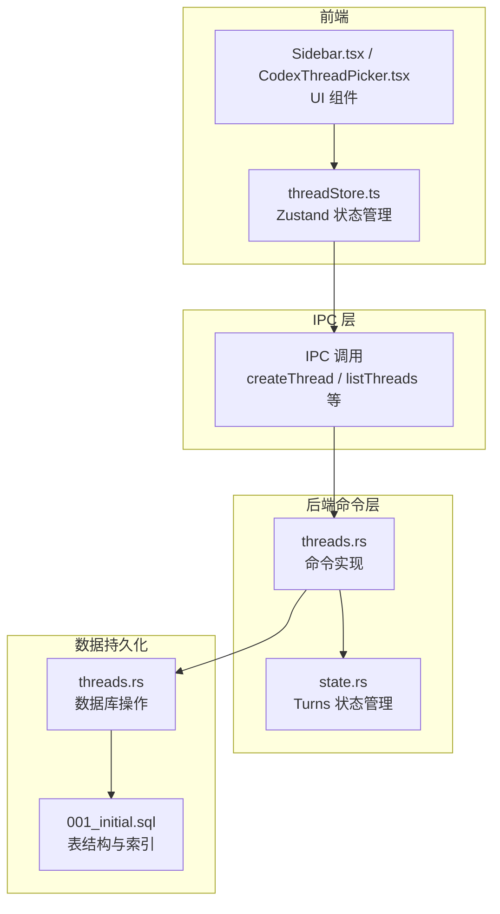
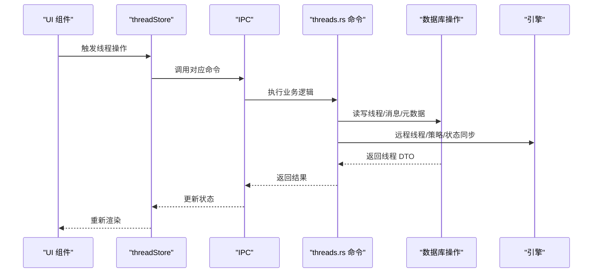
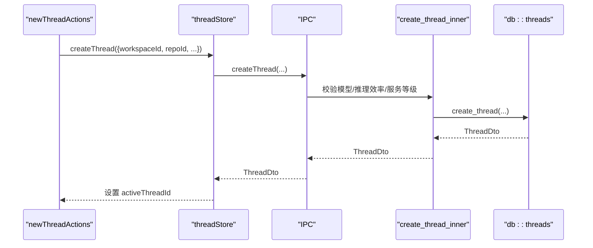
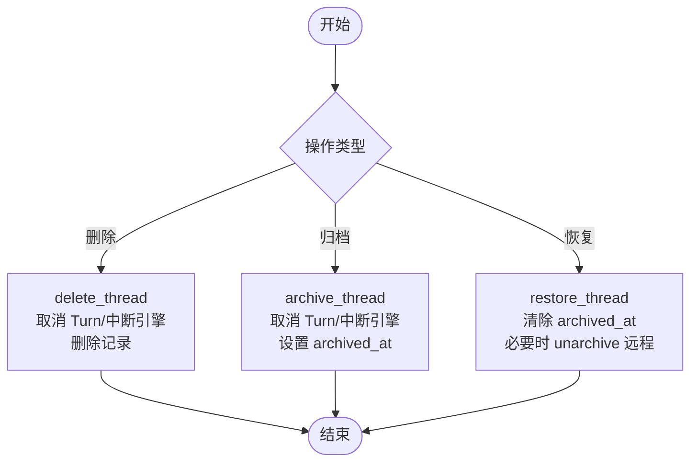
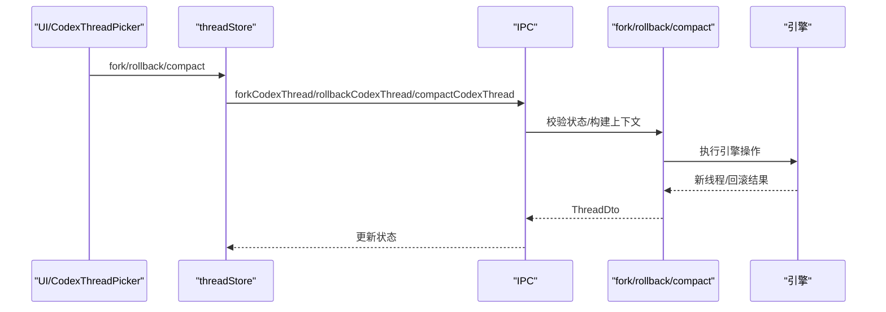
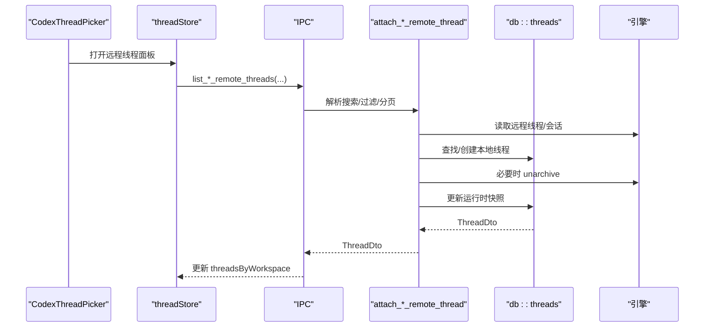
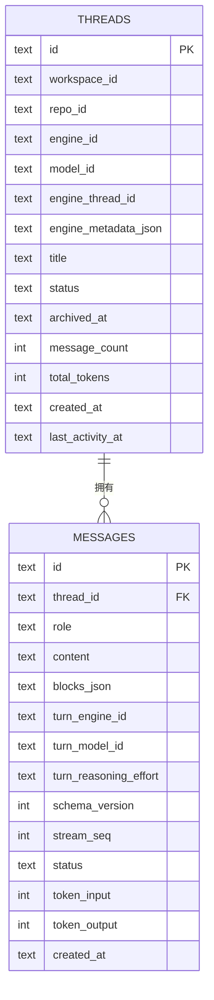
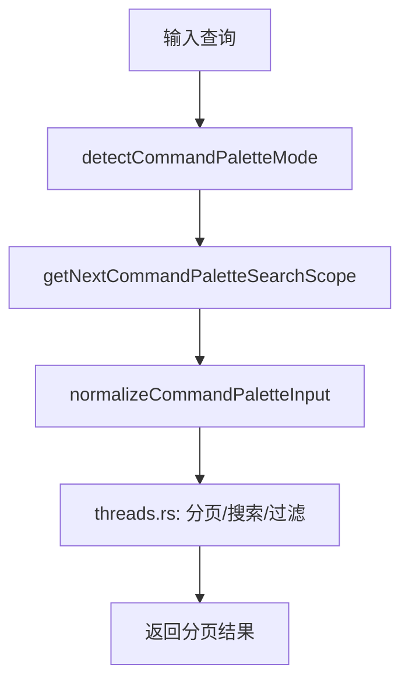
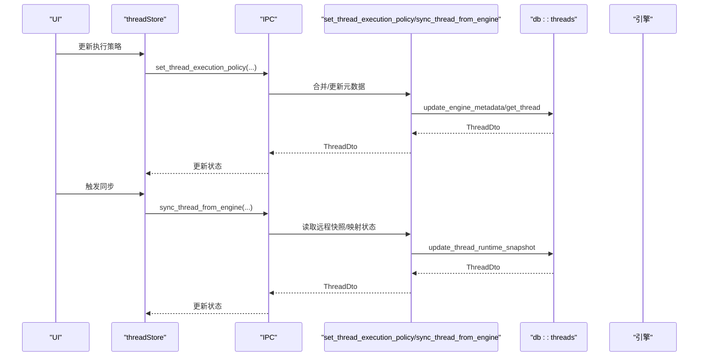
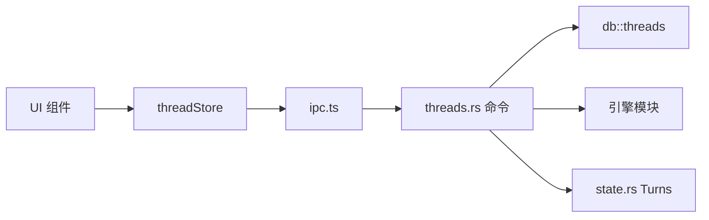

# 对话线程命令

<cite>
**本文档引用的文件**
- [threadStore.ts](file://src/stores/threadStore.ts)
- [threads.rs](file://src-tauri/src/commands/threads.rs)
- [threads.rs](file://src-tauri/src/db/threads.rs)
- [001_initial.sql](file://src-tauri/src/db/migrations/001_initial.sql)
- [types.ts](file://src/types.ts)
- [newThreadActions.ts](file://src/lib/newThreadActions.ts)
- [commandPalette.ts](file://src/lib/commandPalette.ts)
- [Sidebar.tsx](file://src/components/sidebar/Sidebar.tsx)
- [CodexThreadPicker.tsx](file://src/components/chat/CodexThreadPicker.tsx)
- [chatStore.ts](file://src/stores/chatStore.ts)
- [state.rs](file://src-tauri/src/state.rs)
</cite>

## 目录
1. [简介](#简介)
2. [项目结构](#项目结构)
3. [核心组件](#核心组件)
4. [架构总览](#架构总览)
5. [详细组件分析](#详细组件分析)
6. [依赖关系分析](#依赖关系分析)
7. [性能考虑](#性能考虑)
8. [故障排除指南](#故障排除指南)
9. [结论](#结论)

## 简介
本文件系统性梳理对话线程命令模块，覆盖线程生命周期管理（创建、删除、归档/恢复）、线程复制与回滚、远程线程挂载、状态管理与持久化、搜索与过滤、以及线程间数据共享与同步策略。目标是帮助开发者快速理解前端状态层与后端命令层的协作方式，并为扩展与维护提供清晰指引。

## 项目结构
线程命令模块由三层构成：
- 前端状态层：通过 zustand 管理线程集合、活动线程、本地更新与错误状态，封装 IPC 调用。
- 后端命令层：暴露 Rust 命令接口，处理线程 CRUD、归档/恢复、复制/回滚、远程线程挂载等业务逻辑。
- 数据持久化层：SQLite 表结构定义与迁移脚本，配合数据库操作函数实现线程与消息的持久化。

**图表来源**
- [threadStore.ts:164-712](file://src/stores/threadStore.ts#L164-L712)
- [threads.rs:32-118](file://src-tauri/src/commands/threads.rs#L32-L118)
- [threads.rs:15-95](file://src-tauri/src/db/threads.rs#L15-L95)
- [001_initial.sql:25-41](file://src-tauri/src/db/migrations/001_initial.sql#L25-L41)

**章节来源**
- [threadStore.ts:164-712](file://src/stores/threadStore.ts#L164-L712)
- [threads.rs:32-118](file://src-tauri/src/commands/threads.rs#L32-L118)
- [threads.rs:15-95](file://src-tauri/src/db/threads.rs#L15-L95)
- [001_initial.sql:25-41](file://src-tauri/src/db/migrations/001_initial.sql#L25-L41)

## 核心组件
- 线程状态存储（threadStore）
  - 提供线程集合、按工作区分组、归档列表、活动线程 ID、加载与错误状态。
  - 暴露线程操作方法：创建、重命名、确保线程、刷新、删除（归档）、恢复、复制（fork/rollback/compact）、挂载远程线程（Codex/OpenCode）。
  - 支持本地状态更新（applyThreadUpdateLocal）、推理效率与模型设置的本地更新。
- 后端线程命令（threads.rs）
  - 列表查询、归档/恢复、删除、重命名、复制（fork）、回滚（rollback）、压缩（compact）、执行策略设置、从引擎同步。
  - 远程线程浏览与挂载：Codex 远程线程分页、OpenCode 远程会话列表、挂载到本地线程。
- 数据库层（threads.rs + 001_initial.sql）
  - 线程表结构、索引、FTS 全文检索触发器；提供创建、查询、更新、归档/恢复、删除、统计刷新等操作。
- 类型定义（types.ts）
  - Thread 接口、ThreadStatus 枚举、远程线程 DTO、命令参数类型等。

**章节来源**
- [threadStore.ts:34-67](file://src/stores/threadStore.ts#L34-L67)
- [threads.rs:32-118](file://src-tauri/src/commands/threads.rs#L32-L118)
- [threads.rs:15-95](file://src-tauri/src/db/threads.rs#L15-L95)
- [types.ts:162-176](file://src/types.ts#L162-L176)

## 架构总览
前端通过 IPC 调用后端命令，命令在事务中读写 SQLite，并与引擎交互（如远程线程、执行策略）。状态变更通过数据库操作返回最新线程 DTO，前端据此更新内存状态与本地存储。

**图表来源**
- [threadStore.ts:170-220](file://src/stores/threadStore.ts#L170-L220)
- [threads.rs:652-743](file://src-tauri/src/commands/threads.rs#L652-L743)
- [threads.rs:15-95](file://src-tauri/src/db/threads.rs#L15-L95)

## 详细组件分析

### 线程创建与激活流程
- 前端动作：newThreadActions 创建并激活工作区线程，设置视图、布局与仓库上下文，调用 threadStore.createThread。
- 后端命令：create_thread_inner 校验模型与推理效率，生成线程元数据，插入数据库并返回线程 DTO。
- 前端更新：合并到 threadsByWorkspace，更新 activeThreadId，写入本地存储。

**图表来源**
- [newThreadActions.ts:13-51](file://src/lib/newThreadActions.ts#L13-L51)
- [threadStore.ts:170-220](file://src/stores/threadStore.ts#L170-L220)
- [threads.rs:676-743](file://src-tauri/src/commands/threads.rs#L676-L743)
- [threads.rs:15-33](file://src-tauri/src/db/threads.rs#L15-L33)

**章节来源**
- [newThreadActions.ts:13-51](file://src/lib/newThreadActions.ts#L13-L51)
- [threadStore.ts:170-220](file://src/stores/threadStore.ts#L170-L220)
- [threads.rs:676-743](file://src-tauri/src/commands/threads.rs#L676-L743)
- [threads.rs:15-33](file://src-tauri/src/db/threads.rs#L15-L33)

### 线程删除与归档/恢复
- 删除（delete_thread）：取消进行中的 Turn、中断引擎线程、删除线程记录。
- 归档（archive_thread）：取消 Turn、中断引擎线程、标记 archived_at。
- 恢复（restore_thread）：解除归档标记，必要时对远程线程执行 unarchive 操作。

**图表来源**
- [threads.rs:918-951](file://src-tauri/src/commands/threads.rs#L918-L951)
- [threads.rs:954-1000](file://src-tauri/src/commands/threads.rs#L954-L1000)
- [threads.rs:1002-1035](file://src-tauri/src/commands/threads.rs#L1002-L1035)

**章节来源**
- [threads.rs:918-951](file://src-tauri/src/commands/threads.rs#L918-L951)
- [threads.rs:954-1000](file://src-tauri/src/commands/threads.rs#L954-L1000)
- [threads.rs:1002-1035](file://src-tauri/src/commands/threads.rs#L1002-L1035)

### 线程复制、回滚与压缩
- 复制（fork_codex_thread）：校验无活动 Turn、读取线程上下文，调用引擎 fork 并更新本地元数据。
- 回滚（rollback_codex_thread）：指定回退轮次，调用引擎回滚并更新本地状态。
- 压缩（compact_codex_thread）：清理冗余上下文，减少 Token 使用。

**图表来源**
- [CodexThreadPicker.tsx:181-226](file://src/components/chat/CodexThreadPicker.tsx#L181-L226)
- [threadStore.ts:460-549](file://src/stores/threadStore.ts#L460-L549)
- [threads.rs:1182-1208](file://src-tauri/src/commands/threads.rs#L1182-L1208)
- [threads.rs:1209-1240](file://src-tauri/src/commands/threads.rs#L1209-L1240)
- [threads.rs:1325-1338](file://src-tauri/src/commands/threads.rs#L1325-L1338)

**章节来源**
- [CodexThreadPicker.tsx:181-226](file://src/components/chat/CodexThreadPicker.tsx#L181-L226)
- [threadStore.ts:460-549](file://src/stores/threadStore.ts#L460-L549)
- [threads.rs:1182-1208](file://src-tauri/src/commands/threads.rs#L1182-L1208)
- [threads.rs:1209-1240](file://src-tauri/src/commands/threads.rs#L1209-L1240)
- [threads.rs:1325-1338](file://src-tauri/src/commands/threads.rs#L1325-L1338)

### 远程线程挂载与浏览
- Codex 远程线程：支持分页、搜索、过滤（活跃/归档），匹配本地工作区根与仓库路径，映射为本地线程。
- OpenCode 远程会话：按 CWD 过滤，去重后分页展示，支持挂载为本地线程。
- 挂载流程：校验模型可用性、解析 CWD、读取远程状态、创建或恢复本地线程、更新运行时快照。

**图表来源**
- [threads.rs:54-118](file://src-tauri/src/commands/threads.rs#L54-L118)
- [threads.rs:208-370](file://src-tauri/src/commands/threads.rs#L208-L370)
- [threads.rs:120-206](file://src-tauri/src/commands/threads.rs#L120-L206)
- [threads.rs:276-370](file://src-tauri/src/commands/threads.rs#L276-L370)

**章节来源**
- [threads.rs:54-118](file://src-tauri/src/commands/threads.rs#L54-L118)
- [threads.rs:208-370](file://src-tauri/src/commands/threads.rs#L208-L370)
- [threads.rs:120-206](file://src-tauri/src/commands/threads.rs#L120-L206)
- [threads.rs:276-370](file://src-tauri/src/commands/threads.rs#L276-L370)

### 线程状态管理与持久化
- 状态枚举与模型：ThreadStatus 定义空闲/流式/等待审批/错误/完成；Thread 接口包含计数与时间戳字段。
- 数据库结构：threads 表含引擎标识、模型、引擎线程 ID、元数据 JSON、标题、状态、归档时间、消息计数与 Token 总量、创建与最后活跃时间。
- 索引与全文检索：基于 FTS 的消息全文检索触发器，提升搜索性能。
- 运行时恢复：启动时扫描消息流式状态，修正线程状态与消息状态。

**图表来源**
- [001_initial.sql:25-58](file://src-tauri/src/db/migrations/001_initial.sql#L25-L58)
- [threads.rs:415-434](file://src-tauri/src/db/threads.rs#L415-L434)

**章节来源**
- [types.ts:153-176](file://src/types.ts#L153-L176)
- [001_initial.sql:25-58](file://src-tauri/src/db/migrations/001_initial.sql#L25-L58)
- [threads.rs:415-434](file://src-tauri/src/db/threads.rs#L415-L434)

### 线程搜索、过滤与排序
- 前端搜索：命令面板检测模式（thread/workspace/file/search），支持前缀切换与搜索范围循环。
- 后端搜索：远程线程列表支持搜索词规范化、游标分页、限制数量（1-100），并按更新时间排序。
- 本地排序：前端按 lastActivityAt 降序排列线程列表。

**图表来源**
- [commandPalette.ts:31-98](file://src/lib/commandPalette.ts#L31-L98)
- [threads.rs:54-118](file://src-tauri/src/commands/threads.rs#L54-L118)
- [threadStore.ts:83-87](file://src/stores/threadStore.ts#L83-L87)

**章节来源**
- [commandPalette.ts:31-98](file://src/lib/commandPalette.ts#L31-L98)
- [threads.rs:54-118](file://src-tauri/src/commands/threads.rs#L54-L118)
- [threadStore.ts:83-87](file://src/stores/threadStore.ts#L83-L87)

### 线程间数据共享与同步
- 执行策略与权限：set_thread_execution_policy 支持审批策略、沙箱模式、网络许可、权限配置与审批审查者设置，统一写入 engine_metadata。
- 远程同步：sync_thread_from_engine 将远程线程状态映射为本地 ThreadStatus，合并运行时元数据，必要时导入消息快照。
- 线程事件监听：chatStore 在切换活动线程时安装/卸载监听器，保证流式状态正确更新。

**图表来源**
- [threads.rs:1340-1370](file://src-tauri/src/commands/threads.rs#L1340-L1370)
- [threads.rs:1037-1162](file://src-tauri/src/commands/threads.rs#L1037-L1162)
- [threads.rs:280-304](file://src-tauri/src/db/threads.rs#L280-L304)
- [chatStore.ts:1542-1580](file://src/stores/chatStore.ts#L1542-L1580)

**章节来源**
- [threads.rs:1340-1370](file://src-tauri/src/commands/threads.rs#L1340-L1370)
- [threads.rs:1037-1162](file://src-tauri/src/commands/threads.rs#L1037-L1162)
- [threads.rs:280-304](file://src-tauri/src/db/threads.rs#L280-L304)
- [chatStore.ts:1542-1580](file://src/stores/chatStore.ts#L1542-L1580)

## 依赖关系分析
- 前端依赖
  - threadStore 依赖 ipc、newThreadRuntime、onboarding、engineStore、chatComposerStore 等，用于隐式推断新线程运行时。
  - UI 组件依赖 threadStore 与命令面板工具，提供线程选择、归档、复制等交互。
- 后端依赖
  - threads.rs 命令依赖数据库模块、引擎模块、状态模块（Turns），并使用 tokio 任务池执行阻塞数据库操作。
  - state.rs 提供并发安全的 Turn 取消/完成令牌管理，避免并发冲突。

**图表来源**
- [threadStore.ts:164-712](file://src/stores/threadStore.ts#L164-L712)
- [threads.rs:32-118](file://src-tauri/src/commands/threads.rs#L32-L118)
- [state.rs:39-55](file://src-tauri/src/state.rs#L39-L55)

**章节来源**
- [threadStore.ts:164-712](file://src/stores/threadStore.ts#L164-L712)
- [threads.rs:32-118](file://src-tauri/src/commands/threads.rs#L32-L118)
- [state.rs:39-55](file://src-tauri/src/state.rs#L39-L55)

## 性能考虑
- 数据库连接池：SQLite 使用连接池与阻塞任务执行，避免主线程阻塞。
- 索引优化：threads 表针对 workspace_id、status、last_activity_at 建立复合索引，加速列表查询与排序。
- 全文检索：消息表启用 FTS5，结合触发器自动维护可搜索文本，提升搜索性能。
- 分页与限制：远程线程列表默认每页 20 条，限制最大 100，降低网络与渲染压力。
- 状态更新幂等：数据库更新语句包含状态检查，避免重复写入。

[本节为通用指导，不直接分析具体文件，无需列出章节来源]

## 故障排除指南
- 线程未找到：命令返回 “thread not found” 错误，检查 thread_id 是否正确或已被删除。
- 远程线程不可挂载：Codex 线程 cwd 不在工作区范围内或模型不支持，需调整工作区或选择可用模型。
- 并发冲突：复制/回滚时若存在活动 Turn，命令会拒绝执行；请等待当前 Turn 结束后再试。
- 状态异常：启动时运行时恢复会将流式助手消息标记为中断并修正线程状态，若仍异常，可手动刷新线程列表。

**章节来源**
- [threads.rs:918-951](file://src-tauri/src/commands/threads.rs#L918-L951)
- [threads.rs:1182-1208](file://src-tauri/src/commands/threads.rs#L1182-L1208)
- [threads.rs:314-367](file://src-tauri/src/db/threads.rs#L314-L367)

## 结论
对话线程命令模块以清晰的前后端分层实现线程全生命周期管理，结合 SQLite 持久化与引擎集成，提供了可靠的线程复制、远程挂载、状态同步与搜索能力。通过合理的索引与分页策略，系统在大数据量场景下仍能保持良好性能。建议在扩展新功能时遵循现有命令模式与状态更新流程，确保一致性与可维护性。