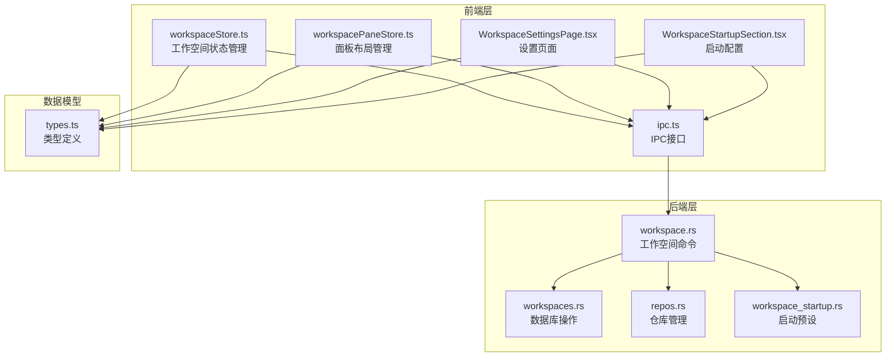
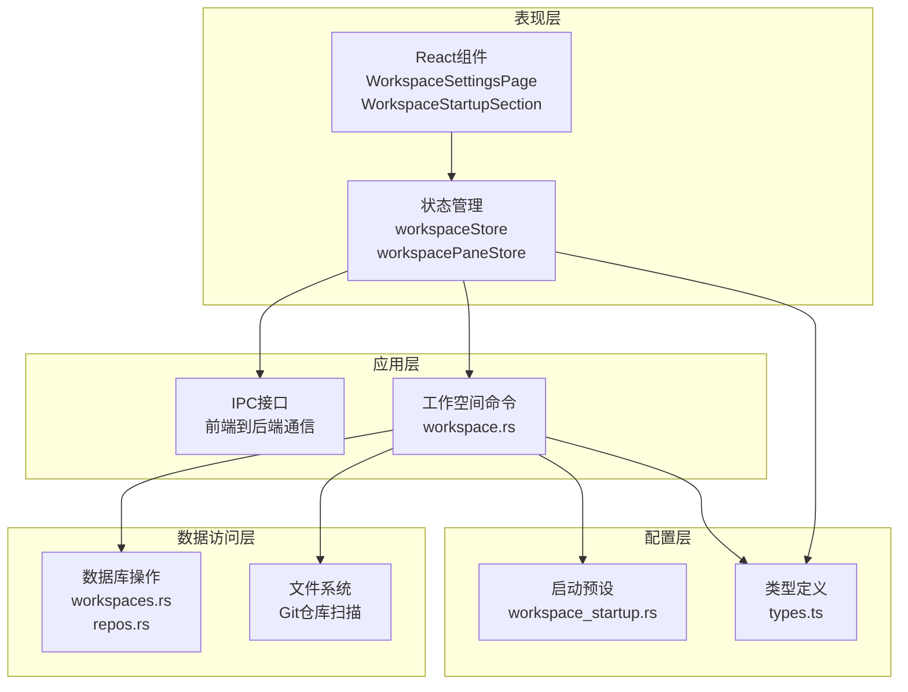
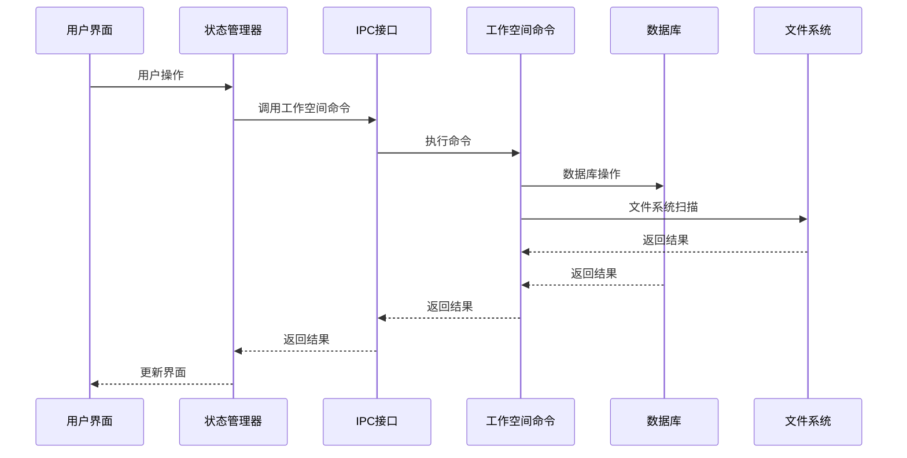
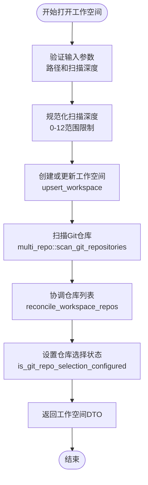
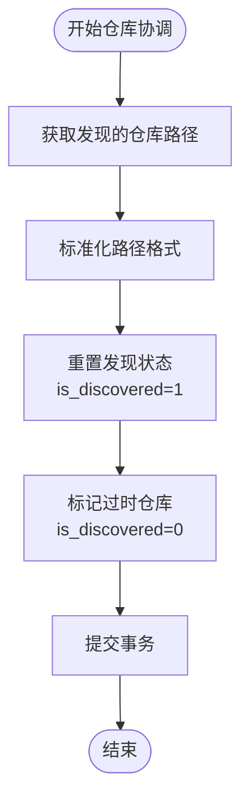
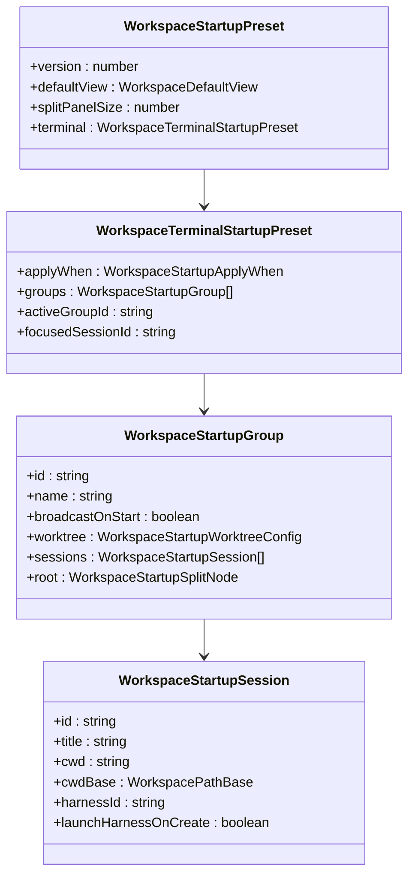
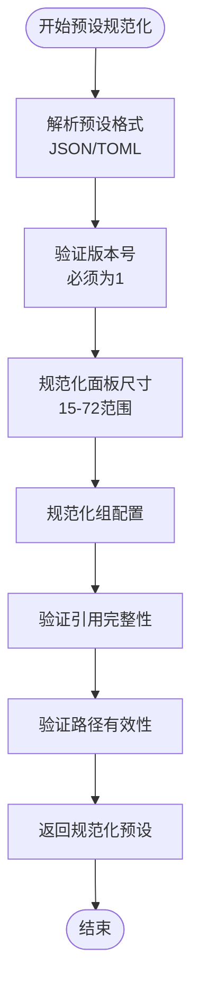
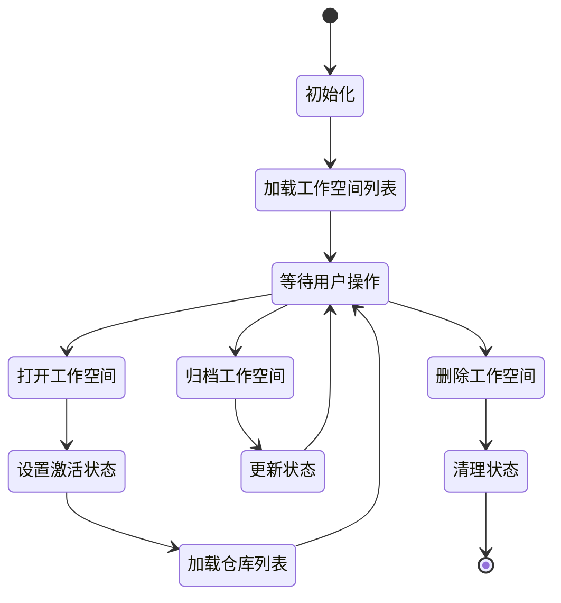
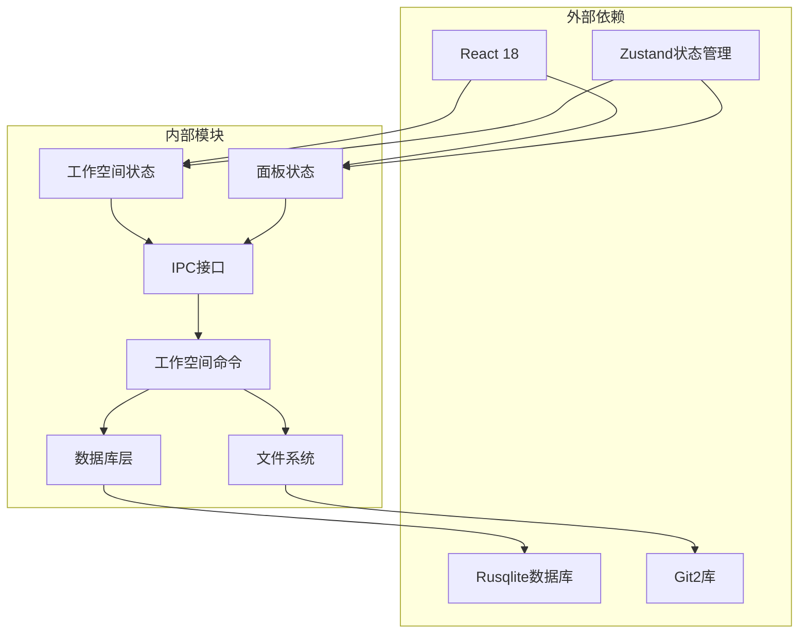
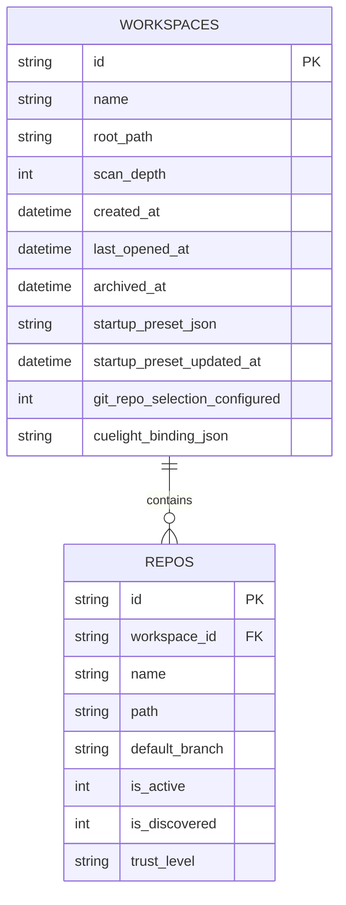

# 工作空间命令

<cite>
**本文档引用的文件**
- [workspace.rs](file://src-tauri/src/commands/workspace.rs)
- [workspaceStore.ts](file://src/stores/workspaceStore.ts)
- [workspacePaneStore.ts](file://src/stores/workspacePaneStore.ts)
- [WorkspaceSettingsPage.tsx](file://src/components/workspace/WorkspaceSettingsPage.tsx)
- [WorkspaceStartupSection.tsx](file://src/components/workspace/WorkspaceStartupSection.tsx)
- [ipc.ts](file://src/lib/ipc.ts)
- [workspaces.rs](file://src-tauri/src/db/workspaces.rs)
- [repos.rs](file://src-tauri/src/db/repos.rs)
- [workspace_startup.rs](file://src-tauri/src/workspace_startup.rs)
- [types.ts](file://src/types.ts)
</cite>

## 目录
1. [简介](#简介)
2. [项目结构](#项目结构)
3. [核心组件](#核心组件)
4. [架构概览](#架构概览)
5. [详细组件分析](#详细组件分析)
6. [依赖关系分析](#依赖关系分析)
7. [性能考虑](#性能考虑)
8. [故障排除指南](#故障排除指南)
9. [结论](#结论)

## 简介

工作空间命令模块是 Panes 应用程序中负责管理工作空间的核心功能模块。该模块提供了完整的工作空间生命周期管理能力，包括工作空间的创建、切换、删除、归档和恢复等操作。同时，它还支持工作空间的配置管理、状态跟踪、数据隔离以及启动预设的管理功能。

该模块采用前后端分离的设计模式，前端使用 React 和 TypeScript 实现用户界面交互，后端使用 Rust 实现高性能的数据处理和存储功能。通过 IPC（进程间通信）机制实现前后端的数据交换和命令调用。

## 项目结构

工作空间命令模块主要分布在以下目录和文件中：

**图表来源**
- [workspace.rs:1-384](file://src-tauri/src/commands/workspace.rs#L1-L384)
- [workspaceStore.ts:1-455](file://src/stores/workspaceStore.ts#L1-L455)
- [workspacePaneStore.ts:1-696](file://src/stores/workspacePaneStore.ts#L1-L696)

**章节来源**
- [workspace.rs:1-384](file://src-tauri/src/commands/workspace.rs#L1-L384)
- [workspaceStore.ts:1-455](file://src/stores/workspaceStore.ts#L1-L455)
- [workspacePaneStore.ts:1-696](file://src/stores/workspacePaneStore.ts#L1-L696)

## 核心组件

### 工作空间命令接口

工作空间命令模块提供了以下核心命令接口：

#### 基础管理命令
- `open_workspace`: 打开或创建工作空间，支持扫描深度配置
- `list_workspaces`: 列出所有工作空间
- `list_archived_workspaces`: 列出已归档的工作空间
- `delete_workspace`: 删除工作空间
- `archive_workspace`: 归档工作空间
- `restore_workspace`: 恢复工作空间

#### 仓库管理命令
- `get_repos`: 获取工作空间中的仓库列表
- `set_repo_trust_level`: 设置仓库信任级别
- `set_repo_git_active`: 设置仓库 Git 活跃状态
- `set_workspace_git_active_repos`: 设置工作空间活跃仓库集合

#### 启动预设命令
- `get_workspace_startup_preset`: 获取工作空间启动预设
- `normalize_workspace_startup_preset`: 规范化启动预设
- `serialize_workspace_startup_preset`: 序列化启动预设
- `normalize_workspace_startup_preset_raw`: 规范化原始启动预设
- `set_workspace_startup_preset`: 设置启动预设
- `set_workspace_startup_preset_raw`: 设置原始启动预设
- `clear_workspace_startup_preset`: 清除启动预设
- `export_workspace_startup_preset`: 导出启动预设

#### 文件系统命令
- `list_workspace_dirs`: 列出工作空间目录
- `get_workspace_file_tree_page`: 获取文件树分页
- `search_workspace_files`: 搜索工作空间文件

**章节来源**
- [workspace.rs:33-384](file://src-tauri/src/commands/workspace.rs#L33-L384)
- [ipc.ts:102-190](file://src/lib/ipc.ts#L102-L190)

### 状态管理组件

#### 工作空间状态管理
工作空间状态管理器负责维护工作空间的全局状态，包括：
- 当前激活的工作空间 ID
- 工作空间列表和归档列表
- 仓库列表和活跃仓库状态
- 加载状态和错误处理

#### 面板布局管理
面板布局管理器提供工作空间内面板的布局管理功能：
- 面板分割和组合
- 面板大小调整
- 面板焦点管理
- 布局持久化

**章节来源**
- [workspaceStore.ts:11-455](file://src/stores/workspaceStore.ts#L11-L455)
- [workspacePaneStore.ts:38-696](file://src/stores/workspacePaneStore.ts#L38-L696)

## 架构概览

工作空间命令模块采用分层架构设计，确保了良好的可维护性和扩展性：

**图表来源**
- [workspace.rs:1-384](file://src-tauri/src/commands/workspace.rs#L1-L384)
- [workspaceStore.ts:1-455](file://src/stores/workspaceStore.ts#L1-L455)
- [workspacePaneStore.ts:1-696](file://src/stores/workspacePaneStore.ts#L1-L696)

### 数据流图

**图表来源**
- [ipc.ts:73-190](file://src/lib/ipc.ts#L73-L190)
- [workspace.rs:22-384](file://src-tauri/src/commands/workspace.rs#L22-L384)

## 详细组件分析

### 工作空间管理命令

#### 打开工作空间流程

**图表来源**
- [workspace.rs:34-66](file://src-tauri/src/commands/workspace.rs#L34-L66)
- [workspaces.rs:16-59](file://src-tauri/src/db/workspaces.rs#L16-L59)

#### 工作空间生命周期管理

工作空间生命周期管理包括以下关键操作：

1. **创建和初始化**
   - 路径规范化和验证
   - 默认扫描深度设置
   - 工作空间名称生成

2. **状态跟踪**
   - 最近打开时间更新
   - 归档状态管理
   - 创建时间记录

3. **数据隔离**
   - 每个工作空间独立的数据库记录
   - 仓库与工作空间的关联关系
   - 配置数据的命名空间隔离

**章节来源**
- [workspace.rs:34-66](file://src-tauri/src/commands/workspace.rs#L34-L66)
- [workspaces.rs:16-120](file://src-tauri/src/db/workspaces.rs#L16-L120)

### 仓库管理功能

#### 仓库发现和协调

**图表来源**
- [repos.rs:101-154](file://src-tauri/src/db/repos.rs#L101-L154)

#### 信任级别管理

仓库信任级别系统提供了多层级的安全控制：

| 信任级别 | 描述 | 权限范围 |
|---------|------|----------|
| trusted | 受信任 | 完全权限，可执行任意操作 |
| standard | 标准 | 正常开发权限，有限制的操作 |
| restricted | 受限制 | 基本只读权限，严格限制 |

**章节来源**
- [repos.rs:156-186](file://src-tauri/src/db/repos.rs#L156-L186)
- [types.ts:1-11](file://src/types.ts#L1-L11)

### 启动预设管理系统

#### 预设序列化和反序列化

启动预设系统支持多种格式的序列化：

**图表来源**
- [workspace_startup.rs:60-151](file://src-tauri/src/workspace_startup.rs#L60-L151)
- [types.ts:100-151](file://src/types.ts#L100-L151)

#### 预设规范化流程

**图表来源**
- [workspace_startup.rs:169-199](file://src-tauri/src/workspace_startup.rs#L169-L199)
- [workspace_startup.rs:201-238](file://src-tauri/src/workspace_startup.rs#L201-L238)

**章节来源**
- [workspace_startup.rs:141-167](file://src-tauri/src/workspace_startup.rs#L141-L167)
- [workspace_startup.rs:169-296](file://src-tauri/src/workspace_startup.rs#L169-L296)

### 状态管理和数据隔离

#### 工作空间状态管理

工作空间状态管理器实现了完整的状态同步机制：

**图表来源**
- [workspaceStore.ts:140-303](file://src/stores/workspaceStore.ts#L140-L303)

#### 数据隔离机制

系统通过以下方式实现数据隔离：

1. **数据库层面**
   - 每个工作空间独立的记录表
   - 仓库与工作空间的外键关联
   - 配置数据的命名空间隔离

2. **内存层面**
   - 工作空间特定的状态存储
   - 面板布局的本地持久化
   - 用户偏好设置的隔离

3. **文件系统层面**
   - 工作空间根目录的访问控制
   - Git仓库的独立管理
   - 文件路径的规范化处理

**章节来源**
- [workspaceStore.ts:1-455](file://src/stores/workspaceStore.ts#L1-L455)
- [workspacePaneStore.ts:1-696](file://src/stores/workspacePaneStore.ts#L1-L696)

## 依赖关系分析

### 组件依赖图

**图表来源**
- [workspaceStore.ts:1-5](file://src/stores/workspaceStore.ts#L1-L5)
- [workspacePaneStore.ts:1-3](file://src/stores/workspacePaneStore.ts#L1-L3)

### 数据库关系图

**图表来源**
- [workspaces.rs:405-419](file://src-tauri/src/db/workspaces.rs#L405-L419)
- [repos.rs:288-299](file://src-tauri/src/db/repos.rs#L288-L299)

**章节来源**
- [workspaces.rs:1-636](file://src-tauri/src/db/workspaces.rs#L1-L636)
- [repos.rs:1-551](file://src-tauri/src/db/repos.rs#L1-L551)

## 性能考虑

### 并发处理

工作空间命令模块采用了异步并发处理机制：

1. **数据库操作并发**
   - 使用 Tokio 任务池处理数据库操作
   - 防止阻塞主线程
   - 支持并发查询和更新

2. **文件系统扫描优化**
   - 扫描深度限制在 0-12 范围内
   - 缓存文件树结果
   - 支持增量刷新

3. **状态更新优化**
   - 使用 Zustand 的原子状态更新
   - 避免不必要的重新渲染
   - 批量状态更新操作

### 内存管理

1. **工作空间缓存**
   - 本地存储最近使用的文件树
   - 缓存失效策略
   - 内存使用监控

2. **仓库列表管理**
   - 按需加载仓库信息
   - 支持仓库状态的懒加载
   - 内存占用优化

## 故障排除指南

### 常见问题和解决方案

#### 工作空间无法打开

**问题症状**：调用 `open_workspace` 命令时返回错误

**可能原因**：
1. 工作空间路径不存在或无访问权限
2. 路径包含非法字符
3. 系统资源不足

**解决步骤**：
1. 验证工作空间路径的有效性
2. 检查文件系统权限
3. 确认磁盘空间充足
4. 查看应用日志获取详细错误信息

#### 仓库扫描失败

**问题症状**：工作空间打开后仓库列表为空

**可能原因**：
1. Git 仓库未正确初始化
2. 仓库路径不在工作空间范围内
3. 权限不足访问某些文件

**解决步骤**：
1. 在终端中手动运行 `git status` 验证仓库状态
2. 检查仓库路径是否在工作空间根目录下
3. 确认应用具有足够的文件系统访问权限

#### 启动预设应用失败

**问题症状**：调用 `applyWorkspaceStartupPresetNow` 时返回错误

**可能原因**：
1. 预设中的会话ID引用无效
2. 工作树配置不正确
3. 面板分割配置冲突

**解决步骤**：
1. 使用 `normalizeWorkspaceStartupPreset` 规范化预设
2. 检查所有会话ID的唯一性和有效性
3. 验证工作树配置的完整性
4. 简化预设配置进行故障排除

**章节来源**
- [workspace.rs:372-384](file://src-tauri/src/commands/workspace.rs#L372-L384)

### 调试工具和技巧

1. **启用详细日志**
   - 在开发环境中启用调试日志
   - 监控 IPC 调用的响应时间
   - 分析数据库查询性能

2. **状态检查**
   - 使用浏览器开发者工具检查状态变化
   - 监控内存使用情况
   - 验证数据一致性

3. **性能分析**
   - 分析文件系统扫描的性能瓶颈
   - 监控数据库查询的执行计划
   - 优化频繁操作的批处理

## 结论

工作空间命令模块通过精心设计的架构和完善的错误处理机制，为用户提供了稳定可靠的工作空间管理功能。模块的主要特点包括：

1. **完整的生命周期管理**：从创建到删除的完整工作空间生命周期管理
2. **强大的数据隔离**：确保不同工作空间之间的数据安全隔离
3. **灵活的配置管理**：支持复杂的启动预设和个性化配置
4. **高效的性能表现**：通过并发处理和缓存机制优化用户体验
5. **健壮的错误处理**：提供详细的错误信息和故障恢复机制

该模块为 Panes 应用程序提供了坚实的基础，支持用户高效地管理工作空间和相关配置。通过持续的优化和改进，该模块将继续为用户提供更好的开发体验。