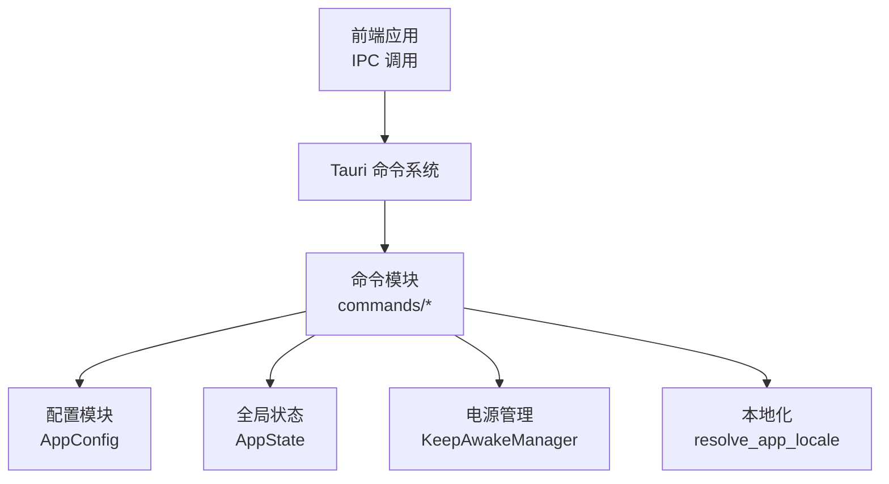
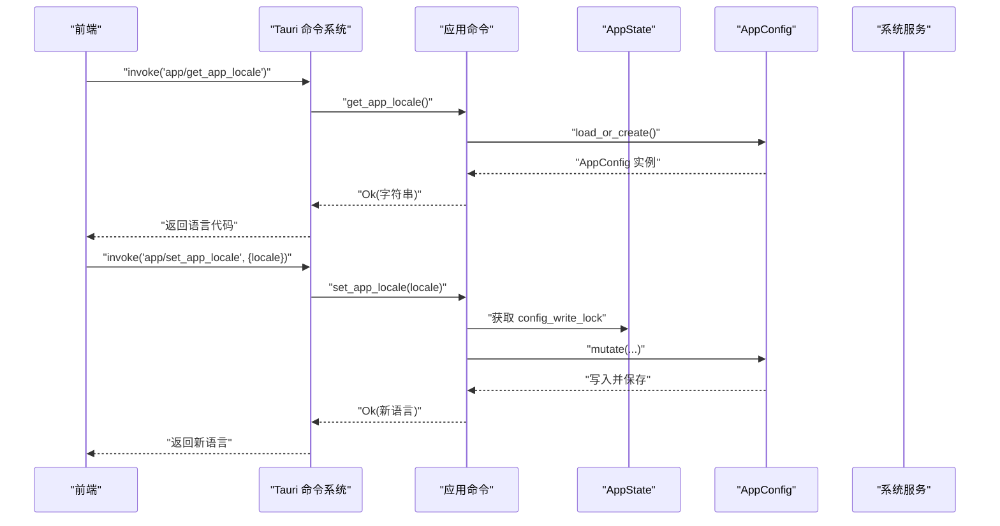
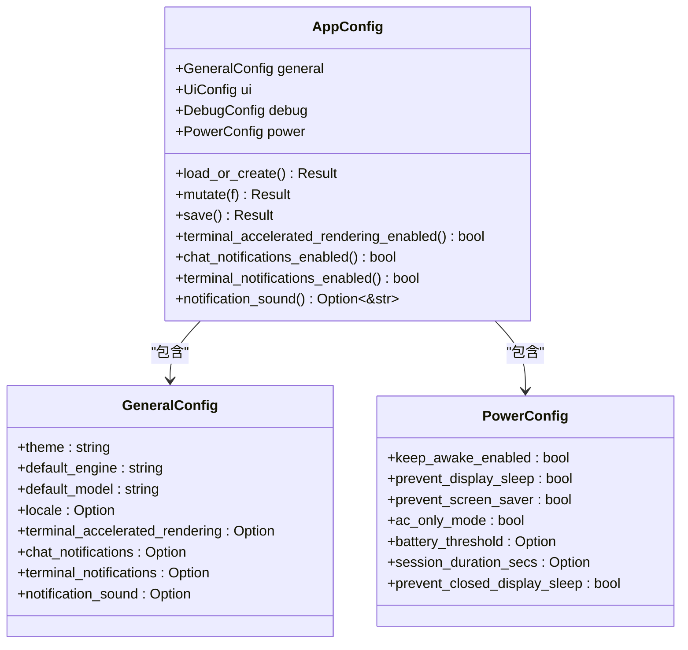
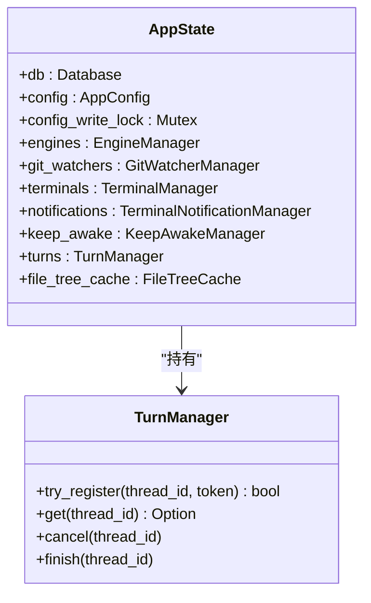
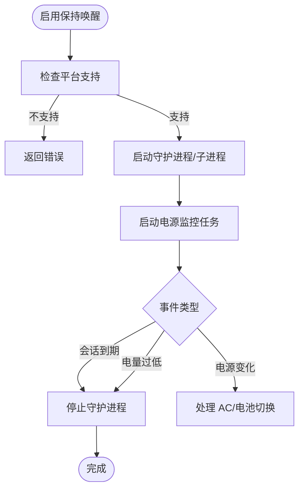
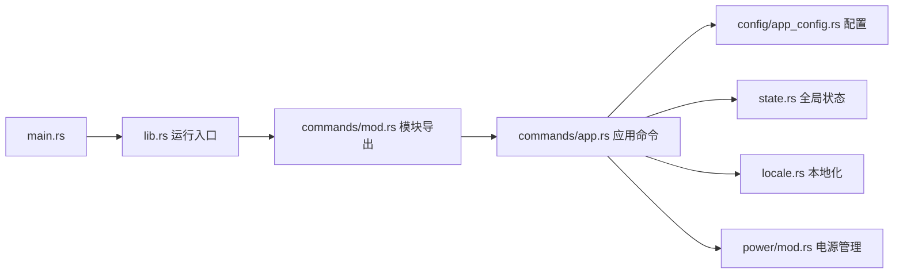

# 应用命令

<cite>
**本文引用的文件**
- [src-tauri/src/commands/mod.rs](file://src-tauri/src/commands/mod.rs)
- [src-tauri/src/commands/app.rs](file://src-tauri/src/commands/app.rs)
- [src-tauri/src/lib.rs](file://src-tauri/src/lib.rs)
- [src-tauri/src/main.rs](file://src-tauri/src/main.rs)
- [src-tauri/src/config/app_config.rs](file://src-tauri/src/config/app_config.rs)
- [src-tauri/src/state.rs](file://src-tauri/src/state.rs)
- [src-tauri/src/locale.rs](file://src-tauri/src/locale.rs)
- [src-tauri/src/power/mod.rs](file://src-tauri/src/power/mod.rs)
</cite>

## 目录
1. [简介](#简介)
2. [项目结构](#项目结构)
3. [核心组件](#核心组件)
4. [架构总览](#架构总览)
5. [详细组件分析](#详细组件分析)
6. [依赖关系分析](#依赖关系分析)
7. [性能考量](#性能考量)
8. [故障排查指南](#故障排查指南)
9. [结论](#结论)
10. [附录](#附录)

## 简介
本文件系统性梳理应用命令模块，聚焦应用级命令接口，覆盖应用启动、关闭、配置管理、状态查询、通知与声音、窗口与菜单、以及电源与保持清醒等核心能力。文档逐条说明各命令的参数、返回值、使用场景，并提供调用示例与错误处理建议，帮助开发者在前端或集成层正确调用后端命令。

## 项目结构
应用命令由 Rust 后端通过 Tauri 暴露，前端以 IPC 方式调用。命令注册集中在运行入口中统一注入，应用配置采用 TOML 文件持久化，全局状态通过 AppState 注入到命令执行上下文。

**图表来源**
- [src-tauri/src/lib.rs:181-327](file://src-tauri/src/lib.rs#L181-L327)
- [src-tauri/src/commands/mod.rs:1-13](file://src-tauri/src/commands/mod.rs#L1-L13)

**章节来源**
- [src-tauri/src/lib.rs:49-344](file://src-tauri/src/lib.rs#L49-L344)
- [src-tauri/src/commands/mod.rs:1-13](file://src-tauri/src/commands/mod.rs#L1-L13)

## 核心组件
- 命令注册与入口：在运行入口中集中注册所有命令，包含应用、电源、聊天、文件、终端、线程、工作区等模块命令。
- 配置管理：AppConfig 提供配置加载、保存、默认值与字段解析；支持并发写锁保证一致性。
- 全局状态：AppState 封装数据库、引擎、终端、通知、电源、轮次管理等共享资源。
- 本地化：提供语言规范化与解析逻辑，用于应用语言设置与回退策略。
- 电源管理：KeepAwakeManager 提供跨平台的“保持唤醒”能力，含监控、会话、电池阈值等策略。

**章节来源**
- [src-tauri/src/lib.rs:181-327](file://src-tauri/src/lib.rs#L181-L327)
- [src-tauri/src/config/app_config.rs:140-204](file://src-tauri/src/config/app_config.rs#L140-L204)
- [src-tauri/src/state.rs:12-24](file://src-tauri/src/state.rs#L12-L24)
- [src-tauri/src/locale.rs:38-93](file://src-tauri/src/locale.rs#L38-L93)
- [src-tauri/src/power/mod.rs:54-121](file://src-tauri/src/power/mod.rs#L54-L121)

## 架构总览
应用命令的调用链路如下：前端通过 IPC 发起命令请求，Tauri 分发至对应命令函数，命令函数读取或修改全局状态与配置，必要时触发系统行为（如通知、声音预览、电源策略），最终返回结果或错误信息。

**图表来源**
- [src-tauri/src/lib.rs:181-327](file://src-tauri/src/lib.rs#L181-L327)
- [src-tauri/src/commands/app.rs:129-154](file://src-tauri/src/commands/app.rs#L129-L154)
- [src-tauri/src/config/app_config.rs:164-170](file://src-tauri/src/config/app_config.rs#L164-L170)

## 详细组件分析

### 应用命令模块概览
应用命令模块位于 commands/app.rs，提供以下能力：
- 应用语言设置与查询
- 终端加速渲染开关
- 通知与声音相关设置与预览
- 桌面代理通知发送
- 代理通知集成安装

这些命令均通过 #[tauri::command] 宏声明，注册于运行入口，统一由 Tauri 分发执行。

**章节来源**
- [src-tauri/src/commands/app.rs:129-292](file://src-tauri/src/commands/app.rs#L129-L292)
- [src-tauri/src/lib.rs:181-327](file://src-tauri/src/lib.rs#L181-L327)

### 命令清单与规范
- 命名规范：统一以 app/ 前缀标识应用级命令。
- 参数与返回：命令签名遵循 async 函数，返回 Result<T, String>，错误以字符串描述。
- 并发控制：涉及配置写入的命令通过 AppState.config_write_lock 串行化写操作。
- 异步执行：命令内部常通过 tokio::task::spawn_blocking 访问磁盘与配置，避免阻塞事件循环。

**章节来源**
- [src-tauri/src/commands/app.rs:139-154](file://src-tauri/src/commands/app.rs#L139-L154)
- [src-tauri/src/state.rs:16](file://src-tauri/src/state.rs#L16)

### 命令定义与行为

#### get_app_locale
- 功能：查询当前应用语言代码。
- 参数：无。
- 返回：语言代码字符串。
- 使用场景：初始化界面语言、国际化资源加载。
- 错误：配置加载失败或线程池异常时返回错误字符串。

**章节来源**
- [src-tauri/src/commands/app.rs:129-136](file://src-tauri/src/commands/app.rs#L129-L136)
- [src-tauri/src/config/app_config.rs:153-186](file://src-tauri/src/config/app_config.rs#L153-L186)

#### set_app_locale
- 功能：设置应用语言，支持规范化与校验。
- 参数：locale 字符串。
- 返回：实际生效的语言代码。
- 使用场景：用户在设置中选择语言后更新配置。
- 错误：不支持的语言或写入失败返回错误字符串。

**章节来源**
- [src-tauri/src/commands/app.rs:139-154](file://src-tauri/src/commands/app.rs#L139-L154)
- [src-tauri/src/locale.rs:38-65](file://src-tauri/src/locale.rs#L38-L65)
- [src-tauri/src/config/app_config.rs:164-170](file://src-tauri/src/config/app_config.rs#L164-L170)

#### get_terminal_accelerated_rendering / set_terminal_accelerated_rendering
- 功能：查询与设置终端加速渲染开关。
- 参数：get 无；set enabled: bool。
- 返回：get 返回布尔；set 返回设置值。
- 使用场景：根据设备性能调整终端渲染策略。
- 错误：配置读取/保存失败或线程池异常返回错误字符串。

**章节来源**
- [src-tauri/src/commands/app.rs:157-182](file://src-tauri/src/commands/app.rs#L157-L182)
- [src-tauri/src/config/app_config.rs:141-143](file://src-tauri/src/config/app_config.rs#L141-L143)

#### get_agent_notification_settings / set_chat_notifications_enabled / set_terminal_notifications_enabled
- 功能：查询代理通知设置状态；启用/禁用聊天与终端通知。
- 参数：get 无；set enabled: bool。
- 返回：get 返回状态 DTO；set 返回布尔。
- 使用场景：用户偏好设置与系统通知策略。
- 错误：通知集成状态检查或配置写入失败返回错误字符串。

**章节来源**
- [src-tauri/src/commands/app.rs:185-227](file://src-tauri/src/commands/app.rs#L185-L227)

#### install_terminal_notification_integration_command / set_notification_sound / preview_notification_sound
- 功能：安装终端通知集成、设置通知声音、预览通知声音。
- 参数：install(integration: String)；set(sound: String)；preview(sound: String)。
- 返回：install 返回状态 DTO；set 返回声音名称；preview 无返回或错误。
- 使用场景：配置通知声音与系统集成。
- 错误：解析集成类型、安装失败、声音路径解析失败或平台特定错误返回字符串。

**章节来源**
- [src-tauri/src/commands/app.rs:230-282](file://src-tauri/src/commands/app.rs#L230-L282)

#### show_agent_notification
- 功能：发送桌面代理通知。
- 参数：title, body。
- 返回：无返回或错误。
- 使用场景：向用户推送重要提示或状态变更。
- 错误：通知发送失败返回错误字符串。

**章节来源**
- [src-tauri/src/commands/app.rs:285-292](file://src-tauri/src/commands/app.rs#L285-L292)

### 配置模型与持久化
AppConfig 定义了通用配置结构，包含 general、ui、debug、power 四个部分。命令通过 load_or_create、mutate、save 等方法访问配置，写入时使用互斥锁确保原子性。

**图表来源**
- [src-tauri/src/config/app_config.rs:12-66](file://src-tauri/src/config/app_config.rs#L12-L66)
- [src-tauri/src/config/app_config.rs:140-204](file://src-tauri/src/config/app_config.rs#L140-L204)

**章节来源**
- [src-tauri/src/config/app_config.rs:12-66](file://src-tauri/src/config/app_config.rs#L12-L66)
- [src-tauri/src/config/app_config.rs:140-204](file://src-tauri/src/config/app_config.rs#L140-L204)

### 全局状态与并发控制
AppState 在应用启动时构建，注入数据库、引擎、终端、通知、电源、轮次管理等实例，并提供 config_write_lock 用于串行化配置写操作。命令在需要写配置时先获取该锁，避免竞态。

**图表来源**
- [src-tauri/src/state.rs:12-24](file://src-tauri/src/state.rs#L12-L24)
- [src-tauri/src/state.rs:26-55](file://src-tauri/src/state.rs#L26-L55)

**章节来源**
- [src-tauri/src/state.rs:12-24](file://src-tauri/src/state.rs#L12-L24)
- [src-tauri/src/state.rs:26-55](file://src-tauri/src/state.rs#L26-L55)

### 电源与保持清醒
KeepAwakeManager 提供跨平台的“保持唤醒”能力，支持系统睡眠抑制、显示器/屏保抑制、闭合屏幕睡眠抑制、AC 仅模式、电池阈值、会话时长等策略。命令通过 power 模块暴露状态查询与设置接口。

**图表来源**
- [src-tauri/src/power/mod.rs:324-498](file://src-tauri/src/power/mod.rs#L324-L498)

**章节来源**
- [src-tauri/src/power/mod.rs:54-121](file://src-tauri/src/power/mod.rs#L54-L121)
- [src-tauri/src/power/mod.rs:324-498](file://src-tauri/src/power/mod.rs#L324-L498)

## 依赖关系分析
应用命令模块的依赖关系如下：

**图表来源**
- [src-tauri/src/main.rs:1-14](file://src-tauri/src/main.rs#L1-L14)
- [src-tauri/src/lib.rs:181-327](file://src-tauri/src/lib.rs#L181-L327)
- [src-tauri/src/commands/mod.rs:1-13](file://src-tauri/src/commands/mod.rs#L1-L13)

**章节来源**
- [src-tauri/src/main.rs:1-14](file://src-tauri/src/main.rs#L1-L14)
- [src-tauri/src/lib.rs:181-327](file://src-tauri/src/lib.rs#L181-L327)
- [src-tauri/src/commands/mod.rs:1-13](file://src-tauri/src/commands/mod.rs#L1-L13)

## 性能考量
- 异步与阻塞分离：命令内部通过 spawn_blocking 访问磁盘与配置，避免阻塞主线程。
- 并发写锁：配置写入通过 config_write_lock 串行化，减少竞争与冲突。
- 事件驱动：电源管理通过监控任务异步响应事件，降低轮询开销。
- 默认值与懒加载：配置默认值与路径解析在首次访问时完成，减少启动时计算量。

[本节为通用指导，无需列出具体文件来源]

## 故障排查指南
- 命令返回错误字符串：前端应捕获错误并提示用户，同时记录日志以便定位。
- 配置写入失败：检查配置文件权限、磁盘空间与互斥锁状态；必要时重启应用。
- 通知与声音：确认平台通知权限、声音路径有效；macOS 下 afplay 可能因权限受限导致预览失败。
- 电源策略：在不支持的平台上启用保持唤醒会返回错误；检查系统电源策略与管理员权限。

**章节来源**
- [src-tauri/src/commands/app.rs:22-24](file://src-tauri/src/commands/app.rs#L22-L24)
- [src-tauri/src/commands/app.rs:88-110](file://src-tauri/src/commands/app.rs#L88-L110)
- [src-tauri/src/power/mod.rs:324-337](file://src-tauri/src/power/mod.rs#L324-L337)

## 结论
应用命令模块以清晰的职责划分与一致的错误处理机制，提供了从语言设置、配置读写、通知声音到电源策略的完整应用级能力。通过统一的命令注册与全局状态注入，前端可稳定地调用后端能力，实现良好的用户体验与可维护性。

[本节为总结性内容，无需列出具体文件来源]

## 附录

### 调用示例（步骤说明）
- 查询应用语言
  - 步骤：前端调用 invoke('app/get_app_locale')，后端返回语言代码字符串。
  - 场景：初始化界面语言、国际化资源加载。
- 设置应用语言
  - 步骤：前端调用 invoke('app/set_app_locale', { locale })，后端写入配置并返回新语言。
  - 场景：用户在设置中选择语言后即时生效。
- 设置终端加速渲染
  - 步骤：前端调用 invoke('app/set_terminal_accelerated_rendering', { enabled })，后端写入配置并返回设置值。
  - 场景：根据设备性能动态调整终端渲染策略。
- 启用聊天通知
  - 步骤：前端调用 invoke('app/set_chat_notifications_enabled', { enabled })，后端写入配置并返回布尔值。
  - 场景：用户偏好设置。
- 设置通知声音并预览
  - 步骤：前端先调用 invoke('app/set_notification_sound', { sound })，再调用 invoke('app/preview_notification_sound', { sound })。
  - 场景：配置自定义声音并快速验证。
- 发送代理桌面通知
  - 步骤：前端调用 invoke('app/show_agent_notification', { title, body })。
  - 场景：重要提示或状态变更提醒。

[本节为概念性流程说明，无需列出具体文件来源]