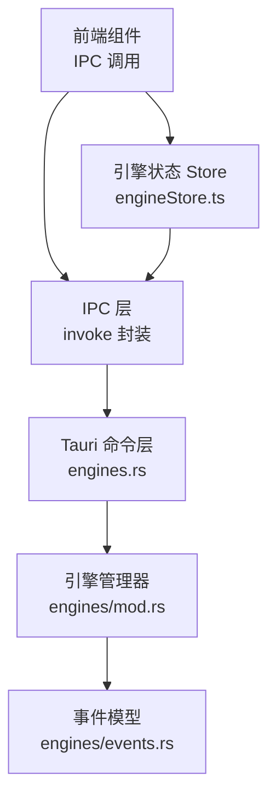
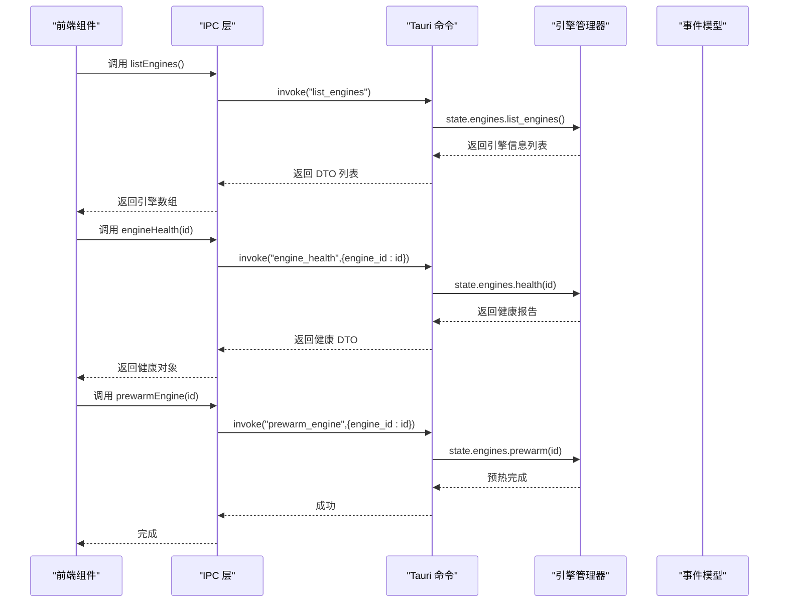
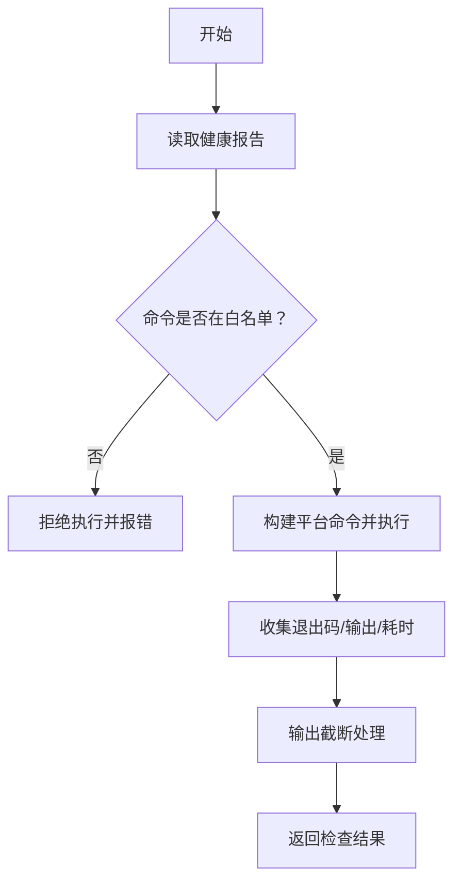
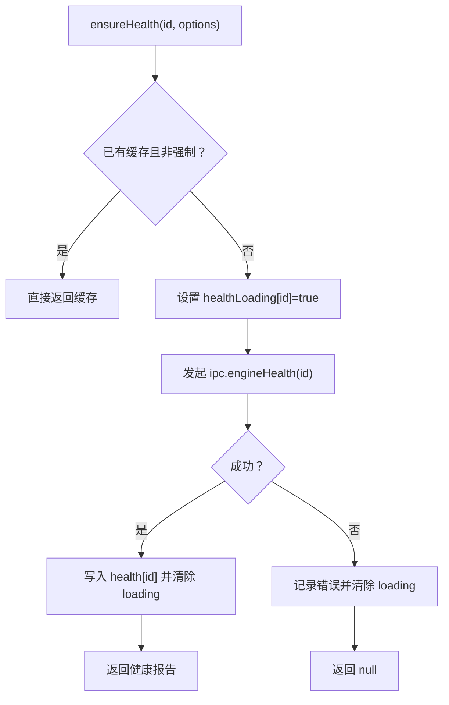
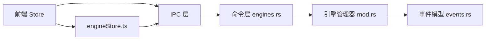

# 引擎命令

<cite>
**本文档引用的文件**
- [engines.rs](file://src-tauri/src/commands/engines.rs)
- [engineStore.ts](file://src/stores/engineStore.ts)
- [ipc.ts](file://src/lib/ipc.ts)
- [types.ts](file://src/types.ts)
- [models.rs](file://src-tauri/src/models.rs)
- [mod.rs](file://src-tauri/src/engines/mod.rs)
- [events.rs](file://src-tauri/src/engines/events.rs)
- [engineCapabilities.ts](file://src/components/chat/engineCapabilities.ts)
</cite>

## 目录
1. [简介](#简介)
2. [项目结构](#项目结构)
3. [核心组件](#核心组件)
4. [架构总览](#架构总览)
5. [详细组件分析](#详细组件分析)
6. [依赖关系分析](#依赖关系分析)
7. [性能考量](#性能考量)
8. [故障排查指南](#故障排查指南)
9. [结论](#结论)

## 简介
本文件系统性梳理“引擎命令模块”的设计与实现，覆盖引擎发现、健康检查、预热、能力与模型查询、运行时更新事件监听等关键能力，并对不同引擎类型的命令差异进行对比说明。同时给出健康检查、性能监控与故障恢复的实现要点，以及引擎生命周期与资源调度的细节。

## 项目结构
引擎命令模块由前端 Store 与 IPC 层、后端 Tauri 命令层、引擎管理器与事件模型共同组成，形成“前端调用 → IPC 调用 → 后端命令 → 引擎管理器执行 → 事件回传”的完整链路。

图表来源
- [engines.rs:18-162](file://src-tauri/src/commands/engines.rs#L18-L162)
- [engineStore.ts:1-164](file://src/stores/engineStore.ts#L1-L164)
- [ipc.ts:337-346](file://src/lib/ipc.ts#L337-L346)
- [mod.rs:464-780](file://src-tauri/src/engines/mod.rs#L464-L780)
- [events.rs:113-177](file://src-tauri/src/engines/events.rs#L113-L177)

章节来源
- [engines.rs:18-162](file://src-tauri/src/commands/engines.rs#L18-L162)
- [engineStore.ts:1-164](file://src/stores/engineStore.ts#L1-L164)
- [ipc.ts:337-346](file://src/lib/ipc.ts#L337-L346)
- [mod.rs:464-780](file://src-tauri/src/engines/mod.rs#L464-L780)
- [events.rs:113-177](file://src-tauri/src/engines/events.rs#L113-L177)

## 核心组件
- 前端引擎状态 Store：负责拉取引擎列表、健康报告、合并批量健康报告、应用运行时更新事件，以及健康检查请求的并发去重与加载状态管理。
- IPC 层：封装所有引擎相关命令的 invoke 调用，统一返回类型映射。
- Tauri 命令层：暴露 list_engines、engine_health、prewarm_engine、run_engine_check、list_codex_skills、list_codex_apps、get_opencode_runtime_catalog 等命令。
- 引擎管理器：统一管理 Codex、Claude、OpenCode 及 Claude Code Native 的生命周期、健康检查、模型目录、线程启动与归档等。
- 事件模型：标准化引擎事件流，包含文本增量、动作输出、审批请求、错误与通知等。

章节来源
- [engineStore.ts:5-19](file://src/stores/engineStore.ts#L5-L19)
- [ipc.ts:337-346](file://src/lib/ipc.ts#L337-L346)
- [engines.rs:18-162](file://src-tauri/src/commands/engines.rs#L18-L162)
- [mod.rs:464-780](file://src-tauri/src/engines/mod.rs#L464-L780)
- [events.rs:113-177](file://src-tauri/src/engines/events.rs#L113-L177)

## 架构总览
以下序列图展示从前端到后端再到引擎管理器的关键流程，涵盖引擎发现、健康检查与预热。

图表来源
- [engines.rs:18-42](file://src-tauri/src/commands/engines.rs#L18-L42)
- [engineStore.ts:29-56](file://src/stores/engineStore.ts#L29-L56)
- [ipc.ts:337-341](file://src/lib/ipc.ts#L337-L341)
- [mod.rs:497-638](file://src-tauri/src/engines/mod.rs#L497-L638)

## 详细组件分析

### 命令接口总览
- 列出引擎：返回各引擎基本信息与模型目录、能力集。
- 查询引擎健康：返回可用性、版本、详情、警告、可执行检查项与修复建议，以及协议诊断。
- 预热引擎：触发对应引擎的预热逻辑，减少首次调用延迟。
- 运行引擎检查：在白名单校验通过后，执行指定命令并返回结果（含退出码、标准输出/错误、耗时）。
- Codex 技能与应用：列出技能与应用清单。
- OpenCode 运行时目录：按工作区目录扫描并返回可用代理、命令与 MCP 服务器等。

章节来源
- [engines.rs:18-75](file://src-tauri/src/commands/engines.rs#L18-L75)
- [ipc.ts:337-346](file://src/lib/ipc.ts#L337-L346)

### 健康检查与安全策略
- 白名单控制：run_engine_check 在执行前会比对健康报告中的 checks 与 fixes，仅允许白名单内的命令执行，避免任意命令注入风险。
- 输出截断：为防止过大输出导致内存压力，对 stdout/stderr 进行字符数截断。
- 平台适配：Windows 使用 cmd /C，非 Windows 使用解析后的 shell 程序与参数，并可注入 PATH 扩展。

图表来源
- [engines.rs:77-101](file://src-tauri/src/commands/engines.rs#L77-L101)
- [engines.rs:103-121](file://src-tauri/src/commands/engines.rs#L103-L121)
- [engines.rs:123-146](file://src-tauri/src/commands/engines.rs#L123-L146)
- [models.rs:663-670](file://src-tauri/src/models.rs#L663-L670)

章节来源
- [engines.rs:77-101](file://src-tauri/src/commands/engines.rs#L77-L101)
- [engines.rs:103-121](file://src-tauri/src/commands/engines.rs#L103-L121)
- [engines.rs:123-146](file://src-tauri/src/commands/engines.rs#L123-L146)
- [models.rs:663-670](file://src-tauri/src/models.rs#L663-L670)

### 前端健康状态管理
- 并发去重：同一引擎的健康检查请求会被缓存，避免重复并发请求。
- 加载状态：每个引擎维护独立的 loading 标志，确保 UI 正确反馈。
- 错误聚合：批量合并健康报告，移除对应的 loading 标志。
- 运行时更新：接收 engine-runtime-updated 事件，自动刷新协议诊断信息。

图表来源
- [engineStore.ts:58-114](file://src/stores/engineStore.ts#L58-L114)
- [engineStore.ts:116-133](file://src/stores/engineStore.ts#L116-L133)
- [engineStore.ts:134-162](file://src/stores/engineStore.ts#L134-L162)

章节来源
- [engineStore.ts:58-114](file://src/stores/engineStore.ts#L58-L114)
- [engineStore.ts:116-133](file://src/stores/engineStore.ts#L116-L133)
- [engineStore.ts:134-162](file://src/stores/engineStore.ts#L134-L162)

### 不同引擎类型的命令差异与通用接口
- 通用接口
  - 列出引擎：返回引擎 ID、名称、模型列表与能力集。
  - 健康检查：返回可用性、版本、详情、警告、检查/修复清单与协议诊断。
  - 预热：减少首次调用延迟。
- 类型差异
  - Codex：支持技能与应用枚举、远程线程归档/恢复、回滚与压缩等高级操作；健康报告包含协议诊断。
  - Claude/Claude Code Native：健康报告不包含协议诊断；Claude Code Native 无需外部进程，预热为空操作。
  - OpenCode：支持运行时目录扫描，返回代理、命令与 MCP 服务器清单；健康报告不含协议诊断。

章节来源
- [engines.rs:18-75](file://src-tauri/src/commands/engines.rs#L18-L75)
- [mod.rs:497-638](file://src-tauri/src/engines/mod.rs#L497-L638)
- [mod.rs:568-628](file://src-tauri/src/engines/mod.rs#L568-L628)
- [models.rs:265-281](file://src-tauri/src/models.rs#L265-L281)
- [models.rs:343-356](file://src-tauri/src/models.rs#L343-L356)

### 引擎能力与权限模式
- 能力集：不同引擎支持的权限模式、沙箱模式与审批决策存在差异，前端通过解析引擎能力集决定 UI 与策略。
- 默认能力：若引擎未提供能力集或为空，则回退到空能力集，避免 UI 异常。

章节来源
- [engineCapabilities.ts:3-46](file://src/components/chat/engineCapabilities.ts#L3-L46)
- [engineCapabilities.ts:48-68](file://src/components/chat/engineCapabilities.ts#L48-L68)
- [mod.rs:122-158](file://src-tauri/src/engines/mod.rs#L122-L158)

### 生命周期与资源调度
- 生命周期
  - 发现：list_engines 返回当前可用引擎及其模型目录。
  - 健康：engine_health 提供可用性与诊断信息。
  - 预热：prewarm_engine 减少冷启动开销。
  - 线程：引擎管理器根据线程作用域与沙箱策略启动线程，发送消息、响应审批、中断与归档。
- 资源调度
  - 沙箱策略：写入根路径、网络访问、审批策略、权限配置、推理努力、服务等级等。
  - 模型选择：默认推理努力与支持的推理努力选项随模型而异。

章节来源
- [engines.rs:18-42](file://src-tauri/src/commands/engines.rs#L18-L42)
- [mod.rs:420-462](file://src-tauri/src/engines/mod.rs#L420-L462)
- [mod.rs:56-69](file://src-tauri/src/engines/mod.rs#L56-L69)
- [mod.rs:72-87](file://src-tauri/src/engines/mod.rs#L72-L87)

### 性能监控与事件流
- 事件模型：标准化文本增量、思考增量、动作输出、差异更新、审批请求、使用限制、模型重路由、通知与错误等事件。
- 输出截断：对动作输出与 JSON 字符串进行截断，避免内存与传输压力。
- 令牌用量：事件中携带输入/输出/推理/缓存读写/成本等指标，便于计费与性能分析。

章节来源
- [events.rs:113-177](file://src-tauri/src/engines/events.rs#L113-L177)
- [events.rs:28-62](file://src-tauri/src/engines/events.rs#L28-L62)
- [events.rs:242-250](file://src-tauri/src/engines/events.rs#L242-L250)

## 依赖关系分析
- 前端依赖
  - IPC 层封装所有引擎命令调用，Store 依赖 IPC 获取数据与事件。
- 后端依赖
  - 命令层依赖引擎管理器，引擎管理器再依赖具体引擎实现与事件模型。
- 数据模型
  - 健康报告、模型信息、检查结果等均以 DTO 形式在前后端传递，保证类型安全。

图表来源
- [engines.rs:18-162](file://src-tauri/src/commands/engines.rs#L18-L162)
- [mod.rs:464-780](file://src-tauri/src/engines/mod.rs#L464-L780)
- [events.rs:113-177](file://src-tauri/src/engines/events.rs#L113-L177)
- [engineStore.ts:1-164](file://src/stores/engineStore.ts#L1-L164)

章节来源
- [engines.rs:18-162](file://src-tauri/src/commands/engines.rs#L18-L162)
- [mod.rs:464-780](file://src-tauri/src/engines/mod.rs#L464-L780)
- [events.rs:113-177](file://src-tauri/src/engines/events.rs#L113-L177)
- [engineStore.ts:1-164](file://src/stores/engineStore.ts#L1-L164)

## 性能考量
- 健康检查
  - 并发去重与加载状态管理，避免重复请求与闪烁。
  - 输出截断与超时保护，防止大输出与长时间阻塞。
- 事件流
  - 对动作输出与 JSON 字符串进行截断，降低内存占用与传输开销。
- 预热机制
  - 针对 Codex 与 Claude 的预热可显著降低首次调用延迟。

## 故障排查指南
- 健康检查失败
  - 检查命令是否在白名单内；确认平台 shell 与 PATH 设置；查看输出截断后的 tail 内容定位问题。
- 引擎不可用
  - 查看健康报告中的 warnings 与 details；核对 checks/fixes 清单；必要时执行修复命令。
- 前端状态异常
  - 确认 healthLoading 标志是否被正确清除；检查合并健康报告的逻辑是否生效。
- 运行时更新未生效
  - 确认 engine-runtime-updated 事件是否被监听并调用 applyRuntimeUpdate；检查 protocolDiagnostics 是否更新。

章节来源
- [engines.rs:77-101](file://src-tauri/src/commands/engines.rs#L77-L101)
- [engines.rs:103-121](file://src-tauri/src/commands/engines.rs#L103-L121)
- [engineStore.ts:58-114](file://src/stores/engineStore.ts#L58-L114)
- [engineStore.ts:134-162](file://src/stores/engineStore.ts#L134-L162)

## 结论
引擎命令模块通过清晰的分层设计实现了跨引擎的一致性接口与差异化能力支持。前端 Store 与 IPC 层提供了稳定的调用入口，后端命令层与引擎管理器承担了实际的生命周期与健康检查职责，事件模型则保障了运行时可观测性与可恢复性。结合白名单安全策略、输出截断与预热机制，整体具备良好的安全性、性能与可维护性。