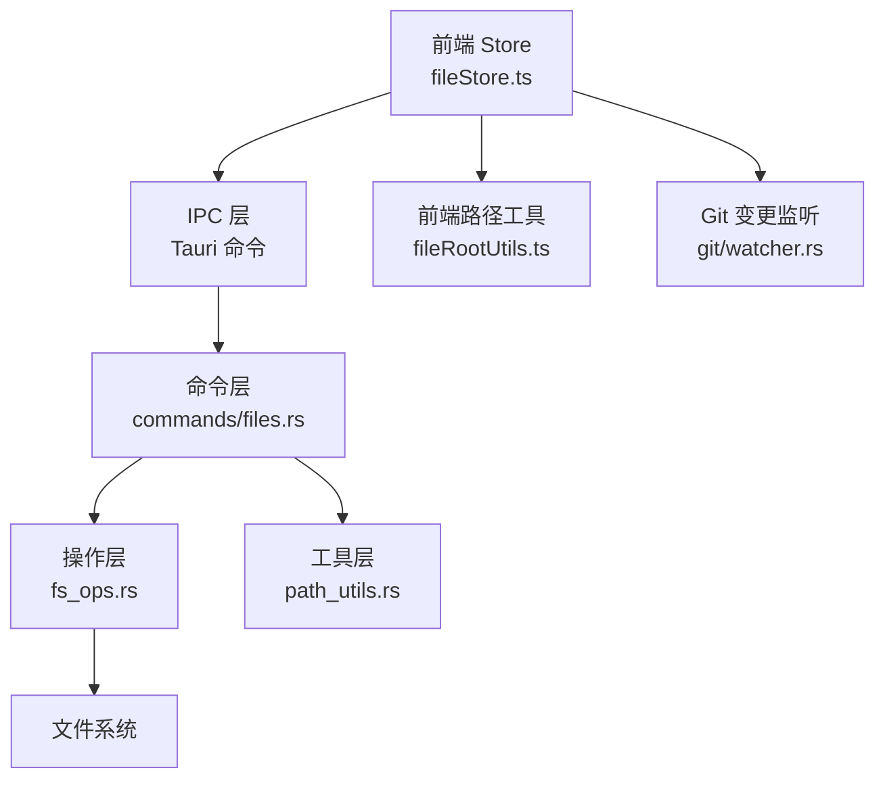
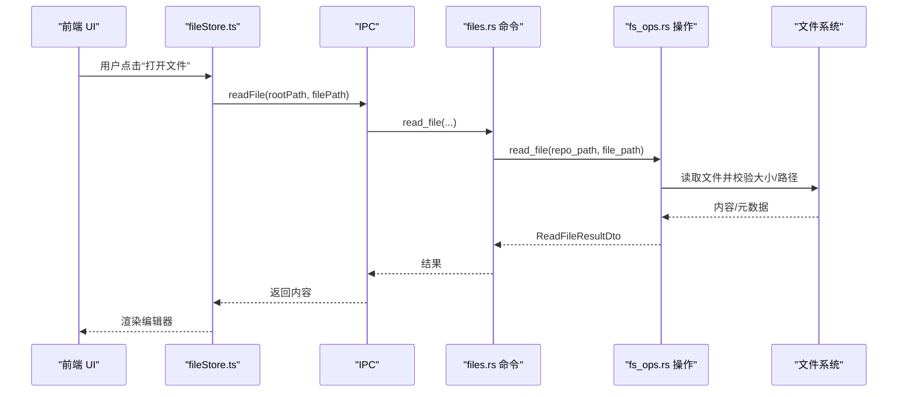
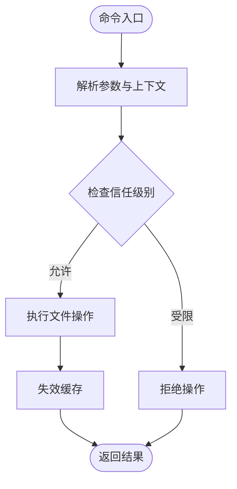
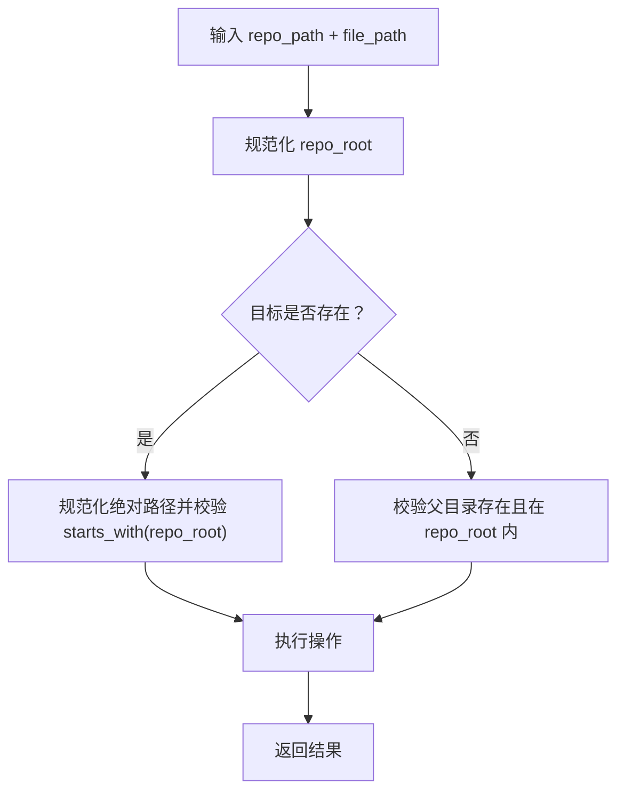
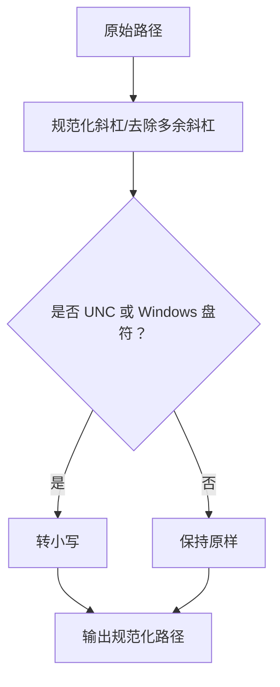
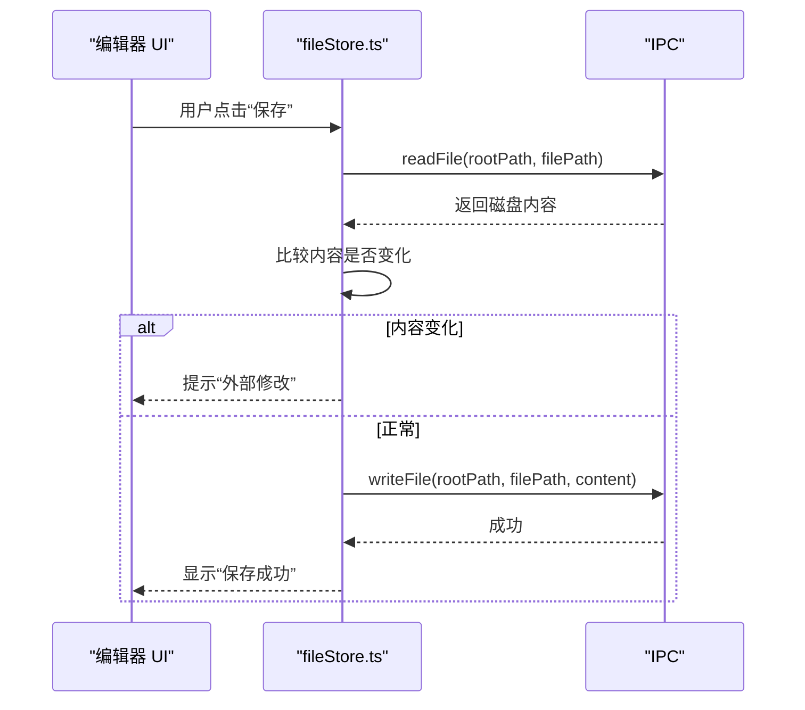
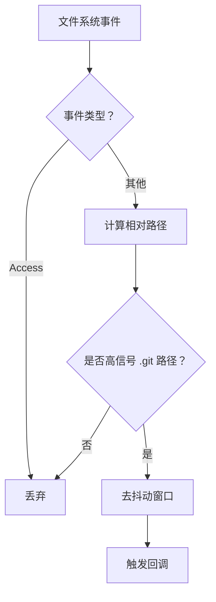
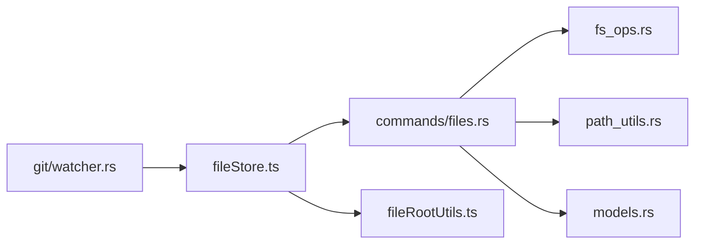

# 文件命令

<cite>
**本文档引用的文件**
- [src-tauri/src/commands/files.rs](file://src-tauri/src/commands/files.rs)
- [src-tauri/src/fs_ops.rs](file://src-tauri/src/fs_ops.rs)
- [src-tauri/src/path_utils.rs](file://src-tauri/src/path_utils.rs)
- [src/lib/fileRootUtils.ts](file://src/lib/fileRootUtils.ts)
- [src/stores/fileStore.ts](file://src/stores/fileStore.ts)
- [src-tauri/src/git/watcher.rs](file://src-tauri/src/git/watcher.rs)
- [src-tauri/src/models.rs](file://src-tauri/src/models.rs)
- [src-tauri/src/commands/mod.rs](file://src-tauri/src/commands/mod.rs)
</cite>

## 目录
1. [简介](#简介)
2. [项目结构](#项目结构)
3. [核心组件](#核心组件)
4. [架构总览](#架构总览)
5. [详细组件分析](#详细组件分析)
6. [依赖关系分析](#依赖关系分析)
7. [性能考量](#性能考量)
8. [故障排查指南](#故障排查指南)
9. [结论](#结论)

## 简介
本文件命令模块负责提供完整的文件系统操作能力，涵盖文件读取、写入、创建、删除、重命名、目录浏览以及与编辑器集成的路径解析与安全校验。模块同时包含跨平台的文件打开与资源定位（reveal）能力，并通过信任级别（Trust Level）策略对用户发起的修改操作进行安全控制。此外，模块还提供了基于 Git 的仓库变更监听与去抖动机制，用于在文件系统事件发生时触发必要的刷新逻辑。

## 项目结构
文件命令模块主要由以下层次构成：
- 命令层：对外暴露的 Tauri 命令函数，统一异步执行并返回结果或错误字符串
- 操作层：实际的文件系统操作封装，包含路径校验、大小限制、符号链接处理等
- 工具层：路径规范化、Windows 路径前缀处理、相对路径解析
- 前端集成：前端 Store 与 IPC 集成，负责文件标签页管理、保存流程与外部修改检测
- 变更监听：基于 notify 的 Git 仓库变更监听与去抖动，仅对高信号事件响应

图表来源
- [src-tauri/src/commands/files.rs:1-914](file://src-tauri/src/commands/files.rs#L1-L914)
- [src-tauri/src/fs_ops.rs:1-441](file://src-tauri/src/fs_ops.rs#L1-L441)
- [src-tauri/src/path_utils.rs:1-143](file://src-tauri/src/path_utils.rs#L1-L143)
- [src/lib/fileRootUtils.ts:1-129](file://src/lib/fileRootUtils.ts#L1-L129)
- [src/stores/fileStore.ts:1-551](file://src/stores/fileStore.ts#L1-L551)
- [src-tauri/src/git/watcher.rs:1-519](file://src-tauri/src/git/watcher.rs#L1-L519)

章节来源
- [src-tauri/src/commands/mod.rs:1-13](file://src-tauri/src/commands/mod.rs#L1-L13)

## 核心组件
- 文件命令集合：提供 list_dir、read_file、write_file、create_file、create_dir、rename_path、delete_path、reveal_path、open_path_with_default_app 等命令
- 文件系统操作封装：统一实现路径校验、大小限制、符号链接处理、父目录创建等
- 路径工具：规范化路径、Windows 前缀处理、大小写敏感性判断、根路径包含判断
- 前端集成：文件标签页状态管理、内容加载与保存、外部修改检测、重命名后路径重定向
- Git 变更监听：针对 .git 子树的高信号事件过滤与去抖动，避免频繁刷新

章节来源
- [src-tauri/src/commands/files.rs:18-266](file://src-tauri/src/commands/files.rs#L18-L266)
- [src-tauri/src/fs_ops.rs:26-298](file://src-tauri/src/fs_ops.rs#L26-L298)
- [src-tauri/src/path_utils.rs:7-85](file://src-tauri/src/path_utils.rs#L7-L85)
- [src/lib/fileRootUtils.ts:50-129](file://src/lib/fileRootUtils.ts#L50-L129)
- [src/stores/fileStore.ts:200-551](file://src/stores/fileStore.ts#L200-L551)
- [src-tauri/src/git/watcher.rs:24-361](file://src-tauri/src/git/watcher.rs#L24-L361)

## 架构总览
文件命令模块采用分层设计：
- 命令层：使用 Tauri 宏声明命令，统一在阻塞任务中执行，避免阻塞 UI 线程
- 操作层：对具体文件系统操作进行封装，集中处理路径合法性、大小限制、符号链接与父目录创建
- 工具层：提供路径规范化与比较逻辑，确保跨平台一致性
- 前端层：通过 Store 管理文件标签页状态，调用 IPC 执行命令，并在保存时进行外部修改检测
- 监听层：Git 变更监听器仅对高信号事件响应，降低噪音并提升性能

图表来源
- [src/stores/fileStore.ts:205-273](file://src/stores/fileStore.ts#L205-L273)
- [src-tauri/src/commands/files.rs:31-37](file://src-tauri/src/commands/files.rs#L31-L37)
- [src-tauri/src/fs_ops.rs:88-118](file://src-tauri/src/fs_ops.rs#L88-L118)

## 详细组件分析

### 命令层（files.rs）
- 异步命令：所有命令均通过阻塞任务执行，避免阻塞 Tokio 运行时
- 安全校验：在执行写入、创建、删除、重命名等操作前，检查目标路径是否位于访问根内，并根据仓库信任级别进行策略控制
- 平台适配：reveal_path 与 open_path_with_default_app 在不同平台选择合适的系统命令
- 编辑器引用解析：支持解析形如 “path:line:col” 或 “path#Lline-col” 的引用，按工作区与仓库顺序尝试解析

图表来源
- [src-tauri/src/commands/files.rs:67-107](file://src-tauri/src/commands/files.rs#L67-L107)
- [src-tauri/src/commands/files.rs:110-142](file://src-tauri/src/commands/files.rs#L110-L142)
- [src-tauri/src/commands/files.rs:145-177](file://src-tauri/src/commands/files.rs#L145-L177)
- [src-tauri/src/commands/files.rs:180-213](file://src-tauri/src/commands/files.rs#L180-L213)
- [src-tauri/src/commands/files.rs:216-248](file://src-tauri/src/commands/files.rs#L216-L248)

章节来源
- [src-tauri/src/commands/files.rs:18-266](file://src-tauri/src/commands/files.rs#L18-L266)

### 操作层（fs_ops.rs）
- 路径校验：validate_repo_relative_path 仅允许普通组件，防止路径穿越
- 列表目录：list_dir 对 .git 目录进行跳过，对指向仓库外的符号链接进行过滤
- 读取文件：read_file 限制最大大小（默认 10MB），二进制文件以空字符串表示
- 创建文件/目录：create_file 会在父目录不存在时递归创建；create_dir 会验证祖先存在且在仓库根内
- 删除路径：delete_path 保护仓库根不被删除，对符号链接与普通文件/目录分别处理
- 重命名路径：rename_path 校验新名称不含路径组件，避免路径穿越
- 写入文件：write_file 对已存在文件进行路径规范化校验，对新文件校验父目录在根内

图表来源
- [src-tauri/src/fs_ops.rs:120-154](file://src-tauri/src/fs_ops.rs#L120-L154)
- [src-tauri/src/fs_ops.rs:260-267](file://src-tauri/src/fs_ops.rs#L260-L267)
- [src-tauri/src/fs_ops.rs:239-258](file://src-tauri/src/fs_ops.rs#L239-L258)
- [src-tauri/src/fs_ops.rs:269-298](file://src-tauri/src/fs_ops.rs#L269-L298)

章节来源
- [src-tauri/src/fs_ops.rs:13-298](file://src-tauri/src/fs_ops.rs#L13-L298)

### 路径工具（path_utils.rs 与 fileRootUtils.ts）
- 规范化与比较：提供路径规范化、Windows 前缀处理、大小写敏感性判断与根路径包含判断
- 前端路径工具：与 Rust 后端保持一致的路径比较与归一化策略，支持 UNC、驱动器盘符与斜杠标准化

图表来源
- [src-tauri/src/path_utils.rs:21-85](file://src-tauri/src/path_utils.rs#L21-L85)
- [src/lib/fileRootUtils.ts:23-48](file://src/lib/fileRootUtils.ts#L23-L48)

章节来源
- [src-tauri/src/path_utils.rs:7-85](file://src-tauri/src/path_utils.rs#L7-L85)
- [src/lib/fileRootUtils.ts:23-129](file://src/lib/fileRootUtils.ts#L23-L129)

### 前端集成（fileStore.ts）
- 文件标签页管理：打开文件、切换渲染模式、关闭标签页、清理缓存编辑器实例
- 外部修改检测：保存前读取磁盘内容，若内容变化则提示并更新保存状态
- 重命名路径重定向：在重命名后根据旧绝对路径映射到新的绝对路径，重新计算仓库归属与相对路径
- 保存流程：调用 IPC 写入文件，成功后刷新 Git 缓存并重新获取差异视图

图表来源
- [src/stores/fileStore.ts:501-549](file://src/stores/fileStore.ts#L501-L549)

章节来源
- [src/stores/fileStore.ts:200-551](file://src/stores/fileStore.ts#L200-L551)

### Git 变更监听（git/watcher.rs）
- 监听策略：仅监听 .git 子树中的高信号事件（HEAD、index、refs/*、FETCH_HEAD、packed-refs 等），忽略工作树变更与访问类事件
- 去抖动：同一仓库在短时间内多次事件合并为一次回调，减少刷新频率
- 回退机制：当遇到 inotify 限制或设备空间不足时回退到轮询模式
- 路径解析：支持常规仓库与链接工作树（linked worktree）场景，正确解析 .gitdir 与 commondir

图表来源
- [src-tauri/src/git/watcher.rs:320-361](file://src-tauri/src/git/watcher.rs#L320-L361)
- [src-tauri/src/git/watcher.rs:231-252](file://src-tauri/src/git/watcher.rs#L231-L252)

章节来源
- [src-tauri/src/git/watcher.rs:24-361](file://src-tauri/src/git/watcher.rs#L24-L361)

## 依赖关系分析
- 命令层依赖操作层与工具层，同时读取数据库模型（如 TrustLevelDto）进行信任级别判断
- 前端 Store 依赖 IPC 与路径工具，负责 UI 状态与文件操作协调
- Git 监听器独立于命令层，但与前端状态联动，用于刷新 Git 相关视图

图表来源
- [src-tauri/src/commands/files.rs:11-16](file://src-tauri/src/commands/files.rs#L11-L16)
- [src-tauri/src/models.rs:33-55](file://src-tauri/src/models.rs#L33-L55)
- [src/lib/fileRootUtils.ts:1-129](file://src/lib/fileRootUtils.ts#L1-L129)
- [src/stores/fileStore.ts:1-25](file://src/stores/fileStore.ts#L1-L25)
- [src-tauri/src/git/watcher.rs:1-22](file://src-tauri/src/git/watcher.rs#L1-L22)

章节来源
- [src-tauri/src/commands/files.rs:1-16](file://src-tauri/src/commands/files.rs#L1-L16)
- [src-tauri/src/models.rs:33-73](file://src-tauri/src/models.rs#L33-L73)
- [src/lib/fileRootUtils.ts:1-129](file://src/lib/fileRootUtils.ts#L1-L129)
- [src/stores/fileStore.ts:1-25](file://src/stores/fileStore.ts#L1-L25)
- [src-tauri/src/git/watcher.rs:1-22](file://src-tauri/src/git/watcher.rs#L1-L22)

## 性能考量
- 异步执行：命令层统一在阻塞任务中运行，避免阻塞主线程
- 读取限制：读取文件设置最大大小限制，避免大文件占用过多内存
- 监听优化：仅监听 .git 子树高信号事件，减少不必要的刷新
- 去抖动：对高频事件进行去抖动，降低重复刷新开销
- 符号链接处理：对指向仓库外的符号链接进行跳过或过滤，避免无效 IO

## 故障排查指南
- 路径穿越错误
  - 现象：报错“路径穿越不允许”
  - 排查：确认传入路径是否包含上层目录组件；检查 resolve_target_path_for_repo_lookup 与 validate_repo_relative_path 的校验逻辑
  - 参考
    - [src-tauri/src/commands/files.rs:482-530](file://src-tauri/src/commands/files.rs#L482-L530)
    - [src-tauri/src/fs_ops.rs:13-24](file://src-tauri/src/fs_ops.rs#L13-L24)
- 文件过大
  - 现象：读取文件时报错“文件过大”
  - 排查：确认文件大小不超过 10MB 限制
  - 参考
    - [src-tauri/src/fs_ops.rs:10-11](file://src-tauri/src/fs_ops.rs#L10-L11)
    - [src-tauri/src/fs_ops.rs:102-105](file://src-tauri/src/fs_ops.rs#L102-L105)
- 权限与信任级别
  - 现象：写入/创建/删除/重命名被拒绝
  - 排查：检查仓库信任级别是否为 Restricted；确认操作是否来自用户直接发起而非代理流程
  - 参考
    - [src-tauri/src/commands/files.rs:83-100](file://src-tauri/src/commands/files.rs#L83-L100)
    - [src-tauri/src/models.rs:49-73](file://src-tauri/src/models.rs#L49-L73)
- 外部修改导致保存失败
  - 现象：保存时提示“外部修改”
  - 排查：保存前读取磁盘内容，若内容变化则提示并更新保存状态
  - 参考
    - [src/stores/fileStore.ts:505-521](file://src/stores/fileStore.ts#L505-L521)
- Git 监听无响应
  - 现象：仓库变更未触发刷新
  - 排查：确认事件类型是否为高信号 .git 路径；检查去抖动窗口与回退机制
  - 参考
    - [src-tauri/src/git/watcher.rs:254-318](file://src-tauri/src/git/watcher.rs#L254-L318)
    - [src-tauri/src/git/watcher.rs:231-252](file://src-tauri/src/git/watcher.rs#L231-L252)

章节来源
- [src-tauri/src/commands/files.rs:482-530](file://src-tauri/src/commands/files.rs#L482-L530)
- [src-tauri/src/fs_ops.rs:10-11](file://src-tauri/src/fs_ops.rs#L10-L11)
- [src-tauri/src/fs_ops.rs:102-105](file://src-tauri/src/fs_ops.rs#L102-L105)
- [src-tauri/src/models.rs:49-73](file://src-tauri/src/models.rs#L49-L73)
- [src/stores/fileStore.ts:505-521](file://src/stores/fileStore.ts#L505-L521)
- [src-tauri/src/git/watcher.rs:254-318](file://src-tauri/src/git/watcher.rs#L254-L318)
- [src-tauri/src/git/watcher.rs:231-252](file://src-tauri/src/git/watcher.rs#L231-L252)

## 结论
文件命令模块通过清晰的分层设计实现了安全、可靠的文件系统操作。命令层统一异步执行并进行信任级别与路径校验；操作层集中处理路径合法性、大小限制与符号链接；前端 Store 提供完善的标签页管理与外部修改检测；Git 监听器仅对高信号事件响应，兼顾性能与准确性。整体架构在保证安全性的同时，提供了良好的用户体验与可维护性。