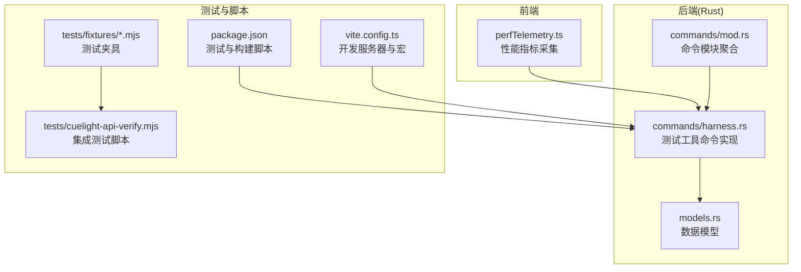
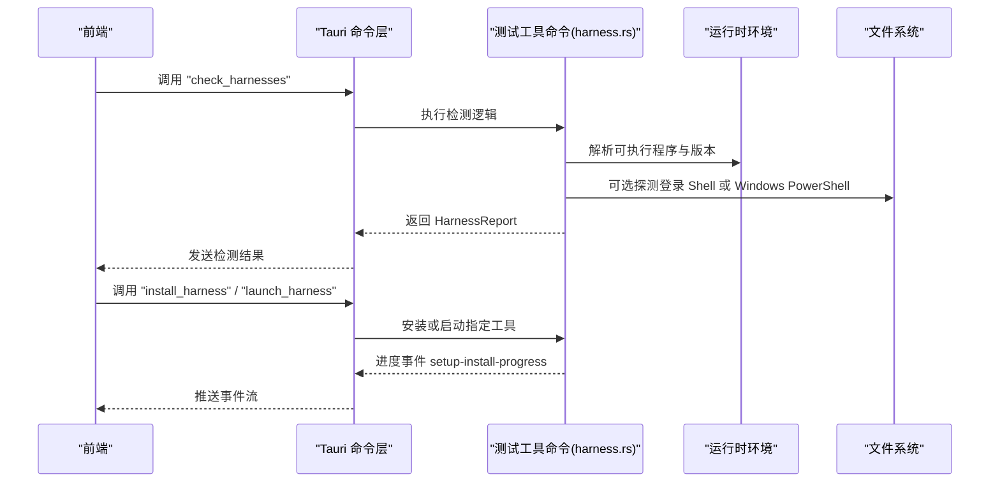
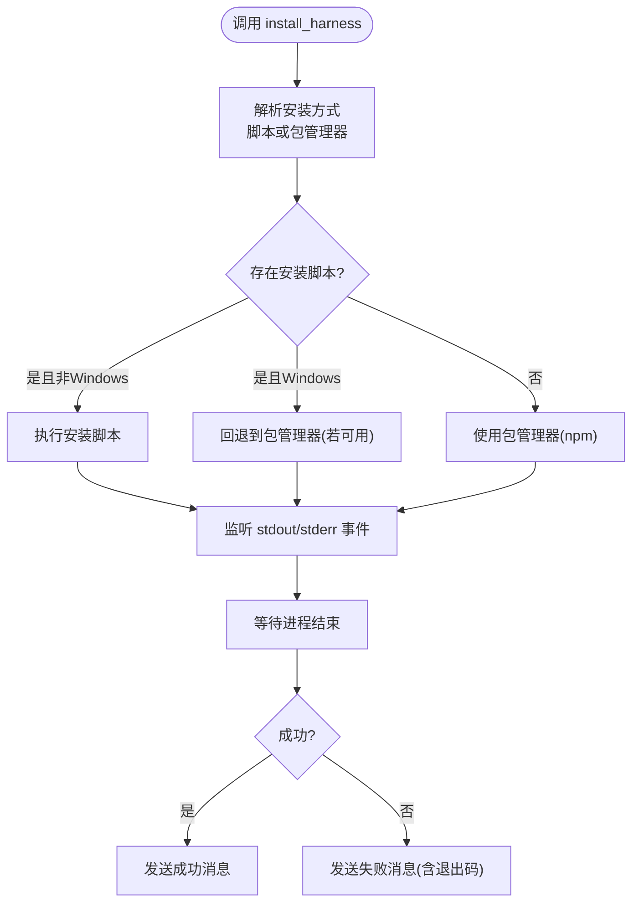
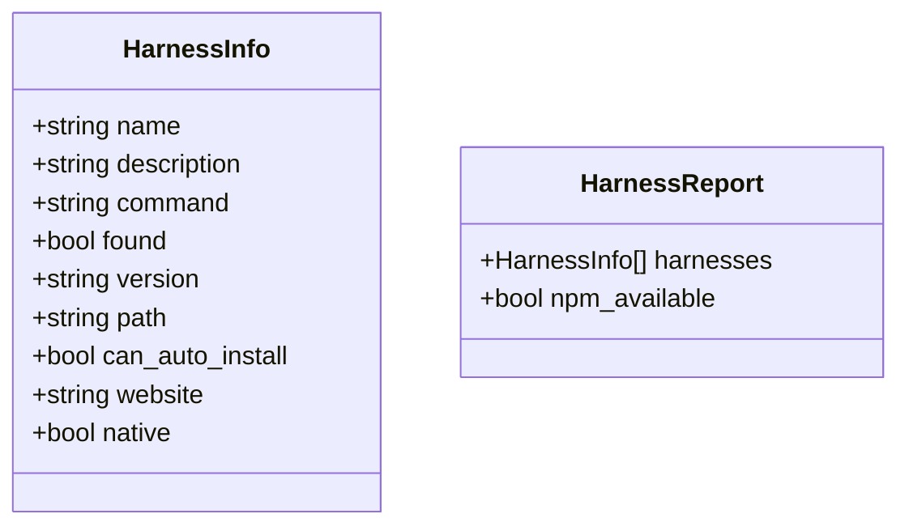
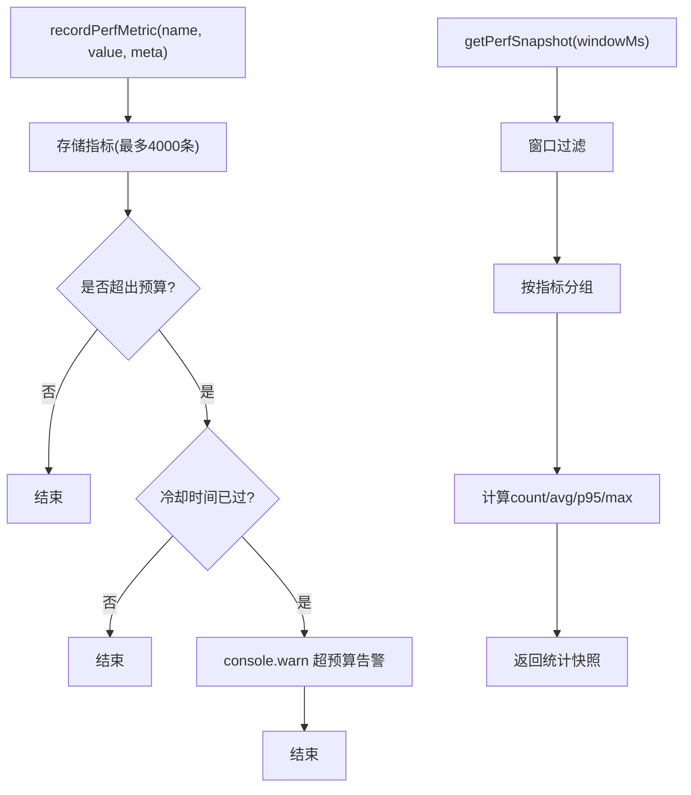
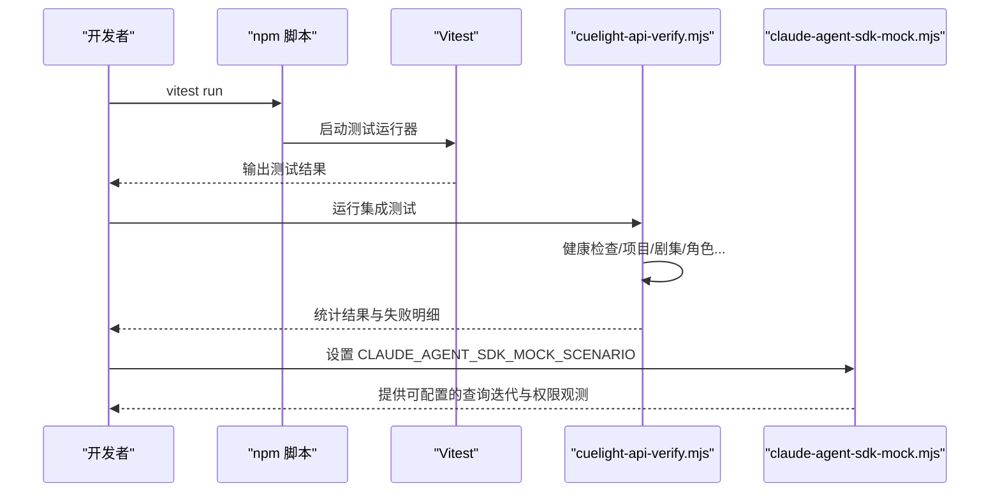
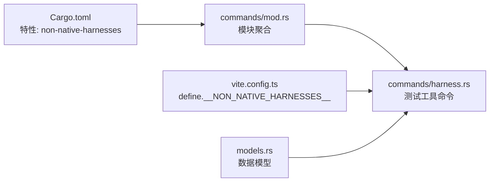

# 测试工具命令

<cite>
**本文引用的文件**
- [Cargo.toml](file://src-tauri/Cargo.toml)
- [mod.rs](file://src-tauri/src/commands/mod.rs)
- [harness.rs](file://src-tauri/src/commands/harness.rs)
- [models.rs](file://src-tauri/src/models.rs)
- [perfTelemetry.ts](file://src/lib/perfTelemetry.ts)
- [package.json](file://package.json)
- [vite.config.ts](file://vite.config.ts)
- [claude-agent-sdk-mock.mjs](file://tests/fixtures/claude-agent-sdk-mock.mjs)
- [cuelight-api-verify.mjs](file://tests/cuelight-api-verify.mjs)
- [mod.rs](file://src-tauri/src/db/mod.rs)
</cite>

## 目录
1. [简介](#简介)
2. [项目结构](#项目结构)
3. [核心组件](#核心组件)
4. [架构总览](#架构总览)
5. [详细组件分析](#详细组件分析)
6. [依赖关系分析](#依赖关系分析)
7. [性能考量](#性能考量)
8. [故障排查指南](#故障排查指南)
9. [结论](#结论)
10. [附录](#附录)

## 简介
本文件系统性梳理与“测试工具命令”相关的能力与实现，覆盖以下方面：
- 测试与调试相关的命令接口：包括测试执行、日志收集、性能监控等
- 测试环境的配置与管理：本地开发、构建脚本、特性开关
- 自动化测试、手动测试与集成测试支持：脚本化验证、模拟 SDK、数据库测试夹具
- 测试数据管理与结果分析：测试夹具、断言与统计输出

## 项目结构
围绕测试工具命令的关键目录与文件：
- 后端命令模块：src-tauri/src/commands 下的各模块（如 harness）
- 模型定义：src-tauri/src/models.rs（用于前后端通信的数据结构）
- 性能遥测：src/lib/perfTelemetry.ts（前端性能指标采集与统计）
- 构建与测试脚本：package.json 中的 test、lint 等脚本；vite.config.ts 的编译与运行参数
- 集成测试与夹具：tests/ 目录下的各类测试脚本与 fixtures

**图表来源**
- [mod.rs:1-13](file://src-tauri/src/commands/mod.rs#L1-L13)
- [harness.rs:1-597](file://src-tauri/src/commands/harness.rs#L1-L597)
- [models.rs:1042-1058](file://src-tauri/src/models.rs#L1042-L1058)
- [perfTelemetry.ts:1-146](file://src/lib/perfTelemetry.ts#L1-L146)
- [package.json:6-26](file://package.json#L6-L26)
- [vite.config.ts:1-24](file://vite.config.ts#L1-L24)
- [claude-agent-sdk-mock.mjs:1-107](file://tests/fixtures/claude-agent-sdk-mock.mjs#L1-L107)
- [cuelight-api-verify.mjs:291-325](file://tests/cuelight-api-verify.mjs#L291-L325)

**章节来源**
- [mod.rs:1-13](file://src-tauri/src/commands/mod.rs#L1-L13)
- [harness.rs:1-597](file://src-tauri/src/commands/harness.rs#L1-L597)
- [models.rs:1042-1058](file://src-tauri/src/models.rs#L1042-L1058)
- [perfTelemetry.ts:1-146](file://src/lib/perfTelemetry.ts#L1-L146)
- [package.json:6-26](file://package.json#L6-L26)
- [vite.config.ts:1-24](file://vite.config.ts#L1-L24)
- [claude-agent-sdk-mock.mjs:1-107](file://tests/fixtures/claude-agent-sdk-mock.mjs#L1-L107)
- [cuelight-api-verify.mjs:291-325](file://tests/cuelight-api-verify.mjs#L291-L325)

## 核心组件
- 测试工具命令（后端）：在 src-tauri/src/commands/harness.rs 中实现，负责检测、安装与启动外部“测试工具”（Harness），并上报状态与进度事件
- 数据模型：在 src-tauri/src/models.rs 中定义 HarnessInfo、HarnessReport 等结构，用于前后端交互
- 性能遥测（前端）：在 src/lib/perfTelemetry.ts 中提供性能指标记录、快照与告警
- 测试脚本与夹具：在 package.json 中定义测试命令；在 tests/ 与 tests/fixtures/ 提供集成测试与模拟 SDK

**章节来源**
- [harness.rs:139-155](file://src-tauri/src/commands/harness.rs#L139-L155)
- [models.rs:1042-1058](file://src-tauri/src/models.rs#L1042-L1058)
- [perfTelemetry.ts:55-122](file://src/lib/perfTelemetry.ts#L55-L122)
- [package.json:18-18](file://package.json#L18-L18)

## 架构总览
后端通过 Tauri 命令暴露测试工具能力，前端通过 IPC 调用并接收事件流；性能数据由前端采集并通过全局对象导出。

**图表来源**
- [harness.rs:139-219](file://src-tauri/src/commands/harness.rs#L139-L219)
- [harness.rs:285-391](file://src-tauri/src/commands/harness.rs#L285-L391)
- [harness.rs:398-500](file://src-tauri/src/commands/harness.rs#L398-L500)

## 详细组件分析

### 组件一：测试工具命令（后端）
- 功能职责
  - 检测已安装的测试工具（如 Codex、Claude Code、Gemini CLI 等）
  - 自动安装非原生工具（优先脚本安装，其次包管理器）
  - 启动工具并在终端会话中写入命令
- 关键命令
  - check_harnesses：返回工具检测报告与 npm 可用性
  - install_harness：按定义自动安装
  - launch_harness：返回工具命令名
- 平台差异
  - 登录 Shell 探测（类 Unix）与 Windows PowerShell 探测
  - Windows 上对 curl-pipe 安装器的限制与回退策略
- 事件与进度
  - 通过事件名 setup-install-progress 推送安装进度（stdout/stderr/status）

**图表来源**
- [harness.rs:161-205](file://src-tauri/src/commands/harness.rs#L161-L205)
- [harness.rs:285-391](file://src-tauri/src/commands/harness.rs#L285-L391)
- [harness.rs:398-500](file://src-tauri/src/commands/harness.rs#L398-L500)

**章节来源**
- [harness.rs:139-155](file://src-tauri/src/commands/harness.rs#L139-L155)
- [harness.rs:161-219](file://src-tauri/src/commands/harness.rs#L161-L219)
- [harness.rs:225-270](file://src-tauri/src/commands/harness.rs#L225-L270)
- [harness.rs:521-586](file://src-tauri/src/commands/harness.rs#L521-L586)

### 组件二：数据模型（前后端契约）
- HarnessInfo：单个工具的检测结果（是否找到、版本、路径、是否可自动安装、网站、是否原生）
- HarnessReport：工具列表与 npm 可用性汇总
- 用途：后端检测完成后序列化为 JSON，前端渲染与交互

**图表来源**
- [models.rs:1042-1058](file://src-tauri/src/models.rs#L1042-L1058)

**章节来源**
- [models.rs:1042-1058](file://src-tauri/src/models.rs#L1042-L1058)

### 组件三：性能监控（前端）
- 指标类型：聊天首帧、流式刷新、渲染提交、Markdown Worker、Git 刷新与 diff 等
- 记录与统计：recordPerfMetric、getPerfSnapshot、clearPerfMetrics
- 告警机制：超过预算阈值时按冷却时间发出控制台警告
- 全局接口：window.__panesPerf（快照、清空、最近指标）

**图表来源**
- [perfTelemetry.ts:55-122](file://src/lib/perfTelemetry.ts#L55-L122)

**章节来源**
- [perfTelemetry.ts:1-146](file://src/lib/perfTelemetry.ts#L1-L146)

### 组件四：测试与调试脚本
- 自动化测试
  - Vitest：通过 package.json 的 test 脚本触发
  - 开发服务器：vite.config.ts 定义了本地开发端口与 HMR 端口
- 集成测试
  - cuelight-api-verify.mjs：按顺序执行健康检查、项目详情、剧集、角色、场景、故事板、视频资源、模型与项目列表，并输出统计与失败明细
  - claude-agent-sdk-mock.mjs：基于环境变量场景驱动的查询迭代器，支持钩子与权限判定观测
- 数据库测试夹具
  - 在 src-tauri/src/db/mod.rs 中包含大量测试用例，演示如何初始化测试数据库、插入工作区与仓库数据、合并重复路径等

**图表来源**
- [package.json:18-18](file://package.json#L18-L18)
- [vite.config.ts:14-21](file://vite.config.ts#L14-L21)
- [cuelight-api-verify.mjs:291-325](file://tests/cuelight-api-verify.mjs#L291-L325)
- [claude-agent-sdk-mock.mjs:1-107](file://tests/fixtures/claude-agent-sdk-mock.mjs#L1-L107)

**章节来源**
- [package.json:6-26](file://package.json#L6-L26)
- [vite.config.ts:1-24](file://vite.config.ts#L1-L24)
- [cuelight-api-verify.mjs:291-325](file://tests/cuelight-api-verify.mjs#L291-L325)
- [claude-agent-sdk-mock.mjs:1-107](file://tests/fixtures/claude-agent-sdk-mock.mjs#L1-L107)
- [mod.rs:714-849](file://src-tauri/src/db/mod.rs#L714-L849)

## 依赖关系分析
- 命令模块聚合：commands/mod.rs 将 app、chat、engines、files、git、harness、power、setup、terminal、threads、workspace 等模块统一导出
- 特性开关：Cargo.toml 中的 non-native-harnesses 特性影响可安装的非原生工具集合
- 前端宏：vite.config.ts 通过 define.__NON_NATIVE_HARNESSES__ 控制前端行为（例如是否启用非原生工具）

**图表来源**
- [Cargo.toml:59-62](file://src-tauri/Cargo.toml#L59-L62)
- [mod.rs:1-13](file://src-tauri/src/commands/mod.rs#L1-L13)
- [harness.rs:1-597](file://src-tauri/src/commands/harness.rs#L1-L597)
- [vite.config.ts:6-10](file://vite.config.ts#L6-L10)
- [models.rs:1042-1058](file://src-tauri/src/models.rs#L1042-L1058)

**章节来源**
- [Cargo.toml:59-62](file://src-tauri/Cargo.toml#L59-L62)
- [mod.rs:1-13](file://src-tauri/src/commands/mod.rs#L1-L13)
- [harness.rs:1-597](file://src-tauri/src/commands/harness.rs#L1-L597)
- [vite.config.ts:6-10](file://vite.config.ts#L6-L10)
- [models.rs:1042-1058](file://src-tauri/src/models.rs#L1042-L1058)

## 性能考量
- 指标预算：前端 perfTelemetry.ts 对关键指标设置预算阈值，超限后进行控制台告警，避免性能回归被忽视
- 窗口统计：按时间窗口聚合指标，计算均值、P95 与最大值，便于趋势分析
- 存储上限：限制指标存储数量，防止内存膨胀
- 实践建议：在 CI 中结合 getPerfSnapshot 输出报告，建立基线与回归阈值

**章节来源**
- [perfTelemetry.ts:26-38](file://src/lib/perfTelemetry.ts#L26-L38)
- [perfTelemetry.ts:89-122](file://src/lib/perfTelemetry.ts#L89-L122)

## 故障排查指南
- 安装失败
  - 观察事件流 setup-install-progress 的 stderr 内容，定位具体错误
  - Windows 上 curl-pipe 安装器需回退到包管理器（若定义允许）
- 工具未检测到
  - 检查 PATH 与登录 Shell 环境变量；确认版本标志正确
  - Windows 使用 PowerShell 探测命令路径与版本
- 性能异常
  - 使用 window.__panesPerf.getSnapshot() 获取最近窗口内的指标快照
  - 若频繁超预算，结合 meta 字段定位具体场景与调用链

**章节来源**
- [harness.rs:285-391](file://src-tauri/src/commands/harness.rs#L285-L391)
- [harness.rs:398-500](file://src-tauri/src/commands/harness.rs#L398-L500)
- [harness.rs:521-586](file://src-tauri/src/commands/harness.rs#L521-L586)
- [perfTelemetry.ts:89-145](file://src/lib/perfTelemetry.ts#L89-L145)

## 结论
本项目通过后端命令模块统一管理测试工具的检测、安装与启动，配合前端性能遥测与完善的测试脚本体系，实现了从自动化测试到集成验证的闭环。借助特性开关与平台差异化处理，既保证了灵活性，也确保了跨平台一致性。建议在持续集成中引入性能快照与回归阈值，以进一步提升质量保障水平。

## 附录
- 测试命令参考
  - 自动化测试：npm run test
  - 类型检查：npm run typecheck
  - 本地开发：npm run dev
- 集成测试示例
  - cuelight-api-verify.mjs：按顺序执行多项 API 验证并输出统计
  - claude-agent-sdk-mock.mjs：通过环境变量驱动模拟查询流程与权限观测

**章节来源**
- [package.json:6-26](file://package.json#L6-L26)
- [cuelight-api-verify.mjs:291-325](file://tests/cuelight-api-verify.mjs#L291-L325)
- [claude-agent-sdk-mock.mjs:1-107](file://tests/fixtures/claude-agent-sdk-mock.mjs#L1-L107)