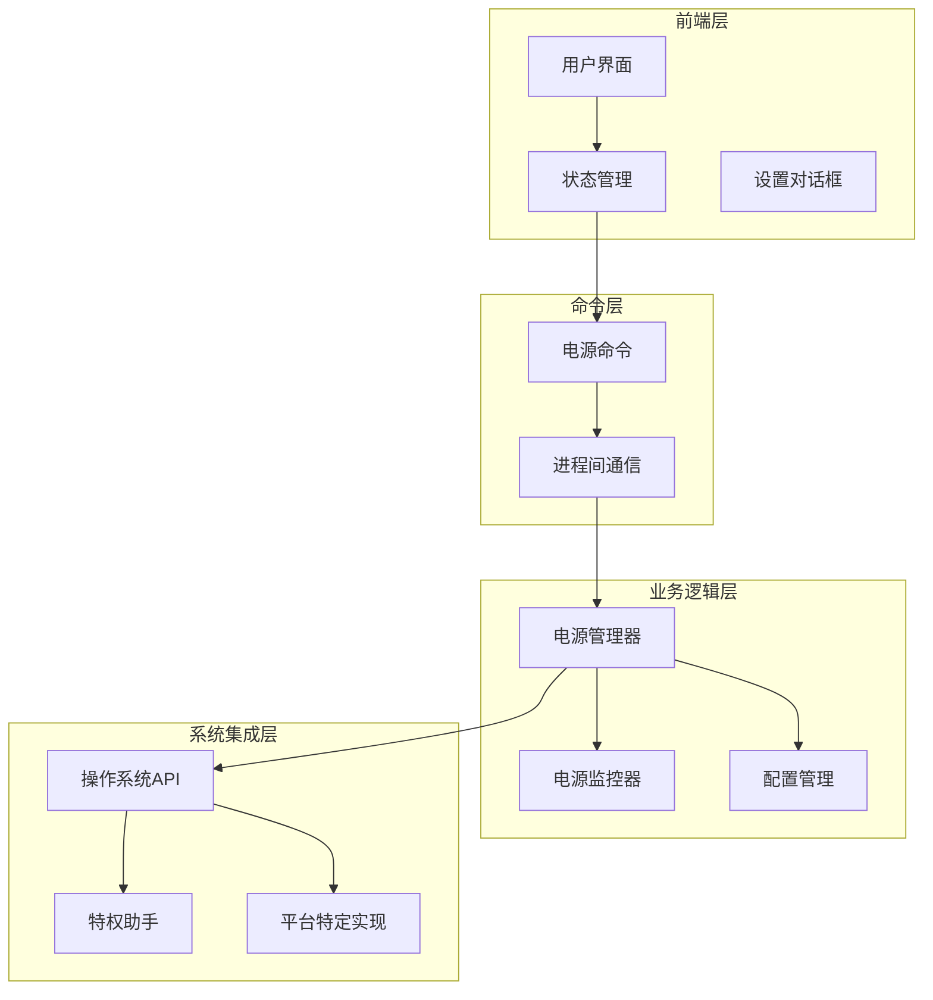
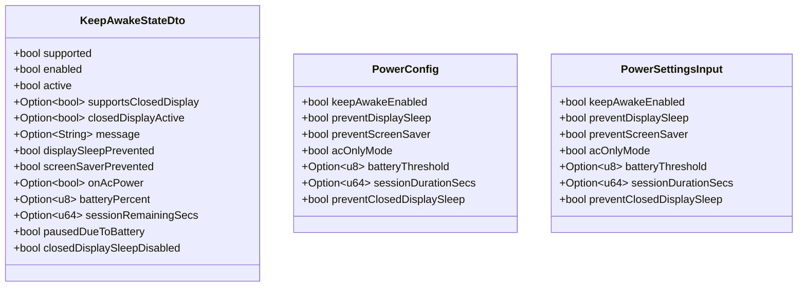
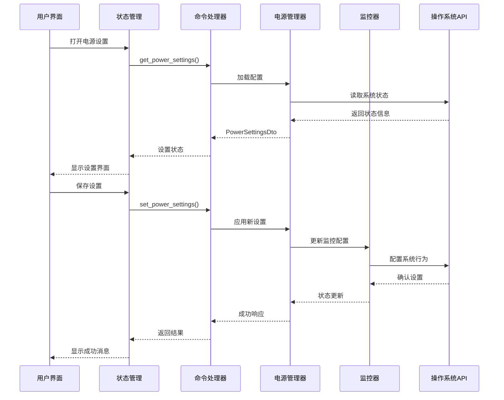
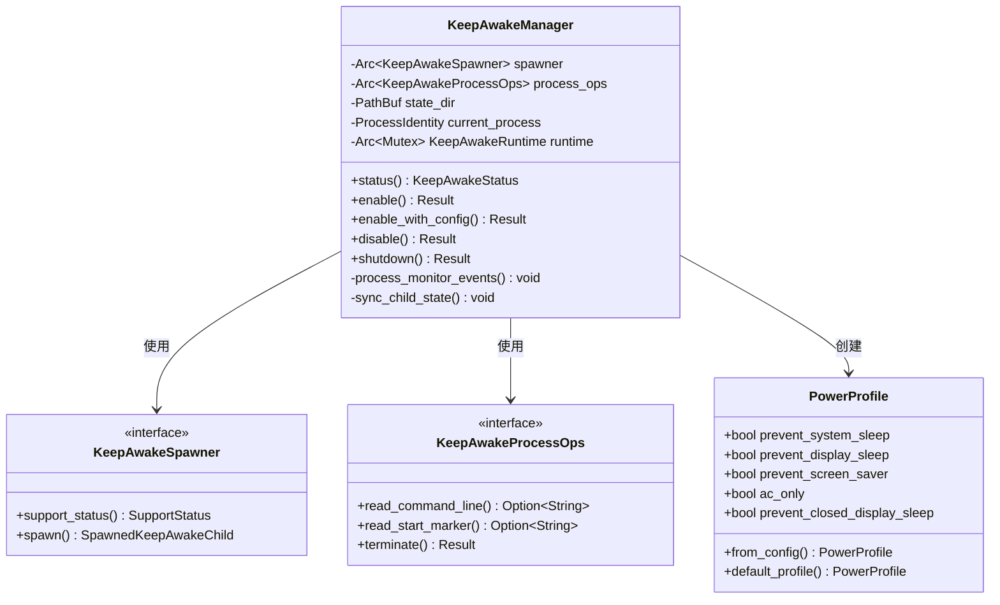
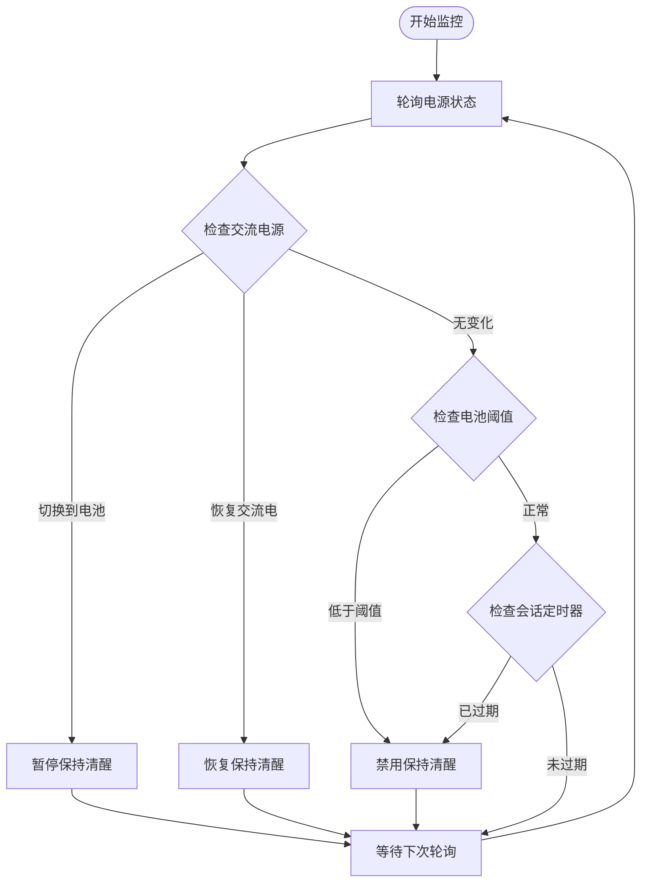
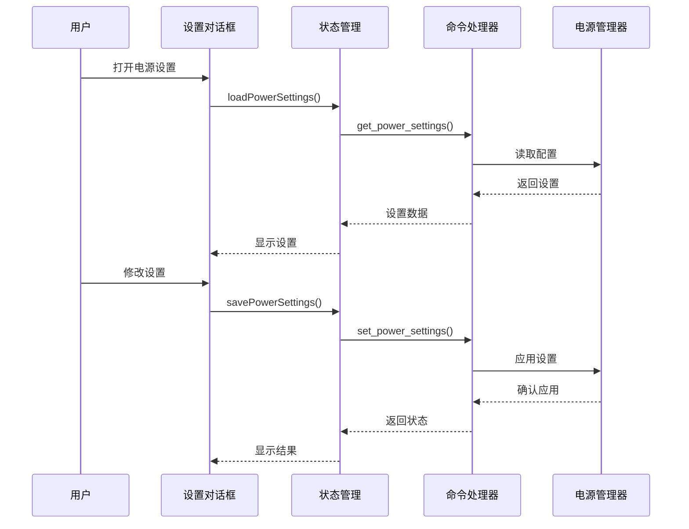
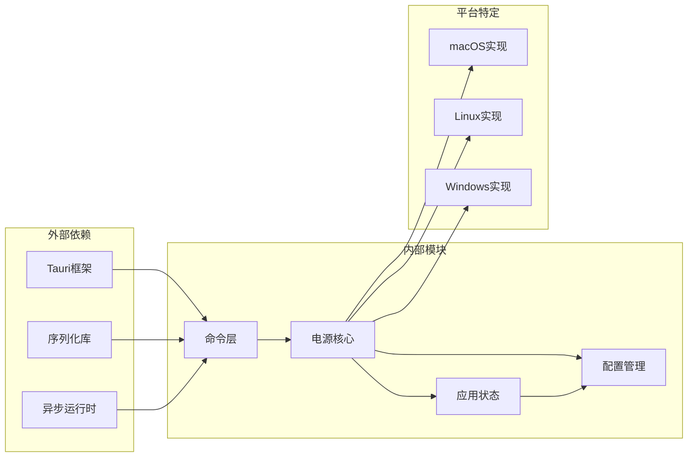
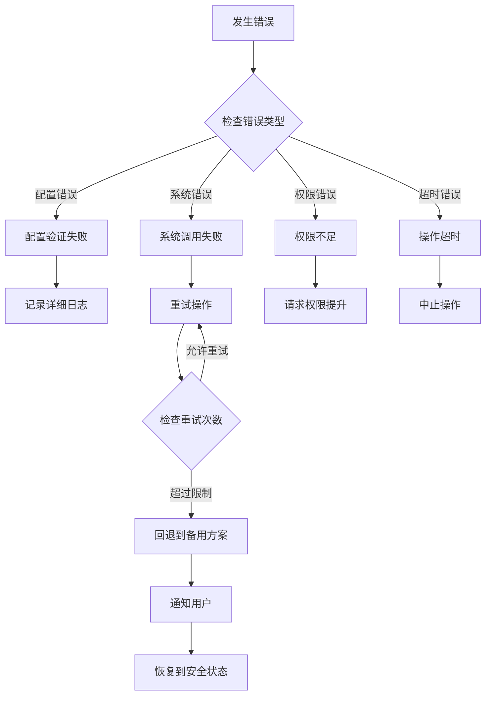

# 电源管理命令

<cite>
**本文档引用的文件**
- [power.rs](file://src-tauri/src/commands/power.rs)
- [mod.rs](file://src-tauri/src/power/mod.rs)
- [macos.rs](file://src-tauri/src/power/macos.rs)
- [macos_helper.rs](file://src-tauri/src/power/macos_helper.rs)
- [monitor.rs](file://src-tauri/src/power/monitor.rs)
- [app_config.rs](file://src-tauri/src/config/app_config.rs)
- [state.rs](file://src-tauri/src/state.rs)
- [PowerSettingsModal.tsx](file://src/components/shared/PowerSettingsModal.tsx)
- [keepAwakeStore.ts](file://src/stores/keepAwakeStore.ts)
- [types.ts](file://src/types.ts)
</cite>

## 目录
1. [简介](#简介)
2. [项目结构](#项目结构)
3. [核心组件](#核心组件)
4. [架构概览](#架构概览)
5. [详细组件分析](#详细组件分析)
6. [依赖关系分析](#依赖关系分析)
7. [性能考虑](#性能考虑)
8. [故障排除指南](#故障排除指南)
9. [结论](#结论)

## 简介

电源管理系统是 Panes 应用程序中的一个关键功能模块，负责管理系统在不同操作系统下的电源状态控制。该系统提供了完整的电源管理命令接口，包括睡眠、唤醒、休眠等功能，并实现了跨平台的电源状态监控、节能策略和自动唤醒机制。

该模块的核心目标是：
- 提供统一的电源管理接口，支持多操作系统
- 实现智能的电源状态监控和自动响应
- 提供用户友好的电源设置界面
- 确保电源管理操作的安全性和可靠性

## 项目结构

电源管理模块采用分层架构设计，主要包含以下层次：

**图表来源**
- [power.rs:1-441](file://src-tauri/src/commands/power.rs#L1-L441)
- [mod.rs:1-800](file://src-tauri/src/power/mod.rs#L1-L800)
- [state.rs:1-56](file://src-tauri/src/state.rs#L1-L56)

**章节来源**
- [power.rs:1-441](file://src-tauri/src/commands/power.rs#L1-L441)
- [mod.rs:1-800](file://src-tauri/src/power/mod.rs#L1-L800)
- [state.rs:1-56](file://src-tauri/src/state.rs#L1-L56)

## 核心组件

### 命令接口层

电源管理命令接口提供了完整的电源控制功能：

| 命令名称 | 功能描述 | 参数 | 返回值 |
|---------|----------|------|--------|
| `get_keep_awake_state` | 获取当前保持清醒状态 | 无 | KeepAwakeStateDto |
| `set_keep_awake_enabled` | 启用或禁用保持清醒 | enabled: bool | KeepAwakeStateDto |
| `get_power_settings` | 获取电源设置 | 无 | PowerSettingsDto |
| `set_power_settings` | 设置电源参数 | PowerSettingsInput | KeepAwakeStateDto |
| `get_helper_status` | 获取助手状态 | 无 | HelperStatusDto |
| `register_keep_awake_helper` | 注册保持清醒助手 | 无 | HelperStatusDto |

### 状态数据模型

系统使用统一的状态数据模型来表示电源状态：

**图表来源**
- [power.rs:10-56](file://src-tauri/src/commands/power.rs#L10-L56)
- [app_config.rs:54-66](file://src-tauri/src/config/app_config.rs#L54-L66)

**章节来源**
- [power.rs:58-200](file://src-tauri/src/commands/power.rs#L58-L200)
- [types.ts:19-58](file://src/types.ts#L19-L58)

## 架构概览

电源管理系统的整体架构采用了分层设计，确保了良好的可维护性和扩展性：

**图表来源**
- [PowerSettingsModal.tsx:204-302](file://src/components/shared/PowerSettingsModal.tsx#L204-L302)
- [keepAwakeStore.ts:226-277](file://src/stores/keepAwakeStore.ts#L226-L277)
- [power.rs:143-200](file://src-tauri/src/commands/power.rs#L143-L200)

## 详细组件分析

### 跨平台电源管理器

电源管理器是整个系统的核心组件，负责协调不同操作系统下的电源控制：

**图表来源**
- [mod.rs:53-121](file://src-tauri/src/power/mod.rs#L53-L121)

#### 平台特定实现

系统针对不同操作系统提供了专门的实现：

**macOS 实现特点：**
- 使用 IOKit 框架进行电源管理
- 支持闭合显示器睡眠控制
- 通过特权助手实现系统级电源控制
- 监控系统睡眠/唤醒事件

**Linux 实现特点：**
- 使用 D-Bus 和 systemd 进行电源管理
- 通过 gnome-session进行屏幕保护程序抑制
- 支持多种桌面环境的兼容性

**Windows 实现特点：**
- 使用 SetThreadExecutionState API
- 通过 PowerShell 脚本进行系统级电源控制
- 支持会话状态监控

**章节来源**
- [mod.rs:199-498](file://src-tauri/src/power/mod.rs#L199-L498)
- [macos.rs:202-245](file://src-tauri/src/power/macos.rs#L202-L245)
- [monitor.rs:70-142](file://src-tauri/src/power/monitor.rs#L70-L142)

### 电源监控系统

电源监控系统负责实时跟踪电源状态变化并执行相应的响应：

**图表来源**
- [monitor.rs:85-131](file://src-tauri/src/power/monitor.rs#L85-L131)
- [mod.rs:500-635](file://src-tauri/src/power/mod.rs#L500-L635)

#### 监控配置

监控系统支持多种配置选项：

| 配置项 | 类型 | 描述 | 默认值 |
|--------|------|------|--------|
| ac_only_mode | bool | 仅在交流电源时保持清醒 | false |
| battery_threshold | Option<u8> | 电池电量阈值(%) | None |
| session_duration_secs | Option<u64> | 会话持续时间(秒) | None |

**章节来源**
- [monitor.rs:39-44](file://src-tauri/src/power/monitor.rs#L39-L44)
- [app_config.rs:54-66](file://src-tauri/src/config/app_config.rs#L54-L66)

### 用户界面集成

电源管理界面提供了直观的用户交互体验：

**图表来源**
- [PowerSettingsModal.tsx:204-302](file://src/components/shared/PowerSettingsModal.tsx#L204-L302)
- [keepAwakeStore.ts:226-277](file://src/stores/keepAwakeStore.ts#L226-L277)

**章节来源**
- [PowerSettingsModal.tsx:1-800](file://src/components/shared/PowerSettingsModal.tsx#L1-L800)
- [keepAwakeStore.ts:1-317](file://src/stores/keepAwakeStore.ts#L1-L317)

## 依赖关系分析

电源管理模块的依赖关系体现了清晰的分层架构：

**图表来源**
- [power.rs:1-8](file://src-tauri/src/commands/power.rs#L1-L8)
- [mod.rs:1-29](file://src-tauri/src/power/mod.rs#L1-L29)

### 关键依赖关系

1. **命令层依赖**：命令处理器依赖于电源管理器和配置管理器
2. **电源核心依赖**：电源管理器依赖于平台特定的实现和监控器
3. **配置管理依赖**：配置管理器提供持久化的设置存储
4. **状态管理依赖**：应用状态管理器协调各个组件的工作

**章节来源**
- [state.rs:12-24](file://src-tauri/src/state.rs#L12-L24)
- [app_config.rs:14-19](file://src-tauri/src/config/app_config.rs#L14-L19)

## 性能考虑

电源管理系统在设计时充分考虑了性能优化：

### 异步处理
- 使用 Tokio 异步运行时处理长时间运行的操作
- 非阻塞的进程管理和状态查询
- 并发的安全状态更新机制

### 内存管理
- 使用 Arc 智能指针共享状态数据
- 避免不必要的数据复制
- 及时清理临时资源和进程句柄

### 系统资源优化
- 智能的电源状态轮询频率控制
- 条件化的功能启用和禁用
- 最小化的系统调用次数

## 故障排除指南

### 常见问题及解决方案

**问题1：保持清醒功能无法启用**
- 检查系统权限设置
- 验证电源配置的有效性
- 确认操作系统支持情况

**问题2：电源监控不工作**
- 检查监控服务的启动状态
- 验证系统事件监听器
- 确认配置文件的正确性

**问题3：跨平台兼容性问题**
- 检查目标操作系统的版本要求
- 验证平台特定的依赖库
- 确认权限配置的正确性

### 错误处理机制

系统实现了多层次的错误处理：

**章节来源**
- [power.rs:78-122](file://src-tauri/src/commands/power.rs#L78-L122)
- [mod.rs:289-298](file://src-tauri/src/power/mod.rs#L289-L298)

## 结论

电源管理命令模块是一个设计精良、功能完整的系统，具有以下特点：

### 技术优势
- **跨平台兼容性**：支持 macOS、Linux 和 Windows 系统
- **模块化设计**：清晰的分层架构便于维护和扩展
- **异步处理**：高效的并发处理能力
- **安全可靠**：完善的错误处理和回滚机制

### 功能完整性
- 提供完整的电源控制接口
- 支持智能的电源状态监控
- 实现灵活的节能策略配置
- 提供用户友好的界面交互

### 最佳实践
- 遵循最小权限原则
- 实现优雅的降级策略
- 提供详细的诊断信息
- 确保系统的稳定性和可靠性

该模块为应用程序提供了强大的电源管理能力，能够满足不同用户场景下的需求，同时保证了系统的安全性和稳定性。