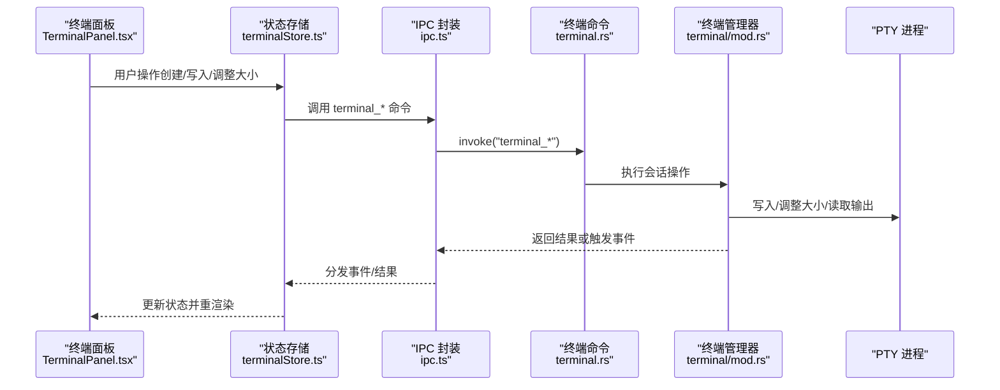
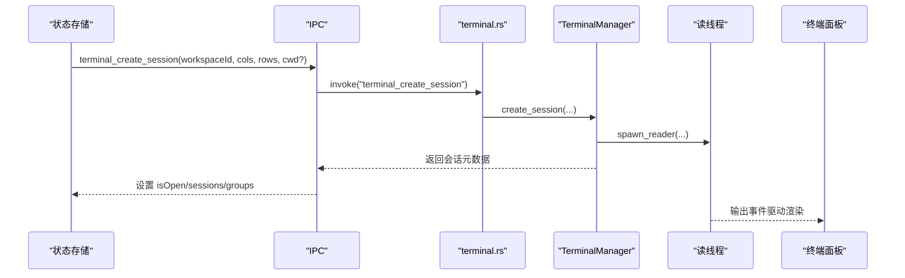
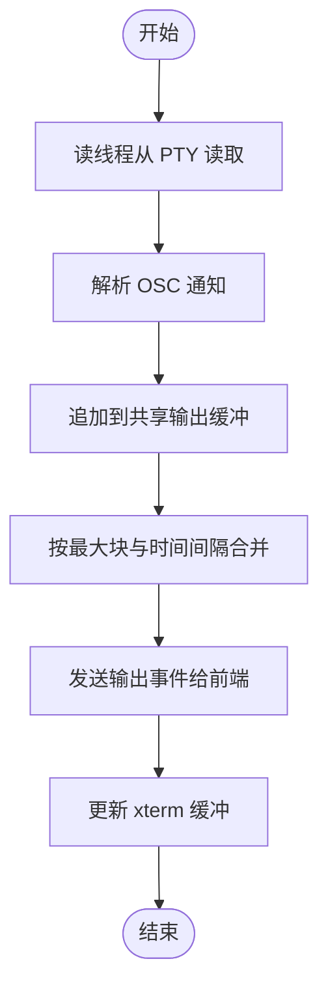
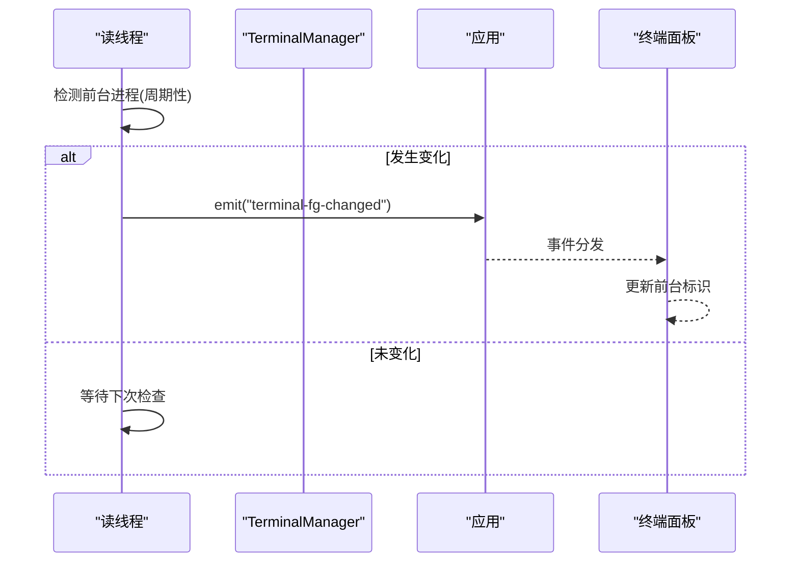
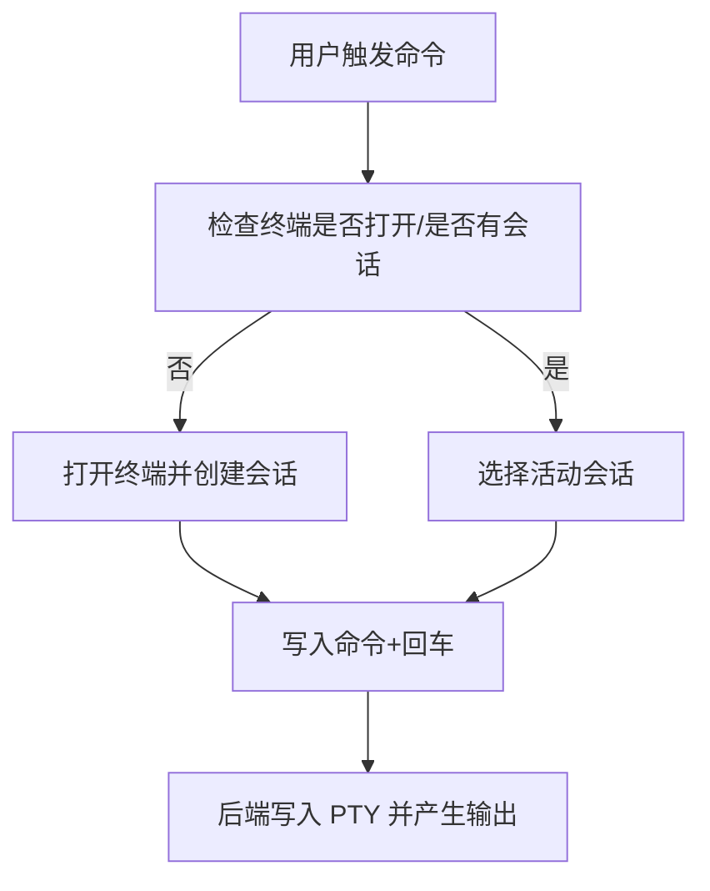
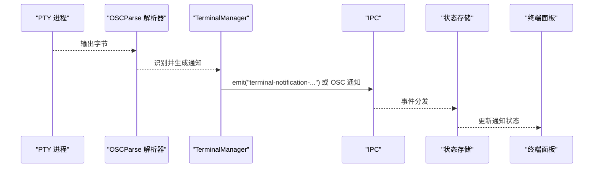
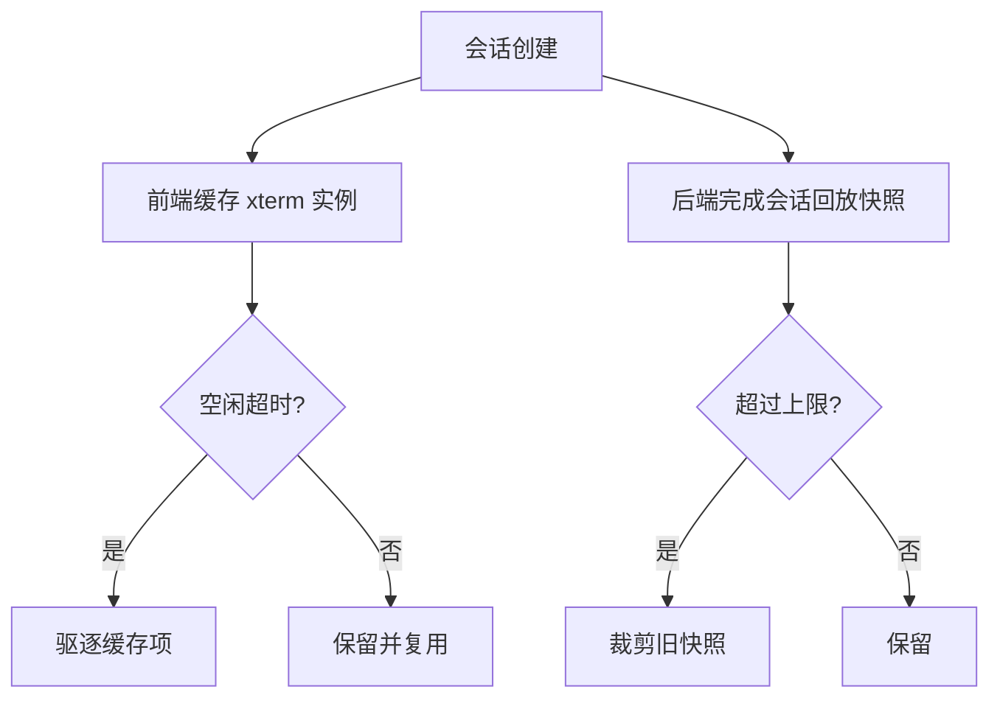
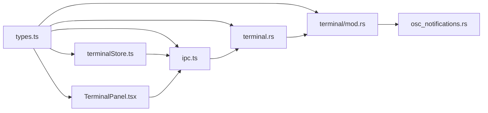

# 终端命令

<cite>
**本文档引用的文件**
- [terminalBootstrap.ts](file://src/lib/terminalBootstrap.ts)
- [terminalClipboard.ts](file://src/lib/terminalClipboard.ts)
- [terminalFileReferences.ts](file://src/lib/terminalFileReferences.ts)
- [terminalRenderingSettings.ts](file://src/lib/terminalRenderingSettings.ts)
- [terminalStore.ts](file://src/stores/terminalStore.ts)
- [TerminalPanel.tsx](file://src/components/terminal/TerminalPanel.tsx)
- [terminalCacheLifecycle.ts](file://src/components/terminal/terminalCacheLifecycle.ts)
- [ipc.ts](file://src/lib/ipc.ts)
- [terminal.rs](file://src-tauri/src/commands/terminal.rs)
- [mod.rs](file://src-tauri/src/terminal/mod.rs)
- [osc_notifications.rs](file://src-tauri/src/terminal/osc_notifications.rs)
- [types.ts](file://src/types.ts)
</cite>

## 目录
1. [简介](#简介)
2. [项目结构](#项目结构)
3. [核心组件](#核心组件)
4. [架构总览](#架构总览)
5. [详细组件分析](#详细组件分析)
6. [依赖关系分析](#依赖关系分析)
7. [性能考虑](#性能考虑)
8. [故障排除指南](#故障排除指南)
9. [结论](#结论)

## 简介
本文件系统性梳理终端命令模块的设计与实现，覆盖会话创建、输入输出处理、进程管理、终端仿真与通知系统，并提供持久化、多路复用与性能优化策略。目标是帮助开发者快速理解从前端到后端的完整终端控制链路。

## 项目结构
终端相关代码主要分布在以下位置：
- 前端状态与UI：stores/terminalStore.ts、components/terminal/TerminalPanel.tsx、lib 下的工具函数
- 后端命令与终端管理：src-tauri/src/commands/terminal.rs、src-tauri/src/terminal/mod.rs 及其子模块
- 类型定义：src/types.ts

```mermaid
graph TB
subgraph "前端"
Store["终端状态存储<br/>terminalStore.ts"]
Panel["终端面板组件<br/>TerminalPanel.tsx"]
Lib["工具函数<br/>terminal*.ts"]
IPC["IPC 接口封装<br/>ipc.ts"]
end
subgraph "后端"
Cmd["终端命令入口<br/>terminal.rs"]
TermMgr["终端管理器<br/>terminal/mod.rs"]
OSC["OSCParse 通知解析<br/>osc_notifications.rs"]
end
Store <- --> IPC
Panel <- --> IPC
IPC --> Cmd
Cmd --> TermMgr
TermMgr --> OSC
```

图示来源
- [terminalStore.ts:1-800](file://src/stores/terminalStore.ts#L1-L800)
- [TerminalPanel.tsx:1-800](file://src/components/terminal/TerminalPanel.tsx#L1-L800)
- [ipc.ts:1-813](file://src/lib/ipc.ts#L1-L813)
- [terminal.rs:1-294](file://src-tauri/src/commands/terminal.rs#L1-L294)
- [mod.rs:1-800](file://src-tauri/src/terminal/mod.rs#L1-L800)
- [osc_notifications.rs:1-419](file://src-tauri/src/terminal/osc_notifications.rs#L1-L419)

章节来源
- [terminalStore.ts:1-800](file://src/stores/terminalStore.ts#L1-L800)
- [TerminalPanel.tsx:1-800](file://src/components/terminal/TerminalPanel.tsx#L1-L800)
- [ipc.ts:1-813](file://src/lib/ipc.ts#L1-L813)
- [terminal.rs:1-294](file://src-tauri/src/commands/terminal.rs#L1-L294)
- [mod.rs:1-800](file://src-tauri/src/terminal/mod.rs#L1-L800)
- [osc_notifications.rs:1-419](file://src-tauri/src/terminal/osc_notifications.rs#L1-L419)

## 核心组件
- 终端状态存储（Zustand）：负责布局模式、会话列表、分组树、通知、工作区预设等状态管理与生命周期控制。
- 终端面板（xterm.js）：负责渲染、输入队列、输出缓冲、焦点锁定、加速渲染开关、诊断信息导出。
- IPC 封装：统一暴露终端命令（创建/写入/关闭/列表/诊断/通知等）与事件监听。
- 后端终端管理器：基于 portable-pty 的会话生命周期、输出缓冲与速率限制、前台进程检测、OSCParse 通知解析。
- 工具函数：剪贴板快捷键判定、启动引导决策、文件偏移转坐标、渲染偏好事件。

章节来源
- [terminalStore.ts:1-800](file://src/stores/terminalStore.ts#L1-L800)
- [TerminalPanel.tsx:1-800](file://src/components/terminal/TerminalPanel.tsx#L1-L800)
- [ipc.ts:1-813](file://src/lib/ipc.ts#L1-L813)
- [terminal.rs:1-294](file://src-tauri/src/commands/terminal.rs#L1-L294)
- [mod.rs:1-800](file://src-tauri/src/terminal/mod.rs#L1-L800)
- [terminalClipboard.ts:1-40](file://src/lib/terminalClipboard.ts#L1-L40)
- [terminalBootstrap.ts:1-45](file://src/lib/terminalBootstrap.ts#L1-L45)
- [terminalFileReferences.ts:1-48](file://src/lib/terminalFileReferences.ts#L1-L48)
- [terminalRenderingSettings.ts:1-37](file://src/lib/terminalRenderingSettings.ts#L1-L37)

## 架构总览
从前端到后端的调用链路如下：



图示来源
- [TerminalPanel.tsx:1-800](file://src/components/terminal/TerminalPanel.tsx#L1-L800)
- [terminalStore.ts:1-800](file://src/stores/terminalStore.ts#L1-L800)
- [ipc.ts:1-813](file://src/lib/ipc.ts#L1-L813)
- [terminal.rs:1-294](file://src-tauri/src/commands/terminal.rs#L1-L294)
- [mod.rs:1-800](file://src-tauri/src/terminal/mod.rs#L1-L800)

## 详细组件分析

### 1) 会话创建与生命周期
- 前端通过状态存储创建会话，必要时自动打开终端面板并延迟初始化，避免丢失初始 Shell 提示。
- 后端根据工作区根路径与 CWD 校验，创建 PTY 会话，注册读线程与前台进程检测。
- 支持按工作区批量关闭会话，并清理对应通知。



图示来源
- [terminalStore.ts:1385-1443](file://src/stores/terminalStore.ts#L1385-L1443)
- [ipc.ts:548-575](file://src/lib/ipc.ts#L548-L575)
- [terminal.rs:25-62](file://src-tauri/src/commands/terminal.rs#L25-L62)
- [mod.rs:385-429](file://src-tauri/src/terminal/mod.rs#L385-L429)

章节来源
- [terminalStore.ts:826-875](file://src/stores/terminalStore.ts#L826-L875)
- [terminalStore.ts:1385-1443](file://src/stores/terminalStore.ts#L1385-L1443)
- [ipc.ts:548-575](file://src/lib/ipc.ts#L548-L575)
- [terminal.rs:25-62](file://src-tauri/src/commands/terminal.rs#L25-L62)
- [mod.rs:385-429](file://src-tauri/src/terminal/mod.rs#L385-L429)

### 2) 输入输出处理与多路复用
- 输入：前端将文本/字节输入通过 IPC 写入后端；后端以任务方式写入 PTY，统计 IO 计数器。
- 输出：后端读线程持续从 PTY 读取，UTF-8 安全切片，合并为最大块，按最小发射间隔限流发送到前端。
- 多路复用：同一工作区内多个会话共享一个输出通道，通过事件名区分会话；前端缓存 xterm 实例以保留滚动缓冲。



图示来源
- [mod.rs:622-799](file://src-tauri/src/terminal/mod.rs#L622-L799)
- [TerminalPanel.tsx:281-320](file://src/components/terminal/TerminalPanel.tsx#L281-L320)

章节来源
- [mod.rs:622-799](file://src-tauri/src/terminal/mod.rs#L622-L799)
- [TerminalPanel.tsx:281-320](file://src/components/terminal/TerminalPanel.tsx#L281-L320)

### 3) 终端仿真与前台进程检测
- 终端仿真：使用 portable-pty 创建伪终端，支持写入、调整大小、读取输出。
- 前台进程检测：在有 Shell PID 的情况下，周期性检测前台进程变化并通过事件通知前端，用于 UI 状态同步。



图示来源
- [mod.rs:638-757](file://src-tauri/src/terminal/mod.rs#L638-L757)
- [ipc.ts:735-743](file://src/lib/ipc.ts#L735-L743)

章节来源
- [mod.rs:638-757](file://src-tauri/src/terminal/mod.rs#L638-L757)
- [ipc.ts:735-743](file://src/lib/ipc.ts#L735-L743)

### 4) 命令执行与启动引导
- 命令执行：前端通过状态存储调用 runCommandInTerminal，确保终端打开且存在活动会话，然后写入回车后的命令。
- 启动引导：根据工作区状态与布局模式，决定是否自动创建单一会话或应用预设。



图示来源
- [terminalStore.ts:921-958](file://src/stores/terminalStore.ts#L921-L958)
- [terminalBootstrap.ts:13-44](file://src/lib/terminalBootstrap.ts#L13-L44)

章节来源
- [terminalStore.ts:921-958](file://src/stores/terminalStore.ts#L921-L958)
- [terminalBootstrap.ts:13-44](file://src/lib/terminalBootstrap.ts#L13-L44)

### 5) 通知系统（含 OSC 通知）
- 通知来源：后端解析 OSC 序列（如 OSC 9、99、777），提取标题/正文，派发到前端。
- 通知管理：前端状态存储维护每会话最新通知，支持清除、聚焦窗口时自动清空。



图示来源
- [osc_notifications.rs:1-419](file://src-tauri/src/terminal/osc_notifications.rs#L1-L419)
- [mod.rs:784-793](file://src-tauri/src/terminal/mod.rs#L784-L793)
- [ipc.ts:745-763](file://src/lib/ipc.ts#L745-L763)
- [terminalStore.ts:1588-1600](file://src/stores/terminalStore.ts#L1588-L1600)

章节来源
- [osc_notifications.rs:1-419](file://src-tauri/src/terminal/osc_notifications.rs#L1-L419)
- [mod.rs:784-793](file://src-tauri/src/terminal/mod.rs#L784-L793)
- [ipc.ts:745-763](file://src/lib/ipc.ts#L745-L763)
- [terminalStore.ts:1588-1600](file://src/stores/terminalStore.ts#L1588-L1600)

### 6) 会话持久化与缓存
- 前端缓存：xterm 实例与输出缓冲跨组件卸载保持，利用缓存键区分工作区与会话。
- 后端缓存：完成会话的回放快照（最多条目与总字节数限制），支持按序列号恢复。
- 脱离缓存：空闲超时驱逐，避免内存膨胀。



图示来源
- [TerminalPanel.tsx:281-320](file://src/components/terminal/TerminalPanel.tsx#L281-L320)
- [mod.rs:573-597](file://src-tauri/src/terminal/mod.rs#L573-L597)
- [terminalCacheLifecycle.ts:43-74](file://src/components/terminal/terminalCacheLifecycle.ts#L43-L74)

章节来源
- [TerminalPanel.tsx:281-320](file://src/components/terminal/TerminalPanel.tsx#L281-L320)
- [mod.rs:573-597](file://src-tauri/src/terminal/mod.rs#L573-L597)
- [terminalCacheLifecycle.ts:43-74](file://src/components/terminal/terminalCacheLifecycle.ts#L43-L74)

### 7) 剪贴板与渲染设置
- 剪贴板快捷键：判定复制/粘贴组合键，兼容不同平台修饰键。
- 渲染设置：前端监听加速渲染偏好变更，动态启用/降级 WebGL 渲染，同时加载图像插件增强显示能力。

章节来源
- [terminalClipboard.ts:1-40](file://src/lib/terminalClipboard.ts#L1-L40)
- [terminalRenderingSettings.ts:1-37](file://src/lib/terminalRenderingSettings.ts#L1-L37)
- [TerminalPanel.tsx:673-795](file://src/components/terminal/TerminalPanel.tsx#L673-L795)

## 依赖关系分析
- 前端依赖关系：TerminalPanel 依赖 xterm 及其插件、IPC 封装、状态存储；状态存储依赖 IPC 与工作区/工具人状态。
- 后端依赖关系：terminal.rs 命令依赖 terminal/mod.rs 中的 TerminalManager；mod.rs 依赖 portable-pty、OSCParse 子模块与通知管理器。
- 类型定义：types.ts 提供会话、通知、预设等核心类型，前后端共享。



图示来源
- [types.ts:1-800](file://src/types.ts#L1-L800)
- [terminalStore.ts:1-800](file://src/stores/terminalStore.ts#L1-L800)
- [TerminalPanel.tsx:1-800](file://src/components/terminal/TerminalPanel.tsx#L1-L800)
- [ipc.ts:1-813](file://src/lib/ipc.ts#L1-L813)
- [terminal.rs:1-294](file://src-tauri/src/commands/terminal.rs#L1-L294)
- [mod.rs:1-800](file://src-tauri/src/terminal/mod.rs#L1-L800)
- [osc_notifications.rs:1-419](file://src-tauri/src/terminal/osc_notifications.rs#L1-L419)

章节来源
- [types.ts:1-800](file://src/types.ts#L1-L800)
- [terminalStore.ts:1-800](file://src/stores/terminalStore.ts#L1-L800)
- [TerminalPanel.tsx:1-800](file://src/components/terminal/TerminalPanel.tsx#L1-L800)
- [ipc.ts:1-813](file://src/lib/ipc.ts#L1-L813)
- [terminal.rs:1-294](file://src-tauri/src/commands/terminal.rs#L1-L294)
- [mod.rs:1-800](file://src-tauri/src/terminal/mod.rs#L1-L800)
- [osc_notifications.rs:1-419](file://src-tauri/src/terminal/osc_notifications.rs#L1-L419)

## 性能考虑
- 输出限流与缓冲
  - 最小发射间隔与最大块大小限制，避免高频输出导致 IPC 抖动。
  - 共享输出缓冲与条件变量，保证读线程不睡眠、发射线程按节拍刷新。
- 输入队列与字符边界
  - 输入批处理与 UTF-16 边界保护，避免截断导致的渲染异常。
- 渲染优化
  - 加速渲染偏好切换时动态启用/降级 WebGL，必要时回退 Canvas。
  - 图像插件按需初始化，记录运行时错误以便诊断。
- 资源管理
  - 完成会话回放快照上限裁剪，防止内存膨胀。
  - 脱离缓存的空闲会话按时间驱逐，释放资源。

章节来源
- [mod.rs:35-42](file://src-tauri/src/terminal/mod.rs#L35-L42)
- [mod.rs:622-799](file://src-tauri/src/terminal/mod.rs#L622-L799)
- [TerminalPanel.tsx:239-280](file://src/components/terminal/TerminalPanel.tsx#L239-L280)
- [TerminalPanel.tsx:673-795](file://src/components/terminal/TerminalPanel.tsx#L673-L795)
- [terminalCacheLifecycle.ts:43-74](file://src/components/terminal/terminalCacheLifecycle.ts#L43-L74)

## 故障排除指南
- 无法写入命令
  - 检查终端是否已打开且存在活动会话；若无则先创建会话再写入。
  - 查看状态存储中的错误字段，确认 IPC 调用返回。
- 输出卡顿或冻结
  - 确认后端读线程正常运行，发射线程按最小间隔刷新。
  - 检查前端渲染诊断（输出块/丢弃计数、上下文丢失次数）。
- 剪贴板无效
  - 核对剪贴板快捷键判定逻辑，确认修饰键组合正确。
- 渲染异常
  - 切换加速渲染偏好，观察 WebGL 初始化与上下文丢失日志。
  - 若图像插件报错，检查错误模式匹配与存储限制。
- 通知不显示
  - 检查 OSC 序列解析是否成功，确认通知事件已分发至前端状态存储。

章节来源
- [terminalStore.ts:921-958](file://src/stores/terminalStore.ts#L921-L958)
- [ipc.ts:770-812](file://src/lib/ipc.ts#L770-L812)
- [TerminalPanel.tsx:426-450](file://src/components/terminal/TerminalPanel.tsx#L426-L450)
- [terminalClipboard.ts:1-40](file://src/lib/terminalClipboard.ts#L1-L40)
- [terminalRenderingSettings.ts:14-37](file://src/lib/terminalRenderingSettings.ts#L14-L37)
- [osc_notifications.rs:146-215](file://src-tauri/src/terminal/osc_notifications.rs#L146-L215)

## 结论
该终端命令模块通过清晰的前后端分层与严格的资源管理策略，实现了高性能、可扩展的终端控制能力。前端负责用户体验与渲染优化，后端负责会话生命周期与输出多路复用，二者通过 IPC 稳健衔接。建议在复杂场景下进一步完善错误上报与可观测性，以提升稳定性与可维护性。