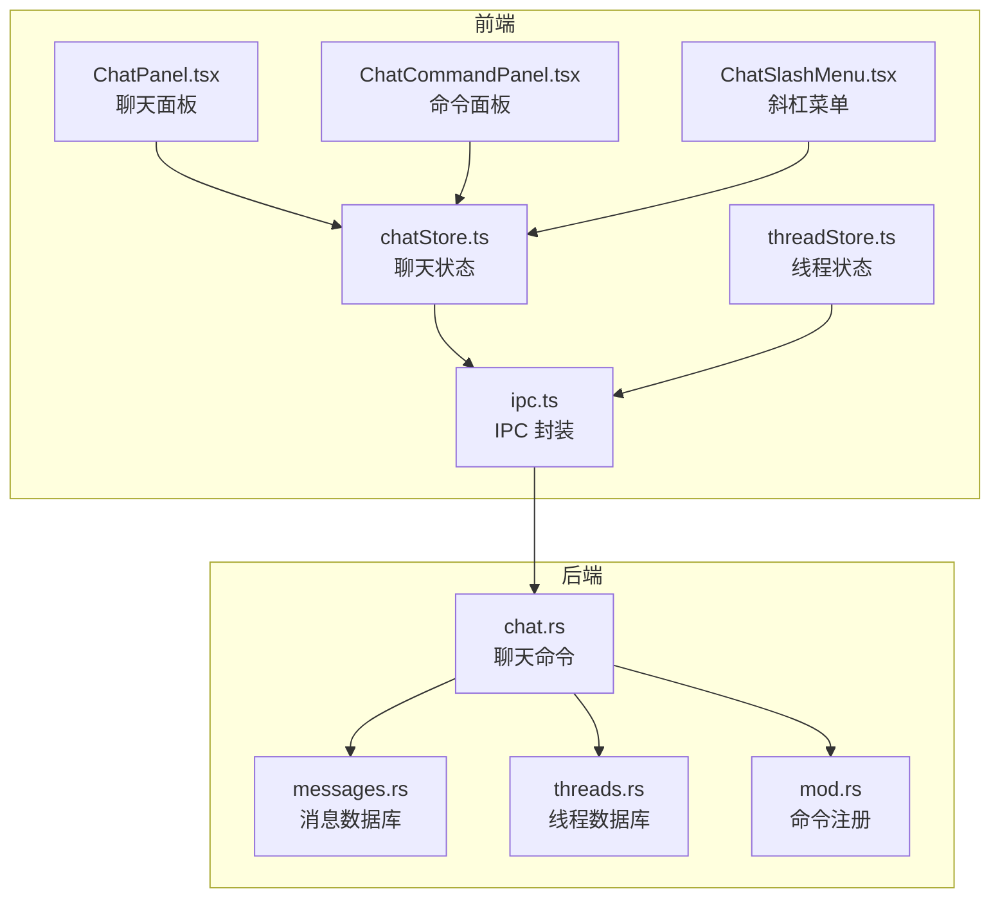
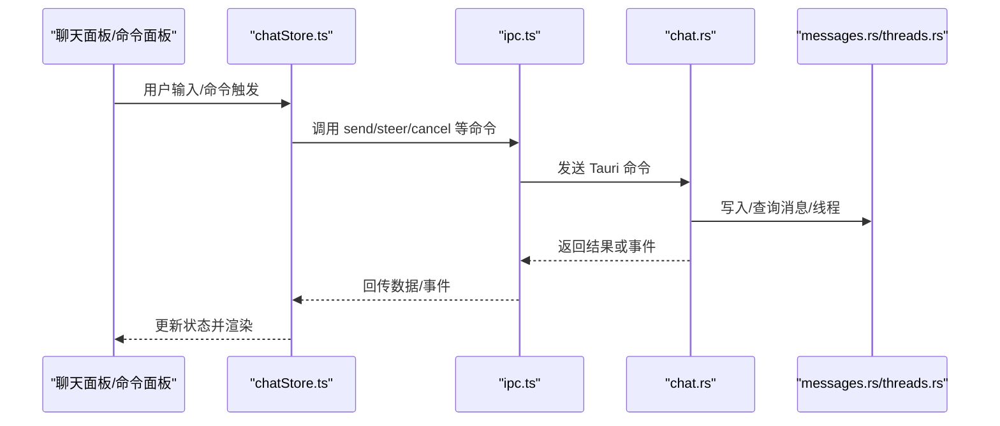
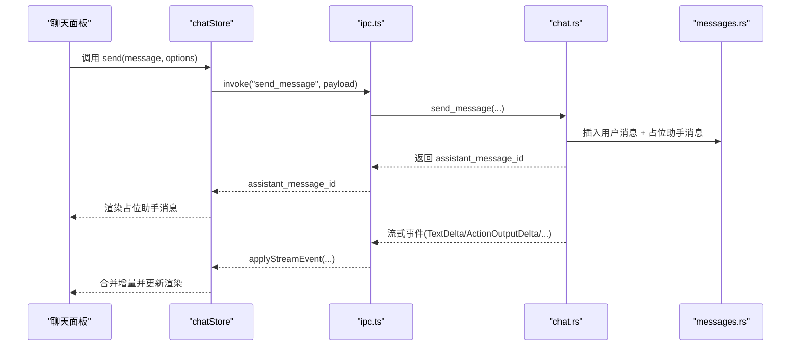
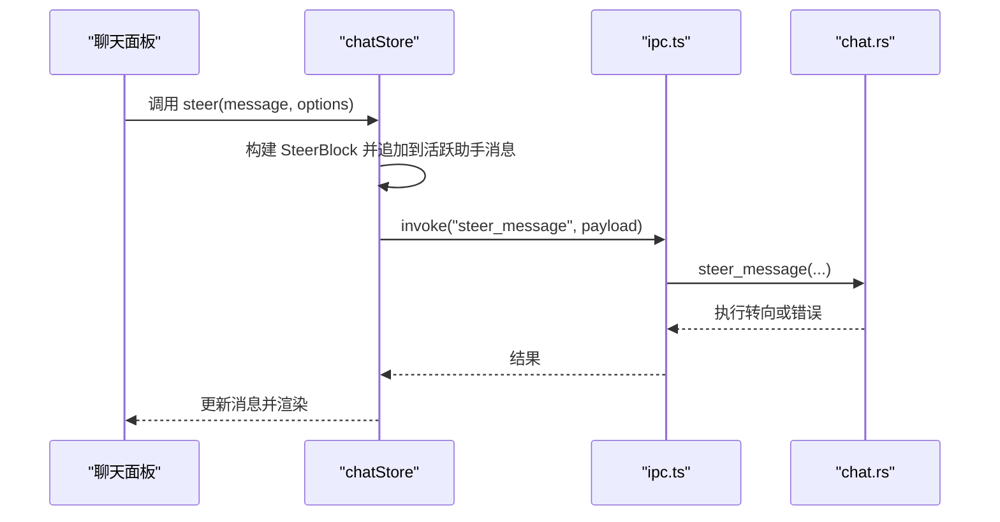
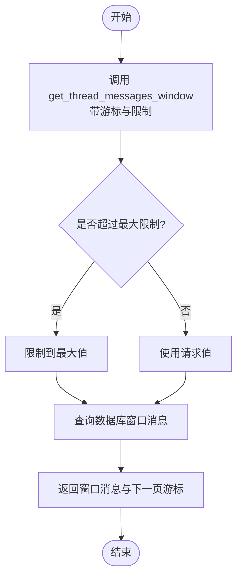
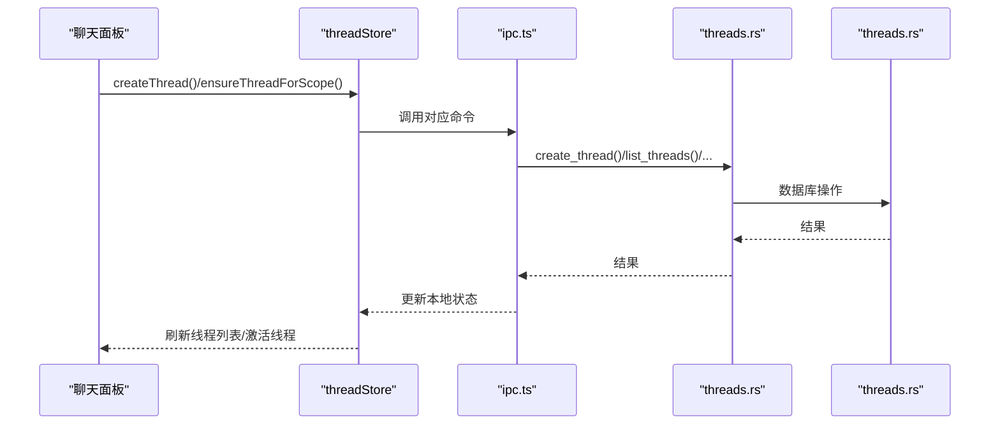
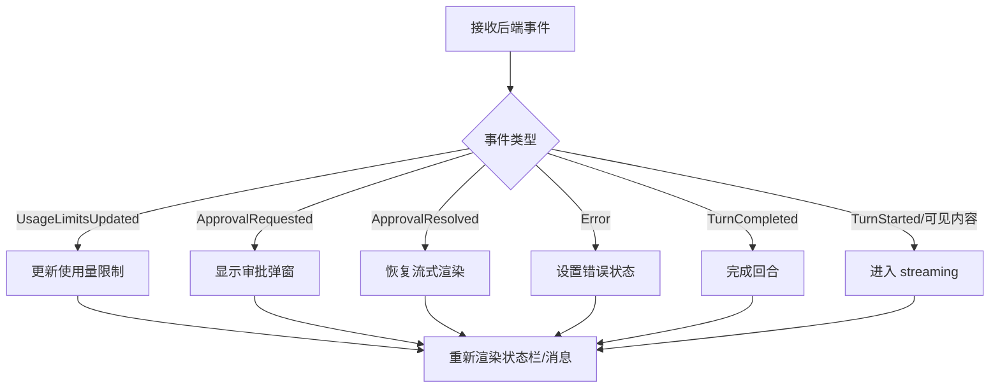
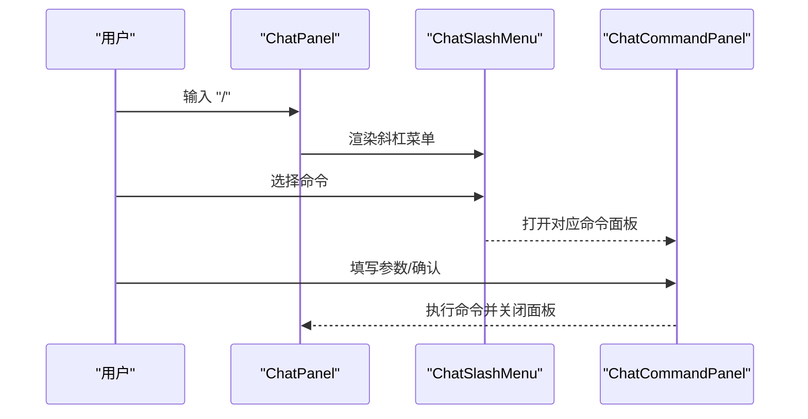
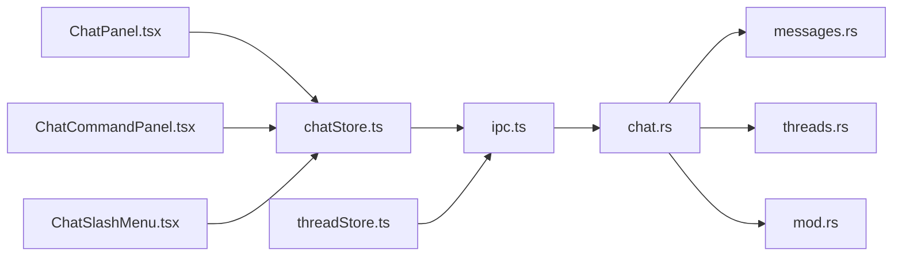

# 聊天命令

<cite>
**本文档引用的文件**
- [chatStore.ts](file://src/stores/chatStore.ts)
- [threadStore.ts](file://src/stores/threadStore.ts)
- [ChatPanel.tsx](file://src/components/chat/ChatPanel.tsx)
- [ChatCommandPanel.tsx](file://src/components/chat/ChatCommandPanel.tsx)
- [ChatSlashMenu.tsx](file://src/components/chat/ChatSlashMenu.tsx)
- [types.ts](file://src/types.ts)
- [chat.rs](file://src-tauri/src/commands/chat.rs)
- [messages.rs](file://src-tauri/src/db/messages.rs)
- [threads.rs](file://src-tauri/src/db/threads.rs)
- [ipc.ts](file://src/lib/ipc.ts)
- [mod.rs](file://src-tauri/src/commands/mod.rs)
</cite>

## 目录
1. [简介](#简介)
2. [项目结构](#项目结构)
3. [核心组件](#核心组件)
4. [架构总览](#架构总览)
5. [详细组件分析](#详细组件分析)
6. [依赖关系分析](#依赖关系分析)
7. [性能考量](#性能考量)
8. [故障排查指南](#故障排查指南)
9. [结论](#结论)

## 简介
本文件系统性梳理聊天命令模块的设计与实现，覆盖消息发送、接收、历史记录管理、会话生命周期、状态同步与实时通信、以及错误恢复机制。目标是帮助开发者快速理解前端 Zustand 状态层与后端 Tauri 命令层之间的协作方式，并掌握如何扩展与维护聊天功能。

## 项目结构
聊天命令模块由三层组成：
- 前端状态与UI层：Zustand 状态存储、聊天面板与命令面板组件
- IPC 层：前端调用后端命令的桥接封装
- 后端命令层：Tauri 命令处理业务逻辑、数据库操作与引擎交互

**图表来源**
- [chatStore.ts](file://src/stores/chatStore.ts)
- [threadStore.ts](file://src/stores/threadStore.ts)
- [ChatPanel.tsx](file://src/components/chat/ChatPanel.tsx)
- [ChatCommandPanel.tsx](file://src/components/chat/ChatCommandPanel.tsx)
- [ChatSlashMenu.tsx](file://src/components/chat/ChatSlashMenu.tsx)
- [ipc.ts](file://src/lib/ipc.ts)
- [chat.rs](file://src-tauri/src/commands/chat.rs)
- [messages.rs](file://src-tauri/src/db/messages.rs)
- [threads.rs](file://src-tauri/src/db/threads.rs)
- [mod.rs](file://src-tauri/src/commands/mod.rs)

**章节来源**
- [chatStore.ts](file://src/stores/chatStore.ts)
- [threadStore.ts](file://src/stores/threadStore.ts)
- [ChatPanel.tsx](file://src/components/chat/ChatPanel.tsx)
- [ChatCommandPanel.tsx](file://src/components/chat/ChatCommandPanel.tsx)
- [ChatSlashMenu.tsx](file://src/components/chat/ChatSlashMenu.tsx)
- [ipc.ts](file://src/lib/ipc.ts)
- [chat.rs](file://src-tauri/src/commands/chat.rs)
- [messages.rs](file://src-tauri/src/db/messages.rs)
- [threads.rs](file://src-tauri/src/db/threads.rs)
- [mod.rs](file://src-tauri/src/commands/mod.rs)

## 核心组件
- 聊天状态存储（chatStore.ts）
  - 维护当前线程 ID、消息列表、游标、加载状态、流式状态、使用量限制、错误信息等
  - 提供发送消息、发送“转向”指令、取消、审批响应、动作输出水合等方法
- 线程状态存储（threadStore.ts）
  - 创建/重命名/确保线程存在、刷新线程列表、归档/恢复线程、Codex/OpenCode 特定操作
- 前端命令面板（ChatCommandPanel.tsx）
  - 支持 /fork、/rollback、/compact、/fast、/personality、/skills、/agents、/commands、/sessions、/mcp、/experimental 等命令
- 斜杠菜单（ChatSlashMenu.tsx）
  - 输入“/”时弹出可用命令列表，支持键盘导航与选择
- 类型定义（types.ts）
  - 定义 Thread、ThreadStatus、Message、ContentBlock 等核心类型

**章节来源**
- [chatStore.ts](file://src/stores/chatStore.ts)
- [threadStore.ts](file://src/stores/threadStore.ts)
- [ChatCommandPanel.tsx](file://src/components/chat/ChatCommandPanel.tsx)
- [ChatSlashMenu.tsx](file://src/components/chat/ChatSlashMenu.tsx)
- [types.ts](file://src/types.ts)

## 架构总览
聊天命令从 UI 到后端的完整链路如下：

**图表来源**
- [ChatPanel.tsx](file://src/components/chat/ChatPanel.tsx)
- [chatStore.ts](file://src/stores/chatStore.ts)
- [ipc.ts](file://src/lib/ipc.ts)
- [chat.rs](file://src-tauri/src/commands/chat.rs)
- [messages.rs](file://src-tauri/src/db/messages.rs)
- [threads.rs](file://src-tauri/src/db/threads.rs)

## 详细组件分析

### 消息发送与流式渲染
- 前端行为
  - 通过 chatStore.send 构造用户消息块（文本、附件、技能、提及），插入本地消息列表并标记为完成
  - 同时插入一个占位的“助手消息”，状态为 streaming
  - 通过 IPC 调用后端 send_message，等待返回助手消息 ID
- 后端行为
  - 校验线程状态与附件合法性，解析推理努力度、模型切换等元数据
  - 初始化引擎线程、写入用户消息与占位助手消息，更新线程状态为 streaming
  - 异步运行一次对话回合，按事件流推送内容到前端
- 实时同步
  - chatStore.applyStreamEvent 将后端事件合并到本地消息队列，支持文本增量、思考增量、动作输出、差异更新、使用量限制等
  - 使用事件队列合并策略减少渲染抖动

**图表来源**
- [chatStore.ts](file://src/stores/chatStore.ts)
- [ipc.ts](file://src/lib/ipc.ts)
- [chat.rs](file://src-tauri/src/commands/chat.rs)
- [messages.rs](file://src-tauri/src/db/messages.rs)

**章节来源**
- [chatStore.ts](file://src/stores/chatStore.ts)
- [chat.rs](file://src-tauri/src/commands/chat.rs)
- [messages.rs](file://src-tauri/src/db/messages.rs)

### “转向”指令（Mid-turn Steering）
- 前端行为
  - 通过 chatStore.steer 构建 SteerBlock 并追加到当前活跃的助手消息上，同时调用 IPC steer_message
- 后端行为
  - 校验是否存在活动回合、是否为 Codex 线程，然后调用引擎的 turn/steer 接口
- 错误处理
  - 若无活动回合或非 Codex 线程，返回明确错误提示

**图表来源**
- [chatStore.ts](file://src/stores/chatStore.ts)
- [ipc.ts](file://src/lib/ipc.ts)
- [chat.rs](file://src-tauri/src/commands/chat.rs)

**章节来源**
- [chatStore.ts](file://src/stores/chatStore.ts)
- [chat.rs](file://src-tauri/src/commands/chat.rs)

### 历史记录管理
- 获取全部消息
  - get_thread_messages：返回整条线程的所有消息
- 分页窗口消息
  - get_thread_messages_window：支持游标分页，限制最大窗口大小
- 动作输出水合
  - get_action_output：按消息与动作 ID 获取输出片段，用于在 UI 中展开查看
- 搜索消息
  - search_messages：基于工作区进行全文检索

**图表来源**
- [chat.rs](file://src-tauri/src/commands/chat.rs)
- [messages.rs](file://src-tauri/src/db/messages.rs)

**章节来源**
- [chat.rs](file://src-tauri/src/commands/chat.rs)
- [messages.rs](file://src-tauri/src/db/messages.rs)

### 会话生命周期（创建/维护/销毁）
- 创建线程
  - threadStore.createThread：调用后端 create_thread，写入初始状态并设置为活跃线程
- 确保线程存在
  - threadStore.ensureThreadForScope：按作用域查找或创建线程，自动选择最近活动或匹配模型的线程
- 刷新线程列表
  - threadStore.refreshThreads/refreshAllThreads：从后端拉取最新线程列表并合并到本地
- 归档/恢复/删除
  - 归档：archiveThread → 移动到归档集合
  - 恢复：restoreThread → 从归档恢复
  - 删除：delete_thread（物理删除）

**图表来源**
- [threadStore.ts](file://src/stores/threadStore.ts)
- [ipc.ts](file://src/lib/ipc.ts)
- [threads.rs](file://src-tauri/src/db/threads.rs)

**章节来源**
- [threadStore.ts](file://src/stores/threadStore.ts)
- [threads.rs](file://src-tauri/src/db/threads.rs)

### 状态同步与实时通信
- 线程状态
  - ThreadStatus：idle/streaming/awaiting_approval/error/completed
  - chatStore.applyRuntimeStateFromEvent 根据事件类型转换状态
- 流式事件合并
  - chatStore.enqueueStreamEvent 对连续事件进行合并（如 TextDelta、ActionOutputDelta、DiffUpdated 等）
- 使用量限制
  - 当收到 UsageLimitsUpdated 事件时，更新上下文使用百分比与重置时间
- 审批与权限
  - ApprovalRequested/ApprovalResolved 事件驱动 UI 显示审批弹窗
  - chatStore.resolveApprovalDecision 将用户决策标准化为统一格式

**图表来源**
- [chatStore.ts](file://src/stores/chatStore.ts)
- [types.ts](file://src/types.ts)

**章节来源**
- [chatStore.ts](file://src/stores/chatStore.ts)
- [types.ts](file://src/types.ts)

### 聊天命令面板与斜杠菜单
- ChatSlashMenu
  - 输入“/”时展示命令列表，支持键盘上下移动与点击选择
- ChatCommandPanel
  - 针对不同命令类型渲染专用面板（如回滚、个性、技能、代理、会话、MCP、实验特性等）
  - 提供确认/取消、搜索过滤、分页加载等交互

**图表来源**
- [ChatPanel.tsx](file://src/components/chat/ChatPanel.tsx)
- [ChatSlashMenu.tsx](file://src/components/chat/ChatSlashMenu.tsx)
- [ChatCommandPanel.tsx](file://src/components/chat/ChatCommandPanel.tsx)

**章节来源**
- [ChatSlashMenu.tsx](file://src/components/chat/ChatSlashMenu.tsx)
- [ChatCommandPanel.tsx](file://src/components/chat/ChatCommandPanel.tsx)
- [ChatPanel.tsx](file://src/components/chat/ChatPanel.tsx)

## 依赖关系分析
- 前端依赖
  - chatStore 依赖 ipc.ts 进行命令调用，依赖 threadStore 与 engineStore 等进行运行时信息整合
  - ChatPanel/ChatCommandPanel/ChatSlashMenu 依赖 chatStore 与 threadStore 的状态
- 后端依赖
  - chat.rs 依赖数据库模块（messages.rs/threads.rs）、引擎模块、状态管理模块
  - 命令注册位于 mod.rs，集中导出各模块命令

**图表来源**
- [chatStore.ts](file://src/stores/chatStore.ts)
- [threadStore.ts](file://src/stores/threadStore.ts)
- [ChatPanel.tsx](file://src/components/chat/ChatPanel.tsx)
- [ChatCommandPanel.tsx](file://src/components/chat/ChatCommandPanel.tsx)
- [ChatSlashMenu.tsx](file://src/components/chat/ChatSlashMenu.tsx)
- [ipc.ts](file://src/lib/ipc.ts)
- [chat.rs](file://src-tauri/src/commands/chat.rs)
- [messages.rs](file://src-tauri/src/db/messages.rs)
- [threads.rs](file://src-tauri/src/db/threads.rs)
- [mod.rs](file://src-tauri/src/commands/mod.rs)

**章节来源**
- [mod.rs](file://src-tauri/src/commands/mod.rs)

## 性能考量
- 事件合并与节流
  - 文本/思考增量、动作输出、进度与差异更新采用队列合并策略，降低频繁渲染成本
- 水合窗口与懒加载
  - 仅对最近若干消息进行全量水合，远端消息采用懒加载与游标分页
- 附件与输出裁剪
  - 动作输出最大字符数与块数量限制，超出时进行截断与压缩
- 线程状态缓存
  - 后端对引擎线程与沙箱策略进行缓存，避免重复初始化

[本节为通用指导，无需特定文件引用]

## 故障排查指南
- 常见错误与恢复
  - 已有活动回合：当线程已有正在运行的回合时，发送消息会被拒绝。需先调用取消命令或等待完成
  - 非 Codex 线程转向：steer_message 仅支持 Codex 线程
  - 外部沙箱模式：在 Codex 使用外部沙箱时，某些沙箱覆盖不可用，需清除覆盖或切换本地沙箱
  - 附件过大/不支持类型：粘贴图片大小超限或类型不受支持时会报错
- 状态异常
  - 线程状态卡在 streaming：检查后端事件流是否正常，必要时取消并重试
  - 使用量限制未更新：确认后端是否推送 UsageLimitsUpdated 事件
- 日志与诊断
  - 后端命令层使用日志记录关键路径，前端可通过错误字段查看具体原因

**章节来源**
- [chat.rs](file://src-tauri/src/commands/chat.rs)
- [chatStore.ts](file://src/stores/chatStore.ts)

## 结论
聊天命令模块以清晰的前后端分层实现了完整的消息生命周期管理：从 UI 输入、状态同步、事件流式渲染，到数据库持久化与引擎交互。通过命令面板与斜杠菜单，用户可以便捷地执行多种高级操作。建议在扩展新功能时遵循现有事件合并与状态机设计，确保一致的用户体验与可维护性。