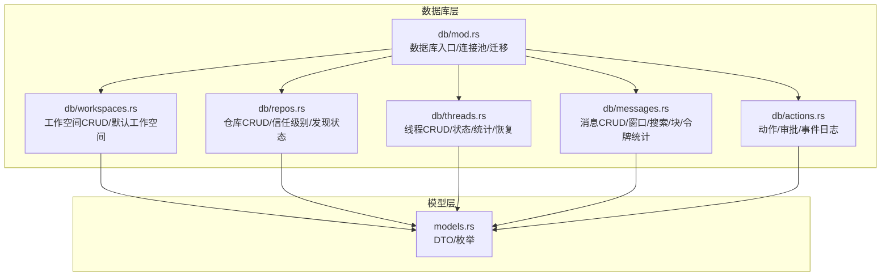
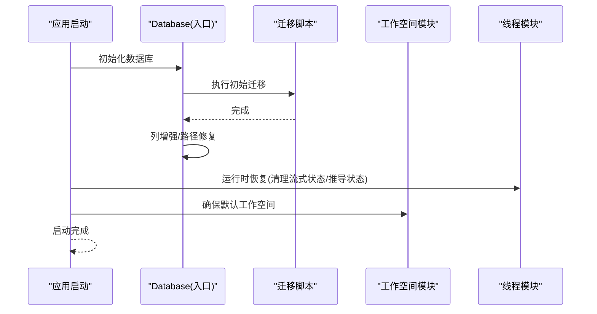
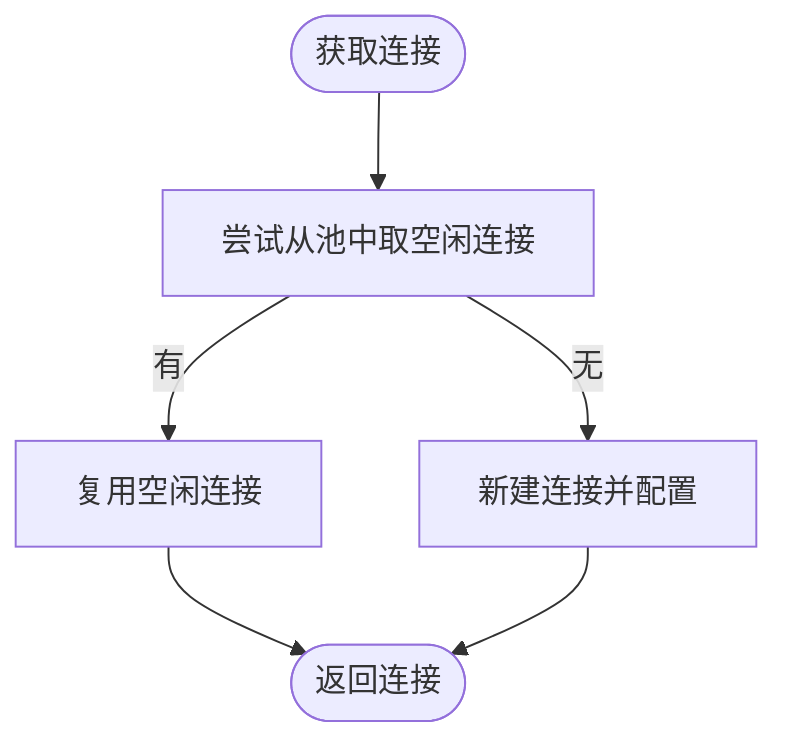
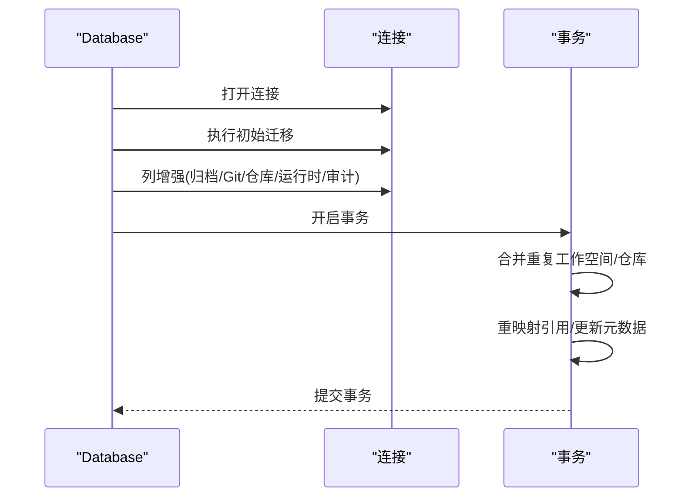
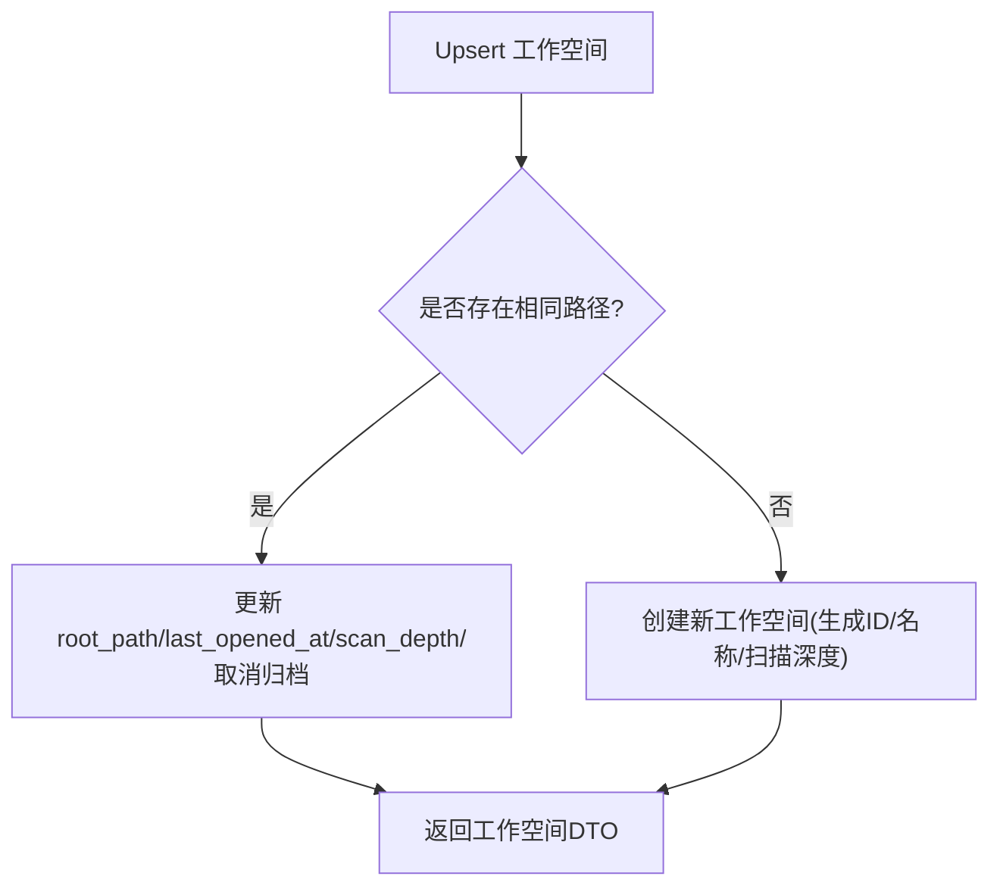
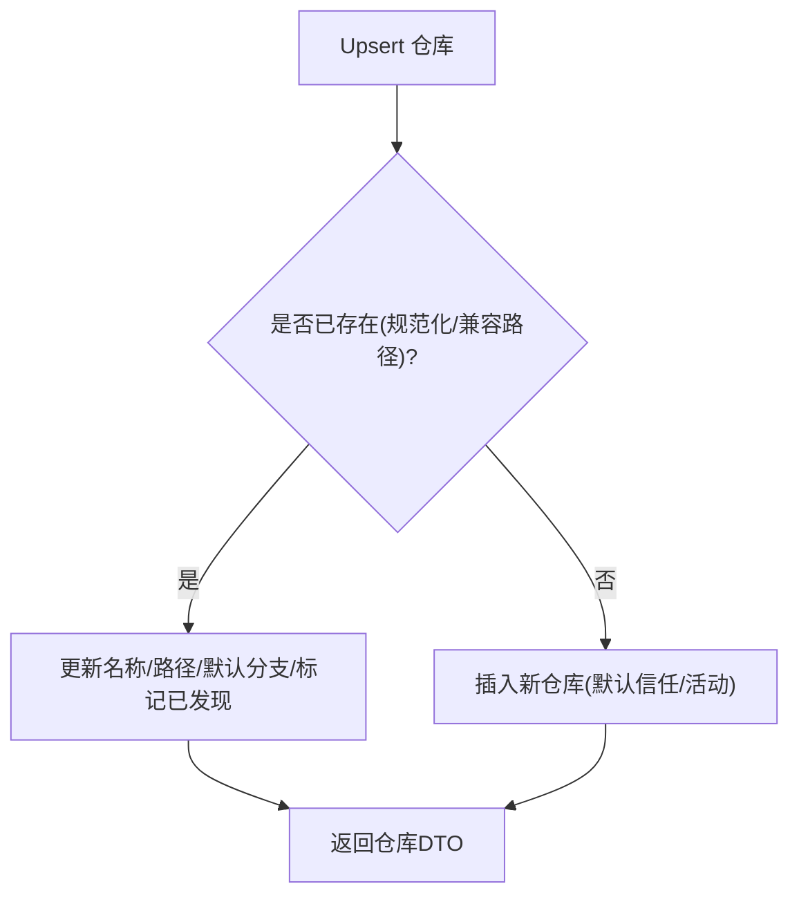
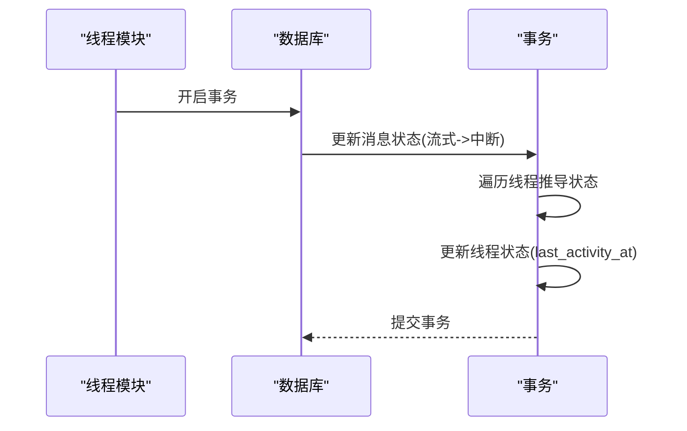
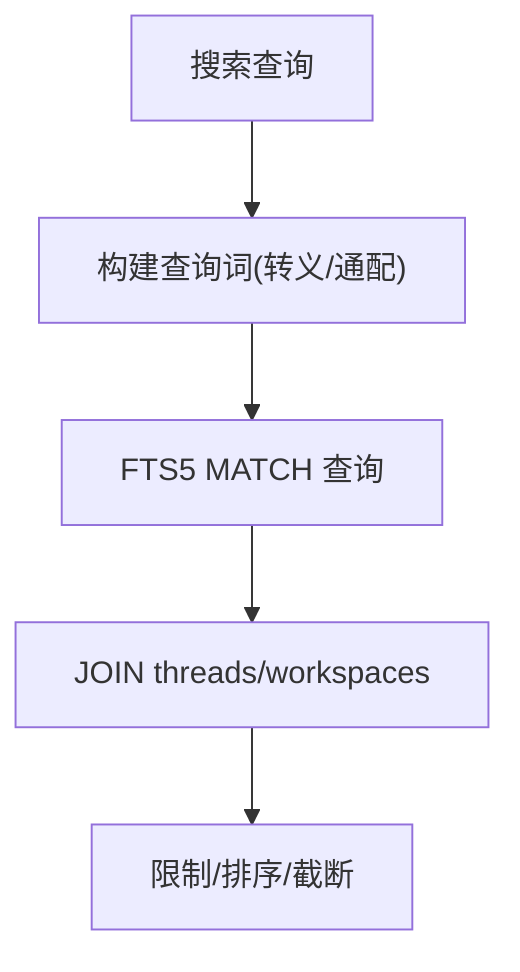
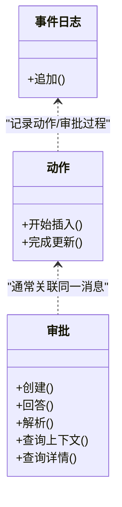
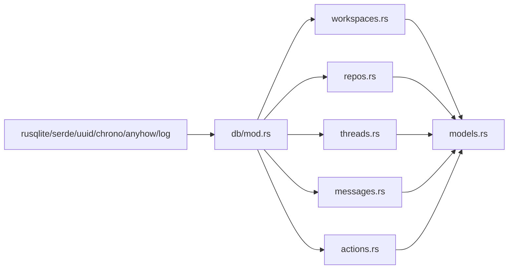

# 数据库 API

<cite>
**本文引用的文件**
- [src-tauri/src/db/mod.rs](file://src-tauri/src/db/mod.rs)
- [src-tauri/src/db/migrations/001_initial.sql](file://src-tauri/src/db/migrations/001_initial.sql)
- [src-tauri/src/db/workspaces.rs](file://src-tauri/src/db/workspaces.rs)
- [src-tauri/src/db/threads.rs](file://src-tauri/src/db/threads.rs)
- [src-tauri/src/db/messages.rs](file://src-tauri/src/db/messages.rs)
- [src-tauri/src/db/actions.rs](file://src-tauri/src/db/actions.rs)
- [src-tauri/src/db/repos.rs](file://src-tauri/src/db/repos.rs)
- [src-tauri/src/models.rs](file://src-tauri/src/models.rs)
- [src-tauri/src/lib.rs](file://src-tauri/src/lib.rs)
- [src-tauri/Cargo.toml](file://src-tauri/Cargo.toml)
</cite>

## 目录
1. [简介](#简介)
2. [项目结构](#项目结构)
3. [核心组件](#核心组件)
4. [架构总览](#架构总览)
5. [详细组件分析](#详细组件分析)
6. [依赖关系分析](#依赖关系分析)
7. [性能考量](#性能考量)
8. [故障排查指南](#故障排查指南)
9. [结论](#结论)
10. [附录](#附录)

## 简介
本文件系统化梳理 Panes 应用的数据库 API，覆盖 SQLite 数据库的表结构、查询接口与数据操作方法，重点说明工作空间、对话线程、消息、仓库与动作等核心数据模型；同时阐述数据库连接管理、事务处理、查询优化、迁移机制与数据完整性约束，并提供 CRUD 示例、复杂查询与批量操作的实现思路，以及稳定性与可扩展性建议。

## 项目结构
数据库层采用模块化设计，按领域划分模块：工作空间、仓库、线程、消息、动作（含审批与引擎事件日志）。入口模块负责数据库初始化、连接池与迁移执行；各领域模块提供 CRUD 与业务查询接口；模型模块定义 DTO 与枚举类型，用于前后端交互。



图示来源
- [src-tauri/src/db/mod.rs:1-150](file://src-tauri/src/db/mod.rs#L1-L150)
- [src-tauri/src/db/workspaces.rs:1-120](file://src-tauri/src/db/workspaces.rs#L1-L120)
- [src-tauri/src/db/repos.rs:1-120](file://src-tauri/src/db/repos.rs#L1-L120)
- [src-tauri/src/db/threads.rs:1-120](file://src-tauri/src/db/threads.rs#L1-L120)
- [src-tauri/src/db/messages.rs:1-120](file://src-tauri/src/db/messages.rs#L1-L120)
- [src-tauri/src/db/actions.rs:1-60](file://src-tauri/src/db/actions.rs#L1-L60)
- [src-tauri/src/models.rs:1-120](file://src-tauri/src/models.rs#L1-L120)

章节来源
- [src-tauri/src/db/mod.rs:1-150](file://src-tauri/src/db/mod.rs#L1-L150)
- [src-tauri/src/db/migrations/001_initial.sql:1-132](file://src-tauri/src/db/migrations/001_initial.sql#L1-L132)
- [src-tauri/src/models.rs:1-120](file://src-tauri/src/models.rs#L1-L120)

## 核心组件
- 数据库入口与连接池
  - 初始化与迁移：在应用启动时初始化数据库目录、打开数据库并执行迁移脚本，随后进行列增强与路径修复。
  - 连接池：支持最大空闲连接数，连接复用与自动回收。
  - 配置项：启用外键、WAL 模式、同步等级、内存临时存储、忙等待超时。
- 工作空间模块
  - Upsert、列表、归档/恢复、删除、启动预设 JSON 存取、Git 选择配置标记。
- 仓库模块
  - Upsert、发现状态维护、信任级别设置、活动仓库集合设置、包含路径查找。
- 线程模块
  - 创建、查询、列表、归档/恢复、删除、状态更新、引擎线程 ID 绑定、元数据更新、消息计数与令牌统计、运行时恢复。
- 消息模块
  - 用户/助手消息插入、占位符、完成、块更新、令牌统计、消息窗口分页、全文检索、动作输出提取、审批块合并。
- 动作/审批/事件日志
  - 动作开始/完成、审批创建/回答/解析、事件日志追加。

章节来源
- [src-tauri/src/db/mod.rs:74-150](file://src-tauri/src/db/mod.rs#L74-L150)
- [src-tauri/src/db/workspaces.rs:15-120](file://src-tauri/src/db/workspaces.rs#L15-L120)
- [src-tauri/src/db/repos.rs:12-120](file://src-tauri/src/db/repos.rs#L12-L120)
- [src-tauri/src/db/threads.rs:15-120](file://src-tauri/src/db/threads.rs#L15-L120)
- [src-tauri/src/db/messages.rs:30-120](file://src-tauri/src/db/messages.rs#L30-L120)
- [src-tauri/src/db/actions.rs:9-60](file://src-tauri/src/db/actions.rs#L9-L60)

## 架构总览
数据库层通过入口模块统一管理连接与迁移，各领域模块封装具体业务逻辑；模型模块提供跨层的数据传输对象与枚举。应用启动时执行运行时恢复（清理过期流式状态、推导线程状态），并确保默认工作空间存在。



图示来源
- [src-tauri/src/lib.rs:49-84](file://src-tauri/src/lib.rs#L49-L84)
- [src-tauri/src/db/mod.rs:122-135](file://src-tauri/src/db/mod.rs#L122-L135)
- [src-tauri/src/db/threads.rs:314-367](file://src-tauri/src/db/threads.rs#L314-L367)

章节来源
- [src-tauri/src/lib.rs:49-84](file://src-tauri/src/lib.rs#L49-L84)
- [src-tauri/src/db/mod.rs:122-135](file://src-tauri/src/db/mod.rs#L122-L135)

## 详细组件分析

### 表结构与数据模型
- 工作空间（workspaces）
  - 主键 id，名称 name，根路径 root_path 唯一，扫描深度 scan_depth，默认 3；启动预设 JSON 及更新时间；归档时间 archived_at；创建/最近打开时间 created_at/last_opened_at。
- 仓库（repos）
  - 外键 workspace_id，名称 name，路径 path，主分支 default_branch，默认 main；is_active/is_discovered 标记；信任级别 trust_level 默认 standard；唯一约束 (workspace_id, path)。
- 线程（threads）
  - 外键 workspace_id/repo_id；引擎标识 engine_id/model_id；远程引擎线程 ID engine_thread_id；元数据 engine_metadata_json；标题 title；状态 status 默认 idle；归档时间 archived_at；消息计数 message_count、总令牌 total_tokens；创建/最后活跃时间。
- 消息（messages）
  - 外键 thread_id；角色 role；内容 content；块 blocks_json；转换单元标记 turn_engine_id/turn_model_id/turn_reasoning_effort；schema_version 默认 1；流序列 stream_seq 默认 0；状态 status 默认 completed；输入/输出令牌 token_input/token_output；创建时间。
- 动作（actions）
  - 外键 thread_id/message_id；引擎动作 ID engine_action_id；动作类型 action_type；摘要 summary；详情 details_json；状态 status 默认 running；截断标记 truncated；结果 result_json；耗时 duration_ms。
- 审批（approvals）
  - 外键 thread_id/message_id；动作类型 action_type；摘要 summary；详情 details_json；状态 status 默认 pending；决策 decision；创建时间 answered_at。
- 引擎事件日志（engine_event_logs）
  - 自增主键；外键 thread_id/message_id；事件 JSON；创建时间。

```mermaid
erDiagram
WORKSPACES {
text id PK
text name
text root_path UK
integer scan_depth
text startup_preset_json
text startup_preset_updated_at
text archived_at
text created_at
text last_opened_at
}
REPOS {
text id PK
text workspace_id FK
text name
text path
text default_branch
integer is_active
integer is_discovered
text trust_level
unique uk_ws_path (workspace_id, path)
}
THREADS {
text id PK
text workspace_id FK
text repo_id FK
text engine_id
text model_id
text engine_thread_id
text engine_metadata_json
text title
text status
text archived_at
integer message_count
integer total_tokens
text created_at
text last_activity_at
}
MESSAGES {
text id PK
text thread_id FK
text role
text content
text blocks_json
text turn_engine_id
text turn_model_id
text turn_reasoning_effort
integer schema_version
integer stream_seq
text status
integer token_input
integer token_output
text created_at
}
ACTIONS {
text id PK
text thread_id FK
text message_id FK
text engine_action_id
text action_type
text summary
text details_json
text status
integer truncated
text result_json
integer duration_ms
}
APPROVALS {
text id PK
text thread_id FK
text message_id FK
text action_type
text summary
text details_json
text status
text decision
text created_at
text answered_at
}
ENGINE_EVENT_LOGS {
integer id PK
text thread_id FK
text message_id FK
text created_at
text event_json
}
WORKSPACES ||--o{ REPOS : "拥有"
WORKSPACES ||--o{ THREADS : "拥有"
THREADS ||--o{ MESSAGES : "拥有"
THREADS ||--o{ ACTIONS : "拥有"
THREADS ||--o{ APPROVALS : "拥有"
THREADS ||--o{ ENGINE_EVENT_LOGS : "拥有"
MESSAGES ||--o{ ACTIONS : "关联"
MESSAGES ||--o{ APPROVALS : "关联"
```

图示来源
- [src-tauri/src/db/migrations/001_initial.sql:1-132](file://src-tauri/src/db/migrations/001_initial.sql#L1-L132)

章节来源
- [src-tauri/src/db/migrations/001_initial.sql:1-132](file://src-tauri/src/db/migrations/001_initial.sql#L1-L132)

### 数据库连接管理与事务
- 连接池
  - 最大空闲连接数 SQLITE_POOL_MAX_IDLE；从池中取出或新建连接；连接关闭时放回池中，超过上限则丢弃。
- 连接配置
  - 开启外键约束、WAL 日志模式、同步等级 NORMAL、临时存储 MEMORY、忙等待超时。
- 事务
  - 路径修复、线程消息克隆/导入、审批解析、运行时恢复等均使用显式事务保证一致性。



图示来源
- [src-tauri/src/db/mod.rs:98-121](file://src-tauri/src/db/mod.rs#L98-L121)
- [src-tauri/src/db/mod.rs:137-149](file://src-tauri/src/db/mod.rs#L137-L149)

章节来源
- [src-tauri/src/db/mod.rs:98-149](file://src-tauri/src/db/mod.rs#L98-L149)

### 迁移机制与列增强
- 初始迁移
  - 执行 001_initial.sql，创建所有表与索引、FTS 虚表及触发器。
- 列增强
  - 确保归档时间列、Git 选择配置列、仓库发现列、运行时列（引擎能力、流序列、截断）、消息审计列（引擎/模型/推理努力）存在并补齐。
- 路径修复
  - 合并重复工作空间/仓库（规范化 Windows 路径），重映射引用，更新元数据。



图示来源
- [src-tauri/src/db/mod.rs:122-135](file://src-tauri/src/db/mod.rs#L122-L135)
- [src-tauri/src/db/mod.rs:151-225](file://src-tauri/src/db/mod.rs#L151-L225)
- [src-tauri/src/db/mod.rs:253-262](file://src-tauri/src/db/mod.rs#L253-L262)

章节来源
- [src-tauri/src/db/mod.rs:122-225](file://src-tauri/src/db/mod.rs#L122-L225)

### 工作空间模块（CRUD 与查询）
- Upsert 工作空间
  - 规范化/兼容旧版 Windows 路径；若存在则更新最近打开时间与扫描深度并取消归档；否则创建新工作空间。
- 列表与归档
  - 活跃/归档列表，按最近打开时间排序。
- 删除/归档/恢复
  - 删除前检查存在性；归档/恢复基于 archived_at 字段。
- 启动预设
  - 读写启动预设 JSON 及更新时间。
- Git 选择配置
  - 读写 Git 仓库选择配置标记。



图示来源
- [src-tauri/src/db/workspaces.rs:15-58](file://src-tauri/src/db/workspaces.rs#L15-L58)

章节来源
- [src-tauri/src/db/workspaces.rs:15-120](file://src-tauri/src/db/workspaces.rs#L15-L120)

### 仓库模块（CRUD 与发现）
- Upsert 仓库
  - 规范化路径；若存在则更新名称/路径/默认分支并标记为已发现；否则插入新仓库。
- 发现状态维护
  - 扫描后重置所有仓库为已发现，对未出现的路径标记为未发现。
- 信任级别与活动状态
  - 单个/批量设置信任级别与活动仓库集合。
- 包含路径查找
  - 在给定工作空间内查找最深匹配的仓库。



图示来源
- [src-tauri/src/db/repos.rs:12-80](file://src-tauri/src/db/repos.rs#L12-L80)

章节来源
- [src-tauri/src/db/repos.rs:12-220](file://src-tauri/src/db/repos.rs#L12-L220)

### 线程模块（CRUD 与运行时）
- 创建/查询/列表
  - 支持按工作空间列出活跃线程（排除仅远程且无消息的历史）。
- 归档/恢复/删除
  - 基于 archived_at 字段控制。
- 状态与元数据
  - 更新状态(last_activity_at)、引擎线程 ID、引擎元数据。
- 计数与令牌统计
  - 增量更新 message_count/total_tokens；可重新计算统计并回填。
- 运行时恢复
  - 将过期流式助手消息标记为中断；根据审批与最新消息推导线程状态。



图示来源
- [src-tauri/src/db/threads.rs:314-367](file://src-tauri/src/db/threads.rs#L314-L367)

章节来源
- [src-tauri/src/db/threads.rs:15-280](file://src-tauri/src/db/threads.rs#L15-L280)

### 消息模块（CRUD、窗口、搜索、块与令牌）
- 插入
  - 用户消息直接完成；助手消息以占位符形式插入，后续更新块与状态。
- 完成与块更新
  - 更新块 JSON、状态、模型 ID；可更新令牌统计。
- 窗口分页
  - 基于 created_at/id/rowid 的复合游标实现翻页。
- 全文检索
  - 使用 FTS5 虚拟表与触发器；支持短语、前缀通配、大小写不敏感匹配与片段高亮。
- 批量操作
  - 克隆线程消息历史；替换线程消息历史；回滚指定轮次（按用户消息边界）。



图示来源
- [src-tauri/src/db/messages.rs:637-682](file://src-tauri/src/db/messages.rs#L637-L682)
- [src-tauri/src/db/migrations/001_initial.sql:108-131](file://src-tauri/src/db/migrations/001_initial.sql#L108-L131)

章节来源
- [src-tauri/src/db/messages.rs:30-120](file://src-tauri/src/db/messages.rs#L30-L120)
- [src-tauri/src/db/messages.rs:376-476](file://src-tauri/src/db/messages.rs#L376-L476)
- [src-tauri/src/db/messages.rs:637-795](file://src-tauri/src/db/messages.rs#L637-L795)

### 动作/审批/事件日志（协作与审计）
- 动作
  - 开始插入(OR REPLACE)；完成后更新状态/结果/耗时。
- 审批
  - 创建为待决；回答/解析；查询上下文与详情。
- 事件日志
  - 追加引擎事件 JSON。



图示来源
- [src-tauri/src/db/actions.rs:9-187](file://src-tauri/src/db/actions.rs#L9-L187)

章节来源
- [src-tauri/src/db/actions.rs:9-187](file://src-tauri/src/db/actions.rs#L9-L187)

### 数据完整性约束与索引策略
- 外键约束
  - threads/repo_id 可为空（允许解绑仓库）；其余均受外键保护。
- 唯一约束
  - (workspace_id, path) 保证工作空间内仓库路径唯一。
- 索引
  - repos/workspace_id、threads/workspace_id、threads/repo_id、threads/activity、threads/workspace/status/activity、messages/thread+created、actions/approvals/thread+created、approvals/message+status 等，覆盖常见过滤与排序场景。
- FTS5
  - messages_fts 虚拟表，自动维护，支持高效全文检索。

章节来源
- [src-tauri/src/db/migrations/001_initial.sql:1-132](file://src-tauri/src/db/migrations/001_initial.sql#L1-L132)

### 查询接口与复杂查询示例
- 列表与筛选
  - 按工作空间列出线程（排除仅远程且无消息）；按最近活跃降序。
- 分页窗口
  - 基于游标（created_at/id/rowid）的上一页/下一页导航。
- 全文检索
  - 输入查询词，构建 FTS5 查询，返回线程/仓库/消息片段。
- 批量操作
  - 克隆/替换线程消息历史；按用户消息轮次回滚。

章节来源
- [src-tauri/src/db/threads.rs:68-124](file://src-tauri/src/db/threads.rs#L68-L124)
- [src-tauri/src/db/messages.rs:397-476](file://src-tauri/src/db/messages.rs#L397-L476)
- [src-tauri/src/db/messages.rs:79-194](file://src-tauri/src/db/messages.rs#L79-L194)

### 性能调优与优化建议
- 连接与事务
  - 使用连接池减少连接开销；长事务拆分为小事务，避免长时间持有锁。
- 索引与查询
  - 针对高频过滤字段建立复合索引；避免 SELECT *，只取必要列。
- FTS5
  - 合理使用短语与通配，避免过于宽泛的前缀匹配导致全表扫描。
- 批量写入
  - 使用事务包裹批量插入/更新；分批处理大数据集（如回滚按 500 条切片）。
- WAL 与同步
  - WAL 模式提升并发读写；根据可靠性需求调整同步等级。

章节来源
- [src-tauri/src/db/mod.rs:137-149](file://src-tauri/src/db/mod.rs#L137-L149)
- [src-tauri/src/db/messages.rs:227-270](file://src-tauri/src/db/messages.rs#L227-L270)

## 依赖关系分析
- 外部依赖
  - rusqlite 用于 SQLite 访问；uuid 生成主键；serde/serde_json 用于序列化；chrono 用于时间戳；anyhow/log 用于错误处理与日志。
- 内部模块耦合
  - 各领域模块依赖入口模块提供的连接；模型模块被各领域模块共享；动作/审批模块与消息块合并逻辑紧密耦合。



图示来源
- [src-tauri/Cargo.toml:40-46](file://src-tauri/Cargo.toml#L40-L46)
- [src-tauri/src/db/mod.rs:1-20](file://src-tauri/src/db/mod.rs#L1-L20)

章节来源
- [src-tauri/Cargo.toml:1-67](file://src-tauri/Cargo.toml#L1-L67)
- [src-tauri/src/db/mod.rs:1-20](file://src-tauri/src/db/mod.rs#L1-L20)

## 性能考量
- 连接池与忙等待
  - 通过 busy_timeout 降低锁竞争失败概率；合理设置最大空闲连接数。
- 查询计划
  - 使用 EXPLAIN QUERY PLAN 分析慢查询；优先命中索引；避免函数作用于索引列。
- 写入放大
  - 批量写入使用事务；FTS 触发器会带来额外写入成本，需权衡搜索频率与写入代价。
- 缓存与去重
  - 路径修复与去重逻辑在迁移阶段集中执行，避免运行时重复扫描。

## 故障排查指南
- 迁移失败
  - 检查迁移脚本执行日志；确认列增强步骤（如审计列）是否成功。
- 连接问题
  - 查看 busy_timeout 是否过短；确认 WAL 模式与同步等级配置。
- 数据不一致
  - 关注事务边界；运行时恢复是否成功；FTS 触发器是否正常。
- 搜索异常
  - 检查查询词转义与通配；确认 FTS5 虚拟表与触发器存在。

章节来源
- [src-tauri/src/db/mod.rs:122-135](file://src-tauri/src/db/mod.rs#L122-L135)
- [src-tauri/src/db/messages.rs:637-682](file://src-tauri/src/db/messages.rs#L637-L682)

## 结论
该数据库 API 以清晰的模块化设计与完善的迁移/事务机制为基础，围绕工作空间、仓库、线程、消息与动作构建了完整的对话与协作数据模型。通过连接池、索引与 FTS5 检索，满足日常查询与搜索需求；运行时恢复保障了应用重启后的数据一致性。建议在生产环境中持续监控慢查询与 WAL 写入压力，结合业务场景进一步优化索引与批量操作策略。

## 附录
- 启动流程要点
  - 初始化数据库 → 执行迁移 → 列增强/路径修复 → 运行时恢复 → 确保默认工作空间。
- 常用 SQL 片段路径
  - [初始迁移脚本:1-132](file://src-tauri/src/db/migrations/001_initial.sql#L1-L132)
  - [FTS 触发器与虚拟表:108-131](file://src-tauri/src/db/migrations/001_initial.sql#L108-L131)
- 模型定义
  - [DTO 与枚举:1-250](file://src-tauri/src/models.rs#L1-L250)

章节来源
- [src-tauri/src/lib.rs:49-84](file://src-tauri/src/lib.rs#L49-L84)
- [src-tauri/src/db/migrations/001_initial.sql:1-132](file://src-tauri/src/db/migrations/001_initial.sql#L1-L132)
- [src-tauri/src/models.rs:1-250](file://src-tauri/src/models.rs#L1-L250)