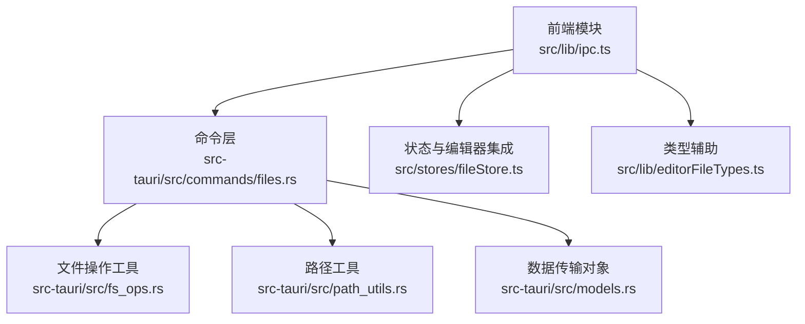
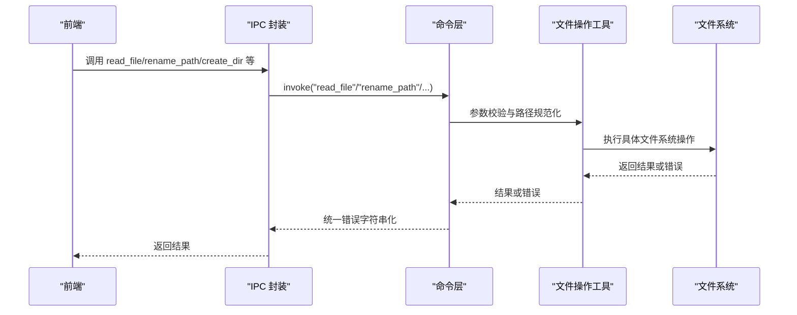
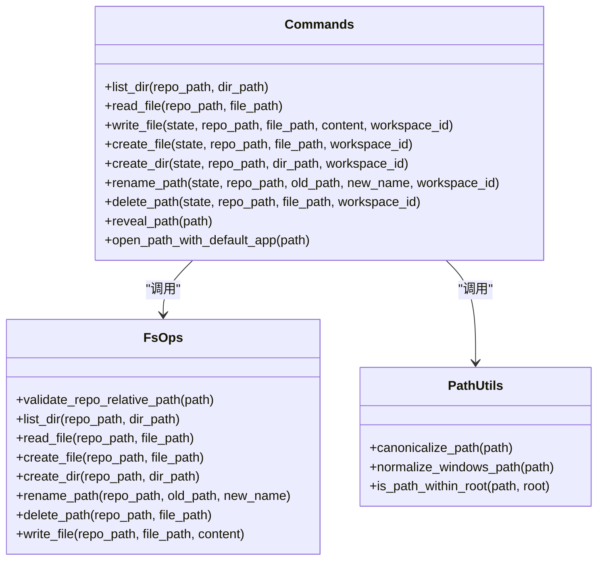
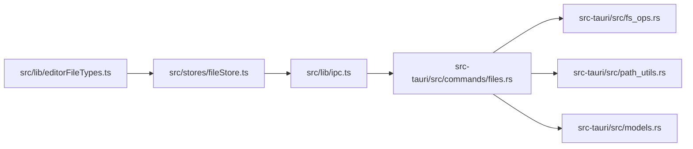

# 文件系统 API

<cite>
**本文引用的文件**
- [src-tauri/src/commands/files.rs](file://src-tauri/src/commands/files.rs)
- [src-tauri/src/fs_ops.rs](file://src-tauri/src/fs_ops.rs)
- [src-tauri/src/path_utils.rs](file://src-tauri/src/path_utils.rs)
- [src-tauri/src/models.rs](file://src-tauri/src/models.rs)
- [src/lib/ipc.ts](file://src/lib/ipc.ts)
- [src/stores/fileStore.ts](file://src/stores/fileStore.ts)
- [src/lib/editorFileTypes.ts](file://src/lib/editorFileTypes.ts)
</cite>

## 目录
1. [简介](#简介)
2. [项目结构](#项目结构)
3. [核心组件](#核心组件)
4. [架构总览](#架构总览)
5. [详细组件分析](#详细组件分析)
6. [依赖关系分析](#依赖关系分析)
7. [性能考量](#性能考量)
8. [故障排查指南](#故障排查指南)
9. [结论](#结论)
10. [附录](#附录)

## 简介
本文件系统 API 文档面向 Panes 应用的文件与目录操作能力，覆盖读取、写入、创建、删除、重命名、列出目录、在原生资源管理器中定位与打开文件等核心功能。文档重点说明：
- 路径处理与规范化（含跨平台差异）
- 权限与信任级别控制
- 安全校验（路径穿越防护、符号链接处理）
- 错误处理与返回格式
- 文件类型识别与二进制检测
- 编码与大小限制
- 性能优化与最佳实践
- 跨平台兼容性策略

## 项目结构
文件系统相关能力主要由 Rust 后端命令层与工具函数组成，并通过 IPC 暴露给前端使用；前端通过统一的 IPC 封装调用后端命令。

**图表来源**
- [src/lib/ipc.ts:442-513](file://src/lib/ipc.ts#L442-L513)
- [src-tauri/src/commands/files.rs:18-266](file://src-tauri/src/commands/files.rs#L18-L266)
- [src-tauri/src/fs_ops.rs:1-441](file://src-tauri/src/fs_ops.rs#L1-L441)
- [src-tauri/src/path_utils.rs:1-143](file://src-tauri/src/path_utils.rs#L1-L143)
- [src-tauri/src/models.rs:829-862](file://src-tauri/src/models.rs#L829-L862)
- [src/stores/fileStore.ts:1-200](file://src/stores/fileStore.ts#L1-L200)
- [src/lib/editorFileTypes.ts:1-7](file://src/lib/editorFileTypes.ts#L1-L7)

**章节来源**
- [src/lib/ipc.ts:442-513](file://src/lib/ipc.ts#L442-L513)
- [src-tauri/src/commands/files.rs:18-266](file://src-tauri/src/commands/files.rs#L18-L266)
- [src-tauri/src/fs_ops.rs:1-441](file://src-tauri/src/fs_ops.rs#L1-L441)
- [src-tauri/src/path_utils.rs:1-143](file://src-tauri/src/path_utils.rs#L1-L143)
- [src-tauri/src/models.rs:829-862](file://src-tauri/src/models.rs#L829-L862)
- [src/stores/fileStore.ts:1-200](file://src/stores/fileStore.ts#L1-L200)
- [src/lib/editorFileTypes.ts:1-7](file://src/lib/editorFileTypes.ts#L1-L7)

## 核心组件
- 命令层：提供 list_dir、read_file、write_file、create_file、create_dir、rename_path、delete_path、reveal_path、open_path_with_default_app 等命令，负责参数校验、信任级别检查、缓存失效与跨线程执行。
- 文件操作工具：实现具体文件系统操作，包含路径规范化、大小限制、二进制检测、路径穿越防护、符号链接处理等。
- 路径工具：提供路径规范化、Windows 前缀处理、比较与包含判断等。
- 数据传输对象：定义文件树条目、读取结果、编辑器文件引用解析结果等结构。
- 前端 IPC 封装：统一暴露命令调用方法，便于前端直接使用。
- 状态与编辑器集成：文件标签页、渲染模式切换、Git 差异对比、重命名后的路径重定向等。

**章节来源**
- [src-tauri/src/commands/files.rs:18-266](file://src-tauri/src/commands/files.rs#L18-L266)
- [src-tauri/src/fs_ops.rs:26-298](file://src-tauri/src/fs_ops.rs#L26-L298)
- [src-tauri/src/path_utils.rs:7-85](file://src-tauri/src/path_utils.rs#L7-L85)
- [src-tauri/src/models.rs:829-862](file://src-tauri/src/models.rs#L829-L862)
- [src/lib/ipc.ts:442-513](file://src/lib/ipc.ts#L442-L513)
- [src/stores/fileStore.ts:168-198](file://src/stores/fileStore.ts#L168-L198)

## 架构总览
下图展示从前端到后端命令、再到文件系统操作的整体流程与职责边界。

**图表来源**
- [src/lib/ipc.ts:498-513](file://src/lib/ipc.ts#L498-L513)
- [src-tauri/src/commands/files.rs:31-37](file://src-tauri/src/commands/files.rs#L31-L37)
- [src-tauri/src/fs_ops.rs:88-118](file://src-tauri/src/fs_ops.rs#L88-L118)

**章节来源**
- [src/lib/ipc.ts:498-513](file://src/lib/ipc.ts#L498-L513)
- [src-tauri/src/commands/files.rs:31-37](file://src-tauri/src/commands/files.rs#L31-L37)
- [src-tauri/src/fs_ops.rs:88-118](file://src-tauri/src/fs_ops.rs#L88-L118)

## 详细组件分析

### 命令层：文件系统命令
- 列出目录：list_dir
- 读取文件：read_file（含大小限制与二进制检测）
- 写入文件：write_file（含路径校验）
- 创建文件：create_file（自动创建父目录）
- 创建目录：create_dir
- 重命名：rename_path（仅允许单段名称）
- 删除：delete_path（区分符号链接与普通文件/目录）
- 在资源管理器中显示：reveal_path（跨平台命令构建）
- 使用默认应用打开：open_path_with_default_app（跨平台命令构建）

命令层还包含：
- 访问根路径与目标路径解析：resolve_target_path_for_repo_lookup
- 编辑器文件引用解析：resolve_editor_file_reference（支持行/列定位）
- 信任级别检查：对用户发起的写入进行受限仓库拦截
- 缓存失效：修改后使文件树缓存失效

**章节来源**
- [src-tauri/src/commands/files.rs:18-266](file://src-tauri/src/commands/files.rs#L18-L266)
- [src-tauri/src/commands/files.rs:482-530](file://src-tauri/src/commands/files.rs#L482-L530)
- [src-tauri/src/commands/files.rs:532-572](file://src-tauri/src/commands/files.rs#L532-L572)

### 文件操作工具：核心逻辑
- 路径合法性：validate_repo_relative_path（仅允许 Normal 组件）
- 列表：list_dir（排除 .git，跳过指向仓库外的符号链接；按目录优先排序）
- 读取：read_file（最大 10MB；扫描前 8KB 检测二进制；UTF-8 转换）
- 创建：create_file（不存在则创建空文件；父目录不存在时先创建）
- 创建：create_dir（不存在则递归创建）
- 重命名：rename_path（仅允许单段新名称；同名时允许相等）
- 删除：delete_path（禁止删除仓库根；符号链接在 Windows 区分处理）
- 写入：write_file（存在则校验绝对路径在仓库内；不存在则校验父目录在仓库内）

**章节来源**
- [src-tauri/src/fs_ops.rs:13-24](file://src-tauri/src/fs_ops.rs#L13-L24)
- [src-tauri/src/fs_ops.rs:26-86](file://src-tauri/src/fs_ops.rs#L26-L86)
- [src-tauri/src/fs_ops.rs:88-118](file://src-tauri/src/fs_ops.rs#L88-L118)
- [src-tauri/src/fs_ops.rs:120-154](file://src-tauri/src/fs_ops.rs#L120-L154)
- [src-tauri/src/fs_ops.rs:156-177](file://src-tauri/src/fs_ops.rs#L156-L177)
- [src-tauri/src/fs_ops.rs:199-228](file://src-tauri/src/fs_ops.rs#L199-L228)
- [src-tauri/src/fs_ops.rs:239-258](file://src-tauri/src/fs_ops.rs#L239-L258)
- [src-tauri/src/fs_ops.rs:260-267](file://src-tauri/src/fs_ops.rs#L260-L267)
- [src-tauri/src/fs_ops.rs:269-298](file://src-tauri/src/fs_ops.rs#L269-L298)

### 路径工具：跨平台与规范化
- 规范化：canonicalize_path、normalize_windows_path_string
- Windows 前缀：strip_windows_verbatim_prefix、add_windows_verbatim_prefix
- 路径包含：is_path_within_root（大小写与斜杠标准化）
- 比较归一化：normalize_for_comparison（Windows 与 UNC 场景）

**章节来源**
- [src-tauri/src/path_utils.rs:7-85](file://src-tauri/src/path_utils.rs#L7-L85)

### 数据传输对象：前后端契约
- 文件树条目：FileTreeEntryDto（path、is_dir）
- 文件读取结果：ReadFileResultDto（content、size_bytes、is_binary）
- 编辑器文件引用解析：ResolvedEditorFileReferenceDto（repo_path、file_path、line、column）

**章节来源**
- [src-tauri/src/models.rs:829-862](file://src-tauri/src/models.rs#L829-L862)

### 前端集成：IPC 与状态
- IPC 方法：listDir、readFile、writeFile、createFile、createDir、renamePath、deletePath、revealPath、openPathWithDefaultApp 等
- 文件状态：fileStore 提供标签页、Git 对比、渲染模式切换、重命名后的路径重定向等

**章节来源**
- [src/lib/ipc.ts:442-513](file://src/lib/ipc.ts#L442-L513)
- [src/stores/fileStore.ts:168-198](file://src/stores/fileStore.ts#L168-L198)

### 类关系图：命令与工具

**图表来源**
- [src-tauri/src/commands/files.rs:18-266](file://src-tauri/src/commands/files.rs#L18-L266)
- [src-tauri/src/fs_ops.rs:13-298](file://src-tauri/src/fs_ops.rs#L13-L298)
- [src-tauri/src/path_utils.rs:7-85](file://src-tauri/src/path_utils.rs#L7-L85)

## 依赖关系分析
- 命令层依赖文件操作工具与路径工具，以保证路径安全与行为一致。
- 命令层还依赖数据库查询与信任级别判定，用于写入前的权限控制。
- 前端通过 IPC 封装统一调用命令层，避免直接访问底层细节。
- 文件存储状态与编辑器集成负责 UI 层面的文件上下文与渲染模式。

**图表来源**
- [src/lib/ipc.ts:442-513](file://src/lib/ipc.ts#L442-L513)
- [src-tauri/src/commands/files.rs:11-16](file://src-tauri/src/commands/files.rs#L11-L16)
- [src-tauri/src/fs_ops.rs:1-12](file://src-tauri/src/fs_ops.rs#L1-L12)
- [src-tauri/src/path_utils.rs:1-5](file://src-tauri/src/path_utils.rs#L1-L5)
- [src-tauri/src/models.rs:829-862](file://src-tauri/src/models.rs#L829-L862)
- [src/stores/fileStore.ts:1-200](file://src/stores/fileStore.ts#L1-L200)
- [src/lib/editorFileTypes.ts:1-7](file://src/lib/editorFileTypes.ts#L1-L7)

**章节来源**
- [src/lib/ipc.ts:442-513](file://src/lib/ipc.ts#L442-L513)
- [src-tauri/src/commands/files.rs:11-16](file://src-tauri/src/commands/files.rs#L11-L16)
- [src-tauri/src/fs_ops.rs:1-12](file://src-tauri/src/fs_ops.rs#L1-L12)
- [src-tauri/src/path_utils.rs:1-5](file://src-tauri/src/path_utils.rs#L1-L5)
- [src-tauri/src/models.rs:829-862](file://src-tauri/src/models.rs#L829-L862)
- [src/stores/fileStore.ts:1-200](file://src/stores/fileStore.ts#L1-L200)
- [src/lib/editorFileTypes.ts:1-7](file://src/lib/editorFileTypes.ts#L1-L7)

## 性能考量
- 异步与阻塞分离：命令层使用异步包装并在阻塞任务中执行文件系统操作，避免阻塞事件循环。
- 大小限制：读取文件最大 10MB，防止大文件拖慢 UI 或内存占用过高。
- 二进制检测：仅扫描前 8KB 判断是否为二进制，减少不必要的解码成本。
- 目录遍历：忽略 .git 目录与指向仓库外的符号链接，降低无效 IO。
- 排序与缓存：目录项按“目录优先、字典序”排序；写入/删除后失效文件树缓存，确保 UI 一致性。

**章节来源**
- [src-tauri/src/commands/files.rs:23-27](file://src-tauri/src/commands/files.rs#L23-L27)
- [src-tauri/src/fs_ops.rs:10-11](file://src-tauri/src/fs_ops.rs#L10-L11)
- [src-tauri/src/fs_ops.rs:107-112](file://src-tauri/src/fs_ops.rs#L107-L112)
- [src-tauri/src/fs_ops.rs:52-66](file://src-tauri/src/fs_ops.rs#L52-L66)
- [src-tauri/src/commands/files.rs:102-103](file://src-tauri/src/commands/files.rs#L102-L103)

## 故障排查指南
- 路径穿越错误：当路径不在仓库根内或尝试访问仓库外符号链接时触发。请确认传入路径为仓库相对路径或绝对路径位于仓库根内。
- 受限仓库写入被拒绝：当仓库信任级别为 Restricted 且操作来自用户发起的写入时会被拒绝。请先提升信任级别。
- 文件过大：超过 10MB 的文件无法直接读取到编辑器。请使用外部工具或拆分文件。
- 重命名失败：新名称必须为单段（不允许包含路径分隔符），且不能与现有文件/目录冲突。
- 删除根目录：禁止删除仓库根目录。
- 符号链接处理：在 Windows 上对符号链接目录/文件分别处理；非 Windows 平台统一删除符号链接本身。
- 跨平台打开失败：Linux 下若未安装 xdg-open 或 gio，则无法在默认应用中打开或显示文件位置。请安装对应工具。

**章节来源**
- [src-tauri/src/fs_ops.rs:38-39](file://src-tauri/src/fs_ops.rs#L38-L39)
- [src-tauri/src/fs_ops.rs:102-105](file://src-tauri/src/fs_ops.rs#L102-L105)
- [src-tauri/src/commands/files.rs:94-99](file://src-tauri/src/commands/files.rs#L94-L99)
- [src-tauri/src/fs_ops.rs:265-267](file://src-tauri/src/fs_ops.rs#L265-L267)
- [src-tauri/src/fs_ops.rs:203-218](file://src-tauri/src/fs_ops.rs#L203-L218)
- [src-tauri/src/commands/files.rs:284-416](file://src-tauri/src/commands/files.rs#L284-L416)

## 结论
Panes 文件系统 API 通过严格的路径校验、信任级别控制与跨平台命令构建，提供了安全、稳定且高性能的文件与目录操作能力。配合前端 IPC 封装与状态管理，实现了从 UI 到文件系统的完整闭环。建议在生产环境中遵循本文的安全与性能最佳实践，以获得更佳的用户体验与可靠性。

## 附录

### API 一览（命令层）
- list_dir(repo_path, dir_path) -> Vec<FileTreeEntryDto>
- read_file(repo_path, file_path) -> ReadFileResultDto
- write_file(state, repo_path, file_path, content, workspace_id) -> void
- create_file(state, repo_path, file_path, workspace_id) -> void
- create_dir(state, repo_path, dir_path, workspace_id) -> void
- rename_path(state, repo_path, old_path, new_name, workspace_id) -> void
- delete_path(state, repo_path, file_path, workspace_id) -> void
- reveal_path(path) -> void
- open_path_with_default_app(path) -> void

**章节来源**
- [src-tauri/src/commands/files.rs:18-266](file://src-tauri/src/commands/files.rs#L18-L266)

### 前端调用示例（IPC）
- listDir(repoPath, dirPath)
- readFile(repoPath, filePath)
- writeFile(repoPath, filePath, content, workspaceId?)
- createFile(repoPath, filePath, workspaceId?)
- createDir(repoPath, dirPath, workspaceId?)
- renamePath(repoPath, oldPath, newName, workspaceId?)
- deletePath(repoPath, filePath, workspaceId?)
- revealPath(path)
- openPathWithDefaultApp(path)

**章节来源**
- [src/lib/ipc.ts:442-513](file://src/lib/ipc.ts#L442-L513)

### 路径处理与安全要点
- 仓库相对路径校验：仅允许 Normal 组件，拒绝 ..、/ 等非法形式。
- 绝对路径规范化：使用 canonicalize 防止符号链接逃逸。
- 目标祖先路径校验：在不存在目标时，向上查找最近存在的祖先并校验其规范化路径仍在仓库根内。
- Windows 符号链接删除差异化处理：目录与文件分别处理。
- 跨平台命令构建：根据平台选择 open/explorer/xdg-open/gio。

**章节来源**
- [src-tauri/src/fs_ops.rs:13-24](file://src-tauri/src/fs_ops.rs#L13-L24)
- [src-tauri/src/fs_ops.rs:120-154](file://src-tauri/src/fs_ops.rs#L120-L154)
- [src-tauri/src/fs_ops.rs:156-177](file://src-tauri/src/fs_ops.rs#L156-L177)
- [src-tauri/src/fs_ops.rs:199-228](file://src-tauri/src/fs_ops.rs#L199-L228)
- [src-tauri/src/commands/files.rs:482-530](file://src-tauri/src/commands/files.rs#L482-L530)
- [src-tauri/src/commands/files.rs:284-480](file://src-tauri/src/commands/files.rs#L284-L480)

### 文件类型识别与渲染
- Markdown 预览文件扩展名集合：md、mdx、markdown
- 文件标签页默认渲染模式：Markdown 文件默认进入预览模式，否则为纯编辑器模式

**章节来源**
- [src/lib/editorFileTypes.ts:1-7](file://src/lib/editorFileTypes.ts#L1-L7)
- [src/stores/fileStore.ts:134-142](file://src/stores/fileStore.ts#L134-L142)