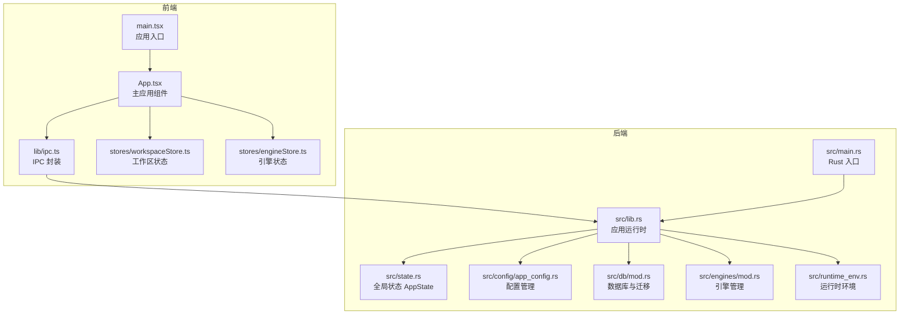
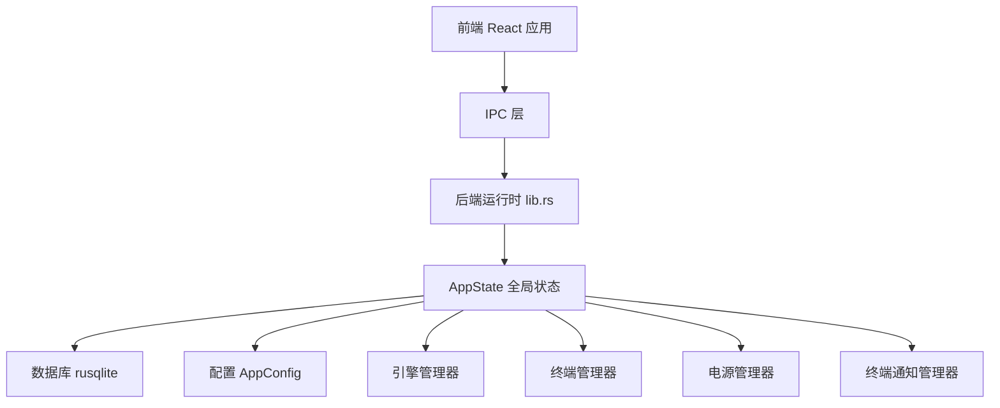
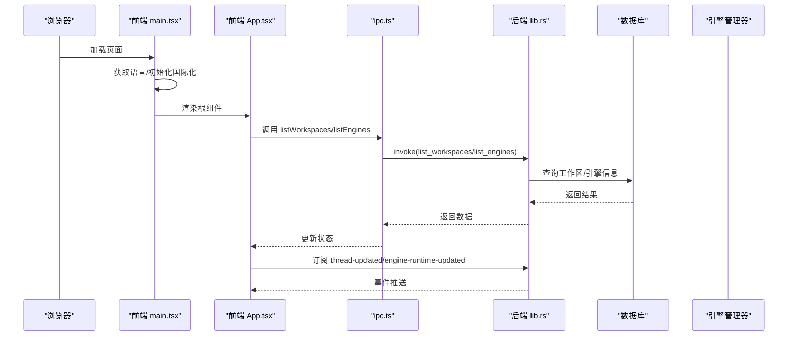
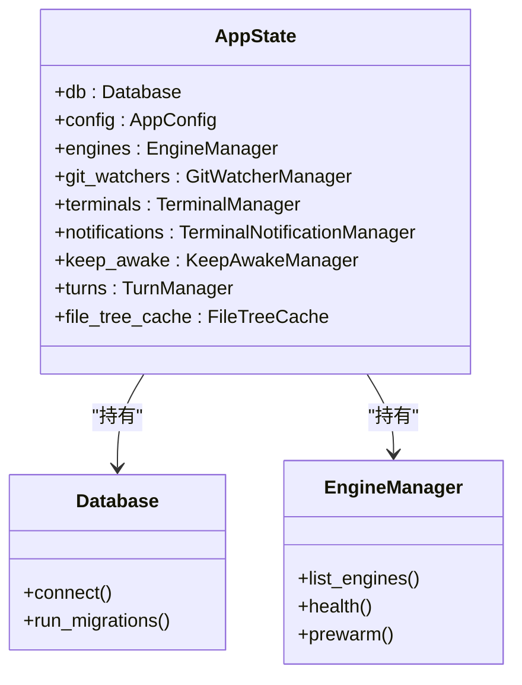
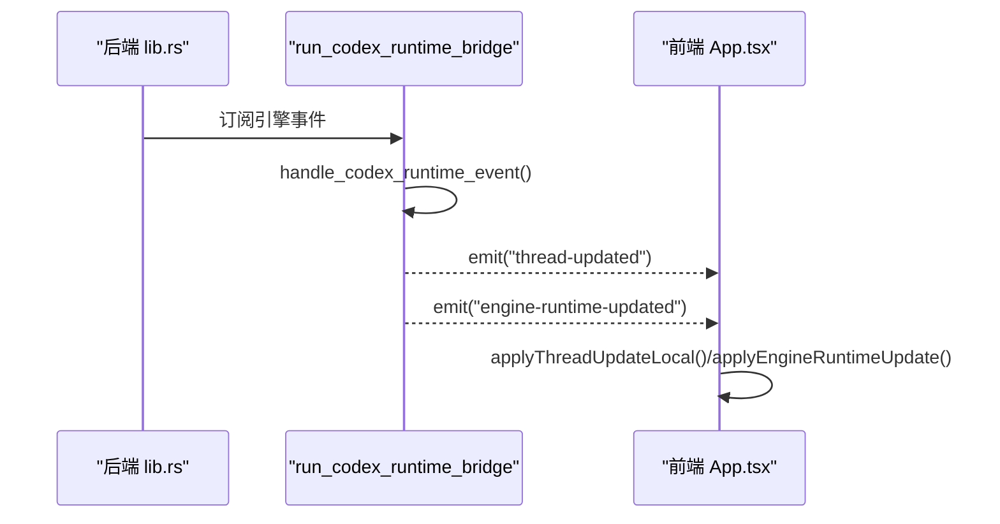
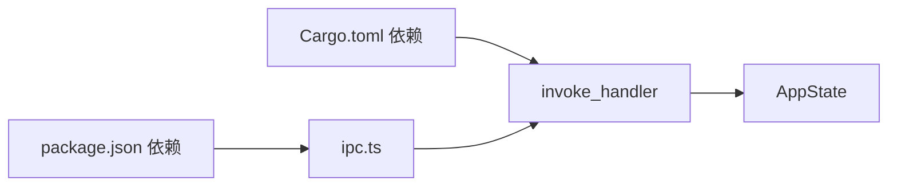

# 系统服务

<cite>
**本文档引用的文件**
- [src/main.tsx](file://src/main.tsx)
- [src/App.tsx](file://src/App.tsx)
- [src/lib/ipc.ts](file://src/lib/ipc.ts)
- [src/stores/workspaceStore.ts](file://src/stores/workspaceStore.ts)
- [src/stores/engineStore.ts](file://src/stores/engineStore.ts)
- [src-tauri/src/main.rs](file://src-tauri/src/main.rs)
- [src-tauri/src/lib.rs](file://src-tauri/src/lib.rs)
- [src-tauri/src/state.rs](file://src-tauri/src/state.rs)
- [src-tauri/src/config/app_config.rs](file://src-tauri/src/config/app_config.rs)
- [src-tauri/src/db/mod.rs](file://src-tauri/src/db/mod.rs)
- [src-tauri/src/engines/mod.rs](file://src-tauri/src/engines/mod.rs)
- [src-tauri/src/runtime_env.rs](file://src-tauri/src/runtime_env.rs)
- [src-tauri/tauri.conf.json](file://src-tauri/tauri.conf.json)
- [package.json](file://package.json)
- [src/types.ts](file://src/types.ts)
</cite>

## 目录
1. [简介](#简介)
2. [项目结构](#项目结构)
3. [核心组件](#核心组件)
4. [架构总览](#架构总览)
5. [详细组件分析](#详细组件分析)
6. [依赖关系分析](#依赖关系分析)
7. [性能考虑](#性能考虑)
8. [故障排查指南](#故障排查指南)
9. [结论](#结论)
10. [附录](#附录)

## 简介
本文件为 Panes 系统服务的综合技术文档，覆盖应用初始化、状态管理与运行时环境配置；阐述全局状态管理、生命周期钩子、错误处理与日志记录机制；说明系统资源管理、内存优化、并发控制与性能监控；提供服务启动流程、配置加载、环境变量处理与调试工具使用指南；解释系统集成点、第三方库集成与扩展机制。文档面向开发者与运维人员，兼顾可读性与深度。

## 项目结构
Panes 采用前端 React + Tauri 的混合架构：前端负责 UI 与交互逻辑，后端 Rust 负责系统服务、引擎管理、数据库与平台能力封装。前端通过 IPC 与后端通信，后端通过 Tauri 暴露命令与事件接口。

**图表来源**
- [src/main.tsx:1-32](file://src/main.tsx#L1-L32)
- [src/App.tsx:1-592](file://src/App.tsx#L1-L592)
- [src/lib/ipc.ts:1-813](file://src/lib/ipc.ts#L1-L813)
- [src-tauri/src/main.rs:1-14](file://src-tauri/src/main.rs#L1-L14)
- [src-tauri/src/lib.rs:1-996](file://src-tauri/src/lib.rs#L1-L996)
- [src-tauri/src/state.rs:1-56](file://src-tauri/src/state.rs#L1-L56)
- [src-tauri/src/config/app_config.rs:1-458](file://src-tauri/src/config/app_config.rs#L1-L458)
- [src-tauri/src/db/mod.rs:1-1052](file://src-tauri/src/db/mod.rs#L1-L1052)
- [src-tauri/src/engines/mod.rs:1-1193](file://src-tauri/src/engines/mod.rs#L1-L1193)
- [src-tauri/src/runtime_env.rs:1-1625](file://src-tauri/src/runtime_env.rs#L1-L1625)

**章节来源**
- [src/main.tsx:1-32](file://src/main.tsx#L1-L32)
- [src-tauri/src/main.rs:1-14](file://src-tauri/src/main.rs#L1-L14)

## 核心组件
- 应用入口与初始化
  - 前端入口在 main.tsx 中完成国际化初始化与根节点渲染，并通过 App 组件承载全局状态与 UI。
  - 后端入口在 src/main.rs 中调用 run() 初始化应用运行时。
- 状态管理
  - 前端使用 Zustand 管理工作区、引擎、终端等状态。
  - 后端通过 AppState 集中持有数据库、配置、引擎管理器、终端管理器等共享资源。
- IPC 与事件
  - 前端通过 ipc.ts 封装 invoke 与 listen，统一调用后端命令与订阅事件。
- 配置与运行时环境
  - AppConfig 提供通用、UI、调试与电源配置；runtime_env 提供跨平台路径、环境变量与登录 shell 探测。
- 数据库与迁移
  - 数据库连接池、WAL 模式、同步策略与多版本迁移脚本确保数据一致性与兼容性。
- 引擎管理
  - 多引擎抽象与实现（Codex、Claude、OpenCode），统一模型列表、健康检查、预热与线程生命周期管理。

**章节来源**
- [src/main.tsx:11-32](file://src/main.tsx#L11-L32)
- [src-tauri/src/main.rs:3-13](file://src-tauri/src/main.rs#L3-L13)
- [src-tauri/src/lib.rs:48-344](file://src-tauri/src/lib.rs#L48-L344)
- [src-tauri/src/state.rs:12-56](file://src-tauri/src/state.rs#L12-L56)
- [src-tauri/src/config/app_config.rs:140-204](file://src-tauri/src/config/app_config.rs#L140-L204)
- [src-tauri/src/db/mod.rs:74-150](file://src-tauri/src/db/mod.rs#L74-L150)
- [src-tauri/src/engines/mod.rs:464-800](file://src-tauri/src/engines/mod.rs#L464-L800)

## 架构总览
前端与后端通过 Tauri 桥接形成双层架构：前端负责用户交互与状态驱动，后端负责系统级资源与业务逻辑。后端通过 AppState 统一管理数据库、引擎、终端、通知与电源等子系统，并通过广播/事件通道向前端推送状态变更。

**图表来源**
- [src-tauri/src/lib.rs:85-96](file://src-tauri/src/lib.rs#L85-L96)
- [src-tauri/src/state.rs:12-24](file://src-tauri/src/state.rs#L12-L24)
- [src-tauri/src/db/mod.rs:24-27](file://src-tauri/src/db/mod.rs#L24-L27)
- [src-tauri/src/config/app_config.rs:14-19](file://src-tauri/src/config/app_config.rs#L14-L19)

**章节来源**
- [src-tauri/src/lib.rs:98-329](file://src-tauri/src/lib.rs#L98-L329)

## 详细组件分析

### 应用初始化与生命周期
- 前端初始化
  - main.tsx 在启动时尝试从后端获取本地化设置，回退到浏览器语言；随后初始化国际化并渲染根组件。
- 后端初始化
  - src/main.rs 进入 run()，初始化数据库、恢复运行时状态、加载配置、启动 KeepAwake 管理器、准备默认工作区。
  - 构建 Tauri 应用，注册插件（shell、dialog、fs、notification、updater、process），注入 AppState，设置菜单与窗口装饰策略。
  - 启动引擎运行时桥接任务，监听引擎事件并通过 emit 分发至前端。
  - 注册 invoke_handler，暴露所有命令给前端调用。
  - 注册 RunEvent::ExitRequested/Exit 生命周期钩子，执行清理（释放 KeepAwake、关闭终端）。
- 前端生命周期
  - App.tsx 在首次挂载时加载工作区、引擎、电源与通知设置；订阅线程更新、聊天回合结束、引擎运行时更新等事件；处理快捷键与菜单动作；在 beforeunload 时刷新草稿。

**图表来源**
- [src/main.tsx:11-32](file://src/main.tsx#L11-L32)
- [src/App.tsx:121-155](file://src/App.tsx#L121-L155)
- [src/lib/ipc.ts:102-104](file://src/lib/ipc.ts#L102-L104)
- [src-tauri/src/lib.rs:107-180](file://src-tauri/src/lib.rs#L107-L180)
- [src-tauri/src/db/mod.rs:74-135](file://src-tauri/src/db/mod.rs#L74-L135)

**章节来源**
- [src/main.tsx:11-32](file://src/main.tsx#L11-L32)
- [src-tauri/src/main.rs:3-13](file://src-tauri/src/main.rs#L3-L13)
- [src-tauri/src/lib.rs:48-180](file://src-tauri/src/lib.rs#L48-L180)
- [src/App.tsx:121-300](file://src/App.tsx#L121-L300)

### 全局状态管理与存储
- 前端状态
  - workspaceStore.ts：工作区列表、归档工作区、活动工作区、仓库集合与信任级别、CueLight 绑定等；支持打开/删除/恢复工作区、扫描深度重扫、Git 选择与信任级别批量设置。
  - engineStore.ts：引擎列表、健康检查、协议诊断与运行时更新应用。
- 后端状态
  - state.rs 定义 AppState，聚合 Database、AppConfig、EngineManager、GitWatcherManager、TerminalManager、TerminalNotificationManager、KeepAwakeManager、TurnManager、FileTreeCache。
  - 通过 Arc + Mutex/RwLock 实现线程安全共享。

**图表来源**
- [src-tauri/src/state.rs:12-24](file://src-tauri/src/state.rs#L12-L24)
- [src-tauri/src/db/mod.rs:24-27](file://src-tauri/src/db/mod.rs#L24-L27)
- [src-tauri/src/engines/mod.rs:464-479](file://src-tauri/src/engines/mod.rs#L464-L479)

**章节来源**
- [src/stores/workspaceStore.ts:140-455](file://src/stores/workspaceStore.ts#L140-L455)
- [src/stores/engineStore.ts:23-164](file://src/stores/engineStore.ts#L23-L164)
- [src-tauri/src/state.rs:12-56](file://src-tauri/src/state.rs#L12-L56)

### 生命周期钩子与事件流
- 前端事件
  - App.tsx 订阅 thread-updated、chat-turn-finished、engine-runtime-updated 等事件，触发状态更新与通知展示。
  - 快捷键与菜单动作通过 listenMenuAction 与键盘事件统一处理，避免冲突。
- 后端事件
  - run_codex_runtime_bridge 监听引擎运行时事件，映射为线程更新或运行时诊断事件并 emit 至前端。
  - RunEvent::ExitRequested/Exit 时释放 KeepAwake 并关闭终端会话。

**图表来源**
- [src-tauri/src/lib.rs:355-516](file://src-tauri/src/lib.rs#L355-L516)
- [src/App.tsx:175-281](file://src/App.tsx#L175-L281)

**章节来源**
- [src-tauri/src/lib.rs:331-344](file://src-tauri/src/lib.rs#L331-L344)
- [src-tauri/src/lib.rs:355-516](file://src-tauri/src/lib.rs#L355-L516)
- [src/App.tsx:175-281](file://src/App.tsx#L175-L281)

### 错误处理与日志记录
- 日志初始化
  - 后端启动时初始化 env_logger，所有模块通过 log::warn!/info! 等输出日志。
- 前端容错
  - IPC 调用失败时降级（如获取语言失败），避免阻塞启动。
  - 事件监听失败时记录警告，不影响主流程。
- 数据库与配置
  - 数据库连接失败、迁移异常、配置保存失败均返回错误并记录日志，保证系统可恢复。

**章节来源**
- [src-tauri/src/lib.rs:50](file://src-tauri/src/lib.rs#L50)
- [src-tauri/src/db/mod.rs:74-150](file://src-tauri/src/db/mod.rs#L74-L150)
- [src-tauri/src/config/app_config.rs:153-199](file://src-tauri/src/config/app_config.rs#L153-L199)
- [src/App.tsx:14-18](file://src/App.tsx#L14-L18)

### 配置加载与环境变量处理
- 配置文件
  - AppConfig 支持通用、UI、调试、电源四类配置，默认值与序列化规则定义明确；提供加载/保存与互斥写锁。
- 运行时环境
  - runtime_env 提供应用数据目录、历史目录迁移、PATH 扩展、登录 shell 环境探测、可执行解析等能力。
- 窗口与构建
  - tauri.conf.json 定义产品名、版本、窗口属性、安全策略、打包目标与更新器配置。

**章节来源**
- [src-tauri/src/config/app_config.rs:140-204](file://src-tauri/src/config/app_config.rs#L140-L204)
- [src-tauri/src/runtime_env.rs:53-105](file://src-tauri/src/runtime_env.rs#L53-L105)
- [src-tauri/tauri.conf.json:1-58](file://src-tauri/tauri.conf.json#L1-L58)

### 系统资源管理与并发控制
- 数据库连接池
  - 最大空闲连接数限制，连接复用与自动回收，减少开销。
  - WAL 模式、同步策略与忙等待超时提升并发与可靠性。
- 并发与取消
  - 使用 tokio::sync::broadcast、mpsc、oneshot 等通道进行事件分发与响应。
  - TurnManager 使用 RwLock + CancellationToken 管理活跃会话与取消信号。
- 内存优化
  - SQLite 列扩展与路径修复迁移，避免重复与冗余数据。
  - 前端状态按需加载与去抖（如仓库加载 seq 控制）。

**章节来源**
- [src-tauri/src/db/mod.rs:24-150](file://src-tauri/src/db/mod.rs#L24-L150)
- [src-tauri/src/state.rs:26-56](file://src-tauri/src/state.rs#L26-L56)
- [src/stores/workspaceStore.ts:257-292](file://src/stores/workspaceStore.ts#L257-L292)

### 性能监控与指标
- 运行时诊断
  - 引擎健康报告与协议诊断通过 IPC 下发前端提示与日志记录。
- 事件桥接
  - Codex 运行时事件桥接使用广播通道，记录丢帧并跳过滞后事件，保障前端体验。
- 前端性能
  - 快捷键防抖、事件监听卸载、beforeunload 刷新草稿等降低资源占用。

**章节来源**
- [src-tauri/src/engines/mod.rs:568-628](file://src-tauri/src/engines/mod.rs#L568-L628)
- [src-tauri/src/lib.rs:355-366](file://src-tauri/src/lib.rs#L355-L366)
- [src/App.tsx:54-60](file://src/App.tsx#L54-L60)

### 服务启动流程与调试工具
- 启动流程
  - 前端：main.tsx → 国际化 → 渲染 App → 加载工作区/引擎/电源/通知 → 订阅事件 → 快捷键/菜单处理。
  - 后端：src/main.rs → run() → 初始化 DB/配置/KeepAwake → 注册插件与命令 → 启动桥接 → 监听事件 → 生命周期钩子。
- 调试工具
  - 开发模式通过 Vite 提供热更新；生产构建由 Tauri CLI 管理。
  - 日志通过 env_logger 输出；数据库迁移与配置保存具备错误回退与备份策略。

**章节来源**
- [src/main.tsx:11-32](file://src/main.tsx#L11-L32)
- [src-tauri/src/main.rs:3-13](file://src-tauri/src/main.rs#L3-L13)
- [src-tauri/src/lib.rs:98-329](file://src-tauri/src/lib.rs#L98-L329)
- [package.json:6-26](file://package.json#L6-L26)

## 依赖关系分析
- 前端依赖
  - React、Zustand、@tauri-apps/api、@xterm/* 等；通过 package.json 管理版本与脚本。
- 后端依赖
  - Tauri 2 插件生态、tokio 生态、rusqlite、env_logger、which、notify、portable-pty 等。
- 关键耦合
  - 前端 ipc.ts 与后端 invoke_handler 一一对应；AppState 作为后端全局单例被各模块共享。

**图表来源**
- [package.json:27-88](file://package.json#L27-L88)
- [src-tauri/Cargo.toml:15-55](file://src-tauri/Cargo.toml#L15-L55)
- [src-tauri/src/lib.rs:181-329](file://src-tauri/src/lib.rs#L181-L329)

**章节来源**
- [package.json:27-88](file://package.json#L27-L88)
- [src-tauri/Cargo.toml:15-55](file://src-tauri/Cargo.toml#L15-L55)
- [src-tauri/src/lib.rs:181-329](file://src-tauri/src/lib.rs#L181-L329)

## 性能考虑
- 数据库
  - WAL 模式与连接池减少锁竞争；迁移脚本按版本增量更新，避免全量重建。
- 并发
  - 广播通道与异步任务解耦事件产生与消费；令牌取消机制避免僵尸任务。
- 前端
  - 状态按需加载、请求去抖、事件监听及时清理，降低重绘与内存压力。
- 运行时
  - KeepAwake 管理器在启动时恢复状态，避免频繁切换带来的系统开销。

[本节为通用指导，无需特定文件引用]

## 故障排查指南
- 启动失败
  - 检查 env_logger 输出与数据库初始化日志；确认配置文件存在且可写。
- IPC 调用异常
  - 查看前端 ipc.ts 的错误分支与后端 invoke_handler 是否正确注册；核对参数类型与必填字段。
- 事件未到达
  - 确认前端已正确 listen 对应事件主题；检查后端 run_codex_runtime_bridge 是否正常运行。
- 数据不一致
  - 触发数据库迁移；检查连接池与事务提交；必要时查看迁移脚本与列扩展日志。

**章节来源**
- [src-tauri/src/lib.rs:50](file://src-tauri/src/lib.rs#L50)
- [src-tauri/src/db/mod.rs:122-135](file://src-tauri/src/db/mod.rs#L122-L135)
- [src-tauri/src/lib.rs:355-366](file://src-tauri/src/lib.rs#L355-L366)

## 结论
Panes 通过前后端清晰分层与统一的 IPC/事件机制，实现了稳定的状态管理、可靠的资源控制与良好的用户体验。配置与运行时环境设计兼顾跨平台与可维护性，数据库与并发模型保障了性能与一致性。建议在扩展新功能时遵循现有模式：前端状态最小化、后端命令幂等化、事件通道化与日志可观测。

[本节为总结，无需特定文件引用]

## 附录
- 类型定义与接口
  - src/types.ts 定义了工作区、线程、消息、引擎、权限与通知等核心类型，贯穿前后端交互。
- 第三方库集成
  - @tauri-apps/* 插件提供系统能力；@xterm/* 提供终端渲染；zustand 管理前端状态；rusqlite 与 env_logger 提供后端能力。
- 扩展机制
  - 新增命令：在 src-tauri/src/commands 下新增模块并在 invoke_handler 中注册；前端在 ipc.ts 中添加封装函数与事件监听。

**章节来源**
- [src/types.ts:1-1304](file://src/types.ts#L1-L1304)
- [package.json:27-88](file://package.json#L27-L88)
- [src-tauri/Cargo.toml:15-55](file://src-tauri/Cargo.toml#L15-L55)
- [src-tauri/src/lib.rs:181-329](file://src-tauri/src/lib.rs#L181-L329)