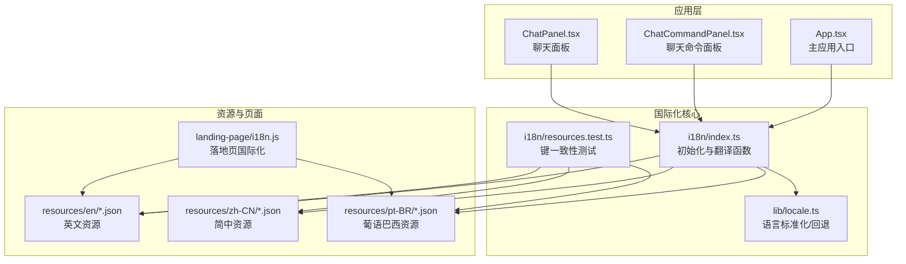
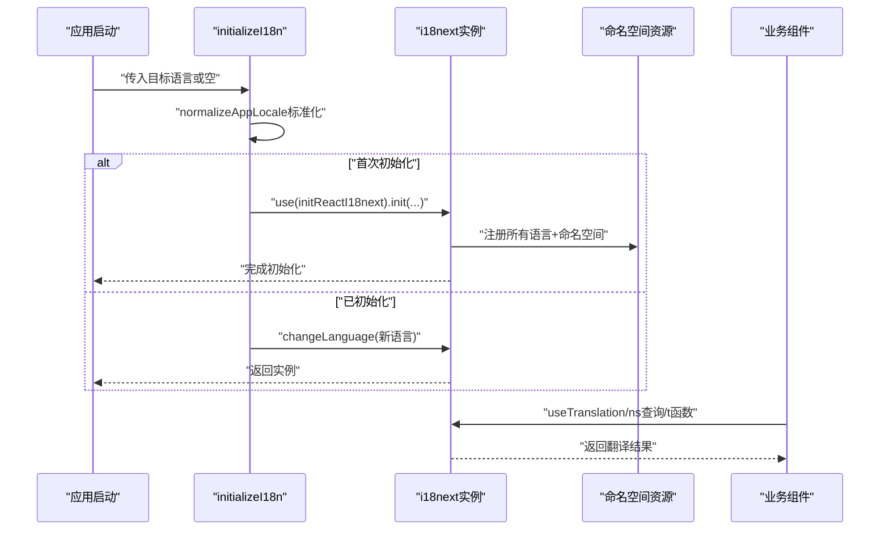
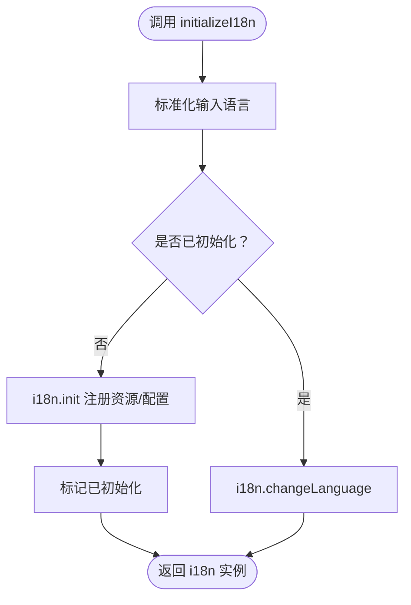
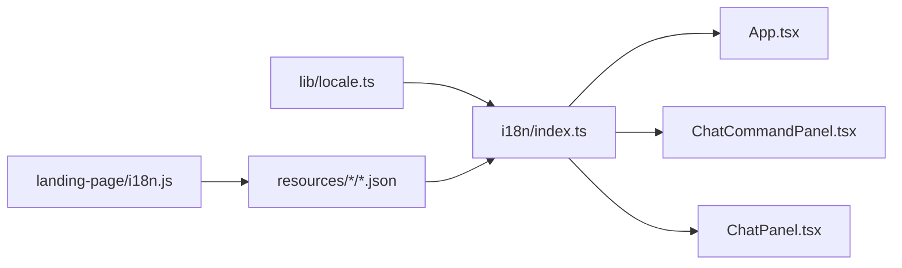

# 国际化配置

<cite>
**本文档引用的文件**
- [src/i18n/index.ts](file://src/i18n/index.ts)
- [src/lib/locale.ts](file://src/lib/locale.ts)
- [src/i18n/resources.test.ts](file://src/i18n/resources.test.ts)
- [landing-page/i18n.js](file://landing-page/i18n.js)
- [src/i18n/resources/en/common.json](file://src/i18n/resources/en/common.json)
- [src/i18n/resources/zh-CN/common.json](file://src/i18n/resources/zh-CN/common.json)
- [src/i18n/resources/pt-BR/common.json](file://src/i18n/resources/pt-BR/common.json)
- [src/App.tsx](file://src/App.tsx)
- [src/components/chat/ChatCommandPanel.tsx](file://src/components/chat/ChatCommandPanel.tsx)
- [src/components/chat/ChatPanel.tsx](file://src/components/chat/ChatPanel.tsx)
</cite>

## 目录
1. [简介](#简介)
2. [项目结构](#项目结构)
3. [核心组件](#核心组件)
4. [架构总览](#架构总览)
5. [详细组件分析](#详细组件分析)
6. [依赖关系分析](#依赖关系分析)
7. [性能考虑](#性能考虑)
8. [故障排除指南](#故障排除指南)
9. [结论](#结论)
10. [附录](#附录)

## 简介
本文件系统性梳理 Panes 项目的国际化配置体系，覆盖多语言支持的配置选项、语言包加载与翻译资源管理、本地化格式设置、语言切换机制、回退语言策略、动态语言加载配置、翻译键值对的组织结构与命名约定、维护流程、扩展方法、自定义语言包创建以及翻译质量保证措施，并总结多语言开发的最佳实践与常见问题解决方案。

## 项目结构
国际化相关的核心文件分布于以下位置：
- React 应用侧：src/i18n（初始化、资源注册、翻译函数导出）
- 本地化工具：src/lib/locale（语言标准化、回退逻辑、显示名）
- 首页静态页面：landing-page/i18n.js（独立的前端落地页国际化实现）
- 测试：src/i18n/resources.test.ts（键一致性校验）
- 语言包：src/i18n/resources/{语言代码}/{namespace}.json（按命名空间分片）

图表来源
- [src/i18n/index.ts:1-86](file://src/i18n/index.ts#L1-L86)
- [src/lib/locale.ts:1-55](file://src/lib/locale.ts#L1-L55)
- [src/i18n/resources.test.ts:1-107](file://src/i18n/resources.test.ts#L1-L107)
- [landing-page/i18n.js:1-515](file://landing-page/i18n.js#L1-L515)

章节来源
- [src/i18n/index.ts:1-86](file://src/i18n/index.ts#L1-L86)
- [src/lib/locale.ts:1-55](file://src/lib/locale.ts#L1-L55)
- [src/i18n/resources.test.ts:1-107](file://src/i18n/resources.test.ts#L1-L107)
- [landing-page/i18n.js:1-515](file://landing-page/i18n.js#L1-L515)

## 核心组件
- 国际化初始化与运行时
  - 初始化函数负责注册资源、设置默认语言、命名空间、回退语言、插值行为等；支持在运行时切换语言。
  - 提供统一的翻译函数以供业务组件调用。
- 本地化工具
  - 支持的语言列表、语言码标准化（如 zh-Hans → zh-CN）、浏览器语言回退、显示名映射。
- 资源与测试
  - 按命名空间拆分的 JSON 资源，测试确保不同语言间键集合一致，保障翻译完整性。
- 落地页国际化
  - 独立的前端脚本实现语言检测、切换、DOM 更新与持久化。

章节来源
- [src/i18n/index.ts:58-83](file://src/i18n/index.ts#L58-L83)
- [src/lib/locale.ts:1-55](file://src/lib/locale.ts#L1-L55)
- [src/i18n/resources.test.ts:51-106](file://src/i18n/resources.test.ts#L51-L106)
- [landing-page/i18n.js:224-514](file://landing-page/i18n.js#L224-L514)

## 架构总览
React 应用通过 i18next + react-i18next 实现国际化，资源以命名空间为单位组织，初始化时一次性注入所有可用语言与命名空间。组件通过 useTranslation 或直接调用封装的 t 函数进行翻译查询。落地页采用独立脚本实现相同的目标。

图表来源
- [src/i18n/index.ts:58-83](file://src/i18n/index.ts#L58-L83)

## 详细组件分析

### 组件A：i18n 初始化与运行时（React）
- 功能要点
  - 注册资源：将各语言、各命名空间的 JSON 资源打包到 resources 对象中，供 i18next 初始化使用。
  - 初始化参数：lng、fallbackLng、defaultNS、ns 列表、interpolation.escapeValue、returnNull 等。
  - 运行时切换：若已初始化则调用 changeLanguage，否则执行完整初始化。
  - 导出翻译函数：t(key, options) 作为全局翻译入口。
- 关键数据结构
  - 命名空间：common、app、chat、workspace、setup、git、native。
  - 语言集合：en、pt-BR、zh-CN。
- 性能与复杂度
  - 初始化阶段一次性注入全部资源，后续切换仅更新语言上下文，时间复杂度近似 O(1)。
- 错误处理
  - returnNull=false，避免返回 null；未命中键时返回键路径字符串，便于定位缺失项。

图表来源
- [src/i18n/index.ts:58-83](file://src/i18n/index.ts#L58-L83)

章节来源
- [src/i18n/index.ts:26-83](file://src/i18n/index.ts#L26-L83)

### 组件B：本地化工具（语言标准化与回退）
- 功能要点
  - 支持的语言列表：en、pt-BR、zh-CN。
  - 语言码归一化：下划线转连字符、大小写统一；zh-* 族映射到 zh-CN；pt-* 族映射到 pt-BR。
  - 浏览器语言回退：优先 navigator.language，不可用时回退 en。
  - 显示名：根据 AppLocale 返回本地化显示文本。
- 复杂度与边界
  - 归一化与映射均为常数时间操作，健壮性通过类型守卫与默认值保障。

章节来源
- [src/lib/locale.ts:1-55](file://src/lib/locale.ts#L1-L55)

### 组件C：资源与测试（键一致性与命名空间）
- 资源组织
  - 以语言代码为目录，每个命名空间对应一个 JSON 文件，键为点式路径（如 chat.panel.planMode）。
- 测试策略
  - 扁平化遍历各命名空间键集合，断言不同语言键集合相等，确保翻译完整性。
  - 验证关键回退文案存在，避免运行时缺失。
- 维护建议
  - 新增键时同步添加到所有语言；删除键时需迁移引用并更新测试。

章节来源
- [src/i18n/resources.test.ts:24-106](file://src/i18n/resources.test.ts#L24-L106)
- [src/i18n/resources/en/common.json:1-29](file://src/i18n/resources/en/common.json#L1-L29)
- [src/i18n/resources/zh-CN/common.json:1-29](file://src/i18n/resources/zh-CN/common.json#L1-L29)
- [src/i18n/resources/pt-BR/common.json:1-29](file://src/i18n/resources/pt-BR/common.json#L1-L29)

### 组件D：落地页国际化（独立脚本）
- 功能要点
  - 支持语言：en、pt-BR。
  - 语言检测顺序：URL 参数 lang → localStorage → navigator.language → 默认 en。
  - DOM 更新：标题、元信息、导航、内容区块、下载按钮文案等。
  - 切换与持久化：点击切换器更新 DOM 并写入 localStorage。
- 与 React 侧差异
  - 不使用 i18next，而是直接在内存中维护 TRANSLATIONS 对象，按路径读取并更新节点属性/文本。

章节来源
- [landing-page/i18n.js:1-515](file://landing-page/i18n.js#L1-L515)

### 组件E：业务组件中的使用模式
- 使用方式
  - 全局：从 i18n 导出的 t 函数进行翻译（如 App.tsx 中的通知文案）。
  - 命名空间：通过 useTranslation("chat") 等在组件内限定命名空间，减少键冲突。
- 示例场景
  - ChatCommandPanel：使用 t("threadPicker.forkTitle") 等键渲染面板标题与描述。
  - ChatPanel：在消息行中使用 t("panel.planMode") 渲染计划模式提示。
- 最佳实践
  - 在组件内部使用 useTranslation 获取 t，避免跨组件共享全局状态。
  - 将命名空间与组件职责绑定，例如 chat 命名空间用于聊天相关文案。

章节来源
- [src/App.tsx:107-119](file://src/App.tsx#L107-L119)
- [src/components/chat/ChatCommandPanel.tsx:104-132](file://src/components/chat/ChatCommandPanel.tsx#L104-L132)
- [src/components/chat/ChatPanel.tsx:1247-1252](file://src/components/chat/ChatPanel.tsx#L1247-L1252)

## 依赖关系分析
- 组件耦合
  - 业务组件仅依赖 i18n 的 t 函数或 useTranslation 钩子，耦合度低。
  - 语言标准化由 lib/locale.ts 提供，被 i18n 初始化与落地页脚本共同使用。
- 外部依赖
  - i18next 与 react-i18next：提供命名空间、回退语言、插值等能力。
  - 浏览器环境：落地页脚本依赖 navigator 与 localStorage。
- 潜在循环依赖
  - 当前结构清晰，无明显循环导入；资源文件为纯 JSON，不参与编译期依赖。

图表来源
- [src/lib/locale.ts:1-55](file://src/lib/locale.ts#L1-L55)
- [src/i18n/index.ts:1-86](file://src/i18n/index.ts#L1-L86)
- [landing-page/i18n.js:1-515](file://landing-page/i18n.js#L1-L515)

章节来源
- [src/lib/locale.ts:1-55](file://src/lib/locale.ts#L1-L55)
- [src/i18n/index.ts:1-86](file://src/i18n/index.ts#L1-L86)
- [landing-page/i18n.js:1-515](file://landing-page/i18n.js#L1-L515)

## 性能考虑
- 资源加载
  - 初始化时一次性注入所有语言与命名空间资源，避免运行时按需加载带来的抖动。
- 切换成本
  - 已初始化后仅变更语言上下文，切换开销极小。
- 插值与回退
  - 关闭 escapeValue 可减少额外转义开销；合理设置 fallbackLng 降低未命中键的回退链路长度。
- 建议
  - 对超大命名空间可考虑懒加载策略（需评估复杂度与收益），当前项目规模下无需此优化。

## 故障排除指南
- 常见问题
  - 键未命中：检查键路径是否正确，确认测试中键集合是否包含该键。
  - 语言未生效：确认 normalizeAppLocale 是否正确归一化输入，检查 initializeI18n 是否在应用启动早期调用。
  - 落地页语言不同步：确认 landing-page/i18n.js 的检测顺序与存储键一致。
- 定位步骤
  - 在测试中新增断言验证缺失键；在组件中打印 i18n.language 与 t(key) 结果。
  - 检查资源文件编码与 JSON 语法，避免解析错误导致部分命名空间缺失。

章节来源
- [src/i18n/resources.test.ts:51-106](file://src/i18n/resources.test.ts#L51-L106)
- [src/i18n/index.ts:58-83](file://src/i18n/index.ts#L58-L83)
- [landing-page/i18n.js:465-486](file://landing-page/i18n.js#L465-L486)

## 结论
本项目采用“命名空间 + 多语言资源 + i18next”的成熟方案，结合本地化工具与测试保障，实现了稳定、可扩展的国际化能力。React 侧与落地页侧分别采用统一的键组织与语言归一化策略，确保用户体验一致。建议在新增语言或命名空间时严格遵循现有流程，保持键一致性与测试覆盖率。

## 附录

### 配置选项速览
- 初始化参数
  - 资源：resources（含 en/pt-BR/zh-CN 与 common/app/chat/workspace/setup/git/native）
  - 默认语言：lng（经 normalizeAppLocale 标准化）
  - 回退语言：fallbackLng=en
  - 默认命名空间：defaultNS=common
  - 命名空间列表：ns=["common","app","chat","workspace","setup","git","native"]
  - 插值：escapeValue=false
  - 未命中行为：returnNull=false
- 运行时切换：changeLanguage(新语言)

章节来源
- [src/i18n/index.ts:62-72](file://src/i18n/index.ts#L62-L72)

### 语言切换与回退策略
- 输入归一化：下划线转连字符、大小写统一、zh-* → zh-CN、pt-* → pt-BR。
- 回退顺序：URL参数 → 本地存储 → 浏览器语言 → en。
- React侧：initializeI18n 首次初始化后走 changeLanguage。
- 落地页：独立脚本实现相同逻辑。

章节来源
- [src/lib/locale.ts:5-31](file://src/lib/locale.ts#L5-L31)
- [landing-page/i18n.js:224-243](file://landing-page/i18n.js#L224-L243)
- [landing-page/i18n.js:465-486](file://landing-page/i18n.js#L465-L486)
- [src/i18n/index.ts:58-78](file://src/i18n/index.ts#L58-L78)

### 翻译键值对组织与命名约定
- 组织结构
  - 语言目录下按命名空间拆分 JSON 文件。
- 命名约定
  - 键使用点式路径，如 chat.panel.planMode。
  - 命名空间与组件/功能域对应，减少键冲突。
- 维护流程
  - 新增键：在所有语言同名命名空间中添加。
  - 删除键：迁移引用并更新测试。
  - 测试：通过 resources.test.ts 校验键集合一致性。

章节来源
- [src/i18n/resources.test.ts:24-49](file://src/i18n/resources.test.ts#L24-L49)
- [src/i18n/resources.test.ts:51-106](file://src/i18n/resources.test.ts#L51-L106)

### 扩展方法与最佳实践
- 扩展语言
  - 在 src/i18n/resources 下新增语言目录与命名空间文件；在 index.ts 中引入并加入 resources。
  - 在 lib/locale.ts 中加入支持列表与映射规则。
- 自定义语言包
  - 保持命名空间与键路径一致；确保测试覆盖新增键。
- 质量保证
  - 依赖 resources.test.ts 的键一致性断言；在 CI 中运行测试。
  - 对关键回退文案（如通知）单独断言存在性。

章节来源
- [src/i18n/index.ts:26-54](file://src/i18n/index.ts#L26-L54)
- [src/lib/locale.ts:1-35](file://src/lib/locale.ts#L1-L35)
- [src/i18n/resources.test.ts:51-106](file://src/i18n/resources.test.ts#L51-L106)