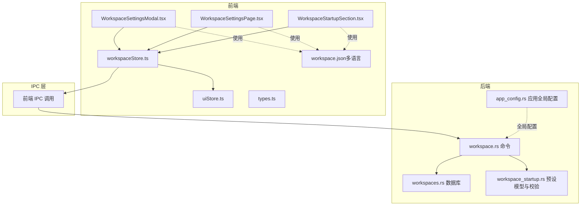
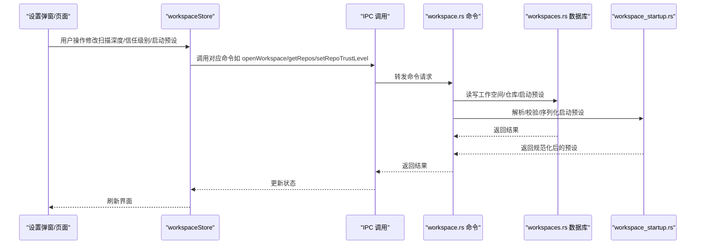
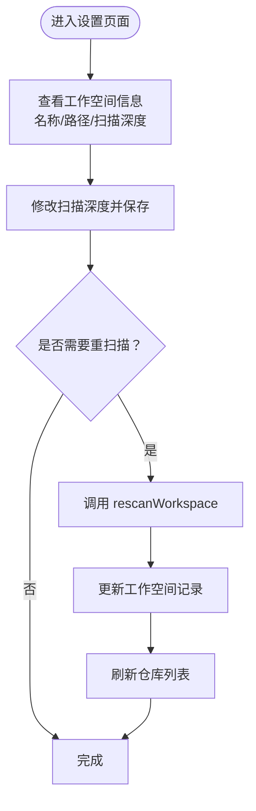
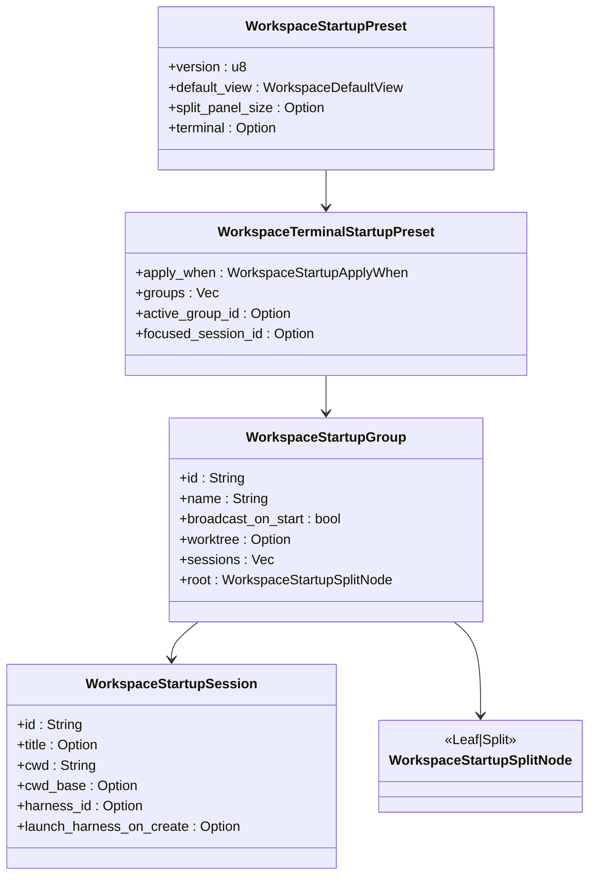
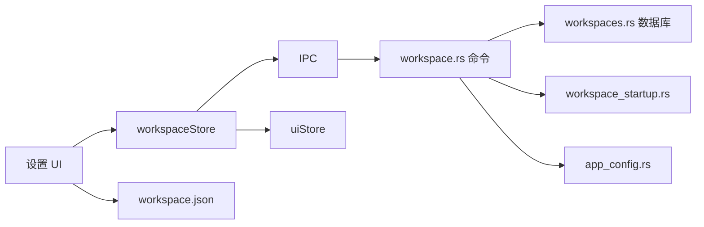

# 工作空间配置

<cite>
**本文引用的文件**
- [WorkspaceSettingsModal.tsx](file://src/components/workspace/WorkspaceSettingsModal.tsx)
- [WorkspaceSettingsPage.tsx](file://src/components/workspace/WorkspaceSettingsPage.tsx)
- [workspaceStore.ts](file://src/stores/workspaceStore.ts)
- [workspaceStartupUi.ts](file://src/lib/workspaceStartupUi.ts)
- [newThreadLayout.ts](file://src/lib/newThreadLayout.ts)
- [types.ts](file://src/types.ts)
- [WorkspaceStartupSection.tsx](file://src/components/workspace/WorkspaceStartupSection.tsx)
- [workspace.rs](file://src-tauri/src/commands/workspace.rs)
- [app_config.rs](file://src-tauri/src/config/app_config.rs)
- [workspaces.rs](file://src-tauri/src/db/workspaces.rs)
- [workspace_startup.rs](file://src-tauri/src/workspace_startup.rs)
- [uiStore.ts](file://src/stores/uiStore.ts)
- [workspace.json（英文）](file://src/i18n/resources/en/workspace.json)
- [workspace.json（中文）](file://src/i18n/resources/zh-CN/workspace.json)
</cite>

## 目录
1. [简介](#简介)
2. [项目结构](#项目结构)
3. [核心组件](#核心组件)
4. [架构总览](#架构总览)
5. [详细组件分析](#详细组件分析)
6. [依赖关系分析](#依赖关系分析)
7. [性能考虑](#性能考虑)
8. [故障排查指南](#故障排查指南)
9. [结论](#结论)
10. [附录](#附录)

## 简介
本文件系统性梳理工作空间配置系统，覆盖以下方面：
- 工作空间配置项：名称、路径、扫描深度、仓库信任级别与可见性、启动预设（默认视图、拆分面板尺寸、终端标签页与会话布局、工作树策略等）
- 工作空间级设置对各功能模块的影响范围与边界
- 配置存储位置、数据格式与持久化机制
- 最佳实践、性能优化建议与配置迁移方法
- 配置模板与示例文件指引

## 项目结构
工作空间配置系统由前端 UI 组件、状态管理、国际化资源、以及后端命令与数据库层共同构成，形成“UI → Store → IPC → 后端命令 → 数据库”的完整链路。

图表来源
- [WorkspaceSettingsModal.tsx:1-457](file://src/components/workspace/WorkspaceSettingsModal.tsx#L1-L457)
- [WorkspaceSettingsPage.tsx:1-467](file://src/components/workspace/WorkspaceSettingsPage.tsx#L1-L467)
- [WorkspaceStartupSection.tsx:1-800](file://src/components/workspace/WorkspaceStartupSection.tsx#L1-L800)
- [workspaceStore.ts:1-429](file://src/stores/workspaceStore.ts#L1-L429)
- [uiStore.ts:1-231](file://src/stores/uiStore.ts#L1-L231)
- [workspace.rs:1-384](file://src-tauri/src/commands/workspace.rs#L1-L384)
- [workspaces.rs:1-564](file://src-tauri/src/db/workspaces.rs#L1-L564)
- [workspace_startup.rs:1-800](file://src-tauri/src/workspace_startup.rs#L1-L800)
- [app_config.rs:1-458](file://src-tauri/src/config/app_config.rs#L1-L458)
- [workspace.json（英文）:1-234](file://src/i18n/resources/en/workspace.json#L1-L234)
- [workspace.json（中文）:1-234](file://src/i18n/resources/zh-CN/workspace.json#L1-L234)

章节来源
- [WorkspaceSettingsModal.tsx:1-457](file://src/components/workspace/WorkspaceSettingsModal.tsx#L1-L457)
- [WorkspaceSettingsPage.tsx:1-467](file://src/components/workspace/WorkspaceSettingsPage.tsx#L1-L467)
- [workspaceStore.ts:1-429](file://src/stores/workspaceStore.ts#L1-L429)
- [workspace.rs:1-384](file://src-tauri/src/commands/workspace.rs#L1-L384)
- [workspaces.rs:1-564](file://src-tauri/src/db/workspaces.rs#L1-L564)
- [workspace_startup.rs:1-800](file://src-tauri/src/workspace_startup.rs#L1-L800)
- [app_config.rs:1-458](file://src-tauri/src/config/app_config.rs#L1-L458)
- [workspace.json（英文）:1-234](file://src/i18n/resources/en/workspace.json#L1-L234)
- [workspace.json（中文）:1-234](file://src/i18n/resources/zh-CN/workspace.json#L1-L234)

## 核心组件
- 工作空间设置弹窗与页面：提供通用设置（名称、路径、扫描深度）、仓库列表与信任级别、启动预设编辑与应用
- 工作空间状态管理：集中处理工作空间列表、活动工作空间、仓库列表、扫描与重扫描、信任级别批量设置等
- 启动预设构建器：支持可视化构建终端标签页与会话布局，支持导入/导出 JSON/TOML，支持快照保存当前布局
- 后端命令与数据库：负责工作空间增删改查、仓库扫描与信任级别持久化、启动预设序列化与反序列化、路径规范化与安全校验
- 国际化资源：提供多语言文案，确保用户界面一致性

章节来源
- [WorkspaceSettingsModal.tsx:1-457](file://src/components/workspace/WorkspaceSettingsModal.tsx#L1-L457)
- [WorkspaceSettingsPage.tsx:1-467](file://src/components/workspace/WorkspaceSettingsPage.tsx#L1-L467)
- [workspaceStore.ts:1-429](file://src/stores/workspaceStore.ts#L1-L429)
- [WorkspaceStartupSection.tsx:1-800](file://src/components/workspace/WorkspaceStartupSection.tsx#L1-L800)
- [workspace.rs:1-384](file://src-tauri/src/commands/workspace.rs#L1-L384)
- [workspaces.rs:1-564](file://src-tauri/src/db/workspaces.rs#L1-L564)
- [workspace_startup.rs:1-800](file://src-tauri/src/workspace_startup.rs#L1-L800)
- [workspace.json（英文）:1-234](file://src/i18n/resources/en/workspace.json#L1-L234)
- [workspace.json（中文）:1-234](file://src/i18n/resources/zh-CN/workspace.json#L1-L234)

## 架构总览
工作空间配置系统遵循“前端 UI + Store + IPC + 后端命令 + 数据库”的分层设计。前端通过 Store 管理状态，调用 IPC 发起后端命令；后端命令访问数据库完成持久化，并对启动预设进行解析与校验。

图表来源
- [workspaceStore.ts:1-429](file://src/stores/workspaceStore.ts#L1-L429)
- [workspace.rs:1-384](file://src-tauri/src/commands/workspace.rs#L1-L384)
- [workspaces.rs:1-564](file://src-tauri/src/db/workspaces.rs#L1-L564)
- [workspace_startup.rs:1-800](file://src-tauri/src/workspace_startup.rs#L1-L800)

## 详细组件分析

### 通用设置与仓库管理
- 名称与路径：显示工作空间名称与根路径，支持在文件管理器中定位
- 扫描深度：限制仓库扫描层级，默认最小 0、最大 12；保存时可触发重扫描
- 仓库列表：展示仓库名称、路径、信任级别（受信任/标准/受限）、可见性（是否在 Git 面板中显示），支持批量设置与逐项切换
- 信任级别与可见性：通过 Store 或 IPC 更新，同时更新本地缓存与持久化

图表来源
- [WorkspaceSettingsModal.tsx:92-129](file://src/components/workspace/WorkspaceSettingsModal.tsx#L92-L129)
- [WorkspaceSettingsPage.tsx:106-139](file://src/components/workspace/WorkspaceSettingsPage.tsx#L106-L139)
- [workspaceStore.ts:379-407](file://src/stores/workspaceStore.ts#L379-L407)

章节来源
- [WorkspaceSettingsModal.tsx:1-457](file://src/components/workspace/WorkspaceSettingsModal.tsx#L1-L457)
- [WorkspaceSettingsPage.tsx:1-467](file://src/components/workspace/WorkspaceSettingsPage.tsx#L1-L467)
- [workspaceStore.ts:1-429](file://src/stores/workspaceStore.ts#L1-L429)

### 启动预设（Startup Preset）
- 默认视图：chat/split/terminal/editor
- 拆分面板尺寸：15%-72% 区间内规范化
- 终端标签页与会话：支持多组（Group），每组包含多个会话（Session），会话支持 cwd 相对路径策略（workspace/worktree/absolute）
- 工作树（Worktree）：支持按活动仓库或固定仓库模式，支持分支前缀、基目录等
- 导入/导出：支持 JSON/TOML；支持从当前运行时布局快照保存为预设
- 应用时机：仅在工作区无活动终端会话时应用

图表来源
- [workspace_startup.rs:60-139](file://src-tauri/src/workspace_startup.rs#L60-L139)
- [WorkspaceStartupSection.tsx:270-467](file://src/components/workspace/WorkspaceStartupSection.tsx#L270-L467)

章节来源
- [WorkspaceStartupSection.tsx:1-800](file://src/components/workspace/WorkspaceStartupSection.tsx#L1-L800)
- [workspace_startup.rs:1-800](file://src-tauri/src/workspace_startup.rs#L1-L800)
- [workspace.rs:180-304](file://src-tauri/src/commands/workspace.rs#L180-L304)

### 类型与默认行为
- 工作空间接口：包含 id、name、rootPath、scanDepth、createdAt、lastOpenedAt
- 信任级别：trusted/standard/restricted
- 默认视图枚举：chat/split/terminal/editor
- 新线程目标布局：根据当前布局模式推断 split 或 chat

章节来源
- [types.ts:3-10](file://src/types.ts#L3-L10)
- [types.ts:86-91](file://src/types.ts#L86-L91)
- [types.ts:87-88](file://src/types.ts#L87-L88)
- [newThreadLayout.ts:1-11](file://src/lib/newThreadLayout.ts#L1-L11)

### 国际化与本地化
- 多语言文案集中在 workspace.json，涵盖导航、节标题、动作按钮、提示与错误信息
- 支持英文与中文，便于不同地区用户理解

章节来源
- [workspace.json（英文）:1-234](file://src/i18n/resources/en/workspace.json#L1-L234)
- [workspace.json（中文）:1-234](file://src/i18n/resources/zh-CN/workspace.json#L1-L234)

## 依赖关系分析
- 前端 Store 依赖 IPC 与后端命令，实现工作空间与仓库的增删改查、扫描深度更新、信任级别设置
- 启动预设的序列化/反序列化由后端统一处理，前端仅负责 UI 编辑与导入导出
- 数据库层负责工作空间与仓库元数据、启动预设 JSON 的持久化
- 全局应用配置（如主题、默认引擎、通知等）独立于工作空间配置，但与工作空间启动行为协同

图表来源
- [workspaceStore.ts:1-429](file://src/stores/workspaceStore.ts#L1-L429)
- [workspace.rs:1-384](file://src-tauri/src/commands/workspace.rs#L1-L384)
- [workspaces.rs:1-564](file://src-tauri/src/db/workspaces.rs#L1-L564)
- [workspace_startup.rs:1-800](file://src-tauri/src/workspace_startup.rs#L1-L800)
- [uiStore.ts:1-231](file://src/stores/uiStore.ts#L1-L231)
- [app_config.rs:1-458](file://src-tauri/src/config/app_config.rs#L1-L458)
- [workspace.json（英文）:1-234](file://src/i18n/resources/en/workspace.json#L1-L234)

章节来源
- [workspaceStore.ts:1-429](file://src/stores/workspaceStore.ts#L1-L429)
- [workspace.rs:1-384](file://src-tauri/src/commands/workspace.rs#L1-L384)
- [workspaces.rs:1-564](file://src-tauri/src/db/workspaces.rs#L1-L564)
- [workspace_startup.rs:1-800](file://src-tauri/src/workspace_startup.rs#L1-L800)
- [uiStore.ts:1-231](file://src/stores/uiStore.ts#L1-L231)
- [app_config.rs:1-458](file://src-tauri/src/config/app_config.rs#L1-L458)

## 性能考虑
- 扫描深度控制：合理设置 scanDepth 可显著降低仓库扫描开销；默认深度与范围见数据库层默认值与命令层规范化逻辑
- 仓库列表加载：采用请求序号避免并发竞态导致的渲染错乱；仅在活动工作空间下加载仓库
- 启动预设序列化：JSON/TOML 解析与规范化在后端执行，前端仅负责 UI 编辑与导入导出
- 本地持久化：UI 状态（侧边栏、Git 面板开关等）使用 localStorage，避免频繁 IO

章节来源
- [workspaces.rs:13](file://src-tauri/src/db/workspaces.rs#L13)
- [workspace.rs:381-383](file://src-tauri/src/commands/workspace.rs#L381-L383)
- [workspaceStore.ts:251-285](file://src/stores/workspaceStore.ts#L251-L285)
- [uiStore.ts:79-231](file://src/stores/uiStore.ts#L79-L231)

## 故障排查指南
- 扫描深度无效：检查输入范围（0–12），保存时会进行边界校验
- 重扫描失败：确认工作空间根路径存在且可访问；查看错误提示与日志
- 信任级别更新失败：检查仓库 ID 是否正确、网络与权限；前端会显示错误提示
- 启动预设导入/导出失败：确认文件格式（JSON/TOML）与内容合法性；后端会进行解析与规范化
- 应用预设失败：若当前存在活动终端会话，需先关闭或选择保留/移除工作树后再应用

章节来源
- [WorkspaceSettingsModal.tsx:92-129](file://src/components/workspace/WorkspaceSettingsModal.tsx#L92-L129)
- [WorkspaceSettingsPage.tsx:106-139](file://src/components/workspace/WorkspaceSettingsPage.tsx#L106-L139)
- [WorkspaceStartupSection.tsx:577-762](file://src/components/workspace/WorkspaceStartupSection.tsx#L577-L762)
- [workspace.rs:180-304](file://src-tauri/src/commands/workspace.rs#L180-L304)

## 结论
工作空间配置系统通过清晰的前后端分层与严格的校验机制，实现了对工作空间名称、路径、扫描深度、仓库信任级别与可见性、以及启动预设的全生命周期管理。合理的配置与最佳实践可显著提升用户体验与系统性能。

## 附录

### 配置项一览与说明
- 工作空间基本信息
  - 名称：工作空间显示名称
  - 路径：工作空间根路径
  - 扫描深度：仓库扫描层级（0–12）
- 仓库管理
  - 信任级别：trusted/standard/restricted
  - 可见性：是否在 Git 面板中显示
- 启动预设
  - 默认视图：chat/split/terminal/editor
  - 拆分面板尺寸：15%–72%
  - 终端标签页与会话：支持多组、会话 ID、标题、工作目录与相对路径策略
  - 工作树：按活动仓库或固定仓库模式，支持分支前缀与基目录

章节来源
- [types.ts:3-10](file://src/types.ts#L3-L10)
- [types.ts:86-91](file://src/types.ts#L86-L91)
- [workspace.rs:19-21](file://src-tauri/src/commands/workspace.rs#L19-L21)
- [workspaceStore.ts:379-407](file://src/stores/workspaceStore.ts#L379-L407)
- [workspace_startup.rs:60-139](file://src-tauri/src/workspace_startup.rs#L60-L139)

### 存储位置与数据格式
- 工作空间与启动预设：SQLite 数据库（workspaces 表）
- 启动预设 JSON：以字符串形式存储在 workspaces.startup_preset_json 字段
- 全局应用配置：TOML 文件（app_config.rs 中定义路径与默认值）

章节来源
- [workspaces.rs:265-306](file://src-tauri/src/db/workspaces.rs#L265-L306)
- [workspace.rs:242-288](file://src-tauri/src/commands/workspace.rs#L242-L288)
- [app_config.rs:201-204](file://src-tauri/src/config/app_config.rs#L201-L204)

### 最佳实践
- 合理设置扫描深度：避免过深扫描带来的性能问题
- 使用启动预设：将常用布局与会话配置化，提升团队协作效率
- 定期清理归档工作空间：减少数据库膨胀
- 优先使用相对路径策略：提高跨平台兼容性

章节来源
- [workspaces.rs:13](file://src-tauri/src/db/workspaces.rs#L13)
- [workspace.rs:381-383](file://src-tauri/src/commands/workspace.rs#L381-L383)
- [workspaceStore.ts:195-222](file://src/stores/workspaceStore.ts#L195-L222)

### 性能优化建议
- 控制扫描深度与仓库数量
- 使用快照保存当前布局，避免重复构建
- 启用加速渲染（若适用）与合理字体大小

章节来源
- [app_config.rs:141-151](file://src-tauri/src/config/app_config.rs#L141-L151)
- [WorkspaceStartupSection.tsx:632-652](file://src/components/workspace/WorkspaceStartupSection.tsx#L632-L652)

### 配置迁移方法
- 路径修复：数据库层会合并重复工作空间与仓库条目，修复历史路径差异
- 启动预设迁移：旧版 JSON 预设会在加载时解析并规范化，确保新格式兼容

章节来源
- [workspaces.rs:591-625](file://src-tauri/src/db/mod.rs#L591-L625)
- [workspace.rs:180-193](file://src-tauri/src/commands/workspace.rs#L180-L193)

### 配置模板与示例
- 启动预设模板（JSON/TOML）：可在“高级”模式中导入/导出，或通过“快照布局”保存当前运行时布局
- 示例文件：建议从“导出”功能生成初始模板，再根据团队规范调整

章节来源
- [WorkspaceStartupSection.tsx:716-762](file://src/components/workspace/WorkspaceStartupSection.tsx#L716-L762)
- [workspace.rs:291-304](file://src-tauri/src/commands/workspace.rs#L291-L304)