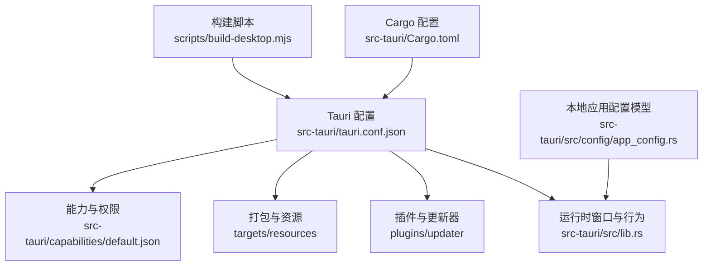
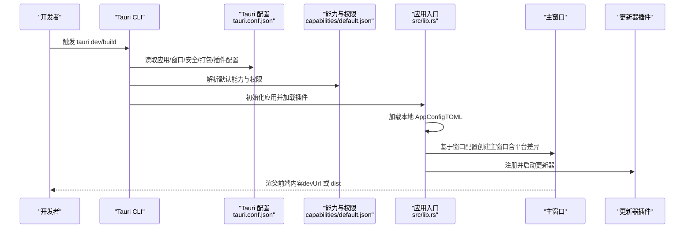
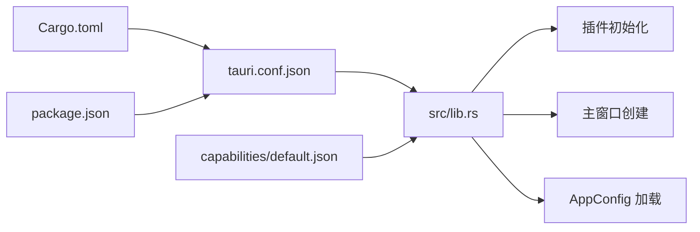

# 应用配置

<cite>
**本文引用的文件**
- [src-tauri/tauri.conf.json](file://src-tauri/tauri.conf.json)
- [src-tauri/Cargo.toml](file://src-tauri/Cargo.toml)
- [src-tauri/tauri.unsigned.conf.json](file://src-tauri/tauri.unsigned.conf.json)
- [src-tauri/tauri.windows.bundle-check.conf.json](file://src-tauri/tauri.windows.bundle-check.conf.json)
- [src-tauri/capabilities/default.json](file://src-tauri/capabilities/default.json)
- [src-tauri/src/lib.rs](file://src-tauri/src/lib.rs)
- [src-tauri/src/config/app_config.rs](file://src-tauri/src/config/app_config.rs)
- [src-tauri/build.rs](file://src-tauri/build.rs)
- [scripts/build-desktop.mjs](file://scripts/build-desktop.mjs)
- [package.json](file://package.json)
</cite>

## 目录
1. [简介](#简介)
2. [项目结构](#项目结构)
3. [核心组件](#核心组件)
4. [架构总览](#架构总览)
5. [详细组件分析](#详细组件分析)
6. [依赖分析](#依赖分析)
7. [性能考虑](#性能考虑)
8. [故障排查指南](#故障排查指南)
9. [结论](#结论)
10. [附录](#附录)

## 简介
本文件为 Panes 桌面应用的“应用配置”参考文档，聚焦于 Tauri 配置文件中的应用级配置项，覆盖应用标识与版本、窗口与界面、安全与 CSP、打包与资源、插件与更新器等主题，并补充应用运行时的本地配置模型（AppConfig）。文档同时提供配置验证方法与常见问题的解决建议，帮助开发者在不同平台（macOS、Windows、Linux）上正确配置与调试。

## 项目结构
与应用配置直接相关的关键文件与职责如下：
- Tauri 应用配置：定义产品名、版本、标识、开发/构建入口、窗口与安全策略、打包目标与资源、插件等。
- 能力与权限：声明默认能力与权限集合，决定前端可调用的系统能力范围。
- 运行时本地配置：定义应用内通用设置（主题、默认引擎/模型、通知、UI 尺寸、电源策略等），以 TOML 存储。
- 构建与打包：通过 CLI 脚本与 Cargo 集成，确保前端产物与侧车服务就绪后进行打包。

图表来源
- [src-tauri/tauri.conf.json:1-58](file://src-tauri/tauri.conf.json#L1-L58)
- [src-tauri/capabilities/default.json:1-23](file://src-tauri/capabilities/default.json#L1-L23)
- [src-tauri/src/lib.rs:108-155](file://src-tauri/src/lib.rs#L108-L155)
- [src-tauri/src/config/app_config.rs:14-204](file://src-tauri/src/config/app_config.rs#L14-L204)
- [scripts/build-desktop.mjs:1-71](file://scripts/build-desktop.mjs#L1-L71)
- [src-tauri/Cargo.toml:1-67](file://src-tauri/Cargo.toml#L1-L67)

章节来源
- [src-tauri/tauri.conf.json:1-58](file://src-tauri/tauri.conf.json#L1-L58)
- [src-tauri/Cargo.toml:1-67](file://src-tauri/Cargo.toml#L1-L67)
- [src-tauri/capabilities/default.json:1-23](file://src-tauri/capabilities/default.json#L1-L23)
- [src-tauri/src/lib.rs:108-155](file://src-tauri/src/lib.rs#L108-L155)
- [src-tauri/src/config/app_config.rs:14-204](file://src-tauri/src/config/app_config.rs#L14-L204)
- [scripts/build-desktop.mjs:1-71](file://scripts/build-desktop.mjs#L1-L71)

## 核心组件
- 应用元数据与构建入口
  - 产品名、版本、标识符用于包管理与系统识别。
  - 开发命令、构建命令、开发 URL 与前端产物路径用于本地联调与打包。
- 窗口与界面
  - 主窗口尺寸、最小尺寸、是否可调整大小、装饰风格、标题栏样式、隐藏标题等。
  - Linux/Windows 平台会移除原生装饰以启用自绘窗口框架。
- 安全与 CSP
  - 当前配置中 CSP 显式设为禁用（空值），需结合业务场景评估风险。
- 打包与资源
  - 启用打包、目标平台、资源目录、图标清单、更新器产物生成开关。
  - 提供“无签名配置”与“仅 Windows 安装包检查配置”，便于 CI/CD 场景切换。
- 插件与更新器
  - 更新器端点、安装模式、公钥校验等。
- 运行时本地配置（AppConfig）
  - 通用设置（主题、默认引擎/模型、语言、终端加速渲染、通知）、UI 设置（侧边栏宽度、Git 面板宽度、字体大小）、调试设置、电源策略（保持唤醒、防止休眠/屏保、电池阈值、会话时长等）。

章节来源
- [src-tauri/tauri.conf.json:3-11](file://src-tauri/tauri.conf.json#L3-L11)
- [src-tauri/tauri.conf.json:14-30](file://src-tauri/tauri.conf.json#L14-L30)
- [src-tauri/tauri.conf.json:32-46](file://src-tauri/tauri.conf.json#L32-L46)
- [src-tauri/tauri.conf.json:47-56](file://src-tauri/tauri.conf.json#L47-L56)
- [src-tauri/src/lib.rs:118-123](file://src-tauri/src/lib.rs#L118-L123)
- [src-tauri/src/config/app_config.rs:14-138](file://src-tauri/src/config/app_config.rs#L14-L138)

## 架构总览
下图展示从配置到运行时窗口创建的整体流程，以及本地配置加载与插件初始化的关系。

图表来源
- [src-tauri/tauri.conf.json:12-56](file://src-tauri/tauri.conf.json#L12-L56)
- [src-tauri/capabilities/default.json:1-23](file://src-tauri/capabilities/default.json#L1-L23)
- [src-tauri/src/lib.rs:98-180](file://src-tauri/src/lib.rs#L98-L180)
- [src-tauri/src/config/app_config.rs:153-204](file://src-tauri/src/config/app_config.rs#L153-L204)

## 详细组件分析

### 应用标识与版本
- 字段
  - productName：应用显示名称（如“Panes”）。
  - version：应用版本号（与 Cargo 与 package.json 版本一致）。
  - identifier：应用标识符（如“com.panes.app”），用于系统识别与签名。
- 默认值与取值范围
  - 名称与标识符为字符串；版本为语义化版本字符串。
- 配置示例路径
  - [应用元数据段落:3-5](file://src-tauri/tauri.conf.json#L3-L5)
- 验证方法
  - 在本地运行 tauri dev/build 后，确认窗口标题与系统任务栏/Dock 中显示的应用名一致。
  - 对比 Cargo 与 package.json 的版本字段，确保三处一致。

章节来源
- [src-tauri/tauri.conf.json:3-5](file://src-tauri/tauri.conf.json#L3-L5)
- [src-tauri/Cargo.toml:2-4](file://src-tauri/Cargo.toml#L2-L4)
- [package.json:2-4](file://package.json#L2-L4)

### 构建与开发入口
- 字段
  - beforeDevCommand：开发前执行脚本（如启动 Vite）。
  - beforeBuildCommand：构建前执行脚本（如预构建前端与侧车）。
  - devUrl：开发时前端地址。
  - frontendDist：生产构建输出目录。
- 默认值与取值范围
  - 命令为字符串；路径为相对或绝对路径。
- 配置示例路径
  - [构建入口段落:6-11](file://src-tauri/tauri.conf.json#L6-L11)
- 验证方法
  - 使用脚本确保 dist 与 sidecar-dist 已生成后再执行 tauri build。
  - 若 devUrl 不可达，窗口将无法加载前端页面。

章节来源
- [src-tauri/tauri.conf.json:6-11](file://src-tauri/tauri.conf.json#L6-L11)
- [scripts/build-desktop.mjs:19-32](file://scripts/build-desktop.mjs#L19-L32)

### 窗口与界面配置
- 字段
  - create：是否在启动时创建该窗口（通常由代码创建）。
  - title：窗口标题。
  - width/height/minWidth/minHeight：初始与最小尺寸。
  - resizable：是否允许用户调整大小。
  - decorations：是否显示原生装饰（macOS/Linux 上受平台影响）。
  - titleBarStyle：标题栏样式（如 Overlay）。
  - hiddenTitle：是否隐藏标题文本。
- 平台差异
  - Linux/Windows：运行时会强制关闭原生装饰，以便使用自绘窗口框架。
- 配置示例路径
  - [窗口配置段落:14-27](file://src-tauri/tauri.conf.json#L14-L27)
  - [运行时平台处理段落:118-123](file://src-tauri/src/lib.rs#L118-L123)
- 验证方法
  - 在各平台启动后检查窗口尺寸、标题栏样式与装饰是否符合预期。
  - Linux/Windows 下应呈现自绘控制按钮与拖拽区域。

章节来源
- [src-tauri/tauri.conf.json:14-27](file://src-tauri/tauri.conf.json#L14-L27)
- [src-tauri/src/lib.rs:118-123](file://src-tauri/src/lib.rs#L118-L123)

### 安全与 CSP
- 字段
  - csp：内容安全策略。当前显式设为禁用（空值）。
- 风险提示
  - 禁用 CSP 可能导致跨站脚本等风险，建议在生产环境明确配置 CSP。
- 配置示例路径
  - [安全配置段落:28-30](file://src-tauri/tauri.conf.json#L28-L30)
- 验证方法
  - 在浏览器开发者工具中检查响应头与页面源码，确认 CSP 是否生效。
  - 如需启用，可在前端注入策略或通过 Tauri 插件/中间层设置。

章节来源
- [src-tauri/tauri.conf.json:28-30](file://src-tauri/tauri.conf.json#L28-L30)

### 打包与资源
- 字段
  - active：是否启用打包。
  - targets：目标平台（如 app/dmg/deb/appimage/nsis）。
  - resources：随包携带的资源目录（如 sidecar-dist）。
  - icon：多分辨率图标列表。
  - createUpdaterArtifacts：是否生成更新器产物。
- 配置示例路径
  - [打包配置段落:32-46](file://src-tauri/tauri.conf.json#L32-L46)
  - [无签名配置片段:1-6](file://src-tauri/tauri.unsigned.conf.json#L1-L6)
  - [Windows 安装包检查配置片段:1-7](file://src-tauri/tauri.windows.bundle-check.conf.json#L1-L7)
- 验证方法
  - 构建后检查对应平台产物是否存在。
  - 确认图标与 sidecar 资源已包含在包内。

章节来源
- [src-tauri/tauri.conf.json:32-46](file://src-tauri/tauri.conf.json#L32-L46)
- [src-tauri/tauri.unsigned.conf.json:1-6](file://src-tauri/tauri.unsigned.conf.json#L1-L6)
- [src-tauri/tauri.windows.bundle-check.conf.json:1-7](file://src-tauri/tauri.windows.bundle-check.conf.json#L1-L7)

### 插件与更新器
- 字段
  - endpoints：更新器检查更新的 JSON 端点。
  - dialog：是否弹出更新对话框。
  - windows.installMode：Windows 安装模式（如 passive）。
  - pubkey：更新器公钥，用于校验更新包签名。
- 配置示例路径
  - [更新器配置段落:47-56](file://src-tauri/tauri.conf.json#L47-L56)
- 验证方法
  - 发布新版本后，检查更新器是否能正确拉取并提示更新。
  - 确认公钥与签名匹配，避免伪造更新。

章节来源
- [src-tauri/tauri.conf.json:47-56](file://src-tauri/tauri.conf.json#L47-L56)

### 能力与权限
- 字段
  - identifier：能力标识。
  - permissions：权限列表（如窗口操作、文件读取、对话框、通知、更新器、进程重启等）。
- 配置示例路径
  - [默认能力与权限:1-23](file://src-tauri/capabilities/default.json#L1-L23)
- 验证方法
  - 在前端调用受限 API 时，若权限未授予则会失败；可通过能力配置增删权限项。

章节来源
- [src-tauri/capabilities/default.json:1-23](file://src-tauri/capabilities/default.json#L1-L23)

### 运行时本地配置（AppConfig）
- 数据模型
  - general：通用设置（主题、默认引擎/模型、语言、终端加速渲染、通知、通知声音等）。
  - ui：界面设置（侧边栏宽度、Git 面板宽度、字体大小）。
  - debug：调试设置（持久化引擎事件日志、最大动作输出字符数）。
  - power：电源策略（保持唤醒、防止显示休眠/屏保、仅交流供电、电池阈值、会话时长、关闭显示器时保持唤醒）。
- 默认值与行为
  - 多数布尔与数值字段有默认值；通知声音根据平台返回默认值。
  - 未设置的可选字段在序列化时会被省略。
- 配置示例路径
  - [配置结构与默认实现:14-138](file://src-tauri/src/config/app_config.rs#L14-L138)
  - [加载/保存逻辑与平台默认:153-204](file://src-tauri/src/config/app_config.rs#L153-L204)
- 验证方法
  - 修改配置后重新启动应用，确认 UI 与功能按预期变化。
  - 检查配置文件是否按预期生成与更新。

章节来源
- [src-tauri/src/config/app_config.rs:14-138](file://src-tauri/src/config/app_config.rs#L14-L138)
- [src-tauri/src/config/app_config.rs:153-204](file://src-tauri/src/config/app_config.rs#L153-L204)

### 构建与打包流程
- 关键步骤
  - 预检：确保 dist 与 sidecar-dist 已存在。
  - 构建：先构建前端，再构建 Claude 侧车。
  - 打包：根据 tauri.conf.json 的 targets 生成对应平台包。
- 配置示例路径
  - [构建脚本:1-71](file://scripts/build-desktop.mjs#L1-L71)
  - [Cargo 集成与图标变更监听:1-20](file://src-tauri/build.rs#L1-L20)
- 验证方法
  - 构建日志中确认 dist 与 sidecar 产物存在。
  - 打包完成后检查各平台包是否生成。

章节来源
- [scripts/build-desktop.mjs:1-71](file://scripts/build-desktop.mjs#L1-L71)
- [src-tauri/build.rs:1-20](file://src-tauri/build.rs#L1-L20)

## 依赖分析
- 配置到运行时的耦合
  - tauri.conf.json 决定窗口、安全、打包与插件；capabilities/default.json 决定权限；src/lib.rs 负责窗口创建与插件初始化；AppConfig 提供本地配置。
- 外部依赖
  - Cargo.toml 声明 Tauri 与各插件版本；package.json 提供前端脚本与依赖。
- 循环依赖
  - 配置文件之间无循环依赖；运行时模块按需引入配置。

图表来源
- [src-tauri/tauri.conf.json:1-58](file://src-tauri/tauri.conf.json#L1-L58)
- [src-tauri/capabilities/default.json:1-23](file://src-tauri/capabilities/default.json#L1-L23)
- [src-tauri/src/lib.rs:98-180](file://src-tauri/src/lib.rs#L98-L180)
- [src-tauri/src/config/app_config.rs:153-204](file://src-tauri/src/config/app_config.rs#L153-L204)
- [src-tauri/Cargo.toml:1-67](file://src-tauri/Cargo.toml#L1-L67)
- [package.json:1-89](file://package.json#L1-L89)

章节来源
- [src-tauri/tauri.conf.json:1-58](file://src-tauri/tauri.conf.json#L1-L58)
- [src-tauri/capabilities/default.json:1-23](file://src-tauri/capabilities/default.json#L1-L23)
- [src-tauri/src/lib.rs:98-180](file://src-tauri/src/lib.rs#L98-L180)
- [src-tauri/src/config/app_config.rs:153-204](file://src-tauri/src/config/app_config.rs#L153-L204)
- [src-tauri/Cargo.toml:1-67](file://src-tauri/Cargo.toml#L1-L67)
- [package.json:1-89](file://package.json#L1-L89)

## 性能考虑
- 窗口与渲染
  - Linux/Windows 移除原生装饰以启用自绘框架，可能带来额外绘制开销；可通过减少复杂 UI 或降低动画频率优化。
- 打包体积
  - 控制 icons 与 sidecar-dist 的数量与大小，避免不必要的资源进入最终包。
- 更新器
  - 合理设置 installMode 与 endpoints，避免频繁检查更新造成网络与 CPU 占用。

## 故障排查指南
- 开发时前端无法加载
  - 检查 devUrl 是否可达；确认 scripts/build-desktop.mjs 已生成 dist 与 sidecar-dist。
  - 参考：[构建入口与脚本:6-11](file://src-tauri/tauri.conf.json#L6-L11)，[构建脚本:19-32](file://scripts/build-desktop.mjs#L19-L32)。
- 窗口尺寸或装饰异常
  - Linux/Windows 平台装饰被强制关闭；确认自绘控制按钮与拖拽区域是否正常。
  - 参考：[窗口配置:14-27](file://src-tauri/tauri.conf.json#L14-L27)，[平台处理:118-123](file://src-tauri/src/lib.rs#L118-L123)。
- 更新器不工作
  - 检查 endpoints、pubkey 与安装模式；确认网络可达且签名有效。
  - 参考：[更新器配置:47-56](file://src-tauri/tauri.conf.json#L47-L56)。
- 权限不足导致 API 调用失败
  - 在 capabilities/default.json 中添加所需权限。
  - 参考：[默认能力与权限:1-23](file://src-tauri/capabilities/default.json#L1-L23)。
- CSP 导致脚本加载失败
  - 当前 CSP 设为空（禁用），建议在生产环境配置合理 CSP。
  - 参考：[安全配置:28-30](file://src-tauri/tauri.conf.json#L28-L30)。

章节来源
- [src-tauri/tauri.conf.json:6-11](file://src-tauri/tauri.conf.json#L6-L11)
- [scripts/build-desktop.mjs:19-32](file://scripts/build-desktop.mjs#L19-L32)
- [src-tauri/src/lib.rs:118-123](file://src-tauri/src/lib.rs#L118-L123)
- [src-tauri/tauri.conf.json:47-56](file://src-tauri/tauri.conf.json#L47-L56)
- [src-tauri/capabilities/default.json:1-23](file://src-tauri/capabilities/default.json#L1-L23)
- [src-tauri/tauri.conf.json:28-30](file://src-tauri/tauri.conf.json#L28-L30)

## 结论
本文对 Panes 的 Tauri 应用配置进行了全面梳理，覆盖应用标识、版本、窗口与界面、安全与 CSP、打包与资源、插件与更新器、能力与权限，以及运行时本地配置模型。建议在生产环境中完善 CSP、审慎配置权限与更新器，并在多平台验证窗口与打包结果，以获得稳定可靠的用户体验。

## 附录
- 配置验证清单
  - 确认 productName/version/identifier 一致且正确。
  - 确认 devUrl 与 frontendDist 正确，dist 与 sidecar-dist 存在。
  - 确认窗口尺寸、装饰与标题栏样式符合预期。
  - 确认 targets 与 icon 列表完整，打包产物齐全。
  - 确认 capabilities 权限满足前端需求。
  - 确认更新器 endpoints、pubkey、installMode 正确。
  - 确认 AppConfig 默认值与实际行为一致。