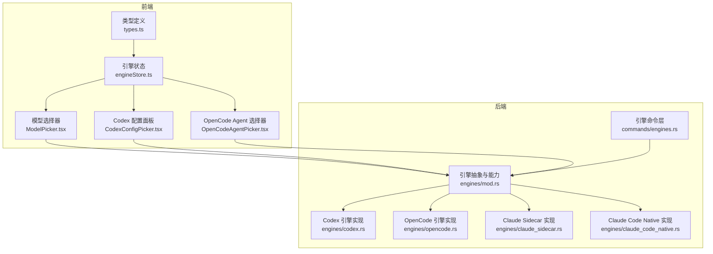
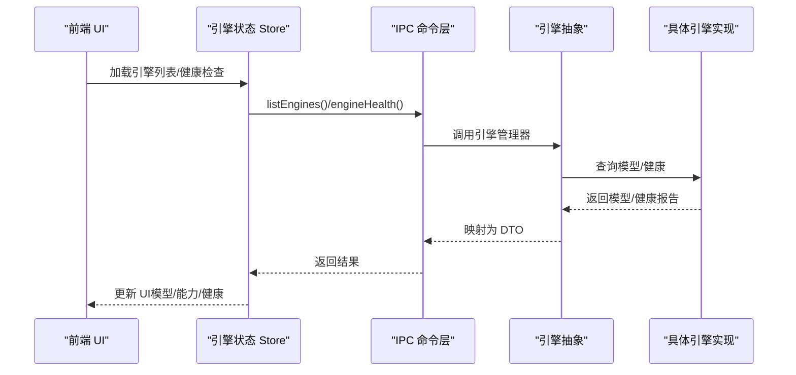
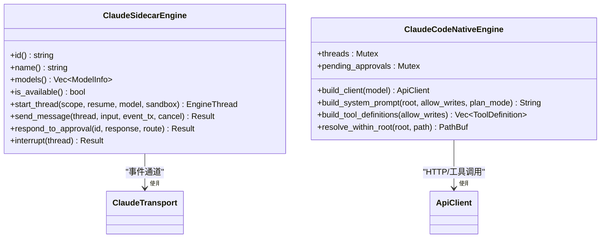
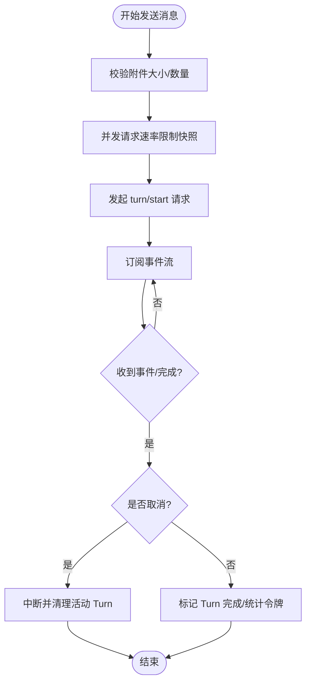
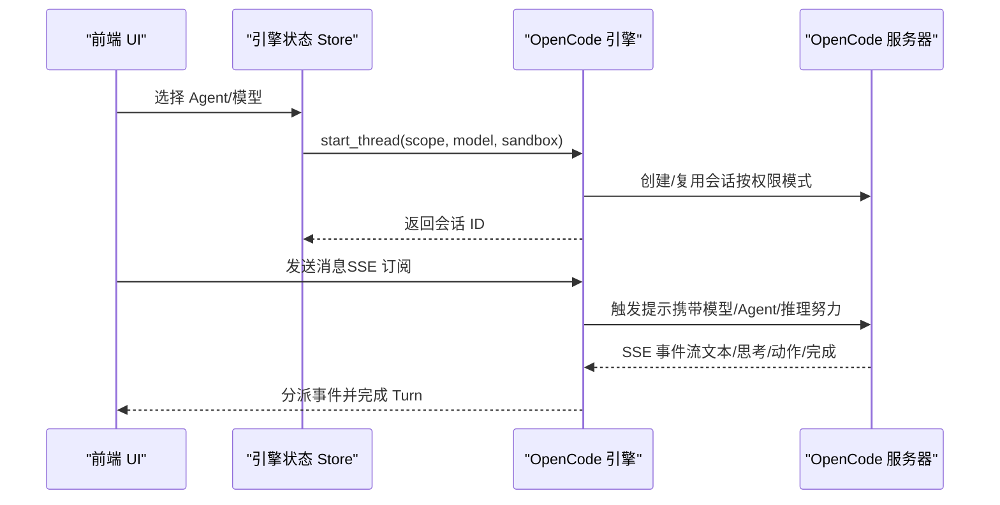
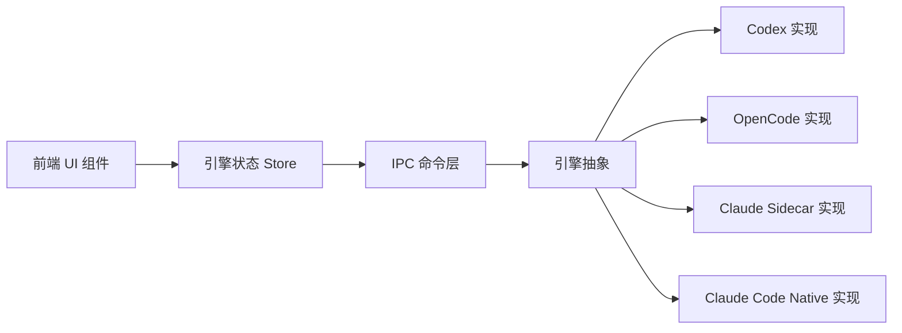

# 引擎配置

<cite>
**本文引用的文件**
- [chatEngineIds.ts](file://src/lib/chatEngineIds.ts)
- [engineStore.ts](file://src/stores/engineStore.ts)
- [ModelPicker.tsx](file://src/components/chat/ModelPicker.tsx)
- [CodexConfigPicker.tsx](file://src/components/chat/CodexConfigPicker.tsx)
- [OpenCodeAgentPicker.tsx](file://src/components/chat/OpenCodeAgentPicker.tsx)
- [types.ts](file://src/types.ts)
- [engines/mod.rs](file://src-tauri/src/engines/mod.rs)
- [engines/codex.rs](file://src-tauri/src/engines/codex.rs)
- [engines/opencode.rs](file://src-tauri/src/engines/opencode.rs)
- [engines/claude_sidecar.rs](file://src-tauri/src/engines/claude_sidecar.rs)
- [engines/claude_code_native.rs](file://src-tauri/src/engines/claude_code_native.rs)
- [commands/engines.rs](file://src-tauri/src/commands/engines.rs)
- [chatStore.ts](file://src/stores/chatStore.ts)
</cite>

## 目录
1. [简介](#简介)
2. [项目结构](#项目结构)
3. [核心组件](#核心组件)
4. [架构总览](#架构总览)
5. [详细组件分析](#详细组件分析)
6. [依赖关系分析](#依赖关系分析)
7. [性能考量](#性能考量)
8. [故障排除指南](#故障排除指南)
9. [结论](#结论)
10. [附录](#附录)

## 简介
本文件为 Panes 中“AI 引擎配置”的综合参考文档，覆盖 Claude、Codex、OpenCode 等引擎的配置项、连接与认证、API 密钥管理、超时设置、高级参数（如温度、最大令牌数、系统提示词）、配置优先级与动态切换、以及配置验证与故障排除。内容基于前端 UI 组件与后端引擎实现进行梳理，帮助开发者与使用者理解并正确配置各引擎。

## 项目结构
围绕引擎配置的关键模块分布如下：
- 前端类型与状态
  - 类型定义：引擎能力、模型、健康检查、运行时诊断等
  - 存储：引擎发现、健康检查、运行时更新
  - UI 组件：模型选择器、Codex 配置面板、OpenCode Agent 选择器
- 后端引擎
  - 引擎抽象与能力映射
  - 各引擎实现：Codex、OpenCode、Claude Sidecar、Claude Code Native
  - IPC 命令：引擎健康检查执行

**图表来源**
- [types.ts:457-713](file://src/types.ts#L457-L713)
- [engineStore.ts:1-164](file://src/stores/engineStore.ts#L1-L164)
- [ModelPicker.tsx:263-662](file://src/components/chat/ModelPicker.tsx#L263-L662)
- [CodexConfigPicker.tsx:72-429](file://src/components/chat/CodexConfigPicker.tsx#L72-L429)
- [OpenCodeAgentPicker.tsx:49-168](file://src/components/chat/OpenCodeAgentPicker.tsx#L49-L168)
- [engines/mod.rs:463-553](file://src-tauri/src/engines/mod.rs#L463-L553)
- [engines/codex.rs:230-379](file://src-tauri/src/engines/codex.rs#L230-L379)
- [engines/opencode.rs:562-685](file://src-tauri/src/engines/opencode.rs#L562-L685)
- [engines/claude_sidecar.rs:180-200](file://src-tauri/src/engines/claude_sidecar.rs#L180-L200)
- [engines/claude_code_native.rs:64-92](file://src-tauri/src/engines/claude_code_native.rs#L64-L92)
- [commands/engines.rs:96-136](file://src-tauri/src/commands/engines.rs#L96-L136)

**章节来源**
- [types.ts:457-713](file://src/types.ts#L457-L713)
- [engineStore.ts:1-164](file://src/stores/engineStore.ts#L1-L164)
- [ModelPicker.tsx:263-662](file://src/components/chat/ModelPicker.tsx#L263-L662)
- [CodexConfigPicker.tsx:72-429](file://src/components/chat/CodexConfigPicker.tsx#L72-L429)
- [OpenCodeAgentPicker.tsx:49-168](file://src/components/chat/OpenCodeAgentPicker.tsx#L49-L168)
- [engines/mod.rs:463-553](file://src-tauri/src/engines/mod.rs#L463-L553)
- [engines/codex.rs:230-379](file://src-tauri/src/engines/codex.rs#L230-L379)
- [engines/opencode.rs:562-685](file://src-tauri/src/engines/opencode.rs#L562-L685)
- [engines/claude_sidecar.rs:180-200](file://src-tauri/src/engines/claude_sidecar.rs#L180-L200)
- [engines/claude_code_native.rs:64-92](file://src-tauri/src/engines/claude_code_native.rs#L64-L92)
- [commands/engines.rs:96-136](file://src-tauri/src/commands/engines.rs#L96-L136)

## 核心组件
- 引擎能力与模型
  - 引擎能力：权限模式、沙箱模式、审批决策集合
  - 模型信息：输入模态、附件模态、上下文/输入/输出令牌限制、推理努力级别
- 引擎健康与运行时诊断
  - 健康报告：可用性、版本、细节、警告、检查项、修复建议、协议诊断
  - 运行时更新事件：用于刷新 UI 与策略
- 前端配置入口
  - 模型选择器：按引擎分组展示模型，支持 OpenCode 提供商树形浏览
  - Codex 配置面板：个性化人格、服务等级、输出 Schema、审批策略
  - OpenCode Agent 选择器：选择 Agent 并绑定模型

**章节来源**
- [engines/mod.rs:114-157](file://src-tauri/src/engines/mod.rs#L114-L157)
- [types.ts:457-518](file://src/types.ts#L457-L518)
- [types.ts:470-507](file://src/types.ts#L470-L507)
- [types.ts:509-518](file://src/types.ts#L509-L518)
- [ModelPicker.tsx:116-141](file://src/components/chat/ModelPicker.tsx#L116-L141)
- [CodexConfigPicker.tsx:6-15](file://src/components/chat/CodexConfigPicker.tsx#L6-L15)
- [OpenCodeAgentPicker.tsx:14-37](file://src/components/chat/OpenCodeAgentPicker.tsx#L14-L37)

## 架构总览
引擎配置贯穿“前端 UI → IPC 命令 → 引擎抽象 → 具体引擎实现”的链路。前端通过 Store 获取引擎清单与健康状态，UI 组件根据模型与能力渲染配置项；后端引擎负责实际的连接、认证、超时与流式事件处理。

**图表来源**
- [engineStore.ts:29-57](file://src/stores/engineStore.ts#L29-L57)
- [engineStore.ts:58-115](file://src/stores/engineStore.ts#L58-L115)
- [engines/mod.rs:484-553](file://src-tauri/src/engines/mod.rs#L484-L553)
- [engines/mod.rs:555-615](file://src-tauri/src/engines/mod.rs#L555-L615)
- [commands/engines.rs:96-136](file://src-tauri/src/commands/engines.rs#L96-L136)

## 详细组件分析

### Claude 引擎配置
- 引擎标识与识别
  - 识别“Claude 家族”引擎（含原生与 Sidecar）
- 连接与认证
  - Sidecar 模式通过本地进程启动与事件通道交互
  - 原生模式通过 claude-code-rs 库与后端通信，配置来源于库设置
- 高级参数
  - 推理努力级别（reasoning effort）：通过模型支持列表与默认值协商
  - 系统提示词：结合工作目录、工具集与只读/可写沙箱生成
- 超时与流式
  - 事件泵、取消令牌、Turn 完成判定与错误恢复
- 配置优先级
  - UI 请求的推理努力优先于模型默认值；若不支持则回退到默认或首个可用值

**图表来源**
- [engines/claude_sidecar.rs:180-200](file://src-tauri/src/engines/claude_sidecar.rs#L180-L200)
- [engines/claude_code_native.rs:64-92](file://src-tauri/src/engines/claude_code_native.rs#L64-L92)
- [engines/claude_code_native.rs:103-146](file://src-tauri/src/engines/claude_code_native.rs#L103-L146)
- [engines/claude_code_native.rs:150-165](file://src-tauri/src/engines/claude_code_native.rs#L150-L165)

**章节来源**
- [chatEngineIds.ts:3-7](file://src/lib/chatEngineIds.ts#L3-L7)
- [engines/claude_sidecar.rs:180-200](file://src-tauri/src/engines/claude_sidecar.rs#L180-L200)
- [engines/claude_code_native.rs:64-92](file://src-tauri/src/engines/claude_code_native.rs#L64-L92)
- [engines/claude_code_native.rs:103-146](file://src-tauri/src/engines/claude_code_native.rs#L103-L146)
- [engines/claude_code_native.rs:150-165](file://src-tauri/src/engines/claude_code_native.rs#L150-L165)

### Codex 引擎配置
- 引擎能力与模型
  - 支持多种模型（如 gpt-5.4、gpt-5.3-codex 等），具备推理努力级别与附件模态
- 连接与认证
  - 通过可执行文件与传输层交互；支持速率限制查询与认证失败重置
- 高级参数
  - 服务等级（fast/flex）、个性化（none/友好/务实）、输出 Schema、审批策略
  - 沙箱模式、权限配置、理由努力级别、个性、输出 Schema
- 超时与流式
  - 初始化、Turn 开始、轮询与事件订阅均有超时控制；支持中断与恢复
- 配置优先级
  - UI 请求的推理努力优先；若不支持则回退到模型默认值或首个可用值

**图表来源**
- [engines/codex.rs:524-750](file://src-tauri/src/engines/codex.rs#L524-L750)
- [engines/codex.rs:750-8232](file://src-tauri/src/engines/codex.rs#L750-L8232)

**章节来源**
- [engines/codex.rs:230-379](file://src-tauri/src/engines/codex.rs#L230-L379)
- [engines/codex.rs:381-522](file://src-tauri/src/engines/codex.rs#L381-L522)
- [engines/codex.rs:524-750](file://src-tauri/src/engines/codex.rs#L524-L750)
- [engines/codex.rs:750-8232](file://src-tauri/src/engines/codex.rs#L750-L8232)

### OpenCode 引擎配置
- 引擎能力与模型
  - 默认模型与推理努力级别；支持提供商/模型格式
- 连接与认证
  - 本地 HTTP 服务器托管，SSE 事件流；支持权限模式（ask/allow/deny）
- 高级参数
  - Agent（build/plan 等）、推理努力级别、模型提供商/模型组合
- 超时与流式
  - SSE 空闲超时、事件总线、Turn 完成判定与错误恢复
- 配置优先级
  - UI 请求的 Agent/推理努力优先；若不支持则回退到默认或首个可用值

**图表来源**
- [engines/opencode.rs:562-685](file://src-tauri/src/engines/opencode.rs#L562-L685)
- [engines/opencode.rs:687-8232](file://src-tauri/src/engines/opencode.rs#L687-L8232)

**章节来源**
- [engines/opencode.rs:562-685](file://src-tauri/src/engines/opencode.rs#L562-L685)
- [engines/opencode.rs:687-8232](file://src-tauri/src/engines/opencode.rs#L687-L8232)

### 引擎通用配置入口与优先级
- 模型选择器
  - 按引擎分组展示模型；OpenCode 支持按提供商树形浏览与搜索
- Codex 配置面板
  - 支持个性化、服务等级、输出 Schema、审批策略的编辑与保存
- OpenCode Agent 选择器
  - 选择 Agent 并绑定模型
- 推理努力优先级
  - UI 请求值优先；若不被模型支持，则回退到模型默认值或首个可用值

**章节来源**
- [ModelPicker.tsx:116-141](file://src/components/chat/ModelPicker.tsx#L116-L141)
- [ModelPicker.tsx:373-400](file://src/components/chat/ModelPicker.tsx#L373-L400)
- [CodexConfigPicker.tsx:72-429](file://src/components/chat/CodexConfigPicker.tsx#L72-L429)
- [OpenCodeAgentPicker.tsx:14-37](file://src/components/chat/OpenCodeAgentPicker.tsx#L14-L37)
- [chatStore.ts:40-58](file://src/stores/chatStore.ts#L40-L58)

## 依赖关系分析
- 前端对后端的依赖
  - Store 依赖 IPC 列出引擎与查询健康
  - UI 组件依赖类型定义与能力映射
- 后端引擎间的关系
  - 引擎抽象统一对外接口，具体实现各自处理认证、超时与事件
- 外部集成点
  - Claude Sidecar 依赖本地 Node/SDK
  - OpenCode 依赖本地 HTTP 服务器
  - Codex 依赖外部可执行与传输层

**图表来源**
- [engineStore.ts:29-57](file://src/stores/engineStore.ts#L29-L57)
- [engines/mod.rs:463-553](file://src-tauri/src/engines/mod.rs#L463-L553)

**章节来源**
- [engineStore.ts:29-57](file://src/stores/engineStore.ts#L29-L57)
- [engines/mod.rs:463-553](file://src-tauri/src/engines/mod.rs#L463-L553)

## 性能考量
- 超时与背压
  - 各引擎对初始化、Turn、SSE 等场景设置了超时，避免阻塞
- 流式事件批处理
  - 前端对流式事件进行批量与延迟刷新，降低渲染压力
- 令牌统计与上下文窗口
  - 各引擎提供令牌用量与上下文限制，便于控制成本与避免溢出

**章节来源**
- [engines/codex.rs:72-84](file://src-tauri/src/engines/codex.rs#L72-L84)
- [engines/opencode.rs:41-46](file://src-tauri/src/engines/opencode.rs#L41-L46)
- [chatStore.ts:65-88](file://src/stores/chatStore.ts#L65-L88)

## 故障排除指南
- 健康检查与诊断
  - 使用命令层执行检查命令，查看退出码、标准输出/错误与耗时
  - 引擎健康报告包含可用性、版本、细节、警告、检查项与修复建议
- 常见问题定位
  - 认证失败：Codex 在认证失败时会重置传输；Claude Sidecar 会在错误事件中指示
  - 沙箱拒绝：事件映射会触发外部沙箱强制；必要时调整权限模式
  - 超时与中断：Turn 超时或取消时应检查网络与资源限制
- 建议操作
  - 执行健康检查命令以确认环境
  - 查看协议诊断（Codex）以获取更详细的运行时信息
  - 在 UI 中重新选择模型/Agent 或调整推理努力级别

**章节来源**
- [commands/engines.rs:96-136](file://src-tauri/src/commands/engines.rs#L96-L136)
- [engines/mod.rs:555-615](file://src-tauri/src/engines/mod.rs#L555-L615)
- [engines/codex.rs:645-655](file://src-tauri/src/engines/codex.rs#L645-L655)
- [engines/claude_sidecar.rs:121-130](file://src-tauri/src/engines/claude_sidecar.rs#L121-L130)

## 结论
本文档系统化梳理了 Panes 中 Claude、Codex、OpenCode 引擎的配置要点，涵盖能力与模型、连接与认证、高级参数、超时与流式、优先级与动态切换、以及验证与故障排除。建议在生产环境中：
- 明确各引擎的认证方式与密钥管理策略
- 合理设置推理努力与令牌限制，平衡质量与成本
- 使用健康检查与协议诊断持续监控运行状态
- 在 UI 层通过模型选择器与配置面板进行可视化管理

## 附录

### 引擎能力与模型字段速查
- 引擎能力
  - 权限模式、沙箱模式、审批决策集合
- 模型信息
  - 输入模态、附件模态、上下文/输入/输出令牌限制、推理努力级别
- 健康与诊断
  - 可用性、版本、细节、警告、检查项、修复建议、协议诊断

**章节来源**
- [engines/mod.rs:114-157](file://src-tauri/src/engines/mod.rs#L114-L157)
- [types.ts:470-507](file://src/types.ts#L470-L507)
- [types.ts:509-518](file://src/types.ts#L509-L518)