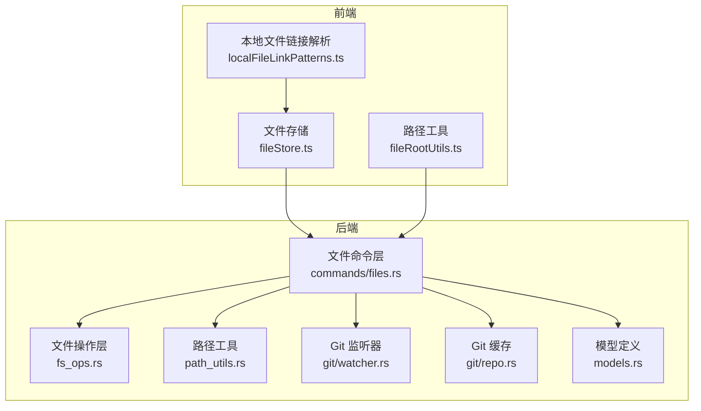
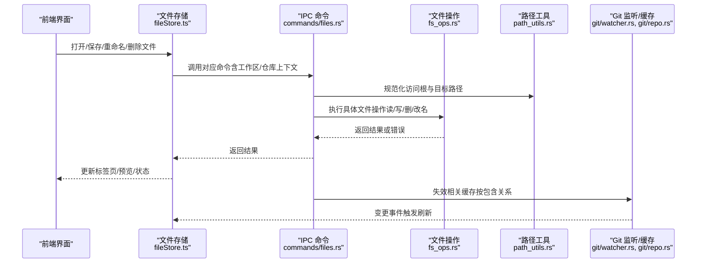
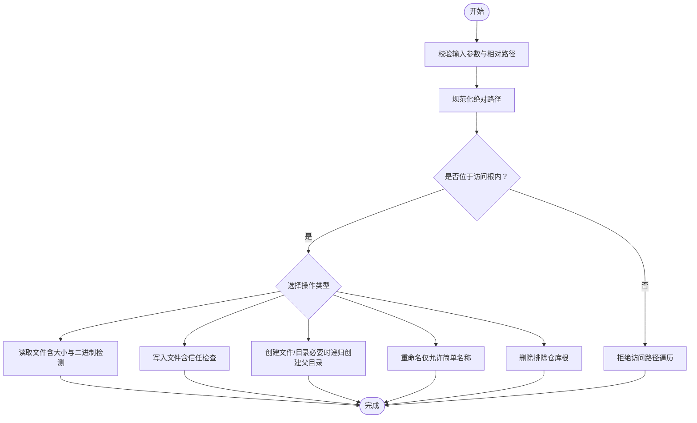
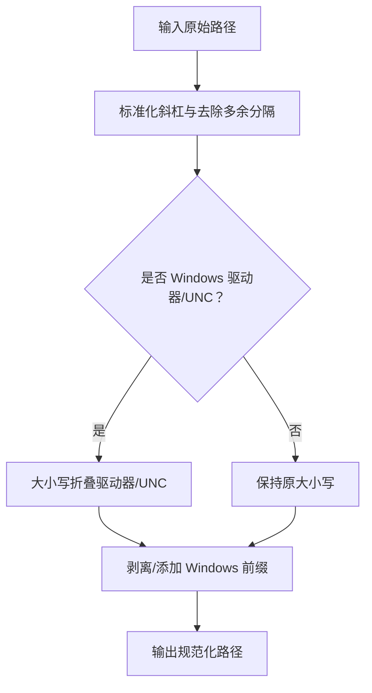
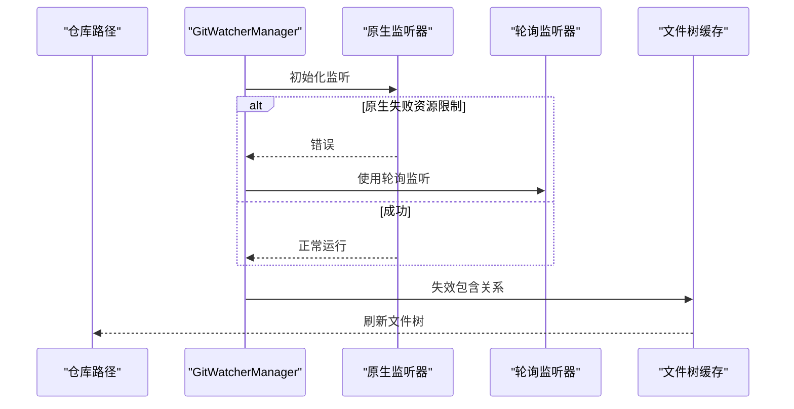
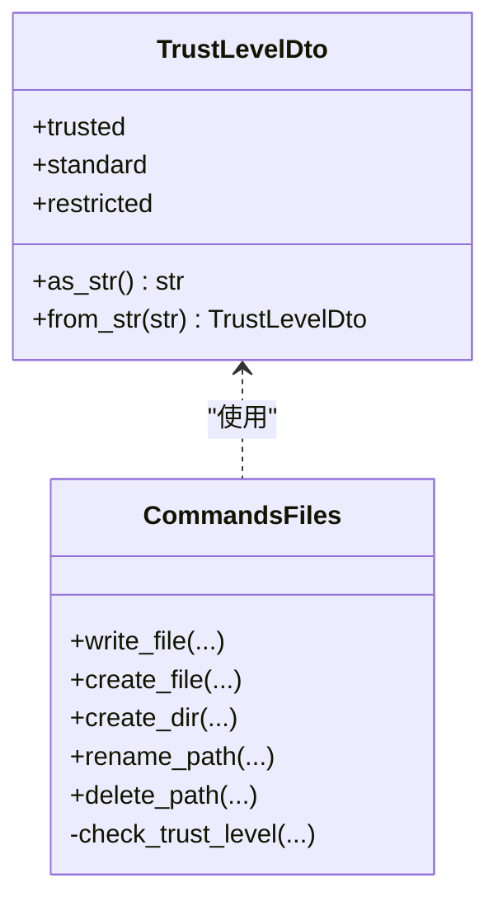
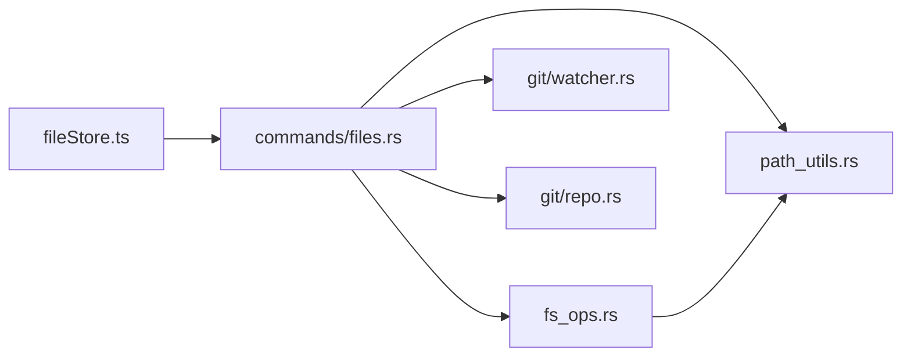

# 文件系统配置

<cite>
**本文引用的文件**
- [src-tauri/src/config/app_config.rs](file://src-tauri/src/config/app_config.rs)
- [src-tauri/src/fs_ops.rs](file://src-tauri/src/fs_ops.rs)
- [src-tauri/src/path_utils.rs](file://src-tauri/src/path_utils.rs)
- [src-tauri/src/commands/files.rs](file://src-tauri/src/commands/files.rs)
- [src-tauri/src/git/watcher.rs](file://src-tauri/src/git/watcher.rs)
- [src-tauri/src/git/repo.rs](file://src-tauri/src/git/repo.rs)
- [src-tauri/src/models.rs](file://src-tauri/src/models.rs)
- [src/lib/fileRootUtils.ts](file://src/lib/fileRootUtils.ts)
- [src/lib/localFileLinkPatterns.ts](file://src/lib/localFileLinkPatterns.ts)
- [src/lib/editorFileTypes.ts](file://src/lib/editorFileTypes.ts)
- [src/stores/fileStore.ts](file://src/stores/fileStore.ts)
- [src/stores/gitStore.ts](file://src/stores/gitStore.ts)
- [src-tauri/tauri.conf.json](file://src-tauri/tauri.conf.json)
</cite>

## 目录
1. [简介](#简介)
2. [项目结构](#项目结构)
3. [核心组件](#核心组件)
4. [架构总览](#架构总览)
5. [详细组件分析](#详细组件分析)
6. [依赖关系分析](#依赖关系分析)
7. [性能考量](#性能考量)
8. [故障排查指南](#故障排查指南)
9. [结论](#结论)
10. [附录](#附录)

## 简介
本文件系统配置参考文档聚焦于应用中与文件操作相关的配置与实现，涵盖以下主题：
- 文件访问权限与信任级别（Trust Level）
- 路径解析规则与跨平台路径规范化
- 文件类型关联与内容识别（二进制检测、扩展名判定）
- 安全文件操作（路径遍历防护、写入前信任检查、原子保存策略）
- 文件监控（Git 变更监听与降级策略）、缓存策略与临时文件管理
- 安全最佳实践、性能调优建议与常见问题解决方案
- 不同操作系统下的配置差异与兼容性说明

## 项目结构
围绕文件系统的关键模块分布如下：
- 后端（Rust）：命令层负责 IPC 调用与安全校验；文件操作层提供路径校验、读写、重命名、删除等；路径工具提供跨平台路径规范化；Git 监听器负责变更事件；模型定义信任级别与仓库元数据。
- 前端（TypeScript）：文件存储负责打开/保存/重命名等交互；路径工具负责本地路径解析与相对路径推导；链接解析用于从文本中提取本地文件链接。

图表来源
- [src/stores/fileStore.ts](file://src/stores/fileStore.ts)
- [src-tauri/src/commands/files.rs](file://src-tauri/src/commands/files.rs)
- [src-tauri/src/fs_ops.rs](file://src-tauri/src/fs_ops.rs)
- [src-tauri/src/path_utils.rs](file://src-tauri/src/path_utils.rs)
- [src-tauri/src/git/watcher.rs](file://src-tauri/src/git/watcher.rs)
- [src-tauri/src/git/repo.rs](file://src-tauri/src/git/repo.rs)
- [src-tauri/src/models.rs](file://src-tauri/src/models.rs)

章节来源
- [src-tauri/src/commands/files.rs](file://src-tauri/src/commands/files.rs)
- [src-tauri/src/fs_ops.rs](file://src-tauri/src/fs_ops.rs)
- [src-tauri/src/path_utils.rs](file://src-tauri/src/path_utils.rs)
- [src-tauri/src/git/watcher.rs](file://src-tauri/src/git/watcher.rs)
- [src-tauri/src/git/repo.rs](file://src-tauri/src/git/repo.rs)
- [src-tauri/src/models.rs](file://src-tauri/src/models.rs)
- [src/stores/fileStore.ts](file://src/stores/fileStore.ts)
- [src/lib/fileRootUtils.ts](file://src/lib/fileRootUtils.ts)
- [src/lib/localFileLinkPatterns.ts](file://src/lib/localFileLinkPatterns.ts)

## 核心组件
- 配置与信任级别
  - 应用配置结构体包含通用、UI、调试与电源相关字段；信任级别在模型中以枚举形式定义，支持受信、标准、受限三种模式。
- 文件操作与安全
  - 提供目录列举、文件读取、创建、写入、重命名、删除等操作，并内置路径遍历检测、大小限制、二进制内容识别与写入前信任检查。
- 路径解析与规范化
  - 跨平台路径规范化（含 Windows 前缀处理）、路径包含判断、相对路径推导与本地文件链接解析。
- 文件监控与缓存
  - Git 变更监听（原生优先，遇限流回退轮询），文件树缓存（按根路径与包含关系失效），Git 状态与差异缓存（带容量与字节上限控制）。
- 类型关联与编码
  - 基于扩展名的 Markdown 预览判定；本地链接解析支持多种语法与定位标记。

章节来源
- [src-tauri/src/config/app_config.rs](file://src-tauri/src/config/app_config.rs)
- [src-tauri/src/models.rs](file://src-tauri/src/models.rs)
- [src-tauri/src/fs_ops.rs](file://src-tauri/src/fs_ops.rs)
- [src-tauri/src/path_utils.rs](file://src-tauri/src/path_utils.rs)
- [src/lib/fileRootUtils.ts](file://src/lib/fileRootUtils.ts)
- [src/lib/localFileLinkPatterns.ts](file://src/lib/localFileLinkPatterns.ts)
- [src/lib/editorFileTypes.ts](file://src/lib/editorFileTypes.ts)
- [src-tauri/src/git/watcher.rs](file://src-tauri/src/git/watcher.rs)
- [src-tauri/src/git/repo.rs](file://src-tauri/src/git/repo.rs)
- [src/stores/gitStore.ts](file://src/stores/gitStore.ts)

## 架构总览
下图展示文件操作从 UI 到后端命令、再到文件系统与 Git 监控的整体流程。

图表来源
- [src/stores/fileStore.ts](file://src/stores/fileStore.ts)
- [src-tauri/src/commands/files.rs](file://src-tauri/src/commands/files.rs)
- [src-tauri/src/fs_ops.rs](file://src-tauri/src/fs_ops.rs)
- [src-tauri/src/path_utils.rs](file://src-tauri/src/path_utils.rs)
- [src-tauri/src/git/watcher.rs](file://src-tauri/src/git/watcher.rs)
- [src-tauri/src/git/repo.rs](file://src-tauri/src/git/repo.rs)

## 详细组件分析

### 文件操作与安全（fs_ops.rs）
- 路径遍历防护
  - 目录列举与文件读取均对目标路径进行规范化与“是否位于仓库根内”的严格校验，拒绝任何越权访问尝试。
  - 创建/删除/重命名等操作在涉及父目录时，先验证最深存在的祖先是否位于仓库根内，再决定是否允许创建或删除。
- 写入前信任检查
  - 写入命令在执行前查询数据库，确定目标路径所属仓库的“信任级别”，若为受限则直接拒绝写入。
- 内容与大小限制
  - 文件读取限制最大打开大小；二进制内容通过扫描前若干字节判断，避免在编辑器中渲染二进制数据。
- 平台差异
  - 删除符号链接时，Windows 与非 Windows 的处理分支不同，确保正确删除符号链接而非其目标。
- 原子保存策略
  - 配置保存采用临时文件 + 替换的方式，Windows 下使用备份恢复策略保证崩溃后的可恢复性。

图表来源
- [src-tauri/src/fs_ops.rs](file://src-tauri/src/fs_ops.rs)
- [src-tauri/src/commands/files.rs](file://src-tauri/src/commands/files.rs)

章节来源
- [src-tauri/src/fs_ops.rs](file://src-tauri/src/fs_ops.rs)
- [src-tauri/src/commands/files.rs](file://src-tauri/src/commands/files.rs)

### 路径解析与规范化（path_utils.rs 与 fileRootUtils.ts）
- 跨平台路径规范化
  - Windows 前缀剥离与添加（UNC 与本地盘符），统一斜杠分隔，大小写处理遵循平台语义。
  - 提供“是否位于根内”的判断逻辑，支持大小写不敏感比较（Windows 驱动器路径与 UNC）。
- 本地文件链接解析
  - 支持 file://、http(s)、mailto、tel、绝对/相对路径与 UNC，以及行/列定位标记（#Ln 或 :n(:m)）。
  - 对扩展名与无扩展名文件名集合进行启发式识别，提升路径解析准确性。
- 相对路径推导
  - 在给定绝对路径与根路径的情况下，计算相对路径，用于 UI 展示与命令参数传递。

图表来源
- [src-tauri/src/path_utils.rs](file://src-tauri/src/path_utils.rs)
- [src/lib/fileRootUtils.ts](file://src/lib/fileRootUtils.ts)
- [src/lib/localFileLinkPatterns.ts](file://src/lib/localFileLinkPatterns.ts)

章节来源
- [src-tauri/src/path_utils.rs](file://src-tauri/src/path_utils.rs)
- [src/lib/fileRootUtils.ts](file://src/lib/fileRootUtils.ts)
- [src/lib/localFileLinkPatterns.ts](file://src/lib/localFileLinkPatterns.ts)

### 文件类型关联与编码（editorFileTypes.ts 与本地链接解析）
- Markdown 预览判定
  - 基于扩展名集合判断是否启用 Markdown 预览渲染。
- 本地链接解析
  - 统一的正则与启发式规则，支持多种本地链接格式与定位标记，便于在消息或富文本中快速打开文件。

章节来源
- [src/lib/editorFileTypes.ts](file://src/lib/editorFileTypes.ts)
- [src/lib/localFileLinkPatterns.ts](file://src/lib/localFileLinkPatterns.ts)

### 文件监控与缓存（git/watcher.rs 与 git/repo.rs）
- Git 监听
  - 优先使用推荐的原生监听器；当遇到系统资源限制（如 Linux 的 MaxFilesWatch）时自动回退到轮询监听，降低事件抖动。
  - 事件处理器对同一仓库在短时间内去抖，避免频繁刷新。
- 文件树缓存
  - 按仓库根路径缓存文件树，支持按包含关系失效（invalidate_containing_path），保证编辑器侧的实时性。
- Git 缓存
  - Git 状态与差异缓存具备条目数量与字节数上限，定期清理最旧条目，防止内存膨胀。

图表来源
- [src-tauri/src/git/watcher.rs](file://src-tauri/src/git/watcher.rs)
- [src-tauri/src/git/repo.rs](file://src-tauri/src/git/repo.rs)

章节来源
- [src-tauri/src/git/watcher.rs](file://src-tauri/src/git/watcher.rs)
- [src-tauri/src/git/repo.rs](file://src-tauri/src/git/repo.rs)
- [src/stores/gitStore.ts](file://src/stores/gitStore.ts)

### 信任级别与权限检查（models.rs 与 commands/files.rs）
- 信任级别
  - 受信（trusted）、标准（standard）、受限（restricted）三种模式，分别对应不同的访问与修改权限。
- 权限检查
  - 写入、创建、删除、重命名等命令在执行前会查询数据库，确认目标路径所属仓库的信任级别，受限仓库禁止修改类操作。

图表来源
- [src-tauri/src/models.rs](file://src-tauri/src/models.rs)
- [src-tauri/src/commands/files.rs](file://src-tauri/src/commands/files.rs)

章节来源
- [src-tauri/src/models.rs](file://src-tauri/src/models.rs)
- [src-tauri/src/commands/files.rs](file://src-tauri/src/commands/files.rs)

### 配置与安全（app_config.rs 与 tauri.conf.json）
- 应用配置
  - 包含通用、UI、调试与电源相关字段，默认值与序列化策略；提供通知声音的平台默认值处理。
- 安全策略
  - Tauri 配置中未设置 CSP，需结合运行环境与插件策略评估安全边界。

章节来源
- [src-tauri/src/config/app_config.rs](file://src-tauri/src/config/app_config.rs)
- [src-tauri/tauri.conf.json](file://src-tauri/tauri.conf.json)

## 依赖关系分析
- 前端到后端
  - 文件存储通过 IPC 调用后端命令；命令层负责信任检查与路径规范化，再委派至文件操作层。
- 后端内部
  - 命令层依赖路径工具、文件操作、Git 监听与缓存；文件操作层依赖路径工具与系统文件 API。
- 缓存与失效
  - 文件树缓存与 Git 缓存均支持基于路径包含关系的批量失效，确保一致性。

图表来源
- [src/stores/fileStore.ts](file://src/stores/fileStore.ts)
- [src-tauri/src/commands/files.rs](file://src-tauri/src/commands/files.rs)
- [src-tauri/src/fs_ops.rs](file://src-tauri/src/fs_ops.rs)
- [src-tauri/src/path_utils.rs](file://src-tauri/src/path_utils.rs)
- [src-tauri/src/git/watcher.rs](file://src-tauri/src/git/watcher.rs)
- [src-tauri/src/git/repo.rs](file://src-tauri/src/git/repo.rs)

章节来源
- [src/stores/fileStore.ts](file://src/stores/fileStore.ts)
- [src-tauri/src/commands/files.rs](file://src-tauri/src/commands/files.rs)
- [src-tauri/src/fs_ops.rs](file://src-tauri/src/fs_ops.rs)
- [src-tauri/src/path_utils.rs](file://src-tauri/src/path_utils.rs)
- [src-tauri/src/git/watcher.rs](file://src-tauri/src/git/watcher.rs)
- [src-tauri/src/git/repo.rs](file://src-tauri/src/git/repo.rs)

## 性能考量
- 文件读取
  - 设置最大打开大小限制，避免大文件占用过多内存；二进制检测减少不必要的解码成本。
- 监听与刷新
  - 原生监听优先，遇系统限制自动回退轮询；事件去抖减少频繁刷新。
- 缓存
  - 文件树缓存与 Git 缓存均设置条目数与字节上限，定期清理最旧项，平衡内存占用与命中率。
- 路径处理
  - 规范化与包含判断在前端与后端均有实现，建议在 UI 侧尽量复用前端路径工具，减少 IPC 往返。

## 故障排查指南
- 路径遍历被拒绝
  - 确认传入路径为仓库内的相对路径，且未包含上层目录片段；检查父目录是否存在且位于仓库根内。
- 写入被拒绝
  - 检查目标路径所属仓库的“信任级别”是否为受限；如为受限，需先提升信任级别。
- 无法打开/保存文件
  - 检查文件大小是否超过限制；确认文件未被外部修改导致冲突；查看日志中的错误信息。
- Git 监听无效或频繁刷新
  - 查看系统资源限制（Linux MaxFilesWatch）；确认监听器已正确回退到轮询模式；检查事件去抖窗口设置。
- 缓存异常
  - 触发按包含关系的缓存失效；确认缓存上限配置合理；必要时手动清理缓存。

章节来源
- [src-tauri/src/fs_ops.rs](file://src-tauri/src/fs_ops.rs)
- [src-tauri/src/commands/files.rs](file://src-tauri/src/commands/files.rs)
- [src-tauri/src/git/watcher.rs](file://src-tauri/src/git/watcher.rs)
- [src-tauri/src/git/repo.rs](file://src-tauri/src/git/repo.rs)
- [src/stores/gitStore.ts](file://src/stores/gitStore.ts)

## 结论
本文件系统配置围绕“安全优先、路径可控、缓存高效、监听稳健”的原则设计。通过严格的路径遍历检测、写入前信任检查、跨平台路径规范化、事件去抖与缓存上限控制，系统在多平台环境下提供了稳定可靠的文件操作体验。建议在生产环境中结合实际业务场景进一步细化信任级别策略与缓存参数。

## 附录

### 安全最佳实践
- 默认最小权限：将仓库设为受限，仅在确需时提升信任级别。
- 输入校验：始终使用相对路径并在服务端进行规范化与根目录校验。
- 原子写入：使用临时文件 + 替换策略，保障崩溃后的数据一致性。
- 监听降级：关注系统资源限制，确保在受限环境下仍能稳定运行。

### 性能调优建议
- 合理设置文件树缓存与 Git 缓存的上限，避免内存占用过高。
- 在高频写入场景下，适当增大事件去抖窗口，减少刷新频率。
- 对超大文件采用流式处理或外部工具链替代直接编辑。

### 不同操作系统下的差异与兼容性
- Windows
  - 路径前缀处理（UNC 与本地盘符）与符号链接删除行为与其他平台不同，需注意区分。
  - 配置保存在 Windows 下采用备份恢复策略，提高可靠性。
- Linux
  - 当达到系统监听上限时自动回退到轮询监听；注意文件描述符与 inode 限制。
- macOS
  - 通知声音默认值由平台决定；沙箱策略可能影响部分文件访问能力，必要时启用外部沙箱策略。

章节来源
- [src-tauri/src/fs_ops.rs](file://src-tauri/src/fs_ops.rs)
- [src-tauri/src/git/watcher.rs](file://src-tauri/src/git/watcher.rs)
- [src-tauri/src/config/app_config.rs](file://src-tauri/src/config/app_config.rs)