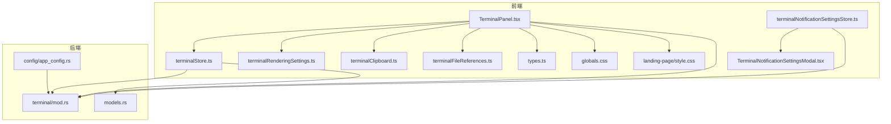
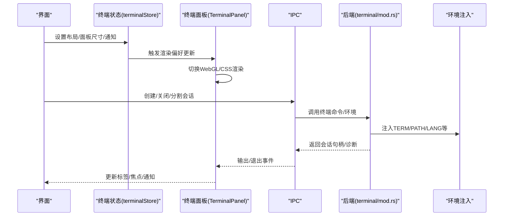
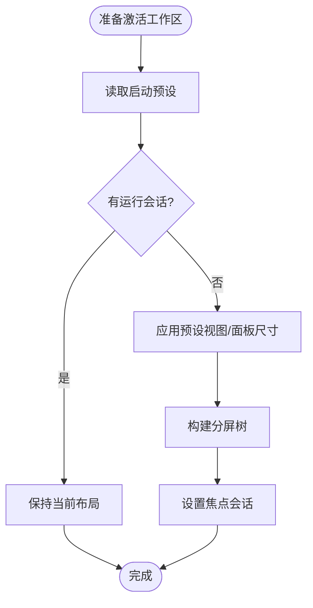
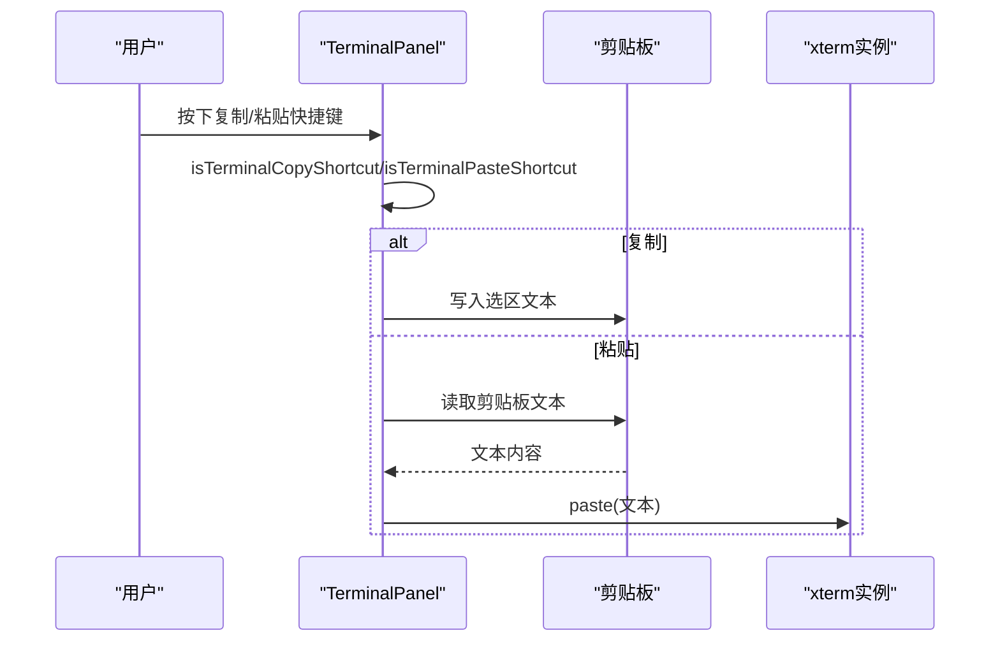
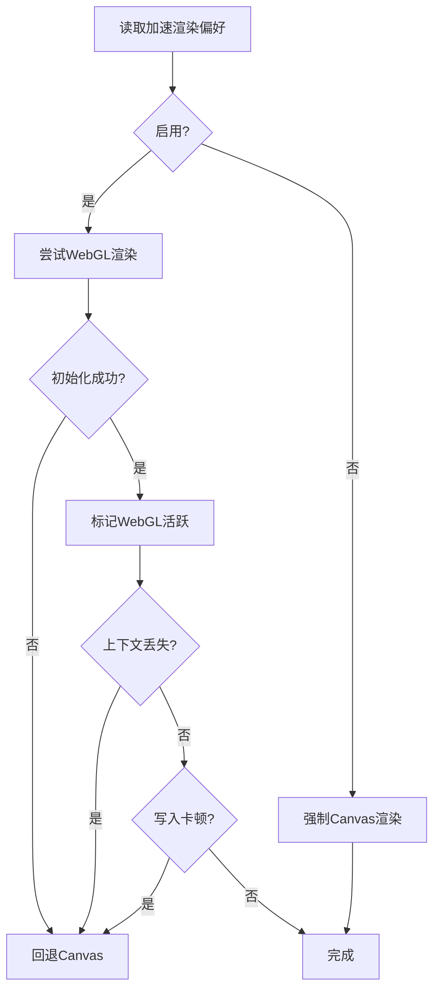
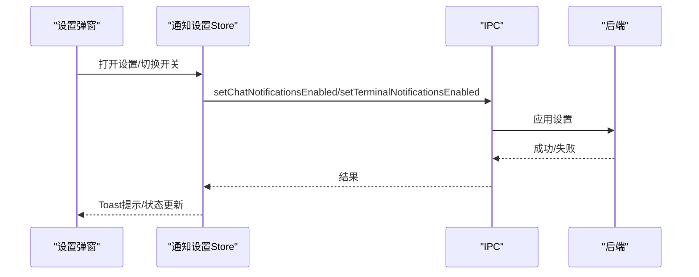
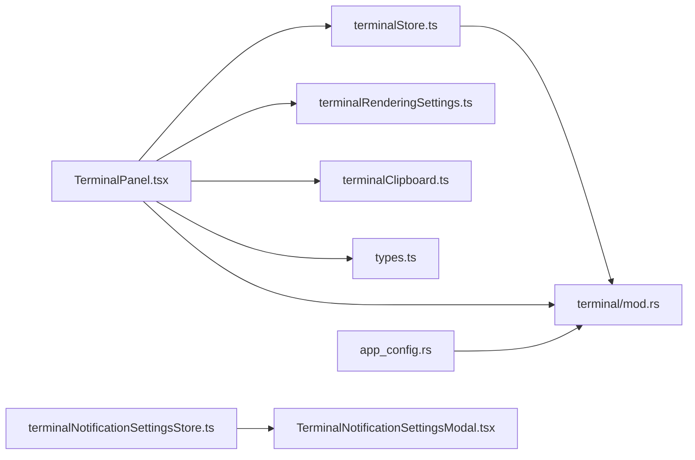

# 终端配置

<cite>
**本文引用的文件**
- [src/lib/terminalBootstrap.ts](file://src/lib/terminalBootstrap.ts)
- [src/lib/terminalClipboard.ts](file://src/lib/terminalClipboard.ts)
- [src/lib/terminalRenderingSettings.ts](file://src/lib/terminalRenderingSettings.ts)
- [src/stores/terminalStore.ts](file://src/stores/terminalStore.ts)
- [src/stores/terminalNotificationSettingsStore.ts](file://src/stores/terminalNotificationSettingsStore.ts)
- [src/components/shared/TerminalNotificationSettingsModal.tsx](file://src/components/shared/TerminalNotificationSettingsModal.tsx)
- [src/components/terminal/TerminalPanel.tsx](file://src/components/terminal/TerminalPanel.tsx)
- [src/lib/terminalFileReferences.ts](file://src/lib/terminalFileReferences.ts)
- [src/types.ts](file://src/types.ts)
- [src/i18n/resources/zh-CN/workspace.json](file://src/i18n/resources/zh-CN/workspace.json)
- [src/globals.css](file://src/globals.css)
- [landing-page/style.css](file://landing-page/style.css)
- [src-tauri/src/terminal/mod.rs](file://src-tauri/src/terminal/mod.rs)
- [src-tauri/src/config/app_config.rs](file://src-tauri/src/config/app_config.rs)
- [src-tauri/src/models.rs](file://src-tauri/src/models.rs)
</cite>

## 目录
1. [简介](#简介)
2. [项目结构](#项目结构)
3. [核心组件](#核心组件)
4. [架构总览](#架构总览)
5. [详细组件分析](#详细组件分析)
6. [依赖关系分析](#依赖关系分析)
7. [性能考虑](#性能考虑)
8. [故障排除指南](#故障排除指南)
9. [结论](#结论)
10. [附录](#附录)

## 简介
本文件面向终端系统的配置与使用，覆盖以下方面：
- 会话配置：字体、颜色主题、快捷键绑定、工作目录（含工作树）等
- 行为配置：复制/粘贴行为、滚动缓冲区、光标样式、渲染加速等
- 通知配置：终端通知开关、声音、集成安装与管理
- 会话持久化：启动预设、分组布局、面板尺寸、广播输入
- 多终端管理：分屏布局、会话树、焦点与活跃态
- 性能优化：WebGL 加速渲染、输出节流、上下文丢失降级
- 兼容性与故障排除：环境变量注入、平台差异、常见问题定位
- 常用配置组合与最佳实践

## 项目结构
终端系统由前端 React 组件与 Tauri 后端协作构成，状态通过 Zustand 管理，IPC 与后端通信，终端渲染采用 xterm.js 并支持 WebGL/CSS 渲染。

图表来源
- [src/components/terminal/TerminalPanel.tsx:1-200](file://src/components/terminal/TerminalPanel.tsx#L1-L200)
- [src/stores/terminalStore.ts:1-120](file://src/stores/terminalStore.ts#L1-L120)
- [src/stores/terminalNotificationSettingsStore.ts:1-120](file://src/stores/terminalNotificationSettingsStore.ts#L1-L120)
- [src/components/shared/TerminalNotificationSettingsModal.tsx:1-120](file://src/components/shared/TerminalNotificationSettingsModal.tsx#L1-L120)
- [src/lib/terminalRenderingSettings.ts:1-36](file://src/lib/terminalRenderingSettings.ts#L1-L36)
- [src/lib/terminalClipboard.ts:1-40](file://src/lib/terminalClipboard.ts#L1-L40)
- [src/lib/terminalFileReferences.ts:1-48](file://src/lib/terminalFileReferences.ts#L1-L48)
- [src/types.ts:1-200](file://src/types.ts#L1-L200)
- [src/globals.css:2704-3048](file://src/globals.css#L2704-L3048)
- [landing-page/style.css:933-1007](file://landing-page/style.css#L933-L1007)
- [src-tauri/src/terminal/mod.rs:1508-1719](file://src-tauri/src/terminal/mod.rs#L1508-L1719)
- [src-tauri/src/config/app_config.rs:355-399](file://src-tauri/src/config/app_config.rs#L355-L399)
- [src-tauri/src/models.rs:964-1001](file://src-tauri/src/models.rs#L964-L1001)

章节来源
- [src/components/terminal/TerminalPanel.tsx:1-200](file://src/components/terminal/TerminalPanel.tsx#L1-L200)
- [src/stores/terminalStore.ts:1-120](file://src/stores/terminalStore.ts#L1-L120)
- [src-tauri/src/terminal/mod.rs:1508-1719](file://src-tauri/src/terminal/mod.rs#L1508-L1719)

## 核心组件
- 终端状态与布局：Zustand 存储负责会话列表、分屏树、活跃/焦点会话、通知、启动预设等
- 终端渲染与加速：前端监听“加速渲染”偏好，动态启用 WebGL 或回退 Canvas；处理上下文丢失与写入卡顿
- 快捷键与剪贴板：统一的复制/粘贴快捷键判定，拦截并转发至终端
- 通知设置：终端通知开关、声音、集成安装与管理
- 环境注入：后端根据平台注入 TERM、COLORTERM、LANG 等环境变量

章节来源
- [src/stores/terminalStore.ts:413-525](file://src/stores/terminalStore.ts#L413-L525)
- [src/lib/terminalRenderingSettings.ts:1-36](file://src/lib/terminalRenderingSettings.ts#L1-L36)
- [src/components/terminal/TerminalPanel.tsx:681-795](file://src/components/terminal/TerminalPanel.tsx#L681-L795)
- [src/lib/terminalClipboard.ts:1-40](file://src/lib/terminalClipboard.ts#L1-L40)
- [src/stores/terminalNotificationSettingsStore.ts:105-200](file://src/stores/terminalNotificationSettingsStore.ts#L105-L200)
- [src-tauri/src/terminal/mod.rs:1574-1719](file://src-tauri/src/terminal/mod.rs#L1574-L1719)

## 架构总览
终端配置贯穿“前端状态—渲染—IPC—后端进程—环境注入”的链路，同时通过“启动预设—分屏树—会话元数据”实现会话持久化与多终端管理。

图表来源
- [src/stores/terminalStore.ts:437-501](file://src/stores/terminalStore.ts#L437-L501)
- [src/components/terminal/TerminalPanel.tsx:3011-3047](file://src/components/terminal/TerminalPanel.tsx#L3011-L3047)
- [src-tauri/src/terminal/mod.rs:1522-1530](file://src-tauri/src/terminal/mod.rs#L1522-L1530)

## 详细组件分析

### 会话与布局配置
- 默认尺寸与面板大小：默认列数、行数与面板尺寸范围控制
- 分屏树与布局模式：支持垂直/水平拆分，平衡二叉布局策略
- 活跃/焦点/广播：活跃组、焦点会话、广播输入控制
- 启动预设：保存/应用/序列化，支持“仅在无运行会话时应用”
- 工作树：按仓库生成工作树目录，支持分支前缀与基目录
- 工作目录解析：支持相对工作区、工作树、绝对路径三种基座

图表来源
- [src/stores/terminalStore.ts:754-797](file://src/stores/terminalStore.ts#L754-L797)
- [src/stores/terminalStore.ts:49-79](file://src/stores/terminalStore.ts#L49-L79)
- [src/stores/terminalStore.ts:696-711](file://src/stores/terminalStore.ts#L696-L711)

章节来源
- [src/stores/terminalStore.ts:23-37](file://src/stores/terminalStore.ts#L23-L37)
- [src/stores/terminalStore.ts:49-79](file://src/stores/terminalStore.ts#L49-L79)
- [src/stores/terminalStore.ts:696-711](file://src/stores/terminalStore.ts#L696-L711)
- [src/stores/terminalStore.ts:104-121](file://src/stores/terminalStore.ts#L104-L121)

### 字体、颜色主题与外观
- 字体与字号：终端内容使用等宽字体与行高，主题色变量定义终端背景、文本与光标
- 光标样式：禁用非活跃光标，启用闪烁
- 标签栏与分隔条：标签栏高度、关闭按钮显隐、分隔条交互
- 通知点与高亮：会话通知点、聚焦边框强调

章节来源
- [landing-page/style.css:933-1007](file://landing-page/style.css#L933-L1007)
- [src/globals.css:2704-3048](file://src/globals.css#L2704-L3048)
- [src/components/terminal/TerminalPanel.tsx:3011-3018](file://src/components/terminal/TerminalPanel.tsx#L3011-L3018)

### 快捷键与复制粘贴行为
- 复制/粘贴快捷键：统一判定 Ctrl+Shift+C/V 与 Shift+Insert
- 输入拦截：终端面板对特定快捷键进行拦截并转发
- 剪贴板读写：封装读取/写入剪贴板，错误日志上报

图表来源
- [src/lib/terminalClipboard.ts:9-39](file://src/lib/terminalClipboard.ts#L9-L39)
- [src/components/terminal/TerminalPanel.tsx:2185-2209](file://src/components/terminal/TerminalPanel.tsx#L2185-L2209)

章节来源
- [src/lib/terminalClipboard.ts:1-40](file://src/lib/terminalClipboard.ts#L1-L40)
- [src/components/terminal/TerminalPanel.tsx:2185-2223](file://src/components/terminal/TerminalPanel.tsx#L2185-L2223)

### 渲染加速与性能
- 加速渲染偏好：前端监听事件，动态启用 WebGL，必要时降级到 Canvas
- 上下文丢失处理：捕获 WebGL 上下文丢失事件，回退并刷新
- 输出卡顿检测：写入回调超时累计触发降级
- 图像增强：按需加载图像增强插件，记录能力与错误

图表来源
- [src/lib/terminalRenderingSettings.ts:14-36](file://src/lib/terminalRenderingSettings.ts#L14-L36)
- [src/components/terminal/TerminalPanel.tsx:722-795](file://src/components/terminal/TerminalPanel.tsx#L722-L795)
- [src/components/terminal/TerminalPanel.tsx:3011-3047](file://src/components/terminal/TerminalPanel.tsx#L3011-L3047)

章节来源
- [src/lib/terminalRenderingSettings.ts:1-36](file://src/lib/terminalRenderingSettings.ts#L1-L36)
- [src/components/terminal/TerminalPanel.tsx:681-795](file://src/components/terminal/TerminalPanel.tsx#L681-L795)

### 通知配置
- 开关与声音：分别控制聊天与终端通知，支持预览与安装集成
- 集成安装：支持 Claude/Codex 集成，自动检测冲突与路径
- 状态管理：加载、刷新、更新状态，失败提示与回滚

图表来源
- [src/stores/terminalNotificationSettingsStore.ts:142-212](file://src/stores/terminalNotificationSettingsStore.ts#L142-L212)
- [src/components/shared/TerminalNotificationSettingsModal.tsx:166-210](file://src/components/shared/TerminalNotificationSettingsModal.tsx#L166-L210)

章节来源
- [src/stores/terminalNotificationSettingsStore.ts:105-200](file://src/stores/terminalNotificationSettingsStore.ts#L105-L200)
- [src/components/shared/TerminalNotificationSettingsModal.tsx:34-120](file://src/components/shared/TerminalNotificationSettingsModal.tsx#L34-L120)

### 会话持久化与多终端管理
- 启动预设：保存当前布局为 JSON/TOML，支持默认视图、面板尺寸、分组与会话树
- 序列化/反序列化：运行时与预设之间的映射，比率裁剪与叶子节点替换
- 分组与广播：按组管理会话，支持启动时广播输入
- 工作树：为每个会话生成独立工作树，支持固定仓库模式

章节来源
- [src/stores/terminalStore.ts:548-591](file://src/stores/terminalStore.ts#L548-L591)
- [src/stores/terminalStore.ts:640-668](file://src/stores/terminalStore.ts#L640-L668)
- [src/stores/terminalStore.ts:484-498](file://src/stores/terminalStore.ts#L484-L498)
- [src/i18n/resources/zh-CN/workspace.json:51-168](file://src/i18n/resources/zh-CN/workspace.json#L51-L168)

### 环境注入与兼容性
- 环境变量：TERM、COLORTERM、LANG、LC_*、PATH 等，跨平台注入策略
- Windows 特殊路径：UserProfile/Home/LocalAppData/XDG 家目录映射
- 默认值：若未设置则提供合理默认（如 xterm-256color、truecolor、UTF-8）

章节来源
- [src-tauri/src/terminal/mod.rs:1574-1719](file://src-tauri/src/terminal/mod.rs#L1574-L1719)
- [src-tauri/src/config/app_config.rs:391-399](file://src-tauri/src/config/app_config.rs#L391-L399)

## 依赖关系分析
- 组件耦合：TerminalPanel 依赖 terminalStore、terminalRenderingSettings、terminalClipboard、types；通知弹窗依赖通知设置 Store
- 状态内聚：terminalStore 封装布局、分屏树、会话元数据、通知索引等
- 外部依赖：xterm/WebGL 插件、IPC 通道、后端终端进程

图表来源
- [src/components/terminal/TerminalPanel.tsx:1-60](file://src/components/terminal/TerminalPanel.tsx#L1-L60)
- [src/stores/terminalStore.ts:1-20](file://src/stores/terminalStore.ts#L1-L20)
- [src/stores/terminalNotificationSettingsStore.ts:1-10](file://src/stores/terminalNotificationSettingsStore.ts#L1-L10)
- [src-tauri/src/terminal/mod.rs:1508-1530](file://src-tauri/src/terminal/mod.rs#L1508-L1530)
- [src-tauri/src/config/app_config.rs:355-399](file://src-tauri/src/config/app_config.rs#L355-L399)

章节来源
- [src/components/terminal/TerminalPanel.tsx:1-60](file://src/components/terminal/TerminalPanel.tsx#L1-L60)
- [src/stores/terminalStore.ts:1-20](file://src/stores/terminalStore.ts#L1-L20)
- [src/stores/terminalNotificationSettingsStore.ts:1-10](file://src/stores/terminalNotificationSettingsStore.ts#L1-L10)

## 性能考虑
- 渲染路径选择：优先 WebGL，上下文丢失或写入卡顿时回退 Canvas
- 输出节流：限制最小发射间隔、最大字节数与缓冲容量，避免内存峰值
- 重绘优化：按区域刷新，减少全量重绘
- 环境注入：避免频繁 PATH 变更，合并前置路径

章节来源
- [src/components/terminal/TerminalPanel.tsx:722-795](file://src/components/terminal/TerminalPanel.tsx#L722-L795)
- [src-tauri/src/models.rs:964-1001](file://src-tauri/src/models.rs#L964-L1001)

## 故障排除指南
- 终端无输出或卡顿
  - 检查是否处于 WebGL 上下文丢失状态，确认回退到 Canvas 后刷新
  - 查看输出队列与丢弃统计，定位写入卡顿窗口
- 复制/粘贴异常
  - 确认快捷键组合正确（Ctrl+Shift+C/V、Shift+Insert）
  - 检查剪贴板权限与跨平台限制
- 渲染异常
  - 关闭加速渲染偏好，观察是否恢复
  - 检查图形驱动与浏览器兼容性
- 通知不生效
  - 检查终端通知开关与声音设置
  - 重新安装集成（Claude/Codex），解决冲突与路径问题
- 工作树/工作目录问题
  - 校验工作树基目录与分支前缀，确保仓库路径有效
  - 使用“仅在无运行会话时应用”避免覆盖当前会话

章节来源
- [src/components/terminal/TerminalPanel.tsx:681-795](file://src/components/terminal/TerminalPanel.tsx#L681-L795)
- [src/lib/terminalClipboard.ts:9-39](file://src/lib/terminalClipboard.ts#L9-L39)
- [src/stores/terminalNotificationSettingsStore.ts:282-310](file://src/stores/terminalNotificationSettingsStore.ts#L282-L310)
- [src/stores/terminalStore.ts:696-711](file://src/stores/terminalStore.ts#L696-L711)

## 结论
该终端系统通过前端状态与渲染、后端环境注入与进程管理的协同，提供了可配置、可扩展且高性能的终端体验。借助启动预设与分屏树，实现了会话持久化与多终端高效管理；通过通知与渲染偏好，满足不同场景下的可用性与性能需求。

## 附录

### 常用配置组合与最佳实践
- 开发调试
  - 启用加速渲染，使用 WebGL；开启通知声音；设置工作树为“固定仓库”，便于隔离分支
- 高负载/低配设备
  - 关闭加速渲染，强制 Canvas；降低面板尺寸；启用输出节流
- 多会话协作
  - 使用分屏树与广播输入；为每个会话设置独立工作树；保存启动预设以便快速恢复
- 快捷键与剪贴板
  - 统一使用 Ctrl+Shift+C/V 与 Shift+Insert；在 Linux/Windows 下注意平台差异

章节来源
- [src/stores/terminalStore.ts:640-668](file://src/stores/terminalStore.ts#L640-L668)
- [src/components/terminal/TerminalPanel.tsx:722-795](file://src/components/terminal/TerminalPanel.tsx#L722-L795)
- [src/lib/terminalClipboard.ts:9-39](file://src/lib/terminalClipboard.ts#L9-L39)
- [src/i18n/resources/zh-CN/workspace.json:51-168](file://src/i18n/resources/zh-CN/workspace.json#L51-L168)