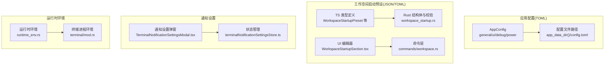
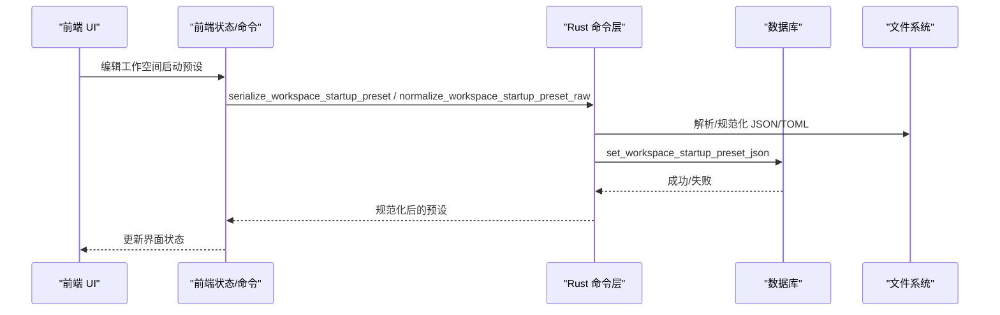
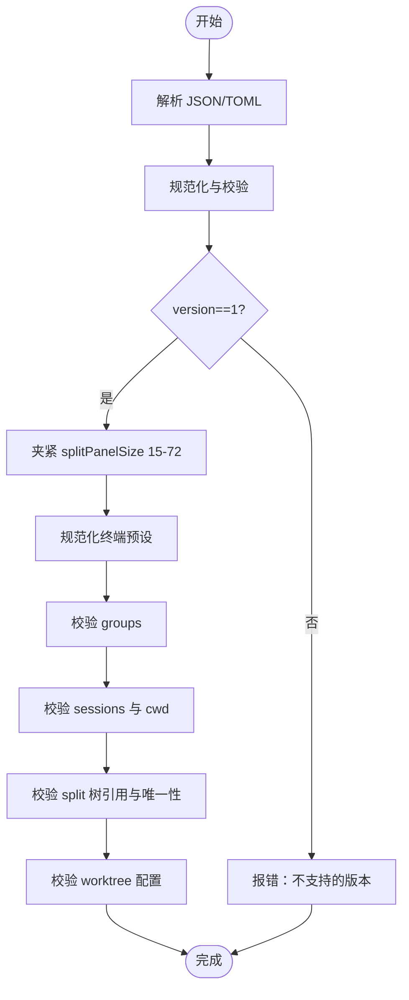
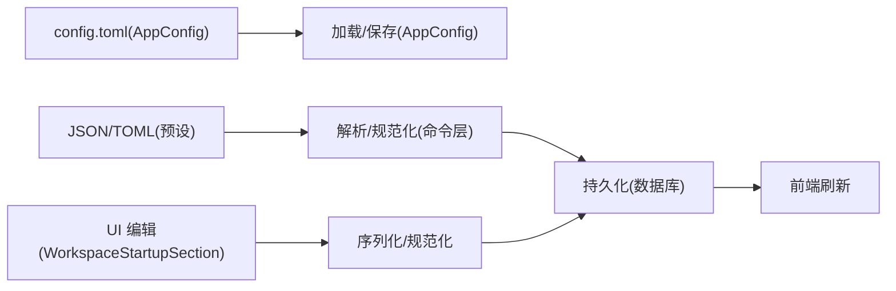

# 配置参考

<cite>
**本文引用的文件**
- [src-tauri/src/config/app_config.rs](file://src-tauri/src/config/app_config.rs)
- [src-tauri/src/config/mod.rs](file://src-tauri/src/config/mod.rs)
- [src-tauri/tauri.conf.json](file://src-tauri/tauri.conf.json)
- [src-tauri/src/workspace_startup.rs](file://src-tauri/src/workspace_startup.rs)
- [src-tauri/src/commands/workspace.rs](file://src-tauri/src/commands/workspace.rs)
- [src/types.ts](file://src/types.ts)
- [src/components/workspace/WorkspaceStartupSection.tsx](file://src/components/workspace/WorkspaceStartupSection.tsx)
- [src/stores/terminalStore.ts](file://src/stores/terminalStore.ts)
- [src/stores/terminalStore.multiSession.test.ts](file://src/stores/terminalStore.multiSession.test.ts)
- [src/components/shared/TerminalNotificationSettingsModal.tsx](file://src/components/shared/TerminalNotificationSettingsModal.tsx)
- [src/stores/terminalNotificationSettingsStore.ts](file://src/stores/terminalNotificationSettingsStore.ts)
- [src-tauri/src/runtime_env.rs](file://src-tauri/src/runtime_env.rs)
- [src-tauri/src/terminal/mod.rs](file://src-tauri/src/terminal/mod.rs)
</cite>

## 目录
1. [简介](#简介)
2. [项目结构](#项目结构)
3. [核心组件](#核心组件)
4. [架构总览](#架构总览)
5. [详细组件分析](#详细组件分析)
6. [依赖关系分析](#依赖关系分析)
7. [性能考量](#性能考量)
8. [故障排除指南](#故障排除指南)
9. [结论](#结论)
10. [附录](#附录)

## 简介
本文件为 Panes 配置系统的完整参考，涵盖应用配置、工作空间启动预设（终端与视图）、引擎与模型、通知设置、以及运行时环境与终端进程环境注入等层面。文档面向用户与开发者，提供配置项清单、默认值、取值范围、优先级与生效方式、配置文件格式、加载顺序与覆盖规则、环境变量支持、配置示例、迁移指南与故障排除建议。

## 项目结构
- 应用配置（Rust）：位于 src-tauri/src/config/app_config.rs，以 TOML 文件形式存储于应用数据目录。
- 工作空间启动预设（Rust/TS）：在 Rust 中定义结构体与规范化逻辑，在前端 TS 类型与 UI 组件中呈现与编辑。
- 前端类型与 UI：在 src/types.ts 定义 TS 类型；在 WorkspaceStartupSection.tsx 提供可视化编辑器。
- 通知设置：在前端组件与状态管理中提供聊天与终端通知开关与声音选择。
- 运行时环境：在 runtime_env.rs 与 terminal/mod.rs 中处理应用数据目录、路径增强、登录 shell 环境注入与终端进程环境变量。

图表来源
- [src-tauri/src/config/app_config.rs:12-138](file://src-tauri/src/config/app_config.rs#L12-L138)
- [src-tauri/src/workspace_startup.rs:60-139](file://src-tauri/src/workspace_startup.rs#L60-L139)
- [src/types.ts:93-144](file://src/types.ts#L93-L144)
- [src/components/workspace/WorkspaceStartupSection.tsx:40-90](file://src/components/workspace/WorkspaceStartupSection.tsx#L40-L90)
- [src-tauri/src/commands/workspace.rs:209-277](file://src-tauri/src/commands/workspace.rs#L209-L277)
- [src/components/shared/TerminalNotificationSettingsModal.tsx:34-197](file://src/components/shared/TerminalNotificationSettingsModal.tsx#L34-L197)
- [src/stores/terminalNotificationSettingsStore.ts:25-241](file://src/stores/terminalNotificationSettingsStore.ts#L25-L241)
- [src-tauri/src/runtime_env.rs:53-69](file://src-tauri/src/runtime_env.rs#L53-L69)
- [src-tauri/src/terminal/mod.rs:1604-1790](file://src-tauri/src/terminal/mod.rs#L1604-L1790)

章节来源
- [src-tauri/src/config/app_config.rs:12-138](file://src-tauri/src/config/app_config.rs#L12-L138)
- [src-tauri/src/workspace_startup.rs:60-139](file://src-tauri/src/workspace_startup.rs#L60-L139)
- [src/types.ts:93-144](file://src/types.ts#L93-L144)
- [src/components/workspace/WorkspaceStartupSection.tsx:40-90](file://src/components/workspace/WorkspaceStartupSection.tsx#L40-L90)
- [src-tauri/src/commands/workspace.rs:209-277](file://src-tauri/src/commands/workspace.rs#L209-L277)
- [src/components/shared/TerminalNotificationSettingsModal.tsx:34-197](file://src/components/shared/TerminalNotificationSettingsModal.tsx#L34-L197)
- [src/stores/terminalNotificationSettingsStore.ts:25-241](file://src/stores/terminalNotificationSettingsStore.ts#L25-L241)
- [src-tauri/src/runtime_env.rs:53-69](file://src-tauri/src/runtime_env.rs#L53-L69)
- [src-tauri/src/terminal/mod.rs:1604-1790](file://src-tauri/src/terminal/mod.rs#L1604-L1790)

## 核心组件
- 应用配置（AppConfig）
  - 分类：general、ui、debug、power
  - 默认值：按各字段默认实现，如主题 dark、默认引擎 codex、默认模型 gpt-5.4、UI 尺寸与字体等
  - 存储：TOML 文件，路径由运行时环境决定
- 工作空间启动预设（WorkspaceStartupPreset）
  - 字段：version、defaultView、splitPanelSize、terminal
  - 终端预设：groups、activeGroupId、focusedSessionId、applyWhen
  - 会话：id、title、cwd、cwdBase、harnessId、launchHarnessOnCreate
  - 分割树：leaf/split 节点，含方向与比例
- 通知设置（TerminalNotificationSettings）
  - 聊天通知、终端通知开关
  - 声音选择（平台默认或 Glass 等）
- 运行时环境（runtime_env、terminal）
  - 应用数据目录解析与迁移
  - 登录 shell 环境注入
  - 终端进程环境变量注入（XDG_*、LANG/LC_*、TMP/TEMP 等）

章节来源
- [src-tauri/src/config/app_config.rs:12-138](file://src-tauri/src/config/app_config.rs#L12-L138)
- [src-tauri/src/workspace_startup.rs:60-139](file://src-tauri/src/workspace_startup.rs#L60-L139)
- [src/types.ts:93-144](file://src/types.ts#L93-L144)
- [src/components/shared/TerminalNotificationSettingsModal.tsx:24-28](file://src/components/shared/TerminalNotificationSettingsModal.tsx#L24-L28)
- [src-tauri/src/runtime_env.rs:53-69](file://src-tauri/src/runtime_env.rs#L53-L69)
- [src-tauri/src/terminal/mod.rs:1604-1790](file://src-tauri/src/terminal/mod.rs#L1604-L1790)

## 架构总览
应用配置与工作空间启动预设通过命令层进行序列化/反序列化与持久化，前端类型与 UI 负责编辑与展示，通知设置与运行时环境分别影响应用行为与终端进程。

图表来源
- [src-tauri/src/commands/workspace.rs:209-277](file://src-tauri/src/commands/workspace.rs#L209-L277)
- [src-tauri/src/workspace_startup.rs:141-167](file://src-tauri/src/workspace_startup.rs#L141-L167)

章节来源
- [src-tauri/src/commands/workspace.rs:209-277](file://src-tauri/src/commands/workspace.rs#L209-L277)
- [src-tauri/src/workspace_startup.rs:141-167](file://src-tauri/src/workspace_startup.rs#L141-L167)

## 详细组件分析

### 应用配置（AppConfig）
- 配置文件位置
  - 路径：应用数据目录下的 config.toml
  - 计算：根据平台与环境变量解析，必要时迁移旧目录
- 结构与默认值
  - general：theme、default_engine、default_model、locale、terminal_accelerated_rendering、chat_notifications、terminal_notifications、notification_sound
  - ui：sidebar_width、git_panel_width、font_size
  - debug：persist_engine_event_logs、max_action_output_chars
  - power：keep_awake_enabled、prevent_display_sleep、prevent_screen_saver、ac_only_mode、battery_threshold、session_duration_secs、prevent_closed_display_sleep
- 默认行为
  - notification_sound：未设置时返回平台默认（macOS Glass），显式设置为 none 则禁用
  - terminal_accelerated_rendering_enabled：未设置时默认启用
  - terminal_notifications_enabled：未设置时默认禁用
- 加载与保存
  - 首次不存在则生成默认配置并保存
  - 保存采用临时文件写入后原子替换策略（Windows 使用备份恢复策略）
- 环境变量支持
  - 应用数据目录解析受 HOME/USERPROFILE/LOCALAPPDATA/APPDATA 等影响
  - 终端进程环境注入支持 XDG_*、LANG/LC_*、TMP/TEMP/TMPDIR 等

章节来源
- [src-tauri/src/config/app_config.rs:12-138](file://src-tauri/src/config/app_config.rs#L12-L138)
- [src-tauri/src/config/app_config.rs:153-204](file://src-tauri/src/config/app_config.rs#L153-L204)
- [src-tauri/src/config/app_config.rs:235-265](file://src-tauri/src/config/app_config.rs#L235-L265)
- [src-tauri/src/runtime_env.rs:53-69](file://src-tauri/src/runtime_env.rs#L53-L69)
- [src-tauri/src/terminal/mod.rs:1604-1790](file://src-tauri/src/terminal/mod.rs#L1604-L1790)

### 工作空间启动预设（WorkspaceStartupPreset）
- 数据模型
  - 版本：当前版本为 1
  - defaultView：可选 chat/split/terminal/editor
  - splitPanelSize：面板大小，范围 15-72，默认 32
  - terminal：终端组集合，包含 groups、activeGroupId、focusedSessionId、applyWhen
  - groups：包含 id/name/broadcastOnStart/worktree/sessions/root
  - sessions：包含 id/title/cwd/cwdBase/harnessId/launchHarnessOnCreate
  - split 树：leaf 指向 sessionId，split 含 direction/ratio/children
- 规范化与校验
  - 版本必须为 1
  - splitPanelSize 夹紧到 15-72
  - groups 内部 id/name 非空且唯一；sessions 内部 id 唯一；root 引用必须覆盖所有 session 一次
  - cwdBase=worktree 时需启用 worktree 且不能使用父目录段
  - worktree.repoMode=active_repo 时 repoPath 清空；=fixed_repo 时 repoPath 必填且为现有 Git 仓库
  - 只能有一个 group 开启 broadcastOnStart
- 前端编辑与导出
  - UI 支持创建默认组与会话、调整分割树、导出 JSON/TOML
  - 导出文件名基于工作空间名称或根路径生成
- 应用时机
  - applyWhen=no_live_sessions：仅在无活动会话时应用
  - 材质化流程会关闭现有会话、可选移除 worktree、应用预设并更新状态

图表来源
- [src-tauri/src/workspace_startup.rs:169-199](file://src-tauri/src/workspace_startup.rs#L169-L199)
- [src-tauri/src/workspace_startup.rs:201-238](file://src-tauri/src/workspace_startup.rs#L201-L238)
- [src-tauri/src/workspace_startup.rs:298-344](file://src-tauri/src/workspace_startup.rs#L298-L344)
- [src-tauri/src/workspace_startup.rs:650-684](file://src-tauri/src/workspace_startup.rs#L650-L684)
- [src-tauri/src/workspace_startup.rs:406-459](file://src-tauri/src/workspace_startup.rs#L406-L459)

章节来源
- [src-tauri/src/workspace_startup.rs:60-139](file://src-tauri/src/workspace_startup.rs#L60-L139)
- [src-tauri/src/workspace_startup.rs:169-199](file://src-tauri/src/workspace_startup.rs#L169-L199)
- [src-tauri/src/workspace_startup.rs:201-238](file://src-tauri/src/workspace_startup.rs#L201-L238)
- [src-tauri/src/workspace_startup.rs:298-344](file://src-tauri/src/workspace_startup.rs#L298-L344)
- [src-tauri/src/workspace_startup.rs:650-684](file://src-tauri/src/workspace_startup.rs#L650-L684)
- [src-tauri/src/workspace_startup.rs:406-459](file://src-tauri/src/workspace_startup.rs#L406-L459)
- [src/components/workspace/WorkspaceStartupSection.tsx:40-90](file://src/components/workspace/WorkspaceStartupSection.tsx#L40-L90)
- [src/components/workspace/WorkspaceStartupSection.tsx:247-266](file://src/components/workspace/WorkspaceStartupSection.tsx#L247-L266)
- [src-tauri/src/commands/workspace.rs:209-277](file://src-tauri/src/commands/workspace.rs#L209-L277)

### 通知设置（聊天与终端）
- 设置项
  - chatEnabled、terminalEnabled：布尔开关
  - terminalSetupComplete：终端通知集成是否已配置
  - notificationSound：声音名称或禁用
  - 集成状态：claude/codex 的配置路径、存在性、冲突与详情
- 前端交互
  - 弹窗展示与切换
  - 成功/失败提示
- 生效方式
  - 通过 IPC 调用设置接口更新状态

章节来源
- [src/types.ts:63-70](file://src/types.ts#L63-L70)
- [src/components/shared/TerminalNotificationSettingsModal.tsx:34-197](file://src/components/shared/TerminalNotificationSettingsModal.tsx#L34-L197)
- [src/stores/terminalNotificationSettingsStore.ts:25-241](file://src/stores/terminalNotificationSettingsStore.ts#L25-L241)

### 运行时环境与终端进程环境
- 应用数据目录
  - 解析顺序：Windows Local/Roaming/AppData，Unix HOME/.local/share 或 XDG_DATA_HOME
  - 支持迁移旧目录
- 登录 shell 环境注入
  - 在非 Windows 平台探测登录 shell 输出，合并到子进程环境
- 终端进程环境变量
  - 注入 XDG_CONFIG_HOME/DATA/HOME/CACHE/STATE_HOME、LANG/LC_*、TMP/TEMP/TMPDIR 等
  - 确保相关目录存在

章节来源
- [src-tauri/src/runtime_env.rs:53-69](file://src-tauri/src/runtime_env.rs#L53-L69)
- [src-tauri/src/runtime_env.rs:107-173](file://src-tauri/src/runtime_env.rs#L107-L173)
- [src-tauri/src/terminal/mod.rs:1604-1790](file://src-tauri/src/terminal/mod.rs#L1604-L1790)

## 依赖关系分析
- 配置文件格式
  - 应用配置：TOML（AppConfig）
  - 工作空间启动预设：JSON/TOML（前端导出/导入）
- 命令层
  - serialize_workspace_startup_preset：序列化预设
  - normalize_workspace_startup_preset_raw：解析原始文本并规范化
  - set_workspace_startup_preset / set_workspace_startup_preset_raw：持久化预设
  - export_workspace_startup_preset：导出已保存预设
- 前端类型与 UI
  - TS 类型与 UI 组件负责编辑与导出
- 状态与存储
  - 终端状态管理与工作空间启动预设应用流程

图表来源
- [src-tauri/src/config/app_config.rs:153-204](file://src-tauri/src/config/app_config.rs#L153-L204)
- [src-tauri/src/commands/workspace.rs:209-277](file://src-tauri/src/commands/workspace.rs#L209-L277)
- [src/components/workspace/WorkspaceStartupSection.tsx:247-266](file://src/components/workspace/WorkspaceStartupSection.tsx#L247-L266)

章节来源
- [src-tauri/src/config/app_config.rs:153-204](file://src-tauri/src/config/app_config.rs#L153-L204)
- [src-tauri/src/commands/workspace.rs:209-277](file://src-tauri/src/commands/workspace.rs#L209-L277)
- [src/components/workspace/WorkspaceStartupSection.tsx:247-266](file://src/components/workspace/WorkspaceStartupSection.tsx#L247-L266)

## 性能考量
- 配置文件读写
  - AppConfig 采用一次性读取/写入，保存时先写临时文件再原子替换，避免部分写入导致损坏
  - Windows 平台采用备份恢复策略，提升可靠性
- 预设规范化
  - 校验与路径解析在 Rust 层执行，减少前端重复计算
  - split 树与引用校验复杂度与节点数量线性相关
- 终端进程环境
  - 注入环境变量前进行路径存在性检查，避免无效 I/O

章节来源
- [src-tauri/src/config/app_config.rs:235-265](file://src-tauri/src/config/app_config.rs#L235-L265)
- [src-tauri/src/workspace_startup.rs:650-684](file://src-tauri/src/workspace_startup.rs#L650-L684)
- [src-tauri/src/terminal/mod.rs:1757-1762](file://src-tauri/src/terminal/mod.rs#L1757-L1762)

## 故障排除指南
- 预设版本不支持
  - 现象：导入/保存时报版本错误
  - 排查：确认 version=1；若为旧版本请迁移
- splitPanelSize 超界
  - 现象：显示异常或被夹紧
  - 排查：确保在 15-72 范围内
- 会话 ID 重复或引用未知
  - 现象：校验失败
  - 排查：确保 groups 内部与跨组 session id 唯一；root 引用必须覆盖全部 session 且不重复
- cwdBase=worktree 但未启用 worktree
  - 现象：校验失败
  - 排查：开启 worktree.enabled 或改为 workspace/absolute
- worktree.repoMode=fixed_repo 但缺少 repoPath
  - 现象：校验失败
  - 排查：提供相对工作空间根的有效 Git 仓库路径
- 应用配置无法保存/损坏
  - 现象：保存失败或文件损坏
  - 排查：检查应用数据目录权限；Windows 平台留意 .bak 备份文件
- 通知设置未生效
  - 现象：切换后无变化
  - 排查：确认集成状态（配置路径、冲突）；尝试重新安装集成

章节来源
- [src-tauri/src/workspace_startup.rs:180-199](file://src-tauri/src/workspace_startup.rs#L180-L199)
- [src-tauri/src/workspace_startup.rs:265-295](file://src-tauri/src/workspace_startup.rs#L265-L295)
- [src-tauri/src/workspace_startup.rs:370-403](file://src-tauri/src/workspace_startup.rs#L370-L403)
- [src-tauri/src/workspace_startup.rs:433-458](file://src-tauri/src/workspace_startup.rs#L433-L458)
- [src-tauri/src/config/app_config.rs:235-265](file://src-tauri/src/config/app_config.rs#L235-L265)
- [src-tauri/src/commands/workspace.rs:209-277](file://src-tauri/src/commands/workspace.rs#L209-L277)

## 结论
Panes 配置系统以清晰的分层设计实现应用配置、工作空间启动预设、通知设置与运行时环境管理。通过严格的规范化与校验、可靠的文件写入策略、以及直观的前端编辑体验，用户与开发者可以高效地定制应用行为并获得稳定的运行体验。

## 附录

### 配置项与默认值总览
- 应用配置（AppConfig）
  - general.theme：默认 dark
  - general.default_engine：默认 codex
  - general.default_model：默认 gpt-5.4
  - general.terminal_accelerated_rendering：未设置时默认启用
  - general.chat_notifications：未设置时默认禁用
  - general.terminal_notifications：未设置时默认禁用
  - general.notification_sound：未设置时返回平台默认（macOS Glass）
  - ui.sidebar_width：默认 260
  - ui.git_panel_width：默认 380
  - ui.font_size：默认 13
  - debug.persist_engine_event_logs：默认 false
  - debug.max_action_output_chars：默认 20000
  - power.keep_awake_enabled：默认 false
  - power.prevent_display_sleep：默认 false
  - power.prevent_screen_saver：默认 false
  - power.ac_only_mode：默认 false
  - power.battery_threshold：默认 None
  - power.session_duration_secs：默认 None
  - power.prevent_closed_display_sleep：默认 false
- 工作空间启动预设
  - version：默认 1
  - defaultView：默认 chat
  - splitPanelSize：默认 32（范围 15-72）
  - terminal.applyWhen：默认 no_live_sessions
  - terminal.groups[*].broadcastOnStart：默认 false
  - terminal.groups[*].sessions[*].cwdBase：默认 workspace
  - terminal.groups[*].sessions[*].launchHarnessOnCreate：默认与 harnessId 是否存在相关

章节来源
- [src-tauri/src/config/app_config.rs:68-127](file://src-tauri/src/config/app_config.rs#L68-L127)
- [src-tauri/src/config/app_config.rs:83-94](file://src-tauri/src/config/app_config.rs#L83-L94)
- [src-tauri/src/workspace_startup.rs:62-139](file://src-tauri/src/workspace_startup.rs#L62-L139)
- [src/components/workspace/WorkspaceStartupSection.tsx:40-90](file://src/components/workspace/WorkspaceStartupSection.tsx#L40-L90)

### 配置文件格式与示例
- 应用配置（TOML）
  - 文件：config.toml
  - 示例字段（不含注释）：general.theme、general.default_engine、general.default_model、ui.sidebar_width、ui.git_panel_width、ui.font_size、debug.persist_engine_event_logs、debug.max_action_output_chars、power.keep_awake_enabled 等
- 工作空间启动预设（JSON/TOML）
  - 文件：由前端导出，扩展名为 .json 或 .toml
  - 示例字段：version、defaultView、splitPanelSize、terminal.groups[*].id/name/sessions[*].id/cwd/cwdBase 等

章节来源
- [src-tauri/src/config/app_config.rs:188-199](file://src-tauri/src/config/app_config.rs#L188-L199)
- [src-tauri/src/workspace_startup.rs:155-167](file://src-tauri/src/workspace_startup.rs#L155-L167)
- [src/components/workspace/WorkspaceStartupSection.tsx:247-266](file://src/components/workspace/WorkspaceStartupSection.tsx#L247-L266)

### 加载顺序与覆盖规则
- 应用配置
  - 首次加载：若不存在则生成默认配置并保存
  - 后续加载：从 config.toml 读取，忽略未知字段
  - 保存：写入临时文件后原子替换，Windows 使用备份恢复策略
- 工作空间启动预设
  - 前端编辑后通过命令层规范化并持久化到数据库
  - 应用时遵循 applyWhen=no_live_sessions 的条件
- 通知设置
  - 通过 IPC 更新状态，前端状态管理维护最新值

章节来源
- [src-tauri/src/config/app_config.rs:172-186](file://src-tauri/src/config/app_config.rs#L172-L186)
- [src-tauri/src/config/app_config.rs:188-199](file://src-tauri/src/config/app_config.rs#L188-L199)
- [src-tauri/src/commands/workspace.rs:242-277](file://src-tauri/src/commands/workspace.rs#L242-L277)
- [src/stores/terminalStore.ts:960-1350](file://src/stores/terminalStore.ts#L960-L1350)

### 环境变量支持
- 应用数据目录
  - Windows：LOCALAPPDATA/APPDATA/USERPROFILE
  - Unix：XDG_DATA_HOME 或 HOME/.local/share
- 终端进程环境
  - XDG_CONFIG_HOME、XDG_DATA_HOME、XDG_CACHE_HOME、XDG_STATE_HOME
  - LANG、LC_CTYPE、LC_ALL
  - TMP、TEMP、TMPDIR
- 登录 shell 环境
  - 非 Windows 平台探测登录 shell 输出并合并到子进程环境

章节来源
- [src-tauri/src/runtime_env.rs:53-69](file://src-tauri/src/runtime_env.rs#L53-L69)
- [src-tauri/src/terminal/mod.rs:1604-1790](file://src-tauri/src/terminal/mod.rs#L1604-L1790)
- [src-tauri/src/runtime_env.rs:107-173](file://src-tauri/src/runtime_env.rs#L107-L173)

### 配置迁移指南
- 应用配置
  - 首次加载自动迁移旧目录（若存在）
  - 若需要手动迁移，确保新路径可写，然后将旧配置移动至新路径
- 工作空间启动预设
  - 保持 JSON/TOML 文本不变，导入时由命令层自动规范化
  - 如遇版本问题，请确认 version=1

章节来源
- [src-tauri/src/config/app_config.rs:172-186](file://src-tauri/src/config/app_config.rs#L172-L186)
- [src-tauri/src/workspace_startup.rs:180-185](file://src-tauri/src/workspace_startup.rs#L180-L185)